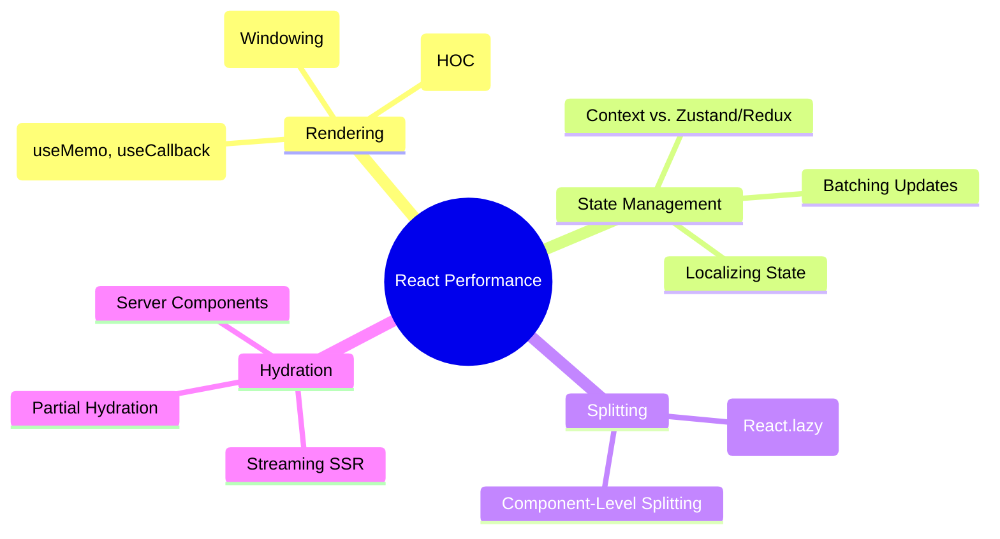

# React Performance Optimization

Strategies for building high-performance React applications, focusing on rendering efficiency and state management.

## 🗺️ React Performance Mindmap

## 📂 Key Topics

- **Preventing Re-renders:** Deep dive into how props and state changes trigger renders.
- **List Optimization:** Using `react-window` or `react-virtualized` for long lists.
- **Concurrent Features:** Leveraging `useTransition` and `useDeferredValue`.
