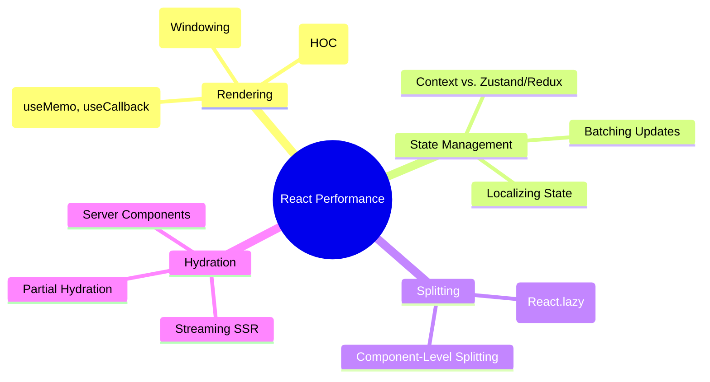

# React Performance Optimization

Strategies for building high-performance React applications, focusing on rendering efficiency and state management.

## React Performance Mindmap

---

## ⚡ The React Rendering Lifecycle

1. **Trigger:** State change or parent re-render.
2. **Render:** React calls your components and calculates the "diff" (Reconciliation).
3. **Commit:** React applies the changes to the real DOM.

### 🚫 Common Pitfall: Unnecessary Re-renders

By default, when a parent renders, **all its children render**, even if their props didn't change.

---

## 🛠️ Optimization Patterns

### 1. Memoization (`useMemo`, `useCallback`, `React.memo`)

- **`React.memo`:** Wraps a component to prevent re-renders if props are shallowly equal.
- **`useCallback`:** Memoizes a function instance so it doesn't break `React.memo` on children.
- **`useMemo`:** Memoizes a computed value (expensive calculation).

### 2. Windowing / Virtualization

For lists with thousands of items, only render the items currently visible in the viewport.

- **Library:** `react-window`, `react-virtualized`.

### 3. State Colocation

Keep state as close to where it's used as possible. Moving state "up" globally causes the entire app to re-render.

---

## 🚀 Concurrent React (React 18+)

### 1. `useTransition`

Allows you to mark state updates as "non-urgent". Urgent updates (typing) interrupt non-urgent updates (filtering a list), keeping the UI responsive.

### 2. `useDeferredValue`

Similar to debouncing, but handled by React's scheduler. It defers re-rendering a part of the UI until the main thread is idle.

---

## Key Topics Summary

- **Preventing Re-renders:** Deep dive into how props and state changes trigger renders and how to bail out.
- **List Optimization:** Using `react-window` or `react-virtualized` for efficient rendering of long lists.
- **Concurrent Features:** Leveraging `useTransition` and `useDeferredValue` for a non-blocking UI.

---

## Senior/Staff Level "Grill" Questions

### Q1: Why is "Over-memoization" a potential performance anti-pattern?

> **Answer:** Memoization isn't free. Every `useMemo` or `useCallback` has a memory cost (storing dependencies) and an execution cost (shallow-comparing the dependency array on every render).
>
> - **Verdict:** Only memoize when a component is actually expensive or when passing props to a `React.memo` child.

### Q2: Explain the "Context API" performance bottleneck and how to solve it.

> **Answer:** When a Context value changes, **every** component that consumes that context re-renders.
>
> - **Solutions:**
>   1. **Split Contexts:** Use separate contexts for data that changes at different frequencies.
>   2. **Memoize the Consumer:** Wrap the consumer's children in `useMemo`.
>   3. **External Stores:** Use libraries like **Zustand** or **Recoil** which use "selectors" to only trigger renders for specific state slices.

### Q3: How do "React Server Components" (RSC) fundamentally change performance?

> **Answer:** RSCs never hydrate on the client. They execute only on the server, and their code is never sent to the browser.
>
> - **Impact:** This eliminates the "Double Data Problem" (JSON + HTML) and reduces the JS bundle size to near-zero for static parts of a dynamic page.

### Q4: What is "Tearing" in the context of Concurrent Rendering?

> **Answer:** Tearing occurs when the UI shows different values for the same state in different parts of the screen during a single render (e.g., an external store updates while React is yielding to the main thread).
>
> - **Solution:** Use the `useSyncExternalStore` hook to ensure consistency when using non-React state stores in Concurrent Mode.
