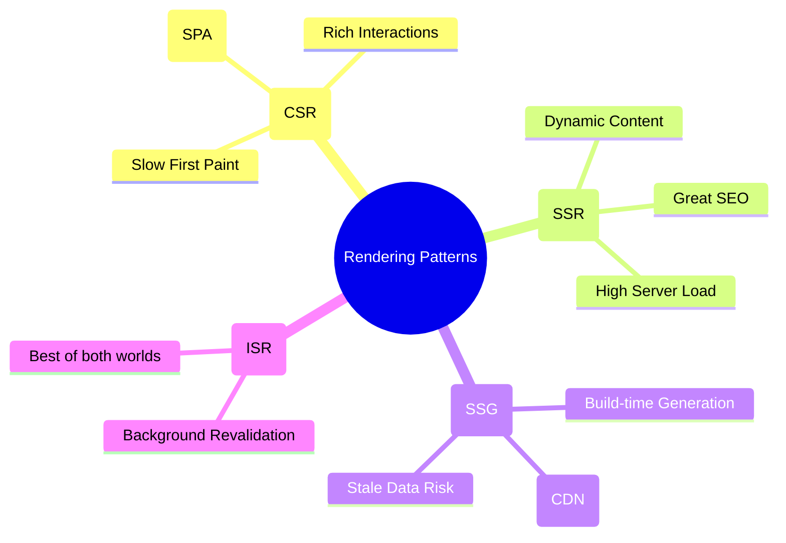

# Rendering Patterns: CSR, SSR, SSG, and ISR

Choosing the right rendering strategy is one of the most important architectural decisions for a web application. Each pattern has significant trade-offs regarding performance, SEO, and developer experience.

---

## 🗺️ Rendering Landscape

---

## 📊 Technical Comparison

| Feature            | CSR (Client-Side)         | SSR (Server-Side) | SSG (Static) | ISR (Incremental)  |
| :----------------- | :------------------------ | :---------------- | :----------- | :----------------- |
| **First Paint**    | Slow                      | Fast              | Fastest      | Fastest            |
| **SEO**            | Fair (Googlebot can wait) | Excellent         | Excellent    | Excellent          |
| **Server Load**    | Very Low                  | High              | Very Low     | Low                |
| **Data Freshness** | Real-time                 | Real-time         | Build-time   | Background Refresh |
| **Complexity**     | Low                       | High              | Medium       | High               |

---

## 🛠️ Deep Dive into Patterns

### 1. Client-Side Rendering (CSR)

The browser downloads a minimal HTML file and a large JS bundle, which then fetches data and renders the UI.

- **Best for:** SaaS Dashboards, logged-in experiences, highly interactive tools.
- **Drawback:** Large JS bundles lead to poor **FCP** and **LCP**.

### 2. Server-Side Rendering (SSR)

The server generates the full HTML for every request.

- **Best for:** Social media sites, search-heavy sites where data changes constantly.
- **Drawback:** High **TTFB** (Time to First Byte) as the server must "think" before responding.

### 3. Static Site Generation (SSG)

HTML is generated once at build time and served via a CDN.

- **Best for:** Blogs, documentation, marketing sites.
- **Drawback:** Requires a full rebuild to update content.

### 4. Incremental Static Regeneration (ISR)

Allows you to update static content _after_ you've built the site, without needing a full rebuild.

- **Best for:** E-commerce product pages, large-scale news sites.
- **Mechanism:** Background revalidation (e.g., update this page every 60 seconds).

---

## 🧠 Staff Level Interview Question

**Q: What is "Hydration" and why is it a performance bottleneck in SSR?**

> **Answer:** Hydration is the process where the browser attaches event listeners to the server-rendered HTML to make it interactive.
>
> - **The Bottleneck:** The browser must download and execute the _entire_ JS bundle before the page becomes interactive.
> - **The Impact:** This creates a gap where the page _looks_ ready but doesn't _respond_ to clicks (high **INP/FID**).
> - **The Solution:** Use **Streaming SSR** or **Partial Hydration** (React Server Components) to hydrate parts of the page independently.
