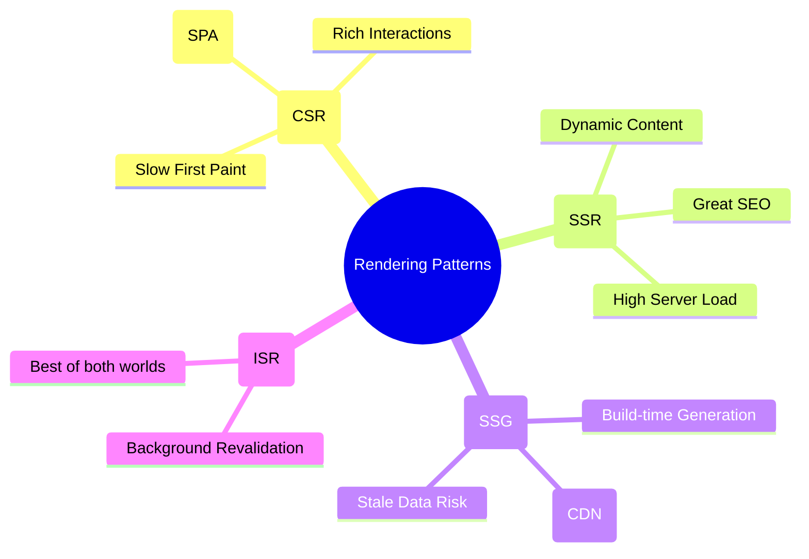
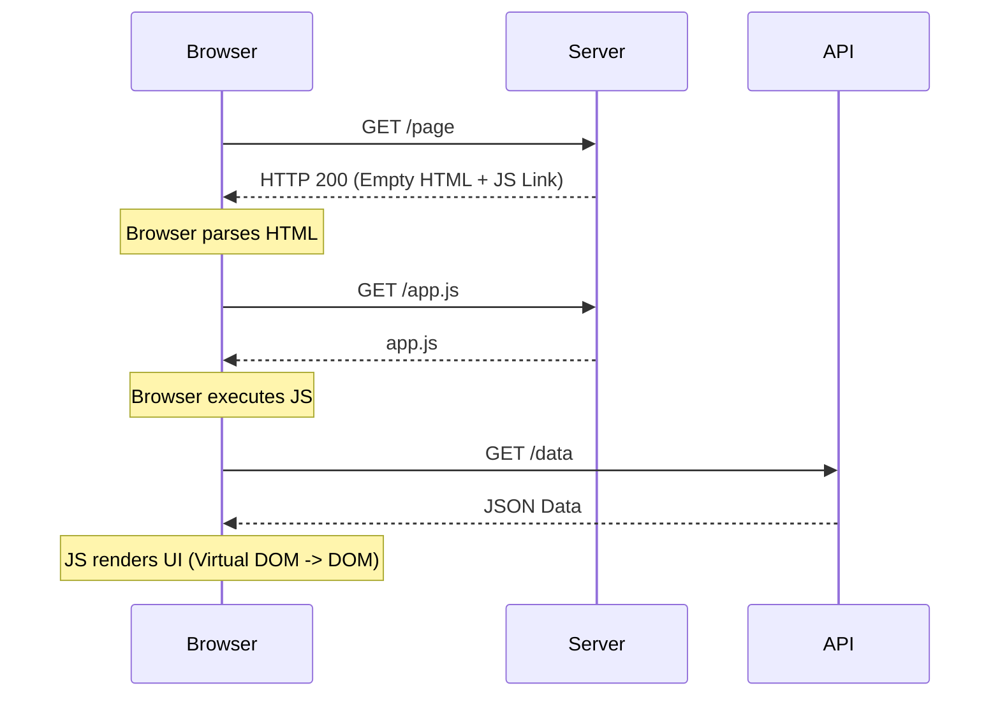
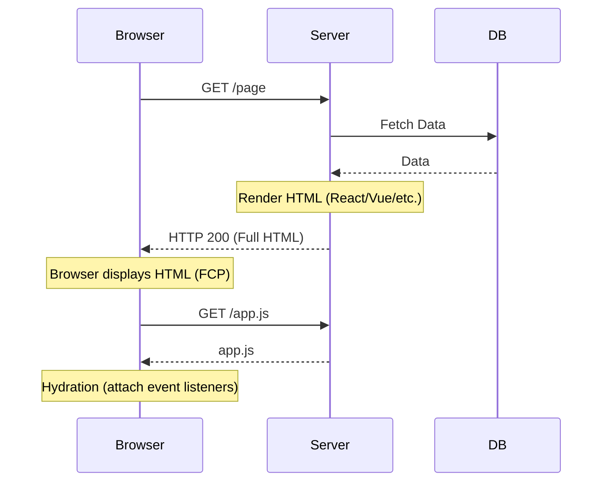
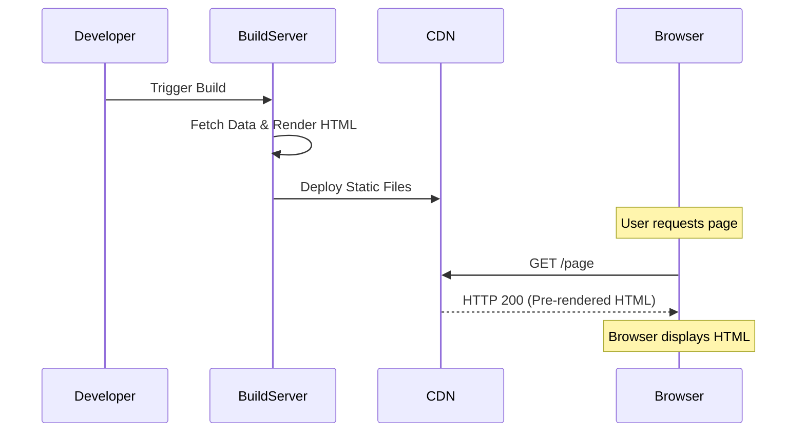
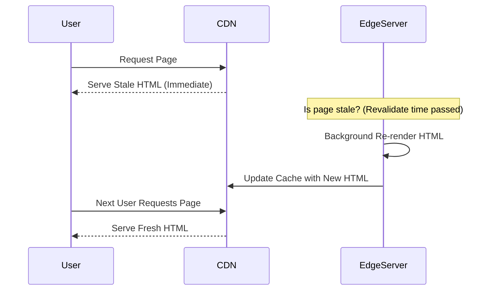

# Rendering Patterns: CSR, SSR, SSG, and ISR

Choosing the right rendering strategy is one of the most important architectural decisions for a web application. Each pattern has significant trade-offs regarding performance, SEO, and developer experience.

---

## 🗺️ Rendering Landscape

---

## 📊 Technical Comparison

| Feature            | CSR (Client-Side)         | SSR (Server-Side) | SSG (Static) | ISR (Incremental)  |
| :----------------- | :------------------------ | :---------------- | :----------- | :----------------- |
| **First Paint**    | Slow                      | Fast              | Fastest      | Fastest            |
| **SEO**            | Fair (Googlebot can wait) | Excellent         | Excellent    | Excellent          |
| **Server Load**    | Very Low                  | High              | Very Low     | Low                |
| **Data Freshness** | Real-time                 | Real-time         | Build-time   | Background Refresh |
| **Complexity**     | Low                       | High              | Medium       | High               |

---

## 🛠️ Deep Dive into Patterns

### 1. Client-Side Rendering (CSR)

In CSR, the server provides a bare-bones HTML file (usually just a `

`) and a link to a JavaScript bundle. The browser downloads the JS, which then takes over the rendering of the entire application, including fetching data from APIs.

#### 🔄 Flow Diagram

- **Pros:** Highly interactive, smooth transitions (no full page reloads), offloads rendering to the client.
- **Cons:** Poor "Time to First Meaningful Paint", SEO challenges (though improving), heavy initial JS bundle.
- **Best for:** SaaS Dashboards, logged-in experiences, highly interactive tools.

---

### 2. Server-Side Rendering (SSR)

In SSR, the server fetches the necessary data and renders the full HTML for the page on every request. The browser receives a complete HTML document that it can display immediately.

#### 🔄 Flow Diagram

- **Pros:** Fast First Contentful Paint (FCP), excellent SEO, great for low-powered devices.
- **Cons:** High Time to First Byte (TTFB) due to server-side processing, high server cost, full page reloads on navigation (unless using a hybrid framework like Next.js).
- **Best for:** Social media sites, search-heavy sites where data changes constantly.

---

### 3. Static Site Generation (SSG)

SSG involves rendering the entire site at **build time**. The resulting static HTML files are then deployed to a CDN (Content Delivery Network).

#### 🔄 Flow Diagram

- **Pros:** Extremely fast (served from CDN edge), highly secure (no server-side code), cheap to host.
- **Cons:** Stale data (requires a rebuild to update), build times can become very long for large sites.
- **Best for:** Blogs, documentation, marketing sites.

---

### 4. Incremental Static Regeneration (ISR)

ISR is a hybrid approach that allows you to update static pages _after_ the site has been built, without needing a full rebuild of the entire site. It uses a "stale-while-revalidate" strategy.

#### 🔄 Flow Diagram

- **Pros:** Best of both worlds (SSG speed + SSR freshness), scales to millions of pages.
- **Cons:** First user after revalidation window still sees stale data, complex to implement/debug.
- **Best for:** E-commerce product pages, large-scale news sites.

---

## 🔥 Senior/Staff Level "Grill" Questions

### Q0: What is "Hydration" and why is it a performance bottleneck in SSR?

> **Answer:** Hydration is the process where the browser attaches event listeners to the server-rendered HTML to make it interactive.
>
> - **The Bottleneck:** The browser must download and execute the _entire_ JS bundle before the page becomes interactive.
> - **The Impact:** This creates a gap where the page _looks_ ready but doesn't _respond_ to clicks (high **INP/FID**).
> - **The Solution:** Use **Streaming SSR**, **Partial Hydration** (Astro/Islands Architecture), or **Resumability** (Qwik).

### Q1: What is the "Double Data Problem" in SSR?

> **Answer:** In standard SSR, the server fetches data and embeds it into the HTML (for rendering). However, to hydrate the client-side app, that same data is often serialized and sent again inside a `<script>` tag (e.g., `window.__NEXT_DATA__`).
>
> - **The Problem:** You are sending the same data twice—once as HTML and once as JSON. For data-heavy pages, this can double the document size, hurting **TTFB** and increasing **Total Blocking Time (TBT)** during parsing.
> - **Optimization:** Use **React Server Components (RSC)** which stream data and HTML together, or **Partial Hydration** to avoid sending JSON for static parts.

### Q2: How does "Edge Rendering" (Streaming SSR at the Edge) differ from traditional SSR?

> **Answer:** Traditional SSR happens on a centralized origin server. Edge Rendering runs on globally distributed edge functions (e.g., Cloudflare Workers).
>
> - **Streaming:** Instead of waiting for the _entire_ HTML to be generated, the server streams the `<head>` and "above-the-fold" content immediately. The browser can start downloading CSS/JS while the server is still fetching data for the footer.
> - **Impact:** Drastically reduces **TTFB** and **FCP**.

### Q3: Explain the "Stale-While-Revalidate" (SWR) pattern in the context of ISR.

> **Answer:** ISR uses SWR. When a request comes in:
>
> 1. **HIT:** If the cache is fresh, serve it.
> 2. **STALE:** If the revalidation timer (e.g., 60s) has passed, serve the _old_ page to the current user immediately (no waiting).
> 3. **REVALIDATE:** In the background, the server triggers a re-generation of the page.
> 4. **UPDATE:** The cache is updated for the _next_ user.
>
> - **Critical Edge Case:** If the background re-generation fails, the old stale page is often kept in cache to prevent a 500 error (fallback behavior).

### Q4: Why might SSG be a security risk compared to SSR?

> **Answer:** SSG captures data at **build time**. If a developer accidentally leaks private environment variables or sensitive database content into the static build, that data is hard-coded into the HTML files deployed to every CDN node worldwide.
>
> - **Mitigation:** Strict CI/CD secrets management and using `getServerSideProps` (SSR) for any PII (Personally Identifiable Information).

---

## 🚀 The Future: Server Components & Resumability

| Concept                  | Why it matters                                                       | Framework   |
| :----------------------- | :------------------------------------------------------------------- | :---------- |
| **Server Components**    | 0KB JS sent for server-rendered parts. No hydration needed for them. | Next.js 13+ |
| **Resumability**         | No hydration at all. The app "resumes" where the server left off.    | Qwik        |
| **Islands Architecture** | Small "islands" of interactivity in a sea of static HTML.            | Astro       |

---

## 📱 Device-Specific Rendering Strategy

Rendering isn't just about SEO; it's about the **CPU/Battery/Network** constraints of the user's device.

| Device Category              | Hardware Constraints             | Best Rendering Pattern | Why?                                                                                                  |
| :--------------------------- | :------------------------------- | :--------------------- | :---------------------------------------------------------------------------------------------------- |
| **Small (Mobile/Low-end)**   | Low CPU, 4G/3G, Limited Battery  | **SSR / SSG**          | Offloads the "heavy lifting" (parsing/rendering) to the server. Minimizes JS execution on the device. |
| **Mid (Tablet/Laptop)**      | Moderate CPU, WiFi/5G            | **ISR / Hybrid**       | Can handle hydration well. Benefit from the "Best of both worlds" (speed + freshness).                |
| **Large (High-end Desktop)** | High CPU, Fiber, Unlimited Power | **CSR / SPA**          | Can handle huge JS bundles and complex client-side logic without breaking a sweat.                    |

### 🧠 The "Adaptive Loading" Pattern

Instead of picking one strategy for everyone, advanced apps use **Adaptive Loading**:

- **On 2G/3G:** Serve a static **SSR** version with zero JS.
- **On 4G/5G:** Serve the full **Hydrated/CSR** version for interactivity.
- **On Data-Saver Mode:** Disable heavy assets (videos/hero images) and use **Server-Side** logic to strip out non-essential components.

---

## 📈 Decision Matrix: Which one to choose?

1. **Does the page need to be behind a login?** Use **CSR**.
2. **Is SEO critical and content dynamic?** Use **SSR**.
3. **Is content static and infrequently updated?** Use **SSG**.
4. **Is the site huge (10k+ pages) but mostly static?** Use **ISR**.
5. **Need the absolute lowest latency for a global audience?** Use **Edge Rendering**.
