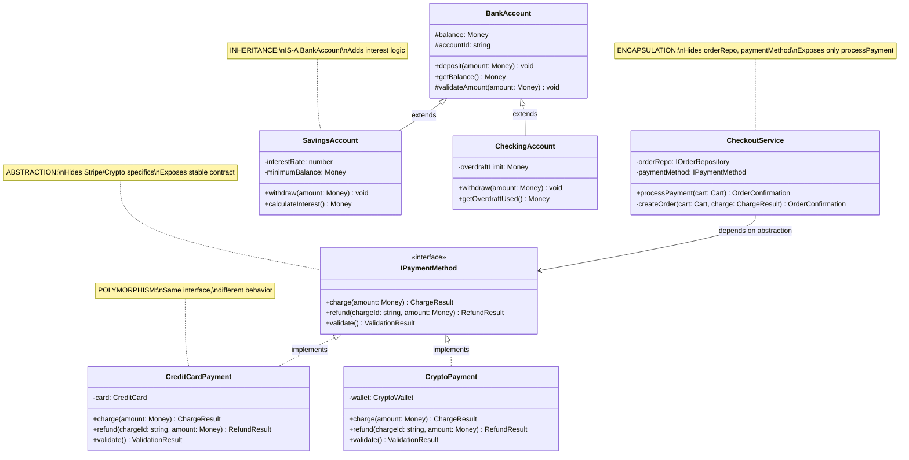

# 🧬 Object-Oriented Programming Concepts — Principal/Staff Level

> **Goal:** Not a textbook refresher — a deep exploration of the 4 pillars with the kind of nuance that separates Staff engineers from Senior engineers. Every concept includes the WHY, the failure modes at scale, and the interview signal.

---

## 📚 Table of Contents

1. [Encapsulation](#-pillar-1-encapsulation)
2. [Abstraction](#-pillar-2-abstraction)
3. [Inheritance](#-pillar-3-inheritance)
4. [Polymorphism](#-pillar-4-polymorphism)
5. [All 4 Pillars — Class Diagram](#all-4-pillars--class-diagram)
6. [Common OOP Mistakes](#-common-oop-mistakes)
7. [Inheritance vs Composition — Tradeoffs Table](#-inheritance-vs-composition--tradeoffs-table)
8. [Q&A Self-Test Blocks](#-qa-self-test-blocks)

---

## 🔒 Pillar 1: Encapsulation

### What It Is (Beyond the Textbook)

Encapsulation is **not** just "make your fields private." It's the principle of **bundling data and the behavior that operates on that data together**, while hiding the internal representation from the outside world.

The real insight: encapsulation is about **controlling the surface area of change**. When you encapsulate properly, you can refactor internals without breaking callers. When you expose internals, every caller becomes a dependency on your implementation detail.

### The Deep Why

Consider a `BankAccount` with a public `balance` field. Any code anywhere can:

```typescript
account.balance -= 500; // Bypasses overdraft protection
account.balance = -99999; // Sets balance to invalid state
```

Encapsulation forces state changes to go through **controlled methods** that enforce invariants:

```typescript
account.withdraw(500); // Enforces: balance >= 0, checks fraud limits, emits events
```

This is why encapsulation is the **foundation** of Domain-Driven Design — your domain objects protect their own invariants.

### TypeScript Example — The Wrong and Right Way

```typescript
// ❌ BROKEN ENCAPSULATION — "encapsulation theater"
// Private keyword but still exposes internal structure through getters/setters
class UserProfile {
  private _email: string;
  private _age: number;
  private _preferences: string[];

  get email() {
    return this._email;
  }
  set email(val: string) {
    this._email = val;
  } // No validation!

  get age() {
    return this._age;
  }
  set age(val: number) {
    this._age = val;
  } // Negative age is possible!

  get preferences() {
    return this._preferences;
  } // Returns internal reference!
  set preferences(val: string[]) {
    this._preferences = val;
  }
}

// Usage — caller directly manipulates internals:
const user = new UserProfile();
user.age = -5; // Invalid! No protection
user.preferences.push('ads'); // Mutates internal array directly!
user.email = 'not-an-email'; // Invalid format accepted!
```

```typescript
// ✅ TRUE ENCAPSULATION — data + behavior bundled, invariants enforced
class UserProfile {
  private readonly _id: string;
  private _email: Email; // Value object — self-validating
  private _age: number;
  private _preferences: Set<string>; // Implementation detail: Set, not Array

  constructor(id: string, email: string, age: number) {
    this._id = id;
    this._email = Email.of(email); // Throws if invalid
    this.setAge(age);
    this._preferences = new Set();
  }

  // Behavior, not just getter
  updateEmail(newEmail: string): void {
    const email = Email.of(newEmail); // Validate
    this._email = email;
    // Could also: emit DomainEvent, log audit trail, etc.
  }

  private setAge(age: number): void {
    if (age < 0 || age > 150) throw new InvalidAgeError(age);
    this._age = age;
  }

  addPreference(preference: string): void {
    if (!VALID_PREFERENCES.has(preference)) throw new InvalidPreferenceError(preference);
    this._preferences.add(preference); // No duplicate, enforced by Set
  }

  removePreference(preference: string): void {
    this._preferences.delete(preference);
  }

  // Return a copy — prevent external mutation of internal state
  getPreferences(): string[] {
    return Array.from(this._preferences); // Defensive copy
  }

  // Read-only snapshot — caller gets data, not a handle to internals
  toJSON(): UserProfileSnapshot {
    return {
      id: this._id,
      email: this._email.value,
      age: this._age,
      preferences: this.getPreferences(),
    };
  }
}
```

### What Breaks at Scale Without Encapsulation

1. **God object syndrome** — when internals are exposed, every class in the codebase starts depending on the internal structure of other classes. Adding a field breaks 40 files.

2. **Invariant leakage** — business rules ("a premium user always has at least 1 subscription") get enforced in 15 different service classes rather than in the domain object itself. When the rule changes, you find 14 of the 15 places.

3. **Testing hell** — to test anything, you must understand and set up the internal state of multiple classes. Tests become integration tests by accident.

4. **Parallel development bottleneck** — teams can't work independently because everyone's code is coupled to everyone else's internal structures.

### Frontend-Specific Context

In React/Vue/Angular, encapsulation applies at the **component level**:

- Component internal state should be opaque to parents
- Components should expose minimal, stable APIs (props/events)
- Avoid "prop drilling" internals — that's the UI equivalent of public fields

```typescript
// ❌ Anti-pattern: Parent knows too much about child internals
function ParentComponent() {
  const [childInputRef, setChildInputRef] = useState<HTMLInputElement>();
  // Parent directly manipulates child's DOM — encapsulation violation
  return <ChildForm onMount={setChildInputRef} />;
}

// ✅ Encapsulated component API
function ParentComponent() {
  const handleSubmit = (formData: FormData) => { ... };
  return <ChildForm onSubmit={handleSubmit} />;
  // Parent only knows: ChildForm calls onSubmit. Internals are hidden.
}
```

> 📌 **Principal-Level Interview Signal:** When asked about encapsulation, go beyond "private fields." Talk about invariant protection, defensive copying of collections, value objects for self-validating data, and the connection to Domain-Driven Design. This shows you understand encapsulation as a **design discipline**, not just a keyword.

---

## 🎭 Pillar 2: Abstraction

### What It Is (Beyond the Textbook)

Abstraction is **hiding complexity behind a simple interface**. It's the act of defining a contract without revealing the implementation. The outside world interacts with the abstraction (the interface, the promise of behavior) and is completely insulated from the mechanism.

The key insight that separates principal-level thinking: **abstraction is about managing cognitive load**. A developer using `fetch()` doesn't need to know TCP handshake mechanics. A developer using `UserRepository` doesn't need to know if it's hitting Postgres or DynamoDB.

### Two Types of Abstraction

| Type                    | Description                    | Example                                                  |
| ----------------------- | ------------------------------ | -------------------------------------------------------- |
| **Data abstraction**    | Hiding internal representation | `Money` class hides currency arithmetic                  |
| **Process abstraction** | Hiding implementation steps    | `PaymentGateway` interface hides Stripe/Paypal specifics |

### TypeScript Example

```typescript
// The abstraction — what callers see and depend on
interface INotificationService {
  sendWelcomeEmail(user: User): Promise<void>;
  sendPasswordReset(user: User, resetToken: string): Promise<void>;
  sendOrderConfirmation(order: Order): Promise<void>;
}

// Concrete implementation #1 — SendGrid
class SendGridNotificationService implements INotificationService {
  constructor(private readonly sgClient: SendGridClient) {}

  async sendWelcomeEmail(user: User): Promise<void> {
    await this.sgClient.send({
      to: user.email,
      from: 'noreply@company.com',
      templateId: 'WELCOME_TEMPLATE_ID',
      dynamicTemplateData: { name: user.firstName },
    });
  }
  // ...
}

// Concrete implementation #2 — SES (for when you migrate from SendGrid)
class SESNotificationService implements INotificationService {
  constructor(private readonly sesClient: SESClient) {}

  async sendWelcomeEmail(user: User): Promise<void> {
    await this.sesClient.sendTemplatedEmail({
      Destination: { ToAddresses: [user.email] },
      Template: 'WelcomeTemplate',
      TemplateData: JSON.stringify({ name: user.firstName }),
      Source: 'noreply@company.com',
    });
  }
  // ...
}

// The consumer — knows NOTHING about SendGrid or SES
class UserRegistrationService {
  constructor(private readonly notifications: INotificationService) {}

  async registerUser(command: RegisterUserCommand): Promise<User> {
    const user = User.create(command);
    await this.userRepo.save(user);
    await this.notifications.sendWelcomeEmail(user); // Abstraction!
    return user;
  }
}
```

When the company decides to switch from SendGrid to SES, `UserRegistrationService` doesn't change. Zero risk to registration logic. This is the **power of abstraction in production systems**.

### Abstraction Levels — A Critical Nuance

**Bad abstraction: too low** — leaks implementation details

```typescript
// ❌ Leaky abstraction — caller must know about SQL
interface IUserRepository {
  executeSQLQuery(sql: string, params: any[]): Promise<User[]>;
}
```

**Bad abstraction: too high** — too generic to be useful

```typescript
// ❌ Over-abstracted — what does "process" mean?
interface IProcessor {
  process(input: any): any;
}
```

**Good abstraction: domain-level** — matches the ubiquitous language

```typescript
// ✅ Right level — domain intent is clear, implementation is hidden
interface IUserRepository {
  findById(id: UserId): Promise<User | null>;
  findByEmail(email: Email): Promise<User | null>;
  save(user: User): Promise<void>;
  findActiveUsersOlderThan(days: number): Promise<User[]>;
}
```

### What Breaks at Scale Without Abstraction

1. **Vendor lock-in** — code that calls `stripe.createPaymentIntent()` directly cannot be tested without hitting Stripe's API, cannot be switched to Braintree without rewriting 40 service files.

2. **Test pyramid collapse** — no abstraction = no mocking = everything becomes an integration test = test suite takes 20 minutes and is flaky.

3. **Team coupling** — Team A can't deploy without Team B's service being up. Abstractions (interfaces + mocks) let teams work independently.

4. **The "shotgun surgery" problem** — when you need to change how something works, you touch 20 files because there's no single abstraction to change.

### Frontend-Specific Context

In frontend apps, abstraction appears in:

- **API layers** — `userService.getUser(id)` not `fetch('/api/users/' + id)` everywhere
- **Custom hooks** — `useAuth()` abstracts local storage, context, and token refresh
- **Component libraries** — `<Button variant="primary">` not raw `<button>` with inline styles

```typescript
// ✅ Abstracted API layer — caller doesn't know about fetch, axios, or REST
export const userService = {
  async getById(id: string): Promise<User> {
    const response = await httpClient.get<UserDTO>(`/users/${id}`);
    return UserMapper.toDomain(response.data);
  },

  async updateProfile(id: string, data: UpdateProfileInput): Promise<User> {
    const response = await httpClient.patch<UserDTO>(`/users/${id}`, data);
    return UserMapper.toDomain(response.data);
  },
};
```

> 📌 **Principal-Level Interview Signal:** Talk about **leaky abstractions** (Joel Spolsky's law) — all abstractions eventually leak. The best abstractions minimize leakage. Ask: "Does changing the implementation require callers to change?" If yes, the abstraction is leaking.

---

## 🧬 Pillar 3: Inheritance

### What It Is — And Why It's Often Overused

Inheritance allows a class to **derive behavior and state from a parent class**, establishing an "is-a" relationship. It's the most misunderstood and most over-used OOP feature.

The problem: inheritance **solves code reuse** but it **creates coupling**. Every time you add a method to a base class, all subclasses inherit it — whether they want it or not. The parent and child become tightly coupled in a way that can be very hard to undo.

> 💀 **The Fragile Base Class Problem:** When you change a base class, you may break every single subclass. In a large codebase with deep inheritance hierarchies, this can make the base class essentially unmodifiable.

### The DANGERS of Inheritance Overuse

```typescript
// ❌ Classic inheritance gone wrong — over-deep hierarchy

class Animal {
  breathe(): void {
    console.log('breathing');
  }
  move(): void {
    console.log('moving');
  }
}

class Bird extends Animal {
  fly(): void {
    console.log('flying');
  }
}

class Penguin extends Bird {
  // Penguin IS-A Bird, but Penguin CANNOT fly!
  // Now fly() is inherited but semantically wrong
  fly(): void {
    throw new Error('Penguins cannot fly'); // Violates LSP!
  }
}
```

The moment you throw an exception in an inherited method, you've broken the contract of the parent class. Every piece of code that treats a `Bird` and calls `.fly()` will break when given a `Penguin`. This is a **Liskov Substitution Principle violation**.

### Composition Over Inheritance — The Correct Approach

**Rule:** Prefer composition when you want to **share behavior** (code reuse). Use inheritance ONLY when there's a genuine **"is-a" relationship** that will remain stable.

```typescript
// ✅ Composition — behaviors as capabilities

// Define capabilities as interfaces
interface Flyable {
  fly(): void;
}

interface Swimmable {
  swim(): void;
}

interface Walkable {
  walk(): void;
}

// Implement capabilities as composable objects
class FlyingBehavior implements Flyable {
  fly(): void {
    console.log('Flapping wings, soaring!');
  }
}

class SwimmingBehavior implements Swimmable {
  swim(): void {
    console.log('Paddling through water');
  }
}

class WalkingBehavior implements Walkable {
  walk(): void {
    console.log('Walking on two legs');
  }
}

// Eagle: can fly and walk
class Eagle implements Flyable, Walkable {
  private flying = new FlyingBehavior();
  private walking = new WalkingBehavior();

  fly() {
    this.flying.fly();
  }
  walk() {
    this.walking.walk();
  }
}

// Penguin: can swim and walk, NOT fly
class Penguin implements Swimmable, Walkable {
  private swimming = new SwimmingBehavior();
  private walking = new WalkingBehavior();

  swim() {
    this.swimming.swim();
  }
  walk() {
    this.walking.walk();
  }
  // No fly() method at all — compile-time safety!
}

// Duck: can do all three
class Duck implements Flyable, Swimmable, Walkable {
  private flying = new FlyingBehavior();
  private swimming = new SwimmingBehavior();
  private walking = new WalkingBehavior();

  fly() {
    this.flying.fly();
  }
  swim() {
    this.swimming.swim();
  }
  walk() {
    this.walking.walk();
  }
}
```

Now you can add a `HighAltitudeFlyingBehavior` without touching `Eagle`, `Duck`, or any other class.

### When Inheritance IS Appropriate

Inheritance makes sense when:

1. The "is-a" relationship is **domain-genuine** and **stable** (a `SavingsAccount` IS-A `BankAccount` and always will be)
2. The parent class represents a **stable abstraction** with a well-defined contract
3. The hierarchy is **shallow** (maximum 2-3 levels deep)
4. You're implementing a **Template Method pattern** (shared algorithm, customizable steps)

```typescript
// ✅ Legitimate inheritance — stable "is-a", shallow hierarchy
abstract class Report {
  // Template Method — defines the skeleton
  generate(): string {
    const data = this.fetchData(); // subclass provides
    const formatted = this.format(data); // subclass provides
    return this.addHeader(formatted); // shared behavior
  }

  protected abstract fetchData(): ReportData;
  protected abstract format(data: ReportData): string;

  private addHeader(content: string): string {
    return `=== Company Report — ${new Date().toISOString()} ===\n${content}`;
  }
}

class SalesReport extends Report {
  protected fetchData(): ReportData {
    /* fetch from sales DB */
  }
  protected format(data: ReportData): string {
    /* tabular format */
  }
}

class InventoryReport extends Report {
  protected fetchData(): ReportData {
    /* fetch from inventory DB */
  }
  protected format(data: ReportData): string {
    /* list format */
  }
}
```

### What Breaks at Scale with Deep Inheritance

1. **Refactoring is dangerous** — changing `Animal.move()` affects 50 subclasses. You need to regression-test all of them.
2. **New requirements break hierarchies** — "Make a flying fish" — where does it go in `Animal → Fish | Bird`?
3. **Multiple inheritance impossible in most languages** — if `Duck` is `Bird` and `WaterAnimal`, you can't represent it without workarounds.
4. **God base class** — the base class accumulates every feature any subclass ever needed. Becomes bloated.

> 📌 **Principal-Level Interview Signal:** Know that the Gang of Four themselves wrote _"Favor object composition over class inheritance"_ in Design Patterns (1994). This isn't a modern opinion — it's been known for 30 years. Citing this and explaining WHY shows deep pattern literacy.

---

## 🔄 Pillar 4: Polymorphism

### What It Is — The Real Power

Polymorphism means "many forms" — the ability for different types to be treated **through a common interface**. It's the mechanism that makes abstraction actually useful.

There are three types:

1. **Subtype polymorphism** — a `Penguin` can be used anywhere a `Bird` is expected (runtime)
2. **Parametric polymorphism** — generics/type parameters (`Array<T>` works for any T)
3. **Ad-hoc polymorphism** — function overloading

In practice, when we talk about OOP polymorphism, we mean **subtype polymorphism**.

### The Power: Open for Extension, Closed for Modification

Polymorphism is what makes the Open/Closed Principle (OCP) achievable. You write code that processes `IPaymentMethod` objects — and when the business adds ApplePay, you just add a new implementation. The existing processing code doesn't change.

```typescript
// ✅ Polymorphism enabling OCP in a payment system

interface IPaymentMethod {
  charge(amount: Money): Promise<ChargeResult>;
  refund(chargeId: string, amount: Money): Promise<RefundResult>;
  validate(): ValidationResult;
}

class CreditCardPayment implements IPaymentMethod {
  constructor(private card: CreditCard) {}

  async charge(amount: Money): Promise<ChargeResult> {
    // Card-specific charging logic
    return stripeClient.createCharge({ ... });
  }

  async refund(chargeId: string, amount: Money): Promise<RefundResult> {
    return stripeClient.createRefund({ chargeId, amount: amount.cents });
  }

  validate(): ValidationResult {
    return this.card.validate(); // Luhn check, expiry, CVV
  }
}

class CryptoPayment implements IPaymentMethod {
  constructor(private wallet: CryptoWallet) {}

  async charge(amount: Money): Promise<ChargeResult> {
    const cryptoAmount = await this.convertToCrypto(amount);
    return this.wallet.transfer(cryptoAmount);
  }

  async refund(chargeId: string, amount: Money): Promise<RefundResult> {
    // Crypto refunds are on-chain transactions
    return this.wallet.reverseTransaction(chargeId);
  }

  validate(): ValidationResult {
    return this.wallet.validateAddress();
  }
}

class BuyNowPayLater implements IPaymentMethod {
  constructor(private bnplProvider: KlarnaClient) {}
  // ... different implementation, same interface
}

// ✅ This code handles ALL payment methods — now and in the future
// Adding ApplePay just requires a new class, not touching this code
class CheckoutService {
  async processPayment(
    cart: ShoppingCart,
    paymentMethod: IPaymentMethod // Polymorphism!
  ): Promise<OrderConfirmation> {
    const validation = paymentMethod.validate();
    if (!validation.isValid) throw new PaymentValidationError(validation.errors);

    const charge = await paymentMethod.charge(cart.total);
    if (!charge.success) throw new PaymentFailedError(charge.reason);

    return this.createOrder(cart, charge);
  }
}
```

### Duck Typing in TypeScript

TypeScript uses **structural typing** — if it has the right shape, it's compatible. This is "duck typing" with static analysis:

```typescript
// TypeScript structural typing — explicit "implements" not required
interface Serializable {
  serialize(): string;
  deserialize(data: string): void;
}

class UserSettings {
  private settings: Record<string, unknown> = {};

  // This class doesn't say "implements Serializable" but it IS Serializable
  serialize(): string {
    return JSON.stringify(this.settings);
  }

  deserialize(data: string): void {
    this.settings = JSON.parse(data);
  }
}

// TypeScript accepts UserSettings wherever Serializable is expected
function saveToStorage(item: Serializable): void {
  localStorage.setItem('data', item.serialize());
}

saveToStorage(new UserSettings()); // ✅ Works — structural match
```

This is powerful for composing third-party types with your own interfaces — a third-party `Map` can be used as `IKeyValueStore` if it has the same shape.

### Interface Polymorphism for React Components

```typescript
// Polymorphic components — accept multiple valid data shapes

interface TableColumn<T> {
  key: keyof T;
  header: string;
  render?: (value: T[keyof T], row: T) => React.ReactNode;
}

interface DataTableProps<T extends Record<string, unknown>> {
  data: T[];
  columns: TableColumn<T>[];
  onRowClick?: (row: T) => void;
}

// One DataTable component works with ANY data type
function DataTable<T extends Record<string, unknown>>({
  data,
  columns,
  onRowClick,
}: DataTableProps<T>) {
  return (
    <table>
      <thead>
        <tr>
          {columns.map(col => <th key={String(col.key)}>{col.header}</th>)}
        </tr>
      </thead>
      <tbody>
        {data.map((row, i) => (
          <tr key={i} onClick={() => onRowClick?.(row)}>
            {columns.map(col => (
              <td key={String(col.key)}>
                {col.render
                  ? col.render(row[col.key], row)
                  : String(row[col.key])}
              </td>
            ))}
          </tr>
        ))}
      </tbody>
    </table>
  );
}

// Used with different data types — same component, different forms
<DataTable data={users} columns={userColumns} />
<DataTable data={orders} columns={orderColumns} />
<DataTable data={products} columns={productColumns} />
```

### What Breaks at Scale Without Polymorphism

1. **Massive switch statements** — `if (payment.type === 'card') { ... } else if (payment.type === 'crypto') { ... }` in 15 files. Adding PayPal requires finding and updating all 15.

2. **Tight coupling to concrete types** — `CheckoutService` knows about `CreditCard` directly. It now changes whenever a payment method's API changes.

3. **Testing explosion** — you can't substitute a mock for real payment processing without polymorphism (dependency injection needs it).

> 📌 **Principal-Level Interview Signal:** Demonstrate how polymorphism, dependency injection, and the Open/Closed Principle work together as a system. They're not independent concepts — they compose. Polymorphism is the mechanism, DI is the delivery system, and OCP is the goal.

---

## 🗺️ All 4 Pillars — Class Diagram



---

## ⚠️ Common OOP Mistakes

| Mistake                        | Description                                           | What It Causes at Scale                            | Fix                                                 |
| ------------------------------ | ----------------------------------------------------- | -------------------------------------------------- | --------------------------------------------------- |
| **Anemic Domain Model**        | Classes with only getters/setters, no behavior        | Business rules scattered across 20 service classes | Move behavior into domain objects                   |
| **God Class**                  | One class that does everything                        | Impossible to test, change, or understand          | Split by Single Responsibility Principle            |
| **Deep Inheritance Hierarchy** | 5+ levels of extends                                  | Fragile base class, constant ripple effects        | Composition over inheritance                        |
| **Leaking Implementation**     | Internal arrays/maps returned by reference            | Callers mutate your internal state                 | Defensive copies, return interfaces not concretions |
| **Premature Abstraction**      | Abstraction added before there are 2+ implementations | Unnecessary complexity, wrong abstraction level    | Wait for the second implementation                  |
| **Encapsulation Theater**      | Private fields with unconstrained public setters      | Same as no encapsulation                           | Remove setters, use behaviors (methods)             |
| **Type Checking Instanceof**   | `if (animal instanceof Bird) { ... }`                 | Must update when new types added                   | Use polymorphism                                    |
| **Static Abuse**               | Everything is static or singleton                     | Global state, impossible to test                   | Dependency injection                                |
| **Mutable Global State**       | Public static mutable fields                          | Race conditions, unpredictable behavior            | Immutability, DI containers                         |
| **Constructor Bloat**          | Constructor takes 10+ parameters                      | Impossible to construct, breaks SRP                | Builder pattern, factory methods                    |

---

## ⚖️ Inheritance vs Composition — Tradeoffs Table

| Dimension              | Inheritance                                        | Composition                                         |
| ---------------------- | -------------------------------------------------- | --------------------------------------------------- |
| **Code Reuse**         | High — automatic via `extends`                     | Requires delegation boilerplate                     |
| **Coupling**           | **Very tight** — child depends on parent internals | Loose — composed via interface                      |
| **Flexibility**        | Low — hierarchy fixed at compile time              | High — can swap behaviors at runtime                |
| **Multiple behaviors** | Impossible (single inheritance in JS/TS)           | Easy — compose multiple behaviors                   |
| **Testability**        | Hard — must test whole hierarchy together          | Easy — test each behavior in isolation              |
| **Fragile Base Class** | Yes — parent changes break all children            | No — implementations are independent                |
| **Deep hierarchies**   | Likely to develop over time                        | Doesn't happen — flat structure                     |
| **When to use**        | Stable "is-a" + Template Method pattern            | Code reuse, capability sharing, flexible behavior   |
| **Example**            | `SavingsAccount extends BankAccount`               | `Duck` composes `FlyingBehavior + SwimmingBehavior` |
| **GoF recommendation** | Use sparingly                                      | **Preferred**                                       |

---

## 🧠 Q&A Self-Test Blocks

<details>
<summary>❓ What is the difference between encapsulation and information hiding? Are they the same thing?</summary>

**Answer:**

They are **related but distinct** concepts, often confused with each other.

**Information Hiding** (David Parnas, 1972) is the **design principle**: module internals should be hidden from other modules. This is about the _goal_.

**Encapsulation** is the **OOP mechanism** that implements information hiding by bundling data and behavior together in a class. This is about the _tool_.

Information hiding can be achieved without OOP (through module systems, closures, etc.):

```typescript
// Information hiding via module + closure — no class needed
const createCounter = (initial: number) => {
  let count = initial; // Hidden via closure — not accessible outside

  return {
    increment: () => ++count,
    decrement: () => --count,
    value: () => count,
  };
};

const counter = createCounter(0);
counter.increment();
console.log(counter.value()); // 1
// counter.count is undefined — information is hidden, no class needed
```

**Key principle:** Information hiding is about **separating interface from implementation**. The caller shouldn't know _how_ the module works, only _what_ it provides.

**At the principal level:** Design APIs (methods, interfaces, module exports) as if the implementation will change tomorrow. If callers are coupled to implementation details, every change becomes risky.

</details>

---

<details>
<summary>❓ Explain the "Fragile Base Class Problem." How does composition solve it?</summary>

**Answer:**

The **Fragile Base Class Problem** occurs when a change to a base class unexpectedly breaks subclasses, even when the change seems safe in isolation.

**Example:**

```typescript
class Collection {
  protected items: string[] = [];

  add(item: string): void {
    this.items.push(item);
  }

  addAll(items: string[]): void {
    items.forEach((item) => this.add(item)); // Calls this.add()!
  }
}

class InstrumentedCollection extends Collection {
  private addCount = 0;

  override add(item: string): void {
    this.addCount++;
    super.add(item);
  }
}

const col = new InstrumentedCollection();
col.addAll(['a', 'b', 'c']);
console.log(col.addCount); // 🐛 Expected: 3. Actual: 3... for now.

// Base class author "optimizes" addAll to skip calling add():
// addAll(items: string[]): void {
//   this.items.push(...items); // "Same result, right?"
// }

// Now addCount stays at 0 — subclass is broken without being changed
```

The base class author didn't know subclasses were overriding `add()`. This is the fragile base class problem.

**Composition solution:**

```typescript
class InstrumentedCollection {
  private addCount = 0;
  private inner: Collection; // Composed, not inherited

  constructor() {
    this.inner = new Collection();
  }

  add(item: string): void {
    this.addCount++;
    this.inner.add(item); // Delegate — not affected by base class changes
  }

  addAll(items: string[]): void {
    this.addCount += items.length; // Directly tracks what WE added
    this.inner.addAll(items);
  }

  getCount(): number {
    return this.addCount;
  }
}
```

Now changes to `Collection`'s internal implementation of `addAll` cannot affect `InstrumentedCollection`'s count logic.

</details>

---

<details>
<summary>❓ How does TypeScript's structural typing affect OOP design? When is it beneficial and when is it dangerous?</summary>

**Answer:**

TypeScript uses **structural typing** (duck typing with static analysis): compatibility is determined by shape, not by explicit declaration.

```typescript
interface Printable {
  print(): void;
}

class Document {
  print(): void {
    console.log('Printing document...');
  }
}

class Image {
  print(): void {
    console.log('Printing image...');
  }
}

// Both work — neither explicitly implements Printable
function printAll(items: Printable[]): void {
  items.forEach((item) => item.print());
}

printAll([new Document(), new Image()]); // ✅ Works
```

**Benefits:**

1. **Third-party interop** — you can define an interface that a library's type satisfies without modifying the library
2. **Flexibility** — value objects from different libraries can be used interchangeably if they have compatible shapes
3. **Test doubles** — easy to create lightweight test fakes without full class hierarchies

**Dangers:**

1. **Accidental compatibility** — two types with the same shape but different semantics are treated as compatible:

```typescript
interface UserId { value: string; }
interface ProductId { value: string; }

// TypeScript allows this — same shape, different domains!
function getUser(id: UserId): User { ... }

const productId: ProductId = { value: 'prod-123' };
getUser(productId); // ✅ TypeScript doesn't complain — 🐛 runtime logic error!
```

**Fix: Branded/Nominal types for domain identity:**

```typescript
type UserId = string & { readonly __brand: 'UserId' };
type ProductId = string & { readonly __brand: 'ProductId' };

const createUserId = (id: string): UserId => id as UserId;
const createProductId = (id: string): ProductId => id as ProductId;

function getUser(id: UserId): User { ... }

const productId = createProductId('prod-123');
getUser(productId); // ❌ TypeScript error — structural + nominal typing combined!
```

**Principal insight:** Use structural typing for flexibility in public interfaces, but use branded types for domain identity values (IDs, money amounts) to prevent accidental misuse.

</details>

---

<details>
<summary>❓ What is the "Tell, Don't Ask" principle, and how does it relate to OOP?</summary>

**Answer:**

**Tell, Don't Ask** is an OOP design heuristic: instead of asking an object for its data and then making decisions outside of it, **tell the object to do something** and let it make the decision internally.

**Asking (Anti-pattern — violates encapsulation):**

```typescript
// ❌ We ASK the order for data, then make decisions outside
function checkoutService(order: Order, paymentGateway: PaymentGateway) {
  if (order.status === 'PENDING' && order.items.length > 0) {
    const total = order.items.reduce((sum, item) => sum + item.price * item.qty, 0);
    if (total > 0) {
      paymentGateway.charge(total);
      order.status = 'CONFIRMED'; // External mutation!
    }
  }
}
```

Problems:

- Logic about Order is in CheckoutService, not in Order
- If status check logic changes, you must find all places that check Order.status
- Order's invariants aren't protected

**Telling (Correct — encapsulation + rich domain model):**

```typescript
// ✅ We TELL the order to confirm itself — it knows the rules
class Order {
  confirm(paymentResult: PaymentResult): void {
    this.ensureIsPending(); // Internal invariant check
    this.ensureHasItems(); // Internal invariant check
    this.status = OrderStatus.CONFIRMED;
    this.emit(new OrderConfirmedEvent(this.id, paymentResult));
  }

  private ensureIsPending(): void {
    if (this.status !== OrderStatus.PENDING) {
      throw new InvalidOrderStateError('Can only confirm pending orders');
    }
  }

  private ensureHasItems(): void {
    if (this._items.length === 0) {
      throw new EmptyOrderError();
    }
  }
}

// Service just delegates
class CheckoutService {
  async checkout(orderId: string, payment: IPaymentMethod): Promise<void> {
    const order = await this.orderRepo.findById(orderId);
    const result = await payment.charge(order.totalAmount);
    order.confirm(result); // Tell the order to confirm itself
    await this.orderRepo.save(order);
  }
}
```

**Principal insight:** "Tell, Don't Ask" is how you build rich domain models rather than anemic ones. It's directly related to encapsulation — behavior belongs with data.

</details>

---

<details>
<summary>❓ What are value objects? How do they enhance OOP design?</summary>

**Answer:**

A **value object** is an object that represents a domain concept through its **value, not its identity**. Two value objects with the same value are interchangeable — unlike entities, which have unique identity.

**Entity:** A `User` with `id: 'user-123'` — identity matters. A second `User` with the same data is a different user.

**Value Object:** `Money(100, 'USD')` — two Money objects with the same amount and currency are identical and interchangeable.

**Without value objects — primitive obsession:**

```typescript
// ❌ Primitives everywhere — no validation, no behavior
function transfer(fromAccountId: string, toAccountId: string, amount: number, currency: string): void {
  if (amount <= 0) throw new Error('Invalid amount'); // Repeated everywhere
  if (!VALID_CURRENCIES.includes(currency)) throw new Error('Invalid currency'); // Repeated everywhere
  // ...
}
```

**With value objects:**

```typescript
// ✅ Value objects are self-validating and behavior-rich
class Money {
  private constructor(
    private readonly _amount: number,
    private readonly _currency: Currency,
  ) {
    if (_amount < 0) throw new NegativeAmountError();
  }

  static of(amount: number, currency: string): Money {
    return new Money(amount, Currency.of(currency));
  }

  add(other: Money): Money {
    if (!this._currency.equals(other._currency)) throw new CurrencyMismatchError();
    return new Money(this._amount + other._amount, this._currency);
  }

  isGreaterThan(other: Money): boolean {
    this.ensureSameCurrency(other);
    return this._amount > other._amount;
  }

  // Value equality — not reference equality
  equals(other: Money): boolean {
    return this._amount === other._amount && this._currency.equals(other._currency);
  }

  // Immutable — operations return new instances
  multiply(factor: number): Money {
    return new Money(this._amount * factor, this._currency);
  }

  get amount(): number {
    return this._amount;
  }
  get currency(): Currency {
    return this._currency;
  }
}

// Now transfer is clean — Money validates itself
function transfer(from: AccountId, to: AccountId, amount: Money): void {
  // amount is ALREADY valid — constructor validated it
  // amount is ALREADY in a valid currency
  // ...
}
```

**Benefits:**

1. **No primitive obsession** — domain concepts have types, not raw strings/numbers
2. **Self-validating** — invalid state cannot be constructed
3. **Behavior-rich** — `money.add()`, `money.isGreaterThan()` — no scattered utility functions
4. **Immutable** — operations return new instances, preventing mutation bugs
5. **Equality semantics** — `.equals()` compares value, not reference

</details>

---

<details>
<summary>❓ How does polymorphism enable the Open/Closed Principle? Give a concrete example.</summary>

**Answer:**

The **Open/Closed Principle** states that software entities should be **open for extension but closed for modification**. Polymorphism is the mechanism that makes this achievable.

Without polymorphism, extension requires modification:

```typescript
// ❌ Must modify this function every time a new shape is added
function calculateArea(shape: Shape): number {
  if (shape.type === 'circle') {
    return Math.PI * shape.radius ** 2;
  } else if (shape.type === 'rectangle') {
    return shape.width * shape.height;
  } else if (shape.type === 'triangle') {
    return 0.5 * shape.base * shape.height;
  }
  // Adding hexagon requires modifying this function! 💥
  throw new Error('Unknown shape');
}
```

With polymorphism — extension without modification:

```typescript
// ✅ Each shape knows how to calculate its own area
interface Shape {
  area(): number;
  perimeter(): number;
}

class Circle implements Shape {
  constructor(private radius: number) {}
  area(): number {
    return Math.PI * this.radius ** 2;
  }
  perimeter(): number {
    return 2 * Math.PI * this.radius;
  }
}

class Rectangle implements Shape {
  constructor(
    private width: number,
    private height: number,
  ) {}
  area(): number {
    return this.width * this.height;
  }
  perimeter(): number {
    return 2 * (this.width + this.height);
  }
}

// Adding Hexagon = adding a new class. Zero modification to existing code.
class Hexagon implements Shape {
  constructor(private side: number) {}
  area(): number {
    return ((3 * Math.sqrt(3)) / 2) * this.side ** 2;
  }
  perimeter(): number {
    return 6 * this.side;
  }
}

// This code never changes as new shapes are added
function totalArea(shapes: Shape[]): number {
  return shapes.reduce((sum, shape) => sum + shape.area(), 0);
}
```

**The mechanism chain:**

1. **Abstraction** defines the `Shape` interface (the contract)
2. **Polymorphism** allows `totalArea` to call `.area()` on any Shape implementation
3. **DI/composition** delivers the concrete shapes to `totalArea`
4. **OCP** is achieved — new shapes extend the system without modifying it

</details>

---

<details>
<summary>❓ What is the difference between method overloading and method overriding? How does TypeScript handle overloading?</summary>

**Answer:**

**Method Overriding** (Runtime Polymorphism): A subclass provides a different implementation of a method defined in the parent class. The decision of which method to call is made at **runtime** based on the actual object type.

```typescript
class Animal {
  speak(): string {
    return 'Some sound';
  }
}

class Dog extends Animal {
  override speak(): string {
    return 'Woof!';
  } // Overrides parent
}

class Cat extends Animal {
  override speak(): string {
    return 'Meow!';
  } // Overrides parent
}

const animals: Animal[] = [new Dog(), new Cat()];
animals.forEach((a) => console.log(a.speak())); // "Woof!" "Meow!" — runtime dispatch
```

**Method Overloading** (Compile-time Polymorphism): Multiple methods with the same name but different parameter types. The decision of which version to call is made at **compile time** based on argument types.

TypeScript handles overloading with **overload signatures** + **implementation signature**:

```typescript
// Overload signatures (TypeScript declarations)
function createDate(timestamp: number): Date;
function createDate(year: number, month: number, day: number): Date;

// Implementation (must handle all overloaded forms)
function createDate(yearOrTimestamp: number, month?: number, day?: number): Date {
  if (month !== undefined && day !== undefined) {
    return new Date(yearOrTimestamp, month - 1, day);
  }
  return new Date(yearOrTimestamp);
}

createDate(1234567890); // ✅ Uses first overload
createDate(2024, 1, 15); // ✅ Uses second overload
createDate(2024, 1); // ❌ TypeScript error — no matching overload
```

**Important TypeScript nuance:** TypeScript overloads are compile-time only. At runtime, there's only one function. The implementation must manually handle the different parameter forms with runtime type checks.

**When to prefer overloads vs union types:**

```typescript
// Union type approach — simpler, often better
function process(input: string | number): string {
  if (typeof input === 'string') return input.toUpperCase();
  return input.toString();
}

// Overload approach — better when return type depends on input type
function parse(value: string): string[];
function parse(value: number): number;
function parse(value: string | number): string[] | number {
  if (typeof value === 'string') return value.split(',');
  return Math.floor(value);
}

const arr = parse('a,b,c'); // TypeScript knows this is string[]
const num = parse(3.14); // TypeScript knows this is number
```

</details>

---

<details>
<summary>❓ Explain the concept of "design by contract." How does TypeScript's type system support it?</summary>

**Answer:**

**Design by Contract** (Bertrand Meyer, 1986) is a methodology where software components define formal, precise specifications of their interactions through:

1. **Preconditions** — what must be true BEFORE calling a method (caller's responsibility)
2. **Postconditions** — what will be true AFTER the method completes (callee's guarantee)
3. **Invariants** — what must always be true about an object throughout its lifetime

TypeScript enforces **part** of DbC at compile time through its type system:

```typescript
// Preconditions enforced by type system
interface IEmailSender {
  // Precondition: email must be a valid Email (not just string)
  // TypeScript enforces the type, but not format validation
  send(to: Email, subject: NonEmptyString, body: string): Promise<SendResult>;
}

// Stronger preconditions via branded types
type Email = string & { readonly __brand: 'Email' };
type NonEmptyString = string & { readonly __brand: 'NonEmptyString' };

// Factory functions as runtime precondition enforcers
const Email = {
  of(raw: string): Email {
    if (!EMAIL_REGEX.test(raw)) throw new InvalidEmailError(raw);
    return raw as Email; // Safe cast after validation
  },
};

// Invariants via constructor validation
class BankAccount {
  private _balance: Money;

  constructor(initialBalance: Money) {
    // Invariant: balance is always non-negative
    if (initialBalance.isNegative()) throw new NegativeBalanceError();
    this._balance = initialBalance;
  }

  withdraw(amount: Money): void {
    // Precondition: amount must be positive and <= balance
    if (amount.isNegative()) throw new NegativeAmountError();
    if (amount.isGreaterThan(this._balance)) throw new InsufficientFundsError();

    this._balance = this._balance.subtract(amount);

    // Postcondition assertion (optional but valuable in dev)
    console.assert(!this._balance.isNegative(), 'Balance invariant violated!');
  }
}
```

**TypeScript-specific DbC patterns:**

- **Branded types** — encode domain constraints in the type (Email, NonEmptyString)
- **Readonly** — enforce immutability post-construction
- **Private constructors** — force factory methods that validate
- **`never` type** — represent impossible states

**Principal insight:** TypeScript's type system is a weak form of DbC. For critical domain invariants, combine types with runtime validation in constructors and factory methods. Aim to make invalid states **unrepresentable** in the type system.

</details>

---

<details>
<summary>❓ When is it appropriate to break encapsulation? What are legitimate reasons to expose internal state?</summary>

**Answer:**

This is a nuanced question that distinguishes mature engineers. Encapsulation is a guideline, not a law. There are legitimate scenarios where exposing internal state is the right call.

**Legitimate reasons to expose internal state:**

**1. Serialization/Persistence:**

```typescript
class Order {
  // Internal state must be accessible for persistence
  toSnapshot(): OrderSnapshot {
    return {
      id: this._id,
      status: this._status,
      items: this._items.map((i) => i.toSnapshot()),
      createdAt: this._createdAt,
    };
  }

  static fromSnapshot(snapshot: OrderSnapshot): Order {
    // Reconstitute from persistence
  }
}
```

**2. Value object equality:**

```typescript
class Money {
  // Expose for equality comparison — but read-only
  get amount(): number {
    return this._amount;
  }
  get currency(): string {
    return this._currency;
  }

  equals(other: Money): boolean {
    return this._amount === other.amount && this._currency === other.currency;
  }
}
```

**3. Testing via test-specific methods or exposed internals:**

```typescript
class ShoppingCart {
  // In production, cart is opaque
  // But for testing, a read-only view is acceptable
  get itemCount(): number {
    return this._items.length;
  } // Read-only!
  get isEmpty(): boolean {
    return this._items.length === 0;
  } // Derived state
}
```

**4. DTOs and view models:**
Classes designed specifically as data transfer objects should be transparent — they're not domain objects, just data shapes for crossing boundaries.

**The rule:** It's acceptable to expose **read-only projections** of internal state for:

- Serialization
- UI rendering
- Logging/observability
- Testing assertions

It is **never** acceptable to expose:

- Mutable internal collections (return copies instead)
- Internal implementation classes (return interfaces instead)
- State that can violate invariants if set from outside

**Principal insight:** The question is never "should I expose this?" but "what is the minimum I need to expose, and in what form?" Default to the most constrained form (read-only, copied, interface-typed).

</details>

---

<details>
<summary>❓ How do you decide between using a class, a plain object, or a function in TypeScript/JavaScript?</summary>

**Answer:**

This is a foundational architectural decision that many engineers make by habit rather than by reasoning.

**Use a CLASS when:**

- You need to maintain **encapsulated mutable state**
- You need **identity** (two instances are distinct even with same data)
- You need **behavioral polymorphism** (the same method name, different implementations)
- You want to enforce **invariants** through constructor validation
- You're modeling a **domain entity** with a lifecycle

```typescript
class UserSession {
  private expiresAt: Date;
  private refreshToken: string;

  renew(): void {
    /* updates internal state */
  }
  isExpired(): boolean {
    return new Date() > this.expiresAt;
  }
}
```

**Use a PLAIN OBJECT when:**

- Data is static/read-only
- No behavior needed — just a data shape
- Passing data across boundaries (DTOs, API responses)
- Configuration objects

```typescript
const config: DatabaseConfig = {
  host: process.env.DB_HOST,
  port: parseInt(process.env.DB_PORT),
  database: process.env.DB_NAME,
};
```

**Use a FUNCTION (or set of functions / module) when:**

- **Stateless transformation** — input → output, no side effects
- **Utility operations** that don't belong to any entity
- Functional composition patterns
- When you don't need OOP features (inheritance, this, polymorphism)

```typescript
// Stateless — no class needed
const formatCurrency = (amount: number, currency: string): string =>
  new Intl.NumberFormat('en-US', { style: 'currency', currency }).format(amount);

const validateEmail = (email: string): boolean => EMAIL_REGEX.test(email);
```

**Principal-level heuristic:**

> Start with functions. Add a class when you need state, identity, or polymorphism. Don't use classes as "namespace objects" — use modules (files) for that.

One of the most common overengineering mistakes in TypeScript: creating classes for stateless operations that should just be functions. Classes without state and without polymorphism are just functions with extra ceremony.

</details>

---

_← [README](./README.md) | Next: [02-SOLID.md →](./02-SOLID.md)_
