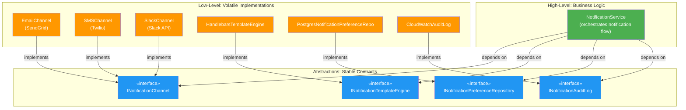

# 🧱 SOLID Principles — Principal/Staff Level

> **Goal:** Not just knowing what each letter stands for — understanding the _why_, the _when it breaks_, and how to apply all 5 principles as a **coherent system** rather than a checklist. Every principle includes a before/after in TypeScript and a real frontend scenario.

---

## 📚 Table of Contents

1. [S — Single Responsibility Principle](#-s--single-responsibility-principle)
2. [O — Open/Closed Principle](#-o--openclosed-principle)
3. [L — Liskov Substitution Principle](#-l--liskov-substitution-principle)
4. [I — Interface Segregation Principle](#-i--interface-segregation-principle)
5. [D — Dependency Inversion Principle](#-d--dependency-inversion-principle)
6. [SOLID in Practice — Notification Service](#-solid-in-practice--notification-service)
7. [Dependency Inversion Diagram](#-dependency-inversion-diagram)
8. [Common SOLID Mistakes Table](#-common-solid-mistakes-table)
9. [Q&A Self-Test Blocks](#-qa-self-test-blocks)

---

## 🎯 S — Single Responsibility Principle

### The Deep WHY

The classic definition — "A class should have only one reason to change" — is Robert Martin's formulation. But the deeper insight is this: **a "reason to change" corresponds to a stakeholder or actor**. SRP says a module should be responsible to **one and only one actor**.

This is often misunderstood as "do only one thing." That's too narrow. A class can do several related things and still have SRP if they all change for the same reason. The question is: **who would request this change?**

If a change to your `UserService` could be requested by:

- The **Finance team** (billing logic)
- The **Marketing team** (email sending)
- The **Security team** (password hashing)
- The **Product team** (profile management)

...then your `UserService` violates SRP, because it changes for multiple, independent reasons.

### TypeScript Example: BEFORE (Violation)

```typescript
// ❌ UserService with multiple responsibilities — 4 reasons to change
class UserService {
  // Responsibility 1: User management (Product team)
  async createUser(data: CreateUserDTO): Promise<User> {
    const user = new User(data);
    await this.db.users.insert(user);
    return user;
  }

  async findById(id: string): Promise<User | null> {
    return this.db.users.findOne({ id });
  }

  // Responsibility 2: Email sending (Marketing / Ops team)
  async sendWelcomeEmail(user: User): Promise<void> {
    const html = `<h1>Welcome, ${user.name}!</h1>`;
    await nodemailer.sendMail({
      to: user.email,
      subject: 'Welcome to our platform',
      html,
    });
  }

  async sendPasswordResetEmail(user: User, token: string): Promise<void> {
    // ...SendGrid template logic...
  }

  // Responsibility 3: Password hashing (Security team)
  hashPassword(password: string): string {
    return bcrypt.hashSync(password, 12);
  }

  verifyPassword(password: string, hash: string): boolean {
    return bcrypt.compareSync(password, hash);
  }

  // Responsibility 4: PDF invoice generation (Finance team)
  async generateInvoice(user: User, plan: Plan): Promise<Buffer> {
    const pdfDoc = new PDFDocument();
    pdfDoc.text(`Invoice for ${user.name}`);
    pdfDoc.text(`Plan: ${plan.name}, Price: ${plan.price}`);
    // ...PDF generation logic...
    return pdfDoc.getBuffer();
  }
}
```

**The breakage:** When Marketing changes email templates to support A/B testing, you modify `UserService` — and risk breaking password hashing or invoice generation. The test suite for all four functions runs on every change to any one. Three teams block each other's deployments.

### TypeScript Example: AFTER (Correct)

```typescript
// ✅ Each class has ONE reason to change

// User management — Product team owns this
class UserRepository {
  async create(user: User): Promise<User> {
    return this.db.users.insert(user);
  }

  async findById(id: string): Promise<User | null> {
    return this.db.users.findOne({ id });
  }
}

// Email sending — Marketing / Platform team owns this
class EmailService {
  async sendWelcomeEmail(user: User): Promise<void> {
    await this.mailer.send({ to: user.email, templateId: 'WELCOME' });
  }

  async sendPasswordResetEmail(user: User, token: string): Promise<void> {
    await this.mailer.send({ to: user.email, templateId: 'PASSWORD_RESET', data: { token } });
  }
}

// Password security — Security team owns this
class PasswordService {
  hash(password: string): string {
    return bcrypt.hashSync(password, 12);
  }

  verify(password: string, hash: string): boolean {
    return bcrypt.compareSync(password, hash);
  }
}

// Invoice generation — Finance team owns this
class InvoiceService {
  async generate(user: User, plan: Plan): Promise<Buffer> {
    return this.pdfGenerator.generate({ user, plan });
  }
}

// Orchestration — Registration flow
class UserRegistrationService {
  constructor(
    private userRepo: UserRepository,
    private emailService: EmailService,
    private passwordService: PasswordService,
  ) {}

  async register(command: RegisterCommand): Promise<User> {
    const hashedPassword = this.passwordService.hash(command.password);
    const user = User.create({ ...command, password: hashedPassword });
    await this.userRepo.create(user);
    await this.emailService.sendWelcomeEmail(user);
    return user;
  }
}
```

### Real-World Frontend Scenario

In React, SRP applies to **hooks and components**:

```typescript
// ❌ One hook doing everything — multiple reasons to change
function useUserDashboard(userId: string) {
  const [user, setUser] = useState<User>();
  const [orders, setOrders] = useState<Order[]>();
  const [notifications, setNotifications] = useState<Notification[]>();
  const [analytics, setAnalytics] = useState<Analytics>();

  // Fetching, error handling, transformation, analytics tracking — all in one
  useEffect(() => {
    fetch(`/users/${userId}`)
      .then((r) => r.json())
      .then(setUser);
    fetch(`/users/${userId}/orders`)
      .then((r) => r.json())
      .then(setOrders);
    fetch(`/users/${userId}/notifications`)
      .then((r) => r.json())
      .then(setNotifications);
    trackPageView('dashboard', { userId }); // Analytics responsibility!
  }, [userId]);

  return { user, orders, notifications, analytics };
}

// ✅ Separate hooks, each with one responsibility
function useUser(userId: string) {
  /* fetch + transform user data */
}
function useOrders(userId: string) {
  /* fetch + transform orders */
}
function useNotifications(userId: string) {
  /* fetch + manage notification state */
}
function useDashboardAnalytics(userId: string) {
  /* track dashboard events */
}

// Dashboard component composes them
function UserDashboard({ userId }: { userId: string }) {
  const { user } = useUser(userId);
  const { orders } = useOrders(userId);
  const { notifications } = useNotifications(userId);
  useDashboardAnalytics(userId);
  // ...
}
```

### What Happens at Scale Without SRP

1. **"Golden class" anti-pattern** — `UserService` becomes 2000 lines with 50 methods. Nobody understands it fully.
2. **Deployment coupling** — all four teams must coordinate for every release because they share one service.
3. **Test bloat** — a change to email templates requires running all user management tests.
4. **Blame ambiguity** — when something fails, it's unclear which team owns the bug.

> 📌 **Principal-Level Interview Signal:** When asked about SRP, describe it in terms of **actors and change axes**, not "one thing." Mention Conway's Law — your class structure should mirror your organizational structure. Classes that change together for the same reason should be owned by the same team.

---

## 🔓 O — Open/Closed Principle

### The Deep WHY

"Software entities should be open for extension, but closed for modification." — Bertrand Meyer, 1988.

The WHY: **every time you modify existing code, you risk breaking working functionality**. The OCP says: once a module is tested and deployed, you should be able to add new behavior by adding new code, not by changing old code.

This is not about making code immutable. It's about designing stable abstractions that can be extended without touching their core logic. The **mechanism** that makes OCP possible is **polymorphism + dependency injection**.

### TypeScript Example: BEFORE (Violation)

```typescript
// ❌ Open for modification — every new discount type changes this function
class PriceCalculator {
  calculateDiscount(order: Order, discountType: string): number {
    if (discountType === 'PERCENTAGE') {
      return order.total * 0.1;
    } else if (discountType === 'FLAT') {
      return 10;
    } else if (discountType === 'BUY_ONE_GET_ONE') {
      return order.items[0]?.price ?? 0;
    }
    // Adding LOYALTY_POINTS discount requires modifying this method!
    // Adding SEASONAL_SALE discount requires modifying this method!
    // Tested code must be re-tested every time a new type is added!
    return 0;
  }
}
```

Each new discount type:

1. Requires modifying `PriceCalculator`
2. Risks breaking existing discount calculations
3. Forces re-testing of all discount types
4. Creates merge conflicts when multiple teams add discounts simultaneously

### TypeScript Example: AFTER (Correct)

```typescript
// ✅ Closed for modification, open for extension

// The stable abstraction — this never changes
interface DiscountStrategy {
  apply(order: Order): Money;
  isApplicable(order: Order): boolean;
}

// Concrete strategies — add new ones without touching anything else
class PercentageDiscount implements DiscountStrategy {
  constructor(private percentage: number) {}

  apply(order: Order): Money {
    return order.total.multiply(this.percentage / 100);
  }

  isApplicable(order: Order): boolean {
    return order.total.isGreaterThan(Money.ZERO);
  }
}

class FlatDiscount implements DiscountStrategy {
  constructor(private amount: Money) {}

  apply(order: Order): Money {
    return this.amount.isGreaterThan(order.total) ? order.total : this.amount;
  }

  isApplicable(_order: Order): boolean {
    return true;
  }
}

class BuyOneGetOneDiscount implements DiscountStrategy {
  apply(order: Order): Money {
    const sortedItems = [...order.items].sort((a, b) => a.price.compare(b.price));
    return sortedItems[0]?.price ?? Money.ZERO; // Cheapest item free
  }

  isApplicable(order: Order): boolean {
    return order.items.length >= 2;
  }
}

// ✅ Adding LOYALTY_POINTS discount — zero changes to existing code!
class LoyaltyPointsDiscount implements DiscountStrategy {
  constructor(
    private points: number,
    private conversionRate: number,
  ) {}

  apply(order: Order): Money {
    return Money.of(this.points * this.conversionRate, 'USD');
  }

  isApplicable(order: Order): boolean {
    return this.points > 0 && order.customer.isLoyaltyMember;
  }
}

// PriceCalculator is CLOSED — never needs to change for new discount types
class PriceCalculator {
  calculateFinalPrice(order: Order, discounts: DiscountStrategy[]): Money {
    const applicableDiscounts = discounts.filter((d) => d.isApplicable(order));
    const totalDiscount = applicableDiscounts.reduce((sum, discount) => sum.add(discount.apply(order)), Money.ZERO);
    return order.total.subtract(totalDiscount);
  }
}
```

### Real-World Frontend Scenario

OCP applies to **React component renderers** and **plugin systems**:

```typescript
// ❌ Violation — must modify DashboardWidget for every new widget type
function DashboardWidget({ type, data }: { type: string; data: unknown }) {
  if (type === 'chart') return <ChartWidget data={data as ChartData} />;
  if (type === 'table') return <TableWidget data={data as TableData} />;
  if (type === 'map') return <MapWidget data={data as MapData} />;
  // Adding a new widget type requires modifying this component
  return null;
}

// ✅ OCP — register widget types, never modify the renderer
type WidgetRenderer<T = unknown> = React.ComponentType<{ data: T }>;

const widgetRegistry = new Map<string, WidgetRenderer>();
widgetRegistry.set('chart', ChartWidget);
widgetRegistry.set('table', TableWidget);
widgetRegistry.set('map', MapWidget);

// New widget type: just register it, don't touch DashboardWidget
widgetRegistry.set('heatmap', HeatmapWidget);

function DashboardWidget({ type, data }: { type: string; data: unknown }) {
  const Widget = widgetRegistry.get(type);
  if (!Widget) return <UnknownWidget type={type} />;
  return <Widget data={data} />;
}
```

### What Happens at Scale Without OCP

1. **Constant regression risk** — every new feature modifies existing, tested code
2. **Merge conflict explosion** — multiple teams adding to the same switch statement
3. **Impossible to parallelize development** — Team A waits for Team B to merge before adding their type
4. **Test suite fragility** — adding a discount type requires re-running all discount tests

> 📌 **Principal-Level Interview Signal:** Note that OCP doesn't mean never changing code — it means designing extension points so that common changes (new types, new strategies) don't require modifying stable abstractions. The challenge is **predicting which dimensions will vary** — and that requires domain expertise, not just pattern knowledge.

---

## 🔄 L — Liskov Substitution Principle

### The Deep WHY

"Objects of a supertype should be replaceable with objects of its subtypes without altering the correctness of the program." — Barbara Liskov, 1987 (Turing Award winner).

The WHY: if you can't substitute a subtype for its supertype without breaking callers, then your inheritance hierarchy is **a lie**. You said "is-a" but you meant "is-sort-of-a-but-with-caveats."

The real insight: LSP is about **behavioral subtyping**, not just interface subtyping. A subclass must uphold the **contract** of the parent — its preconditions, postconditions, and invariants.

**LSP rules:**

1. **Preconditions** cannot be strengthened in the subtype (accept at least as much as parent)
2. **Postconditions** cannot be weakened in the subtype (guarantee at least as much as parent)
3. **Invariants** of the supertype must be preserved in the subtype
4. **Exception types** can only be subtypes of the parent's exception types

### TypeScript Example: BEFORE (Violation)

```typescript
// ❌ Classic LSP violation — Square "is-a" Rectangle... or is it?

class Rectangle {
  protected _width: number;
  protected _height: number;

  constructor(width: number, height: number) {
    this._width = width;
    this._height = height;
  }

  set width(w: number) {
    this._width = w;
  }
  set height(h: number) {
    this._height = h;
  }

  get area(): number {
    return this._width * this._height;
  }
}

class Square extends Rectangle {
  constructor(side: number) {
    super(side, side);
  }

  // Square MUST keep width === height, so it overrides both setters
  override set width(w: number) {
    this._width = w;
    this._height = w; // Side effect! Violates Rectangle's contract
  }

  override set height(h: number) {
    this._width = h; // Side effect! Violates Rectangle's contract
    this._height = h;
  }
}

// Code that works with Rectangle
function resizeAndCalculateArea(rect: Rectangle): number {
  rect.width = 5;
  rect.height = 10;
  // With Rectangle: area = 50 ✅
  // With Square: area = 100 ❌ (height setter also changed width to 10)
  return rect.area;
}

const rect = new Rectangle(2, 3);
console.log(resizeAndCalculateArea(rect)); // 50 ✅

const square = new Square(2);
console.log(resizeAndCalculateArea(square)); // 100 ❌ Expected 50, Square broke it
```

### TypeScript Example: AFTER (Correct)

```typescript
// ✅ Separate types — no false "is-a" relationship

// Readonly, immutable shapes — no setters, no mutation
class Rectangle {
  constructor(
    readonly width: number,
    readonly height: number,
  ) {}

  get area(): number { return this.width * this.height; }

  // Returns a NEW rectangle with the new dimensions — immutable
  resize(width: number, height: number): Rectangle {
    return new Rectangle(width, height);
  }
}

class Square {
  constructor(readonly side: number) {}

  get area(): number { return this.side * this.side; }

  resize(side: number): Square {
    return new Square(side);
  }
}

// Polymorphism via interface — not inheritance
interface Shape {
  readonly area: number;
}

class Rectangle implements Shape { ... }
class Square implements Shape { ... }

// Now this works correctly for both
function calculateArea(shape: Shape): number {
  return shape.area; // Both fulfill the contract — no mutation
}
```

### A More Subtle LSP Violation

```typescript
// ❌ Tightened precondition — violates LSP rule #1
class PaymentProcessor {
  processPayment(amount: Money): ChargeResult {
    // Accepts any positive amount
    if (amount.isNegative()) throw new NegativeAmountError();
    return this.charge(amount);
  }
}

class PremiumPaymentProcessor extends PaymentProcessor {
  override processPayment(amount: Money): ChargeResult {
    // STRONGER precondition — only accepts amounts > $100
    // This breaks LSP: callers of PaymentProcessor expect $1 to work!
    if (amount.isLessThan(Money.of(100, 'USD'))) {
      throw new MinimumAmountError('Premium processor requires $100+');
    }
    return super.processPayment(amount);
  }
}
```

Callers that use `PaymentProcessor` references will break when given a `PremiumPaymentProcessor`, because they're passing valid amounts (according to the base class contract) that the subclass rejects.

### Real-World Frontend Scenario

LSP in UI components — base component contract must be upheld:

```typescript
// ❌ LSP violation in React components
interface ButtonProps {
  onClick: () => void;
  label: string;
  disabled?: boolean;
}

// Base "button" — callers expect onClick to always be callable (if not disabled)
const Button: React.FC<ButtonProps> = ({ onClick, label, disabled }) => (
  <button onClick={onClick} disabled={disabled}>{label}</button>
);

// "ConfirmButton" — violates LSP by adding unexpected blocking behavior
const ConfirmButton: React.FC<ButtonProps> = ({ onClick, label, disabled }) => {
  const handleClick = () => {
    // Caller didn't expect this — the contract said "onClick runs on click"
    const confirmed = window.confirm('Are you sure?');
    if (confirmed) onClick(); // onClick might NOT run — LSP violation!
  };
  return <button onClick={handleClick} disabled={disabled}>{label}</button>;
};

// ✅ Correct — extend the contract rather than break it
interface ConfirmButtonProps extends ButtonProps {
  confirmMessage: string; // NEW prop — explicitly part of the contract
}

const ConfirmButton: React.FC<ConfirmButtonProps> = ({
  onClick,
  label,
  disabled,
  confirmMessage,
}) => {
  const handleClick = () => {
    if (window.confirm(confirmMessage)) onClick();
  };
  return <button onClick={handleClick} disabled={disabled}>{label}</button>;
};
```

### What Happens at Scale Without LSP

1. **Defensive `instanceof` checks** — callers start checking the actual type to avoid subtype bugs: `if (processor instanceof PremiumPaymentProcessor) { ... }`. This eliminates polymorphism.
2. **Runtime surprises** — code that was tested with a base type breaks in production with a subtype.
3. **Trust erosion** — developers stop trusting the type system and add extra defensive checks everywhere.
4. **Hierarchy rot** — more and more `throw new Error('not supported')` overrides accumulate.

> 📌 **Principal-Level Interview Signal:** LSP is violated when subtypes throw unexpected exceptions, return narrower types than promised, or change observable side effects. The correct design is either flatten the hierarchy (use composition) or redesign the base class contract to be smaller and more general.

---

## ✂️ I — Interface Segregation Principle

### The Deep WHY

"No client should be forced to depend on methods it does not use." — Robert Martin.

The WHY: **fat interfaces create coupling between unrelated concerns**. When a class implements a large interface and only uses a fraction of it, every change to any method in that interface forces a re-check (and re-compilation, re-deployment) of all implementing classes — even those that don't use the changed method.

This is particularly important in **TypeScript** where interfaces are contracts, and in **microservices** where service interfaces define API contracts between systems.

### TypeScript Example: BEFORE (Violation)

```typescript
// ❌ Fat interface — forces classes to implement methods they don't need
interface IWorker {
  work(): void;
  eat(): void;
  sleep(): void;
  attendMeeting(): void;
  fileExpenseReport(): void;
  requestTimeOff(): void;
}

// Human worker — uses all methods ✅
class HumanWorker implements IWorker {
  work(): void {
    console.log('Working...');
  }
  eat(): void {
    console.log('Eating lunch...');
  }
  sleep(): void {
    console.log('Sleeping...');
  }
  attendMeeting(): void {
    console.log('In meeting...');
  }
  fileExpenseReport(): void {
    console.log('Filing expenses...');
  }
  requestTimeOff(): void {
    console.log('Requesting vacation...');
  }
}

// Robot worker — only works, everything else is meaningless!
class RobotWorker implements IWorker {
  work(): void {
    console.log('Processing...');
  }
  eat(): void {
    throw new Error('Robots do not eat!');
  } // ❌ Forced implementation
  sleep(): void {
    throw new Error('Robots do not sleep!');
  } // ❌ Forced implementation
  attendMeeting(): void {
    /* No-op — meaningless */
  } // ❌ Forced implementation
  fileExpenseReport(): void {
    throw new Error('Robots have no expenses!');
  } // ❌
  requestTimeOff(): void {
    throw new Error('Robots cannot request time off!');
  } // ❌
}
```

`RobotWorker` is forced to implement 5 methods that make no sense for it. Any client using `IWorker.eat()` will get a runtime error when given a `RobotWorker`.

### TypeScript Example: AFTER (Correct)

```typescript
// ✅ Segregated interfaces — each client depends only on what it uses

interface IWorkable {
  work(): void;
}

interface IEatable {
  eat(): void;
}

interface ISleepable {
  sleep(): void;
}

interface IMeetingAttendee {
  attendMeeting(): void;
}

interface IHRSubject {
  fileExpenseReport(): void;
  requestTimeOff(): void;
}

// Human worker — implements all relevant interfaces
class HumanWorker implements IWorkable, IEatable, ISleepable, IMeetingAttendee, IHRSubject {
  work(): void {
    console.log('Working...');
  }
  eat(): void {
    console.log('Eating lunch...');
  }
  sleep(): void {
    console.log('Sleeping...');
  }
  attendMeeting(): void {
    console.log('In meeting...');
  }
  fileExpenseReport(): void {
    console.log('Filing expenses...');
  }
  requestTimeOff(): void {
    console.log('Requesting vacation...');
  }
}

// Robot worker — only implements what it actually does
class RobotWorker implements IWorkable {
  work(): void {
    console.log('Processing at 100% efficiency...');
  }
}

// AI Worker (future) — can work and attend meetings, but not eat/sleep
class AIWorker implements IWorkable, IMeetingAttendee {
  work(): void {
    console.log('AI processing...');
  }
  attendMeeting(): void {
    console.log('AI analyzing meeting transcript...');
  }
}

// Factory that only cares about workable things
function deployWorker(worker: IWorkable, task: Task): void {
  worker.work();
}

// HR system that only cares about HR subjects
function processHRRequest(subject: IHRSubject, request: HRRequest): void {
  if (request.type === 'EXPENSE') subject.fileExpenseReport();
  if (request.type === 'VACATION') subject.requestTimeOff();
}
```

### Real-World Frontend Scenario

ISP in React and API clients:

```typescript
// ❌ Fat API interface forces components to depend on methods they'll never use
interface IUserAPI {
  getUser(id: string): Promise<User>;
  updateUser(id: string, data: Partial<User>): Promise<User>;
  deleteUser(id: string): Promise<void>;
  getUserOrders(id: string): Promise<Order[]>;
  getUserPaymentMethods(id: string): Promise<PaymentMethod[]>;
  updatePaymentMethod(id: string, data: PaymentMethodData): Promise<void>;
  getUserAnalytics(id: string, range: DateRange): Promise<Analytics>;
  exportUserData(id: string, format: 'csv' | 'json'): Promise<Blob>;
}

// ProfilePage only uses getUser + updateUser
// It still depends on the full IUserAPI and rebuilds when any method changes
class ProfilePage {
  constructor(private api: IUserAPI) {} // Depends on 8 methods, uses 2
}

// ✅ Segregated API interfaces — components depend only on what they use
interface IUserProfileAPI {
  getUser(id: string): Promise<User>;
  updateUser(id: string, data: Partial<User>): Promise<User>;
}

interface IUserOrdersAPI {
  getUserOrders(id: string): Promise<Order[]>;
}

interface IUserPaymentsAPI {
  getUserPaymentMethods(id: string): Promise<PaymentMethod[]>;
  updatePaymentMethod(id: string, data: PaymentMethodData): Promise<void>;
}

interface IUserAnalyticsAPI {
  getUserAnalytics(id: string, range: DateRange): Promise<Analytics>;
}

// ProfilePage only knows about its slice of the API
class ProfilePage {
  constructor(private api: IUserProfileAPI) {} // Depends on exactly what it uses
}

// OrdersPage only knows about orders API
class OrdersPage {
  constructor(private api: IUserOrdersAPI) {}
}
```

### What Happens at Scale Without ISP

1. **Recompilation cascades** — every change to a fat interface forces recompilation of all implementing classes, even unrelated ones (critical in monorepos with many packages)
2. **Test pollution** — testing `RobotWorker.work()` requires mocking out 5 meaningless methods
3. **Coupling between unrelated features** — changing the analytics API method signature breaks the `ProfilePage` that never used analytics
4. **Interface implementations explode in size** — classes implementing huge interfaces grow to hundreds of methods

> 📌 **Principal-Level Interview Signal:** ISP is not about having tiny interfaces with one method. It's about **role-based interfaces** — group methods by which client role would use them. A client that reads data has a different role than one that writes data — so `IUserReader` and `IUserWriter` make sense as separate interfaces.

---

## 🔌 D — Dependency Inversion Principle

### The Deep WHY

"High-level modules should not depend on low-level modules. Both should depend on abstractions. Abstractions should not depend on details. Details should depend on abstractions." — Robert Martin.

This is arguably the **most impactful** of the five principles. The WHY:

1. **Testability** — if high-level modules depend on concrete low-level modules (databases, HTTP clients, email providers), you cannot test high-level logic without the infrastructure.
2. **Swappability** — when you decide to switch databases, email providers, or payment processors, you should only need to write a new implementation, not modify business logic.
3. **Parallel development** — teams can develop high-level logic against interfaces before low-level implementations exist.
4. **Stability** — high-level business rules are the most valuable, least-changing code. Low-level implementations (HTTP libraries, DB drivers) change frequently. DIP ensures volatility flows downward, not upward.

### The "Inversion" Explained

Traditional dependency direction (wrong):

```
UserService → UserRepository (concrete Postgres implementation)
UserService → EmailClient (concrete SendGrid implementation)
```

The high-level business logic (`UserService`) depends on volatile low-level details (`PostgresUserRepository`, `SendGridEmailClient`).

Inverted dependency direction (correct):

```
UserService → IUserRepository (abstraction)
UserService → IEmailService (abstraction)

PostgresUserRepository → IUserRepository (implementation)
SendGridEmailClient → IEmailService (implementation)
```

Now the high-level module (valuable, stable business logic) depends ONLY on abstractions. The volatile low-level modules depend on those same abstractions. **Both point to the abstraction.**

### TypeScript Example: BEFORE (Violation)

```typescript
// ❌ High-level service directly imports low-level modules

import { Pool } from 'pg'; // Direct dependency on PostgreSQL
import * as nodemailer from 'nodemailer'; // Direct dependency on Nodemailer
import { S3Client } from '@aws-sdk/client-s3'; // Direct dependency on AWS

class UserRegistrationService {
  private db: Pool;
  private mailer: nodemailer.Transporter;
  private s3: S3Client;

  constructor() {
    // Hard-coded infrastructure dependencies — no injection!
    this.db = new Pool({ host: 'localhost', database: 'users_db' });
    this.mailer = nodemailer.createTransport({ host: 'smtp.sendgrid.net' });
    this.s3 = new S3Client({ region: 'us-east-1' });
  }

  async registerUser(data: RegisterUserDTO): Promise<User> {
    // Direct SQL — coupled to PostgreSQL
    const result = await this.db.query('INSERT INTO users (email, name) VALUES ($1, $2) RETURNING *', [
      data.email,
      data.name,
    ]);
    const user = result.rows[0];

    // Direct Nodemailer — coupled to SMTP
    await this.mailer.sendMail({
      to: user.email,
      subject: 'Welcome!',
      html: '<h1>Welcome!</h1>',
    });

    return user;
  }
}

// Testing this requires:
// 1. A running PostgreSQL database
// 2. A working SMTP server
// 3. AWS credentials
// There are NO unit tests possible — only integration tests
```

### TypeScript Example: AFTER (Correct)

```typescript
// ✅ Abstractions defined at the boundary of the domain

// High-level defines the abstractions it NEEDS
interface IUserRepository {
  save(user: User): Promise<void>;
  findByEmail(email: string): Promise<User | null>;
}

interface IEmailService {
  sendWelcomeEmail(to: string, name: string): Promise<void>;
}

interface IFileStorage {
  upload(key: string, data: Buffer, mimeType: string): Promise<string>;
}

// High-level business logic — depends ONLY on abstractions
class UserRegistrationService {
  constructor(
    private readonly userRepo: IUserRepository, // Abstraction
    private readonly emailService: IEmailService, // Abstraction
    private readonly fileStorage: IFileStorage, // Abstraction
  ) {}

  async registerUser(data: RegisterUserDTO): Promise<User> {
    const existing = await this.userRepo.findByEmail(data.email);
    if (existing) throw new EmailAlreadyRegisteredError(data.email);

    const user = User.create(data);
    await this.userRepo.save(user);
    await this.emailService.sendWelcomeEmail(user.email, user.name);
    return user;
  }
}

// Low-level modules depend on the abstraction (implement it)
class PostgresUserRepository implements IUserRepository {
  constructor(private db: Pool) {}

  async save(user: User): Promise<void> {
    await this.db.query('INSERT INTO users (id, email, name, created_at) VALUES ($1, $2, $3, $4)', [
      user.id,
      user.email,
      user.name,
      user.createdAt,
    ]);
  }

  async findByEmail(email: string): Promise<User | null> {
    const result = await this.db.query('SELECT * FROM users WHERE email = $1', [email]);
    return result.rows[0] ? User.fromRow(result.rows[0]) : null;
  }
}

class SendGridEmailService implements IEmailService {
  constructor(private sgClient: SendGridClient) {}

  async sendWelcomeEmail(to: string, name: string): Promise<void> {
    await this.sgClient.send({ to, templateId: 'WELCOME', data: { name } });
  }
}

// For TESTING — a pure in-memory implementation, no real dependencies
class InMemoryUserRepository implements IUserRepository {
  private users = new Map<string, User>();

  async save(user: User): Promise<void> {
    this.users.set(user.email, user);
  }

  async findByEmail(email: string): Promise<User | null> {
    return this.users.get(email) ?? null;
  }
}

class MockEmailService implements IEmailService {
  public sentEmails: Array<{ to: string; name: string }> = [];

  async sendWelcomeEmail(to: string, name: string): Promise<void> {
    this.sentEmails.push({ to, name }); // Capture for assertions
  }
}

// Unit test — no databases, no SMTP, no AWS
describe('UserRegistrationService', () => {
  it('sends welcome email on successful registration', async () => {
    const userRepo = new InMemoryUserRepository();
    const emailService = new MockEmailService();
    const fileStorage = new MockFileStorage();

    const service = new UserRegistrationService(userRepo, emailService, fileStorage);
    await service.registerUser({ email: 'alice@test.com', name: 'Alice' });

    expect(emailService.sentEmails).toHaveLength(1);
    expect(emailService.sentEmails[0].to).toBe('alice@test.com');
  });
});
```

### Real-World Frontend Scenario

DIP in React — components should depend on abstractions (context, service interfaces), not concrete implementations:

```typescript
// ❌ Component directly calls fetch — coupled to REST API
function UserProfile({ userId }: { userId: string }) {
  const [user, setUser] = useState<User>();

  useEffect(() => {
    fetch(`/api/users/${userId}`)
      .then(r => r.json())
      .then(setUser);
    // Cannot be tested without a running API server
    // Cannot be switched to GraphQL without changing this component
  }, [userId]);

  return <div>{user?.name}</div>;
}

// ✅ Dependency inverted — depends on abstraction via custom hook
interface IUserService {
  getUser(id: string): Promise<User>;
}

const UserServiceContext = React.createContext<IUserService | null>(null);

function UserProfile({ userId }: { userId: string }) {
  const userService = useContext(UserServiceContext)!; // Depends on abstraction
  const [user, setUser] = useState<User>();

  useEffect(() => {
    userService.getUser(userId).then(setUser);
  }, [userId, userService]);

  return <div>{user?.name}</div>;
}

// In tests — inject a mock service
render(
  <UserServiceContext.Provider value={new MockUserService()}>
    <UserProfile userId="123" />
  </UserServiceContext.Provider>
);

// In production — inject the real service
render(
  <UserServiceContext.Provider value={new RestUserService()}>
    <UserProfile userId="123" />
  </UserServiceContext.Provider>
);
```

### What Happens at Scale Without DIP

1. **Test pyramid inverts** — unit tests are impossible, everything becomes integration tests. Test suite takes 30 minutes and is flaky.
2. **Vendor lock-in** — business logic is coupled to Stripe, AWS, Postgres. Migration costs are enormous.
3. **Parallel team development blocked** — Team A can't build business logic until Team B finishes the DB layer.
4. **Deployment coupling** — all services must deploy together because there are hard dependency chains.

> 📌 **Principal-Level Interview Signal:** The key word is **who defines the interface**? In DIP, the **high-level module** (business logic) defines the interface it needs. The **low-level module** (infrastructure) implements it. This is the inversion — normally we think of "depends on" as the high-level calling the low-level. DIP says the **ownership of the contract** belongs to the high-level.

---

## 🏗️ SOLID in Practice — Notification Service

Let's design a `NotificationService` applying all 5 SOLID principles.

### Requirements

- Send notifications via Email, SMS, Push
- Support templating
- Support user notification preferences
- Log all sent notifications
- Easy to add new channels (WhatsApp, Slack) in the future

### Complete SOLID-Compliant Design

```typescript
// ============================================================
// INTERFACES (DIP: high-level defines what it needs)
// ============================================================

// ISP: Separate interfaces by role
interface INotificationChannel {
  send(recipient: string, content: NotificationContent): Promise<SendResult>;
  canHandle(type: ChannelType): boolean;
}

interface INotificationTemplateEngine {
  render(templateId: string, variables: Record<string, string>): string;
}

interface INotificationPreferenceRepository {
  getPreferences(userId: string): Promise<UserNotificationPreferences>;
}

interface INotificationAuditLog {
  record(event: NotificationSentEvent): Promise<void>;
}

// ============================================================
// DOMAIN TYPES
// ============================================================

enum ChannelType {
  EMAIL = 'EMAIL',
  SMS = 'SMS',
  PUSH = 'PUSH',
  SLACK = 'SLACK', // Adding Slack doesn't require changing existing code (OCP)
}

interface NotificationContent {
  subject?: string;
  body: string;
  metadata?: Record<string, unknown>;
}

interface NotificationRequest {
  userId: string;
  templateId: string;
  variables: Record<string, string>;
  preferredChannels?: ChannelType[];
}

// ============================================================
// CHANNEL IMPLEMENTATIONS (Low-level — implements abstractions)
// ============================================================

// OCP: Each new channel = new class, no modification to existing
class EmailChannel implements INotificationChannel {
  constructor(private emailProvider: IEmailProvider) {}

  canHandle(type: ChannelType): boolean {
    return type === ChannelType.EMAIL;
  }

  async send(recipient: string, content: NotificationContent): Promise<SendResult> {
    return this.emailProvider.send({
      to: recipient,
      subject: content.subject ?? 'Notification',
      body: content.body,
    });
  }
}

class SMSChannel implements INotificationChannel {
  constructor(private smsProvider: ISMSProvider) {}

  canHandle(type: ChannelType): boolean {
    return type === ChannelType.SMS;
  }

  async send(recipient: string, content: NotificationContent): Promise<SendResult> {
    return this.smsProvider.send({ to: recipient, message: content.body });
  }
}

// Added later — zero changes to existing code (OCP)
class SlackChannel implements INotificationChannel {
  constructor(private slackClient: SlackClient) {}

  canHandle(type: ChannelType): boolean {
    return type === ChannelType.SLACK;
  }

  async send(recipient: string, content: NotificationContent): Promise<SendResult> {
    return this.slackClient.postMessage({ channel: recipient, text: content.body });
  }
}

// ============================================================
// NOTIFICATION SERVICE (SRP: one reason to change — notification flow)
// ============================================================

class NotificationService {
  constructor(
    // DIP: depends on abstractions, not concretions
    private readonly channels: INotificationChannel[],
    private readonly templateEngine: INotificationTemplateEngine,
    private readonly preferenceRepo: INotificationPreferenceRepository,
    private readonly auditLog: INotificationAuditLog,
  ) {}

  async notify(request: NotificationRequest): Promise<NotificationResult[]> {
    // 1. Get user preferences
    const prefs = await this.preferenceRepo.getPreferences(request.userId);

    // 2. Determine which channels to use (user preference + request override)
    const channelTypes = request.preferredChannels ?? prefs.enabledChannels;

    // 3. Render the notification content (SRP: template engine handles rendering)
    const body = this.templateEngine.render(request.templateId, request.variables);

    // 4. Send via each applicable channel (OCP: polymorphism — new channels just work)
    const results = await Promise.allSettled(
      channelTypes.map((type) => this.sendViaChannel(type, request.userId, prefs, { body })),
    );

    // 5. Audit log all results (SRP: audit is a separate concern, separate class)
    await this.logResults(request, results);

    return results
      .filter((r): r is PromiseFulfilledResult<NotificationResult> => r.status === 'fulfilled')
      .map((r) => r.value);
  }

  private async sendViaChannel(
    type: ChannelType,
    userId: string,
    prefs: UserNotificationPreferences,
    content: NotificationContent,
  ): Promise<NotificationResult> {
    const channel = this.channels.find((c) => c.canHandle(type));
    if (!channel) throw new UnsupportedChannelError(type);

    const recipient = prefs.getRecipientForChannel(type);
    const result = await channel.send(recipient, content);

    return { channelType: type, userId, result };
  }

  private async logResults(
    request: NotificationRequest,
    results: PromiseSettledResult<NotificationResult>[],
  ): Promise<void> {
    await this.auditLog.record(new NotificationSentEvent(request.userId, results));
  }
}

// ============================================================
// COMPOSITION ROOT — wire everything together
// ============================================================

function buildNotificationService(): NotificationService {
  return new NotificationService(
    [
      new EmailChannel(new SendGridProvider(config.sendgrid)),
      new SMSChannel(new TwilioProvider(config.twilio)),
      new SlackChannel(new SlackClient(config.slack)),
    ],
    new HandlebarsTemplateEngine(),
    new PostgresNotificationPreferenceRepository(db),
    new CloudWatchNotificationAuditLog(cloudwatch),
  );
}
```

### How Each SOLID Principle Applies

| Principle | Where Applied                                          | How                                                                                    |
| --------- | ------------------------------------------------------ | -------------------------------------------------------------------------------------- |
| **SRP**   | `NotificationService`                                  | Only orchestrates — template engine, channel selection, and audit are separate classes |
| **OCP**   | Channel system                                         | Adding `WhatsAppChannel` = new class only; nothing else changes                        |
| **LSP**   | All `INotificationChannel` implementations             | Every channel is substitutable — `send()` always returns a `SendResult`                |
| **ISP**   | `INotificationChannel`, `ITemplateEngine`, `IAuditLog` | Each interface is specific to one client's needs                                       |
| **DIP**   | `NotificationService` constructor                      | Depends on interfaces; concrete implementations injected via composition root          |

---

## 🗺️ Dependency Inversion Diagram



**Dependency arrows all point to the blue abstraction layer.** The green business logic is insulated from all orange infrastructure details. When you swap SendGrid for SES, only the orange box changes.

---

## ⚠️ Common SOLID Mistakes Table

| Mistake                                                    | Principle Violated | Symptom                                                   | Fix                                  |
| ---------------------------------------------------------- | ------------------ | --------------------------------------------------------- | ------------------------------------ |
| "God service" class with 50 methods                        | SRP                | Class has many reasons to change; owned by multiple teams | Split by actor/stakeholder           |
| `if/else` or switch for every new type                     | OCP                | Adding a new type requires modifying existing code        | Use polymorphism + Strategy pattern  |
| Base class method throws `NotImplementedException`         | LSP                | Subtypes break callers that use parent type               | Redesign hierarchy; use composition  |
| Implementing interface methods with empty body or throwing | LSP + ISP          | Subtypes can't fulfill the parent contract                | Segregate the interface              |
| Fat interface with 20 methods                              | ISP                | Implementing class has 15 empty/stub methods              | Split into role-based interfaces     |
| `new ConcreteClass()` inside business logic                | DIP                | Can't unit test without real infrastructure               | Constructor injection                |
| Singleton accessed via `getInstance()`                     | DIP                | Hides dependencies; impossible to test                    | Inject the singleton via constructor |
| Abstract class with too many defaults                      | OCP                | Subclasses override everything; base is useless           | Use interface instead                |
| Mixin inheritance for code reuse                           | SRP + LSP          | Classes inherit behavior they don't fully support         | Composition with explicit delegation |
| No interface between layers                                | DIP                | Frontend directly imports backend model types             | Define boundary interfaces           |

---

## 🧠 Q&A Self-Test Blocks

<details>
<summary>❓ How do SOLID principles relate to each other? Are they independent, or do they form a system?</summary>

**Answer:**

SOLID principles form a **coherent system** — they reinforce each other. Violating one often forces you to violate others, and following one often helps you follow the rest.

**The dependency chain:**

1. **DIP** tells you to depend on abstractions. Creating abstractions requires defining **interfaces**.
2. **ISP** tells you to keep those interfaces focused. This prevents fat interfaces.
3. **LSP** tells you that all implementations of those interfaces must be truly substitutable.
4. **OCP** is made possible by the abstraction created by DIP — you can extend by adding new implementations.
5. **SRP** guides you to create focused interfaces (ISP) and focused implementations.

**In practice — how they work together in a feature:**

You're adding a new "notification channel" (WhatsApp):

- **SRP** — NotificationService has one responsibility: orchestrate sending. Channel-specific logic stays in channel classes.
- **OCP** — You add `WhatsAppChannel` without modifying `NotificationService`.
- **LSP** — `WhatsAppChannel.send()` returns a `SendResult`, just like all other channels.
- **ISP** — `INotificationChannel` only has `send()` and `canHandle()` — WhatsApp doesn't need to implement unrelated methods.
- **DIP** — `NotificationService` depends on `INotificationChannel[]`, not on concrete channel classes.

**The bottom line:** SOLID is a framework for managing **dependencies** and **change**. Each principle attacks a different dimension of coupling.

</details>

---

<details>
<summary>❓ Is SRP really about "one thing"? How do you determine what counts as a single responsibility?</summary>

**Answer:**

"One thing" is misleading. A class can do many things and still have SRP if they all serve the same actor.

**The correct question:** "Who would request a change to this class?"

Robert Martin's formulation: "A module should be responsible to one, and only one, actor."

**How to identify actors:**

- **Product team** → user-facing features
- **Finance team** → billing, invoicing, pricing
- **Security team** → authentication, authorization, audit logs
- **Ops/Platform team** → infrastructure, deployments, monitoring
- **Marketing team** → emails, notifications, analytics

If changing your class could be requested by two different teams, it has two responsibilities.

**Practical test — the "reasons to change" checklist:**

1. If the UI design changes, does this class change?
2. If the database schema changes, does this class change?
3. If the pricing model changes, does this class change?
4. If the email template changes, does this class change?

If you answer "yes" to more than one, SRP is violated.

**Important nuance:** SRP operates at different granularities:

- **Method level:** A method should do one thing (read its name — does it do exactly that?)
- **Class level:** A class should have one actor (as above)
- **Module/package level:** A package should have one axis of variation (all the notification-related classes together)

</details>

---

<details>
<summary>❓ What is the "Rule of Three" for OCP, and when should you introduce abstractions?</summary>

**Answer:**

The **Rule of Three** (Martin Fowler) is a refactoring heuristic:

1. First time you do something: just do it
2. Second time you do something similar: do it again, note the duplication
3. Third time you do something similar: **now** refactor into an abstraction

The OCP doesn't mean abstract everything upfront. **Premature abstraction is as dangerous as no abstraction.**

**The cost of premature abstraction:**

```typescript
// ❌ Over-engineered from the start — only one payment method exists!
interface IPaymentStrategy {
  process(amount: number): Promise<Result>;
}

class StripePaymentStrategy implements IPaymentStrategy { ... }

class PaymentContext {
  constructor(private strategy: IPaymentStrategy) {}
  process(amount: number) { return this.strategy.process(amount); }
}

// This complexity is only justified when there are MULTIPLE strategies to swap!
// With one payment method, this is ceremony with no benefit.
```

**The right approach — evolve toward OCP when needed:**

```typescript
// Iteration 1 — One payment method, no abstraction needed
async function processPayment(amount: number): Promise<void> {
  await stripe.charge({ amount });
}

// Iteration 2 — Second payment method added — duplication starts
async function processStripePayment(amount: number): Promise<void> { ... }
async function processPaypalPayment(amount: number): Promise<void> { ... }

// Iteration 3 — Third payment method — NOW abstract!
interface IPaymentProvider {
  charge(amount: Money): Promise<ChargeResult>;
}

class StripeProvider implements IPaymentProvider { ... }
class PaypalProvider implements IPaymentProvider { ... }
class ApplePayProvider implements IPaymentProvider { ... }
```

**Exception: if you KNOW the variability exists from domain knowledge** (e.g., you're explicitly asked to "design for multiple payment providers"), abstract from the start. Don't wait for the third iteration if the domain tells you variability is coming.

</details>

---

<details>
<summary>❓ What is "behavioral subtyping" and how does it relate to LSP?</summary>

**Answer:**

**Behavioral subtyping** means that a subtype must behave in a way that is consistent with the behavior promised by the supertype — not just have the same method signatures.

This goes beyond type compatibility. TypeScript can check that `Square.width(w: number): void` exists, but it **cannot** check that setting width doesn't have unexpected side effects on height.

**The contract elements a subtype must preserve:**

1. **Preconditions** — A subtype cannot require MORE from callers than the supertype does.
   - Parent: `withdraw(amount: Money)` — requires amount > 0
   - Wrong subtype: requires amount > $100 — caller's $1 is valid for parent but fails in subtype

2. **Postconditions** — A subtype must guarantee AT LEAST as much as the supertype.
   - Parent: `save(user)` — guarantees user is persisted
   - Wrong subtype: saves to cache only, not persistent — weaker guarantee

3. **Invariants** — Object invariants from the parent must hold in the subtype.
   - Parent `Rectangle`: `area = width * height`
   - `Square` override that breaks: `area = side * side` where `side` is set by either setter — area formula no longer holds from the parent's perspective

4. **History constraint** — Objects should only change in ways the parent type allows.
   - `ImmutableList.add()` in parent returns new list
   - Subtype that mutates in-place violates the history constraint

**How to check behavioral subtyping:**

> "If I write a test for the supertype and then run it against the subtype, does it pass?"

This is the **Liskov Substitution Test**: write all tests against the interface/parent class. If any test fails with a subtype, you have an LSP violation.

</details>

---

<details>
<summary>❓ How does ISP apply to REST API design and microservice contracts?</summary>

**Answer:**

ISP has a powerful analog in API design: **API should return only what the client needs**, and **service interfaces should be scoped to use cases, not to domain objects**.

**Fat REST API anti-pattern:**

```
GET /users/{id}
→ Returns ALL user data: profile, orders, payment methods, analytics, preferences, security settings
→ Every client (mobile app, admin dashboard, reporting service) gets everything
→ Any field change breaks all consumers simultaneously
```

**ISP-compliant API design — Backend for Frontend (BFF) pattern:**

```typescript
// Mobile app needs minimal user data
GET /mobile/v1/users/{id}/profile
→ { id, name, avatarUrl, membershipLevel }

// Admin dashboard needs full user data
GET /admin/v1/users/{id}
→ { id, name, email, registrationDate, lastLogin, flags, ... }

// Reporting service needs only aggregates
GET /reports/v1/users/{id}/summary
→ { totalOrders, totalSpend, avgOrderValue, churnRisk }
```

**In microservice-to-microservice communication:**

```typescript
// ❌ Fat service interface — OrderService depends on ALL of UserService
interface IUserService {
  getUser(id: string): User;
  updateUser(id: string, data: Partial<User>): User;
  deleteUser(id: string): void;
  getUserAnalytics(id: string): Analytics;
  getUserPaymentMethods(id: string): PaymentMethod[];
  // OrderService only needs getUser — it's forced to depend on all of these
}

// ✅ ISP-compliant — OrderService depends on exactly what it needs
interface IUserLookupService {
  getUserById(id: string): Promise<UserSummary>; // Only what OrderService needs
}

class OrderService {
  constructor(private userLookup: IUserLookupService) {} // Minimal coupling
}
```

**GraphQL as a natural ISP enabler:**

GraphQL's nature is inherently ISP-compliant — each client queries only the fields it needs. This is why GraphQL reduces over-fetching (ISP for data). The client defines the contract shape, not the server.

**Principal insight:** ISP at the API level prevents the "distributed monolith" problem — where microservices are technically separate but are so tightly coupled through fat contracts that they can't be deployed independently.

</details>

---

<details>
<summary>❓ What is the Composition Root pattern and how does it relate to DIP?</summary>

**Answer:**

The **Composition Root** is a **single place** in your application where all dependencies are wired together. It's the one place where you instantiate concrete implementations and inject them into your abstractions.

DIP says "depend on abstractions" — the Composition Root is where you **resolve** those abstractions to concrete implementations.

**Why a single Composition Root?**

Without it, you have **new() calls scattered everywhere** — violating DIP throughout the codebase.

```typescript
// ❌ Dependencies created at point of use — DIP violation everywhere
class OrderService {
  private repo = new PostgresOrderRepository(); // Hard dependency!
  private email = new SendGridEmailService(); // Hard dependency!

  // ...
}
```

**The Composition Root pattern:**

```typescript
// ✅ Composition Root — single location in the application bootstrap

// Everything is abstraction-dependent inside...
class OrderService {
  constructor(
    private repo: IOrderRepository, // Abstraction
    private email: IEmailService, // Abstraction
    private payments: IPaymentGateway, // Abstraction
  ) {}
}

// ...only here do we instantiate concretions
// This file is the ONLY place with `new PostgresXxx()` or `new SendGridXxx()`

// composition-root.ts (or main.ts, or the DI container configuration)
export function buildOrderService(): OrderService {
  const db = new Pool({ connectionString: process.env.DATABASE_URL });
  const sendgrid = new SendGridClient(process.env.SENDGRID_API_KEY);
  const stripe = new Stripe(process.env.STRIPE_KEY);

  return new OrderService(
    new PostgresOrderRepository(db),
    new SendGridEmailService(sendgrid),
    new StripePaymentGateway(stripe),
  );
}
```

**DI Containers as automated Composition Roots:**

Frameworks like NestJS, InversifyJS, and tsyringe automate the Composition Root using decorators and metadata:

```typescript
// NestJS — the framework manages the Composition Root
@Injectable()
class OrderService {
  constructor(
    @InjectRepository(Order) private repo: Repository<Order>,
    private emailService: EmailService, // NestJS resolves concrete class
  ) {}
}
```

**Key rule:** The Composition Root is the ONLY place that knows about concrete implementations. All other code depends on interfaces.

</details>

---

<details>
<summary>❓ Can you over-apply SOLID? What are the costs of taking these principles to extremes?</summary>

**Answer:**

Yes — **SOLID over-application is a real failure mode**, particularly in TypeScript/JavaScript codebases. Each principle has a cost:

**Over-applied SRP:**

```typescript
// ❌ Taken to extreme — every method becomes its own class
class UserNameValidator { validate(name: string): boolean {...} }
class UserEmailValidator { validate(email: string): boolean {...} }
class UserAgeValidator { validate(age: number): boolean {...} }
class UserCreator { create(data: UserDTO): User {...} }
class UserSaver { save(user: User): Promise<void> {...} }
class UserWelcomeEmailSender { send(user: User): Promise<void> {...} }
// 6 classes for what could be 2-3 focused ones
```

**Over-applied OCP:**

```typescript
// ❌ Every data type gets a Strategy class — even with one implementation
interface IStringFormatterStrategy { format(s: string): string; }
class UpperCaseFormatterStrategy implements IStringFormatterStrategy { ... }
// Just write: const toUpperCase = (s: string) => s.toUpperCase();
```

**Over-applied DIP:**

```typescript
// ❌ Interface for everything, even stable utilities
interface IDateFormatter {
  format(date: Date): string;
}
// Wrapping `date-fns` in an interface adds indirection with near-zero benefit
// date-fns is stable and not something you'll replace
```

**The real cost of over-engineering with SOLID:**

| Cost                         | Description                                                                                                |
| ---------------------------- | ---------------------------------------------------------------------------------------------------------- |
| **Indirection explosion**    | 10 interface hops to trace a simple flow                                                                   |
| **Cognitive overhead**       | New developers take weeks to understand basic flows                                                        |
| **Boilerplate**              | 5 files for one feature: interface + implementation + module + DI config + test                            |
| **Premature generalization** | Abstractions designed for flexibility that never materializes                                              |
| **Naming crisis**            | When everything is an interface, naming becomes `IUserService`, `UserServiceImpl`, `DefaultUserService`... |

**The balance — the Pragmatic SOLID rule:**

Apply SOLID in proportion to:

1. **How often this code changes** — high-change code benefits more from SOLID
2. **How many teams touch this** — shared code benefits more from clear contracts
3. **How critical this is** — payment processing vs. a utility formatter
4. **How many implementations exist** — one implementation doesn't need an interface

> "SOLID principles are **guidelines**, not laws. Treat them like good driving habits, not traffic laws."

</details>

---

<details>
<summary>❓ How would you apply SOLID to a React component architecture?</summary>

**Answer:**

SOLID maps naturally to React, though the terminology differs:

**S — SRP in React:**

- One component, one purpose: `UserAvatar` displays, `useUser` fetches, `UserService` transforms
- Hooks as single-responsibility data concerns
- Don't mix business logic, data fetching, and rendering in one component

```typescript
// ❌ Monolith component
function UserDashboard({ userId }: { userId: string }) {
  // Fetches, transforms, tracks analytics, renders — all here
}

// ✅ SRP
function UserDashboard({ userId }: { userId: string }) {
  const { user, isLoading } = useUser(userId);          // SRP: data
  useAnalyticsTracking('user_dashboard', { userId });    // SRP: tracking
  if (isLoading) return <Skeleton />;
  return <UserDashboardView user={user} />;              // SRP: rendering
}
```

**O — OCP in React:**

- Slot/compound component patterns: extensible without modification
- `children` prop as the extension point
- Render props, Higher-Order Components for behavioral extension

**L — LSP in React:**

- A `PrimaryButton` should work everywhere a `Button` works
- Component overrides shouldn't add surprising behaviors that callers don't expect

**I — ISP in React (Props Interface Segregation):**

- Don't pass a full `User` object when the component only needs `{ name, avatarUrl }`
- Narrow prop types to exactly what's needed

```typescript
// ❌ Fat props — UserCard depends on entire User object
interface UserCardProps {
  user: User;
} // User has 30 fields, UserCard uses 3

// ✅ ISP-compliant props
interface UserCardProps {
  name: string;
  avatarUrl: string;
  role: UserRole;
}
```

**D — DIP in React:**

- React Context as the abstraction layer — components depend on contexts, not concrete services
- Custom hooks as ports — `useNotifications()` hides whether it's WebSocket or polling
- Storybook with mocked contexts validates that components work with any implementation

</details>

---

<details>
<summary>❓ What is the Dependency Injection Container, and when should you use one vs manual injection?</summary>

**Answer:**

A **DI Container** (also called an IoC Container) is a framework that automates the Composition Root — it manages object creation, lifecycle, and dependency resolution.

**Manual DI (No Container):**

```typescript
// You wire dependencies manually
const db = new Pool({ connectionString: process.env.DB_URL });
const userRepo = new PostgresUserRepository(db);
const emailService = new SendGridEmailService(process.env.SENDGRID_KEY);
const userService = new UserRegistrationService(userRepo, emailService);
const userController = new UserController(userService);
```

**Container-managed DI (e.g., InversifyJS, NestJS):**

```typescript
@injectable()
class UserRegistrationService {
  constructor(
    @inject(TYPES.IUserRepository) private userRepo: IUserRepository,
    @inject(TYPES.IEmailService) private emailService: IEmailService,
  ) {}
}

// Container resolves all dependencies automatically
const container = new Container();
container.bind<IUserRepository>(TYPES.IUserRepository).to(PostgresUserRepository);
container.bind<IEmailService>(TYPES.IEmailService).to(SendGridEmailService);
container.bind<UserRegistrationService>(UserRegistrationService).toSelf();

const userService = container.get<UserRegistrationService>(UserRegistrationService);
```

**When to use manual injection:**

- Small to medium applications (< 20 services)
- When team isn't familiar with DI containers
- When framework simplicity matters (Next.js API routes)
- CLI tools, scripts, serverless functions

**When to use a DI container:**

- Large enterprise apps with 50+ injectable services
- When lifecycle management matters (singleton vs. transient vs. scoped)
- When you need conditional bindings (bind X to Y in production, Z in test)
- NestJS — the framework mandates it, use it

**Tradeoffs:**

| Aspect             | Manual DI                        | DI Container                             |
| ------------------ | -------------------------------- | ---------------------------------------- |
| Explicitness       | Very clear — read the code       | Magic — metadata + decorators            |
| Complexity         | Scales poorly with many services | Handles complexity automatically         |
| Debugging          | Easy — trace the `new` chain     | Hard — container resolves internally     |
| Bundle size        | Zero                             | Container library adds overhead          |
| TypeScript support | Excellent                        | Good (InversifyJS) to excellent (NestJS) |

**Bottom line:** For Node/NestJS backend, use a container. For frontend React, use React Context + custom hooks as a lightweight manual DI system. Avoid adding an IoC container to your React app — it's overkill.

</details>

---

<details>
<summary>❓ Why does Robert Martin say "SOLID is about managing dependencies"? What does he mean?</summary>

**Answer:**

Robert Martin's core insight is that **software rot — fragility, rigidity, immobility, and viscosity — all stem from poorly managed dependencies**.

**The four symptoms of bad design (Uncle Bob's original paper):**

1. **Rigidity** — changing one thing forces you to change many others (tight coupling)
2. **Fragility** — changes in one place break unrelated places (unexpected dependencies)
3. **Immobility** — can't reuse a module because it's tangled with unrelated things
4. **Viscosity** — easier to hack than to do the right thing (design resists change)

Each SOLID principle attacks a specific dependency problem:

| Principle | Dependency Problem It Solves                                                     |
| --------- | -------------------------------------------------------------------------------- |
| **SRP**   | A class depends on (and must change with) multiple actors                        |
| **OCP**   | High-level code depends on details (new types require re-opening old code)       |
| **LSP**   | Callers create implicit dependencies on subtype behaviors                        |
| **ISP**   | Modules depend on methods they don't use (creating unnecessary coupling)         |
| **DIP**   | High-level logic depends on low-level details (infrastructure in business logic) |

**The unifying theme:**

Every SOLID principle is about ensuring that **what you depend on is more stable than you are**. Business logic (unstable — requirements change) should depend on abstractions (stable contracts). Infrastructure (volatile — AWS, libraries, APIs change) should depend on those same abstractions.

Dependency direction = stability flow. Code should depend on things more stable than itself.

> "The goal is not to follow SOLID — the goal is to write code that's easy to change. SOLID is a systematic way to achieve that goal."

</details>

---

_← [01-OOP-Concepts.md](./01-OOP-Concepts.md) | [README](./README.md)_
