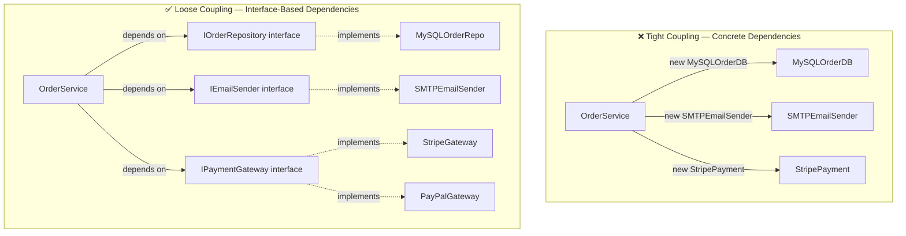
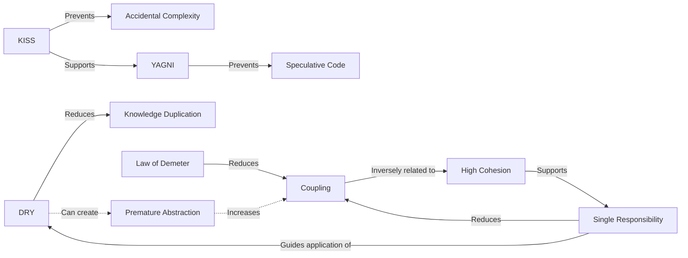

# 🏛️ Software Design Principles — Principal Staff Architect Guide

> **Scope:** DRY · KISS · YAGNI · Law of Demeter · Coupling · Cohesion
> **Level:** Principal/Staff Engineer interview prep
> **Focus:** Frontend-first with full-stack context

---

## 📑 Table of Contents

1. [DRY — Don't Repeat Yourself](#-dry--dont-repeat-yourself)
2. [KISS — Keep It Simple, Stupid](#-kiss--keep-it-simple-stupid)
3. [YAGNI — You Ain't Gonna Need It](#-yagni--you-aint-gonna-need-it)
4. [Law of Demeter — Principle of Least Knowledge](#-law-of-demeter--principle-of-least-knowledge)
5. [Coupling](#-coupling)
6. [Cohesion](#-cohesion)
7. [Principles Comparison Table](#-principles-comparison-table)
8. [Q&A Self-Test](#-qa-self-test)

---

## 🔁 DRY — Don't Repeat Yourself

### What DRY Really Means

DRY is **not** simply "don't copy-paste code." The canonical definition from _The Pragmatic Programmer_ (Hunt & Thomas) is:

> _"Every piece of **knowledge** must have a single, unambiguous, authoritative representation within a system."_

The key word is **knowledge** — not syntax. Two pieces of code that look identical are not violating DRY if they represent _different concerns_ that happen to look the same today. DRY is violated when two pieces of code encode the **same business rule**, the **same data schema**, or the **same algorithm** in multiple places such that changing the rule requires changing multiple locations.

### The Real DRY Violations

```typescript
// ❌ VIOLATION — Same business rule in two places
// In the frontend form validation:
const isValidEmail = (email: string) => /^[^\s@]+@[^\s@]+\.[^\s@]+$/.test(email);

// In the backend API validation (separate file, separate team maybe):
const validateEmail = (email: string) => /^[^\s@]+@[^\s@]+\.[^\s@]+$/.test(email);
// If the email validation rule changes, it must be changed in 2+ places.
// This is a DRY violation — the KNOWLEDGE of what a valid email is exists twice.
```

```typescript
// ✅ CORRECT — Single source of truth for the rule
// shared/validators.ts
export const EMAIL_REGEX = /^[^\s@]+@[^\s@]+\.[^\s@]+$/;
export const isValidEmail = (email: string): boolean => EMAIL_REGEX.test(email);

// Both frontend and backend import from the shared module.
// Changing the rule is now a single-point change.
```

### When DRY Is WRONG — The Premature Abstraction Trap

> **⚠️ Warning:** The most dangerous form of DRY violation is _over-application_. Forcing abstractions too early creates **coupling between unrelated concerns** that looks like good design but is actually worse than the duplication it replaced.

The "Rule of Three" (Martin Fowler): abstract only after you see a pattern **three times**. Even then, ask: _is this duplication of code, or duplication of knowledge?_

```typescript
// ❌ PREMATURE DRY — Two things that look the same but are NOT the same concern

const updateUserProfile = async (userId: string, data: Partial<User>) => {
  const response = await fetch(`/api/users/${userId}`, {
    method: 'PATCH',
    body: JSON.stringify(data),
  });
  return response.json();
};

const updateProduct = async (productId: string, data: Partial<Product>) => {
  const response = await fetch(`/api/products/${productId}`, {
    method: 'PATCH',
    body: JSON.stringify(data),
  });
  return response.json();
};

// A developer "fixes" the DRY violation with a generic:
const updateResource = async <T>(resource: string, id: string, data: Partial<T>) => {
  const response = await fetch(`/api/${resource}/${id}`, {
    method: 'PATCH',
    body: JSON.stringify(data),
  });
  return response.json();
};

// NOW: Products need CSRF tokens, Users need audit logging, Inventory needs
// optimistic locking. The abstraction breaks down immediately.
// You must add special-case conditionals inside the "generic" function.
// It's now HARDER to maintain than the original duplication.
```

```typescript
// ✅ CORRECT — Let them diverge as their needs diverge

class UserRepository {
  async update(userId: string, data: Partial<User>): Promise<User> {
    const response = await this.http.patch(`/api/users/${userId}`, data, {
      headers: { 'X-Audit': 'user-update' }, // User-specific concern
    });
    return response.data;
  }
}

class ProductRepository {
  async update(productId: string, data: Partial<Product>): Promise<Product> {
    const response = await this.http.patch(`/api/products/${productId}`, data, {
      headers: { 'X-CSRF': this.csrfToken }, // Product-specific concern
    });
    return response.data;
  }
}
// Yes, there's structural similarity. But the KNOWLEDGE encoded is different.
// These can evolve independently without touching each other.
```

### WET Code vs DRY at Scale

| Dimension           | WET (Write Everything Twice)               | Over-DRY (Premature Abstraction)               | Balanced DRY                     |
| ------------------- | ------------------------------------------ | ---------------------------------------------- | -------------------------------- |
| **Change locality** | Changes affect multiple files              | Single abstraction file                        | Shared only for shared knowledge |
| **Cognitive load**  | Low per-file, high globally                | High — must trace through abstraction          | Moderate                         |
| **Bug surface**     | Bug in one copy may not be fixed elsewhere | Bug in abstraction affects all consumers       | Bugs localized by concern        |
| **Flexibility**     | High — easy to diverge                     | Low — divergence requires breaking abstraction | Each concern evolves freely      |
| **Onboarding**      | Junior-friendly to read                    | Hard to trace call chains                      | Clear ownership                  |

> **🏛️ At the Principal Level:** DRY is a _tool_, not a religion. The question to ask is always: _"If this rule changes, how many places must I touch, and are those places owned by the same team?"_ Cross-team duplication is a DRY violation worth solving. Same-team syntactic similarity is often fine to leave alone until a real pattern emerges from three real occurrences.

---

## 😌 KISS — Keep It Simple, Stupid

### What 'Simple' Really Means in Architecture

**Simple ≠ Easy.** Rich Hickey's seminal talk _"Simple Made Easy"_ draws this distinction sharply:

- **Simple** means _not compound_ — one role, one concept, one axis of change
- **Easy** means _familiar_ or _close at hand_ — your existing comfort zone

A Redux store with 40 reducers, 200 action types, and normalized entity state is **easy** to a Redux veteran, but it is not **simple** — it has many moving parts, many layers, and many indirections. A simple solution may be _unfamiliar_ but has few interconnections.

In architecture, simplicity means:

- **Fewer moving parts** — each part does one thing
- **Fewer surprises** — the code does what it looks like it does
- **Fewer dependency chains** — changes are localized
- **Transparent data flow** — you can trace where data comes from and where it goes

### Over-Engineering Examples in Frontend

#### Over-Abstracted React Components

```typescript
// ❌ OVER-ENGINEERED — "Generic" button trying to handle every possible use case
interface ButtonProps {
  variant: 'primary' | 'secondary' | 'ghost' | 'danger' | 'link';
  size: 'xs' | 'sm' | 'md' | 'lg' | 'xl';
  leftIcon?: React.ComponentType<{ size: number; color: string }>;
  rightIcon?: React.ComponentType<{ size: number; color: string }>;
  isLoading?: boolean;
  loadingText?: string;
  loadingSpinner?: React.ReactNode;
  isDisabled?: boolean;
  isFullWidth?: boolean;
  onClick?: (event: React.MouseEvent<HTMLButtonElement>) => void;
  onHover?: (event: React.MouseEvent<HTMLButtonElement>) => void;
  onFocus?: (event: React.FocusEvent<HTMLButtonElement>) => void;
  tooltip?: string;
  tooltipPlacement?: 'top' | 'bottom' | 'left' | 'right';
  analyticsEvent?: string;
  analyticsPayload?: Record<string, unknown>;
  renderAs?: React.ElementType; // Can render as <a>, <div>, <span>
  href?: string; // Only when renderAs='a'
  target?: string; // Only when renderAs='a'
  // ... 15 more props
}
// This component has 25+ props. Impossible to understand without reading every prop.
// Every feature of every consumer bleeds into one shared component.
```

```typescript
// ✅ KISS — Separate concerns into small, composable pieces
const Button: React.FC<{
  variant: 'primary' | 'secondary' | 'danger';
  onClick: () => void;
  disabled?: boolean;
  children: React.ReactNode;
}> = ({ variant, onClick, disabled, children }) => (
  <button className={styles[variant]} onClick={onClick} disabled={disabled}>
    {children}
  </button>
);

// Compose, don't parameterize:
const LoadingButton: React.FC<
  { isLoading: boolean } & React.ComponentProps<typeof Button>
> = ({ isLoading, children, ...rest }) => (
  <Button {...rest}>
    {isLoading ? <Spinner /> : children}
  </Button>
);

// Analytics is a cross-cutting concern — use a HOC or hook, not a prop
const withAnalytics = (Component: React.ComponentType<any>, eventName: string) =>
  (props: any) => {
    const handleClick = () => {
      analytics.track(eventName);
      props.onClick?.();
    };
    return <Component {...props} onClick={handleClick} />;
  };
```

#### Over-Engineered State Management

```typescript
// ❌ OVER-ENGINEERED — Redux + Sagas + Normalizr for a simple todo list
// 5 files, 200 lines, 3 libraries — for something that should be 20 lines

// ✅ KISS — Use the right tool for the job
function TodoList() {
  const [todos, setTodos] = useState<string[]>([]);
  const [input, setInput] = useState('');

  const addTodo = () => {
    if (!input.trim()) return;
    setTodos(prev => [...prev, input.trim()]);
    setInput('');
  };

  return (
    <div>
      <input value={input} onChange={e => setInput(e.target.value)} />
      <button onClick={addTodo}>Add</button>
      <ul>{todos.map((t, i) => <li key={i}>{t}</li>)}</ul>
    </div>
  );
}
// When this grows into a multi-user collaborative app, THEN add complexity.
// Not speculatively before the need exists.
```

### When Complexity IS the Right Choice

Complexity is justified when it is **essential** (required by the domain) rather than **accidental** (introduced by the solution):

| Situation                     | Justified Complexity                     | Example                                       |
| ----------------------------- | ---------------------------------------- | --------------------------------------------- |
| **Domain inherently complex** | Model the domain accurately              | Financial ledger with double-entry accounting |
| **Scale demands it**          | Distributed systems, caching layers      | CDN cache invalidation logic                  |
| **Reliability requirements**  | Circuit breakers, retry logic, fallbacks | Payment processing                            |
| **Security requirements**     | Encryption, key management, audit trails | Auth/authz systems                            |
| **Performance critical path** | Bitwise ops, memory pools, WASM          | Game engine rendering loop                    |

> **🏛️ At the Principal Level:** When you propose a complex solution, you must articulate exactly which requirement makes the complexity _necessary_. "We might need it" or "it's cleaner" are not valid justifications. Simple systems are easier to operate, debug, and hand off. The burden of proof is always on complexity, never on simplicity.

---

## 🚫 YAGNI — You Ain't Gonna Need It

### The Cost of Speculative Features

YAGNI is an Extreme Programming (XP) principle: **implement things only when you actually need them, never when you just foresee you might need them.**

The costs of speculative features are **compounding**:

1. **Implementation cost** — time spent building something not yet needed
2. **Maintenance cost** — every line of code is a liability; speculative code must be kept working through all refactors
3. **Cognitive overhead** — other engineers must understand and reason around unused abstractions
4. **Coupling cost** — speculative abstractions create entanglement that makes future changes harder, not easier
5. **Dead code risk** — the "future need" never materializes; you carry dead weight indefinitely
6. **Opportunity cost** — time spent on speculation displaces actual value delivery

### YAGNI vs Future-Proofing Tradeoff

The tension is real. There are legitimate cases where future-proofing is cheaper than retrofitting:

```
                    COST OF ADDING LATER

High  |                                              ●  Distributed transactions
      |                                          ●  Shard key design
      |                                    ●  Auth/authz model
      |                            ●  API versioning strategy
      |                      ●  Database schema normalization
      |              ●  Component API surface design
Low   |      ●  Logging format / verbosity
      +---------------------------------------------------------------►
              Easy to add later                    Hard to add later

YAGNI zone: bottom-left quadrant  |  Future-proof zone: right quadrant
```

**YAGNI applies when:** The future use case is speculative AND the change is cheap to make later.
**Future-proof when:** The architectural decision is expensive or impossible to change once made.

```typescript
// ❌ YAGNI VIOLATION — "We might need plugins someday"
class DataProcessor {
  private plugins: Plugin[] = [];
  private hooks: Map<string, HookFn[]> = new Map();
  private middlewareChain: Middleware[] = [];

  registerPlugin(plugin: Plugin): this {
    /* ... */ return this;
  }
  addHook(event: string, fn: HookFn): this {
    /* ... */ return this;
  }
  use(middleware: Middleware): this {
    /* ... */ return this;
  }

  process(data: unknown): unknown {
    // Run pre-hooks, middleware, plugins, post-hooks...
    // 80 lines of infrastructure for 5 lines of actual processing
  }
}

// ✅ YAGNI — Process the data. Add extensibility when the need is proven.
class DataProcessor {
  process(data: RawData): ProcessedData {
    return {
      id: data.id,
      value: data.raw_value * 100,
      timestamp: new Date(data.ts * 1000),
    };
  }
}
// When you need a plugin system, you refactor. That refactor takes 1 day.
// The speculative plugin infrastructure cost 3 days and sits unused.
```

### Real Example: API Design and YAGNI

```typescript
// ❌ YAGNI VIOLATION in API design
// Team builds full GraphQL layer (resolvers, schema, dataloaders, subscriptions)
// for a simple internal dashboard with 3 queries and 1 mutation.
// Cost: 2 weeks, significant ongoing maintenance overhead.

// ✅ YAGNI — REST endpoints for what you actually need today
// GET  /api/dashboard/summary
// GET  /api/dashboard/metrics?range=7d
// POST /api/dashboard/export
//
// When you have 50 complex interconnected queries with variable depth,
// THEN evaluate GraphQL. The migration is well-justified at that point.

// ❌ YAGNI — API versioning infrastructure with zero consumers
interface ApiResponse<T> {
  version: 'v1' | 'v2' | 'v3'; // Only v1 exists today
  data: T;
  meta: {
    pagination?: Pagination;
    deprecationWarnings?: string[]; // No deprecations exist yet
    experimentalFlags?: string[]; // No experiments exist yet
  };
}

// ✅ YAGNI — Version when you have breaking changes to ship
interface ApiResponse<T> {
  data: T;
}
// Add versioning when you need it. Most APIs stay on v1 indefinitely.
```

> **🏛️ At the Principal Level:** YAGNI is not about being myopic — it's about **deferring decisions until you have more information**. A decision made today with incomplete requirements will be wrong more often than right. A decision made in 6 months with real usage data will be informed by reality. The best architects are expert at identifying which decisions _must_ be made now (irreversible, high cost to change) vs which can be deferred (reversible, low cost to change).

---

## 🤝 Law of Demeter — Principle of Least Knowledge

### The Rule

The Law of Demeter (LoD), also called the **Principle of Least Knowledge**, states:

> _"A unit should only talk to its immediate friends. Don't talk to strangers."_

Formally, a method `M` on object `O` may only call methods on:

1. `O` itself
2. Objects passed as parameters to `M`
3. Objects created or instantiated within `M`
4. `O`'s direct component objects (fields of `O`)
5. Global or static objects accessible to `O`

**What is NOT allowed:** calling methods on objects that were obtained by calling a method on another object — i.e., navigating the object graph.

### The "Don't Talk to Strangers" Problem

```typescript
// ❌ VIOLATION — Deep chain: a.b.c.d.method()
class OrderService {
  processOrder(order: Order): void {
    // This method knows about Order, Customer, Address, City, LoyaltyProgram,
    // Tier, Preferences, Billing, and Currency internals — 4 levels deep.
    const taxRate = order.customer.address.city.taxRate;
    const discount = order.customer.loyaltyProgram.currentTier.discountPercent;
    const currency = order.customer.preferences.billing.currency.symbol;

    const total = order.subtotal * (1 + taxRate) * (1 - discount / 100);
    console.log(`${currency}${total}`);
  }
}

// Problems:
// 1. If Customer refactors `loyaltyProgram` into `rewards` — this breaks
// 2. If Address moves `taxRate` to a separate Tax service — this breaks
// 3. OrderService is coupled to the internal structure of Customer, Address,
//    City, LoyaltyProgram, Tier, Preferences, Billing, and Currency
// 4. Unit testing requires constructing a full 4-level object graph
// 5. Static analysis cannot detect this coupling — it's runtime knowledge
```

```typescript
// ✅ CORRECT — Each object exposes what its callers need, handles delegation internally

class Order {
  getTaxRate(): number {
    return this.customer.getTaxRate(); // Order talks to Customer — its friend
  }

  getDiscountPercent(): number {
    return this.customer.getLoyaltyDiscount(); // Delegates; Customer handles internally
  }

  getCurrencySymbol(): string {
    return this.customer.getBillingCurrencySymbol(); // Delegates; Customer handles internally
  }
}

class Customer {
  getTaxRate(): number {
    return this.address.getTaxRate(); // Customer talks to Address — its friend
  }

  getLoyaltyDiscount(): number {
    return this.loyaltyProgram.getDiscountPercent(); // LoyaltyProgram handles tier logic
  }

  getBillingCurrencySymbol(): string {
    return this.preferences.getBillingCurrencySymbol();
  }
}

// Now OrderService only talks to Order — its only direct friend:
class OrderService {
  processOrder(order: Order): void {
    const taxRate = order.getTaxRate();
    const discount = order.getDiscountPercent();
    const currency = order.getCurrencySymbol();

    const total = order.subtotal * (1 + taxRate) * (1 - discount / 100);
    console.log(`${currency}${total}`);
  }
}
// If Customer's internals change, only Customer.ts changes. OrderService is stable.
```

### TypeScript Example: Tell, Don't Ask

The LoD violation pattern is often called "Ask" style. The fix is "Tell" style:

```typescript
// ❌ VIOLATION — "Ask" pattern: query internal state to make a decision externally
class ShoppingCart {
  checkout(paymentService: PaymentService): void {
    // Cart is asking about PaymentService's internals to make a decision
    // that PaymentService itself should be making
    if (paymentService.getGateway().isAvailable() && paymentService.getGateway().getConfig().supports3DS) {
      paymentService.getGateway().processWithThreeDS(this.total);
    } else {
      paymentService.getGateway().processBasic(this.total);
    }
  }
}

// ✅ CORRECT — "Tell" pattern: tell the service what to do; let it decide how
class ShoppingCart {
  checkout(paymentService: PaymentService): Promise<PaymentResult> {
    // Cart tells PaymentService what it needs; service decides the how
    return paymentService.processPayment({
      amount: this.total,
      requires3DS: this.hasHighValueItems(), // Cart's own knowledge
    });
  }
}

class PaymentService {
  async processPayment(request: PaymentRequest): Promise<PaymentResult> {
    // PaymentService manages its own gateway — these are its friends
    if (!this.gateway.isAvailable()) throw new GatewayUnavailableError();

    return request.requires3DS && this.gateway.getConfig().supports3DS
      ? this.gateway.processWithThreeDS(request.amount)
      : this.gateway.processBasic(request.amount);
  }
}
```

### Frontend Relevance: Prop Drilling vs LoD

Prop drilling is a classic LoD violation in React — a grandparent "reaches through" intermediate components that are strangers to the data:

```typescript
// ❌ PROP DRILLING — Data travels through components that don't use it
function App() {
  const [user, setUser] = useState<User>(currentUser);
  // App forces Header (a stranger) to carry user data for deeper descendants
  return <Header user={user} setUser={setUser} />;
}

function Header({ user, setUser }: { user: User; setUser: (u: User) => void }) {
  return <Nav user={user} setUser={setUser} />; // Header doesn't USE user — just passes it
}

function Nav({ user, setUser }: { user: User; setUser: (u: User) => void }) {
  return <UserMenu user={user} setUser={setUser} />; // Nav doesn't USE user — just passes it
}

// ✅ LoD-respecting — Context provides data without intermediary carriers
const UserContext = React.createContext<User | null>(null);

function App() {
  const [user] = useState<User>(currentUser);
  return (
    <UserContext.Provider value={user}>
      <Header />
    </UserContext.Provider>
  );
}

function Header() {
  return <Nav />; // No user prop — Header is not a carrier for strangers
}

function UserMenu() {
  const user = useContext(UserContext); // UserMenu talks directly to its data source
  return <Avatar name={user?.name} avatarUrl={user?.avatar} />;
}
```

> **🏛️ At the Principal Level:** LoD violations create hidden coupling between distant layers. When a deeply nested component needs data from a remote ancestor through intermediaries, every intermediate layer becomes coupled to that data shape. A refactor to the data model cascades through layers that shouldn't know about it. At scale, LoD violations are a leading cause of "why does changing this break that?" — the coupling is real but invisible in the type signatures.

---

## 🔗 Coupling

### What is Coupling?

Coupling measures **how much one module knows about, depends on, or is affected by another module**. High coupling means changes in one module are likely to require changes in another. Low coupling means modules are relatively independent.

Coupling is **not inherently bad** — some coupling is necessary (your app must use React; your service must call a database). The goal is **appropriate coupling**: depending on stable abstractions rather than volatile implementations.

### Types of Coupling (Worst → Best)

#### 1. Content Coupling — Avoid Always

One module directly accesses or modifies the internal (private) data of another, bypassing encapsulation entirely.

```typescript
// ❌ Content coupling — accessing private internals via casting
class OrderQueue {
  private _items: Order[] = [];
}

// Module B bypasses encapsulation
const queue = new OrderQueue();
(queue as any)._items.push(newOrder); // Any change to _items breaks this
```

#### 2. Common Coupling — Avoid

Multiple modules share the same global mutable state. Any module can corrupt it; order of operations matters.

```typescript
// ❌ Common coupling — shared mutable global
let globalCart: CartItem[] = [];

class CartService {
  addItem(item: CartItem) {
    globalCart.push(item);
  }
}

class CheckoutService {
  getTotal(): number {
    return globalCart.reduce((sum, item) => sum + item.price, 0);
  }
}
// This is the fundamental problem with unmanaged global state in any app.
// It is also why Zustand/Redux without disciplined patterns becomes dangerous.
```

#### 3. Control Coupling — Use Carefully

One module controls the behavior of another by passing a flag that determines its internal execution path.

```typescript
// ❌ Control coupling — 'mode' flag drives different code paths inside
function renderWidget(data: Data, mode: 'full' | 'compact' | 'preview'): JSX.Element {
  if (mode === 'full') return <FullWidget data={data} />;
  if (mode === 'compact') return <CompactWidget data={data} />;
  return <PreviewWidget data={data} />;
}

// ✅ Strategy pattern eliminates control coupling
const widgetRenderers: Record<string, (data: Data) => JSX.Element> = {
  full: (data) => <FullWidget data={data} />,
  compact: (data) => <CompactWidget data={data} />,
  preview: (data) => <PreviewWidget data={data} />,
};

const renderWidget = (data: Data, mode: string) =>
  widgetRenderers[mode]?.(data) ?? <DefaultWidget data={data} />;
// Adding a new mode requires no change to renderWidget — open/closed principle
```

#### 4. Stamp Coupling — Accept Consciously

Modules share a composite data structure but each only uses part of it. Tradeoff: simpler call sites vs unnecessary knowledge of data shape.

```typescript
// Stamp coupling — component receives full User but only uses 2 fields
interface User {
  id: string; name: string; email: string; avatar: string;
  role: Role; permissions: string[]; lastLogin: Date; preferences: Preferences;
}

// ❌ Stamp coupling — UserAvatar knows the full User shape
const UserAvatar: React.FC<{ user: User }> = ({ user }) => (
  
);

// ✅ Data coupling — UserAvatar knows only what it needs
const UserAvatar: React.FC<{ name: string; avatarUrl: string }> = ({ name, avatarUrl }) => (
  
);
// Caller: <UserAvatar name={user.name} avatarUrl={user.avatar} />
// Now UserAvatar doesn't care how User is structured internally
```

#### 5. Data Coupling — Aim For This

Modules communicate only through minimal, primitive data parameters — exactly what each needs, nothing more.

```typescript
// ✅ Data coupling — clean, minimal interface
const formatCurrency = (amount: number, currency: string): string =>
  new Intl.NumberFormat('en-US', { style: 'currency', currency }).format(amount);

// Function knows nothing about Order, User, or any domain object
formatCurrency(order.total, order.currency);
```

#### 6. Temporal Coupling — Often Missed in Reviews

Two operations must happen in a specific order, but this constraint is not enforced by the type system — only by convention.

```typescript
// ❌ Temporal coupling — initialize() MUST precede track(), but nothing enforces it
class AnalyticsService {
  private client: AnalyticsClient | null = null;

  initialize(config: Config): void {
    this.client = new AnalyticsClient(config);
  }

  track(event: string): void {
    this.client!.send(event); // Runtime crash if initialize() was never called
  }
}

// ✅ Eliminate temporal coupling — make illegal states unrepresentable
class AnalyticsService {
  private constructor(private readonly client: AnalyticsClient) {}

  static create(config: Config): AnalyticsService {
    return new AnalyticsService(new AnalyticsClient(config));
  }

  track(event: string): void {
    this.client.send(event); // client is always initialized — type guarantees it
  }
}
// Cannot create AnalyticsService without a fully initialized client.
// The TypeScript type system now enforces the ordering constraint.
```

### How to Measure Coupling

| Metric                             | Description                                        | Tool                   |
| ---------------------------------- | -------------------------------------------------- | ---------------------- |
| **Afferent Coupling (Ca)**         | # of modules that depend _on_ this module (fan-in) | dependency-cruiser     |
| **Efferent Coupling (Ce)**         | # of modules this module depends _on_ (fan-out)    | Madge                  |
| **Instability (I)**                | I = Ce / (Ca + Ce); 0 = stable, 1 = unstable       | Derived metric         |
| **Coupling Between Objects (CBO)** | # of other classes a class is directly coupled to  | SonarQube              |
| **Circular dependencies**          | Module A → B → C → A                               | ESLint import/no-cycle |

```bash
# Detect circular dependencies in a frontend TypeScript project
npx madge --circular --extensions ts,tsx src/

# Full dependency visualization and policy enforcement
npx dependency-cruiser --validate .dependency-cruiser.js src/
```

### Mermaid Diagram: Tight vs Loose Coupling



### CSS Coupling — A Frontend-Specific Problem

```css
/* ❌ High CSS coupling — tightly bound to DOM structure */
.page-wrapper > .header .nav ul > li > a.active { color: red; }
/* Breaks if: any ancestor is renamed, nav is restructured, ul changes to ol */

/* ✅ Low coupling — component-scoped, structure-independent */
.nav-link--active { color: red; }

/* ✅ Even better — CSS Modules (zero global coupling) */
/* styles.module.css → styles.navLinkActive */

/* ✅ Or CSS-in-JS */
const NavLink = styled.a<{ isActive: boolean }>`
  color: ${p => p.isActive ? 'red' : 'inherit'};
`;
```

> **🏛️ At the Principal Level:** The question to ask about any coupling is: _"What is the stability of the thing I'm coupling to?"_ Coupling to stable abstractions (interfaces, contracts, published APIs) is good engineering. Coupling to volatile implementations (specific database schemas, third-party API shapes, DOM structure, concrete classes) creates fragility. When reviewing architecture, check that dependency arrows always point toward stability — the Stable Dependencies Principle.

---

## 🎯 Cohesion

### What is Cohesion?

Cohesion measures **how strongly related and focused the responsibilities of a module are**. High cohesion means a module does one well-defined thing. Low cohesion means a module is a grab-bag of unrelated functionality that happens to live in the same file.

**Cohesion and coupling are inversely correlated:** high cohesion tends to drive low coupling naturally. A module that does one thing well has fewer reasons to depend on many other modules.

### The Cohesion Spectrum (Lowest → Highest)

| Level | Name                | Description                                       | Frontend Example                                          |
| ----- | ------------------- | ------------------------------------------------- | --------------------------------------------------------- |
| 1     | **Coincidental**    | Parts grouped arbitrarily                         | `utils.ts` with `formatDate`, `validateEmail`, `parseXML` |
| 2     | **Logical**         | Parts grouped because they "seem related"         | `StringHelpers` with every possible string operation      |
| 3     | **Temporal**        | Parts grouped because they run at the same time   | `AppInitializer` that inits DB, cache, logger, analytics  |
| 4     | **Procedural**      | Parts must execute in order                       | Wizard steps all in one class                             |
| 5     | **Communicational** | Parts operate on the same data                    | `UserOperations` that reads, writes, and validates `User` |
| 6     | **Sequential**      | Output of one part feeds the next                 | ETL pipeline steps                                        |
| 7     | **Functional** ✅   | All parts work toward a single, well-defined goal | `EmailValidator` that only validates email addresses      |

**Goal: Functional cohesion (level 7) at minimum. Sequential (level 6) when modeling pipelines.**

### Frontend Examples: Low Cohesion React Components

```typescript
// ❌ LOW COHESION — "Kitchen Sink" dashboard component
// This component changes when: data fetching changes, layout changes,
// business rules change, analytics events change, notification logic changes,
// form validation changes, pagination changes — that's 7+ reasons to change.
const DashboardPage: React.FC = () => {
  const [user, setUser] = useState<User | null>(null);
  const [activeTab, setActiveTab] = useState(0);
  const [chartData, setChartData] = useState<ChartData[]>([]);
  const [notifications, setNotifications] = useState<Notification[]>([]);
  const [isModalOpen, setIsModalOpen] = useState(false);
  const [formData, setFormData] = useState<FormData>({});
  const [currentPage, setCurrentPage] = useState(1);

  useEffect(() => { /* fetch user profile */ }, []);
  useEffect(() => { /* fetch chart data for active tab */ }, [activeTab]);
  useEffect(() => { /* websocket for notifications */ }, []);
  useEffect(() => { /* sync URL params to state */ }, [activeTab, currentPage]);

  const handleFormSubmit = () => { /* ... */ };
  const handleTabChange = (tab: number) => { /* ... */ };
  // ... 8 more handlers for unrelated things

  return <div>{/* 300 lines of interleaved JSX */}</div>;
};
```

```typescript
// ✅ HIGH COHESION — Split by functional responsibility

// Focused: manages only current user data fetching
function useCurrentUser() {
  const [user, setUser] = useState<User | null>(null);
  useEffect(() => {
    userService.getCurrent().then(setUser);
  }, []);
  return { user, setUser };
}

// Focused: manages chart data for the current tab
function useChartData(activeTab: string) {
  const [data, setData] = useState<ChartData[]>([]);
  useEffect(() => {
    analyticsService.getChartData(activeTab).then(setData);
  }, [activeTab]);
  return data;
}

// Focused: manages real-time notifications via WebSocket
function useNotifications() {
  const [notifications, setNotifications] = useState<Notification[]>([]);
  useEffect(() => {
    const ws = notificationService.connect();
    ws.on('notification', (n: Notification) =>
      setNotifications(prev => [n, ...prev])
    );
    return () => ws.disconnect();
  }, []);
  const dismiss = (id: string) =>
    setNotifications(prev => prev.filter(n => n.id !== id));
  return { notifications, dismiss };
}

// Thin orchestrator — only composes focused pieces; minimal own logic
const DashboardPage: React.FC = () => {
  const { user } = useCurrentUser();
  const [activeTab, setActiveTab] = useState('overview');
  const chartData = useChartData(activeTab);
  const { notifications, dismiss } = useNotifications();

  return (
    <DashboardLayout>
      <UserHeader user={user} />
      <TabNav active={activeTab} onChange={setActiveTab} />
      <ChartSection data={chartData} />
      <NotificationPanel items={notifications} onDismiss={dismiss} />
    </DashboardLayout>
  );
};
// Each hook has exactly one reason to change. DashboardPage is a thin coordinator.
// Three engineers can work on three hooks simultaneously with zero merge conflicts.
```

### Cohesion vs Single Responsibility Principle

These are **two sides of the same coin**, approaching the same goal from different angles:

| Concept      | Asks                                          | Directs You To                 |
| ------------ | --------------------------------------------- | ------------------------------ |
| **SRP**      | How many reasons can this module change?      | Split when count > 1           |
| **Cohesion** | How related are the parts inside this module? | Split when parts are unrelated |

SRP tells you **when to split** (more than one axis of change).
Cohesion tells you **how well you've split** (are all remaining parts functionally related?).

A module can satisfy SRP yet still have low cohesion if its parts are only _temporally_ or _logically_ grouped:

```typescript
// SRP-compliant (one owner: DevOps team) but low cohesion (unrelated parts)
class AppConfig {
  getDatabaseUrl(): string {
    return process.env.DATABASE_URL!;
  }
  getSmtpHost(): string {
    return process.env.SMTP_HOST!;
  }
  getRedisUrl(): string {
    return process.env.REDIS_URL!;
  }
  getS3Bucket(): string {
    return process.env.S3_BUCKET!;
  }
  // These items are grouped logically ("all config") but are not functionally cohesive
}

// ✅ High cohesion — each class focused on one subsystem's configuration
class DatabaseConfig {
  get url(): string {
    return process.env.DATABASE_URL!;
  }
  get poolSize(): number {
    return Number(process.env.DB_POOL_SIZE ?? 10);
  }
  get timeout(): number {
    return Number(process.env.DB_TIMEOUT ?? 5000);
  }
  get ssl(): boolean {
    return process.env.DB_SSL === 'true';
  }
}

class EmailConfig {
  get smtpHost(): string {
    return process.env.SMTP_HOST!;
  }
  get smtpPort(): number {
    return Number(process.env.SMTP_PORT ?? 587);
  }
  get fromAddress(): string {
    return process.env.EMAIL_FROM!;
  }
  get replyTo(): string {
    return process.env.EMAIL_REPLY_TO ?? this.fromAddress;
  }
}
// Each config class has functional cohesion — all fields relate to one subsystem
```

> **🏛️ At the Principal Level:** The most actionable signal for low cohesion in a code review is the word "and" in a component, function, or module name: `UserFormAndValidation`, `fetchDataAndUpdateCache`, `AuthServiceAndSessionManager`. Every "and" represents a missed split opportunity. High-cohesion code reads as a clear newspaper headline — single subject, clear verb, one thing. Also watch for: files with high commit frequency AND many different authors touching them for entirely unrelated features. That's a cohesion failure manifesting as a sociotechnical problem.

---

## 📊 Principles Comparison Table

| Principle          | Primary Question                                   | Violation Symptom                                         | Remedy                                    | Frontend Manifestation                          |
| ------------------ | -------------------------------------------------- | --------------------------------------------------------- | ----------------------------------------- | ----------------------------------------------- |
| **DRY**            | Is this _knowledge_ defined once?                  | Bug fixed in one place reappears elsewhere                | Shared module / single source of truth    | Duplicated email validation in form + API       |
| **KISS**           | Is there a simpler way to achieve the same result? | New engineer can't understand it in 15 min                | Remove layers; use standard patterns      | 25-prop "god" button component                  |
| **YAGNI**          | Do I need this _today_?                            | Unused code paths, zero-consumer abstractions             | Delete speculative code; defer decisions  | Plugin system built for a feature never shipped |
| **Law of Demeter** | Am I talking to strangers?                         | `a.b.c.d.method()` chains                                 | Tell-don't-ask; intermediate delegation   | 6-level prop drilling chains                    |
| **Coupling**       | How much does this module know about others?       | Changing A breaks B unexpectedly                          | Depend on interfaces; inject dependencies | CSS using 5-level deep DOM selectors            |
| **Cohesion**       | Do the parts inside this module belong together?   | "And" in module names; file changes for unrelated reasons | Split by functional responsibility        | Dashboard managing 10 unrelated concerns        |

### Principle Interaction Map



---

## ❓ Q&A Self-Test

<details>
<summary>❓ 1. A teammate says "we're violating DRY — the validation logic in the frontend form and backend API look identical." How do you respond?</summary>

**Answer:** This is a nuanced DRY question. First, ask: _do they represent the same knowledge?_

If the frontend and backend are validating the same business rule (e.g., "a username must be 3–20 alphanumeric characters, per product spec"), then yes — this is a real DRY violation. The rule exists in two places and could drift independently. Fix: extract to a shared module (`shared-validators` package) used by both layers.

However, if the frontend validation exists for _UX_ (fast feedback, no network round-trip) and the backend for _security_ (never trust client input), they may represent _different concerns that happen to look similar today_. As the product evolves, they'll likely diverge (e.g., backend adds server-side sanitization that the frontend doesn't need). Forcing a shared abstraction here creates coupling between layers that should be independent.

**Principal-level answer:** Push back on reflexive DRY. Ask: "What happens if the rule changes — do both layers need to change together? Who owns the canonical source of this rule?" If shared knowledge: extract. If coincidentally similar: leave separate and document the intentional separation.

</details>

<details>
<summary>❓ 2. How do you decide if adding a plugin/extensibility system is YAGNI or justified future-proofing?</summary>

**Answer:** The framework is: **cost of adding later** × **probability of actual need** vs **cost of carrying it now**.

Ask:

1. **Is there a concrete, committed use case?** A vague "we might need this" is YAGNI territory. A confirmed roadmap item with a team assigned is not speculative.
2. **How expensive is retrofitting?** A webhook system in a public API with versioning commitments is expensive to add retroactively (requires a v2 with a migration period). Internal code refactorable in a sprint is cheap.
3. **What is the carry cost?** A plugin system adds testing surface, documentation burden, and cognitive overhead for every engineer going forward. If unused for 2 years, those costs compound significantly.

**Typical answer:** For internal services, defer until the need is real and concrete. For public APIs with external consumers and versioning commitments, invest earlier. For data schemas and auth models, future-proof because the retrofit cost is disproportionately high.

</details>

<details>
<summary>❓ 3. What is temporal coupling and give a concrete frontend example?</summary>

**Answer:** Temporal coupling is when two operations must happen in a specific sequence, but that constraint is not enforced by the type system — only by documentation or convention.

**Frontend example:** A React `AnalyticsProvider` component that must be mounted _before_ any descendant calls `useAnalytics()`. If a developer renders a tracked component outside the provider tree, they get either a runtime error or silent undefined behavior. The temporal dependency (provider must exist before consumer) is not encoded in the type system at all.

Another example: calling `initialize()` before `track()` on an analytics service. TypeScript allows calling `track()` on an uninitialized instance; you only discover the bug at runtime.

**Fix:** Make illegal states unrepresentable. The `create` factory pattern (as shown in the Coupling section) eliminates temporal coupling by making it structurally impossible to create an instance in an uninitialized state.

</details>

<details>
<summary>❓ 4. A team has a 1000-line React component that "works fine." When would you argue for splitting it, and on what basis?</summary>

**Answer:** Size alone is not the argument — focus on structure:

1. **Multiple reasons to change (SRP):** If it changes when data fetching changes, when layout changes, when business rules change, AND when analytics events change — it has 4+ reasons to change. Each reason is a split opportunity.
2. **Low cohesion:** Unrelated state (user data + chart data + modal state + form state) in one component means the parts don't belong together. Split by concern into focused custom hooks.
3. **Testability:** A 1000-line component requires complex setup to test any single behavior. High cohesion → simpler, faster, more reliable unit tests.
4. **Reusability blocked:** If sub-sections would be valuable elsewhere but can't be extracted because they're entangled, that's a solvable cohesion problem.
5. **Chronic merge conflicts:** If 3 engineers regularly conflict on the same file for different features, that's a cohesion failure manifesting as a team-level problem.

**Practical pitch:** "This component has N distinct concerns (enumerate them). By splitting, each concern becomes independently testable, independently refactorable, and independently understandable. Three engineers can work simultaneously with zero merge conflicts. The refactor takes 1–2 days; the benefit compounds over months."

</details>

<details>
<summary>❓ 5. Explain afferent vs efferent coupling and what high Ca vs high Ce means for a module's design role.</summary>

**Answer:**

- **Afferent coupling (Ca):** How many modules depend _on_ this module (fan-in). High Ca = widely relied upon. _Stable by necessity_ — changing it breaks many consumers. Examples: shared UI primitives, utility libraries, core business entities.
- **Efferent coupling (Ce):** How many modules this module depends _on_ (fan-out). High Ce = many dependencies. _Unstable_ — must change whenever any dependency changes.
- **Instability (I):** I = Ce / (Ca + Ce). I=0 = maximally stable; I=1 = maximally unstable.

**Design implication (Stable Dependencies Principle):** A module should only depend on modules that are _more stable than itself_. The danger zone is High Ce + High Ca simultaneously — the module is both unstable (changes frequently) and widely depended on (many consumers break). This is the "load-bearing legacy component" problem.

**Frontend application:** Your `Button` component should have very low Ce (minimal deps) and potentially high Ca (used everywhere) — I ≈ 0, rightfully stable. Your `DashboardPage` should have high Ce (depends on many services) and low Ca (nothing imports a page) — I ≈ 1, rightfully unstable. This is the correct direction.

</details>

<details>
<summary>❓ 6. What is the "Rule of Three" and how does it refine the application of DRY?</summary>

**Answer:** The Rule of Three (Martin Fowler): don't abstract after the first occurrence, reconsider after the second, and abstract after the third.

**Why wait?** The third occurrence gives you _more information about what the abstraction should look like_. If you abstract after the first or second, you're guessing at the interface. The abstraction often doesn't fit the third use case, forcing either a misfit or a breaking change to the abstraction.

**Refinement:** The rule applies to _knowledge_ duplication, not syntactic similarity. Three pieces of code with identical syntax but different business concerns still should not be merged.

**Principal-level modification:** Adjust based on change history and team ownership. If two occurrences have historically changed together, are owned by the same team, and work in the same product area — that may be sufficient evidence. If they're in different codebases or different teams, even three occurrences may not justify a shared abstraction, because shared code = shared coupling = shared release cycle = organizational friction.

</details>

<details>
<summary>❓ 7. A junior engineer asks why their "pure function" React component still causes unexpected re-renders. How does this relate to coupling principles?</summary>

**Answer:** This is a **reference coupling** and **stamp coupling** problem in React's rendering model.

Even a pure functional component re-renders due to:

1. **Reference coupling:** If it receives an object or array prop, React's default `===` comparison sees a _new reference_ on every parent render — even if the data is logically identical. The component is coupled to the _identity_ of its props, not just their _values_.

2. **Context stamp coupling:** If the component subscribes to a large Context object but only uses one field, any change to the Context — even to an unrelated field — triggers a re-render. This is stamp coupling manifested as a performance problem.

3. **Hook reference coupling:** `useEffect` with a dependency array couples the effect to the _identity_ of its dependencies. An unstable function reference triggers the effect unnecessarily on every render.

**Solutions aligned with coupling principles:**

- `React.memo` + passing only needed props → data coupling instead of stamp coupling
- `useMemo`/`useCallback` to stabilize reference identities
- Split contexts by update frequency → avoid subscribing to more than you need
- Granular `useSelector` → subscribe to slices, not the whole store

</details>

<details>
<summary>❓ 8. How do you distinguish between "cohesion" and "coupling" in a code review? Give an example where a change improves one but not the other.</summary>

**Answer:**

- **Cohesion** = _internal_ property: "Do the parts inside this module belong together?"
- **Coupling** = _external_ property: "How much does this module know about or depend on other modules?"

**Example:** A `UserService` that handles user CRUD, sends welcome emails, generates PDF reports, and manages sessions.

**Step 1 — Improve cohesion:** Split into `UserRepository`, `EmailService`, `ReportService`, `SessionService`. Each now has high cohesion (focused on one thing). ✅ Cohesion improved.

**Step 2 — But coupling may still be bad:** If the new `UserRepository` has `new MySQLDriver()` hardcoded in its constructor, it has _tight coupling_ to the MySQL implementation — even though it's now highly cohesive. Changing the database requires modifying `UserRepository`. ❌ Coupling still problematic.

**Fix coupling separately:** Apply Dependency Inversion — accept an `IDatabase` interface, inject the concrete driver from outside. Now both cohesion AND coupling are healthy.

**Key insight:** Cohesion and coupling are orthogonal. You must address them separately. In code review, ask two distinct questions: ① Does everything inside this module belong together? ② What does this module depend on, and is that dependency on a stable abstraction or a volatile implementation?

</details>
