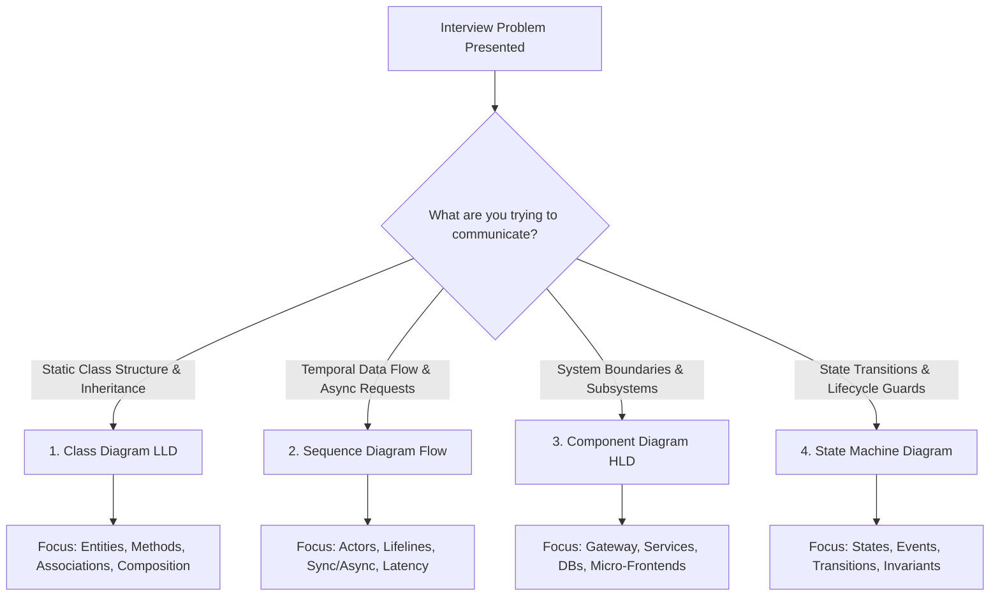
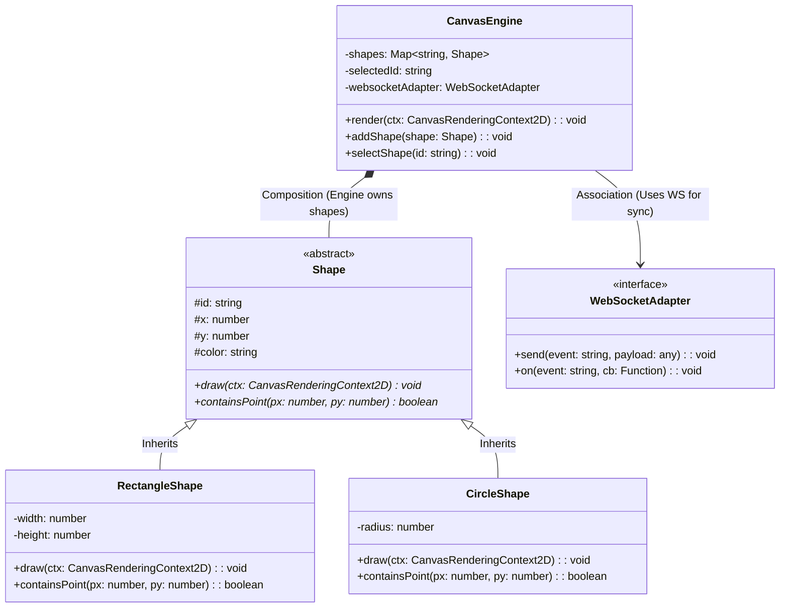
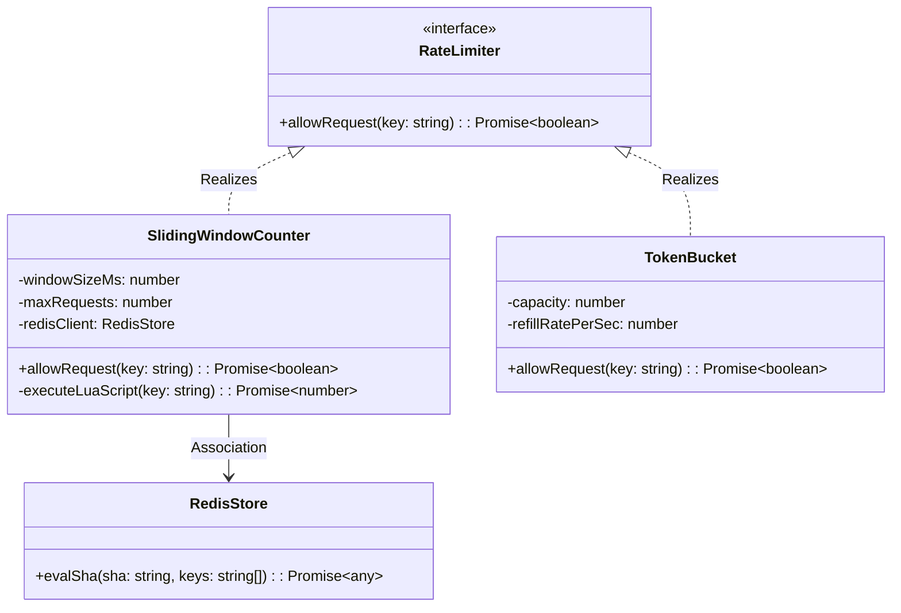
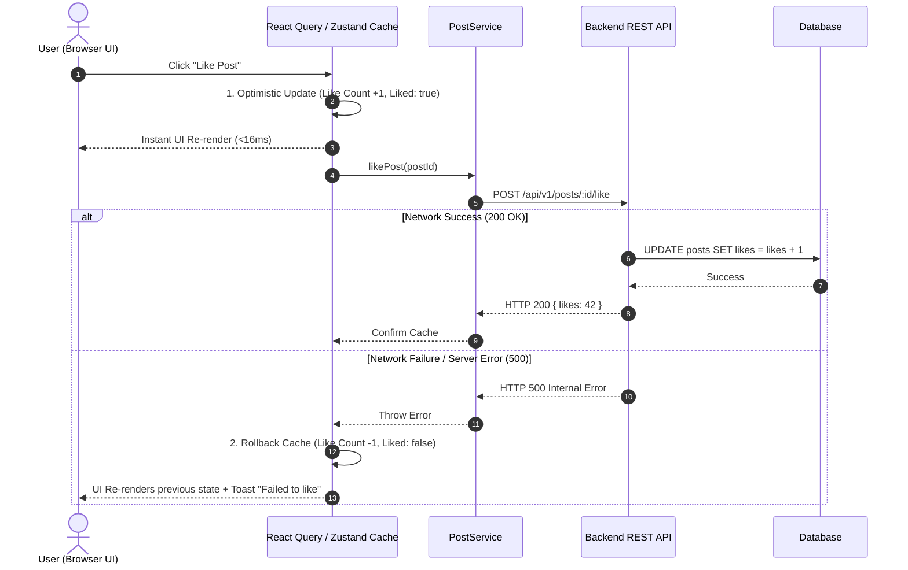
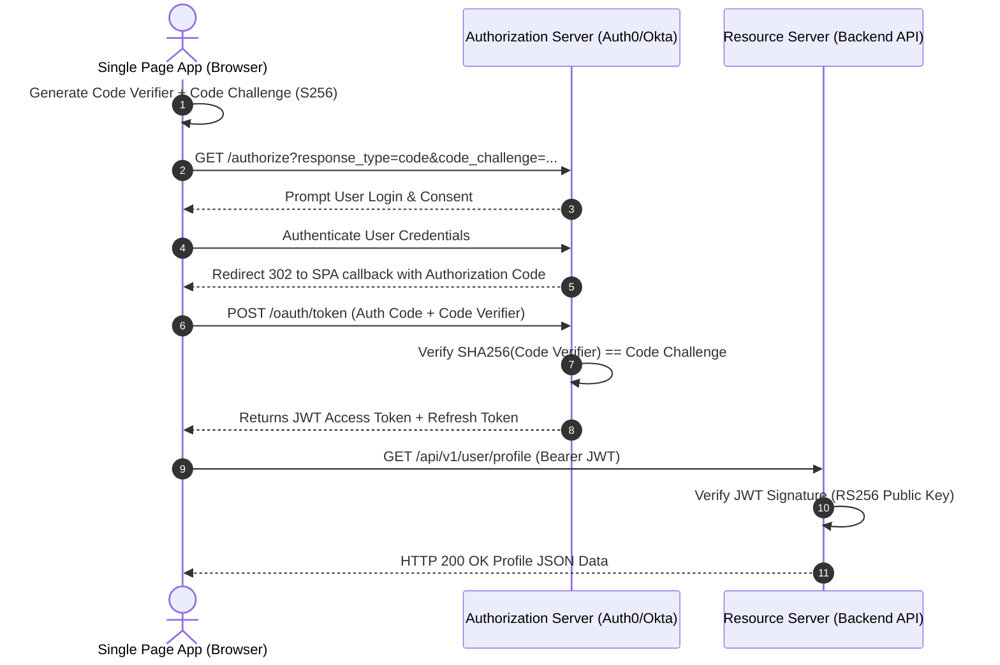
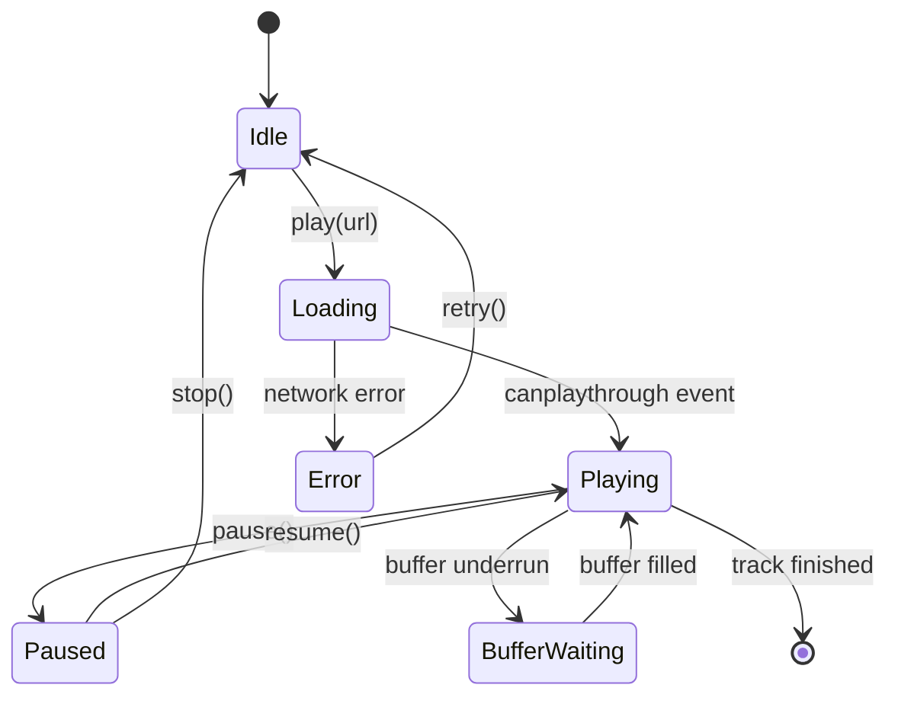
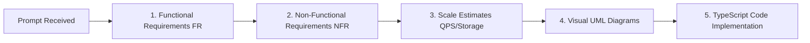

# 📐 Unified Modeling Language (UML) & Visual Architecture Master Blueprint

> **🎯 Target Audience:** Staff & Principal Engineers  
> **Focus:** Practical visual modeling (Class, Sequence, Component, State Machine diagrams via Mermaid) & systematic breakdown of Functional vs Non-Functional requirements (FUN-SCALE / FURS Framework).  
> **Existing Repo Tags:** 🔗 [See Standalone SOLID Guide](file:///Users/atulkumarawasthi/projects/SystemDesign/Prep/01-LLD/SOLID.md) | 🔗 [See Master OOP Guide](file:///Users/atulkumarawasthi/projects/SystemDesign/Prep/01-LLD/MASTER-OOP-DESIGN-PRINCIPLES.md) | 🔗 [See Design Patterns Guide](file:///Users/atulkumarawasthi/projects/SystemDesign/Prep/01-LLD/04-Design-Patterns.md)

---

## 🗺️ Master UML Diagrams Selection Flowchart



---

## 🏗️ 1. Class Diagrams (Low-Level Object Structure)

### 💡 Core Relationships Cheat Sheet

| Relationship | Symbol | Mermaid Syntax | Meaning | Real-World Example |
|:---|:---:|:---:|:---|:---|
| **Inheritance (Is-A)** | $\triangle$ | `Super <\|-- Sub` | Child inherits properties and methods | `AdminUser` extends `User` |
| **Realization (Implements)** | $\dots\triangle$ | `Interface <\|.. Implementation` | Class fulfills an interface contract | `FetchAdapter` implements `HttpClient` |
| **Composition (Has-A - Strong)** | $\blackdiamond$ | `Parent *-- Child` | Child cannot exist without Parent | `Form` owns `FormFields` |
| **Aggregation (Has-A - Weak)** | $\diamond$ | `Parent o-- Child` | Child can exist independently | `Department` has `Employees` |
| **Association (Uses)** | $\rightarrow$ | `ClassA --> ClassB` | Class A invokes methods on Class B | `OrderService` uses `PaymentGateway` |

---

### 🖥️ Frontend Class Diagram Example: Real-Time Collaborative Canvas



---

### 🗄️ Backend Class Diagram Example: Distributed Rate Limiter Engine



---

## 🔄 2. Sequence Diagrams (Data & Request Flow)

### 🖥️ Frontend Sequence Diagram Example: Optimistic UI Update with Rollback



---

### 🗄️ Backend Sequence Diagram Example: OAuth2 Authorization Code Flow with PKCE



---

## 🧩 3. Component & Subsystem Diagrams (Architecture & Module Boundaries)

### 🖥️ Frontend Component Diagram: Micro Frontend Architecture (Module Federation)

```mermaid
graph TB
    subgraph Browser Container App
        Host[Host Shell Application]
        Router[App Router]
        Store[Global Auth State Store]
    end

    subgraph Remote MFEs (Module Federation)
        NavMFE[Navigation Bar MFE]
        FeedMFE[Feed Feed MFE]
        CheckoutMFE[Checkout MFE]
    end

    subgraph CDN Edge Infrastructure
        CDN1[CDN Edge: Nav Bundle]
        CDN2[CDN Edge: Feed Bundle]
        CDN3[CDN Edge: Checkout Bundle]
    end

    Host --> Router
    Router --> NavMFE
    Router --> FeedMFE
    Router --> CheckoutMFE

    NavMFE ..-> CDN1
    FeedMFE ..-> CDN2
    CheckoutMFE ..-> CDN3
    
    Host -.-> Store
    FeedMFE -.-> Store
```

---

## ⚙️ 4. State Machine Diagrams (Lifecycle & Invariant Management)

### 🖥️ Frontend State Machine: Audio Player Lifecycle



---

## 🎯 5. Requirements Breakdown Framework (FUN-SCALE / FURS)

When given an ambiguous interview prompt ("Design a Collaborative Whiteboard" or "Design a Notification System"), follow this systematic template:



### 📋 Example Requirements Breakdown: Collaborative Whiteboard (Figma-Style)

#### 1. Functional Requirements (FR)
* User can draw shapes (Rectangles, Circles, Freehand lines).
* Real-time cursor position & shape synchronization across connected users ($<50\text{ms}$ latency).
* Offline support: User can draw offline, synced when connection recovers.
* Unlimited canvas navigation (Pan & Zoom).

#### 2. Non-Functional Requirements (NFR)
* **Performance:** $60\text{ FPS}$ smooth rendering on $4\text{K}$ monitors.
* **Latency:** Real-time WebSockets sync $P_{99} < 50\text{ms}$.
* **Availability:** $99.99\%$ uptime for persistence engine.
* **Consistency:** Eventual consistency for concurrent canvas edits using **Conflict-Free Replicated Data Types (CRDTs)**.

#### 3. Scale Estimates
* **Users:** $100,\!000$ Daily Active Users (DAU).
* **Peak Concurrent Connections:** $10,\!000$ active rooms simultaneously.
* **WebSocket Message Volume:** $10\text{ updates/sec/user} \times 10,\!000\text{ users} = 100,\!000\text{ msg/sec}$.

---

## ⚡ 6. "Good Enough" UML for Whiteboard Interviews

In a 45-minute interview, **do not spend 15 minutes perfecting line arrowheads**. Focus on speed and communication:

1. **Boxes = Entities / Components:** Draw clear labeled boxes.
2. **Solid Line with Arrow ($\rightarrow$) = Data Flow or Dependency.**
3. **Dashed Line with Arrow ($\dashrightarrow$) = Async Message or Implementation.**
4. **Annotate Methods:** Write down 2–3 key methods inside class boxes (`allowRequest()`, `draw()`).
5. **State Cardinality Explicitly:** Mark `1` to `N` relationships on associations.

---

## 📊 Summary Comparison Table of UML Diagram Types

| Diagram Type | Focus Dimension | Key Elements | Primary FE Use Case | Primary BE Use Case |
|:---|:---|:---|:---|:---|
| **Class Diagram** | Static Structure | Classes, Interfaces, Inheritance, Composition | Canvas engines, Form validation models, State stores | Domain Entities, ORM Models, Repository interfaces |
| **Sequence Diagram** | Temporal Flow | Lifelines, Messages, Sync/Async, Activation | Optimistic UI updates, Auth login flows, WS Handshakes | Distributed Saga transactions, OAuth PKCE flows |
| **Component Diagram** | System Subsystems | Modules, Interfaces, CDN Edges, Databases | Micro Frontend Module Federation, Asset Bundles | Microservices architecture, API Gateways, Caches |
| **State Machine** | State Invariants | States, Transitions, Events, Guards | Audio/Video player, Multi-step form wizards, Modals | Order status lifecycles, Payment processing states |
