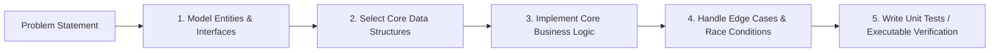

# 💻 Low-Level Design & Machine Coding Mastery

> **🎯 Target Audience:** Staff / Senior / Principal Engineers
> **Focus:** 1–2 hour Machine Coding rounds (Clean Code, Data Structure Selection, Extensibility, Working Executable Code).
> **Existing Repo Tags:** 🔗 [See existing Machine Code Reference](file:///Users/atulkumarawasthi/projects/SystemDesign/Questions/machine_code.md) | 🔗 [See LLD Interactive App](file:///Users/atulkumarawasthi/projects/SystemDesign/LLD/LLD.md)

---

## ⚡ The Machine Coding Interview Rubric



| Evaluation Dimension       | Weight | Principal-Level Expectations                                                       |
| :------------------------- | :----- | :--------------------------------------------------------------------------------- |
| **Working Functionality**  | 40%    | Code runs end-to-end; key test cases pass cleanly                                  |
| **Code Cleanliness & OOP** | 30%    | Clear separation of concerns, SOLID principles, zero giant functions               |
| **Extensibility**          | 15%    | Easy to add new rules (e.g. split types in Splitwise) without rewriting core logic |
| **Concurrency / Safety**   | 15%    | Handles edge cases, null checks, race condition awareness                          |

---

## 🚀 Worked Problem 1: LRU Cache (Least Recently Used)

- **Requirement:** Implement an `LRUCache<K, V>` with $O(1)$ time complexity for `get` and `put` operations.

```typescript
class CacheNode<K, V> {
  key: K;
  value: V;
  prev: CacheNode<K, V> | null = null;
  next: CacheNode<K, V> | null = null;

  constructor(key: K, value: V) {
    this.key = key;
    this.value = value;
  }
}

export class LRUCache<K, V> {
  private capacity: number;
  private map = new Map<K, CacheNode<K, V>>();
  private head: CacheNode<K, V>;
  private tail: CacheNode<K, V>;

  constructor(capacity: number) {
    this.capacity = capacity;
    // Sentinel dummy nodes to eliminate boundary null checks
    this.head = new CacheNode<any, any>(null, null);
    this.tail = new CacheNode<any, any>(null, null);
    this.head.next = this.tail;
    this.tail.prev = this.head;
  }

  get(key: K): V | null {
    const node = this.map.get(key);
    if (!node) return null;

    this.moveToHead(node);
    return node.value;
  }

  put(key: K, value: V): void {
    const existing = this.map.get(key);
    if (existing) {
      existing.value = value;
      this.moveToHead(existing);
      return;
    }

    if (this.map.size >= this.capacity) {
      this.removeTail();
    }

    const newNode = new CacheNode(key, value);
    this.map.set(key, newNode);
    this.addNode(newNode);
  }

  private addNode(node: CacheNode<K, V>): void {
    node.next = this.head.next;
    node.prev = this.head;
    this.head.next!.prev = node;
    this.head.next = node;
  }

  private removeNode(node: CacheNode<K, V>): void {
    const prev = node.prev!;
    const next = node.next!;
    prev.next = next;
    next.prev = prev;
  }

  private moveToHead(node: CacheNode<K, V>): void {
    this.removeNode(node);
    this.addNode(node);
  }

  private removeTail(): void {
    const lru = this.tail.prev!;
    if (lru === this.head) return;
    this.removeNode(lru);
    this.map.delete(lru.key);
  }
}
```

---

## 💸 Worked Problem 2: Splitwise Debt Simplification

- **Requirement:** Calculate net balances among a group of users and minimize the total number of transactions needed to settle debts.

```typescript
export interface BalanceMap {
  [userId: string]: number; // positive = owed money, negative = owes money
}

export interface Transaction {
  from: string;
  to: string;
  amount: number;
}

export class DebtMinimizer {
  static simplifyDebts(balances: BalanceMap): Transaction[] {
    const creditors: { user: string; amount: number }[] = [];
    const debtors: { user: string; amount: number }[] = [];

    for (const [user, amount] of Object.entries(balances)) {
      if (amount > 0) creditors.push({ user, amount });
      else if (amount < 0) debtors.push({ user, amount: -amount });
    }

    const transactions: Transaction[] = [];

    let i = 0;
    let j = 0;

    while (i < debtors.length && j < creditors.length) {
      const debtor = debtors[i];
      const creditor = creditors[j];

      const settledAmount = Math.min(debtor.amount, creditor.amount);

      transactions.push({
        from: debtor.user,
        to: creditor.user,
        amount: Math.round(settledAmount * 100) / 100,
      });

      debtor.amount -= settledAmount;
      creditor.amount -= settledAmount;

      if (debtor.amount === 0) i++;
      if (creditor.amount === 0) j++;
    }

    return transactions;
  }
}
```

---

## ⏱️ Worked Problem 3: Token Bucket Rate Limiter

```typescript
export class TokenBucketRateLimiter {
  private capacity: number;
  private refillRatePerSec: number;
  private tokens: number;
  private lastRefillTimestamp: number;

  constructor(capacity: number, refillRatePerSec: number) {
    this.capacity = capacity;
    this.refillRatePerSec = refillRatePerSec;
    this.tokens = capacity;
    this.lastRefillTimestamp = Date.now();
  }

  allowRequest(tokensRequested = 1): boolean {
    this.refill();

    if (this.tokens >= tokensRequested) {
      this.tokens -= tokensRequested;
      return true;
    }

    return false;
  }

  private refill(): void {
    const now = Date.now();
    const elapsedSeconds = (now - this.lastRefillTimestamp) / 1000;
    const tokensToAdd = elapsedSeconds * this.refillRatePerSec;

    this.tokens = Math.min(this.capacity, this.tokens + tokensToAdd);
    this.lastRefillTimestamp = now;
  }
}
```

---

## ❓ Collapsed Q&A Self-Testing Bank

<details>
<summary>❓ 1. Why do we use Sentinel (Dummy Head & Tail) nodes in the LRU Cache implementation?</summary>

**Answer:**
Sentinel nodes eliminate special boundary conditions when inserting or deleting nodes at the head or tail of the doubly linked list. Without dummy nodes, every `addNode` or `removeNode` method requires null checks for `this.head` and `this.tail`, cluttering the code and increasing bug surface area.

</details>

<details>
<summary>❓ 2. How does greedy debt settlement in Splitwise differ from NP-hard minimum cash flow optimization?</summary>

**Answer:**
Greedy matching (pairing max debtor with max creditor) runs in $O(N \log N)$ time and guarantees settled balances with at most $N-1$ transactions. Finding the absolute theoretical minimum transactions in complex graph cycles is equivalent to the Subset Sum problem (NP-complete), but greedy settlement is the standard industry choice due to high performance and practical optimality.

</details>
