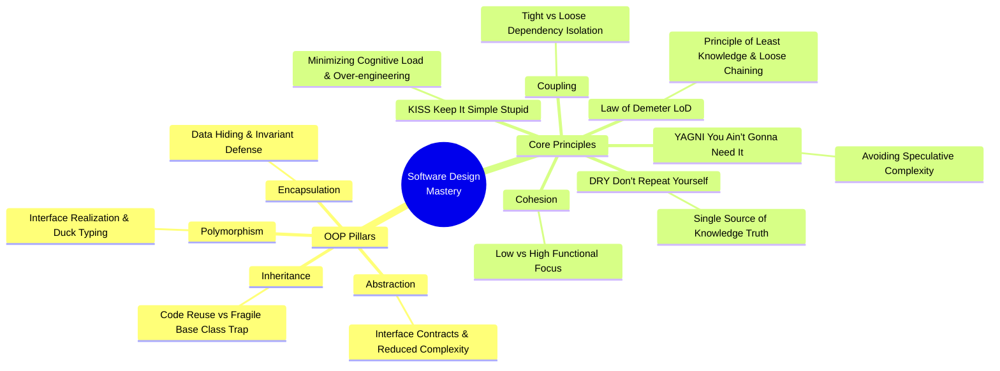
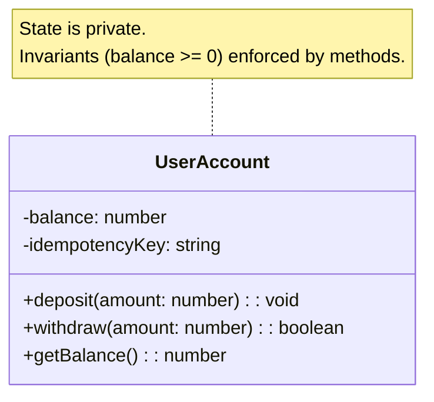
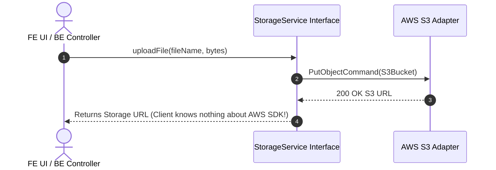
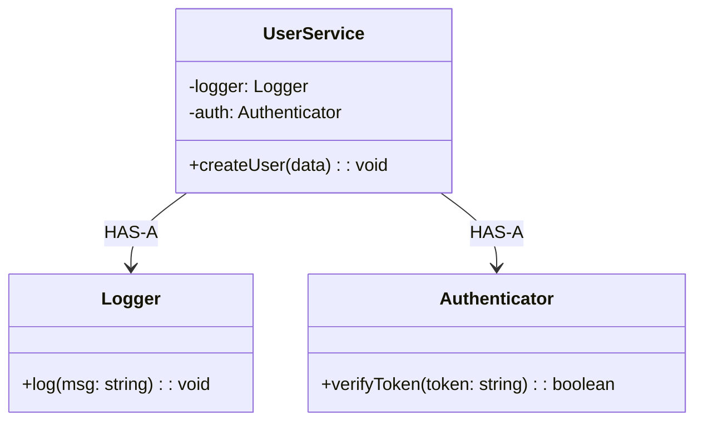
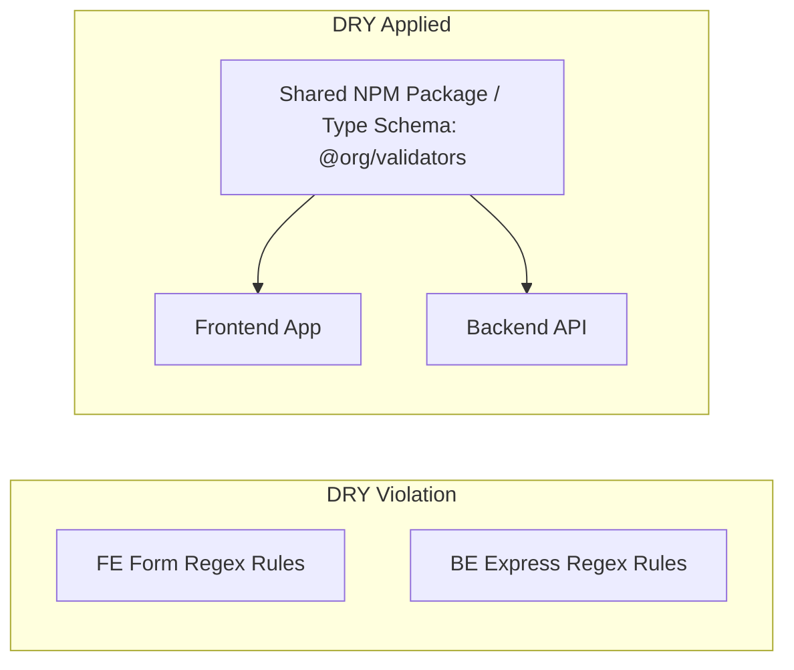
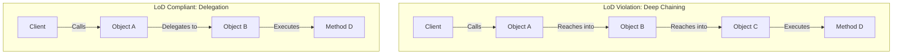
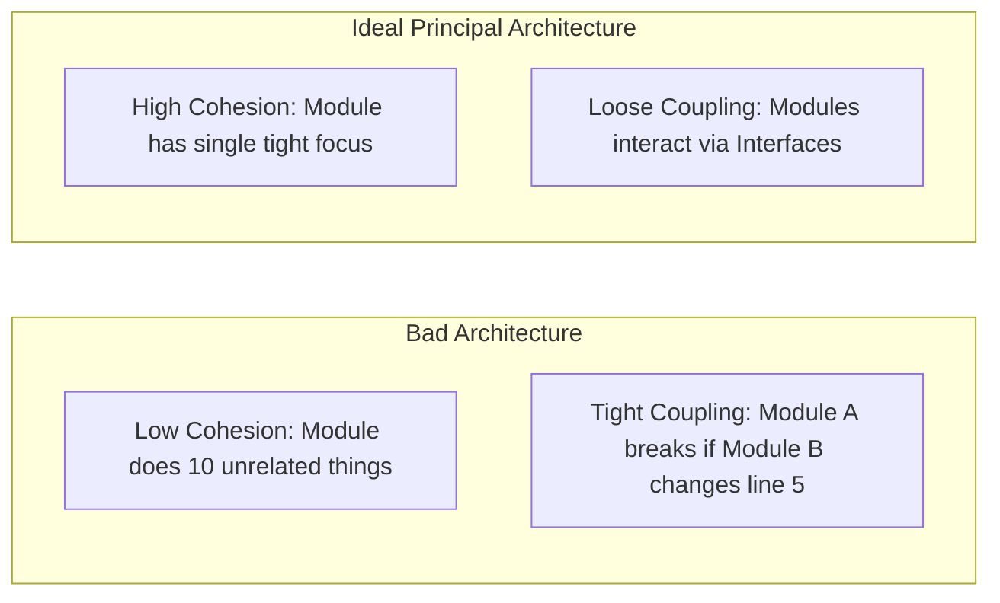

# 🏛️ Master OOP & Software Design Principles (The Definitive Guide)

> **🎯 Target Audience:** Senior, Staff, and Principal Engineers (Frontend, Backend, and Full-Stack)
> **Purpose:** The single source of truth for Object-Oriented Programming (OOP) and Core Software Design Principles. Covers both **Frontend (React/UI/Browser)** and **Backend (Node/Express/Databases/Microservices)** side-by-side with Mermaid Diagrams, BEFORE/AFTER TypeScript code, and Tradeoffs. After studying this guide, no external course or book is needed.
> **External Reference Links:** 🔗 [DRY](https://algomaster.io/learn/lld/dry) | 🔗 [KISS](https://algomaster.io/learn/lld/kiss) | 🔗 [YAGNI](https://algomaster.io/learn/lld/yagni) | 🔗 [Law of Demeter](https://algomaster.io/learn/lld/lod) | 🔗 [Coupling & Cohesion](https://algomaster.io/learn/lld/coupling-and-cohesion)
> **Existing Repo Tags:** 🔗 [See OOP Concepts](file:///Users/atulkumarawasthi/projects/SystemDesign/Prep/01-LLD/01-OOP-Concepts.md) | 🔗 [See SOLID Principles](file:///Users/atulkumarawasthi/projects/SystemDesign/Prep/01-LLD/02-SOLID.md) | 🔗 [See Design Principles](file:///Users/atulkumarawasthi/projects/SystemDesign/Prep/01-LLD/03-Design-Principles.md) | 🔗 [See Design Patterns](file:///Users/atulkumarawasthi/projects/SystemDesign/Prep/01-LLD/04-Design-Patterns.md)

---

## 🗺️ Master Architecture Mindmap



---

## 🧬 Part 1: The 4 Pillars of Object-Oriented Programming (OOP)

---

### 1. 🔒 Encapsulation

#### What It Really Means

Encapsulation is **not** just marking fields `private`. It is the principle of **bundling state and the behavior operating on that state together while enforcing invariants**. It isolates internal representation from external consumers, creating a controlled boundary of change.

#### Mermaid Diagram



#### Dual Real-World Examples (FE vs BE)

##### 🖥️ Frontend Example (React State & Hook Boundary)

```typescript
// ❌ BEFORE (Violation): Direct state mutation leaking component internals
function BadCartComponent() {
  const [items, setItems] = useState<{ id: string; price: number; qty: number }[]>([]);

  const handleAdd = (id: string, price: number) => {
    // Component directly manipulates raw array and calculates totals inline
    items.push({ id, price, qty: 1 }); // Direct Mutation Bug!
    setItems([...items]);
  };
}

// ✅ AFTER (Encapsulated Domain Model & Custom Hook):
export class ShoppingCartModel {
  private _items: Map<string, { id: string; price: number; qty: number }> = new Map();

  public addItem(id: string, price: number): void {
    const existing = this._items.get(id);
    if (existing) {
      existing.qty += 1;
    } else {
      this._items.set(id, { id, price, qty: 1 });
    }
  }

  public get totalAmount(): number {
    let sum = 0;
    this._items.forEach((item) => {
      sum += item.price * item.qty;
    });
    return sum;
  }

  public get items() {
    // Return immutable copy to protect internal state reference
    return Array.from(this._items.values());
  }
}
```

##### 🗄️ Backend Example (Node/Express Domain Entity)

```typescript
// ❌ BEFORE (Violation): Anemic Domain Model with public mutable properties
class BankAccountBE {
  public balance: number = 0; // External code can set balance = -50000!
}

// ✅ AFTER (Clean Encapsulation enforcing business rules):
export class BankAccount {
  private _balance: number;
  private _id: string;

  constructor(id: string, initialBalance: number) {
    if (initialBalance < 0) throw new Error('Initial balance cannot be negative');
    this._id = id;
    this._balance = initialBalance;
  }

  public withdraw(amount: number): void {
    if (amount <= 0) throw new Error('Withdrawal amount must be positive');
    if (this._balance - amount < 0) throw new Error('Insufficient funds');
    this._balance -= amount;
  }

  public get balance(): number {
    return this._balance;
  }
}
```

---

### 2. 🧩 Abstraction

#### What It Really Means

Abstraction means **exposing only the essential features of an object while hiding background complexity**. It establishes an explicit contract (interface) so callers interact with _what_ a system does, not _how_ it does it.

#### Mermaid Diagram



#### Dual Real-World Examples (FE vs BE)

##### 🖥️ Frontend Example (Storage Engine Abstraction)

```typescript
// ✅ Abstraction Interface allowing easy swap between LocalStorage, IndexedDB, or Memory
export interface CacheStorage {
  getItem(key: string): Promise<string | null>;
  setItem(key: string, value: string): Promise<void>;
}

export class BrowserLocalStorage implements CacheStorage {
  async getItem(key: string) {
    return localStorage.getItem(key);
  }
  async setItem(key: string, value: string) {
    localStorage.setItem(key, value);
  }
}

export class IndexedDBStorage implements CacheStorage {
  async getItem(key: string) {
    /* Complex IndexedDB transaction */ return null;
  }
  async setItem(key: string, value: string) {
    /* Complex IndexedDB write */
  }
}
```

##### 🗄️ Backend Example (Database Repository Abstraction)

```typescript
export interface UserRepository {
  findById(id: string): Promise<User | null>;
  save(user: User): Promise<void>;
}

// Caller code depends on UserRepository abstraction, NOT Postgres or MongoDB directly!
export class PostgresUserRepository implements UserRepository {
  async findById(id: string): Promise<User | null> {
    // Raw SQL Query execution
    return null;
  }
  async save(user: User): Promise<void> {
    /* SQL INSERT */
  }
}
```

---

### 3. 🧬 Inheritance vs Composition

#### What It Really Means

Inheritance establishes an **IS-A** relationship (subclass inherits from superclass). Composition establishes a **HAS-A** relationship (building complex behavior by combining simple objects).

> ⚠️ **Principal Rule:** Prefer **Composition over Inheritance**. Inheritance creates tight coupling and the Fragile Base Class problem.

#### Mermaid Diagram



---

### 4. 🎭 Polymorphism

#### What It Really Means

Polymorphism ("many forms") allows objects of different types to be treated as instances of a common supertype or interface. Callers execute identical method calls (`pay()`, `render()`), while each concrete class executes its own specific algorithm.

---

## 📐 Part 2: Core Software Design Principles

---

### 1. 🔁 [DRY — Don't Repeat Yourself](https://algomaster.io/learn/lld/dry)

#### Canonical Definition

_"Every piece of **knowledge** must have a single, unambiguous, authoritative representation within a system."_ (Hunt & Thomas)

> 💡 **Important Distinction:** DRY applies to **knowledge and business rules**, NOT syntax! Two code snippets that look identical are NOT violating DRY if they represent different domain concerns.

#### Mermaid Diagram



#### Dual Examples (FE vs BE)

##### 🖥️ Frontend Example: Shared Validation Rules

```typescript
// ❌ BEFORE: Duplicate validation logic in Form component and API interceptor
// Form Component:
if (!values.email.includes('@')) setError('Invalid email');
// API Interceptor:
if (!payload.email.includes('@')) throw new Error('Invalid email');

// ✅ AFTER: Single source of truth validator
export const EmailValidator = {
  isValid: (email: string): boolean => /^[^\s@]+@[^\s@]+\.[^\s@]+$/.test(email),
};
```

##### 🗄️ Backend Example: Single Database Query Builder Knowledge

```typescript
// ❌ BEFORE: Raw SQL query string copy-pasted across 5 controller files
const users = await db.query("SELECT * FROM users WHERE status = 'ACTIVE' AND deleted_at IS NULL");

// ✅ AFTER: Centralized Repository query method
export class UserRepository {
  static getActiveUsersQuery() {
    return db('users').where({ status: 'ACTIVE' }).whereNull('deleted_at');
  }
}
```

---

### 2. ⚡ [KISS — Keep It Simple, Stupid](https://algomaster.io/learn/lld/kiss)

#### Canonical Definition

Systems perform best when kept simple rather than overly complex. Avoid unnecessary abstractions, speculative design patterns, or hyper-generic code when a straightforward solution works.

#### Dual Examples (FE vs BE)

##### 🖥️ Frontend Example: State Management Simplicity

```typescript
// ❌ BEFORE (Over-engineered Redux setup for a simple boolean toggle modal):
// 5 files created: modalActions.ts, modalReducer.ts, modalTypes.ts, modalSelectors.ts, store.ts

// ✅ AFTER (KISS Solution):
const [isOpen, setIsOpen] = useState(false);
```

##### 🗄️ Backend Example: Route Handler Simplicity

```typescript
// ❌ BEFORE (Over-abstracted controller with 4 layer abstractions for simple GET request):
class UserQueryFactoryBuilderStrategy {
  /* 100 lines of code */
}

// ✅ AFTER (KISS Solution):
app.get('/api/users/:id', async (req, res) => {
  const user = await userRepo.findById(req.params.id);
  if (!user) return res.status(404).json({ error: 'User not found' });
  return res.json(user);
});
```

---

### 3. 🚀 [YAGNI — You Ain't Gonna Need It](https://algomaster.io/learn/lld/yagni)

#### Canonical Definition

Always implement things when you actually need them, never when you just **foresee** that you might need them. Speculative features add maintenance overhead, test burden, and bug surface area.

#### Dual Examples (FE vs BE)

##### 🖥️ Frontend Example: Component Props

```typescript
// ❌ BEFORE: Building a Button component with 40 unused speculative props
interface ButtonProps {
  enableCustomAnimation?: boolean;
  3dRotationAngle?: number;
  particlesEffect?: boolean;
  // ...35 more props nobody asked for
}

// ✅ AFTER (YAGNI Solution): Build for immediate requirements
interface ButtonProps {
  label: string;
  onClick: () => void;
  variant?: 'primary' | 'secondary';
}
```

##### 🗄️ Backend Example: Database Infrastructure

```typescript
// ❌ BEFORE: Setting up Sharded MongoDB + Cassandra + Kafka for an MVP expecting 10 users/day.
// ✅ AFTER: Simple PostgreSQL DB instance on RDS. Upgrade when scale warrants it.
```

---

### 4. 🔗 [Law of Demeter (LoD — Principle of Least Knowledge)](https://algomaster.io/learn/lld/lod)

#### Canonical Definition

_"Each unit should have only limited knowledge about other units: only units 'closely' related to the current unit. Talk only to your immediate friends; don't talk to strangers."_
Avoid deep chaining calls like `a.getB().getC().getD().doSomething()`.

#### Mermaid Diagram



#### Dual Examples (FE vs BE)

##### 🖥️ Frontend Example: Component Prop Drilling Violation

```typescript
// ❌ BEFORE (LoD Violation): Component reaches 4 levels deep into object hierarchy
function UserCityLabel({ props }: { props: any }) {
  return <span>{props.user.company.address.city}</span>; // Crashes if company or address is null!
}

// ✅ AFTER (LoD Compliant): Component asks only for what it directly needs
function UserCityLabel({ city }: { city: string }) {
  return <span>{city}</span>;
}
```

##### 🗄️ Backend Example: Chain Violation

```typescript
// ❌ BEFORE (LoD Violation):
const userCity = order.getCustomer().getProfile().getAddress().getCity();

// ✅ AFTER (LoD Compliant with Delegation Method):
class Order {
  private customer: Customer;
  public getCustomerCity(): string {
    return this.customer.getCity();
  }
}
const userCity = order.getCustomerCity();
```

---

### 5. 🧲 [Coupling and Cohesion](https://algomaster.io/learn/lld/coupling-and-cohesion)

#### Definitions

- **Coupling:** The degree of interdependence between software modules. **Target: Low Coupling.**
- **Cohesion:** The degree to which elements inside a single module belong together functionally. **Target: High Cohesion.**



#### Dual Examples (FE vs BE)

##### 🖥️ Frontend Example: High Cohesion vs Low Cohesion

```typescript
// ❌ LOW COHESION (God Component doing API fetch, state management, validation, and rendering):
function UserProfilePage() {
  // 500 lines mixing HTTP fetch, CSS manipulation, CSV export logic, and UI rendering
}

// ✅ HIGH COHESION (Separated Concerns):
// 1. UserFetcher.ts (HTTP Layer)
// 2. UserValidator.ts (Business Logic)
// 3. UserProfileView.tsx (Pure Visual Component)
```

##### 🗄️ Backend Example: Loose Coupling via Dependency Injection

```typescript
// ❌ TIGHT COUPLING (Service directly creates instance of concrete MySQL database):
class OrderService {
  private db = new MySQLDatabase(); // Cannot test without real MySQL server!
}

// ✅ LOOSE COUPLING (Service depends on Database Interface):
class OrderService {
  constructor(private db: IDatabase) {} // Easily pass MockDatabase in unit tests!
}
```

---

## 📊 Summary Master Comparison Table

| Principle          | Primary Goal                   | Frontend Manifestation                    | Backend Manifestation                      | Primary Failure Mode                    |
| :----------------- | :----------------------------- | :---------------------------------------- | :----------------------------------------- | :-------------------------------------- |
| **Encapsulation**  | Protect state invariants       | Custom hooks, private state               | Private fields, domain entities            | Direct public state mutation            |
| **Abstraction**    | Hide complexity via interfaces | Storage abstractions, UI SDK wrappers     | Repository pattern, DB adapters            | Exposing internal implementation        |
| **DRY**            | Single source of knowledge     | Shared validation schemas, type contracts | Shared DB query logic, DTO types           | Premature abstraction of divergent code |
| **KISS**           | Minimize cognitive load        | Component `useState` vs Redux overkill    | Simple route handlers vs 5-layer factories | Over-engineering simple features        |
| **YAGNI**          | Eliminate speculative code     | Minimal component props contract          | Building for 10M users on Day 1            | High maintenance of unused code         |
| **Law of Demeter** | Minimize direct dependencies   | Avoid 4-level deep prop drilling          | Avoid `a.getB().getC().getD()` chains      | Null reference runtime crashes          |
| **Low Coupling**   | Independent module changes     | Event Bus, decoupled UI components        | Dependency Injection, Interfaces           | Cascade breakage across files           |
| **High Cohesion**  | Single focused responsibility  | Single-purpose components / hooks         | Dedicated micro-services / classes         | God objects doing everything            |
