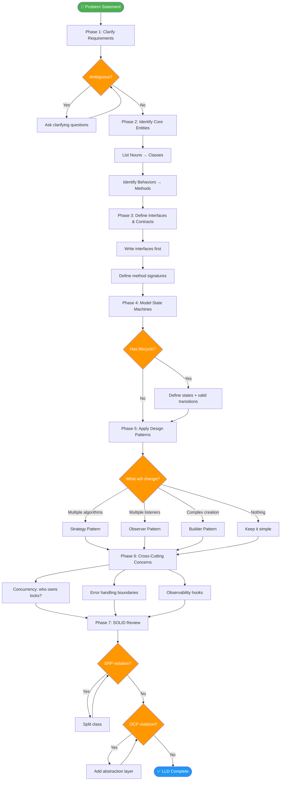

# 🏗️ Low-Level Design (LLD) — Principal/Staff Engineer Prep

> **Scope:** This module covers everything you need to excel at Low-Level Design interviews at the Staff/Principal level. LLD is where you prove you can translate architecture decisions into working, maintainable, scalable code — not just talk about systems abstractly.
> 🎨 **External Companion Repo:** [kumaratul60/design-patterns](https://github.com/kumaratul60/design-patterns)

---

🔥 **Definitive Master Guides:**  
👉 🎨 **[Master Design Patterns Guide](./04-Design-Patterns.md)** (10 High-Frequency Patterns + Algomaster Links + Dual FE/BE Code)  
👉 📐 **[Master UML Diagrams Guide](./05-UML-Diagrams.md)** (Class, Sequence, Component & State Machine Diagrams + FUN-SCALE)  
👉 🧱 **[Standalone SOLID Principles Guide](./SOLID.md)** (S.O.L.I.D. FE & BE Code, Diagrams, Enterprise Notification Case Study)  
👉 🌟 **[Master OOP & Software Design Principles Guide](./MASTER-OOP-DESIGN-PRINCIPLES.md)** (DRY, KISS, YAGNI, Law of Demeter, Coupling & Cohesion)

---

## 📚 Table of Contents

1. [What Exactly Is Low-Level Design?](#what-exactly-is-low-level-design)
2. [LLD vs HLD — The Real Difference](#lld-vs-hld--the-real-difference)
3. [Types of LLD Interviews](#types-of-lld-interviews)
4. [What Principal/Staff Interviewers Actually Look For](#what-principalstaff-interviewers-actually-look-for)
5. [How to Approach an LLD Problem — Step-by-Step Framework](#how-to-approach-an-lld-problem--step-by-step-framework)
6. [LLD Problem-Solving Flow (Diagram)](#lld-problem-solving-flow-diagram)
7. [Files in This Module](#files-in-this-module)
8. [Q&A Self-Test Blocks](#qa-self-test-blocks)

---

## 🔍 What Exactly Is Low-Level Design?

Low-Level Design is **not** just class diagrams and UML. At its core, LLD is the discipline of **translating a problem statement into a concrete software structure** — classes, interfaces, data flows, state machines, and concurrency models — that can be directly implemented.

LLD sits at the intersection of:

- **Software Engineering** — How do you model reality as code structures?
- **Design Patterns** — Which reusable solutions apply here and why?
- **Object-Oriented Design** — How do responsibilities get distributed across objects?
- **API/Contract Design** — What does each component expose vs hide?
- **Concurrency** — How does the system behave under parallel access?

### The Deeper "Why" of LLD

Most engineers think LLD is about writing clean classes. Principal engineers know it's about **managing cognitive load and change velocity**:

- A well-designed LLD means future engineers can add features **without reading all the existing code**.
- A poor LLD means every change causes **unintended ripple effects** across the codebase.
- At scale (10 engineers → 100 engineers → 10 teams), your LLD decisions determine whether your codebase becomes a **pit of success or a ball of mud**.

> 💡 **The real goal of LLD is not elegance — it's CHANGEABILITY.** A design that can absorb the next 5 requirements without rewriting existing code is superior to a beautiful design that breaks on the first change.

### LLD vs "Just Coding"

| Just Coding                    | Low-Level Design                                |
| ------------------------------ | ----------------------------------------------- |
| Makes something that works now | Makes something that works for a year           |
| Focused on the happy path      | Considers failure modes and edge cases          |
| Single developer mental model  | Team-scale reasoning                            |
| Code is the artifact           | Classes, interfaces, contracts are the artifact |
| "Does it run?"                 | "Can a new engineer extend this safely?"        |

### What LLD Is NOT

- It is NOT system design (that's HLD — servers, databases, CDNs)
- It is NOT algorithm design (that's DSA)
- It is NOT just drawing boxes and arrows
- It is NOT memorizing 23 design patterns

---

## ⚖️ LLD vs HLD — The Real Difference

| Dimension             | Low-Level Design (LLD)                       | High-Level Design (HLD)                   |
| --------------------- | -------------------------------------------- | ----------------------------------------- |
| **Scope**             | Single service or module internals           | Entire distributed system                 |
| **Output**            | Classes, interfaces, ERD, state machines     | Architecture diagram, service topology    |
| **Decisions**         | Which class owns what data? Which pattern?   | Which database? Which queue? Which CDN?   |
| **Abstraction Level** | Code-level (methods, attributes)             | Infrastructure-level (services, networks) |
| **Time Horizon**      | Sprint/quarter                               | Quarters/years                            |
| **Audience**          | Developers implementing the feature          | Architects, PMs, stakeholders             |
| **Risk Focus**        | Coupling, cohesion, testability              | Availability, scalability, cost           |
| **Tools**             | UML, class diagrams, sequence diagrams       | Block diagrams, data flow diagrams        |
| **Interview Signal**  | Can you write code that others can maintain? | Can you architect systems that scale?     |
| **Example Question**  | Design a Parking Lot system                  | Design a ride-sharing system like Uber    |

### Where LLD Lives in the Engineering Lifecycle

```
Requirements → [HLD: Architecture] → [LLD: Module Design] → Implementation → Testing
                   ↑                        ↑
           "What services?"          "How does each
           "What databases?"          service work internally?"
```

### The Key Insight

HLD answers: **"What boxes do we draw?"**
LLD answers: **"What's inside each box?"**

Principal engineers must be fluent in **both** — and critically, they must know how HLD decisions **constrain** LLD choices. For example:

- Choosing event-driven architecture (HLD) means your LLD must design event handlers and idempotency.
- Choosing a monorepo (HLD) affects how your interfaces are shared across modules (LLD).

---

## 🎯 Types of LLD Interviews

### 1. 🧩 Object-Oriented Design (OOD)

**Format:** "Design a [system/game/tool]" with focus on class structure

**Examples:**

- Design a Chess game
- Design an ATM machine
- Design a Library Management System
- Design a Parking Lot
- Design a Hotel Booking system

**What Interviewers Check:**

- Can you identify entities and their responsibilities?
- Are your classes cohesive (single responsibility) and loosely coupled?
- Do you know when to use composition vs inheritance?
- Can you apply SOLID principles naturally, not as a checklist?
- Is your design extensible? (Add a new parking spot type without rewriting core)
- Do you model state correctly? (Parking spot states, booking lifecycle)

**Principal-Level Signals:**
| Signal | Junior/Mid | Senior | Principal/Staff |
|---|---|---|---|
| Entity identification | Names obvious entities | Names + attributes | Names + responsibilities + invariants |
| Design patterns | "Maybe use a factory?" | Applies correct pattern | Explains pattern tradeoffs, considers alternatives |
| Extensibility | Works for current requirements | Handles 1-2 extensions | Designs for unknown future requirements |
| State modeling | Simple boolean flags | Enums for state | Full state machine with valid transitions |
| Error handling | "Throw an exception" | Custom exceptions | Error boundaries, failure propagation strategy |

**Red Flags Interviewers Watch For:**

- God classes (one class does everything)
- Anemic domain model (classes with only getters/setters, no behavior)
- Premature pattern application ("Let me add an Abstract Factory here...")
- Ignoring state management complexity

---

### 2. 💻 Machine Coding

**Format:** 60-90 minute live coding session. You write working code, not just design.

**Examples:**

- Build a rate limiter (Token Bucket / Sliding Window)
- Implement an LRU Cache
- Build a task scheduler
- Build a pub/sub event system
- Implement a snake game

**What Interviewers Check:**

- **Working code** — it must compile and run
- **Modularity** — functions/classes with clear responsibilities
- **Edge case handling** — what happens at boundaries?
- **Incremental approach** — can you demo a working version early and add features?
- **Testability** — is the code written in a way that's easy to unit test?
- **Time management** — did you prioritize core functionality first?

**Principal-Level Signals:**
| Signal | How a Principal Shows It |
|---|---|
| Abstractions | Creates interfaces before implementations |
| Naming | Variables/functions named for domain concepts, not mechanics |
| Extension points | Adds hooks/callbacks/strategies for future configurability |
| Error thinking | Handles concurrent access, null values, boundary conditions naturally |
| Communication | Explains design decisions verbally while coding |

**Machine Coding Strategy:**

```
1. Clarify (5 min)     → Ask about constraints, not features
2. Design (10 min)     → Sketch classes/interfaces on paper
3. Implement (50 min)  → Core → extensions → edge cases
4. Test (15 min)       → Walk through scenarios verbally
```

---

### 3. ⚡ Concurrency Design

**Format:** Design or implement a concurrent/parallel system

**Examples:**

- Design a thread-safe singleton
- Implement a connection pool
- Design a producer-consumer system
- Build a concurrent task queue with priority
- Design optimistic vs pessimistic locking strategy

**What Interviewers Check:**

- Understanding of race conditions, deadlocks, livelocks
- Knowledge of synchronization primitives (mutex, semaphore, monitors)
- When to use immutability vs locks
- Non-blocking algorithms and their tradeoffs
- JavaScript's event loop model and why it avoids traditional concurrency pitfalls — but creates its own (callback hell, unhandled promise rejections)

**Principal-Level Signals:**
| Area | Expected Knowledge |
|---|---|
| Race conditions | Can identify subtle data races in code |
| Lock granularity | Knows when coarse vs fine-grained locking matters |
| JS concurrency | Understands the event loop, microtasks, macrotasks, and Web Workers |
| Distributed locking | Redis-based locks, fencing tokens, lease-based approaches |
| Immutability | Uses immutable data structures to eliminate entire classes of concurrency bugs |

> 🎯 **For frontend engineers:** JavaScript is single-threaded but **asynchronous** — the interview may test your understanding of the event loop, Promise.all, async generators, or worker threads. This is your domain-specific concurrency knowledge.

---

## 🔬 What Principal/Staff Interviewers Actually Look For

This is the meta-layer — understanding the evaluation rubric changes how you prepare.

### What Senior Engineers Focus On

- Correct class structure
- Applying the right pattern
- Working code that passes test cases

### What Principal/Staff Engineers Must Demonstrate

**1. System Thinking, Not Just Object Thinking**

A Senior designs a `PaymentProcessor` class. A Principal designs the `PaymentProcessor` interface and then asks: "Who owns retry logic? What's the contract if downstream is unavailable? How does this class behave in a distributed saga?"

**2. Explicit Tradeoff Reasoning**

Don't just make a choice — articulate what you're giving up. "I'm choosing composition over inheritance here because the feature set of a `PremiumUser` could change independently of `User`, and inheritance would couple their lifecycles."

**3. Future-Proofing Without Over-Engineering**

The principal-level skill is knowing **when to add abstractions** and when to keep it simple. Abstracting too early is as dangerous as not abstracting at all.

> 📌 **Rule of Three:** Don't abstract until you see a pattern repeated at least three times. Then abstract aggressively.

**4. Naming and Ubiquitous Language**

Names reveal design quality. `handleStuff()` vs `processPaymentAuthorization()`. Principals name things with domain precision, making code readable to non-technical stakeholders.

**5. Invariant Thinking**

What must ALWAYS be true about your objects? A `BankAccount` balance should never go below zero (business rule). A `ParkingSpot` can't have two `Vehicle`s simultaneously. Encoding invariants in the design (not just in comments) is a principal-level skill.

**6. Testability as a First-Class Concern**

Every class should be unit-testable in isolation. If testing a class requires standing up a database, that's a design smell. Principals inject dependencies — they don't reach for singletons.

**7. Communication During Design**

Principals think aloud. They say: "I see two approaches here — let me outline the tradeoffs..." This demonstrates architectural reasoning, not just coding ability.

---

## 🗺️ How to Approach an LLD Problem — Step-by-Step Framework

### Phase 1: Understand (5-10 minutes)

**Ask clarifying questions:**

- What's the scale? (Single user, team, millions of users?)
- What are the primary use cases? (CRUD? Real-time? Batch?)
- What are the constraints? (In-memory only? Persistence required?)
- What's explicitly out of scope?

**DO NOT start designing immediately.** The single biggest mistake candidates make.

> 🔑 **Principal Signal:** Ask about the problem's **lifecycle**, not just its features. "What happens when a booking is cancelled? What's the state machine here?"

---

### Phase 2: Identify Core Entities (5 minutes)

List nouns from the requirements — these become your classes/types.

Example — Parking Lot:

```
Parking Lot → ParkingFloor → ParkingSpot → Vehicle → Ticket → Payment
```

Then ask: **What's the behavior of each entity?** (Not just data — behavior!)

- `ParkingSpot` knows if it's available, not the `ParkingLot`
- `Ticket` knows its duration and cost calculation
- `Payment` knows its processing status

---

### Phase 3: Define Interfaces and Contracts (10 minutes)

Before writing classes, define interfaces:

```typescript
interface IParkingSpot {
  isAvailable(): boolean;
  assignVehicle(vehicle: Vehicle): void;
  removeVehicle(): void;
  getSpotType(): SpotType;
}

interface IPaymentProcessor {
  process(amount: Money, method: PaymentMethod): PaymentResult;
}
```

This is the principal-level move — designing **contracts** before **implementations**.

---

### Phase 4: Model State Explicitly (5 minutes)

Every entity with a lifecycle needs a state machine:

```
Booking: PENDING → CONFIRMED → CHECKED_IN → CHECKED_OUT → CANCELLED
ParkingSpot: AVAILABLE → OCCUPIED → RESERVED → MAINTENANCE
```

Valid transitions prevent bugs at the domain level — you can't check out before checking in.

---

### Phase 5: Apply Patterns Selectively (ongoing)

Ask: "What will change in the future?" Then apply patterns only where variability exists:

- Multiple payment methods? → **Strategy Pattern**
- Multiple notification channels? → **Observer Pattern**
- Complex object creation? → **Builder Pattern**
- Single system coordinator? → **Facade Pattern**

---

### Phase 6: Handle Cross-Cutting Concerns (5 minutes)

- **Concurrency:** Who owns the lock for a `ParkingSpot`?
- **Error handling:** What's the failure boundary?
- **Logging/Observability:** Where do audit events get emitted?
- **Validation:** Where do invariants get enforced?

---

### Phase 7: Review and Refactor (5 minutes)

Ask yourself:

- Does any class have more than one reason to change? (SRP violation)
- Is any class directly depending on a concrete implementation? (DIP violation)
- Can I add a new feature without modifying existing classes? (OCP compliance)
- Are my interfaces lean? (ISP compliance)

---

## 🔄 LLD Problem-Solving Flow Diagram



---

## 📁 Files in This Module

| File                                                      | Description                                 | Key Concepts                                                 |
| --------------------------------------------------------- | ------------------------------------------- | ------------------------------------------------------------ |
| 📖 [01-OOP-Concepts.md](./01-OOP-Concepts.md)             | The 4 OOP pillars in depth                  | Encapsulation, Abstraction, Inheritance, Polymorphism        |
| 📖 [02-SOLID.md](./02-SOLID.md)                           | All 5 SOLID principles with TS examples     | SRP, OCP, LSP, ISP, DIP + Notification System Case Study     |
| 📖 [03-Design-Principles.md](./03-Design-Principles.md)   | Core design principles                      | DRY, KISS, YAGNI, Law of Demeter, Coupling & Cohesion        |
| 📖 [04-Design-Patterns.md](./04-Design-Patterns.md)       | Creational, Structural, Behavioral patterns | Factory, Singleton, Adapter, Decorator, Strategy, Observer   |
| 📖 [05-UML-Diagrams.md](./05-UML-Diagrams.md)             | Visual modeling & requirements              | Class, Sequence, Component Diagrams & FUN-SCALE Framework    |
| 📖 [06-Machine-Coding.md](./06-Machine-Coding.md)         | Machine coding challenges                   | Executable LRU Cache, Splitwise Debt Minimizer, Rate Limiter |
| 📖 [07-Concurrency-Design.md](./07-Concurrency-Design.md) | Synchronization primitives                  | Mutex, Semaphore, Async Queue, Lock-free CAS Atomics         |

---

## ❓ Q&A Self-Test Blocks

<details>
<summary>❓ What is the difference between LLD and writing code? Why is LLD a distinct discipline?</summary>

**Answer:**

Writing code is the act of implementing a solution. LLD is the act of **designing the structure** of that implementation before (or while) writing it.

The distinction matters because code solves today's problem, while LLD design determines how easily tomorrow's problems can be solved.

**Key differences:**

1. **Code** asks "Does this function work?" — **LLD** asks "Should this logic be a function, a class, or a service?"
2. **Code** focuses on algorithms — **LLD** focuses on responsibilities and boundaries
3. **Code** is written for a machine to execute — **LLD** is designed for humans to understand and extend
4. **Code** can be refactored — **LLD** decisions (especially around inheritance hierarchies) can be very expensive to change

At the Principal level, LLD is about encoding **business invariants** into the type system and class structure so that incorrect states become compile-time errors rather than runtime bugs.

</details>

---

<details>
<summary>❓ When should you use an abstract class vs an interface in TypeScript?</summary>

**Answer:**

This is a classic LLD decision point. The rule of thumb:

**Use an interface when:**

- You're defining a contract that multiple unrelated types should fulfill
- You want to support multiple implementations that can be swapped
- You don't need to share implementation code — only signatures
- You're practicing Dependency Inversion (depending on abstractions)

```typescript
interface ILogger {
  log(message: string): void;
  error(message: string, error?: Error): void;
}

class ConsoleLogger implements ILogger { ... }
class CloudWatchLogger implements ILogger { ... }
```

**Use an abstract class when:**

- You have shared implementation that all subclasses will use
- You want to define a template method (base algorithm with extension points)
- There's a strong "is-a" relationship and shared state
- You need constructors to enforce initialization

```typescript
abstract class BasePaymentProcessor {
  protected abstract validateCard(card: Card): boolean;
  protected abstract chargeAmount(amount: Money): Promise<ChargeResult>;

  async processPayment(card: Card, amount: Money): Promise<PaymentResult> {
    if (!this.validateCard(card)) throw new InvalidCardError();
    const result = await this.chargeAmount(amount);
    this.auditLog(result); // shared behavior
    return result;
  }

  private auditLog(result: ChargeResult) { ... }
}
```

**Principal-level nuance:** In TypeScript, prefer interfaces for public API contracts since they allow declaration merging and are more flexible. Use abstract classes for Template Method patterns where you genuinely need shared implementation. Never use abstract classes just to prevent instantiation — that's what interfaces are for.

</details>

---

<details>
<summary>❓ What is an "anemic domain model" and why is it a design smell?</summary>

**Answer:**

An **anemic domain model** is when your domain objects (entities, value objects) are nothing more than data containers — they have getters and setters but **no business logic**. All the behavior lives in separate service classes.

**Anemic example:**

```typescript
// Anemic - just data
class Order {
  id: string;
  items: OrderItem[];
  status: string;
  totalAmount: number;
}

// All behavior in a service - wrong
class OrderService {
  cancel(order: Order) {
    if (order.status === 'DELIVERED') throw new Error('Cannot cancel');
    order.status = 'CANCELLED'; // mutating from outside
  }

  calculateTotal(order: Order) {
    return order.items.reduce((sum, item) => sum + item.price, 0);
  }
}
```

**Rich domain model (correct):**

```typescript
class Order {
  private _status: OrderStatus;
  private _items: OrderItem[];

  cancel(): void {
    if (this._status === OrderStatus.DELIVERED) {
      throw new CannotCancelDeliveredOrderError();
    }
    this._status = OrderStatus.CANCELLED;
    this.emit(new OrderCancelledEvent(this.id));
  }

  get totalAmount(): Money {
    return this._items.reduce((sum, item) => sum.add(item.total), Money.ZERO);
  }
}
```

**Why anemic is dangerous at scale:**

1. Business rules get scattered across service classes — no single place to find domain logic
2. The domain object's invariants can be violated by any service (no encapsulation)
3. Duplication — multiple services re-implement the same business rule independently
4. Testing requires instantiating service classes — domain logic can't be tested in isolation

**Principal signal:** A rich domain model is one of the clearest signals of LLD maturity. When you see a candidate who puts behavior on entities (not just data), you know they understand Domain-Driven Design.

</details>

---

<details>
<summary>❓ How do you model state in an LLD design? What are the pitfalls of using string/boolean flags for state?</summary>

**Answer:**

State management is one of the most common sources of bugs in complex systems. The wrong approach is scattered boolean flags:

```typescript
// ❌ Dangerous anti-pattern
class Booking {
  isPending: boolean = true;
  isConfirmed: boolean = false;
  isCancelled: boolean = false;
  isCheckedIn: boolean = false;
  // Invalid state is possible: isPending=true AND isConfirmed=true
}
```

Problems:

- No enforcement of valid states (isPending=true AND isConfirmed=true is possible)
- No enforcement of valid transitions (can "check in" without "confirming")
- Adding a new state requires changing every piece of code that checks flags

**The correct approach — explicit state enum + transition guards:**

```typescript
enum BookingStatus {
  PENDING = 'PENDING',
  CONFIRMED = 'CONFIRMED',
  CHECKED_IN = 'CHECKED_IN',
  CHECKED_OUT = 'CHECKED_OUT',
  CANCELLED = 'CANCELLED',
}

const VALID_TRANSITIONS: Record<BookingStatus, BookingStatus[]> = {
  [BookingStatus.PENDING]: [BookingStatus.CONFIRMED, BookingStatus.CANCELLED],
  [BookingStatus.CONFIRMED]: [BookingStatus.CHECKED_IN, BookingStatus.CANCELLED],
  [BookingStatus.CHECKED_IN]: [BookingStatus.CHECKED_OUT],
  [BookingStatus.CHECKED_OUT]: [],
  [BookingStatus.CANCELLED]: [],
};

class Booking {
  private status: BookingStatus = BookingStatus.PENDING;

  transition(next: BookingStatus): void {
    const allowed = VALID_TRANSITIONS[this.status];
    if (!allowed.includes(next)) {
      throw new InvalidTransitionError(this.status, next);
    }
    this.status = next;
  }
}
```

**For complex state machines** (many states, complex actions on transitions), use the **State Pattern** — each state becomes its own class with its own behavior.

**Principal insight:** Encode state transitions in data structures (the `VALID_TRANSITIONS` map), not in conditional logic. This makes adding new states a data change, not a logic change.

</details>

---

<details>
<summary>❓ What is the difference between a design pattern and an architectural pattern? Give examples of each.</summary>

**Answer:**

**Design Patterns** operate at the **class/object level** — they solve recurring problems in how objects collaborate within a single module or service.

**Architectural Patterns** operate at the **system level** — they define how major components of an entire application or system are organized.

| Aspect        | Design Pattern                         | Architectural Pattern                               |
| ------------- | -------------------------------------- | --------------------------------------------------- |
| Scope         | Class/module                           | Entire application or system                        |
| Examples      | Factory, Observer, Strategy, Decorator | MVC, CQRS, Event Sourcing, Microservices, Hexagonal |
| Addresses     | Object collaboration, code reuse       | System structure, data flow, separation of concerns |
| Audience      | Developers                             | Architects, Tech Leads                              |
| LLD relevance | Core LLD tool                          | Context in which LLD exists                         |

**Common design patterns (LLD):**

- **Singleton** — one instance (use sparingly; it's a global variable with extra steps)
- **Observer** — pub/sub within a module
- **Strategy** — swap algorithms at runtime
- **Factory** — decouple creation from usage
- **Decorator** — add behavior without subclassing

**Common architectural patterns (HLD/context):**

- **MVC/MVP/MVVM** — UI layer organization
- **CQRS** — separate read and write models
- **Hexagonal (Ports & Adapters)** — isolate domain from infrastructure
- **Event Sourcing** — state as sequence of events

**Principal-level nuance:** At the Staff level, you're expected to know both. An LLD question about a notification service should reference the **Observer design pattern** internally, but you should also note that at scale, this evolves into an **Event-Driven Architectural pattern** with a message broker.

</details>

---

_Next: [01-OOP-Concepts.md →](./01-OOP-Concepts.md)_
