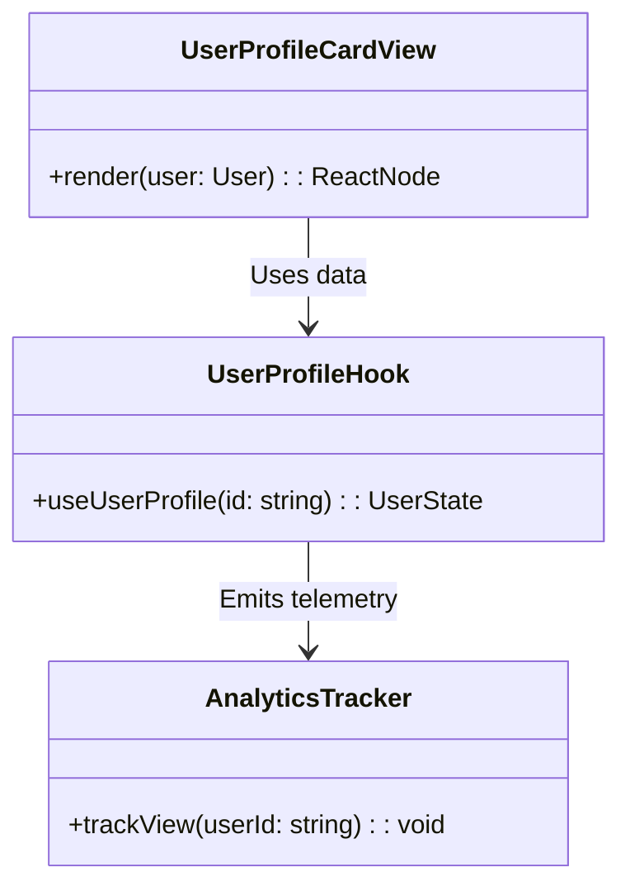
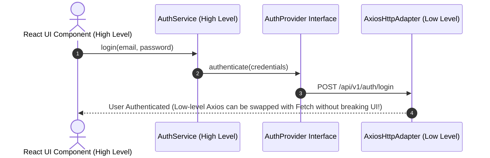

# 🧱 SOLID Principles — Complete Frontend & Backend Master Guide

> **🎯 Primary Target Audience:** Senior, Staff, and Principal Engineers (Frontend-Focused & Full-Stack)
> **Purpose:** The definitive, standalone guide for applying the 5 SOLID Principles in production software. Covers both **Frontend (React / Custom Hooks / UI Components)** and **Backend (Node / Express / Microservices / Databases)** side-by-side with Mermaid Diagrams, BEFORE/AFTER TypeScript code, When to Use vs When NOT to Use, Over-engineering Pitfalls, and a full Enterprise Notification System Case Study. After reading this, no other resource is needed.
> **Existing Repo Tags:** 🔗 [See Master OOP Guide](file:///Users/atulkumarawasthi/projects/SystemDesign/Prep/01-LLD/MASTER-OOP-DESIGN-PRINCIPLES.md) | 🔗 [See Design Patterns](file:///Users/atulkumarawasthi/projects/SystemDesign/Prep/01-LLD/04-Design-Patterns.md)

---

## 🗺️ Master SOLID System Architecture Flow

```mermaid
flowchart TD
    subgraph S - Single Responsibility
        Actor[Single Actor / Stakeholder] --> Module[Module handles 1 reason to change]
    end

    subgraph O - Open / Closed
        Core[Core Business Engine] -->|Extended via| Interface[Interfaces & Strategies]
        Interface -->|Add New Feature| NewExt[New Class without modifying Core]
    end

    subgraph L - Liskov Substitution
        Super[Supertype / Contract] <---|Substitutable| SubA[Subclass A]
        Super <---|Substitutable| SubB[Subclass B]
    end

    subgraph I - Interface Segregation
        Client[Client Component] -->|Depends strictly on| LeanInt[Lean Focused Interface]
    end

    subgraph D - Dependency Inversion
        HighLevel[High-Level UI / Service Logic] -->|Depends on| Abstraction[Abstraction Interface]
        LowLevel[Low-Level Fetch / DB Adapter] ..->|Implements| Abstraction
```

---

## 🎯 1. Single Responsibility Principle (SRP)

> _"A module should be responsible to one, and only one, actor or stakeholder."_ (Robert C. Martin)

### 💡 Deep Meaning

SRP is **not** "a function should do only one thing." SRP means a class or module should have **only one reason to change**. If a single file is modified when the **Product Team** changes business rules, when the **Security Team** changes password hashing, AND when the **Design Team** changes HTML layouts, that file severely violates SRP.

---

### 🖥️ Frontend Example (React Component Violation vs SRP Fix)

```typescript
// ❌ BEFORE (SRP Violation): God React Component doing API fetching, validation, analytics, and UI rendering
function BadUserProfileCard({ userId }: { userId: string }) {
  const [user, setUser] = useState<any>(null);
  const [loading, setLoading] = useState(true);

  useEffect(() => {
    // Reason to change 1: HTTP API endpoints
    fetch(`/api/users/${userId}`)
      .then((res) => res.json())
      .then((data) => {
        setUser(data);
        setLoading(false);
        // Reason to change 2: Analytics tracking format
        window.gtag('event', 'user_profile_view', { userId });
      });
  }, [userId]);

  // Reason to change 3: Form validation rules
  const validateAge = (age: number) => age >= 18;

  // Reason to change 4: HTML/CSS Layout
  if (loading) return <div>Loading...</div>;
  return <div className="card"><h1>{user.name}</h1></div>;
}

// ✅ AFTER (SRP Compliant): Decoupled into Single-Responsibility Units
// 1. Data Fetching Hook (Responsible to API Layer)
export function useUserProfile(userId: string) {
  const [user, setUser] = useState<User | null>(null);
  const [loading, setLoading] = useState(true);

  useEffect(() => {
    userService.getById(userId).then((data) => {
      setUser(data);
      setLoading(false);
    });
  }, [userId]);

  return { user, loading };
}

// 2. Pure Visual UI Component (Responsible to UI Design Team)
export function UserProfileCardView({ user }: { user: User }) {
  return <div className="card"><h1>{user.name}</h1></div>;
}
```

---

### 🗄️ Backend Example (Node/Express Violation vs SRP Fix)

```typescript
// ❌ BEFORE (SRP Violation): Express controller handling DB, Hashing, Email, and Response formatting
app.post('/api/register', async (req, res) => {
  const { email, password } = req.body;

  // 1. Validation
  if (!email.includes('@')) return res.status(400).send('Invalid email');

  // 2. Hashing
  const hash = await bcrypt.hash(password, 10);

  // 3. Database Save
  const user = await db.query('INSERT INTO users...', [email, hash]);

  // 4. Send Email
  await nodemailer.sendMail({ to: email, subject: 'Welcome!' });

  res.json({ success: true });
});

// ✅ AFTER (SRP Compliant): Separate Services
export class RegistrationController {
  constructor(
    private authService: AuthService,
    private emailService: EmailService,
  ) {}

  async handleRegister(req: Request, res: Response) {
    const user = await this.authService.register(req.body);
    await this.emailService.sendWelcome(user.email);
    return res.json({ success: true });
  }
}
```

---

### 🎨 SRP Visual Class Diagram



---

### ⚖️ When to Use vs When NOT to Use (Pitfalls)

- **When to Use:** Whenever a file or component exceeds 200–300 lines or starts handling multiple stakeholder concerns (e.g. Mixing API calls, Form validation, and UI styling).
- **When NOT to Use (Over-engineering Trap):** Do not split a 10-line helper function into 5 separate files just to enforce "single responsibility." That is micro-file explosion and increases cognitive load unnecessarily.

---

## 🔓 2. Open/Closed Principle (OCP)

> _"Software entities (classes, modules, functions) should be open for extension, but closed for modification."_ (Bertrand Meyer)

### 💡 Deep Meaning

You should be able to add **new features or behaviors** to a system by writing **new code**, without modifying existing, tested, production code. This is achieved via abstractions, strategy patterns, and interfaces.

---

### 🖥️ Frontend Example (Dynamic Form Component)

```typescript
// ❌ BEFORE (OCP Violation): Modifying existing switch statement every time a new Field Type is added
function BadFormField({ field }: { field: { type: string; label: string } }) {
  switch (field.type) {
    case 'text': return <input type="text" />;
    case 'select': return <select><option>Select</option></select>;
    case 'checkbox': return <input type="checkbox" />;
    // ⚠️ Adding 'date' requires MODIFYING this existing component!
    default: return null;
  }
}

// ✅ AFTER (OCP Compliant): Component Registry Pattern (Open for extension)
export interface FieldRenderer {
  render(field: any): React.ReactNode;
}

export class FieldRegistry {
  private static renderers = new Map<string, FieldRenderer>();

  static register(type: string, renderer: FieldRenderer) {
    this.renderers.set(type, renderer);
  }

  static get(type: string): FieldRenderer | undefined {
    return this.renderers.get(type);
  }
}

// Extension: Simply register new field type without modifying core Form engine!
FieldRegistry.register('date', {
  render: (field) => <input type="date" className="date-picker" />
});
```

---

### 🗄️ Backend Example (Payment Gateway Engine)

```typescript
// ❌ BEFORE (OCP Violation): Adding PayPal forces modifying existing PaymentProcessor class
class BadPaymentProcessor {
  processPayment(provider: string, amount: number) {
    if (provider === 'stripe') {
      /* Stripe logic */
    } else if (provider === 'paypal') {
      /* Paypal logic */
    }
    // ⚠️ Adding 'crypto' forces editing this tested class!
  }
}

// ✅ AFTER (OCP Compliant): Strategy Interface
export interface PaymentStrategy {
  pay(amount: number): Promise<{ success: boolean; transactionId: string }>;
}

export class StripePaymentStrategy implements PaymentStrategy {
  async pay(amount: number) {
    return { success: true, transactionId: 'ch_stripe_123' };
  }
}

export class PaypalPaymentStrategy implements PaymentStrategy {
  async pay(amount: number) {
    return { success: true, transactionId: 'pay_paypal_456' };
  }
}

export class PaymentProcessor {
  async executePayment(strategy: PaymentStrategy, amount: number) {
    return strategy.pay(amount); // Closed for modification, Open for new strategies!
  }
}
```

---

## 🔄 3. Liskov Substitution Principle (LSP)

> _"Subtypes must be substitutable for their base types without altering the correctness of the program."_ (Barbara Liskov)

### 💡 Deep Meaning

If class `B` is a subclass of class `A`, we should be able to pass `B` anywhere `A` is expected without throwing unexpected exceptions, breaking preconditions, or weakening postconditions.

---

### 🖥️ Frontend Example (UI Input Component Subtyping)

```typescript
// ❌ BEFORE (LSP Violation): ReadOnlyInput breaks contract by throwing runtime error on onChange
class BaseInput {
  onChange(value: string) {
    console.log('Value changed:', value);
  }
}

class ReadOnlyInput extends BaseInput {
  onChange(value: string) {
    throw new Error('Cannot change value of ReadOnlyInput!'); // 💥 Breaks LSP contract!
  }
}

// ✅ AFTER (LSP Compliant): Separate contracts using Composition or Interfaces
export interface ReadableInputProps {
  value: string;
}

export interface WritableInputProps extends ReadableInputProps {
  onChange: (value: string) => void;
}
```

---

## ✂️ 4. Interface Segregation Principle (ISP)

> _"Clients should not be forced to depend on interfaces that they do not use."_

### 💡 Deep Meaning

Avoid fat, monolithic interfaces. Create small, role-specific interfaces so implementing classes and components only depend on methods that concern them.

---

### 🖥️ Frontend Example (Component Props Segregation)

```typescript
// ❌ BEFORE (ISP Violation): Fat User object passed to simple Avatar component
interface FatUser {
  id: string;
  name: string;
  avatarUrl: string;
  email: string;
  billingAddress: string;
  creditCardTokens: string[];
}

function BadAvatarComponent({ user }: { user: FatUser }) {
  return ; // Component depends on billing data it never uses!
}

// ✅ AFTER (ISP Compliant): Lean, Segregated Interface
interface AvatarProps {
  name: string;
  avatarUrl: string;
}

function GoodAvatarComponent({ name, avatarUrl }: AvatarProps) {
  return ;
}
```

---

## 🔄 5. Dependency Inversion Principle (DIP)

> _"High-level modules should not depend on low-level modules. Both should depend on abstractions. Abstractions should not depend on details."_

### 💡 Deep Meaning

High-level business logic (e.g. React UI / Checkout Flow) should never directly import low-level infrastructure details (e.g. `axios`, `localStorage`, `AWS SDK`). Both must depend on **Interface Abstractions**.

---

### 🎨 DIP Sequence & Dependency Flow



---

### 🖥️ Frontend Example (HTTP Fetcher Dependency Inversion)

```typescript
// Abstraction Contract
export interface HttpClient {
  get<T>(url: string): Promise<T>;
}

// Low-Level Fetch Adapter
export class FetchHttpClient implements HttpClient {
  async get<T>(url: string): Promise<T> {
    const res = await fetch(url);
    return res.json();
  }
}

// High-Level User Service depending ONLY on HttpClient abstraction
export class UserService {
  constructor(private http: HttpClient) {}

  async getUser(id: string) {
    return this.http.get<{ id: string; name: string }>(`/api/users/${id}`);
  }
}
```

---

## 🏗️ Real-World Case Study: Enterprise Notification System (All 5 SOLID Principles Applied)

Here is how all 5 SOLID principles work together in a single system:

```typescript
// 1. Single Responsibility (SRP): Notification Payload Model
export interface NotificationPayload {
  recipient: string;
  title: string;
  body: string;
}

// 2. Open/Closed (OCP) + Dependency Inversion (DIP): Provider Abstraction
export interface NotificationProvider {
  send(payload: NotificationPayload): Promise<{ success: boolean; providerId: string }>;
}

// 3. Liskov Substitution (LSP): Concrete Providers substitutable everywhere
export class EmailNotificationProvider implements NotificationProvider {
  async send(payload: NotificationPayload) {
    return { success: true, providerId: `email_${Date.now()}` };
  }
}

export class SMSNotificationProvider implements NotificationProvider {
  async send(payload: NotificationPayload) {
    return { success: true, providerId: `sms_${Date.now()}` };
  }
}

export class PushNotificationProvider implements NotificationProvider {
  async send(payload: NotificationPayload) {
    return { success: true, providerId: `push_${Date.now()}` };
  }
}

// 4. Interface Segregation (ISP): Optional Provider Health Check
export interface HealthCheckable {
  checkHealth(): Promise<boolean>;
}

// 5. High-Level Dispatcher Engine
export class NotificationDispatcher {
  private providers: NotificationProvider[] = [];

  registerProvider(provider: NotificationProvider) {
    this.providers.push(provider);
  }

  async broadcast(payload: NotificationPayload) {
    return Promise.all(this.providers.map((p) => p.send(payload)));
  }
}
```

---

## 📊 Master SOLID Summary Matrix

| Principle             | Core Directive         | Primary FE Benefit              | Primary BE Benefit               | Violation Warning Sign                              |
| :-------------------- | :--------------------- | :------------------------------ | :------------------------------- | :-------------------------------------------------- |
| **S** (Single Resp)   | 1 reason to change     | Easy unit testing of hooks & UI | Easy service scaling & debugging | 500+ line God classes                               |
| **O** (Open/Closed)   | Extend, don't modify   | Dynamic component registries    | Plugin architectures             | Massive `switch/case` chains                        |
| **L** (Liskov Sub)    | Subtypes substitutable | Predictable prop contracts      | Safe polymorphism                | Subclasses throwing `Error("Not Implemented")`      |
| **I** (Interface Seg) | Lean small interfaces  | Minimal prop drilling           | Micro API contracts              | Components ignoring 80% of passed props             |
| **D** (Dep Inversion) | Depend on abstractions | Easy mock API testing (MSW)     | Swappable DB / Storage adapters  | Direct `import axios from 'axios'` in UI components |
