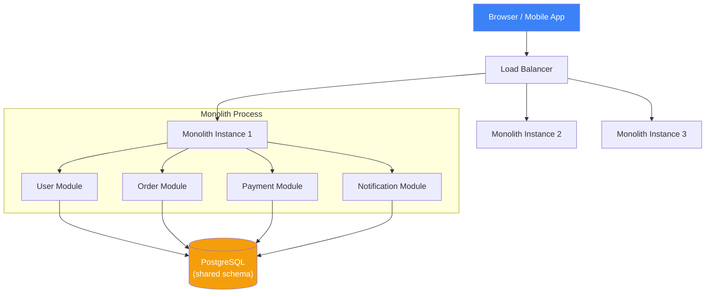
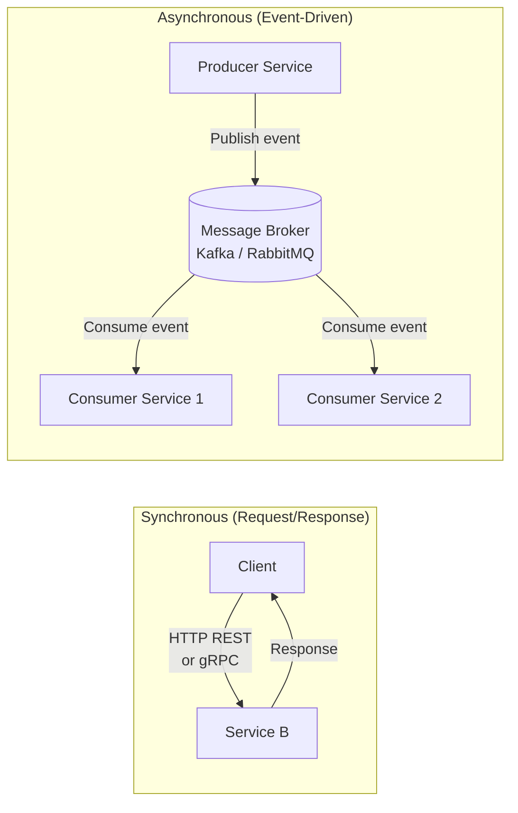
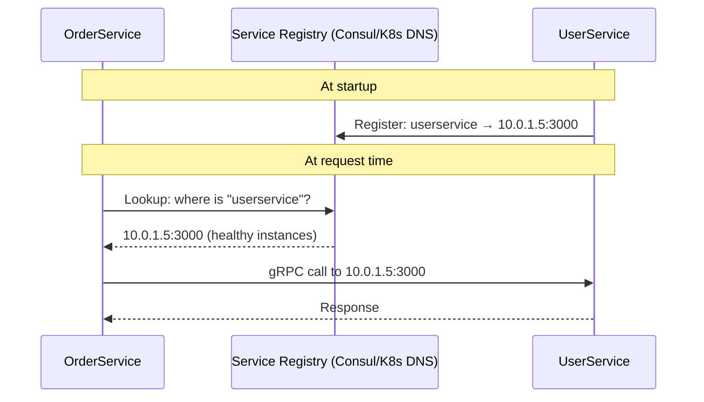
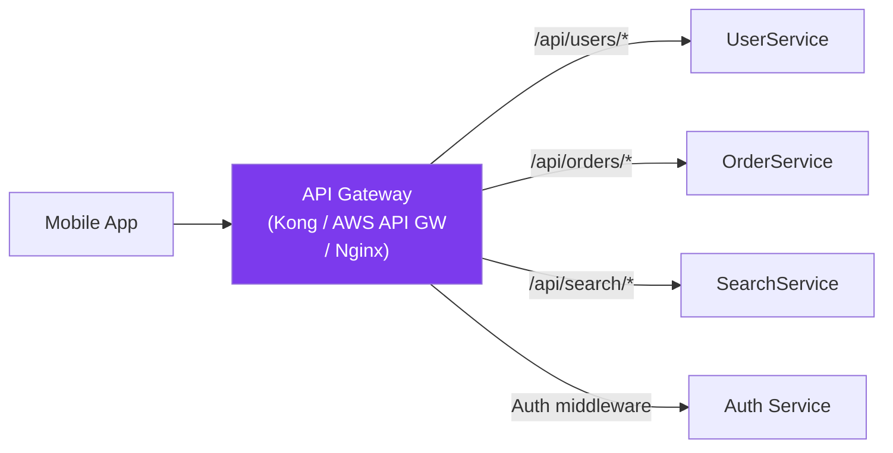
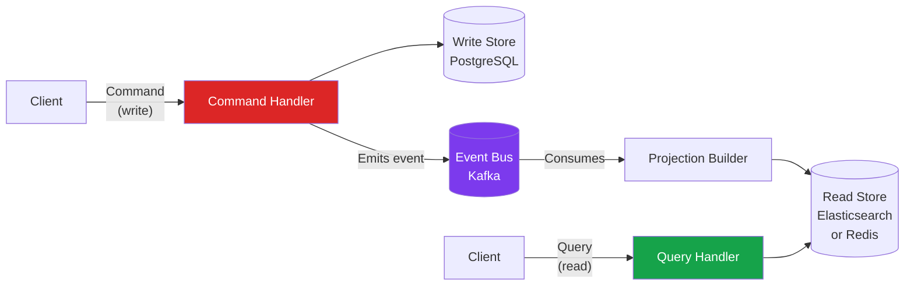
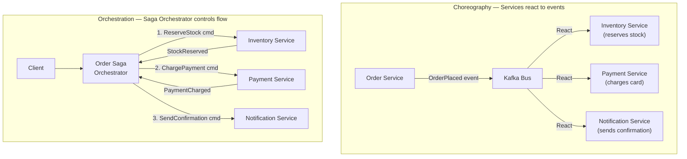
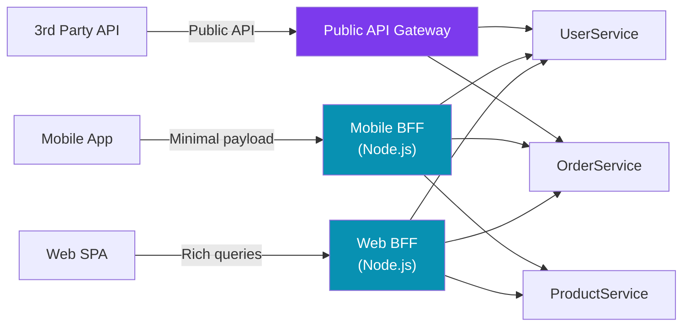
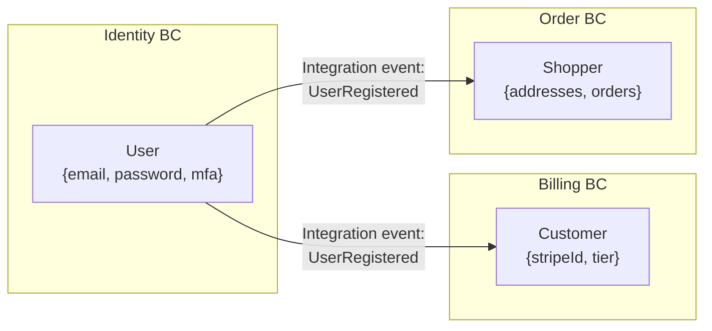

# 🏛️ Architecture Patterns — Principal/Staff Architect Guide

> **Principal-level signal:** Architecture patterns are not fashion trends to adopt because "everyone is doing it." Each pattern solves a specific class of problems and introduces a specific class of costs. Your job is to match problem to pattern, not pattern to resume.

---

## 📚 Table of Contents

- [Monolith](#-monolith)
- [Microservices](#-microservices)
- [Event-Driven Architecture](#-event-driven-architecture-eda)
- [BFF — Backend for Frontend](#-bff--backend-for-frontend)
- [Clean / Hexagonal Architecture](#-clean--hexagonal-architecture)
- [DDD — Domain-Driven Design](#-ddd--domain-driven-design)
- [Architecture Decision Table](#-architecture-decision-table)
- [Q&A Self-Test](#-qa-self-test)

---

## 🧱 Monolith

### What It Is

A monolith is a single deployable unit where all the application logic — presentation, business rules, data access — is compiled and deployed together. The term has become a pejorative, but that's a mistake born from cargo-culting microservices.

A monolith is not inherently bad. It's the **default correct architecture** until you have a proven reason to split.

### When Monolith is the RIGHT Choice

The decision is not about scale — it's about **team topology, domain clarity, and operational maturity**.

| Condition                          | Why Monolith Wins                                                                               |
| ---------------------------------- | ----------------------------------------------------------------------------------------------- |
| Team < 10 engineers                | Conway's Law — one team, one deployable unit                                                    |
| Domain is new / evolving           | You don't know the bounded contexts yet — premature extraction = distributed monolith           |
| Transactional consistency required | ACID transactions across a monolith DB are trivial; across services they require Saga pattern   |
| Low operational maturity           | Microservices require K8s, service mesh, distributed tracing — a burden that slows a small team |
| Startup / MVP                      | Time to market beats architectural purity                                                       |

**Real-world example:** Stack Overflow serves ~1.5B monthly page views from a small number of on-prem servers running a monolithic .NET application. Shopify ran a Rails monolith for years into billions in GMV.

### Modular Monolith: The Pragmatic Middle Ground

A **modular monolith** is a monolith with enforced architectural boundaries — the best of both worlds:

- Single deployable unit (operational simplicity)
- Enforced module boundaries (architectural cleanliness)
- No cross-module direct DB table access (modules own their data)
- Clean public API between modules (extraction to services becomes easy later)

```typescript
// ❌ Classic monolith — everything touches everything
// OrderService directly queries UserTable
import { db } from '../database';
class OrderService {
  async createOrder(userId: string) {
    const user = await db.query('SELECT * FROM users WHERE id = $1', [userId]);
    // OrderService knows too much about User internals
  }
}

// ✅ Modular monolith — modules communicate through interfaces
// user/UserModule.ts — public API of the User module
export interface UserModule {
  getUserById(id: string): Promise<{ id: string; email: string; tier: 'free' | 'pro' }>;
  validateUserExists(id: string): Promise<boolean>;
}

// order/OrderService.ts — depends only on UserModule interface
class OrderService {
  constructor(private readonly users: UserModule) {}

  async createOrder(userId: string) {
    const exists = await this.users.validateUserExists(userId);
    if (!exists) throw new Error('User not found');
    // OrderService knows nothing about how User data is stored
  }
}
```

This boundary discipline means when you need to extract `UserModule` to its own service, you change only the `UserModule` implementation — the `OrderService` code is untouched.

### Monolith Architecture Diagram



### Pitfalls at Scale

| Pitfall                    | Description                                 | Mitigation                                                       |
| -------------------------- | ------------------------------------------- | ---------------------------------------------------------------- |
| **Deployment coupling**    | A bug in one module takes down everything   | Blue-green deploys, feature flags                                |
| **Test suite growth**      | Full test suite takes 30+ minutes           | Test parallelization, selective CI                               |
| **Technology lock-in**     | Entire app must use same language/runtime   | Modular monolith makes extraction possible                       |
| **Memory/CPU competition** | Modules share process resources             | Vertical scaling has limits; eventually must extract hot modules |
| **Database bottleneck**    | Shared DB schema becomes a write bottleneck | Read replicas, connection pooling (PgBouncer)                    |

---

## 🔬 Microservices

### Real Definition (Not Just "Small Services")

Microservices is an architectural style where the application is structured as a **collection of independently deployable services** that:

1. Are organized around **business capabilities** (not technical layers)
2. Own their **data** (each service has its own database — database-per-service pattern)
3. Communicate over **well-defined interfaces** (HTTP/gRPC/events)
4. Are **independently deployable** — you can release UserService without touching OrderService
5. Are **failure-isolated** — UserService crashing does not take down OrderService

The word "micro" is misleading. The right size for a service is: **one team can own it, understand it, and deploy it independently.**

### Communication Patterns: Sync vs Async



| Dimension          | Synchronous (REST/gRPC)                      | Asynchronous (Events)                                        |
| ------------------ | -------------------------------------------- | ------------------------------------------------------------ |
| **Coupling**       | Temporal coupling — both services must be up | Decoupled — producer doesn't wait for consumers              |
| **Latency**        | Low for single call                          | Higher (queue processing) but non-blocking                   |
| **Complexity**     | Simple request/response model                | Requires broker, consumer groups, offset management          |
| **Error handling** | Caller retries immediately                   | Retry via dead-letter queue, at consumer                     |
| **Use when**       | Real-time data needed, simple fan-out        | Fire-and-forget, fan-out to many consumers, heavy processing |
| **Example**        | User login → JWT issuance                    | Order placed → notify + inventory + billing                  |

#### REST vs gRPC

```typescript
// REST: Simple, text-based, universally supported
// GET /api/v1/users/:id
// Returns: JSON payload

// gRPC: Binary (protobuf), strongly typed, lower latency
// Defined in .proto file:
// service UserService {
//   rpc GetUser (GetUserRequest) returns (User);
// }
// Best for: Internal service-to-service calls where latency matters

// TypeScript gRPC client example
import * as grpc from '@grpc/grpc-js';
import { UserServiceClient } from './generated/user_grpc_pb';
import { GetUserRequest } from './generated/user_pb';

const client = new UserServiceClient('user-service:50051', grpc.credentials.createInsecure());

const request = new GetUserRequest();
request.setId('user-123');

client.getUser(request, (error, response) => {
  if (error) throw error;
  console.log(response.getEmail()); // strongly typed
});
```

### Service Discovery

When services are ephemeral (scaled up/down dynamically), they need to find each other dynamically.



**Client-side discovery:** Service reads registry, picks instance, load-balances itself (e.g., Ribbon in Java).
**Server-side discovery:** Load balancer reads registry, routes to instance (e.g., AWS ALB + ECS service discovery).

In Kubernetes, service discovery is handled by kube-dns + Services — you call `http://user-service:80` and K8s resolves it.

### API Gateway

The API Gateway is the single entry point for external clients. It handles:

- Request routing to downstream services
- Authentication / authorization (JWT validation)
- Rate limiting
- Request transformation (protocol translation, payload mapping)
- SSL termination
- Response aggregation (optional — BFF does this better)



### Pitfalls: The Distributed Monolith

The most dangerous microservices failure mode is building a **distributed monolith**: services that are technically separate but deployed together, share a database, or are so tightly coupled that they can't be deployed independently.

Signs of a distributed monolith:

- ServiceA calls ServiceB synchronously for every request (temporal coupling)
- Multiple services share the same database tables
- You must deploy ServiceA and ServiceB together because of tight contract dependencies
- A change to ServiceA's API requires simultaneous changes in 5 other services

> **Principal-level signal:** When you see synchronous call chains 3+ services deep (A → B → C → D), this is an architectural smell. Either the services are too fine-grained (split badly), or you need async event-driven communication.

### When NOT to Use Microservices

- **Team is small** (< 5 engineers): operational overhead kills velocity
- **Domain is unclear**: you'll draw the wrong boundaries and end up with chatty services
- **Strong transactional consistency required**: banking ledgers, inventory deduction
- **Low traffic**: a monolith on one server handles millions of requests/day
- **Greenfield product**: you don't know your domain boundaries until you've built v1

---

## ⚡ Event-Driven Architecture (EDA)

### Events vs Commands vs Queries

These are three distinct message types with different semantics:

| Type        | Description                                                    | Direction                   | Example                         |
| ----------- | -------------------------------------------------------------- | --------------------------- | ------------------------------- |
| **Event**   | Something that happened (past tense, immutable fact)           | Producer → (many) Consumers | `OrderPlaced`, `UserRegistered` |
| **Command** | Request to do something (present tense, expectation of action) | Sender → specific Receiver  | `PlaceOrder`, `SendEmail`       |
| **Query**   | Request for information (read-only, no side effects)           | Requester → Responder       | `GetOrderById`                  |

```typescript
// Event — describes what happened, consumers decide what to do with it
interface OrderPlacedEvent {
  type: 'ORDER_PLACED';
  payload: {
    orderId: string;
    userId: string;
    items: Array<{ productId: string; quantity: number; price: number }>;
    totalAmount: number;
    placedAt: string; // ISO 8601
  };
  metadata: {
    eventId: string; // UUID, for deduplication
    correlationId: string; // traces through entire request chain
    version: number; // schema version for backward compatibility
    publishedAt: string;
  };
}

// Command — tells a service to do something specific
interface SendWelcomeEmailCommand {
  type: 'SEND_WELCOME_EMAIL';
  payload: {
    userId: string;
    email: string;
    firstName: string;
  };
}
```

### CQRS Pattern — Read/Write Separation

**Command Query Responsibility Segregation (CQRS)** separates write models from read models. The write side handles commands and produces events; the read side consumes events to build optimized query models (read stores).



**Why CQRS?** The read and write access patterns are radically different for most systems:

- Writes need normalization (avoid anomalies), ACID, constraints
- Reads need denormalization (avoid JOINs), fast retrieval, shaped for UI

With CQRS, you optimize each side independently. The read store is rebuilt from events — it can be completely replaced without touching the write side.

**Frontend relevance:** CQRS directly maps to how we design state management. Commands map to dispatched actions; queries map to selectors/derived state. The Redux pattern is essentially client-side CQRS.

```typescript
// Redux as client-side CQRS
// Command (action dispatch)
dispatch({ type: 'ADD_TO_CART', payload: { productId: 'p1', quantity: 2 } });

// Query (selector) — derived read model
const cartTotal = useSelector((state) => state.cart.items.reduce((sum, item) => sum + item.price * item.quantity, 0));
```

### Event Sourcing — Append-Only Log

Instead of storing current state, **event sourcing** stores every state change as an immutable event. Current state is derived by replaying events.

```typescript
// Traditional (mutable state)
// UPDATE accounts SET balance = 900 WHERE id = 'acc-1';

// Event Sourced (immutable log)
const events: AccountEvent[] = [
  { type: 'ACCOUNT_OPENED', amount: 1000, timestamp: '2024-01-01T10:00:00Z' },
  { type: 'WITHDRAWAL', amount: 200, timestamp: '2024-01-15T14:30:00Z' },
  { type: 'DEPOSIT', amount: 100, timestamp: '2024-01-20T09:00:00Z' },
  // Current balance = 1000 - 200 + 100 = 900
];

function replayBalance(events: AccountEvent[]): number {
  return events.reduce((balance, event) => {
    switch (event.type) {
      case 'ACCOUNT_OPENED':
        return event.amount;
      case 'DEPOSIT':
        return balance + event.amount;
      case 'WITHDRAWAL':
        return balance - event.amount;
      default:
        return balance;
    }
  }, 0);
}
```

**Benefits:**

- Complete audit trail for free
- Time-travel debugging — replay to any point in time
- Event log is the source of truth — rebuild any read model from it
- Bug correction — re-apply corrected business logic to historical events

**Costs:**

- Events must be backward compatible (schema evolution is hard)
- Eventual consistency between write log and read models
- Snapshots needed for performance when event history grows large

### Choreography vs Orchestration



| Dimension            | Choreography                          | Orchestration                                |
| -------------------- | ------------------------------------- | -------------------------------------------- |
| **Coupling**         | Low — services only know about events | Higher — orchestrator knows all participants |
| **Traceability**     | Hard — flow is implicit in events     | Easy — orchestrator owns the workflow        |
| **Failure handling** | Each service handles own compensation | Orchestrator handles all compensations       |
| **Complexity**       | Simple per service, complex overall   | Complex orchestrator, simple participants    |
| **Best for**         | Simple fan-out, independent reactions | Multi-step business processes with rollbacks |

### Frontend Relevance: Event-Driven State Management

Event-driven architecture has direct parallels in frontend state management:

```typescript
// EventEmitter-based state management (simplified Flux/Redux)
class FrontendEventBus extends EventEmitter {
  publish<T>(eventType: string, payload: T): void {
    this.emit(eventType, { type: eventType, payload, timestamp: Date.now() });
  }
}

const bus = new FrontendEventBus();

// Component A produces an event
bus.publish('USER_PROFILE_UPDATED', { userId: '123', newEmail: 'x@y.com' });

// Components B and C independently react — no direct coupling
bus.on('USER_PROFILE_UPDATED', ({ payload }) => {
  // Update navbar avatar
});
bus.on('USER_PROFILE_UPDATED', ({ payload }) => {
  // Invalidate profile cache
});
```

WebSocket-based real-time UIs are inherently event-driven: the server emits events (new message, status change, price update) and the frontend state machine reacts.

---

## 🎭 BFF — Backend for Frontend

### Why BFF Exists: The Fat Client Problem

When a frontend consumes a generic REST API designed for all consumers, it faces:

- **Over-fetching** — getting more data than needed, wasting bandwidth
- **Under-fetching** — needing N+1 API calls to build one screen
- **Response shaping** — client must transform data into UI-ready format
- **Mobile vs Web differences** — a mobile screen needs less data than web dashboard

The **BFF pattern** (coined by Sam Newman) creates a **dedicated backend for each frontend type** that owns the aggregation, transformation, and shaping logic.



### BFF vs API Gateway

| Dimension         | BFF                                            | API Gateway                                   |
| ----------------- | ---------------------------------------------- | --------------------------------------------- |
| **Purpose**       | Aggregate + transform for one frontend         | Route, auth, rate-limit for all consumers     |
| **Logic**         | Business logic (response shaping, aggregation) | Operational logic (auth, throttling, logging) |
| **Ownership**     | Frontend team                                  | Platform/ops team                             |
| **Per consumer?** | Yes — one per frontend type                    | No — single gateway for all                   |
| **GraphQL?**      | BFFs often expose GraphQL                      | API Gateways expose REST/GraphQL pass-through |

### Frontend Engineer's Role in BFF Design

BFF is the one backend component that frontend engineers should own. At principal level:

1. **Define the data contract from the UI's perspective** — what does each screen need? Build the API around screen requirements, not resource representations.
2. **Own the aggregation logic** — call UserService + OrderService + ProductService in parallel (Promise.all), merge, shape, return.
3. **Define caching strategy** — which fields can be cached at BFF level? What's the TTL?
4. **Handle mobile-specific optimizations** — field projection (only return needed fields), response compression.

```typescript
// BFF: Dashboard screen aggregation
// Instead of client making 3 calls, BFF makes them in parallel

interface DashboardResponse {
  user: { name: string; avatar: string; tier: 'free' | 'pro' };
  recentOrders: Array<{ id: string; status: string; total: number }>;
  recommendations: Array<{ productId: string; title: string; price: number }>;
}

async function getDashboard(userId: string): Promise<DashboardResponse> {
  const [user, orders, recs] = await Promise.all([
    userService.getProfile(userId),
    orderService.getRecentOrders(userId, { limit: 5 }),
    recommendationService.getForUser(userId, { limit: 10 }),
  ]);

  // Shape response for the dashboard screen — no transformation needed on client
  return {
    user: { name: user.firstName, avatar: user.avatarUrl, tier: user.subscriptionTier },
    recentOrders: orders.map((o) => ({ id: o.id, status: o.status, total: o.totalAmount })),
    recommendations: recs.map((r) => ({ productId: r.id, title: r.name, price: r.currentPrice })),
  };
}
```

---

## 🔷 Clean / Hexagonal Architecture

### Ports and Adapters

The Hexagonal Architecture (Ports and Adapters), coined by Alistair Cockburn, structures the application so that the **business logic (domain) has zero knowledge of infrastructure** (database, HTTP, message queues, external APIs).

```
         OUTSIDE WORLD
    ┌─────────────────────────────────────────┐
    │  HTTP Controller  │  CLI  │  Test Suite  │  ← Driving Adapters (Primary)
    └───────────┬─────────────────────────────┘
                │ calls via Port (interface)
    ┌───────────▼─────────────────────────────┐
    │                                         │
    │         APPLICATION CORE                │
    │    (Use Cases / Application Services)   │
    │                                         │
    │   ┌─────────────────────────────────┐   │
    │   │      DOMAIN                     │   │
    │   │  (Entities, Value Objects,      │   │
    │   │   Domain Services, Events)      │   │
    │   └─────────────────────────────────┘   │
    │                                         │
    └───────────┬─────────────────────────────┘
                │ calls via Port (interface)
    ┌───────────▼─────────────────────────────┐
    │  PostgresRepo  │  RedisCache  │  Kafka   │  ← Driven Adapters (Secondary)
    └─────────────────────────────────────────┘
         INFRASTRUCTURE
```

### TypeScript Implementation

```typescript
// ─── Domain Layer (knows nothing about infrastructure) ───────────────────────
// domain/entities/Order.ts
export class Order {
  private constructor(
    public readonly id: string,
    public readonly userId: string,
    public readonly items: OrderItem[],
    private status: OrderStatus,
  ) {}

  static create(userId: string, items: OrderItem[]): Order {
    if (items.length === 0) throw new DomainError('Order must have at least one item');
    return new Order(crypto.randomUUID(), userId, items, 'PENDING');
  }

  confirm(): void {
    if (this.status !== 'PENDING') throw new DomainError('Only pending orders can be confirmed');
    this.status = 'CONFIRMED';
  }

  get total(): number {
    return this.items.reduce((sum, item) => sum + item.price * item.quantity, 0);
  }
}

// ─── Port (interface the domain defines) ─────────────────────────────────────
// domain/ports/OrderRepository.ts
export interface OrderRepository {
  save(order: Order): Promise<void>;
  findById(id: string): Promise<Order | null>;
  findByUserId(userId: string): Promise<Order[]>;
}

// ─── Application Layer (Use Cases) ───────────────────────────────────────────
// application/use-cases/PlaceOrderUseCase.ts
export class PlaceOrderUseCase {
  constructor(
    private readonly orderRepo: OrderRepository, // port
    private readonly eventBus: DomainEventBus, // port
  ) {}

  async execute(command: PlaceOrderCommand): Promise<{ orderId: string }> {
    const order = Order.create(command.userId, command.items);
    await this.orderRepo.save(order);
    await this.eventBus.publish(new OrderPlacedEvent(order));
    return { orderId: order.id };
  }
}

// ─── Adapter (Infrastructure Implementation) ─────────────────────────────────
// infrastructure/adapters/PostgresOrderRepository.ts
export class PostgresOrderRepository implements OrderRepository {
  constructor(private readonly db: Pool) {}

  async save(order: Order): Promise<void> {
    await this.db.query('INSERT INTO orders (id, user_id, status, total) VALUES ($1, $2, $3, $4)', [
      order.id,
      order.userId,
      order.status,
      order.total,
    ]);
  }

  async findById(id: string): Promise<Order | null> {
    const result = await this.db.query('SELECT * FROM orders WHERE id = $1', [id]);
    if (!result.rows[0]) return null;
    return OrderMapper.toDomain(result.rows[0]);
  }

  async findByUserId(userId: string): Promise<Order[]> {
    const result = await this.db.query('SELECT * FROM orders WHERE user_id = $1', [userId]);
    return result.rows.map(OrderMapper.toDomain);
  }
}

// ─── Composition Root (wires everything together) ─────────────────────────────
// infrastructure/container.ts
const db = new Pool({ connectionString: process.env.DATABASE_URL });
const orderRepo = new PostgresOrderRepository(db);
const eventBus = new KafkaEventBus(kafkaClient);
const placeOrderUseCase = new PlaceOrderUseCase(orderRepo, eventBus);

// HTTP Adapter
app.post('/api/orders', async (req, res) => {
  const result = await placeOrderUseCase.execute(req.body);
  res.status(201).json(result);
});
```

### Why It Matters for Testability

With hexagonal architecture, you can test every use case with in-memory adapters, no database, no network:

```typescript
// Ultra-fast unit test — no DB, no Kafka, no HTTP
describe('PlaceOrderUseCase', () => {
  it('saves the order and publishes OrderPlacedEvent', async () => {
    const orderRepo = new InMemoryOrderRepository();
    const eventBus = new InMemoryEventBus();
    const useCase = new PlaceOrderUseCase(orderRepo, eventBus);

    const result = await useCase.execute({
      userId: 'user-1',
      items: [{ productId: 'p1', quantity: 2, price: 10 }],
    });

    expect(orderRepo.findById(result.orderId)).resolves.not.toBeNull();
    expect(eventBus.published).toContainEqual(expect.objectContaining({ type: 'ORDER_PLACED' }));
  });
});
```

---

## 🗺️ DDD — Domain-Driven Design

### What DDD Is (and Isn't)

DDD is a set of practices for **modeling complex business domains** so that the code structure reflects the business structure. It's not a technical pattern — it's a collaboration methodology between engineers and domain experts.

The key insight: **the code should speak the language of the business.** A class called `Order` with a method `confirm()` is understandable by a product manager. A class called `DataRecord` with a method `updateState(4)` is not.

### Bounded Contexts

A bounded context defines a **boundary within which a domain model is consistent and unambiguous**. The same word can mean different things in different bounded contexts.

```
"User" in different contexts:
├── Identity Context    → User = { email, passwordHash, mfaEnabled }
├── Billing Context     → User = { stripeCustomerId, subscriptionTier, paymentMethods }
├── Order Context       → User = { shippingAddresses, orderHistory }
└── Recommendation Ctx  → User = { purchaseHistory, clickHistory, preferences }
```

These are NOT the same object. Trying to make one `User` model serve all four contexts creates an anemic, over-fielded object with no clear responsibility.



### Ubiquitous Language

The domain language must be shared between engineers and business experts. Every term in a bounded context must have exactly one unambiguous meaning, used consistently in code, documentation, and conversation.

> ❌ "We update the user's plan status in the DB when they pay"
> ✅ "We activate the Subscription when a SubscriptionPayment is confirmed"

### Aggregates

An **aggregate** is a cluster of domain objects treated as a single unit for data changes. The **aggregate root** is the entry point — external objects can only reference the root, never internal entities directly.

```typescript
// Order is the Aggregate Root — all mutations go through Order
class Order {
  // Aggregate Root
  private items: OrderItem[] = []; // Internal Entity — never referenced externally
  private payments: Payment[] = []; // Internal Entity

  addItem(product: Product, quantity: number): void {
    // All business rules live here — the Order enforces its own invariants
    if (this.status !== 'DRAFT') throw new DomainError('Cannot add items to a placed order');
    const existing = this.items.find((i) => i.productId === product.id);
    if (existing) {
      existing.increaseQuantity(quantity); // internal mutation via root
    } else {
      this.items.push(new OrderItem(product.id, product.price, quantity));
    }
  }

  // External code NEVER does: order.items[0].price = 99; ← violation
  // External code ALWAYS does: order.addItem(product, 1); ← correct
}
```

**Aggregate rules:**

1. Transactions must not span aggregate boundaries
2. Aggregates communicate via domain events (not direct references)
3. Keep aggregates small — include only what must be consistent together

### Frontend DDD: Feature Folders

DDD bounded contexts map directly to frontend feature folder organization:

```
src/
├── features/
│   ├── identity/                    ← Identity Bounded Context
│   │   ├── components/LoginForm.tsx
│   │   ├── hooks/useAuth.ts
│   │   ├── store/authSlice.ts
│   │   └── api/authApi.ts
│   ├── billing/                     ← Billing Bounded Context
│   │   ├── components/PricingPage.tsx
│   │   ├── hooks/useSubscription.ts
│   │   ├── store/billingSlice.ts
│   │   └── api/billingApi.ts
│   └── orders/                      ← Order Bounded Context
│       ├── components/OrderList.tsx
│       ├── hooks/useOrders.ts
│       ├── store/ordersSlice.ts
│       └── api/ordersApi.ts
└── shared/                          ← Shared Kernel (minimal)
    ├── components/Button.tsx
    └── utils/formatCurrency.ts
```

**Rule:** Features should not import directly from other features. Cross-feature communication happens through the store (events) or a shared kernel — mirroring bounded context integration patterns.

---

## 📊 Architecture Decision Table

| Context                         | Best Pattern                 | Why                                                              | Avoid                     |
| ------------------------------- | ---------------------------- | ---------------------------------------------------------------- | ------------------------- |
| Startup / MVP                   | Monolith                     | Team is small, domain unclear, operational overhead must be low  | Microservices (premature) |
| Growing startup (10–30 eng)     | Modular Monolith             | Enforce boundaries before splitting, maintain deployability      | Distributed monolith      |
| Multi-team org (30+ eng)        | Microservices + EDA          | Teams need independent deployability, domain boundaries clear    | Shared DB across services |
| High read traffic (>100K QPS)   | CQRS + Read replicas         | Read models optimized independently from write models            | Single read/write DB      |
| Complex business workflows      | Saga pattern (Orchestration) | Multi-step transactions with compensations                       | 2PC (locks too long)      |
| Real-time UI (chat, live data)  | EDA + WebSocket              | Push model eliminates polling; events fan out to many clients    | Polling REST              |
| Multiple frontend types         | BFF per client               | Each client has different data needs; aggregation belongs in BFF | Generic API for all       |
| High testability requirement    | Hexagonal Architecture       | Domain logic testable without infrastructure dependencies        | Anemic domain model       |
| Complex business domain         | DDD + Bounded Contexts       | Domain vocabulary in code, clear ownership, avoid God objects    | Technical layering only   |
| Microservice integration events | Event Sourcing               | Full audit trail, replay capability, no shared state             | Mutable shared state      |

---

## ❓ Q&A Self-Test

<details>
<summary>❓ What is a distributed monolith and why is it worse than either a monolith or microservices?</summary>

**Answer:**

A distributed monolith is a system that has the **complexity of microservices** (network calls, distributed state, independent deployment pipelines) without the **benefits of microservices** (independent deployability, isolated failures, technology diversity).

Symptoms:

- Services share a database — changing one service's schema breaks others
- Services are deployed together in lockstep (choreographed releases)
- A failure in ServiceA brings down ServiceB (no circuit breakers, tight coupling)
- Synchronous call chains: A → B → C → D → A (circular dependency)
- "Microservices" that are so fine-grained (chatty) that a single user request triggers 30 network hops

It's worse than a monolith because a monolith has in-process calls (nanoseconds), shared memory, and ACID transactions. A distributed monolith replaces all of these with network calls (milliseconds), serialization overhead, and eventual consistency — without getting fault isolation or independent deployability in return.

The fix is either: (a) merge the services back into a modular monolith until boundaries are clear, or (b) refactor to loose coupling — async events, database-per-service, circuit breakers.

</details>

<details>
<summary>❓ When should you use Event Sourcing vs a traditional mutable-state database?</summary>

**Answer:**

Event sourcing is the right choice when:

1. **Complete audit trail is required** — financial systems, healthcare records, legal transactions where you must prove what happened and when
2. **Temporal queries matter** — "what was the state of this order at 2pm yesterday?" is trivial with event log, requires extra infrastructure with mutable state
3. **Debugging complex bugs** — replay events to reproduce exact state machine
4. **CQRS is already in use** — events naturally feed projection builders for multiple read models
5. **Business domain is event-centric** — if the domain experts think in terms of "things that happened," event sourcing models this naturally

Event sourcing is NOT the right choice when:

1. **Simple CRUD** — user profile, settings — state is all you need, history has no value
2. **Small team, low complexity** — the operational overhead of event stores, projections, and snapshot management is significant
3. **Schema stability is uncertain** — event schemas must be backward-compatible forever; this is hard if your domain is still evolving
4. **Strong read consistency required** — the projection lag means reads may be stale

The key question: **"Do you need to know what happened, or just what the current state is?"** If current state is all you care about, event sourcing adds cost for no benefit.

</details>

<details>
<summary>❓ What is the difference between choreography and orchestration in event-driven systems? When do you choose each?</summary>

**Answer:**

**Choreography:** Services react independently to events published on a shared bus. No central coordinator. ServiceA publishes `OrderPlaced`; InventoryService, PaymentService, and NotificationService each subscribe and react independently.

- ✅ Loose coupling — services don't know about each other
- ✅ Easy to add new consumers without changing producers
- ❌ Hard to understand the overall business flow (it's implicit in the event topology)
- ❌ Hard to handle failures and compensating transactions across services
- ❌ Debugging requires tracing events across multiple services

**Orchestration:** A central saga orchestrator sends commands to services and waits for their responses, controlling the flow explicitly.

- ✅ Business flow is visible in one place (the orchestrator)
- ✅ Compensating transactions are managed centrally
- ✅ Easy to monitor and trace a multi-step process
- ❌ The orchestrator becomes a single point of coupling and failure
- ❌ Services become aware of the orchestrator's commands (slightly more coupled)

**Choice criteria:**

- Use **choreography** for simple fan-out reactions where services are truly independent
- Use **orchestration** (Saga pattern) for multi-step business processes that require rollback semantics (order → reserve inventory → charge payment → ship; if payment fails, release inventory)

Most real systems use a combination: choreography for simple reactions, orchestration for complex workflows.

</details>

<details>
<summary>❓ What is the purpose of an aggregate root in DDD, and what rules govern an aggregate?</summary>

**Answer:**

The **aggregate root** is the single entry point for all mutations within an aggregate cluster. External code can only hold references to the root, never to internal entities.

**Purpose:**

1. **Enforce invariants** — the aggregate root is responsible for keeping all internal entities in a valid state. It validates business rules before allowing any state change.
2. **Transactional boundary** — one database transaction should modify only one aggregate. This ensures consistency without distributed transactions.
3. **Encapsulation** — external code cannot directly mutate internal entities, preventing invariant violations.

**Rules governing an aggregate:**

1. **Transactions don't span aggregates** — if you need data from two aggregates to make a decision, either reconsider your boundaries or use eventual consistency via domain events.
2. **Reference other aggregates by ID only** — an `Order` holds `customerId: string`, not `customer: Customer`. This prevents loading entire object graphs and enforces the boundary.
3. **Keep aggregates small** — include only what must be strongly consistent together. An `Order` needs its `OrderItems` (consistency required) but not the `Customer`'s full profile (eventual consistency is fine via event).
4. **Domain events for inter-aggregate communication** — `OrderConfirmed` event triggers `InventoryReservation` in a different aggregate, eventually consistent.

The most common mistake is making aggregates too large ("God aggregate") — pulling in everything that's related, leading to large transactions, lock contention, and performance issues.

</details>

<details>
<summary>❓ What are ports and adapters in hexagonal architecture, and how do they improve testability?</summary>

**Answer:**

**Ports** are interfaces defined by the application core (domain + use cases). They express _what_ the application needs from the outside world, in domain terms:

- `OrderRepository` — "I need to save and retrieve Orders"
- `PaymentGateway` — "I need to charge a payment method"
- `NotificationSender` — "I need to send a notification"

**Adapters** are concrete implementations of those interfaces using specific infrastructure:

- `PostgresOrderRepository implements OrderRepository`
- `StripePaymentGateway implements PaymentGateway`
- `TwilioNotificationSender implements NotificationSender`

**How this improves testability:**

The application core depends only on interfaces (ports), not on concrete infrastructure. In tests, you swap real adapters for in-memory adapters:

```typescript
// Test uses InMemory adapters — no DB, no HTTP, no Stripe, instant execution
const orderRepo = new InMemoryOrderRepository();
const paymentGw = new MockPaymentGateway({ shouldSucceed: true });
const useCase = new PlaceOrderUseCase(orderRepo, paymentGw);

// This test runs in <1ms with no setup/teardown
await useCase.execute({ ... });
```

The result: domain logic can be thoroughly unit-tested at microsecond speed. Integration tests (real DB, real queues) are written separately for the adapters only. You get fast feedback loops for business logic without infrastructure dependencies.

This is in sharp contrast to a typical layered architecture where `Controller → Service → Repository (with db)` means every test needs a real database.

</details>

<details>
<summary>❓ What is Conway's Law and how does it affect architecture decisions at principal level?</summary>

**Answer:**

Conway's Law (1968): _"Any organization that designs a system will produce a design whose structure is a copy of the organization's communication structure."_

In practice: if you have 3 teams (frontend, backend, DBA), you'll build a 3-tier architecture. If you have 5 product teams (users, orders, payments, notifications, search), you'll naturally build 5 services.

**Why this matters at principal level:**

1. **Architecture decisions are org decisions**: You cannot choose microservices without also defining team ownership. Who owns UserService? Who is on-call for it? Who controls its deployment pipeline? Without answers, microservices create confusion, not autonomy.

2. **The "Inverse Conway Maneuver"**: Thoughtworks coined this — intentionally structure your teams to reflect the architecture you want. If you want a microservice per domain, create a team per domain. Team organization is a prerequisite, not a consequence, of architectural change.

3. **Modular monolith as a transition**: If your org is not yet ready for service ownership (no DevOps culture, no independent CI/CD), a modular monolith with clear module ownership is the appropriate intermediate step.

4. **Communication overhead predicts architectural coupling**: If two teams must constantly coordinate on API changes, their services are too tightly coupled — or the boundary is in the wrong place. The correct response is to redraw the bounded context, not to create more process around the coordination.

At principal level, you're expected to see architecture and org structure as two sides of the same coin, and to propose changes to both simultaneously.

</details>

<details>
<summary>❓ How does BFF differ from GraphQL, and when would you use each?</summary>

**Answer:**

These solve overlapping problems with different mechanisms.

**BFF (Backend for Frontend):**

- A dedicated service, one per frontend type (web, mobile, TV)
- Aggregates multiple backend services, shapes response for the client
- The API contract (REST or GraphQL) is defined by the frontend team
- Language: any (commonly Node.js for JS ecosystem familiarity)

**GraphQL:**

- A query language that lets the client declare exactly what fields it needs
- Single endpoint, clients self-select fields (solves over/under-fetching)
- Introspectable schema (great for tooling)
- Can be used _inside_ a BFF (the BFF exposes a GraphQL API)

**When to use which:**

| Scenario                                                             | Best Choice                                                 |
| -------------------------------------------------------------------- | ----------------------------------------------------------- |
| Multiple clients with very different data needs                      | BFF — each client's contract is completely independent      |
| Single client (or similar clients) with many screen-specific queries | GraphQL — client flexibility without multiple BFFs          |
| Clients need to discover available data                              | GraphQL — introspection                                     |
| Backend team owns the API, frontend must adapt                       | BFF — frontend team takes ownership                         |
| Performance-critical, known data shapes                              | REST BFF — predictable, cacheable, no query complexity risk |
| Rapidly evolving UI with changing data requirements                  | GraphQL — no backend deploy needed for new field selections |

A common architecture: BFF layer that _exposes_ a GraphQL API to the client, and _consumes_ REST/gRPC from backend microservices internally. This gives you GraphQL flexibility on the client side and simple, predictable downstream service calls on the server side.

</details>

<details>
<summary>❓ What is the "anemic domain model" anti-pattern and how does it relate to DDD?</summary>

**Answer:**

An **anemic domain model** (coined by Martin Fowler) is one where domain objects (entities) are just data containers — they have fields and getters/setters but no business logic. All business logic lives in a separate "service" layer.

```typescript
// ❌ Anemic Domain Model
class Order {
  id: string;
  status: string;    // just data
  items: OrderItem[];
  total: number;
}

// Business logic scattered in service layer
class OrderService {
  confirm(order: Order): void {
    if (order.status !== 'PENDING') throw new Error('...');
    order.status = 'CONFIRMED'; // mutating from outside
    order.total = order.items.reduce(...);
  }
}
```

The problems:

1. **Business rules are nowhere specific** — they exist in services, which proliferate (OrderService, OrderProcessor, OrderManager)
2. **Domain objects don't protect their own invariants** — any code can set `order.status = 'CONFIRMED'` without validation
3. **Code is hard to navigate** — to understand what an Order can do, you must read all service classes
4. **Testing is harder** — business rules live in services that often have dependencies on repositories, making unit testing harder

```typescript
// ✅ Rich Domain Model
class Order {
  private status: OrderStatus = 'PENDING';
  private items: OrderItem[] = [];

  // Business logic lives on the entity, enforces its own invariants
  confirm(): void {
    if (this.status !== 'PENDING') throw new DomainError('Only pending orders can be confirmed');
    if (this.items.length === 0) throw new DomainError('Cannot confirm empty order');
    this.status = 'CONFIRMED';
  }

  get total(): number {
    return this.items.reduce((sum, item) => sum + item.subtotal, 0);
  }
}
```

The domain model becomes self-documenting and self-protecting. At principal level, recognizing and correcting anemic domain models is a key code quality signal.

</details>

<details>
<summary>❓ How would you explain CQRS to a frontend engineer and relate it to patterns they already know?</summary>

**Answer:**

CQRS (Command Query Responsibility Segregation) separates write operations (commands) from read operations (queries) into different models — or different services entirely.

Frontend engineers already use CQRS patterns daily:

**Redux is CQRS:**

- `dispatch(action)` = Command (mutates state)
- `useSelector(selector)` = Query (reads from state)
- Reducers transform commands into new state
- Selectors are read-optimized projections (memoized with reselect)

**React Query / TanStack Query is CQRS:**

- `useMutation` = Command path (POST/PUT/DELETE)
- `useQuery` = Query path (GET, with caching, stale-while-revalidate)
- These are explicitly separated — mutations don't use query cache directly

**The server-side equivalent:**

```
Command Side: POST /orders → OrderCommandService → writes to PostgreSQL → emits OrderPlaced event
Query Side:   GET /orders?userId=123 → reads from Elasticsearch (denormalized, pre-joined read model)
```

The read store (Elasticsearch, Redis, DynamoDB) is populated by an event consumer that listens to commands' side effects. This means reads can be optimized for exactly the query patterns needed (no JOINs, pre-sorted, cached), while writes focus purely on consistency.

The tradeoff: **eventual consistency** — the read model is slightly behind the write model (typically milliseconds to seconds). For most UIs, this is acceptable. For financial transactions (show me my balance immediately after withdrawal), it's not.

</details>

<details>
<summary>❓ At principal level, how do you justify choosing one architecture pattern over another to a skeptical engineering director?</summary>

**Answer:**

An engineering director will be skeptical of architecture changes for good reasons: they've seen "architectural improvements" slow teams down, break things, and deliver no business value. You need to speak their language.

**The principal-level justification framework:**

1. **Define the problem, not the solution** — don't start with "we should use microservices." Start with "we have a problem: our deployment takes 2 hours and blocks 5 teams. Here's the evidence: [data]."

2. **Quantify the current cost** — developer time lost, incident rate, customer impact metric, time-to-deploy. Architectural debt has a real cost; make it visible.

3. **Show the alternative considered** — present 2–3 options with tradeoffs, not just the one you want. This signals intellectual honesty and reduces risk in the director's mind.

4. **Propose incremental migration** — "we'll extract the UserService first, prove the model, then proceed" is less scary than "we'll rewrite everything in microservices." Pattern: strangler fig.

5. **Identify the risks explicitly** — "the main risk is that event schema changes require backward compatibility. We'll mitigate by versioning all event schemas from day one and using a schema registry."

6. **Define the success metric** — "success is: deploy frequency goes from 2/week to 20/week, P1 incidents caused by deployment coupling drop to zero, team A and team B can deploy independently."

This approach transforms "we want to use microservices" (technology preference) into "here's a business problem with a measurable cost, and here's how we solve it with acceptable risk" — which is how principals communicate with directors.

</details>

---

_Part of the [02-HLD](./README.md) section | Next: [02-Distributed-Systems.md](./02-Distributed-Systems.md)_
