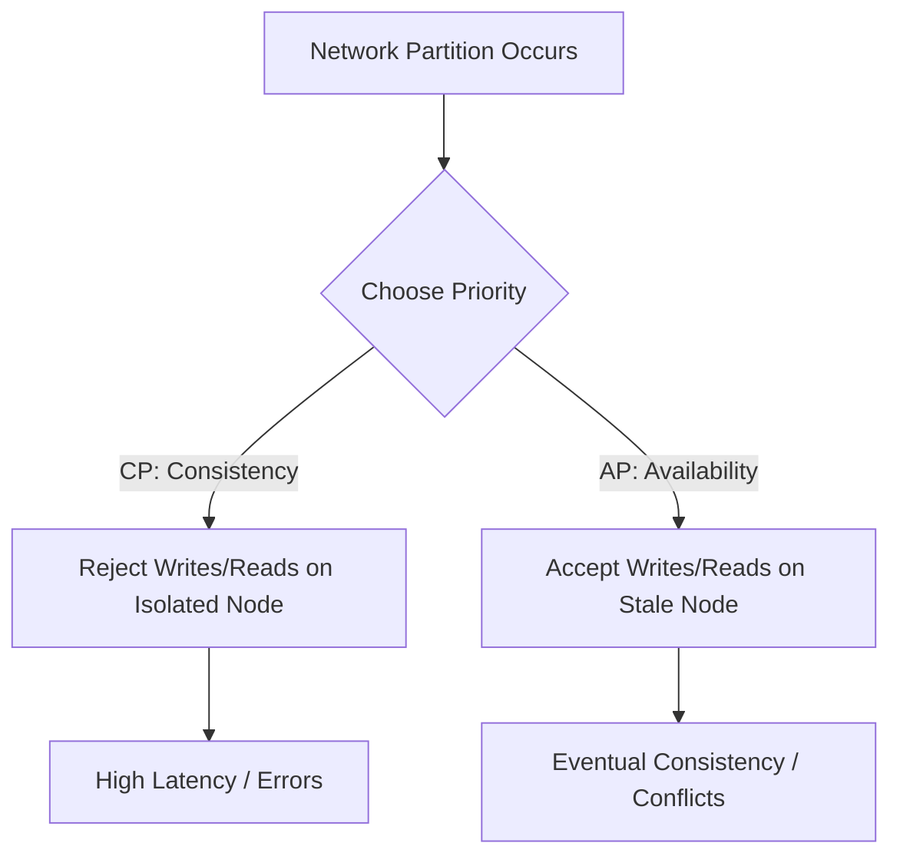
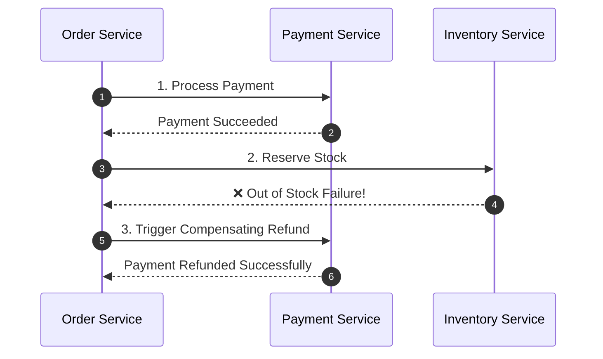

# 🌐 Distributed Systems Deep Dive (HLD Foundation)

> **🎯 Target Audience:** Staff & Principal Engineers
> **Focus:** Distributed Tradeoffs, Consistency Models, Partitioning, Distributed Locking, Consensus, and Transaction Patterns.
> **Existing Repo Tags:** 🔗 [See Database & Caching](file:///Users/atulkumarawasthi/projects/SystemDesign/Database&Caching/README.md) | 🔗 [See Architecture & Scaling](file:///Users/atulkumarawasthi/projects/SystemDesign/cheatsheets/Architecture_Scaling.md)

---

## ⚖️ 1. CAP & PACELC Theorems

### 📐 CAP Theorem

In a distributed system experiencing a network partition (**P**), you must choose between:

- **Consistency (C):** Every read receives the most recent write or an error.
- **Availability (A):** Every non-failing node returns a non-error response (without guarantee that it contains the most recent write).

> 💡 **Principal Insight:** Partition Tolerance (**P**) is non-negotiable in real networks. Hardware switches fail, cables drop. Thus, distributed design is always a choice between **CP** (e.g. HBase, ZooKeeper, Spanner) and **AP** (e.g. Cassandra, DynamoDB).



### 🧩 PACELC Extension

If there is a Partition (**P**), trade off Availability (**A**) vs Consistency (**C**); **E**lse (when system is running normally), trade off Latency (**L**) vs Consistency (**C**).

---

## 🧱 2. Sharding & Consistent Hashing

### ⭕ Consistent Hashing Ring

To add/remove database nodes without re-hashing all keys, map both keys and nodes onto a 32-bit hash ring ($0 \dots 2^{32}-1$).

```mermaid
graph TD
    NodeA[Node A (Virtual Tokens: A1, A2, A3)]
    NodeB[Node B (Virtual Tokens: B1, B2, B3)]
    NodeC[Node C (Virtual Tokens: C1, C2, C3)]

    Key1[User Key: "usr_1029"] -->|Hash Function| RingPos[Hash Position 0x7F2A]
    RingPos -->|Clockwise Search| NodeB
```

- **Virtual Nodes:** Assigning multiple hash points to a single physical server balances data distribution evenly and prevents **hot-spotting**.

---

## 🔄 3. Distributed Transactions: 2PC vs Saga Pattern

### ❌ Two-Phase Commit (2PC)

Requires a Central Coordinator to send `Prepare` and `Commit` messages to all databases.

- **Drawback:** Blocking protocol; holding locks across network round-trips destroys throughput at scale.

### ✅ Saga Pattern (Choreography vs Orchestration)

Decomposes a transaction into a sequence of local transactions. Each step updates its local DB and publishes an event; if a step fails, compensation events roll back previous steps.



---

## ❓ Collapsed Q&A Self-Testing Bank

<details>
<summary>❓ 1. Why is database sharding key selection the most critical decision in HLD?</summary>

**Answer:**
A bad shard key leads to **hotspotting** (e.g. sharding by `created_at` forces 100% of write traffic onto the current date's shard). A good shard key distributes read/write operations evenly across nodes and allows queries to be served from a single shard without expensive cross-shard scatter-gather joins.

</details>

<details>
<summary>❓ 2. How does CRDT (Conflict-free Replicated Data Type) achieve eventual consistency in collaborative applications?</summary>

**Answer:**
CRDTs are mathematically designed data structures (State-based LWW-Element-Set or Operation-based sequence algorithms like RGA) whose state merge operations are **Commutative**, **Associative**, and **Idempotent**. No matter the order or duplication of network packets, all clients deterministically converge to the exact same document state without requiring a central locking server.

</details>
