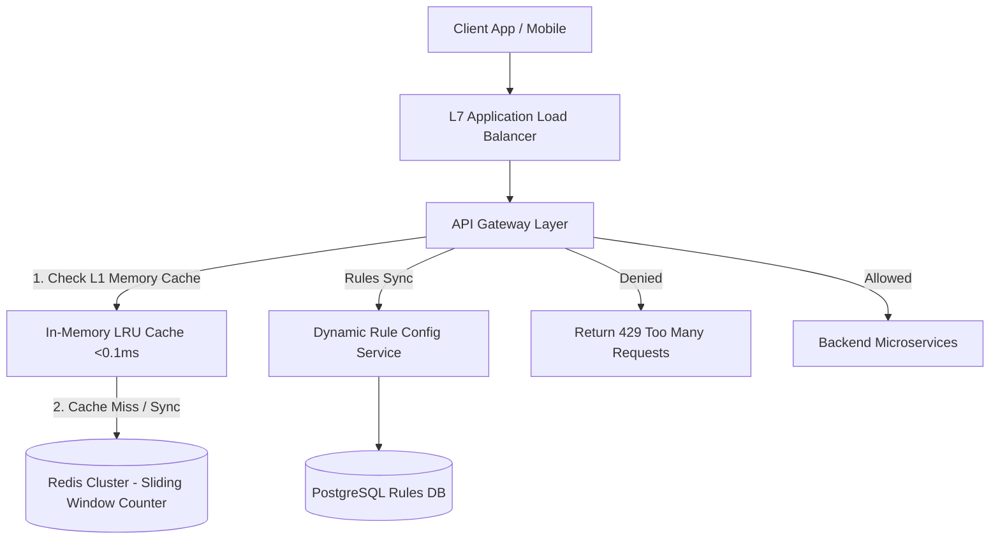
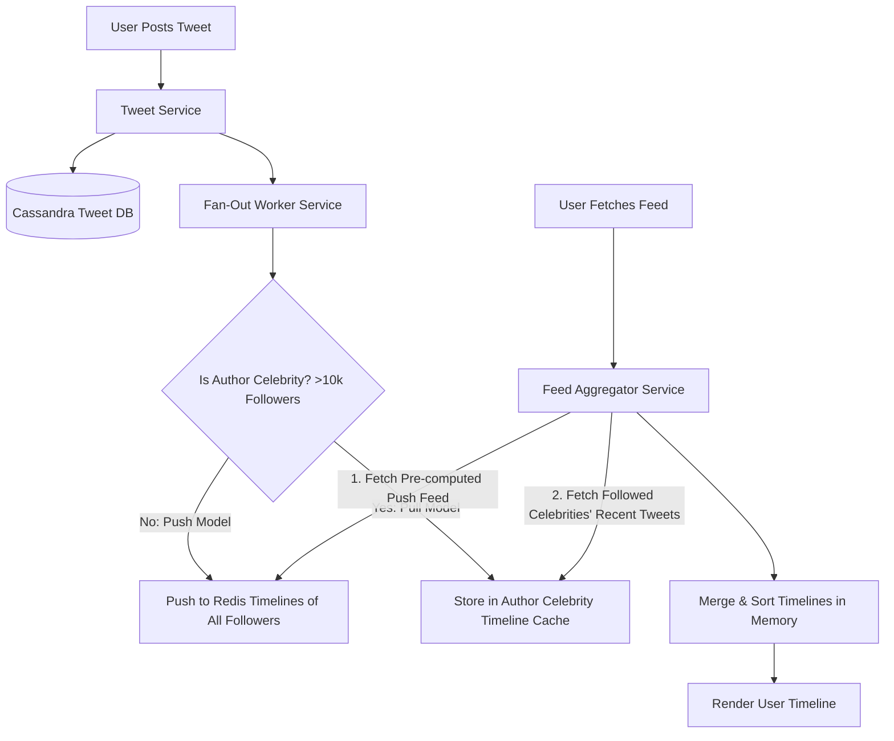
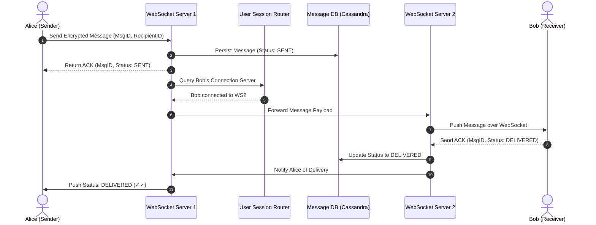

# 🏛️ Classic High-Level System Design Blueprints

> **🎯 Target Audience:** Staff & Principal Engineers
> **Focus:** Full System Architecture blueprints, DB Schema Design, Scalability Bottlenecks, and Principal-Level Grill Questions using the **FUN-SCALE Framework**.
> **Existing Repo Tags:** 🔗 [See Scalability Guide](file:///Users/atulkumarawasthi/projects/SystemDesign/Web/Scalability.md) | 🔗 [See Architecture Cheat Sheet](file:///Users/atulkumarawasthi/projects/SystemDesign/cheatsheets/Architecture_Scaling.md)

---

## 📌 Problem 1: Design a Distributed Rate Limiter Service

### 📋 1. Requirements Breakdown (FUN-SCALE Framework)

- **Functional Requirements (FR):**
  1. Intercept incoming requests at API Gateway and allow/deny based on IP or UserId limits (e.g. max 100 req/min).
  2. Return HTTP 429 `Too Many Requests` with standard headers (`Retry-After`, `X-RateLimit-Remaining`).
  3. Dynamic rule configuration per API endpoint and user tier.
- **Non-Functional Requirements (NFR):**
  1. **Sub-2ms Check Latency:** Limit evaluation must add negligible latency penalty.
  2. **High Availability (Fail-Open):** If rate limiter cluster goes down, allow traffic to downstream services rather than causing total outage.
  3. **Distributed Accuracy:** Synchronize limit counters across multi-region instances without race conditions.
- **Scale & Quantitative Estimation:**
  - 10 Billion daily requests = ~115,000 QPS (Peak QPS: 250,000).
  - 500 Million active users. Storing 64-byte Redis key per user = ~32GB RAM memory needed.

---

### 🎨 2. High-Level Architecture Diagram



---

### 💾 3. Database Schema & Data Models

#### Redis Key Schema (Sliding Window Counter)

```text
Key: "rate_limit:{user_id}:{endpoint}:{minute_epoch}"
Value: integer (counter)
TTL: 120 seconds
```

---

### 💻 4. Core Implementation: Lua Script for Atomic Sliding Window in Redis

```lua
-- KEYS[1]: User rate limit key, ARGV[1]: Current timestamp (ms), ARGV[2]: Window size (ms), ARGV[3]: Max limit
local key = KEYS[1]
local now = tonumber(ARGV[1])
local window = tonumber(ARGV[2])
local limit = tonumber(ARGV[3])
local clearBefore = now - window

-- Remove timestamps older than current window
redis.call('ZREMRANGEBYSCORE', key, 0, clearBefore)

-- Count current requests in window
local currentRequests = redis.call('ZCARD', key)

if currentRequests < limit then
  -- Add current request timestamp
  redis.call('ZADD', key, now, now)
  redis.call('EXPIRE', key, math.ceil(window / 1000))
  return 1 -- Allowed
else
  return 0 -- Denied (Rate Limited)
end
```

---

### ❓ Collapsed Grill Questions

<details>
<summary>❓ Grill 1: In a Distributed Rate Limiter, how do you handle Redis cluster failure?</summary>

**Answer:**
Apply a **Fail-Open** strategy. If the Rate Limiter service experiences a connection timeout or error when querying Redis, log a telemetry metric and allow the request through to downstream services. Blocking all legitimate user traffic because of a rate limiter infrastructure outage is worse than temporary degraded capacity.

</details>

---

## 📌 Problem 2: Design a Distributed Feed System (Twitter / Instagram)

### 📋 1. Requirements Breakdown (FUN-SCALE Framework)

- **Functional Requirements (FR):**
  1. Users post tweets/posts containing text, images, and videos.
  2. Users follow other accounts.
  3. Generate and view Home Timeline Feed (posts from followed accounts sorted by time).
- **Non-Functional Requirements (NFR):**
  1. **Low Latency Feed Generation:** Render timeline in $< 200\text{ms}$.
  2. **Support Celebrity Fan-Out:** Handle accounts with $100\text{M}+$ followers without write amplification explosion.
  3. **High Availability:** Read availability $99.99\%$.
- **Scale & Quantitative Estimation:**
  - 300M Daily Active Users. 500M tweets posted/day (~6,000 QPS write).
  - 2 Billion feed reads/day (~23,000 QPS read). Read-Heavy System (4:1 ratio).

---

### 🎨 2. High-Level Architecture Diagram (Hybrid Fan-Out)



---

### ❓ Collapsed Grill Questions

<details>
<summary>❓ Grill 1: Why use Cassandra over MySQL for storing raw tweets?</summary>

**Answer:**
Tweets are write-heavy, immutable append-only records queryable by `(user_id, tweet_id)`. Cassandra wide-column NoSQL provides linear write scaling ($O(1)$ LSM-tree sequential disk writes), zero single point of failure, and automatic sharding across nodes without expensive B-Tree index reorganizations required by SQL databases.

</details>

---

## 📌 Problem 3: Design WhatsApp / Real-Time Messaging System

### 📋 1. Requirements Breakdown (FUN-SCALE Framework)

- **Functional Requirements (FR):**
  1. One-on-one and group text messaging.
  2. Message status indicators: Sent (✓), Delivered (✓✓), Read (blue ✓✓).
  3. Push notifications for offline receivers.
- **Non-Functional Requirements (NFR):**
  1. **Sub-100ms Delivery Latency:** Instant real-time transmission when receiver is online.
  2. **Guaranteed Delivery:** At-least-once message delivery with client deduplication.
  3. **End-to-End Encryption (E2EE):** Server cannot read plaintext payload.

---

### 🎨 2. High-Level Sequence Diagram



---

### ❓ Collapsed Grill Questions

<details>
<summary>❓ Grill 1: How do you guarantee exact-once message delivery over unreliable networks?</summary>

**Answer:**
Exact-once delivery is achieved via **At-Least-Once Transmission + Idempotent Client Processing**:

1. Sender attaches a client-generated UUID `msg_id` to every message.
2. Receiver stores processed `msg_id` in local DB. If network drops ACK and server retries sending the same message, receiver detects duplicate `msg_id`, ignores UI insertion, and re-sends delivery ACK.
</details>
