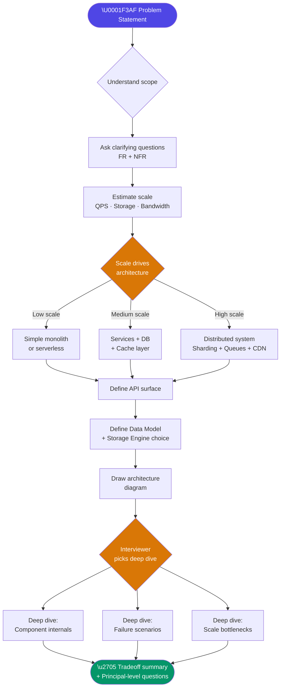

# 🏗️ High-Level Design (HLD) — Principal/Staff Architect Prep

> **Principal-level signal:** Senior engineers describe _what_ systems do. Staff engineers explain _why_ they're designed that way and _what breaks_ when the decisions were wrong. Every diagram you draw must be defensible under cross-examination.

---

## 📚 Table of Contents

- [What is High-Level Design?](#what-is-high-level-design)
- [HLD vs LLD — Not a Spectrum, a Different Lens](#hld-vs-lld--not-a-spectrum-a-different-lens)
- [What Interviewers Check at Staff/Principal Level](#what-interviewers-check-at-staffprincipal-level)
- [The 5-Step HLD Interview Framework](#the-5-step-hld-interview-framework)
- [HLD Problem-Solving Flow](#hld-problem-solving-flow)
- [Files in This Section](#files-in-this-section)
- [Q&A Self-Test](#qa-self-test)

---

## 🧠 What is High-Level Design?

High-Level Design is the process of decomposing a complex system into its major components, defining the **contracts between those components**, and establishing the **non-negotiable quality attributes** (availability, consistency, latency, throughput) the system must satisfy.

HLD answers three fundamental questions:

1. **What does this system do?** (bounded scope)
2. **How do the parts communicate and collaborate?** (interfaces, protocols, data flows)
3. **What tradeoffs were consciously accepted?** (CAP theorem position, cost vs latency, consistency vs availability)

### Why HLD is NOT "drawing boxes and arrows"

The most common failure mode in HLD interviews — even at senior level — is producing a diagram that looks complete but doesn't justify any decision. A genuine HLD must:

- **Justify every component's existence.** Why a message queue here and not a synchronous call? Why Cassandra and not Postgres?
- **Make tradeoffs explicit.** Every architectural decision trades one quality attribute for another. Naming the tradeoff is the signal.
- **Anticipate failure modes.** What happens when the cache goes down? What happens when the database shard is unavailable? What happens under 10× traffic?
- **Define SLOs before designing.** The architecture must flow from the SLOs, not the other way around. If you don't know whether the system needs 99.9% or 99.99% availability, you cannot choose the right replication strategy.

### HLD in the Real World

At staff and principal level, HLD happens in several real-world contexts:

| Context                  | Artifact                            | Audience                     |
| ------------------------ | ----------------------------------- | ---------------------------- |
| New product feature      | Architecture Decision Record (ADR)  | Engineering team             |
| Cross-team initiative    | RFC (Request for Comments)          | Multiple teams               |
| Infrastructure migration | Migration plan + risk register      | Eng + Ops + Leadership       |
| Incident post-mortem     | Root cause + redesign proposal      | Broader engineering org      |
| Interview                | Whiteboard diagram + verbal defense | Staff/Principal interviewers |

In each case, the expectation is identical: you must be able to **defend every decision under questioning**.

---

## ⚖️ HLD vs LLD — Not a Spectrum, a Different Lens

These are not points on a zoom slider. They are fundamentally different problem scopes.

| Dimension                  | High-Level Design                                                                | Low-Level Design                                                     |
| -------------------------- | -------------------------------------------------------------------------------- | -------------------------------------------------------------------- |
| **Scope**                  | System boundary, major subsystems                                                | A single service, module, or class                                   |
| **Primary question**       | _What components exist and how do they talk?_                                    | _How does this component actually work internally?_                  |
| **Primary artifact**       | Architecture diagram, data flow, API contract                                    | Class diagram, sequence diagram, pseudocode, DB schema               |
| **Key decisions**          | Tech stack choices, communication patterns, storage engines                      | Data structures, algorithm choice, class hierarchies                 |
| **Failure mode examples**  | "The message queue becomes a bottleneck"                                         | "The heap vs stack allocation choice causes OOM"                     |
| **Interview timescale**    | 45–60 min, 5–8 components                                                        | 30–45 min, 1–3 classes                                               |
| **Example question (HLD)** | Design Twitter's feed system for 500M users                                      | Design the data structures for a LRU cache                           |
| **Example question (LLD)** | Design a notification service architecture                                       | Design the `NotificationDispatcher` class with retry logic           |
| **Tech stack mentioned?**  | Yes, with justification                                                          | Rarely — focus is on abstractions                                    |
| **CAP/BASE/ACID?**         | Always                                                                           | Rarely                                                               |
| **Frontend analog**        | Application architecture: micro-frontends vs monolith, state management strategy | Component design: which hooks, state colocation, render optimization |

> **Principal-level signal:** A common trap is drifting into LLD during an HLD interview. When an interviewer says "design X," they want the 50,000-foot view first. Stop yourself from jumping to implementation details before the architecture is agreed upon.

### Example walkthrough of the boundary

**HLD answer to "Design a URL Shortener":**

> "We have a write service that generates short codes and stores them in a key-value store. A read service handles redirects and reads from a cache in front of the KV store. We separate writes from reads because read QPS will be ~100× higher than write QPS."

**LLD answer to the same (wrong level for HLD interview):**

> "The `ShortCodeGenerator` class uses a `Base62Encoder` that converts a `long` counter to a 6-character string using characters [a-z, A-Z, 0-9]."

The LLD detail is correct — but naming it at the start is a scope violation that signals you can't distinguish abstraction levels.

---

## 🎯 What Interviewers Check at Staff/Principal Level

### vs Senior Level — The Difference Is Measurable

| Category                      | Senior Engineer                  | Staff/Principal Engineer                                                       |
| ----------------------------- | -------------------------------- | ------------------------------------------------------------------------------ |
| **Requirements**              | Accepts the problem as stated    | Proactively challenges scope, identifies unstated assumptions                  |
| **Scale estimation**          | Calculates QPS and storage       | Also identifies _which_ estimates drive architecture decisions                 |
| **Architecture**              | Produces a working design        | Produces _multiple_ designs, explains why one was chosen                       |
| **Tradeoffs**                 | Names tradeoffs when asked       | Proactively surfaces tradeoffs before being asked                              |
| **Failure modes**             | Mentions "we add retries"        | Specifies retry policy, idempotency keys, dead-letter queues, circuit breakers |
| **Communication**             | Explains their design            | Drives the conversation, manages time, controls scope                          |
| **Depth**                     | Goes deep when pushed            | Chooses _where_ to go deep strategically                                       |
| **Cross-functional thinking** | Focuses on the technical problem | Considers ops burden, cost, team topology, migration path                      |

### Specific Signals Interviewers Look For

1. **Proactive clarification** — Before drawing anything, ask: _Who are the users? What's the read/write ratio? What's the SLA? Is this greenfield or migration?_

2. **Estimation that shapes decisions** — Don't estimate for the sake of it. Estimate to justify: "Given 10K writes/sec, a single Postgres instance won't sustain this. We need sharding."

3. **First-principles reasoning** — Don't say "we use Kafka because everyone uses Kafka." Say "we need guaranteed delivery + replay + fan-out to multiple consumers — Kafka fits this."

4. **Knowing when to stop** — At staff level, you can't deep-dive everything in 45 minutes. Explicitly say: "I'll focus the deep dive on the feed ranking component — that's the highest complexity/risk area. Want me to swap to the notification pipeline instead?"

5. **Acknowledging unknowns** — "I'm making an assumption here that read latency SLA is 200ms P99. If it's 50ms, we'd need to rethink the caching layer."

6. **Operability thinking** — Observability (metrics, traces, logs), deployment strategy, rollback plan. These aren't mentioned at senior level but are expected at staff.

---

## 🔢 The 5-Step HLD Interview Framework

This framework is not a checklist to rush through. It's a conversation protocol. The interviewer knows you're following a framework — what they're evaluating is the _quality of your thinking at each step_.

---

### Step 1: Clarify Requirements (FR + NFR)

**Time budget: 5–8 minutes**

Never start drawing until you have agreement on requirements. Requirement clarification is itself a signal.

#### Functional Requirements (FR)

These define what the system _does_. Ask:

- What are the core user-facing features? (CRUD, search, feed, stream?)
- What are out-of-scope features? (explicitly kill scope creep)
- Are there admin/ops features?

#### Non-Functional Requirements (NFR)

These define how well the system performs its function. Ask:

- **Scale:** How many users? DAU/MAU? Expected growth trajectory?
- **Latency:** What's the P99 latency SLA? Is it user-facing or backend?
- **Availability:** What's the uptime SLA? 99.9%, 99.99%, 99.999%?
- **Consistency:** Can users see slightly stale data? (eventual vs strong)
- **Durability:** Can we lose data? (message queue — at-most-once vs at-least-once vs exactly-once)
- **Geographic distribution:** Single region? Multi-region? Global?

```typescript
// Example mental model for requirements gathering
interface SystemRequirements {
  functional: {
    coreFeatures: string[]; // "create short URL, redirect"
    outOfScope: string[]; // "analytics dashboard, custom domains"
  };
  nonFunctional: {
    dau: number; // 100_000_000
    readWriteRatio: string; // "100:1"
    p99LatencySLA: string; // "50ms for reads"
    availabilitySLA: string; // "99.99%"
    consistencyModel: string; // "eventual — stale reads acceptable"
    durability: string; // "no data loss acceptable"
    geoDistribution: string; // "multi-region, US + EU + APAC"
  };
}
```

---

### Step 2: Estimate Scale

**Time budget: 5–7 minutes**

The purpose of estimation is **not** to get an exact number. It's to discover which resource is the bottleneck and let that drive architectural decisions.

#### QPS Estimation Pattern

```
DAU = 100M users
Average user performs 2 reads/day  → Read QPS  = (100M × 2)    / 86400 ≈  2,300 reads/sec
Peak = 3× average                  → Peak Read QPS             ≈  7,000/sec

Average user performs 0.01 writes/day → Write QPS = (100M × 0.01) / 86400 ≈ 11 writes/sec
Peak Write QPS                                                       ≈ 35/sec

Read:Write ratio ≈ 200:1 → This is a read-heavy system → cache heavily
```

#### Storage Estimation Pattern

```
Write rate: 11 writes/sec
Average payload: 500 bytes/write
Daily storage:   11 × 500 × 86400             ≈ 475 MB/day
Annual storage:                                 ≈ 170 GB/year
5-year storage:                                 ≈ 850 GB  → fits in one DB, but plan for sharding

With metadata and indices: multiply by 1.5    → ~1.3 TB in 5 years
With replication factor 3                     → ~4 TB total storage budget
```

#### Bandwidth Estimation Pattern

```
Peak read QPS: 7,000/sec
Average response: 1KB
Read bandwidth: 7,000 × 1KB = 7 MB/sec ≈ 56 Mbps → fine for a single CDN edge
```

> **Principal-level signal:** The numbers don't need to be exact. The signal is that you _use_ the numbers. "Given this read:write ratio of 200:1, a single database won't handle reads. We put a read replica tier or cache in front."

---

### Step 3: API Design

**Time budget: 5–7 minutes**

Define the external API surface. At this stage, define:

- HTTP method + endpoint
- Request payload (key fields only)
- Response payload (key fields only)
- Status codes for key scenarios
- Auth mechanism (JWT, API key, OAuth)

```typescript
// URL Shortener API Example

// POST /api/v1/urls
interface CreateShortUrlRequest {
  longUrl: string;
  customAlias?: string; // optional
  expiresAt?: string; // ISO 8601, optional
}
interface CreateShortUrlResponse {
  shortUrl: string; // "https://tny.io/abc123"
  shortCode: string; // "abc123"
  expiresAt?: string;
}

// GET /{shortCode}  → 302 redirect to longUrl
// Returns: Location header with longUrl, 302 status
// Error: 404 if not found, 410 if expired

// DELETE /api/v1/urls/{shortCode}
// Auth: Bearer token required, must be original creator
```

---

### Step 4: Data Model

**Time budget: 5–7 minutes**

Define the core entities and choose a storage engine. The choice must be **justified by the access patterns**, not by familiarity.

```typescript
// Core entity example
interface ShortUrl {
  shortCode: string; // PK — hash or base62 encoded counter
  longUrl: string; // indexed for reverse lookup
  createdBy: string; // userId
  createdAt: Date;
  expiresAt?: Date;
  clickCount: number; // denormalized for fast reads
}
```

| Storage Choice  | When to Choose                                         | Example System                      |
| --------------- | ------------------------------------------------------ | ----------------------------------- |
| PostgreSQL      | Relational data, ACID transactions, complex queries    | User accounts, financial records    |
| Cassandra       | High write throughput, time-series, wide column        | Activity logs, IoT telemetry        |
| DynamoDB        | Serverless, key-value or document, unpredictable scale | Shopping carts, sessions            |
| Redis           | Sub-millisecond access, cache, leaderboard, pub/sub    | Rate limiting, sessions, feed cache |
| Elasticsearch   | Full-text search, faceted search                       | Product catalog, log search         |
| S3 / Blob Store | Large objects, immutable files                         | Images, videos, event archives      |
| Neo4j           | Graph traversal, relationship-heavy queries            | Social graph, recommendation        |

---

### Step 5: Architecture Diagram → Deep Dive

**Time budget: 15–20 minutes**

Draw the architecture starting from the client request path (left to right or top to bottom). Then ask: "What are the 2–3 most complex/risky components?" Deep dive into those.

**Architecture drawing order:**

1. Client (browser, mobile, 3rd party)
2. Entry point (CDN, Load Balancer, API Gateway)
3. Service tier (stateless service instances)
4. Messaging layer (if async)
5. Storage tier (cache → primary DB → blob store)
6. Cross-cutting concerns (auth, monitoring, rate limiting)

---

---

## 📁 Files in This Module

| File                                                            | Description                                | Key Concepts                                          |
| --------------------------------------------------------------- | ------------------------------------------ | ----------------------------------------------------- |
| 📖 [01-Architecture-Patterns.md](./01-Architecture-Patterns.md) | Architecture patterns & service boundaries | Monolith vs Microservices, Event-Driven, BFF, DDD     |
| 📖 [02-Distributed-Systems.md](./02-Distributed-Systems.md)     | Core distributed systems theorems          | CAP, PACELC, Consistent Hashing, Saga, CRDT           |
| 📖 [11-Classic-Problems.md](./11-Classic-Problems.md)           | Full HLD Blueprints (FUN-SCALE)            | Rate Limiter, Twitter Feed System, WhatsApp Messaging |

---

## 🔄 HLD Problem-Solving Flow



---

## 📁 Files in This Section

| File                                                         | Topic                                                      | Complexity |
| ------------------------------------------------------------ | ---------------------------------------------------------- | ---------- |
| [01-Architecture-Patterns.md](./01-Architecture-Patterns.md) | Monolith, Microservices, EDA, BFF, Clean Architecture, DDD | ⭐⭐⭐⭐⭐ |
| [02-Distributed-Systems.md](./02-Distributed-Systems.md)     | CAP, BASE/ACID, Consistent Hashing, Saga, CRDT, Raft       | ⭐⭐⭐⭐⭐ |
| [03-Caching-Strategies.md](./03-Caching-Strategies.md)       | Cache-aside, write-through, eviction, CDN, Redis patterns  | ⭐⭐⭐⭐   |
| [04-Message-Queues.md](./04-Message-Queues.md)               | Kafka, RabbitMQ, delivery guarantees, consumer groups      | ⭐⭐⭐⭐   |
| [05-Databases-Deep-Dive.md](./05-Databases-Deep-Dive.md)     | SQL vs NoSQL, indexing, replication, sharding strategies   | ⭐⭐⭐⭐⭐ |
| [06-API-Design.md](./06-API-Design.md)                       | REST, GraphQL, gRPC, WebSocket, rate limiting              | ⭐⭐⭐⭐   |
| [07-CDN-and-Networking.md](./07-CDN-and-Networking.md)       | CDN, DNS, load balancing, TCP/UDP, HTTP/2 vs HTTP/3        | ⭐⭐⭐     |
| [08-Auth-and-Security.md](./08-Auth-and-Security.md)         | JWT, OAuth 2.0, OIDC, RBAC, API security                   | ⭐⭐⭐⭐   |
| [09-Observability.md](./09-Observability.md)                 | Metrics, traces, logs, alerting, SLOs/SLAs                 | ⭐⭐⭐⭐   |
| [10-Frontend-Architecture.md](./10-Frontend-Architecture.md) | Micro-frontends, SSR/CSR/ISR, PWA, performance             | ⭐⭐⭐⭐⭐ |
| [11-Classic-Problems.md](./11-Classic-Problems.md)           | URL shortener, rate limiter, notifications, feed, chat     | ⭐⭐⭐⭐⭐ |

---

## ❓ Q&A Self-Test

<details>
<summary>❓ What is the difference between an HLD interview at Senior level vs Staff/Principal level?</summary>

**Answer:**

The core difference is **initiative and depth of judgment**.

At Senior level, interviewers expect you to produce a correct, working design when guided by their questions. You demonstrate technical competence.

At Staff/Principal level, interviewers expect you to:

1. **Drive the conversation** — you set the agenda, manage scope, and decide what to deep dive
2. **Proactively surface tradeoffs** — you name the tradeoff before being asked "but what about X?"
3. **Challenge requirements** — you push back if the stated requirements are ambiguous or technically problematic
4. **Think cross-functionally** — you mention operational burden, cost, team ownership, migration path, and rollback strategy
5. **Acknowledge failure modes** — you describe what breaks and at what scale
6. **Make principled technology choices** — not "I know Kafka" but "Kafka fits because of guaranteed delivery + replay + fan-out"

The difference is between someone who answers questions well and someone who asks the right questions, provides the right depth of answer, and can defend every decision under cross-examination from a hostile peer who knows the subject deeply.

</details>

<details>
<summary>❓ Why should you estimate scale before drawing the architecture?</summary>

**Answer:**

Scale estimates determine _which_ architectural decisions are necessary. The architecture is not a template — it flows from the constraints.

Examples:

- **1,000 QPS** → A single Postgres instance with a connection pool is sufficient. No cache, no sharding needed.
- **100,000 QPS** → Postgres needs read replicas + Redis cache. Single service still fine.
- **1,000,000 QPS** → Requires horizontal sharding, CDN, multiple cache tiers, potentially a NoSQL store for hot paths.

If you draw a distributed, sharded, cached system for a 1,000 QPS use case, you've over-engineered — and that's a red flag at principal level, where you're expected to match complexity to need.

If you draw a single-server design for a 1M QPS use case, you've under-engineered — and the system will fail on day one.

The estimation is the _justification_ for every component you add. "We need a cache because peak read QPS of 50,000 exceeds what our DB can sustain with P99 < 50ms."

</details>

<details>
<summary>❓ What does a principal-level tradeoff statement sound like? Give an example.</summary>

**Answer:**

A senior-level tradeoff statement: _"We use eventual consistency because it's faster."_

A principal-level tradeoff statement: _"We're accepting eventual consistency on the feed because for this use case — social media timelines — a user seeing a post 2 seconds late is acceptable. The benefit is that our write path doesn't need distributed coordination, which would reduce write throughput by ~60% and increase P99 write latency to 200ms+. If we needed strong consistency here — for example, if this were a financial ledger — we'd need to use a distributed transaction protocol like 2PC or Saga, accepting that cost."_

The structure is:

1. Name the decision (eventual consistency)
2. State the condition under which it's acceptable (social media timeline, not financial ledger)
3. Quantify the benefit of making this choice (throughput, latency)
4. Name what you'd do differently if the condition changed (2PC/Saga for financial)

This shows you understand the tradeoff dimensionally, not as a preference.

</details>

<details>
<summary>❓ When is a monolith the right architecture choice, even at scale?</summary>

**Answer:**

A monolith is correct when:

1. **Team size is small** (< 8–10 engineers). Conway's Law: your architecture reflects your org structure. One team → one deployable unit.
2. **Bounded contexts are unclear** — you don't know where the domain boundaries are yet. Premature microservices create a distributed monolith (the worst of both worlds).
3. **Operational maturity is low** — microservices require distributed tracing, service mesh, container orchestration, independent CI/CD pipelines. A small team cannot maintain this.
4. **The domain is not partitionable by load** — if all services need the same data, network calls between microservices are slower than in-process function calls.
5. **Consistency requirements are high** — coordinating transactions across microservices requires Saga pattern, which is significantly more complex than a local database transaction.

Even at scale, a _modular monolith_ — a monolith with enforced domain boundaries, no cross-module direct DB access, and clean interfaces — is often the right interim step before extracting services. Companies like Stack Overflow serve millions of users on a small cluster of monolithic servers.

</details>

<details>
<summary>❓ What's the difference between functional and non-functional requirements, and why do NFRs often drive architecture more than FRs?</summary>

**Answer:**

**Functional requirements** define _what_ the system does: create a user, post a tweet, send a notification.

**Non-functional requirements (NFRs)** define _how well_ it does it: serve 1M reads/sec, 99.99% availability, P99 latency < 100ms, globally distributed, zero data loss.

NFRs drive architecture more than FRs because:

1. **Two systems with identical FRs can have radically different architectures** based on NFRs. A URL shortener serving 1K requests/day is a simple DB + API. The same system serving 10B requests/day requires CDN, consistent hashing, cache tiers, and geo-distributed deployments.

2. **NFRs create architectural constraints** that cascade: 99.99% availability (52 min downtime/year) requires multi-AZ deployment, which requires stateless services, which requires external session storage, which requires a Redis cluster.

3. **NFRs create contradictions you must resolve**: High consistency + High availability is impossible under network partitions (CAP theorem). Strong consistency + Low latency is hard in multi-region. You must decide which NFR wins.

4. **Missing an NFR late is expensive**: Building a system without geo-distribution baked in and then needing to add it later often requires a complete rewrite of the storage layer.

At principal level, you're expected to _extract_ NFRs from the problem even when they aren't stated. "You didn't mention geo-distribution, but if this is a global consumer product, we need to account for that..."

</details>

---

_Part of the [PrincipalPrep](../README.md) system design study repository._
