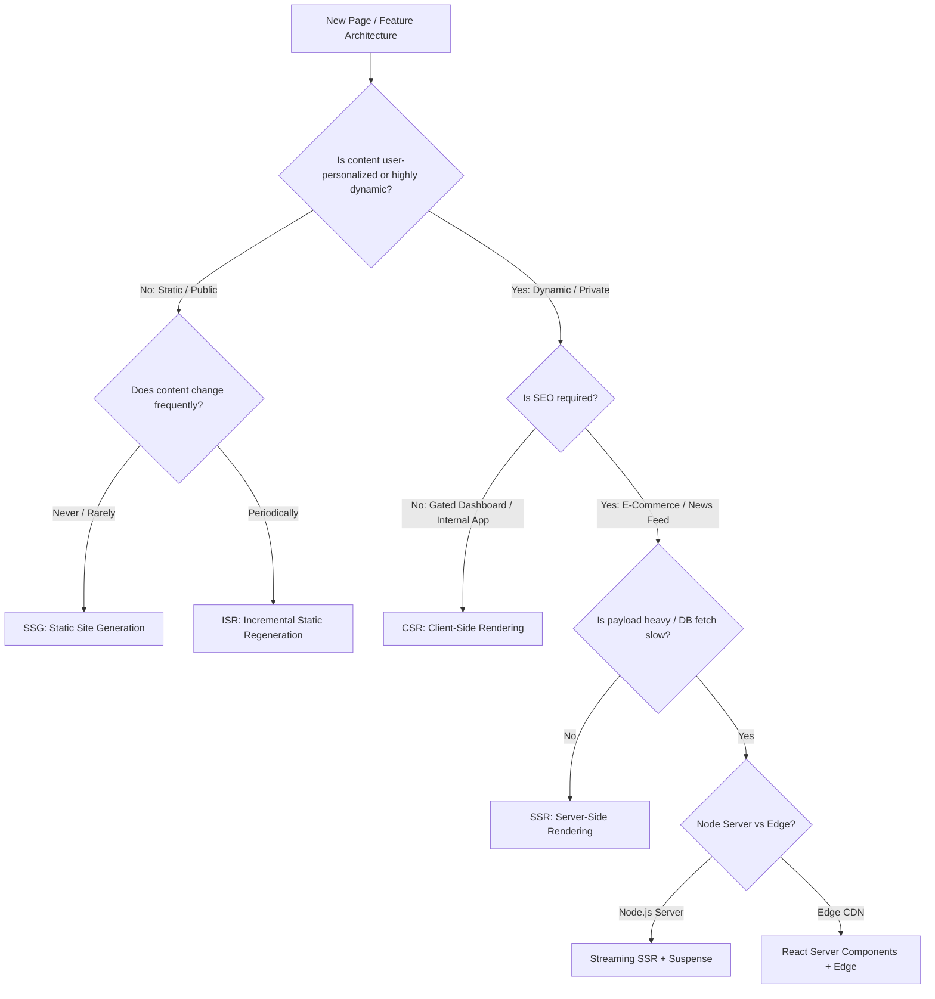
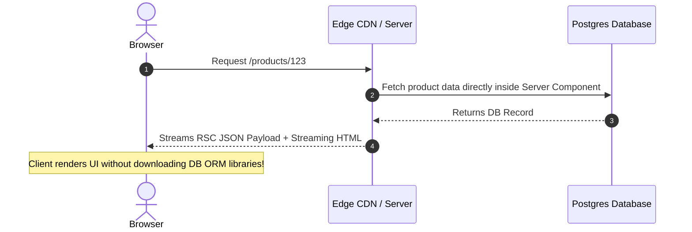

# 🖥️ Web Rendering Strategies Deep Dive (Frontend System Design)

> **🎯 Target Audience:** Staff & Principal Frontend Architects
> **Focus:** Architectural Tradeoffs across CSR, SSR, SSG, ISR, Streaming SSR, React Server Components (RSC), Edge Rendering, and Islands Architecture.
> **Existing Repo Tags:** 🔗 [See Rendering Patterns](file:///Users/atulkumarawasthi/projects/SystemDesign/Performance/Rendering/README.md) | 🔗 [See React Evolution](file:///Users/atulkumarawasthi/projects/SystemDesign/cheatsheets/evolutionReact.md)

---

## 🧭 1. Rendering Strategy Decision Tree

---

## 📊 2. Architectural Comparison Matrix

| Strategy          | TTFB                 | FCP / LCP | SEO          | Server Cost               | Interactivity Delay (Hydration)     | Ideal Use Case                        |
| :---------------- | :------------------- | :-------- | :----------- | :------------------------ | :---------------------------------- | :------------------------------------ |
| **CSR**           | ⚡ Fast (Static CDN) | 🐢 Slow   | ❌ Poor      | 💚 Zero Server            | None (Render JS directly)           | Authenticated dashboards, SaaS apps   |
| **SSR**           | 🐢 Slower (DB Fetch) | ⚡ Fast   | 🟢 Excellent | 🔴 High (Node execution)  | Hydration Blocking (Uncanny Valley) | E-commerce detail pages               |
| **SSG**           | ⚡ Fast (CDN)        | ⚡ Fast   | 🟢 Excellent | 💚 Zero Server            | Hydration required                  | Documentation, blogs                  |
| **ISR**           | ⚡ Fast (Cached CDN) | ⚡ Fast   | 🟢 Excellent | 🟡 Low (Background reval) | Hydration required                  | High-volume marketing, catalogs       |
| **Streaming SSR** | ⚡ Fast (Chunked)    | ⚡ Fast   | 🟢 Excellent | 🟡 Moderate               | Progressive Hydration               | Complex dynamic pages with slow DB    |
| **RSC**           | ⚡ Fast              | ⚡ Fast   | 🟢 Excellent | 🟡 Moderate               | ⚡ Zero Hydration for Server Comps  | Modern Next.js / Remix fullstack apps |

---

## ⚛️ 3. Deep Dive: React Server Components (RSC) vs SSR

### ⚠️ Misconception: "RSC is just SSR"

- **SSR:** Runs on server to turn React components into **HTML strings**. The client downloads the entire JS bundle anyway and performs **Hydration** to attach event listeners.
- **RSC:** Server components execute _only_ on the server and emit a compact **RSC Wire Format (JSON tree)**. Their JS code is **never shipped to the browser**, resulting in zero bundle impact for server dependencies.

---

## ❓ Collapsed Q&A Self-Testing Bank

❓ 1. What is the "Uncanny Valley" in traditional Server-Side Rendering (SSR)?

**Answer:**
The Uncanny Valley refers to the time window between **First Contentful Paint (FCP)** (when the browser renders static HTML sent by the server) and **Hydration Completion** (when event listeners attach). During this gap, the page looks complete and interactive, but user clicks/inputs are silently ignored or delayed, destroying user experience.

❓ 2. How does Islands Architecture (e.g. Astro) achieve zero-JS by default?

**Answer:**
Islands Architecture renders the entire page layout as static HTML. Interactive widgets ("islands", e.g. an interactive search bar or carousel) are embedded with isolated client-side JS bundles. Hydration is postponed and triggered only when the island becomes visible in the viewport (`client:visible`), leaving 90% of the page as pure HTML/CSS.

