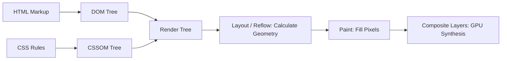

# 🌐 Browser Internals & Rendering Engine Deep Dive

> **🎯 Target Audience:** Staff & Principal Frontend Architects
> **Focus:** JS Event Loop Engine, Rendering Pipeline, Layout Thrashing, Memory Leaks & GC, Web Workers & Service Workers.
> **Existing Repo Tags:** 🔗 [See DOM Deep Dive](file:///Users/atulkumarawasthi/projects/SystemDesign/cheatsheets/DOM.md) | 🔗 [See CSSOM Deep Dive](file:///Users/atulkumarawasthi/projects/SystemDesign/cheatsheets/CSSOM.md)

---

## 🔄 1. JavaScript Event Loop Execution Order

```mermaid
flowchart TD
    CallStack[Call Stack (Synchronous Code Execution)] --> StackEmpty{Is Call Stack Empty?}

    StackEmpty -->|No| CallStack
    StackEmpty -->|Yes| MicroTaskQ{Check Microtask Queue: Promises, queueMicrotask, MutationObserver}

    MicroTaskQ -->|Process ALL Microtasks until empty| ExecuteMicro[Execute Microtask]
    ExecuteMicro --> MicroTaskQ

    MicroTaskQ -->|Queue Empty| RenderCheck{Is Render Opportunity Due? ~16.6ms / 60fps}
    RenderCheck -->|Yes| RenderStep[Animation Frame Callbacks -> Style -> Layout -> Paint]

    RenderStep --> MacroTaskQ[Check Macrotask Queue: setTimeout, setInterval, I/O]
    RenderCheck -->|No| MacroTaskQ

    MacroTaskQ -->|Execute ONE Macrotask| CallStack
```

---

## 📐 2. Browser Rendering Engine Pipeline



### 🚨 Layout Thrashing (Forced Synchronous Layout)

Occurs when JS repeatedly reads geometry properties (`element.offsetHeight`, `getBoundingClientRect()`) immediately after writing styles (`element.style.width = ...`), forcing the browser to recalculate layout synchronously inside a loop.

```typescript
// ❌ BAD: Layout Thrashing ($O(N)$ forced reflows inside loop)
function badResizeBoxes(boxes: HTMLElement[]) {
  for (let i = 0; i < boxes.length; i++) {
    // Reading offsetWidth forces layout calculation BEFORE writing width
    const newWidth = boxes[i].offsetWidth + 10;
    boxes[i].style.width = `${newWidth}px`;
  }
}

// ✅ GOOD (Principal Standard): Batch reads first, then batch writes
function goodResizeBoxes(boxes: HTMLElement[]) {
  // Phase 1: Read all dimensions
  const widths = boxes.map((box) => box.offsetWidth + 10);

  // Phase 2: Write all styles (single reflow pass)
  boxes.forEach((box, i) => {
    box.style.width = `${widths[i]}px`;
  });
}
```

---

## ❓ Collapsed Q&A Self-Testing Bank

<details>
<summary>❓ 1. What is the output order of this code snippet?</summary>

```javascript
console.log('1');
setTimeout(() => console.log('2'), 0);
Promise.resolve().then(() => console.log('3'));
queueMicrotask(() => console.log('4'));
console.log('5');
```

**Answer:**
Output: `1, 5, 3, 4, 2`

1. `1` and `5` execute synchronously on the call stack.
2. `3` (Promise handler) and `4` (queueMicrotask) enter the **Microtask Queue**.
3. Microtask queue drains completely before the event loop processes macrotasks, printing `3` then `4`.
4. `2` (setTimeout callback) enters the **Macrotask Queue** and executes last.
</details>

<details>
<summary>❓ 2. How do detached DOM nodes create memory leaks in single-page applications?</summary>

**Answer:**
A detached DOM node is an element that has been removed from the DOM tree (`element.remove()`), but is still referenced by JavaScript code (e.g. stored inside a global variable, event listener closure, or array). Because the JS garbage collector traces live references, the detached element (and its entire sub-tree) cannot be freed from memory.

</details>
