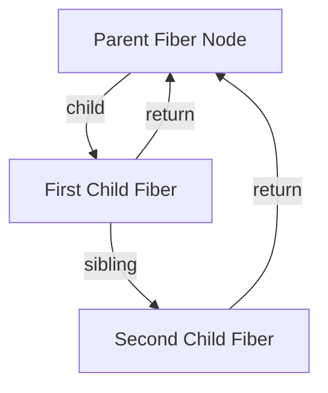
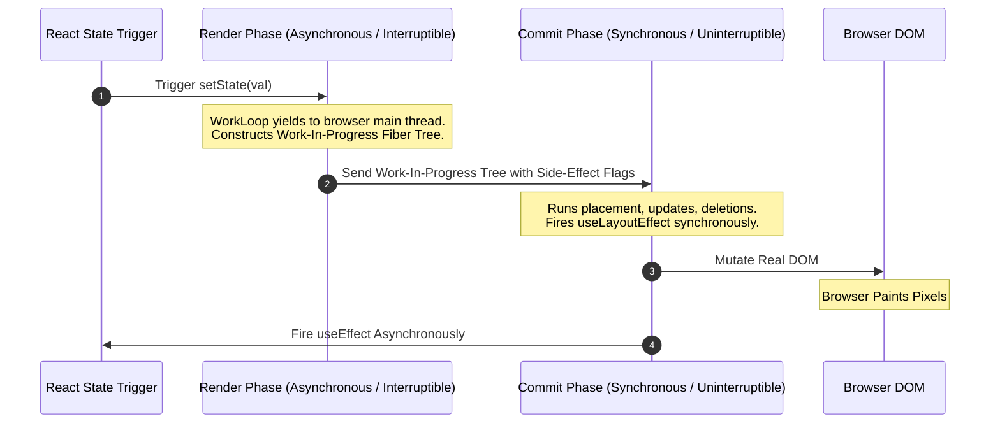

# ⚛️ React Engine Architecture & Fiber Internals

> **🎯 Target Audience:** Staff & Principal Frontend Architects
> **Focus:** React Fiber Reconciliation, 32-Bit Lanes Priority Bitmask, Concurrent Features, State Tearing, `useSyncExternalStore`, and React 19 Compiler.
> **Existing Repo Tags:** 🔗 [See React Internals Deep Dive](file:///Users/atulkumarawasthi/projects/SystemDesign/Questions/Detailed/ReactInternals/React_Deep_Dive_Internals.md) | 🔗 [See Advanced React Concurrency](file:///Users/atulkumarawasthi/projects/SystemDesign/Questions/Detailed/ReactInternals/React_Deep_Dive_Advanced.md) | 🔗 [See React Cheat Sheet](file:///Users/atulkumarawasthi/projects/SystemDesign/Questions/Detailed/ReactInternals/React_Deep_Dive_Cheat_Sheet.md)

---

## 🔬 1. React Fiber Architecture (Stack Reconciler vs Fiber)

Prior to React 16, React used a recursive synchronous **Stack Reconciler**. Once rendering started, it could not be interrupted, causing frame drops during large UI updates.

### 🧬 The Fiber Node Structure

React Fiber converted reconciliation into a **singly-linked list tree structure** where work can be paused, aborted, or prioritized across frames.



```typescript
interface FiberNode {
  tag: WorkTag; // Type of component (FunctionComponent, ClassComponent, HostComponent)
  key: null | string;
  elementType: any;
  stateNode: any; // Reference to actual DOM node or class instance
  return: FiberNode | null; // Pointer to parent Fiber
  child: FiberNode | null; // Pointer to first child
  sibling: FiberNode | null; // Pointer to next sibling
  memoizedState: any; // Linked list of Hooks state
  lanes: Lanes; // 32-bit priority bitmask
}
```

---

## ⏱️ 2. The 2-Phase Rendering Pipeline



---

## ⚡ 3. Solving UI State Tearing with `useSyncExternalStore`

When external state stores (Zustand, Redux, RxJS) update during a concurrent render interrupt, different parts of the UI tree could read different versions of state (**State Tearing**).

```typescript
import { useSyncExternalStore } from 'react';

// Custom external store subscription
export function useExternalStore<T>(subscribe: (callback: () => void) => () => void, getSnapshot: () => T): T {
  // Guarantees atomic, tearing-free reads across concurrent renders
  return useSyncExternalStore(subscribe, getSnapshot);
}
```

---

## ❓ Collapsed Q&A Self-Testing Bank

<details>
<summary>❓ 1. What is the difference between `useLayoutEffect` and `useEffect` execution timing?</summary>

**Answer:**

- **`useLayoutEffect`:** Runs synchronously during the **Commit Phase**, _after_ DOM mutations but _before_ the browser physically paints pixels to the screen. Use this to measure layout geometry or mutate DOM styles to prevent visual flicker.
- **`useEffect`:** Runs asynchronously _after_ the browser has completed painting. Use this for data fetching, event subscriptions, and non-blocking side effects.
</details>

<details>
<summary>❓ 2. How does React 18 Concurrent rendering prioritize user input over background list filtering?</summary>

**Answer:**
React uses a 32-bit **Lanes Priority Bitmask**. Discrete user inputs (clicks, keypresses) assign high-priority `SyncLane` or `InputContinuousLane` to update queues. Wrapping non-urgent state updates inside `startTransition(() => setState(...))` assigns low-priority `TransitionLane`. If a high-priority input arrives while React is processing a transition, React discards the unfinished work-in-progress Fiber tree, handles the user click immediately, and then restarts the transition render in the background.

</details>
