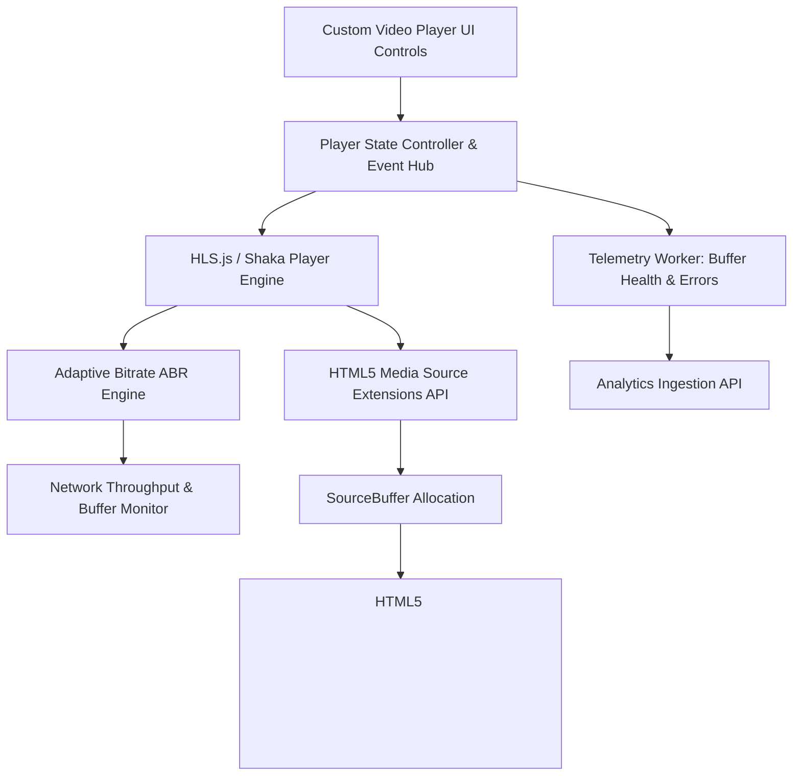
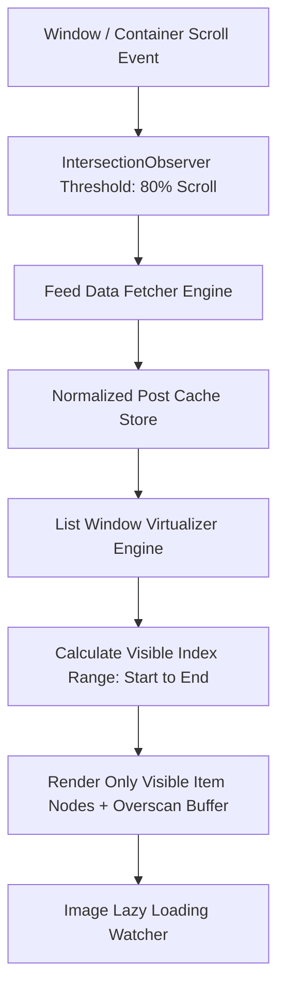
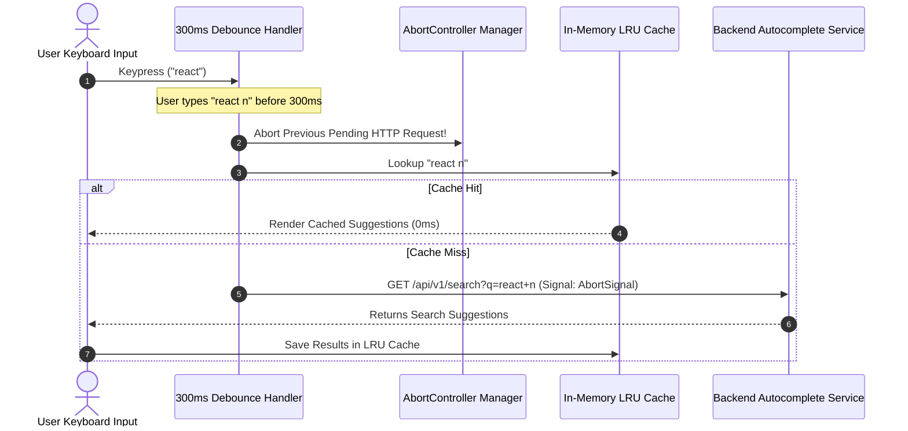

# 🖼️ Classic Frontend System Design Blueprints

> **🎯 Target Audience:** Staff & Principal Frontend Architects
> **Focus:** Full end-to-end Frontend System Designs using the **FUN-SCALE Framework**: Functional Requirements, Non-Functional Requirements, Scale Estimates, Mermaid Diagrams, State Schemas, TS Code, Scaling Bottlenecks, and Grill Q&A.
> **Existing Repo Tags:** 🔗 [See Micro Frontends](file:///Users/atulkumarawasthi/projects/SystemDesign/Web/MicroFrontends.md) | 🔗 [See State Management](file:///Users/atulkumarawasthi/projects/SystemDesign/cheatsheets/state-management.md)

---

## 📹 Problem 1: Design YouTube Video Streaming & Custom Player (Frontend)

### 📋 1. Requirements Breakdown (FUN-SCALE Framework)

- **Functional Requirements (FR):**
  1. Play HD/4K videos with custom UI controls (Play/Pause, Seek bar, Volume, Fullscreen, Playback Rate).
  2. Dynamic Adaptive Bitrate Streaming (ABR): auto-adjust resolution (360p to 4K) based on client network bandwidth.
  3. Video Telemetry & Quality Audit: track buffer health, dropped frames, and playback errors.
  4. Theater mode & picture-in-picture (PiP) support.
- **Non-Functional Requirements (NFR):**
  1. **Sub-1s Initial Playback Latency:** Time to First Frame (TTFF) < 1000ms.
  2. **Zero Stalling / Buffering Drops:** Re-buffering ratio < 0.5% of total watch duration.
  3. **Low Memory Footprint:** Max buffer allocation < 150MB in browser RAM.
- **Scale & Quantitative Estimation:**
  - 1 Billion Daily Active Watchers.
  - Video split into 2-second `.m4s` chunks (~1.5MB per chunk at 1080p 60fps).

---

### 🎨 2. High-Level Frontend Architecture



---

### 💾 3. Data Schema / State Contract

```typescript
export interface PlaybackState {
  videoId: string;
  currentTime: number;
  duration: number;
  bufferedRanges: Array<{ start: number; end: number }>;
  currentQuality: '360p' | '720p' | '1080p' | '4K' | 'auto';
  autoQuality: boolean;
  isPlaying: boolean;
  isMuted: boolean;
  volume: number; // 0.0 to 1.0
  playbackRate: number; // 0.5 to 2.0
}
```

---

### 💻 4. Core Implementation: HTML5 Media Source Extensions (MSE) Buffer Feeder

```typescript
export class MSEVideoPlayer {
  private mediaSource: MediaSource;
  private sourceBuffer: SourceBuffer | null = null;
  private videoElement: HTMLVideoElement;
  private queue: ArrayBuffer[] = [];

  constructor(videoElement: HTMLVideoElement) {
    this.videoElement = videoElement;
    this.mediaSource = new MediaSource();
    this.videoElement.src = URL.createObjectURL(this.mediaSource);

    this.mediaSource.addEventListener('sourceopen', () => {
      // Create SourceBuffer for ISO BMFF MP4 segments
      this.sourceBuffer = this.mediaSource.addSourceBuffer('video/mp4; codecs="avc1.42E01E, mp4a.40.2"');
      this.sourceBuffer.addEventListener('updateend', () => this.processQueue());
    });
  }

  // Append 2-second video segment array buffer into HTML5 video player
  appendSegment(chunk: ArrayBuffer) {
    this.queue.push(chunk);
    this.processQueue();
  }

  private processQueue() {
    if (this.sourceBuffer && !this.sourceBuffer.updating && this.queue.length > 0) {
      const nextChunk = this.queue.shift()!;
      this.sourceBuffer.appendBuffer(nextChunk);
    }
  }
}
```

---

### ⚡ 5. Tradeoffs & Bottlenecks at Scale

- **Memory Exhaustion:** Storing too many 4K video segments in `SourceBuffer` will crash mobile browser tabs. **Fix:** Periodically prune played video ranges behind current timestamp (`sourceBuffer.remove(0, currentTime - 30)`).
- **ABR Oscillation:** Rapidly switching between 720p and 4K causes CPU spikes. **Fix:** Use hysteresis threshold (wait 5 consecutive seconds of high bandwidth before upgrading resolution).

---

### ❓ Collapsed Grill Questions

<details>
<summary>❓ Grill 1: How does Adaptive Bitrate (ABR) algorithm decide when to drop quality from 1080p to 480p?</summary>

**Answer:**
ABR monitors **Buffer Occupancy (headroom)** and **Measured Download Throughput**. If current buffer headroom falls below 5 seconds of playback and recent chunk download time exceeds segment duration (2s chunk took > 2s to fetch), ABR immediately steps down quality to 480p to prevent playback stalling.

</details>

---

## 📜 Problem 2: Design Infinite Scroll Feed (Instagram / Twitter FE)

### 📋 1. Requirements Breakdown (FUN-SCALE Framework)

- **Functional Requirements (FR):**
  1. Render dynamic user post cards (images, text, video previews, action buttons).
  2. Infinite scroll pagination: automatically fetch next batch of posts when user scrolls near page bottom.
  3. Support optimistic likes, comments, and post deletion.
- **Non-Functional Requirements (NFR):**
  1. **60 FPS Smooth Scrolling:** Zero jank or frame drops during fast touch fling gestures.
  2. **Constant Memory Footprint:** Max DOM node count strictly capped at $< 100$ nodes regardless of scroll depth (Virtualization).
  3. **Zero Layout Shifts (CLS < 0.1):** Reserve fixed aspect ratio placeholders before images load.
- **Scale & Quantitative Estimation:**
  - Users scroll through 500+ feed items per session.
  - Un-virtualized feed with 500 items = 15,000 DOM nodes = 1.2GB browser RAM memory leak.

---

### 🎨 2. High-Level Frontend Architecture



---

### 💻 3. Core Implementation: Windowing / Virtualized List Component

```typescript
export interface VirtualListProps<T> {
  items: T[];
  itemHeight: number;
  viewportHeight: number;
  scrollTop: number;
  renderItem: (item: T, index: number) => React.ReactNode;
}

export function VirtualizedFeed<T>({
  items,
  itemHeight,
  viewportHeight,
  scrollTop,
  renderItem,
}: VirtualListProps<T>) {
  const totalHeight = items.length * itemHeight;
  const startIndex = Math.max(0, Math.floor(scrollTop / itemHeight) - 2); // 2 items overscan above
  const endIndex = Math.min(items.length - 1, Math.ceil((scrollTop + viewportHeight) / itemHeight) + 2); // 2 items overscan below

  const visibleItems = [];
  for (let i = startIndex; i <= endIndex; i++) {
    visibleItems.push({
      item: items[i],
      index: i,
      offsetTop: i * itemHeight,
    });
  }

  return (
    <div style={{ height: `${totalHeight}px`, position: 'relative', width: '100%' }}>
      {visibleItems.map(({ item, index, offsetTop }) => (
        <div
          key={index}
          style={{
            position: 'absolute',
            top: 0,
            transform: `translateY(${offsetTop}px)`,
            height: `${itemHeight}px`,
            width: '100%',
          }}
        >
          {renderItem(item, index)}
        </div>
      ))}
    </div>
  );
}
```

---

### ❓ Collapsed Grill Questions

<details>
<summary>❓ Grill 1: How do you handle variable-height feed cards (e.g. text post vs image post) in virtualized lists?</summary>

**Answer:**
Maintain a dynamic **Height Map / Measurement Cache**.

1. Use default estimated height ($300\text{px}$) for unmeasured items.
2. Once an item mounts into the DOM, use `ResizeObserver` to measure its actual rendered height (`element.getBoundingClientRect().height`) and update the height map array.
3. Recalculate prefix sums for offset positions to ensure smooth scrolling without layout jumps.
</details>

---

## 🔍 Problem 3: Design Search Autocomplete / Typeahead Component

### 📋 1. Requirements Breakdown (FUN-SCALE Framework)

- **Functional Requirements (FR):**
  1. Instant dropdown search suggestions as user types in search bar.
  2. Keyboard navigation (Up/Down arrow keys, Enter to select, Escape to close).
  3. Highlight matching query substring in suggestion items.
- **Non-Functional Requirements (NFR):**
  1. **Sub-100ms Search Response:** Network requests debounced by 300ms.
  2. **Race Condition Immunity:** Out-of-order network responses must never overwrite newer search queries.
  3. **Full ARIA Accessibility:** Screen-reader friendly using WAI-ARIA Combobox pattern.

---

### 🎨 2. High-Level Sequence Diagram



---

### 💻 3. Core Implementation: Race-Condition Safe Fetch Hook

```typescript
import { useState, useEffect, useRef } from 'react';

export function useAutocompleteSearch(query: string, delay = 300) {
  const [results, setResults] = useState<string[]>([]);
  const [loading, setLoading] = useState(false);
  const abortControllerRef = useRef<AbortController | null>(null);

  useEffect(() => {
    if (!query.trim()) {
      setResults([]);
      return;
    }

    const timer = setTimeout(async () => {
      // Abort active pending request if user typed a new character
      if (abortControllerRef.current) {
        abortControllerRef.current.abort();
      }

      abortControllerRef.current = new AbortController();
      setLoading(true);

      try {
        const res = await fetch(`/api/v1/autocomplete?q=${encodeURIComponent(query)}`, {
          signal: abortControllerRef.current.signal,
        });
        const data = await res.json();
        setResults(data.suggestions || []);
      } catch (err: any) {
        if (err.name !== 'AbortError') {
          console.error('Search request failed', err);
        }
      } finally {
        setLoading(false);
      }
    }, delay);

    return () => clearTimeout(timer);
  }, [query, delay]);

  return { results, loading };
}
```

---

### ❓ Collapsed Grill Questions

<details>
<summary>❓ Grill 1: How do you make an Autocomplete search bar accessible according to WAI-ARIA standards?</summary>

**Answer:**

1. Input element: `role="combobox"`, `aria-autocomplete="list"`, `aria-expanded="true/false"`, and `aria-controls="suggestion-list-id"`.
2. Active dropdown list: `role="listbox"`, `id="suggestion-list-id"`.
3. Highlighted item: `role="option"`, `aria-selected="true"`.
4. Link active item ID to input using `aria-activedescendant="option-item-id"` so screen readers announce active options as user navigates with Up/Down arrow keys.
</details>
