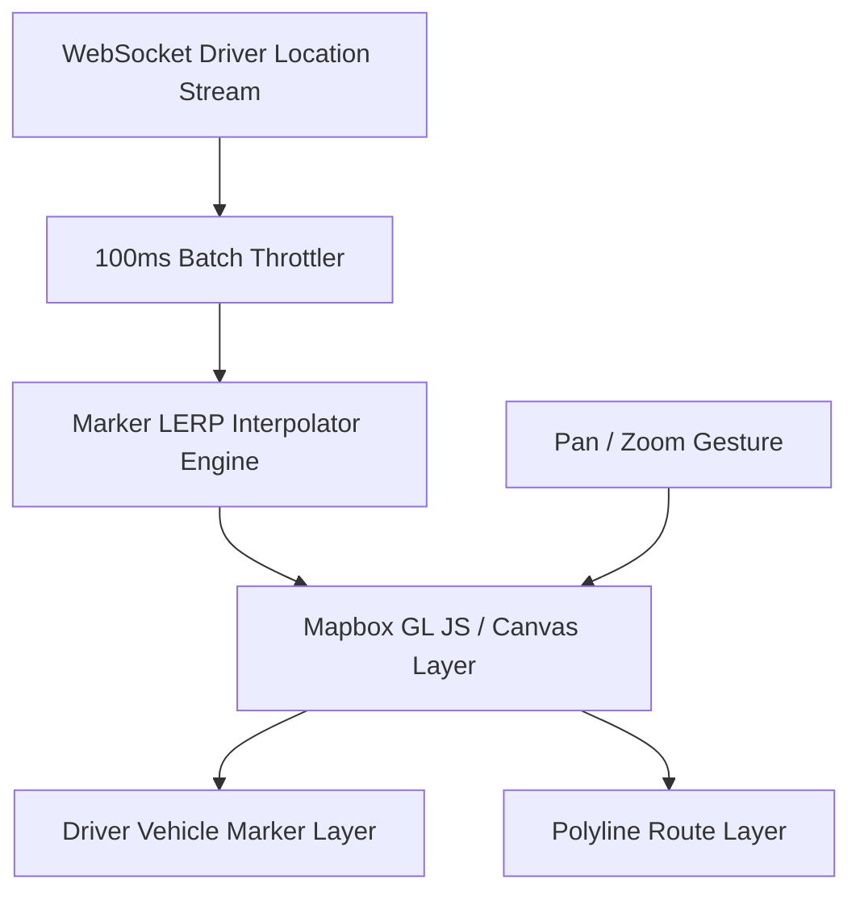
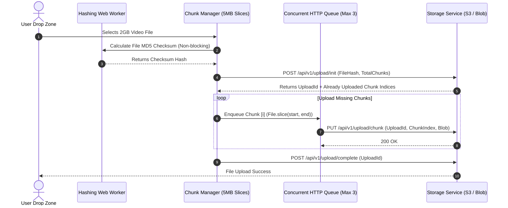
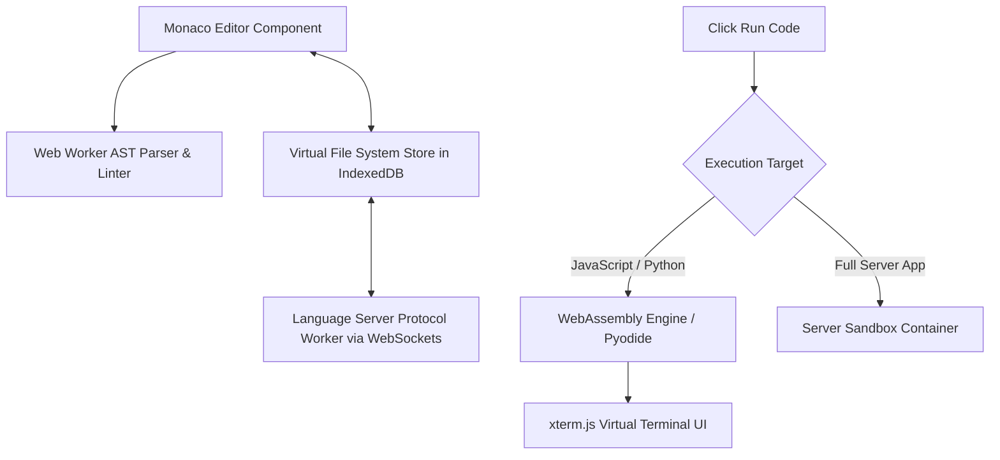

# 🎨 Frontend System Design Master Catalog & Interview Classification

> **🎯 Target Audience:** Staff & Principal Frontend Architects
> **Purpose:** Exhaustive classification and Frontend Architecture Blueprints for all classic system design prompts — separating High-ROI Frontend prompts from Backend infrastructure prompts.
> **Existing Repo Tags:** 🔗 [See FE Classic Designs](file:///Users/atulkumarawasthi/projects/SystemDesign/PrincipalPrep/03-Frontend-SD/10-Frontend-Classic.md) | 🔗 [See Hot Practice Bank](file:///Users/atulkumarawasthi/projects/SystemDesign/PrincipalPrep/03-Frontend-SD/HOT-FE-INTERVIEW-PRACTICE.md)

---

## 📊 1. Master Classification Matrix (16 Prompts + Missing Candidates)

When asked to design a system in a **Frontend Architecture Interview**, your primary focus shifts from backend databases and load balancers to **browser performance, DOM rendering, network efficiency, state management, and real-time UX**.

| System Prompt                                         |   FE Focus / ROI   | Key Frontend Architectural Challenges                                                            | Primary FE Modules                                                                                                                               |
| :---------------------------------------------------- | :----------------: | :----------------------------------------------------------------------------------------------- | :----------------------------------------------------------------------------------------------------------------------------------------------- |
| **1. Design YouTube**                                 | 🔥🔥🔥 **100% FE** | Video Player Engine, Adaptive Bitrate Streaming (HLS/DASH), MSE API, Telemetry Buffer            | [`10-Frontend-Classic.md`](file:///Users/atulkumarawasthi/projects/SystemDesign/PrincipalPrep/03-Frontend-SD/10-Frontend-Classic.md)             |
| **2. Design Collaborative Whiteboard (Figma)**        | 🔥🔥🔥 **100% FE** | Canvas 2D/WebGL, Spatial R-Tree Indexing, Viewport Culling, LERP Cursors, CRDT                   | [`HOT-FE-INTERVIEW-PRACTICE.md`](file:///Users/atulkumarawasthi/projects/SystemDesign/PrincipalPrep/03-Frontend-SD/HOT-FE-INTERVIEW-PRACTICE.md) |
| **3. Design Google Docs**                             | 🔥🔥🔥 **100% FE** | Slate.js / Lexical Editor Engine, Virtualized Document Pages, OT vs CRDT, Undo Stack             | [`10-Frontend-Classic.md`](file:///Users/atulkumarawasthi/projects/SystemDesign/PrincipalPrep/03-Frontend-SD/10-Frontend-Classic.md)             |
| **4. Design Online Code Editor (VS Code Web)**        | 🔥🔥🔥 **100% FE** | Monaco Editor, AST Highlighting, IndexedDB Virtual Filesystem, Web Worker LSP, WebAssembly       | **Blueprint Below ⬇️**                                                                                                                           |
| **5. Design Uber (Live Driver Map)**                  | 🔥🔥🔥 **100% FE** | Canvas Map SDK (Mapbox), WebSocket Location Stream, Marker LERP Animation, Geofencing UI         | **Blueprint Below ⬇️**                                                                                                                           |
| **6. Design Dropbox (Large File Upload)**             | 🔥🔥🔥 **100% FE** | Resumable Chunked Uploads (`File.slice()`), Web Worker MD5 Hash, Concurrent Queue, Drag & Drop   | **Blueprint Below ⬇️**                                                                                                                           |
| **7. Design WhatsApp / Chat UI**                      | 🔥🔥🔥 **100% FE** | WebSocket Manager, Exponential Backoff Jitter, Virtualized Message List, Media Upload            | **Blueprint Below ⬇️**                                                                                                                           |
| **8. Design Notification Toast Center**               | 🔥🔥🔥 **100% FE** | SSE/WS Event Queue, Global Toast Manager, Priority Queue, Auto-dismiss Timers, ARIA Live         | **Blueprint Below ⬇️**                                                                                                                           |
| **9. Design Instagram / Feed System**                 |  🔥🔥 **80% FE**   | Infinite Scroll Virtualization (`react-window`), Image Optimization (`srcset`), Optimistic Likes | [`10-Frontend-Classic.md`](file:///Users/atulkumarawasthi/projects/SystemDesign/PrincipalPrep/03-Frontend-SD/10-Frontend-Classic.md)             |
| **10. Design Search Autocomplete**                    |  🔥🔥 **80% FE**   | Debounce/Throttle, AbortController cancelation, In-Memory LRU Cache, ARIA Keyboard Nav           | [`10-Frontend-Classic.md`](file:///Users/atulkumarawasthi/projects/SystemDesign/PrincipalPrep/03-Frontend-SD/10-Frontend-Classic.md)             |
| **11. Design Design System & UI Library** _(Missing)_ | 🔥🔥🔥 **100% FE** | Zero-runtime CSS, Compound Components, Tokens System, Tree-Shaking, Accessibility (A11y)         | **Blueprint Below ⬇️**                                                                                                                           |
| **12. Design Micro Frontend Platform** _(Missing)_    | 🔥🔥🔥 **100% FE** | Webpack Module Federation, Dynamic Remote Loader, Shared Singletons, Shadow DOM                  | [`HOT-FE-INTERVIEW-PRACTICE.md`](file:///Users/atulkumarawasthi/projects/SystemDesign/PrincipalPrep/03-Frontend-SD/HOT-FE-INTERVIEW-PRACTICE.md) |
| **13. Design Rate Limiter**                           |   🟡 **30% FE**    | API Gateway & Redis (Backend focus); FE handle HTTP 429 Retry-After headers & Client throttle    | [`11-Classic-Problems.md`](file:///Users/atulkumarawasthi/projects/SystemDesign/PrincipalPrep/02-HLD/11-Classic-Problems.md)                     |
| **14. Design CDN**                                    |   🟡 **20% FE**    | Edge POPs & Cache invalidation (Backend focus); FE handle Cache-Control headers, Asset hashing   | [`01-DNS-to-HTTP.md`](file:///Users/atulkumarawasthi/projects/SystemDesign/PrincipalPrep/05-Networks-Web/01-DNS-to-HTTP.md)                      |
| **15. Design TinyURL / URL Shortener**                |   🟡 **20% FE**    | Hash generation & DB sharding (Backend focus); FE handle 301 vs 302 analytics redirects          | [`11-Classic-Problems.md`](file:///Users/atulkumarawasthi/projects/SystemDesign/PrincipalPrep/02-HLD/11-Classic-Problems.md)                     |

---

## 🏗️ 2. Detailed Frontend Architecture Blueprints for Remaining Systems

---

### 🚖 Blueprint 1: Design Uber (Live Driver Map Tracking UI)

#### 1. Core FE Architecture



#### 2. Key Code: LERP Smooth Marker Animation

Raw GPS updates arrive every 2–3 seconds and jump abruptly. Smooth vehicle movement across the map using Linear Interpolation (`lerp`) inside `requestAnimationFrame`.

```typescript
export interface LatLng {
  lat: number;
  lng: number;
}

export class MarkerSmoother {
  private currentPos: LatLng;
  private targetPos: LatLng;

  constructor(initial: LatLng) {
    this.currentPos = { ...initial };
    this.targetPos = { ...initial };
  }

  updateTarget(newPos: LatLng) {
    this.targetPos = { ...newPos };
  }

  animate(onFrame: (pos: LatLng) => void) {
    const factor = 0.1; // Smoothness factor
    this.currentPos.lat += (this.targetPos.lat - this.currentPos.lat) * factor;
    this.currentPos.lng += (this.targetPos.lng - this.currentPos.lng) * factor;

    onFrame(this.currentPos);
  }
}
```

---

### 📦 Blueprint 2: Design Dropbox (Resumable Large File Upload Manager)

#### 1. Core FE Architecture



#### 2. Key Code: Chunk Slicing in TypeScript

```typescript
export class ResumableUploader {
  private chunkSize = 5 * 1024 * 1024; // 5MB Chunk size

  createChunks(file: File): Blob[] {
    const chunks: Blob[] = [];
    let cur = 0;
    while (cur < file.size) {
      chunks.push(file.slice(cur, cur + this.chunkSize));
      cur += this.chunkSize;
    }
    return chunks;
  }
}
```

---

### 💻 Blueprint 3: Design Online Code Editor (VS Code Web / CodeSandbox FE)

#### 1. Core FE Architecture



---

### 🔔 Blueprint 4: Design Notification Toast Center Engine

```typescript
export interface Toast {
  id: string;
  type: 'success' | 'error' | 'warning' | 'info';
  message: string;
  durationMs?: number;
}

export class ToastManager {
  private toasts: Toast[] = [];
  private listeners: Set<(toasts: Toast[]) => void> = new Set();

  show(toast: Omit<Toast, 'id'>) {
    const id = crypto.randomUUID();
    const newToast: Toast = { ...toast, id, durationMs: toast.durationMs ?? 5000 };

    this.toasts = [newToast, ...this.toasts].slice(0, 5); // Max 5 visible toasts
    this.notify();

    if (newToast.durationMs > 0) {
      setTimeout(() => this.dismiss(id), newToast.durationMs);
    }
  }

  dismiss(id: string) {
    this.toasts = this.toasts.filter((t) => t.id !== id);
    this.notify();
  }

  subscribe(listener: (toasts: Toast[]) => void) {
    this.listeners.add(listener);
    return () => this.listeners.delete(listener);
  }

  private notify() {
    this.listeners.forEach((fn) => fn([...this.toasts]));
  }
}
```

---

## ❓ Collapsed Grill Questions

<details>
<summary>❓ Grill 1: How do you prevent Web Workers from freezing the browser when calculating an MD5 checksum for a 5GB file in Dropbox FE?</summary>

**Answer:**
Read the file incrementally using `FileReader.readAsArrayBuffer()` in 10MB chunks inside a Dedicated **Web Worker**. Pass array buffers using **Transferable Objects** (`postMessage(buffer, [buffer])`) rather than copying data across threads. This achieves zero-copy memory transfer and leaves the main UI thread completely unblocked at 60 FPS.

</details>

<details>
<summary>❓ Grill 2: How do you ensure accessible screen-reader announcements in a Notification Toast Center?</summary>

**Answer:**
Wrap the Toast container element with ARIA Live Attributes:

- Use `aria-live="polite"` for non-critical notifications so screen readers finish their current sentence before reading the toast.
- Use `aria-live="assertive"` + `role="alert"` for critical errors so screen readers interrupt immediately.
- Ensure every toast element includes `tabindex="0"` or a focused close button so keyboard users can dismiss toasts using `Escape`.
</details>
