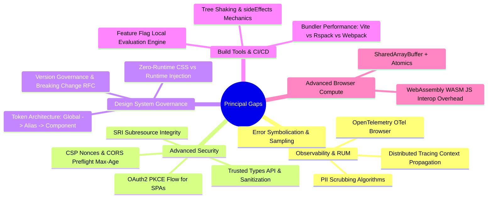
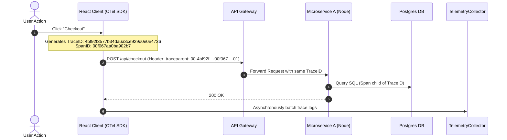
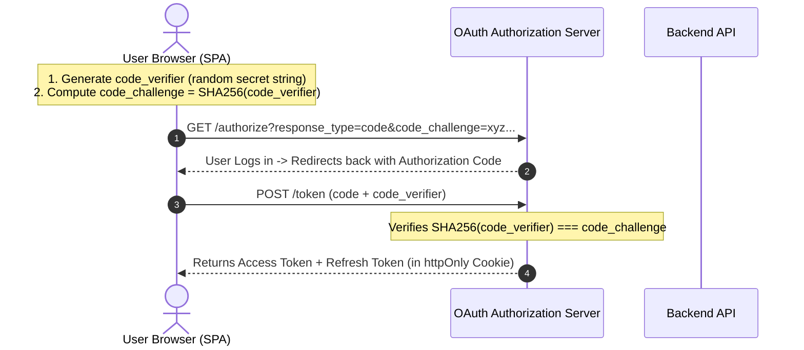
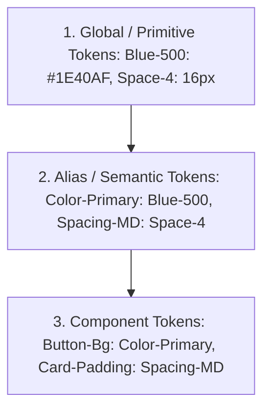

# 🎯 Advanced Principal Staff Architect Gaps (What You Were Missing)

> **🎯 Target Audience:** Staff & Principal Engineers
> **Purpose:** Exhaustive coverage of critical high-stakes topics that distinguish Senior Engineers from Principal Architects: Browser Observability (OpenTelemetry / RUM), Security Deep-Dive (OAuth2 PKCE, Trusted Types), Design System Governance, WASM/Web Workers, and CI/CD Build Infrastructure.
> **Existing Repo Tags:** 🔗 [See Security Architecture](file:///Users/atulkumarawasthi/projects/SystemDesign/Security/README.md) | 🔗 [See Performance Metrics](file:///Users/atulkumarawasthi/projects/SystemDesign/Performance/Metrics/README.md) | 🔗 [See FE SD Framework](file:///Users/atulkumarawasthi/projects/SystemDesign/Prep/03-Frontend-SD/README.md)

---

## 🧭 Summary of Identified Principal Gaps



---

## 📊 1. Observability, Telemetry & Real User Monitoring (RUM)

At the Principal level, interviewers expect you to know how to capture logs, metrics, and traces from millions of browsers **without slowing down the user experience or leaking sensitive PII**.

### A. Distributed Tracing: Context Propagation (`traceparent`)

To link a user's button click in React to backend microservice database queries, the frontend must inject W3C `traceparent` headers into outgoing HTTP requests.



### B. Non-Blocking Telemetry Batching with `navigator.sendBeacon`

Standard `fetch` calls during page unload (`beforeunload`, `pagehide`) get canceled by the browser. Use `sendBeacon` or `fetch` with `keepalive: true`.

```typescript
export class TelemetryCollector {
  private queue: Array<Record<string, unknown>> = [];
  private endpoint = '/api/v1/telemetry';

  track(event: string, payload: Record<string, unknown>) {
    // Sanitize PII (Emails, Passwords, Credit Cards) before enqueueing
    const sanitized = this.scrubPII(payload);
    this.queue.push({ event, payload: sanitized, timestamp: Date.now() });

    if (this.queue.length >= 20) {
      this.flush();
    }
  }

  flush(): void {
    if (this.queue.length === 0) return;

    const payload = JSON.stringify(this.queue);
    this.queue = [];

    // Use sendBeacon for guaranteed delivery even if tab is closing
    if (navigator.sendBeacon) {
      const blob = new Blob([payload], { type: 'application/json' });
      navigator.sendBeacon(this.endpoint, blob);
    } else {
      fetch(this.endpoint, { method: 'POST', body: payload, keepalive: true });
    }
  }

  private scrubPII(data: Record<string, unknown>): Record<string, unknown> {
    const copy = { ...data };
    for (const key in copy) {
      if (/email|password|creditcard|ssn|phone/i.test(key)) {
        copy[key] = '[REDACTED_PII]';
      }
    }
    return copy;
  }
}
```

---

## 🔒 2. Advanced Frontend Security Architecture

### A. OAuth 2.0 PKCE Flow (Proof Key for Code Exchange) for SPAs

Single-Page Applications (SPAs) are **Public Clients** (they cannot keep client secrets confidential because JS code is inspectable). SPAs must use OAuth 2.0 Authorization Code Flow with **PKCE**.



### B. DOM Sanitization via Trusted Types API

Modern browsers support **Trusted Types** to prevent DOM-based Cross-Site Scripting (XSS) by enforcing typed sanitization before assigning string HTML to innerHTML.

```typescript
// Enable Trusted Types policy in browser
if (window.trustedTypes && window.trustedTypes.createPolicy) {
  const sanitizePolicy = window.trustedTypes.createPolicy('default', {
    createHTML: (string) => {
      // Use DOMPurify or custom sanitizer
      return string.replace(/<script\b[^<]*(?:(?!<\/script>)<[^<]*)*<\/script>/gi, '');
    },
  });

  // Safe assignment (Browser throws error if un-sanitized string assigned!)
  const safeHTML = sanitizePolicy.createHTML('<p>Hello User</p>');
  document.getElementById('content')!.innerHTML = safeHTML as unknown as string;
}
```

---

## 🎨 3. Enterprise Design System & Component Library Architecture

### A. 3-Tier Design Token Architecture



- **Global Tokens:** Raw values (`#1E40AF`, `16px`). Never referenced directly inside components.
- **Alias Tokens:** Purpose-driven semantic mappings (`color-primary`, `bg-surface-elevated`). Allows instant dark mode / brand re-theming by swapping alias layer.
- **Component Tokens:** Scoped variables for specific component parts (`button-primary-bg-hover`).

---

## 🛠️ 4. Build System Infrastructure & Tree-Shaking Mechanics

### A. How Tree-Shaking Works & The `sideEffects` Flag

Tree shaking removes unused export code during bundling. However, bundlers (Webpack / Rollup / Rspack) skip tree shaking if they suspect a file has **side effects** (e.g. modifying global prototypes or running immediate self-invoking functions).

```json
// package.json in Component Library
{
  "name": "@my-org/design-system",
  "version": "2.4.0",
  "sideEffects": ["**/*.css", "**/src/polyfills.ts"]
}
```

> 💡 **Principal Insight:** Declaring `"sideEffects": false` (or explicitly listing only `.css` files) informs the bundler that unimported exports can be safely purged, reducing consumer bundle sizes by up to 40%.

---

## ❓ Collapsed Q&A Self-Testing Bank

<details>
<summary>❓ 1. [Principal-Level] Why can't Single-Page Applications (SPAs) use standard OAuth 2.0 Authorization Code Flow without PKCE?</summary>

**Answer:**
Standard Authorization Code Flow requires a `client_secret` to exchange the authorization code for an access token. Because SPAs run entirely on the user's browser, any embedded `client_secret` is visible via source code inspection or network tabs. PKCE eliminates client secrets by dynamically creating a cryptographically random `code_verifier` and hashed `code_challenge` per authentication request, ensuring authorization codes cannot be intercepted or reused by malicious scripts.

</details>

<details>
<summary>❓ 2. [Principal-Level] How do you handle W3C `traceparent` context propagation when sending CORS requests to 3rd-party domain APIs?</summary>

**Answer:**
`traceparent` is a non-standard HTTP header for 3rd-party domains. Injecting `traceparent` into cross-origin requests triggers a **CORS Preflight (OPTIONS request)** and will be rejected unless the 3rd-party server explicitly responds with `Access-Control-Allow-Headers: traceparent`.
**Best Practice:** Only inject `traceparent` headers into internal first-party microservices or trusted gateway APIs. For untracked 3rd-party APIs, suppress header injection to avoid breaking CORS preflight handshakes.

</details>

<details>
<summary>❓ 3. [Hard] What is the difference between Web Workers and Service Workers?</summary>

**Answer:**

- **Web Workers:** Dedicated background threads spawned by a specific page tab to run heavy JavaScript computation (e.g. video processing, parsing large JSON) without blocking the main rendering thread. They terminate when the tab closes.
- **Service Workers:** Event-driven network proxies running independently of page tabs. They intercept network requests, handle offline caching strategies (Stale-While-Revalidate), and receive push notifications even when the web app tab is closed.
</details>
