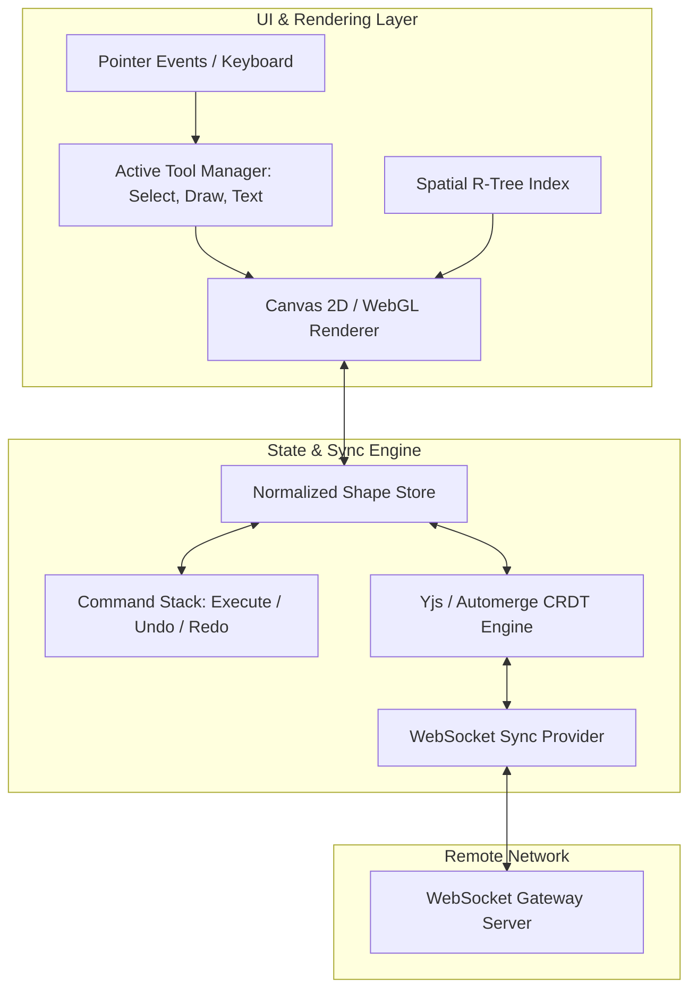
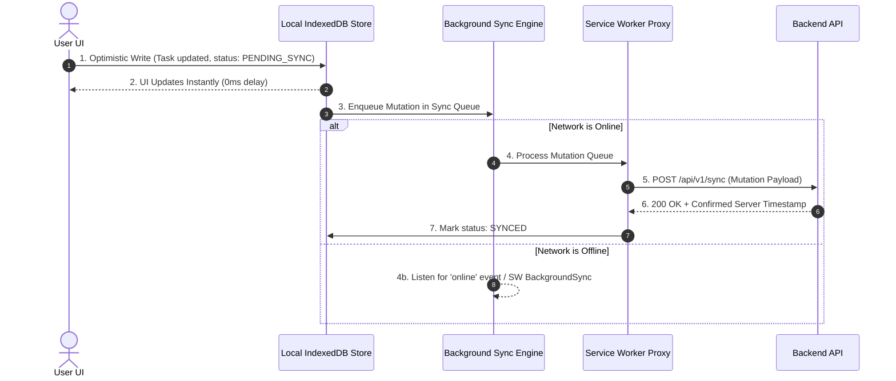

# 🔥 Hot Frontend System Design & Machine Coding Practice Bank

> **🎯 Target Audience:** Senior, Staff, and Principal Frontend Engineers
> **Purpose:** Hands-on, production-grade Frontend System Design & Machine Coding practice problems covering top tier tech company (Meta, Google, Uber, Netflix, Stripe) interview prompts.
> **Existing Repo Tags:** 🔗 [See FE System Design Framework](file:///Users/atulkumarawasthi/projects/SystemDesign/PrincipalPrep/03-Frontend-SD/README.md) | 🔗 [See Classic FE Designs](file:///Users/atulkumarawasthi/projects/SystemDesign/PrincipalPrep/03-Frontend-SD/10-Frontend-Classic.md) | 🔗 [See Frontend Q&A Bank](file:///Users/atulkumarawasthi/projects/SystemDesign/PrincipalPrep/06-Interview-QA/FE-SD-QA.md)

---

## 🧭 How to Practice These Problems

For each problem, practice using the **6-Step Principal FE Framework**:

1. **Requirements & Scope Boundaries (5 mins):** Clarify Functional & Non-Functional requirements, scale, target devices, and network constraints.
2. **Architecture & Rendering Choice (5 mins):** Choose CSR vs SSR vs Islands vs Micro-Frontends with explicit tradeoff justification.
3. **Data Flow & State Architecture (10 mins):** Define state management (URL state, Local state, Global store, Server state), data structures, and normalization.
4. **Component & API Design (10 mins):** Sketch component hierarchy, props contracts, and API protocol (REST, GraphQL, WS, SSE).
5. **Performance, Security & Edge Cases (10 mins):** Address Web Vitals (LCP, INP, CLS), virtualization, memory leaks, offline fallback, and XSS/CSP.
6. **Interviewer Grill Defense (5 mins):** Defend trade-offs under high concurrency, packet loss, or extreme user scale.

---

## 🎨 Practice Problem 1: Design a Real-Time Collaborative Whiteboard (Figma / Miro FE)

### 📋 1. Problem Statement & Requirements

- **Functional:**
  1. Render infinite 2D canvas supporting shapes (rectangles, circles, text, connectors).
  2. Multi-user real-time collaboration (see live user cursors and shape updates).
  3. Support pan, zoom, drag-and-drop, and object selection.
  4. Full Undo/Redo stack across local and remote actions.
- **Non-Functional:**
  1. 60 FPS smooth rendering during pan/zoom with 10,000+ objects on screen.
  2. Sub-50ms latency for remote cursor movements.
  3. Conflict resolution without state tearing when two users move the same shape simultaneously.

---

### 🏗️ 2. High-Level Architecture



---

### 💻 3. Key Implementation Blueprints

#### A. Spatial Indexing & Viewport Culling (R-Tree)

Rendering 10,000 shapes directly on every 16ms animation frame destroys performance. Use viewport culling to render _only_ shapes overlapping the current visible screen bounds.

```typescript
export interface BoundingBox {
  x: number;
  y: number;
  width: number;
  height: number;
}

export interface Shape extends BoundingBox {
  id: string;
  type: 'rectangle' | 'circle' | 'text';
  fillColor: string;
}

export class ViewportCuller {
  // Simple bounding box intersection test (concept for spatial index lookup)
  static isVisible(shape: BoundingBox, viewport: BoundingBox): boolean {
    return !(
      shape.x + shape.width < viewport.x ||
      shape.x > viewport.x + viewport.width ||
      shape.y + shape.height < viewport.y ||
      shape.y > viewport.y + viewport.height
    );
  }

  static getVisibleShapes(shapes: Shape[], viewport: BoundingBox): Shape[] {
    return shapes.filter((shape) => this.isVisible(shape, viewport));
  }
}
```

#### B. Multi-User Cursor Smooth Interpolation (LERP)

Raw WebSocket cursor updates arrive jittery at ~20-30Hz. Use Linear Interpolation (`lerp`) inside `requestAnimationFrame` to render 60 FPS cursor motion.

```typescript
export class CursorInterpolator {
  private currentX = 0;
  private currentY = 0;
  private targetX = 0;
  private targetY = 0;

  updateTarget(x: number, y: number) {
    this.targetX = x;
    this.targetY = y;
  }

  // Linear interpolation: lerp(start, end, factor)
  renderFrame(onRender: (x: number, y: number) => void) {
    const factor = 0.2; // Smoothness factor
    this.currentX += (this.targetX - this.currentX) * factor;
    this.currentY += (this.targetY - this.currentY) * factor;

    onRender(this.currentX, this.currentY);
  }
}
```

---

### ❓ Collapsed Grill Questions for Problem 1

<details>
<summary>❓ Grill 1: HTML5 2D Canvas vs SVG vs WebGL — Which do you pick and why?</summary>

**Answer:**

- **SVG:** Uses DOM elements for every shape. Excellent for accessibility and crisp vector scaling, but degrades catastrophically beyond ~1,000 DOM nodes due to browser reflows.
- **HTML5 2D Canvas (Winner for mid-scale):** Immediate-mode bitmap rendering. Easily handles 10,000+ objects with spatial culling.
- **WebGL / WebGPU (Winner for massive scale):** GPU-accelerated vertex/fragment shaders. Best for 100,000+ complex paths or 3D elements (like Figma's custom C++ WebAssembly C++ engine compiled via Skia).
</details>

<details>
<summary>❓ Grill 2: How do you prevent local Undo (`Cmd+Z`) from undoing changes made by a remote collaborator?</summary>

**Answer:**
Maintain **per-user operation scopes**. The Undo/Redo stack must operate strictly on the local user's **Command History**, not on global state snapshots. When local user executes `Undo`, apply an inverted delta patch specifically targeting the local user's last mutation UUID while merging remote CRDT operations in parallel.

</details>

---

## 📦 Practice Problem 2: Design an Enterprise Micro Frontend Architecture (AWS Console / Shopify FE)

### 📋 1. Problem Statement & Requirements

- **Functional:**
  1. Host Shell application seamlessly embeds independent micro-frontend apps (Dashboard, Billing, Inventory).
  2. Shared global layout (Navbar, Auth state, Notifications) across all teams.
  3. Dynamic loading of remotes at runtime without full page refreshes.
- **Non-Functional:**
  1. Squads deploy independently without re-building the Host app.
  2. Prevent CSS collision across teams.
  3. Share vendor singletons (`react`, `react-dom`) so users don't download React multiple times.

---

### 🏗️ 2. High-Level Architecture

```mermaid
graph TD
    subgraph Host Application Shell
        Router[Global Unified Router] --> ShellLayout[Shell UI: AppHeader, Sidebar]
        ShellLayout --> DynamicLoader[Dynamic Remote Component Loader]
        SharedStore[Shared Event Bus & User Context]
    end

    subgraph Micro Frontend Remotes (Independent Deployments)
        DynamicLoader -->|HTTP Webpack Federation| RemoteBilling[Billing Team Remote App]
        DynamicLoader -->|HTTP Webpack Federation| RemoteInventory[Inventory Team Remote App]
        DynamicLoader -->|HTTP Webpack Federation| RemoteAnalytics[Analytics Team Remote App]
    end

    subgraph Shared Vendor Layer (CDN)
        RemoteBilling -.->|Shared Singleton| ReactCore[React / ReactDOM v18]
        RemoteInventory -.->|Shared Singleton| ReactCore
        Host -.->|Shared Singleton| ReactCore
    end
```

---

### 💻 3. Key Implementation Blueprints

#### Dynamic Remote Component Loader with Fallback Boundary

```typescript
import React, { lazy, Suspense } from 'react';

interface RemoteModuleProps {
  remoteUrl: string;
  scope: string;
  module: string;
}

// Custom Loader handling network failure gracefully
export class DynamicRemoteLoader {
  static loadComponent({ remoteUrl, scope, module }: RemoteModuleProps) {
    return lazy(async () => {
      try {
        // Dynamically load remote entry script if not injected
        await this.loadScript(remoteUrl);
        // Initialize Webpack container scope
        // @ts-ignore
        await __webpack_share_scopes__.default;
        // @ts-ignore
        const container = window[scope];
        // @ts-ignore
        await container.init(__webpack_share_scopes__.default);
        // @ts-ignore
        const factory = await container.get(module);
        return factory();
      } catch (error) {
        console.error(`Failed to load remote module: ${scope}/${module}`, error);
        // Return resilient fallback component
        return { default: () => <div className="error-fallback">Micro-Frontend Unavailable</div> };
      }
    });
  }

  private static loadScript(url: string): Promise<void> {
    return new Promise((resolve, reject) => {
      if (document.querySelector(`script[src="${url}"]`)) return resolve();
      const script = document.createElement('script');
      script.src = url;
      script.onload = () => resolve();
      script.onerror = () => reject(new Error(`Script load error: ${url}`));
      document.head.appendChild(script);
    });
  }
}
```

---

### ❓ Collapsed Grill Questions for Problem 2

<details>
<summary>❓ Grill 1: What happens if Remote App requires React 18, but Host App is on React 17?</summary>

**Answer:**
In Webpack Module Federation `shared` config:

1. If `singleton: true, strictVersion: true` is set, Webpack throws a runtime error and stops remote loading.
2. If `strictVersion: false` (or `requiredVersion` fallback is allowed), Webpack loads **both** React versions isolated in memory. While this increases bundle size, it prevents runtime application crashes.
</details>

<details>
<summary>❓ Grill 2: How do you enforce CSS style isolation between independent team micro-frontends?</summary>

**Answer:**
Three architectural options:

1. **Scoped CSS-in-JS / Tailwind with Unique Prefix:** Force each team to use prefix classnames (`.billing-btn`, `.inventory-btn`).
2. **Shadow DOM Encapsulation:** Mount remote components inside a Shadow Root (`attachShadow({ mode: 'open' })`). Styles strictly cannot leak outside the shadow root.
3. **CSS Modules with Hash Names:** Webpack generates scoped hash classnames per module.
</details>

---

## 📱 Practice Problem 3: Design an Offline-First Task Manager / PWA (Linear / Notion FE)

### 📋 1. Problem Statement & Requirements

- **Functional:**
  1. Users create, edit, delete tasks and update status columns.
  2. Full offline capability: app works continuously when network is completely offline.
  3. Auto-sync local modifications back to backend server when connection restores.
- **Non-Functional:**
  1. Instant optimistic UI feedback (0ms interaction latency).
  2. Reliable conflict resolution when changes happen offline across multiple devices.
  3. Persistent client storage up to 500MB+.

---

### 🏗️ 2. High-Level Architecture



---

### 💻 3. Key Implementation Blueprints

#### Optimistic Mutation Queue with Local UUID Generation

```typescript
export interface Mutation<T> {
  id: string; // Client-generated UUID v4
  entity: string;
  type: 'CREATE' | 'UPDATE' | 'DELETE';
  payload: T;
  timestamp: number;
  status: 'PENDING' | 'SYNCED' | 'FAILED';
}

export class OfflineSyncEngine {
  private queue: Mutation<any>[] = [];

  constructor() {
    window.addEventListener('online', () => this.flushQueue());
  }

  async enqueueMutation<T>(entity: string, type: 'CREATE' | 'UPDATE' | 'DELETE', payload: T) {
    const mutation: Mutation<T> = {
      id: crypto.randomUUID(), // Local unique key
      entity,
      type,
      payload,
      timestamp: Date.now(),
      status: 'PENDING',
    };

    this.queue.push(mutation);
    await this.saveToIndexedDB(mutation);

    if (navigator.onLine) {
      this.flushQueue();
    }
  }

  private async flushQueue() {
    if (this.queue.length === 0) return;

    const pending = [...this.queue];
    for (const mutation of pending) {
      try {
        const res = await fetch('/api/v1/sync', {
          method: 'POST',
          headers: { 'Content-Type': 'application/json' },
          body: JSON.stringify(mutation),
        });

        if (res.ok) {
          this.queue = this.queue.filter((m) => m.id !== mutation.id);
          await this.removeFromIndexedDB(mutation.id);
        }
      } catch (err) {
        console.warn(`[Sync Pending] Network request failed for ${mutation.id}`, err);
        break; // Stop flushing on network error to preserve serial dependency order
      }
    }
  }

  private async saveToIndexedDB(mutation: Mutation<any>) {
    /* IndexedDB Write */
  }
  private async removeFromIndexedDB(id: string) {
    /* IndexedDB Delete */
  }
}
```

---

### ❓ Collapsed Grill Questions for Problem 3

<details>
<summary>❓ Grill 1: How do you handle a conflict where User A edits a task title offline, while User B deletes that exact task on the server?</summary>

**Answer:**
Implement a **Last-Write-Wins (LWW)** or **Server-Rejection with Client Reconciliation** strategy:

1. When User A reconnects, server receives update mutation for task ID `123`.
2. Server detects task `123` was already deleted at timestamp $T_{\text{delete}}$.
3. If $T_{\text{delete}} > T_{\text{userA}}$, server returns HTTP 409 Conflict / 404 Not Found response.
4. Client sync engine receives conflict, rolls back local optimistic state in IndexedDB, and notifies user with a toast ("Task was deleted by another user").
</details>

<details>
<summary>❓ Grill 2: Why pick IndexedDB over `localStorage` for offline PWA storage?</summary>

**Answer:**

- **`localStorage`:** Synchronous API (blocks main thread execution), restricted to 5MB, string-only storage.
- **IndexedDB (Winner):** Asynchronous transactional database, supports 250MB+ (or up to 80% of available disk space), handles structured binary objects/blobs without JSON serialization overhead, and supports secondary indices.
</details>

---

## 📊 Summary of Hot Practice Problems

| Problem Title                         | Architecture Focus                        | Primary Tech Stack / Patterns               | Top Web Vital Impacted              |
| :------------------------------------ | :---------------------------------------- | :------------------------------------------ | :---------------------------------- |
| **1. Collaborative Whiteboard**       | Spatial Indexing, CRDT, Viewport Culling  | Canvas 2D / WebAssembly, Yjs, LERP          | INP (Smooth 60 FPS)                 |
| **2. Micro Frontend Platform**        | Module Federation, Dynamic Remotes        | Webpack / Rspack, React Lazy, Shadow DOM    | LCP (Shared Vendor Singletons)      |
| **3. Offline Task Manager**           | Optimistic UI, IndexedDB, Background Sync | IndexedDB, Service Workers, Mutation Queue  | TTFB / INP (0ms UI latency)         |
| **4. E-Commerce Virtualized Catalog** | URL State, List Virtualization, Prefetch  | `react-window`, `useSearchParams`, Edge ISR | LCP & CLS (Aspect ratio containers) |
| **5. Live Streaming Reactions**       | High-throughput Virtualization, SSE       | SSE, `requestAnimationFrame`, Canvas        | INP (Prevent Main Thread lockup)    |
