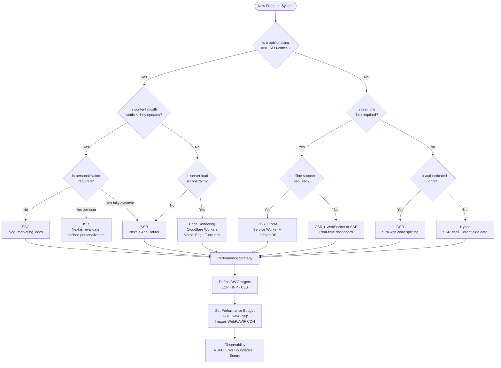

# 🖥️ Frontend System Design — Principal/Staff Level

> **Section:** `03-Frontend-SD`
> **Target Role:** Staff Engineer / Principal Engineer
> **Focus:** 80% Frontend, 20% Backend integration

---

🔥 **NEW:** Practice real-world top-tier interview prompts & master advanced gaps:
👉 **[Hot Frontend System Design & Machine Coding Practice Bank](./HOT-FE-INTERVIEW-PRACTICE.md)** (Figma Whiteboard, Micro-Frontend Platform, Offline-First PWA, Virtualized Feed)
👉 **[Frontend System Design Master Catalog & Blueprint Matrix](./11-Frontend-Systems-Catalog.md)** (Classification & Blueprints for YouTube, Uber, Dropbox, VS Code Web, WhatsApp, Notifications)
🎯 **[Advanced Principal Staff Architect Gaps](./ADVANCED-PRINCIPAL-GAPS.md)** (OpenTelemetry RUM, OAuth2 PKCE, Trusted Types XSS, Design System Tokens, Tree-Shaking mechanics)

---

## 📌 Why Frontend System Design is Different

Backend system design interviews focus on distributed systems, data stores, consensus algorithms, and infrastructure scaling. Frontend system design is a **completely different discipline** that most interviewers — and candidates — underestimate.

Frontend SD operates at the intersection of:

- **User experience** (perceived performance, interactivity, accessibility)
- **Browser platform constraints** (single-threaded JS, network, memory)
- **Distributed delivery** (CDN, edge, caching layers)
- **Application architecture** (state management, component design, rendering strategy)
- **Operational concerns** (error boundaries, observability, A/B testing)

### The Core Differences

| Dimension              | Backend SD                       | Frontend SD                                       |
| ---------------------- | -------------------------------- | ------------------------------------------------- |
| **Primary constraint** | Throughput, latency, consistency | Perceived performance, interactivity, bundle size |
| **Scaling axis**       | Horizontal server scaling        | CDN distribution, caching, code splitting         |
| **State model**        | Stateless servers + DB           | Multi-layer state (server, client, URL, cache)    |
| **Failure surface**    | Network partitions, DB failures  | Browser crashes, JS errors, network flakiness     |
| **Measurement**        | RPS, p99 latency, error rate     | LCP, INP, CLS, TTI, FID                           |
| **Testing model**      | Unit + integration + load        | Unit + integration + visual regression + E2E      |
| **Primary language**   | Any                              | JavaScript/TypeScript (no choice)                 |
| **Deployment unit**    | Docker image / binary            | Static assets + edge functions                    |
| **Caching**            | Redis, CDN for APIs              | Browser cache, Service Worker, CDN, HTTP cache    |

> **The fundamental insight:** Backend SD is about _where does compute live_. Frontend SD is about _what does the user experience at every millisecond_.

---

## 🎯 What Staff/Principal Frontend Interviewers Look For

At Staff/Principal level, interviewers are not looking for "I'd use React with Redux." They're evaluating whether you think like a **platform owner**, not a feature implementer.

### Signal 1: You Drive Tradeoff Conversations

You don't just say "use SSR." You say:

> "SSR reduces LCP but increases server load and complicates deployment. For this use case — a public marketing page with SEO requirements — SSR is justified. For the authenticated dashboard, I'd use CSR with skeleton screens to avoid server-side session management complexity."

### Signal 2: You Think in Layers

You decompose the problem across:

- **Delivery layer** — CDN, edge, HTTP/2
- **Rendering layer** — SSR/CSR/SSG/ISR strategy
- **Application layer** — component architecture, state management
- **Data layer** — fetching strategy, caching, optimistic updates
- **Observability layer** — RUM, error boundaries, alerting

### Signal 3: You Quantify Everything

Not "this will be faster" but:

> "Eliminating 200KB of unused JavaScript reduces TTI by ~1.5s on a 4G mobile connection at 10Mbps. That translates to roughly 3% conversion improvement based on Google's data showing 100ms of TTI improvement = 1% conversion lift."

### Signal 4: You Know Browser Constraints

You demonstrate understanding of:

- The event loop and why long tasks block rendering
- Memory leak patterns in React (closures, stale listeners)
- Paint/composite pipeline and which CSS properties trigger reflow
- Service Worker lifecycle and caching strategies

### Signal 5: You Own the Full Delivery Pipeline

From the engineer writing `<Image>` to the CDN serving it — you understand every hop, every cache layer, every transformation.

> **Principal-level signal:** You proactively bring up concerns the interviewer hasn't asked about yet — "I should mention: if we go with CSR, we need a plan for SEO, because Googlebot does execute JS but with a delay that can hurt crawl budget on large sites."

---

## 🗂️ Section Contents

| File                                                       | Topic                                                                             |
| ---------------------------------------------------------- | --------------------------------------------------------------------------------- |
| [01-Rendering-Strategies.md](./01-Rendering-Strategies.md) | CSR, SSR, SSG, ISR, Streaming SSR, RSC, Edge Rendering, Islands                   |
| [02-Performance-CWV.md](./02-Performance-CWV.md)           | Core Web Vitals, Performance Budget, Resource Hints, Image/Font/Code optimization |
| [03-Browser-Internals.md](./03-Browser-Internals.md)       | Event Loop, Rendering Pipeline, Reflow/Repaint, Service Workers, Memory           |

---

## 🧭 The Frontend SD Interview Framework

When given a frontend system design problem (e.g., "Design a news feed like Twitter/X", "Design Google Maps web client", "Design a real-time collaborative editor"), use this 6-step framework:

---

### Step 1 — Requirements + Constraints (5 min)

**Always clarify before architecting.**

Ask:

- **Users:** How many DAU? Geographic distribution? Device breakdown (mobile vs desktop)?
- **Content:** Static or dynamic? Personalized? Real-time?
- **SEO:** Does this need to be indexed by search engines?
- **Interactivity:** Read-heavy (news feed) or write-heavy (editor)?
- **Performance SLA:** What are the LCP/INP targets?
- **Authentication:** Public or authenticated? Affects rendering choice.
- **Teams:** How many teams will work on this? Affects micro-frontend decision.

**Functional requirements** → What does the user experience?
**Non-functional requirements** → Performance budget, accessibility (WCAG level), browser support matrix, offline capability.

---

### Step 2 — Architecture + Rendering Strategy (10 min)

This is the highest-leverage decision. The rendering strategy determines:

- Server infrastructure requirements
- SEO capability
- Time-to-interactive
- Caching model
- Deployment complexity

**The decision matrix:**

```
Is it public-facing AND SEO-critical?
  → Yes: SSR or SSG/ISR
  → No: CSR or hybrid

Is content mostly static (changes < daily)?
  → Yes: SSG (+ ISR for partial freshness)
  → No: SSR or CSR

Is personalization required at render time?
  → Yes: SSR (with edge caching for common patterns)
  → No: SSG with client-side personalization

Is real-time required?
  → Yes: CSR + WebSocket/SSE layer
  → No: SSR or SSG

Is bundle size the primary concern?
  → Yes: RSC + selective client hydration (Islands)
  → No: Standard SSR or CSR
```

Then define the **high-level architecture** (see diagram below).

---

### Step 3 — Component & Data Flow Design (10 min)

Break down:

1. **Component hierarchy:** Page → Layout → Feature → Shared components
2. **State boundaries:** What lives where?
   - Server state: React Query / SWR / RTK Query
   - UI state: Local component state
   - URL state: Query params / router
   - Global app state: Zustand / Jotai / Redux (rare)
3. **Data fetching strategy:**
   - Colocated queries (GraphQL fragments)
   - Waterfall prevention (parallel fetching, prefetching)
   - Optimistic updates
4. **Code splitting points:**
   - Route-level (automatic in Next.js)
   - Feature-level (heavy editors, charts, maps)

---

### Step 4 — Performance Strategy (5 min)

Map your architecture decisions to CWV metrics:

| Metric   | Your Strategy                                                                             |
| -------- | ----------------------------------------------------------------------------------------- |
| **LCP**  | SSR/SSG for hero content, `<link rel="preload">`, CDN for images, WebP/AVIF               |
| **INP**  | Code split JS, defer non-critical, web workers for heavy compute                          |
| **CLS**  | Explicit image dimensions, `font-display: optional`, skeleton screens with reserved space |
| **TTFB** | Edge rendering, CDN, HTTP/2, Redis for SSR data                                           |

Define a **performance budget**:

- JS bundle: < 150KB gzipped initial
- LCP image: < 200KB, served from CDN
- Third-party scripts: isolated via Partytown or deferred

---

### Step 5 — Security Considerations (3 min)

At Principal level, you raise security without being asked:

- **XSS:** `dangerouslySetInnerHTML` audit, CSP headers, DOMPurify for user content
- **CSRF:** SameSite cookies, double-submit token
- **Content Security Policy:** Report-only first, then enforce; nonce-based for inline scripts
- **Sensitive data in bundles:** No API keys, no PII in client-side JS
- **Third-party script risk:** Subresource Integrity (SRI), sandboxed iframes
- **Auth tokens:** HttpOnly cookies > localStorage for JWTs (XSS resistant)

---

### Step 6 — Observability + Error Handling (5 min)

The system is not done until you can **see what's broken**:

**Real User Monitoring (RUM):**

```typescript
import { onLCP, onINP, onCLS } from 'web-vitals';

const reportToAnalytics = ({ name, value, id }: Metric) => {
  fetch('/api/vitals', {
    method: 'POST',
    body: JSON.stringify({ name, value, id, url: location.href }),
  });
};

onLCP(reportToAnalytics);
onINP(reportToAnalytics);
onCLS(reportToAnalytics);
```

**Error Boundaries:**

```typescript
class AppErrorBoundary extends React.Component<Props, State> {
  static getDerivedStateFromError(error: Error): State {
    return { hasError: true, error };
  }

  componentDidCatch(error: Error, info: React.ErrorInfo) {
    logger.error('React error boundary caught', {
      error: error.message,
      stack: error.stack,
      componentStack: info.componentStack,
    });
  }

  render() {
    if (this.state.hasError) {
      return <ErrorFallback error={this.state.error} onRetry={this.reset} />;
    }
    return this.props.children;
  }
}
```

**What to monitor:**

- JS error rate (errors/session)
- CWV p75 by device class
- Resource load failures (images, fonts, scripts)
- API error rate from client perspective
- Rage clicks / dead clicks (Hotjar / FullStory)
- Long tasks (> 50ms) via PerformanceObserver

---

## 📁 Files in This Section

| File                                                                  | Description                           | Key Concepts                                                   |
| --------------------------------------------------------------------- | ------------------------------------- | -------------------------------------------------------------- |
| 📖 [01-Rendering-Strategies.md](./01-Rendering-Strategies.md)         | All Web Rendering Strategies          | CSR, SSR, SSG, ISR, Streaming SSR, RSC, Islands, Edge          |
| 📖 [02-Performance-CWV.md](./02-Performance-CWV.md)                   | Core Web Vitals & Web Performance     | LCP, INP, CLS, TTFB, Resource Hints, Yielding Main Thread      |
| 📖 [03-Browser-Internals.md](./03-Browser-Internals.md)               | Event Loop & Rendering Pipeline       | Event Loop, Reflow vs Repaint, Layout Thrashing, Memory Leaks  |
| 📖 [04-React-Architecture.md](./04-React-Architecture.md)             | React Fiber Engine & Concurrency      | Fiber, 32-bit Lanes, `useSyncExternalStore`, React 19 Compiler |
| 📖 [10-Frontend-Classic.md](./10-Frontend-Classic.md)                 | Classic FE System Designs (FUN-SCALE) | YouTube Player, Virtualized Feed, Search Autocomplete          |
| 📖 [11-Frontend-Systems-Catalog.md](./11-Frontend-Systems-Catalog.md) | FE Master Catalog & Blueprints        | Uber Live Map, Dropbox Upload, VS Code Web, Toast Center       |
| 🔥 [HOT-FE-INTERVIEW-PRACTICE.md](./HOT-FE-INTERVIEW-PRACTICE.md)     | Hot FE Practice Bank                  | Figma Whiteboard, Micro Frontend Platform, Offline Task PWA    |
| 🎯 [ADVANCED-PRINCIPAL-GAPS.md](./ADVANCED-PRINCIPAL-GAPS.md)         | Advanced Principal Gaps               | OpenTelemetry RUM, OAuth2 PKCE, Trusted Types, Design Tokens   |

---

## 🔀 Frontend SD Decision Tree



---

## ❓ Self-Test Q&A

<details>
<summary>❓ An interviewer asks: "Design the frontend for Twitter's home feed." What's the first thing you do?</summary>

**Answer:**

You do **not** immediately start drawing boxes. You ask clarifying questions to establish constraints:

1. **Scale:** How many DAU? (Twitter is ~250M — matters for CDN strategy)
2. **Device split:** What % mobile vs desktop? (affects bundle budget, image strategy)
3. **Personalization:** Is the feed personalized per-user? (eliminates SSG, likely SSR or CSR)
4. **Real-time:** Do new tweets appear in real-time or pull-to-refresh? (determines WebSocket vs polling)
5. **SEO:** Are individual tweet pages public? (affects rendering strategy — public tweets need SSR for sharing/meta tags)
6. **Offline:** Is offline reading required? (Service Worker + IndexedDB)

Only after establishing these would you propose architecture. The _act of asking_ signals Principal-level thinking — you don't architect in a vacuum.

</details>

---

<details>
<summary>❓ What is the most important rendering strategy decision for an e-commerce product listing page, and why?</summary>

**Answer:**

**SSG with ISR** is typically the right answer, and here's the reasoning:

- Product listing pages are **SEO-critical** (organic search drives purchase intent)
- Content is **mostly stable** — product names, prices, images don't change every second
- ISR allows revalidation on a schedule (e.g., `revalidate: 60`) so price changes propagate in ≤60s without a full rebuild
- This gives you **static-level performance** (served from CDN edge, near-instant TTFB) with **acceptable freshness**

Compare to SSR: SSR would also serve SEO, but every request hits your Node server, adding latency and cost. For a high-traffic listing page, this is a meaningful infrastructure difference.

**The nuance:** Add-to-cart, personalized recommendations, and inventory counts should be **client-side fetched** after the SSG shell loads — this is the hybrid pattern. Never block the page render on dynamic data that isn't needed for SEO.

</details>

---

<details>
<summary>❓ A senior engineer on your team says "we should put everything in Redux." How do you respond as a Staff engineer?</summary>

**Answer:**

You don't dismiss it — you **reframe the state model question** properly:

> "Redux is a valid tool, but I want us to be intentional about what kind of state we're managing. I think about four distinct state buckets:
>
> 1. **Server state** (async data from APIs): React Query or SWR handles this better than Redux — built-in caching, deduplication, background refresh, stale-while-revalidate semantics.
> 2. **URL state** (pagination, filters, active tab): URL params — shareable, bookmarkable, free.
> 3. **UI state** (modal open, accordion expanded): Local component state — no library needed.
> 4. **Global app state** (auth user, theme, cart): Zustand or Jotai — much smaller API surface than Redux, tree-shakeable, no boilerplate.
>
> Redux (or RTK) is justified when you need time-travel debugging, complex derived state, or very large team conventions. Let's identify which parts of our state actually need that before committing."

This is the Principal answer: you're **educating, not shutting down**, and you're making a principled argument, not a preference argument.

</details>

---

<details>
<summary>❓ How would you design the observability strategy for a frontend application serving 10M users?</summary>

**Answer:**

At 10M users, observability becomes a **data volume and signal-to-noise problem**. Here's the layered strategy:

**1. Real User Monitoring (RUM)**

- Instrument Core Web Vitals via `web-vitals` library, send to your data pipeline
- Sample at 10-20% for CWV (reduce noise, still statistically significant)
- Segment by: device class, connection type, geo, page type, A/B cohort
- Alert on p75 LCP > 2.5s or INP > 200ms

**2. Error Tracking**

- React Error Boundaries → Sentry with full component stack
- Global `window.onerror` + `unhandledrejection` for non-React errors
- Group by fingerprint, alert on new error types or spike in error rate
- Attach session replay (FullStory/LogRocket) for the worst errors

**3. Synthetic Monitoring**

- Lighthouse CI in every deploy pipeline — catch regressions before production
- SpeedCurve or Calibre for historical tracking of CWV across deploys
- Run from multiple geo locations on real device profiles (Moto G4 on 3G)

**4. Business Metrics Correlation**

- Correlate CWV p75 with conversion rate, bounce rate, session depth
- This turns performance into a **business conversation**, not just an engineering metric

**5. Alerting Ladder**

- P1: JS error rate > 1% → page oncall immediately
- P2: LCP p75 degraded > 20% vs 7-day baseline → alert within 1 hour
- P3: Bundle size regression > 10KB gzip vs last deploy → PR comment, block merge

</details>

---

<details>
<summary>❓ Explain how you'd handle a situation where your frontend team is blocked on the backend team for API contracts before they can build features.</summary>

**Answer:**

This is a **classic cross-team dependency problem** that Principal engineers are expected to resolve structurally, not just case-by-case.

**Immediate tactical fix:**

- Define API contracts in **OpenAPI/GraphQL schema first** — schema becomes the contract, both teams build to it
- Frontend uses **Mock Service Worker (MSW)** to intercept fetch calls and return mock responses matching the contract — zero backend dependency for UI development
- MSW mocks live in the repo and double as test fixtures

**Structural fix:**

- Adopt a **schema-first API design process**: frontend + backend engineers co-author the API schema in a design doc before any code is written
- Use **GraphQL BFF (Backend for Frontend)** pattern — frontend team owns the BFF layer and can shape the API to their needs without waiting for backend to accommodate
- Or adopt a **tRPC** approach in a monorepo where types are shared end-to-end

**Process fix:**

- API design review as part of feature planning, not after
- Frontend engineers attend backend sprint planning to raise API needs early
- Track "API readiness" as a dependency in the project tracker with explicit dates

The Principal-level answer shows you think in **systems**, not just "use MSW" — you fix the root cause of the coordination failure.

</details>

---

## 📚 Further Reading

- [web.dev/vitals](https://web.dev/vitals/) — Google's official CWV documentation
- [patterns.dev](https://www.patterns.dev/) — Rendering patterns (CSR, SSR, SSG, RSC)
- [Next.js App Router docs](https://nextjs.org/docs/app) — RSC + streaming SSR
- [Chrome DevTools Performance panel](https://developer.chrome.com/docs/devtools/performance/)
- [React 18 Concurrent Features](https://react.dev/blog/2022/03/29/react-v18)
