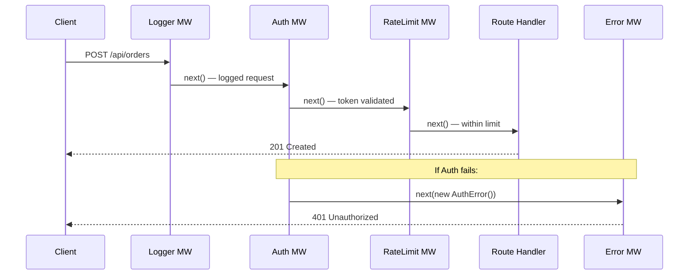
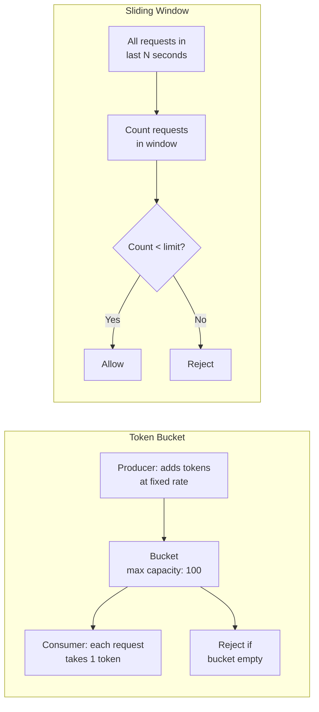

# 🟢 Node.js & Express — From a Frontend Engineer's Perspective

> Node.js is the backend runtime most frontend engineers are closest to — it shares the JavaScript language, the event loop model, and often runs the BFF (Backend For Frontend) layer. Understanding it deeply closes the "black box" between your React app and the infrastructure behind it.

---

## 📋 Table of Contents

1. [Node.js Event Loop vs Browser Event Loop](#1-nodejs-event-loop-vs-browser-event-loop)
2. [Express Middleware Chain](#2-express-middleware-chain)
3. [Streaming in Node.js](#3-streaming-in-nodejs)
4. [Rate Limiting in Express](#4-rate-limiting-in-express)
5. [API Best Practices — What to Demand from Your BE Team](#5-api-best-practices)
6. [Q&A](#6-qa)

---

## 1. 🔄 Node.js Event Loop vs Browser Event Loop

### How They're the Same

Both are single-threaded, non-blocking, callback-driven execution environments. Both use the **V8 JavaScript engine** to execute JS. Both have a call stack, a heap, and a callback queue. Both support Promises and async/await.

### How They're Different

The browser event loop is designed around **UI rendering** and **user interaction**. The Node.js event loop is designed around **I/O operations** — file system, network sockets, database queries.

```mermaid
graph TD
    subgraph Browser Event Loop
        BC[Call Stack] --> BMT[Microtask Queue<br/>Promise.then, queueMicrotask]
        BMT --> BRT[Rendering<br/>rAF, Layout, Paint]
        BRT --> BMQ[Macrotask Queue<br/>setTimeout, setInterval]
    end

    subgraph Node.js Event Loop - libuv
        NC[Call Stack] --> NMT[Microtask Queue<br/>process.nextTick, Promise.then]
        NMT --> NT[Timers Phase<br/>setTimeout, setInterval]
        NT --> NI[I/O Callbacks Phase]
        NI --> NIP[Idle/Prepare Phase]
        NIP --> NP[Poll Phase<br/>New I/O events]
        NP --> NC2[Check Phase<br/>setImmediate]
        NC2 --> NCL[Close Callbacks]
    end
```



### The Node.js Event Loop Phases (libuv)

Node.js event loop is not a single queue. It's a **multi-phase loop** managed by **libuv**, the C library that provides cross-platform async I/O:

| Phase               | What Runs Here                                                           |
| ------------------- | ------------------------------------------------------------------------ |
| **Timers**          | Callbacks from `setTimeout` and `setInterval` whose delay has expired    |
| **I/O Callbacks**   | Callbacks for most I/O errors deferred from previous loop                |
| **Idle/Prepare**    | Internal libuv use only                                                  |
| **Poll**            | Retrieve new I/O events; execute I/O callbacks (the "heart" of the loop) |
| **Check**           | `setImmediate` callbacks                                                 |
| **Close Callbacks** | `socket.on('close', ...)` etc.                                           |

**Crucially:** `process.nextTick` and `Promise.then` callbacks are **microtasks** and run **between every phase transition** — not in any single phase.

### process.nextTick vs setImmediate vs setTimeout

```typescript
// Execution order demo
console.log('1: synchronous');

setTimeout(() => console.log('4: setTimeout 0ms'), 0);

setImmediate(() => console.log('3: setImmediate'));

Promise.resolve().then(() => console.log('2b: Promise microtask'));

process.nextTick(() => console.log('2a: nextTick microtask'));

console.log('1b: also synchronous');

// Output order:
// 1: synchronous
// 1b: also synchronous
// 2a: nextTick microtask       ← process.nextTick drains first (before Promises!)
// 2b: Promise microtask        ← Promise microtasks drain next
// 3: setImmediate              ← Check phase (usually before Timers in this context)
// 4: setTimeout 0ms            ← Timers phase
```

> **⚠️ process.nextTick runs before Promises.** This surprises most frontend engineers. `process.nextTick` callbacks are processed before the Promise microtask queue. Abuse of `process.nextTick` can **starve the event loop** because it keeps re-adding to the nextTick queue before the I/O phases can run.

### Blocking the Event Loop — The Critical Danger

Because Node.js is **single-threaded**, any synchronous operation that takes a long time **blocks all other requests**. There is no concept of a UI thread vs a worker thread for request handling — it's one thread.

```typescript
import express from 'express';
const app = express();

// ❌ DANGER: This blocks the event loop for ALL requests
app.get('/dangerous', (req, res) => {
  // Simulating a CPU-intensive operation (e.g., image processing, large JSON parse)
  const start = Date.now();
  while (Date.now() - start < 3000) {
    // spin for 3 seconds — blocks ALL other requests during this time
  }
  res.json({ done: true });
});

// ✅ CORRECT: Offload CPU work to a Worker Thread
import { Worker, isMainThread, workerData, parentPort } from 'worker_threads';

app.get('/safe', (req, res) => {
  const worker = new Worker('./cpu-task.worker.js', {
    workerData: { input: req.query.input },
  });

  worker.on('message', (result) => res.json({ result }));
  worker.on('error', (err) => res.status(500).json({ error: err.message }));
});
```

**Things that block the event loop (never do in a request handler):**

- `fs.readFileSync`, `fs.writeFileSync`
- Large JSON.parse on multi-MB payloads
- Heavy cryptography (`crypto.pbkdf2Sync`)
- Long-running loops or recursive algorithms
- `child_process.execSync`

**The fix:** Use async versions (`fs.readFile`), offload to Worker Threads, or use a job queue.

---

## 2. 🔗 Express Middleware Chain

### How Middleware Works

Express middleware is a **pipeline of functions**. Each function receives `(req, res, next)` and either:

- Terminates the request by calling `res.send()`, `res.json()`, etc., OR
- Passes control to the next middleware by calling `next()`



### Order Matters — This is Not Obvious

Middleware runs in **registration order**. A common bug: registering error-handling middleware before route handlers, which means errors from routes don't reach it.

```typescript
import express, { Request, Response, NextFunction } from 'express';

const app = express();

// 1. Parse body — must come before routes that read req.body
app.use(express.json());

// 2. Request logging — comes early to log all requests
app.use((req: Request, res: Response, next: NextFunction) => {
  console.log(`${req.method} ${req.path} — ${new Date().toISOString()}`);
  next();
});

// 3. Auth middleware — reject before hitting route logic
app.use('/api', requireAuth);

// 4. Routes
app.post('/api/orders', createOrderHandler);

// 5. Error handling middleware — MUST be last, MUST have 4 params
// Express identifies error handlers by their arity (4 arguments)
app.use((err: Error, req: Request, res: Response, next: NextFunction) => {
  console.error(err.stack);
  res.status(500).json({ error: err.message });
});
```

### TypeScript Example: A Full Custom Middleware Stack

```typescript
import express, { Request, Response, NextFunction } from 'express';

// ── Custom Types ───────────────────────────────────────────
interface AuthenticatedRequest extends Request {
  user?: {
    id: string;
    role: 'admin' | 'user' | 'guest';
    tenantId: string;
  };
}

// ── Middleware: Request ID Injection ──────────────────────
function requestId(req: Request, res: Response, next: NextFunction): void {
  const id = crypto.randomUUID();
  req.headers['x-request-id'] = id;
  res.setHeader('x-request-id', id);
  next();
}

// ── Middleware: Structured Logger ─────────────────────────
function structuredLogger(req: Request, res: Response, next: NextFunction): void {
  const start = Date.now();

  res.on('finish', () => {
    console.log(
      JSON.stringify({
        requestId: req.headers['x-request-id'],
        method: req.method,
        path: req.path,
        statusCode: res.statusCode,
        durationMs: Date.now() - start,
        userAgent: req.headers['user-agent'],
      }),
    );
  });

  next();
}

// ── Middleware: Auth Guard ────────────────────────────────
function requireAuth(req: AuthenticatedRequest, res: Response, next: NextFunction): void {
  const token = req.headers.authorization?.replace('Bearer ', '');

  if (!token) {
    res.status(401).json({
      error: 'UNAUTHORIZED',
      message: 'Authentication token required',
    });
    return; // Important: don't call next() after sending response
  }

  try {
    // In real code: const payload = jwt.verify(token, process.env.JWT_SECRET!)
    const payload = { id: 'user-123', role: 'user' as const, tenantId: 'tenant-abc' };
    req.user = payload;
    next();
  } catch {
    res.status(401).json({
      error: 'INVALID_TOKEN',
      message: 'Token is expired or invalid',
    });
  }
}

// ── Middleware: Role Guard (factory pattern) ──────────────
function requireRole(...roles: Array<'admin' | 'user' | 'guest'>) {
  return (req: AuthenticatedRequest, res: Response, next: NextFunction): void => {
    if (!req.user || !roles.includes(req.user.role)) {
      res.status(403).json({
        error: 'FORBIDDEN',
        message: `This action requires one of: ${roles.join(', ')}`,
      });
      return;
    }
    next();
  };
}

// ── Error Handling Middleware ─────────────────────────────
class AppError extends Error {
  constructor(
    public statusCode: number,
    public code: string,
    message: string,
  ) {
    super(message);
    this.name = 'AppError';
  }
}

function globalErrorHandler(
  err: Error,
  req: Request,
  res: Response,
  next: NextFunction, // Must have 4 params even if unused
): void {
  if (err instanceof AppError) {
    res.status(err.statusCode).json({
      error: err.code,
      message: err.message,
      requestId: req.headers['x-request-id'],
    });
    return;
  }

  // Unknown errors — don't leak internals to client
  console.error('Unhandled error:', err);
  res.status(500).json({
    error: 'INTERNAL_SERVER_ERROR',
    message: 'An unexpected error occurred',
    requestId: req.headers['x-request-id'],
  });
}

// ── App Assembly ──────────────────────────────────────────
const app = express();
app.use(express.json({ limit: '1mb' })); // body size limit
app.use(requestId);
app.use(structuredLogger);

// Admin routes — require auth + admin role
app.delete(
  '/api/admin/users/:id',
  requireAuth,
  requireRole('admin'),
  async (req: AuthenticatedRequest, res: Response, next: NextFunction) => {
    try {
      // business logic
      res.status(204).send();
    } catch (err) {
      next(err); // pass to error handler
    }
  },
);

app.use(globalErrorHandler); // LAST
```

---

## 3. 🌊 Streaming in Node.js

### Why Streaming Matters for Frontend Architects

When your frontend downloads a large file, exports a CSV, or streams a video, there's a Node.js stream pipeline behind it. Understanding streams lets you:

- Demand correct streaming implementations from your BE team
- Understand why large file downloads freeze or timeout
- Debug memory issues where servers load entire files into memory

### The Four Stream Types

```typescript
import { Readable, Writable, Transform, pipeline } from 'stream';
import { promisify } from 'util';

const streamPipeline = promisify(pipeline);

// ── Readable Stream: source of data ──────────────────────
class ProductCsvSource extends Readable {
  private products: Array<{ id: string; name: string; price: number }>;
  private index = 0;

  constructor(products: typeof ProductCsvSource.prototype.products) {
    super({ objectMode: false });
    this.products = products;
  }

  _read(): void {
    if (this.index === 0) {
      // Emit CSV header
      this.push('id,name,price\n');
    }

    if (this.index < this.products.length) {
      const p = this.products[this.index++];
      this.push(`${p.id},${p.name},${p.price}\n`);
    } else {
      this.push(null); // signal end of stream
    }
  }
}

// ── Transform Stream: transform data in-flight ────────────
class PriceMarkupTransform extends Transform {
  private markup: number;

  constructor(markupPercent: number) {
    super({ objectMode: false });
    this.markup = 1 + markupPercent / 100;
  }

  _transform(chunk: Buffer, encoding: BufferEncoding, callback: (error?: Error | null) => void): void {
    const line = chunk.toString();

    // Skip header line
    if (line.startsWith('id,')) {
      this.push(chunk);
      callback();
      return;
    }

    // Adjust price in each CSV row
    const parts = line.split(',');
    if (parts.length === 3) {
      const newPrice = (parseFloat(parts[2]) * this.markup).toFixed(2);
      this.push(`${parts[0]},${parts[1]},${newPrice}\n`);
    }

    callback();
  }
}

// ── Express endpoint: stream large CSV without loading into memory ──
import express from 'express';
import { createReadStream } from 'fs';
import { createGzip } from 'zlib';

const app = express();

// ✅ Stream a large file — no memory spike regardless of file size
app.get('/api/export/products', async (req, res) => {
  const products = await fetchAllProducts(); // returns AsyncIterator ideally

  res.setHeader('Content-Type', 'text/csv');
  res.setHeader('Content-Encoding', 'gzip');
  res.setHeader('Content-Disposition', 'attachment; filename="products.csv"');

  const source = new ProductCsvSource(products);
  const markup = new PriceMarkupTransform(10); // apply 10% markup
  const gzip = createGzip();

  // pipeline automatically handles backpressure and error propagation
  try {
    await streamPipeline(source, markup, gzip, res);
  } catch (err) {
    if (!res.headersSent) {
      res.status(500).json({ error: 'Stream failed' });
    }
  }
});

// ❌ WRONG: This loads the entire file into memory
app.get('/api/export/products/bad', async (req, res) => {
  const products = await fetchAllProducts(); // all 1M products in memory
  const csv = products.map((p) => `${p.id},${p.name},${p.price}`).join('\n');
  res.send(csv); // entire string in memory, then sent at once
});

async function fetchAllProducts() {
  return [{ id: '1', name: 'Widget', price: 9.99 }]; // placeholder
}
```

### Backpressure — The Critical Concept

Backpressure occurs when the consumer can't process data as fast as the producer generates it. The stream API handles this automatically via `pipe()` and `pipeline()` — but only if you use them. Manual `push()` without checking the return value causes memory overflow.

```typescript
// ❌ Ignoring backpressure — can exhaust memory
const readable = getSomeReadableStream();
const writable = res;
readable.on('data', (chunk) => {
  writable.write(chunk); // ignores return value — may be buffering indefinitely
});

// ✅ Use pipeline — it handles backpressure automatically
await streamPipeline(readable, writable);
```

---

## 4. 🛡️ Rate Limiting in Express

### Why Rate Limiting Matters for Frontend Architects

- Your frontend calls APIs — rate limits affect UX (users see errors)
- You own the BFF (Backend For Frontend) layer — you may implement rate limiting yourself
- Rate limit decisions (per-IP vs per-user, threshold values) require FE context

### Basic Rate Limiting with express-rate-limit

```typescript
import rateLimit from 'express-rate-limit';
import express from 'express';

const app = express();

// ── General API rate limit ────────────────────────────────
const apiLimiter = rateLimit({
  windowMs: 15 * 60 * 1000, // 15 minutes
  max: 100, // 100 requests per window per IP
  standardHeaders: 'draft-7', // Return RateLimit-* headers (RFC standard)
  legacyHeaders: false,

  // Custom response when limit is exceeded
  handler: (req, res) => {
    res.status(429).json({
      error: 'TOO_MANY_REQUESTS',
      message: 'Rate limit exceeded. Please retry after the specified time.',
      retryAfter: Math.ceil(res.getHeader('RateLimit-Reset') as number),
    });
  },

  // Custom key: use user ID if authenticated, else IP
  keyGenerator: (req) => {
    return req.headers['x-user-id']?.toString() ?? req.ip ?? 'anonymous';
  },
});

// ── Stricter limit for auth endpoints ─────────────────────
const authLimiter = rateLimit({
  windowMs: 60 * 1000, // 1 minute
  max: 5, // only 5 login attempts per minute per IP
  skipSuccessfulRequests: true, // don't count successful logins
  handler: (req, res) => {
    res.status(429).json({
      error: 'TOO_MANY_AUTH_ATTEMPTS',
      message: 'Too many login attempts. Account temporarily locked.',
    });
  },
});

app.use('/api/', apiLimiter);
app.post('/api/auth/login', authLimiter, loginHandler);
app.post('/api/auth/register', authLimiter, registerHandler);

function loginHandler(req: express.Request, res: express.Response) {
  res.json({ message: 'logged in' });
}
function registerHandler(req: express.Request, res: express.Response) {
  res.json({ message: 'registered' });
}
```

### Redis-Based Distributed Rate Limiting

The in-memory `express-rate-limit` only works on a **single server**. With multiple API server instances (horizontal scaling), each instance has its own counter — so a user can hit all N instances N times the limit. You need a **shared store**.

```typescript
import { createClient } from 'redis';
import { RateLimiterRedis, RateLimiterRes } from 'rate-limiter-flexible';
import express, { Request, Response, NextFunction } from 'express';

const redisClient = createClient({ url: process.env.REDIS_URL });
await redisClient.connect();

// ── Token Bucket via Redis ────────────────────────────────
// 100 tokens per user, refills at 100 per 15 minutes
const rateLimiter = new RateLimiterRedis({
  storeClient: redisClient,
  keyPrefix: 'rl_api',
  points: 100, // number of requests (tokens)
  duration: 15 * 60, // per 15 minutes (in seconds)
  blockDuration: 0, // don't automatically block — just reject
});

async function distributedRateLimit(req: Request, res: Response, next: NextFunction): Promise<void> {
  const key = req.user?.id ?? req.ip ?? 'anonymous';

  try {
    const result: RateLimiterRes = await rateLimiter.consume(key, 1);

    // Return remaining quota in headers (good API citizenship)
    res.setHeader('X-RateLimit-Limit', 100);
    res.setHeader('X-RateLimit-Remaining', result.remainingPoints);
    res.setHeader('X-RateLimit-Reset', Math.ceil(result.msBeforeNextReset / 1000));

    next();
  } catch (rejRes) {
    if (rejRes instanceof RateLimiterRes) {
      res.setHeader('Retry-After', Math.ceil(rejRes.msBeforeNextReset / 1000));
      res.status(429).json({
        error: 'TOO_MANY_REQUESTS',
        message: 'Rate limit exceeded',
        retryAfterSeconds: Math.ceil(rejRes.msBeforeNextReset / 1000),
      });
    } else {
      // Redis connection failed — fail open or fail closed?
      // Fail open: allow the request (better availability, security risk)
      // Fail closed: reject the request (better security, availability risk)
      // Recommendation: fail open with alert, never silently fail closed
      console.error('Rate limiter Redis error, failing open:', rejRes);
      next(); // fail open
    }
  }
}
```

### Token Bucket vs Sliding Window — The Algorithm Tradeoff



| Algorithm          | Allows Bursting                | Memory Usage | Precision | Best For                            |
| ------------------ | ------------------------------ | ------------ | --------- | ----------------------------------- |
| **Token Bucket**   | ✅ Yes (up to bucket capacity) | Low          | Medium    | APIs that should allow short bursts |
| **Fixed Window**   | ✅ Yes (2x at window boundary) | Very low     | Low       | Simple, low-stakes rate limits      |
| **Sliding Window** | ❌ No — smooth rate            | Medium-High  | High      | Strict per-second rate limiting     |
| **Leaky Bucket**   | ❌ No — constant drain rate    | Low          | High      | Smoothing request spikes            |

---

## 5. ✅ API Best Practices — What to Demand from Your BE Team

As a FE architect, these are the standards you enforce at API contract review. Non-negotiables.

### 1. Consistent Error Response Format

Adopt RFC 7807 (Problem Details for HTTP APIs). Every error, everywhere, looks the same.

```typescript
// The contract — every 4xx and 5xx must match this shape
interface ProblemDetail {
  type: string;      // URI identifying the error type (links to docs)
  title: string;     // Human-readable summary (stable, not per-request)
  status: number;    // HTTP status code (matches response status)
  detail: string;    // Human-readable explanation (per-request context)
  instance?: string; // URI reference to the specific occurrence
  // Extension fields for domain-specific context:
  errors?: Record<string, string[]>; // for validation errors
  requestId?: string;
  timestamp?: string;
}

// ✅ Correct
// POST /api/orders — 400 Bad Request
{
  "type": "https://api.myapp.com/errors/validation-failed",
  "title": "Validation Failed",
  "status": 400,
  "detail": "The request body contains invalid fields",
  "instance": "/api/orders/validate/req-abc123",
  "errors": {
    "quantity": ["must be a positive integer"],
    "productId": ["product not found or unavailable"]
  },
  "requestId": "req-abc123"
}

// ❌ Wrong — inconsistent, no machine-readable code
{ "message": "something went wrong" }
{ "error": true, "msg": "Validation error" }
{ "success": false, "errorCode": 1042 }
```

### 2. Pagination Standards

```typescript
// ✅ Cursor-based pagination (preferred for feeds, large datasets)
// GET /api/posts?cursor=eyJpZCI6MTAwfQ&limit=20
interface CursorPaginatedResponse<T> {
  data: T[];
  pagination: {
    nextCursor: string | null; // null means no more pages
    prevCursor: string | null;
    hasNextPage: boolean;
    hasPrevPage: boolean;
    limit: number;
  };
}

// ✅ Offset pagination (only for admin tables / known-bounded datasets)
// GET /api/admin/users?page=3&pageSize=50
interface OffsetPaginatedResponse<T> {
  data: T[];
  pagination: {
    page: number;
    pageSize: number;
    totalItems: number;
    totalPages: number;
  };
}

// ❌ Avoid: returning everything in one response
// GET /api/products → [...all 50,000 products...]
```

**Why prefer cursor-based?**

- Page 500 of offset pagination requires skipping 499 \* pageSize rows (slow at scale)
- Offset pagination is inconsistent: if items are inserted/deleted between page fetches, you see duplicates or miss items
- Cursor is O(1) navigation regardless of dataset size

### 3. API Versioning Strategy

```typescript
// Option A: URL versioning (most common, most visible)
app.use('/api/v1', v1Router);
app.use('/api/v2', v2Router);

// Option B: Header versioning (cleaner URLs, harder to test in browser)
app.use((req, res, next) => {
  const version = req.headers['api-version'] ?? '1';
  req.apiVersion = parseInt(version, 10);
  next();
});

// Option C: Accept header versioning (REST purists prefer this)
// Accept: application/vnd.myapp.v2+json

// ── Deprecation Contract ──────────────────────────────────
// Old version must work for N months after v2 ships
// Return deprecation headers on every v1 response:
res.setHeader('Deprecation', 'true');
res.setHeader('Sunset', 'Sat, 1 Jan 2027 00:00:00 GMT');
res.setHeader('Link', '</api/v2/orders>; rel="successor-version"');
```

### 4. Idempotency Keys for Mutations

```typescript
import { createClient } from 'redis';

const redis = createClient({ url: process.env.REDIS_URL });

// ── Idempotency middleware ────────────────────────────────
// For POST endpoints: client sends Idempotency-Key header
// Server caches the response for 24 hours — same key = same response
async function idempotencyMiddleware(
  req: express.Request,
  res: express.Response,
  next: express.NextFunction,
): Promise<void> {
  if (!['POST', 'PUT', 'PATCH'].includes(req.method)) {
    next();
    return;
  }

  const idempotencyKey = req.headers['idempotency-key'] as string | undefined;

  if (!idempotencyKey) {
    // For critical endpoints (payments), require idempotency key
    if (req.path.startsWith('/api/payments')) {
      res.status(400).json({
        error: 'MISSING_IDEMPOTENCY_KEY',
        message: 'Payment endpoints require an Idempotency-Key header',
      });
      return;
    }
    next();
    return;
  }

  const cacheKey = `idempotency:${req.user?.id}:${idempotencyKey}`;
  const cached = await redis.get(cacheKey);

  if (cached) {
    const { status, body } = JSON.parse(cached);
    res.status(status).json(body);
    return;
  }

  // Intercept the response to cache it
  const originalJson = res.json.bind(res);
  res.json = (body) => {
    if (res.statusCode < 500) {
      redis.setEx(
        cacheKey,
        86400, // 24 hours
        JSON.stringify({ status: res.statusCode, body }),
      );
    }
    return originalJson(body);
  };

  next();
}

// Usage: POST /api/payments/charge
// Idempotency-Key: client-generated-uuid-per-attempt
// Second call with same key returns cached response — no double charge
```

### 5. Request/Response Compression

```typescript
import compression from 'compression';

app.use(
  compression({
    // Only compress responses > 1kb — small responses aren't worth the CPU
    threshold: 1024,
    // Compression level 6 is a good balance of speed vs ratio
    level: 6,
    // Only compress compressible content types
    filter: (req, res) => {
      const contentType = (res.getHeader('Content-Type') as string) ?? '';
      return /json|text|javascript|css/.test(contentType);
    },
  }),
);
```

---

## 6. ❓ Q&A

<details>
<summary>❓ Q1: What's the difference between process.nextTick and Promise.then microtasks, and why does it matter in a Node server?</summary>

**Answer:** Both are microtasks that run before the next I/O phase of the event loop. The critical difference is **ordering**: `process.nextTick` callbacks drain **before** Promise callbacks in every tick. This means recursive `process.nextTick` usage can starve the event loop — it keeps adding callbacks to the nextTick queue before any Promises or I/O callbacks can run.

In a Node.js server context, this matters because: if a library or middleware uses `process.nextTick` recursively without a base case, it can prevent any I/O callbacks (like database responses) from ever being processed — effectively hanging the server. The practical rule: prefer Promises/async-await over `process.nextTick`; use `process.nextTick` only for very specific cases like deferring an error emission to give event listeners time to register.

</details>

<details>
<summary>❓ Q2: How does Express identify a middleware as an error handler vs a regular middleware?</summary>

**Answer:** Express uses **function arity** (the number of declared parameters) to distinguish error handlers. A regular middleware has 3 parameters `(req, res, next)`; an error handler has exactly 4 `(err, req, res, next)`. Express only routes to error-handling middleware when `next(err)` is called with an argument, or when an async error is caught and forwarded.

Key implications:

1. Even if you don't use `next` in your error handler, you **must** declare it — otherwise Express treats it as a regular middleware.
2. Error-handling middleware **must be registered last** — after all routes and regular middleware.
3. For async route handlers, errors are **not automatically caught** in Express 4.x — you must wrap in try/catch and call `next(err)`. Express 5 (currently RC) will auto-catch async errors.

</details>

<details>
<summary>❓ Q3: What is backpressure in Node.js streams and what happens if you ignore it?</summary>

**Answer:** Backpressure is the mechanism by which a **slower writable consumer** signals to a **faster readable producer** to pause sending data. In Node.js streams, `writable.write(chunk)` returns `false` when the internal write buffer is full, indicating the producer should stop calling `write()` until the `'drain'` event fires.

If you ignore backpressure — calling `write()` regardless of the return value — the writable stream buffers all the unprocessed chunks in memory. In a file download scenario, this means the entire file content accumulates in the Node.js process heap. At scale, this causes: **Out of Memory crashes**, **high GC pressure**, and **degraded response times for all concurrent requests** on that server.

The solution: always use `stream.pipeline()` or `readable.pipe(writable)` — both handle backpressure automatically. Manual stream management is error-prone and should be avoided unless you have a very specific reason.

</details>

<details>
<summary>❓ Q4: Why is express-rate-limit insufficient for a horizontally scaled API, and how do you fix it?</summary>

**Answer:** `express-rate-limit`'s default memory store is **process-local**. Each Node.js server instance maintains its own counter. With N server instances behind a load balancer:

- User makes request to Instance A → counter on A = 1
- User makes request to Instance B → counter on B = 1 (A's counter is irrelevant)
- Result: the user can make N×limit requests per window without being rate-limited

The fix is a **shared external store**, typically Redis. Both `express-rate-limit` (via `rate-limit-redis` adapter) and `rate-limiter-flexible` support Redis as the backing store. With Redis, all instances share the same counter — the rate limit is enforced globally across the cluster. The Redis counter uses atomic INCR operations, so there's no race condition between concurrent requests hitting different instances.

Trade-off: Redis adds a network round-trip to every request. Mitigation: use Redis Cluster with a local replica, or accept the ~1ms overhead. For most production APIs, this is completely acceptable.

</details>

<details>
<summary>❓ Q5: What is the "thundering herd" problem in the context of rate limiting and how is it different from the same problem in caching?</summary>

**Answer:** The thundering herd problem occurs when a large number of clients simultaneously attempt operations, often triggered by the same event.

**In rate limiting:** When a rate limit window resets (e.g., every 60 seconds), all blocked clients become unblocked simultaneously and send requests at once — creating a massive spike at every window boundary. This is the **fixed window boundary problem**. Solution: sliding window rate limiting, which doesn't have a sharp reset — it continuously slides, so the "available quota" increases gradually.

**In caching:** When a cached item expires, all concurrent requests for that item simultaneously miss the cache and hit the database — creating a spike. This is also called a **cache stampede**. Solution: probabilistic early expiration (refreshing before actual expiry), a mutex lock on cache-miss, or "stale-while-revalidate" where the stale value is served while one background request refreshes it.

Both have the same root cause: **synchronized expiry of a shared constraint** — whether it's a rate limit window or a cache TTL. The solutions in both cases involve smoothing the boundary or serializing the first-responder.

</details>

<details>
<summary>❓ Q6: What does "fail open vs fail closed" mean in rate limiting, and which should you choose?</summary>

**Answer:** This refers to behavior when the rate limiter's backing store (Redis) is unavailable:

**Fail open:** Allow all requests through when Redis is down.

- Pros: High availability — your API keeps serving traffic
- Cons: Rate limiting temporarily disabled — vulnerable to DoS or abuse during Redis outage

**Fail closed:** Reject all requests when Redis is down (or return 503).

- Pros: Stronger security posture — never allows uncontrolled traffic
- Cons: Your entire API goes down when Redis goes down — poor availability

**The correct answer depends on context:**

- For a **public API protecting backend resources**: lean toward fail open + alert aggressively + have a separate circuit breaker
- For **auth endpoints protecting user accounts**: lean toward fail closed — the cost of a credential stuffing attack during outage is worse than temporary downtime
- The mature answer: **fail open + alert** for most API rate limiting, **fail closed** specifically for auth rate limiting, with Redis HA (sentinel or cluster) to minimize the frequency of the failure case

The principal-level signal here is recognizing that this is a **tradeoff between availability and security**, not a single right answer.

</details>

---

## 📊 Tradeoffs Summary

| Topic                           | Option A                       | Option B                  | When to Choose                                                    |
| ------------------------------- | ------------------------------ | ------------------------- | ----------------------------------------------------------------- |
| **CPU work in request handler** | Run inline (blocks event loop) | Offload to Worker Thread  | Always use Worker Thread for >10ms CPU ops                        |
| **Rate limit store**            | In-memory (per process)        | Redis (shared)            | Use Redis whenever you have >1 server instance                    |
| **Rate limit algorithm**        | Fixed window (simple)          | Sliding window (accurate) | Sliding window for strict limits; fixed window for coarse control |
| **Stream handling**             | Load all into memory           | Stream with pipeline      | Always stream for files >1MB or unknown size                      |
| **Pagination type**             | Offset (simple)                | Cursor (consistent)       | Cursor for feeds/real-time data; offset only for admin tables     |
| **Rate limit failure mode**     | Fail open (available)          | Fail closed (secure)      | Open for general APIs; closed for auth endpoints                  |

> **🔑 Principal-Level Signal:** When asked about Node.js in an interview, don't just describe the event loop — demonstrate that you know **when it's a bottleneck** (CPU work, sync I/O) and **what you'd do about it** (Worker Threads, offload to a queue, streaming). Show operational awareness, not just theoretical knowledge.
