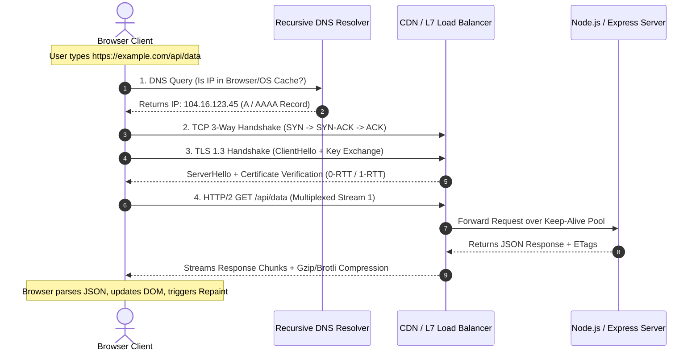
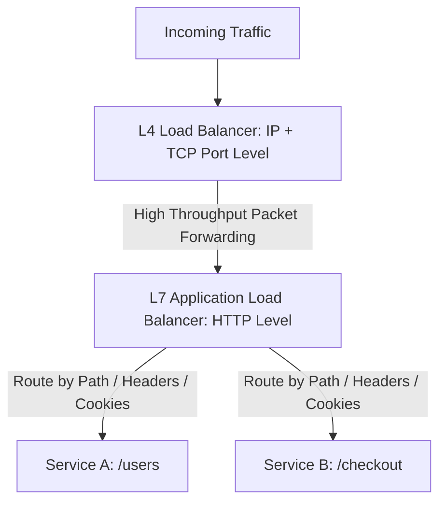

# 🌐 The Complete Web Network Request Lifecycle (DNS to HTTP/3)

> **🎯 Target Audience:** Staff & Principal Engineers
> **Focus:** Full protocol execution path from URL bar entry to browser pixel paint: DNS, TCP, TLS 1.3, HTTP/2 & HTTP/3 QUIC, CDN, L4/L7 Load Balancers, and Latency Breakdown.
> **Existing Repo Tags:** 🔗 [See Networking Module](file:///Users/atulkumarawasthi/projects/SystemDesign/Networking/README.md) | 🔗 [See HTTP Headers](file:///Users/atulkumarawasthi/projects/SystemDesign/Web/Headers.md) | 🔗 [See Web Fundamentals](file:///Users/atulkumarawasthi/projects/SystemDesign/Web/web.md)

---

## ⚡ 1. End-to-End Sequence Diagram

---

## 🔬 2. Protocol Evolution Matrix

| Layer        | Protocol      | Transport  | Key Feature                                                                                                          | Weakness / Tradeoff                                                 |
| :----------- | :------------ | :--------- | :------------------------------------------------------------------------------------------------------------------- | :------------------------------------------------------------------ |
| **HTTP/1.1** | Text-based    | TCP        | Persistent Keep-Alive connections                                                                                    | Head-of-Line (HOL) blocking at HTTP request level                   |
| **HTTP/2**   | Binary Frames | TCP        | Binary framing, Multiplexing over single TCP connection, Header compression (HPACK), Server Push                     | TCP-level Head-of-Line blocking (1 lost packet stalls all streams)  |
| **HTTP/3**   | Binary Frames | UDP (QUIC) | QUIC transport, zero HOL blocking, 0-RTT connection establishment, Connection migration across networks (WiFi to 5G) | Requires UDP support on network firewalls; high CPU load for crypto |

---

## ⚖️ 3. Load Balancing: L4 vs L7

- **L4 (Transport Layer):** Operates at TCP/UDP level without decrypting TLS payload. Blazing fast, lower CPU overhead.
- **L7 (Application Layer):** Decrypts TLS to inspect HTTP headers, path routes (`/api/v1`), cookies, and request bodies. Enables smart routing, canary deployments, and rate limiting.

---

## ❓ Collapsed Q&A Self-Testing Bank

❓ 1. Why does HTTP/2 still suffer from Head-of-Line (HOL) blocking at the TCP layer?

**Answer:**
HTTP/2 multiplexes multiple logical streams over a single underlying TCP connection. However, TCP guarantees strict sequential byte delivery. If a single packet belonging to Stream A is lost on the network, the OS TCP stack pauses delivery of _all_ subsequent packets (including Streams B and C) until the lost packet is retransmitted. HTTP/3 solves this by switching to UDP via the QUIC protocol, where each stream is isolated.

❓ 2. What is TLS 1.3 0-RTT Resumption and what security risk does it introduce?

**Answer:**
TLS 1.3 allows clients that have previously connected to a server to send encrypted application data on the very first packet (`ClientHello`), eliminating connection handshake latency completely (0-RTT).
**Security Risk:** 0-RTT data is susceptible to **Replay Attacks** because an attacker can capture the initial packet and re-send it to the server. To mitigate this, servers must restrict 0-RTT to idempotent HTTP requests (`GET` only, never `POST`).

