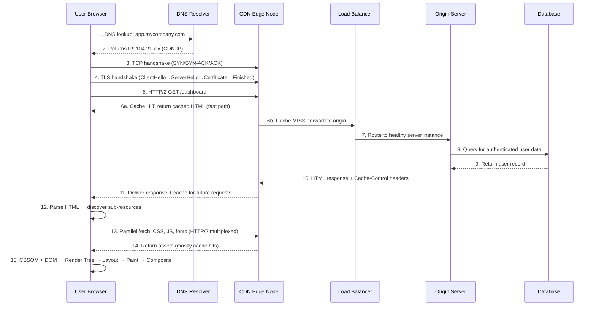

# 🌐 Networks & Web — Overview for Principal Frontend Architects

> Network knowledge is not optional at the Principal level. Every performance problem, every security vulnerability, and every real-time feature starts at the network layer. A Principal FE Architect who says "that's an infra problem" has abdicated their most important debugging tool.

---

## 🎯 Why Network Knowledge is Critical for Principal FE Architects

### The Direct Line from Networks to Your Job

```
User complains: "The page is slow"
    ↓
You open DevTools → Network tab
    ↓
You see: TTFB is 1.2s, resource is not cached, no HTTP/2, no compression
    ↓
You say: "The server isn't setting Cache-Control, the origin isn't HTTP/2,
          and we're missing Content-Encoding: gzip. Here are the three fixes."
    ↓
You are the architect who diagnosed it. Not the infra team. You.
```

Without network knowledge, you can observe symptoms. With it, you diagnose causes.

### The Five Ways Network Knowledge Changes Your Decisions

1. **Rendering strategy choices** — SSR vs CSR vs SSG depends on TTFB, RTT, and caching behavior
2. **API design** — choosing HTTP/2 multiplexing over HTTP/1.1 connection limits changes your bundling strategy
3. **Real-time architecture** — WebSocket vs SSE vs Long Polling are network-protocol decisions
4. **Security architecture** — CORS, HSTS, TLS configuration, SameSite cookies are all network-layer
5. **Performance optimization** — preconnect, prefetch, resource hints, compression, CDN — all network

> **🔑 Principal-Level Signal:** A Principal FE Architect owns the **full delivery pipeline** — from the request leaving the browser to the first pixel painted. Every layer in that pipeline is in scope.

---

## 🏗️ Full Stack of a Web Request — Layer by Layer

When a user types `https://app.mycompany.com/dashboard` and hits Enter, here's every layer involved:



### Each Layer — One Line

| Layer                  | What Happens                                                              | Your Lever                                                        |
| ---------------------- | ------------------------------------------------------------------------- | ----------------------------------------------------------------- |
| **DNS Resolution**     | Domain → IP address mapping via recursive resolvers                       | DNS TTL, GeoDNS routing, prefetch via `<link rel="dns-prefetch">` |
| **TCP Handshake**      | 3-way handshake establishes connection (1 RTT overhead)                   | Connection reuse via HTTP/2, preconnect hints                     |
| **TLS Handshake**      | Certificate exchange, cipher negotiation, session keys (1–2 RTT overhead) | TLS session resumption, 0-RTT (TLS 1.3), HSTS preload             |
| **HTTP Request**       | Method, path, headers sent to server                                      | HTTP/2 multiplexing, compression, cache headers                   |
| **CDN Edge**           | Serve from geographically close cache node                                | Cache-Control, Vary, cache invalidation strategy                  |
| **Load Balancer**      | Distribute traffic across healthy server instances                        | Health checks, sticky sessions, connection draining               |
| **Origin Server**      | Application logic, rendering, DB queries                                  | Response time optimization, streaming, connection pooling         |
| **Database**           | Persistent data retrieval                                                 | Query optimization, indexes, read replicas, connection pools      |
| **Response + Caching** | Server sends headers instructing downstream caches                        | Cache-Control, ETag, Surrogate-Control, Stale-While-Revalidate    |
| **HTML Parsing**       | Browser builds DOM, discovers sub-resources                               | Resource hints, script defer/async, inline critical CSS           |
| **Sub-resource Fetch** | CSS, JS, fonts, images — parallel in HTTP/2                               | Bundling strategy, lazy loading, preload                          |
| **Rendering Pipeline** | Layout, Paint, Composite — frames to screen                               | Avoiding layout thrash, promoting layers, CSS containment         |

---

## 📂 Files in This Section

| File                                          | Description                                        | Key Concepts                                                               |
| --------------------------------------------- | -------------------------------------------------- | -------------------------------------------------------------------------- |
| 📖 [`01-DNS-to-HTTP.md`](./01-DNS-to-HTTP.md) | Complete request lifecycle from DNS to HTTP/3 QUIC | DNS, TCP 3-Way Handshake, TLS 1.3 0-RTT, HTTP/1 vs /2 vs /3, L4/L7 LB, Q&A |

---

## 🧠 Key Mental Models for Networking

These mental models change how you make architectural decisions.

### Mental Model 1: Every Network Hop Has Latency

Latency is **additive**. Each hop adds overhead:

```
User → CDN Edge:          ~5–30ms   (geographic proximity)
CDN Edge → Load Balancer: ~1–5ms    (same datacenter or region)
Load Balancer → Server:   ~1–2ms    (same datacenter)
Server → Database:        ~1–10ms   (same datacenter)

Total minimum latency for an uncached, server-rendered page:
≈ 2 × RTT (TCP) + 2 × RTT (TLS) + 1 × server_time
≈ 2×20ms + 2×20ms + 50ms = 130ms before first byte

With TLS 1.3 and HTTP/2 + existing connection:
≈ 20ms (RTT) + 50ms (server_time) = 70ms
```

**Implication:** Every caching layer you add eliminates hops. SSG (static files served from CDN edge) has ~5ms TTFB. SSR with a warm database cache has ~50–100ms. SSR with cold queries has ~200–500ms.

### Mental Model 2: Bandwidth ≠ Latency

Bandwidth is how much data fits in the pipe. Latency is the round-trip time. High bandwidth doesn't fix high latency.

```
Example: Sending a 100KB file to a user with 100Mbps bandwidth and 200ms RTT

Transfer time = file_size / bandwidth = 100KB / 100Mbps = 8ms
But: wait for TCP handshake (200ms) + TLS handshake (200ms) = 400ms overhead

Total: 408ms for a 100KB file — 98% of the time is latency, not bandwidth
```

**Implication:** For frontend performance on mobile/high-latency networks, **reducing round trips** (connection reuse, caching, SSG) matters far more than reducing payload size.

### Mental Model 3: The Cache Hierarchy

```
L1: Browser Memory Cache        → ~0ms latency   (in-process, same tab)
L2: Browser Disk Cache          → ~1ms latency    (local disk, across tabs/sessions)
L3: Service Worker Cache        → ~2ms latency    (local disk, programmable control)
L4: CDN Edge Cache (closest)    → ~5–30ms latency (geographic proximity)
L5: CDN Origin Shield           → ~30–100ms       (CDN's shared regional cache)
L6: Application Cache (Redis)   → ~100–200ms      (network hop to Redis cluster)
L7: Database Query              → ~100–500ms      (query execution + network)
```

Every cache hit is a cache **miss** at all levels below it. Design your caching strategy from the top down. Ask: "Can this live at the browser cache? Can this live at the CDN edge? Does it need Redis?"

### Mental Model 4: HTTP Is Stateless — Sessions Are Invented

HTTP itself has no concept of "a user session." Sessions are a **layer 7 (application) abstraction** built on top of stateless HTTP using cookies or tokens. This matters for:

- **Horizontal scaling:** Session state must be externalized (Redis) or requests must be routed consistently (sticky sessions)
- **CDN caching:** Authenticated (session-based) requests often can't be cached at the CDN edge
- **GraphQL vs REST:** GraphQL's single endpoint doesn't naturally participate in HTTP caching

### Mental Model 5: TLS is Not Optional — It's Infrastructure

Every discussion of cookies (`Secure`, `SameSite`), CORS (`Access-Control-Allow-Credentials`), service workers, HTTP/2, and geolocation APIs **requires HTTPS**. HTTPS is not a performance cost — it's a prerequisite for every modern browser feature.

```
Without HTTPS you cannot:
- Use Service Workers (or PWA features)
- Set Secure cookies (auth tokens are unprotectable)
- Use HTTP/2 (all browsers require TLS for HTTP/2)
- Access geolocation, camera, microphone APIs
- Use modern auth flows (PKCE requires secure context)
```

---

## 🔍 Common Network Debugging Patterns

### Reading a Waterfall Diagram

The Chrome DevTools Network waterfall is your most important diagnostic tool. Each row has phases:

```
[Queueing] → [Stalled] → [DNS Lookup] → [Initial Connection] → [SSL] → [TTFB] → [Content Download]
```

- **Long Queueing:** Too many requests, HTTP/1.1 connection limit hit (max 6 per host)
- **Long Stalled:** Connection pool exhausted; waiting for a connection
- **Long DNS Lookup:** No `dns-prefetch` hint, slow resolver, high DNS TTL
- **Long Initial Connection + SSL:** New connection; add `preconnect`, switch to HTTP/2
- **Long TTFB:** Server processing time; investigate caching, query performance, server capacity
- **Long Content Download:** Large payload; add compression, reduce payload size

### Network Performance Checklist for FE Architects

Before shipping any new page or feature:

- [ ] Is this resource on the critical path? Can it be deferred?
- [ ] Is HTTP/2 enabled? (Connection → Protocol column in DevTools)
- [ ] Are responses compressed? (gzip or brotli in Content-Encoding header)
- [ ] Is there a CDN cache hit for static assets? (cf-cache-status or x-cache header)
- [ ] Are the correct Cache-Control headers set?
- [ ] Is there a `preconnect` for every third-party origin in the critical path?
- [ ] Is the first meaningful payload < 14KB? (TCP slow start initial window)
- [ ] Are web fonts using `font-display: swap`?
- [ ] Is TTFB < 200ms on a simulated Fast 3G connection?

---

## ❓ Q&A

<details>
<summary>❓ Q1: Why does HTTP/2 multiplexing reduce the need for CSS/JS bundling, and why don't we completely stop bundling?</summary>

**Answer:** In HTTP/1.1, browsers open a maximum of ~6 TCP connections per origin. Each connection can only carry one request at a time. This means fetching 100 small JS modules serially is catastrophically slow — each waits for the previous one to finish (head-of-line blocking). The workaround was bundling everything into fewer large files, so fewer requests were needed.

HTTP/2 uses a single TCP connection with **stream multiplexing** — up to 128+ concurrent streams on one connection. Hundreds of small files can be inflight simultaneously without head-of-line blocking at the HTTP layer. This makes "loading 100 small modules" viable — which is the foundation of ES module micro-bundling strategies.

**Why we don't completely stop bundling:**

1. **Compression efficiency:** A single large bundle compresses better than 100 small files (Gzip/Brotli are more effective on larger inputs with more repetition)
2. **TCP slow start:** Each connection still goes through TCP slow start — even over HTTP/2, there's one connection per origin that starts slow
3. **Parse cost:** 100 small JS files each have individual parsing overhead at the browser
4. **Cache granularity tradeoff:** Smaller chunks = better cache granularity (change one file, invalidate only that file) but more round trips for uncached scenarios

The principal-level answer: **use module federation or fine-grained code splitting on HTTP/2** — smaller chunks than traditional monolithic bundles, larger chunks than micro-module per-file. The right granularity is route-level or feature-level chunks, not file-level.

</details>

<details>
<summary>❓ Q2: What is TTFB, what causes high TTFB, and how would you diagnose and fix a TTFB of 1.5 seconds?</summary>

**Answer:** **TTFB (Time To First Byte)** is the time from when the browser sends the HTTP request to when it receives the first byte of the response body. It includes DNS resolution, TCP handshake, TLS handshake, request transmission, server processing, and network return time.

**Common causes of 1.5s TTFB:**

1. **No CDN / poor geographic proximity:** Request must travel from user → origin server across continents
2. **Cold server start:** Serverless function cold start, JVM startup, etc.
3. **Slow database query:** N+1 query, missing index, unoptimized join
4. **Synchronous 3rd-party API call in request path:** Calling a slow external service blocks the response
5. **No caching:** Every request hits the database; no Redis, no CDN
6. **Server is under-resourced:** CPU/memory constrained, garbage collection pauses

**Diagnosis steps:**

```
1. Open DevTools → Network tab → Click the request → Timing tab
2. Check each phase:
   - DNS: long? → Add dns-prefetch or move to CDN
   - Initial Connection: long? → Enable HTTP/2, add preconnect
   - SSL: long? → TLS session resumption, consider HSTS preload
   - TTFB (Waiting): long? → Server-side problem
3. For "Waiting" being long:
   - Check server APM (Datadog, New Relic) for slow traces
   - Check database query time (look for p99 spikes)
   - Check if external API calls are in the critical path
   - Check server CPU/memory under load
```

**Fixes (in order of impact):**

- Add CDN edge caching for the response (eliminates origin trip for cache hits)
- Add application-layer cache (Redis) for expensive DB queries
- Move synchronous 3rd-party API calls to async/background processing
- Add database indexes on filter columns
- Enable connection pooling on the database

</details>

<details>
<summary>❓ Q3: CORS errors happen in the browser, not the server. Why does this matter for how you design CORS policy?</summary>

**Answer:** This is one of the most misunderstood aspects of CORS. The CORS policy is **enforced by the browser** — it reads the `Access-Control-Allow-Origin` header from the server's response and decides whether to give the JavaScript application access to that response. The server always processes and responds to the request — the browser just decides whether the script can read the response.

**Critical implications for security design:**

1. **CORS is not a server security mechanism** — it only protects the browser client from cross-origin script access. A malicious server or a non-browser client (curl, Postman, another server) ignores CORS entirely.

2. **CORS does not prevent CSRF attacks** — the request is still sent; CORS just controls whether the JavaScript can read the response. CSRF protection requires SameSite cookies or CSRF tokens.

3. **`Access-Control-Allow-Origin: *` breaks credential requests** — you cannot use `*` with `Access-Control-Allow-Credentials: true`. Browsers will reject this. You must specify the exact origin for credentialed cross-origin requests.

4. **Preflight requests have a cost** — complex requests (custom headers, non-simple methods like PUT/DELETE) trigger a preflight OPTIONS request before the real request. This doubles the number of round trips. Mitigation: set `Access-Control-Max-Age` to cache preflight results (e.g., 24 hours).

**The architect-level decision:** CORS policy should be set with an explicit allowlist of origins (not `*` for production), and the decision of "which origins to allow" should be treated as a security decision, not an infra convenience setting.

</details>

---

_Start with [`01-HTTP-Deep-Dive.md`](./01-HTTP-Deep-Dive.md) and work through the files in order — each builds on the previous._
