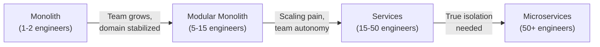
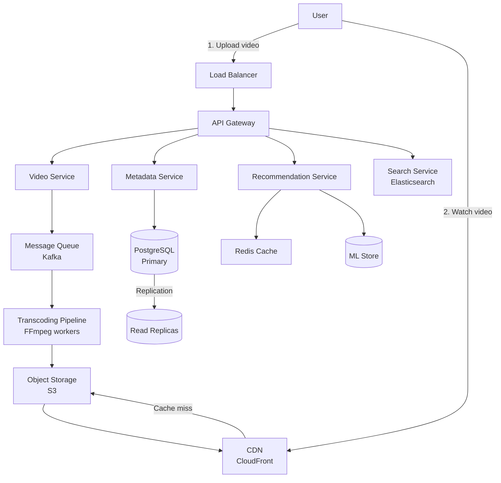
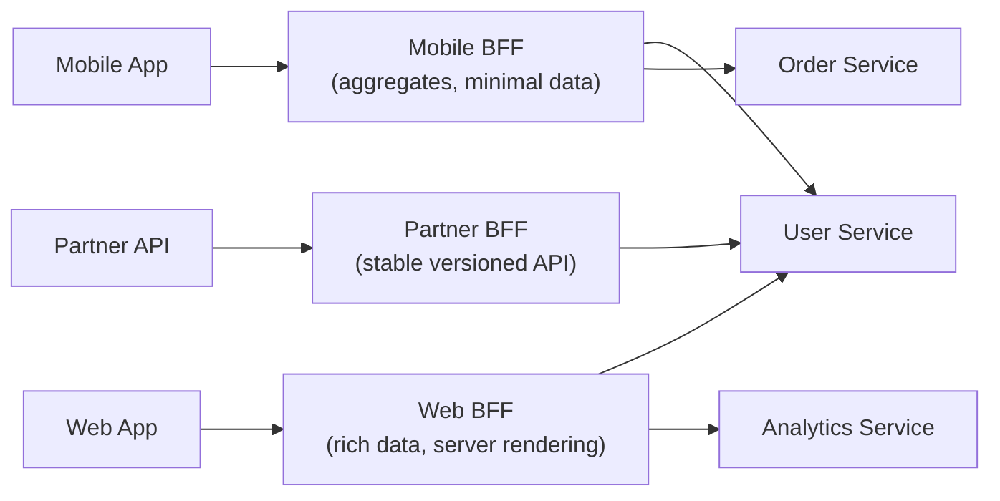
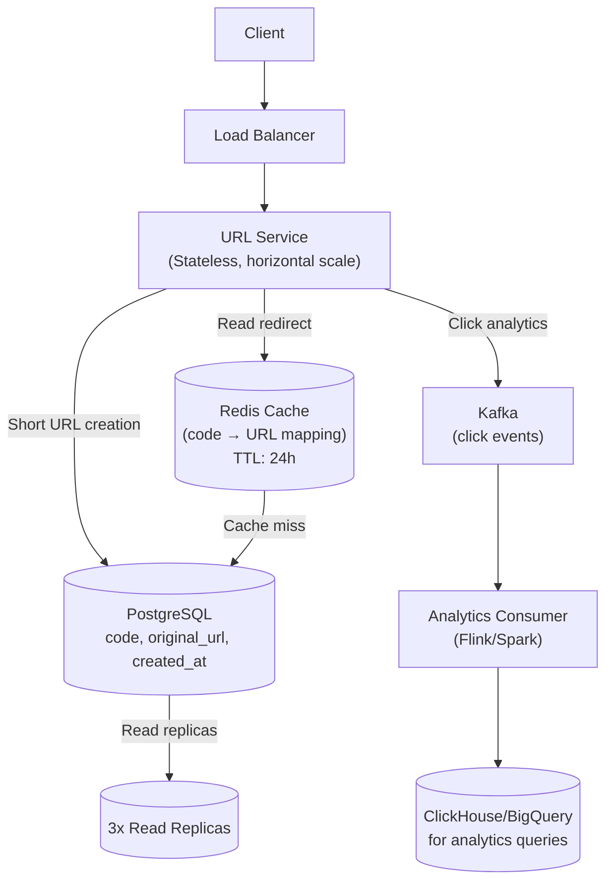
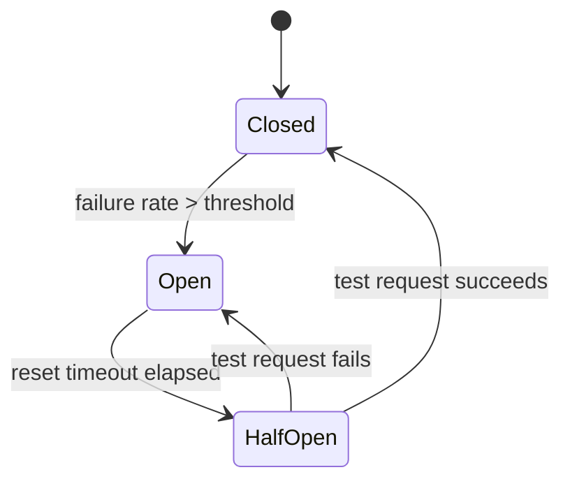
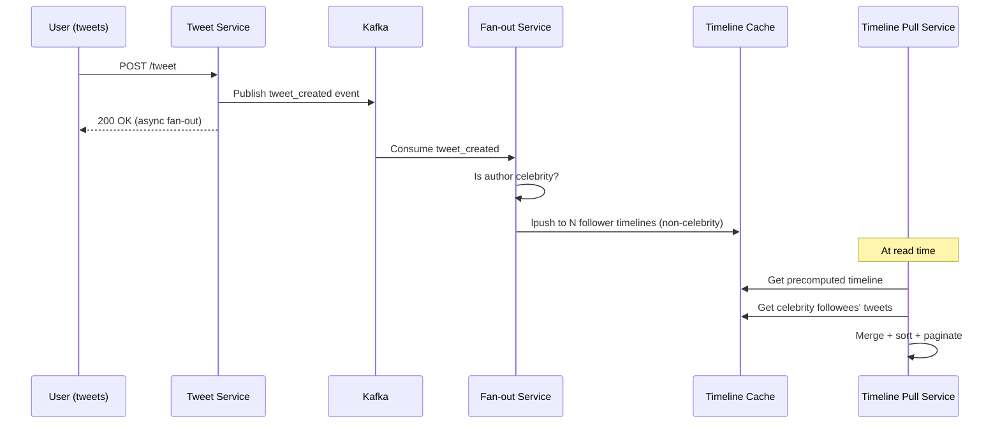
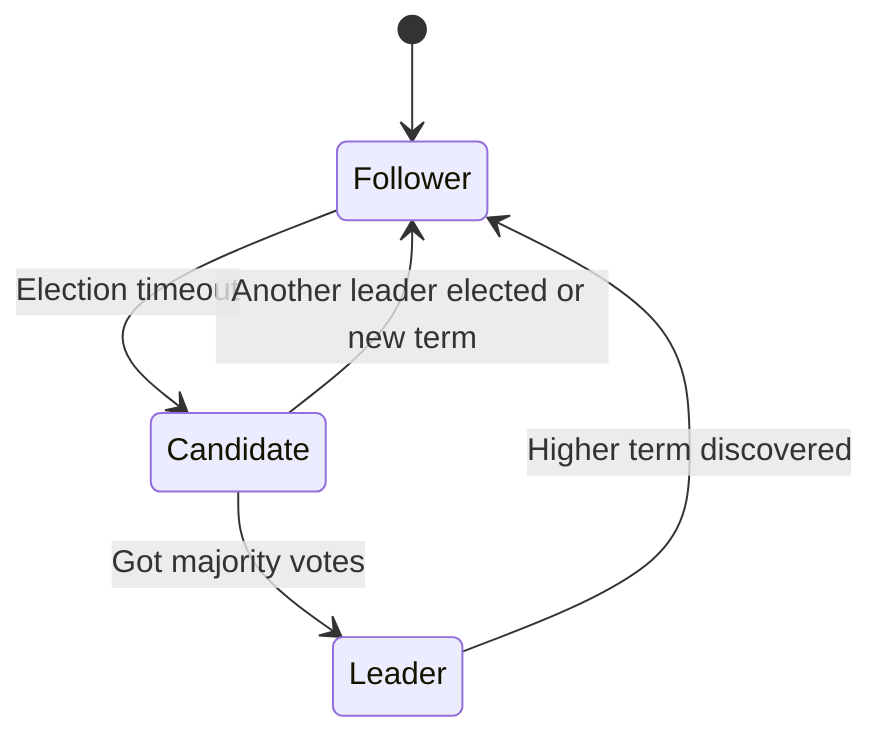
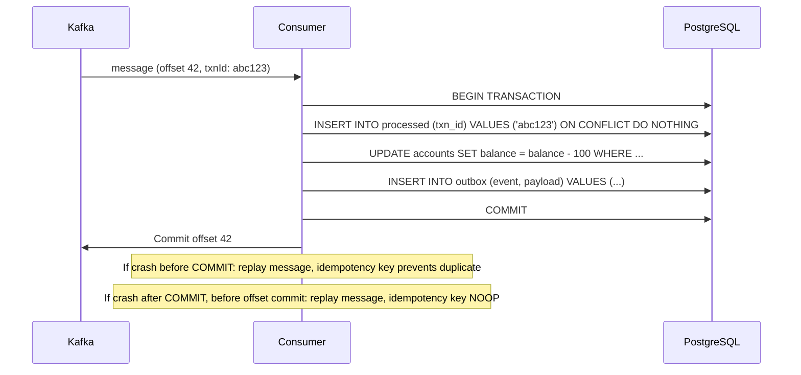
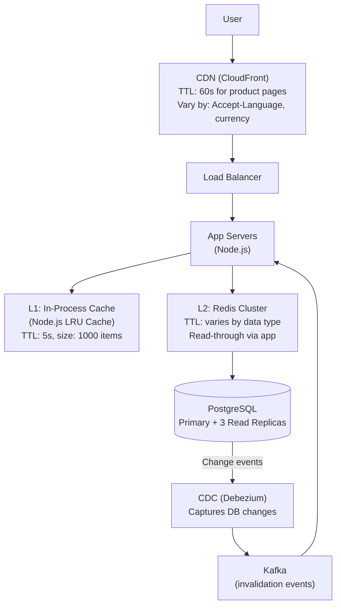
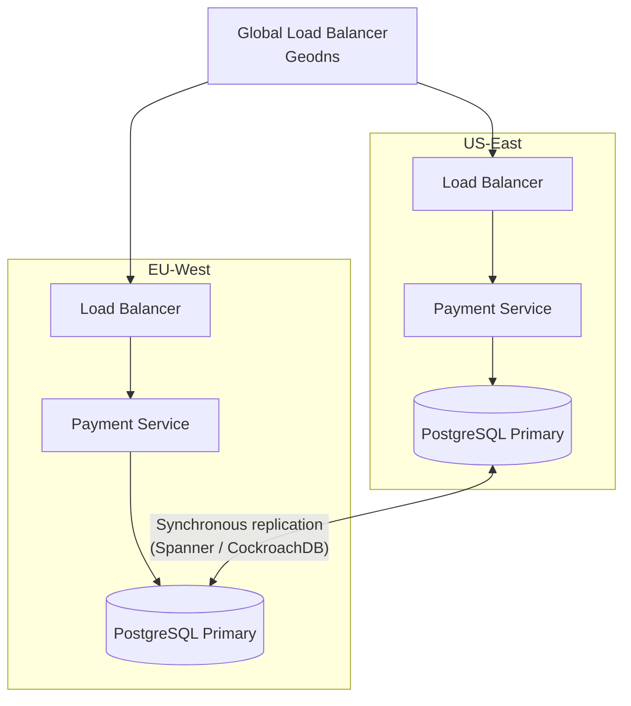

# 🏛️ High-Level Design (HLD) — Interview Q&A

> **Usage:** Click any question to reveal the full answer. The "drill-deeper" follow-ups are where Principal-level differentiation happens.

---

## 📋 Table of Contents

- [🏛️ High-Level Design (HLD) — Interview Q\&A](#️-high-level-design-hld--interview-qa)
  - [📋 Table of Contents](#-table-of-contents)
  - [🏗️ Architecture Patterns Questions](#️-architecture-patterns-questions)
  - [🌐 Distributed Systems Questions](#-distributed-systems-questions)
  - [🗄️ Databases \& Caching Questions](#️-databases--caching-questions)
  - [📨 Messaging \& Events Questions](#-messaging--events-questions)
  - [🛡️ Availability \& Reliability Questions](#️-availability--reliability-questions)
  - [📊 Summary: Difficulty Distribution](#-summary-difficulty-distribution)

---

## 🏗️ Architecture Patterns Questions

---

<details>
<summary>❓ Q1 [Medium] — Explain Microservices vs Monolith. When should a startup use a monolith despite all the microservices hype?</summary>

**Answer:**

**Monolith:** Single deployable unit. All modules deployed together, share a process, communicate via function calls.

**Microservices:** Independently deployable services. Each service owns its data, communicates via network (HTTP/gRPC/messaging).

**The hype vs reality:**

Most startups that jump to microservices immediately create a **distributed monolith** — services tightly coupled over the network, all deploying together, sharing a database. This is worse than a monolith: you get network latency, distributed tracing complexity, AND all the coupling of a monolith.

**Use a Monolith when:**

- Team < 10 engineers
- Domain is not yet well-understood (boundaries will change)
- Product-market fit not established
- Deployment complexity would slow feature velocity
- You don't have the operational maturity (observability, CI/CD, on-call)

**Use Microservices when:**

- Different services have vastly different scaling requirements
- Teams are large enough to own independent services (Conway's Law)
- You need independent deployment velocity for different domains
- Compliance/regulatory isolation is required
- You've already built the monolith and understand the domain boundaries

```
Monolith → Modular Monolith → Services (bounded by domain) → Microservices

Migrate right when the PAIN of staying left exceeds the PAIN of moving right.
```

**The modular monolith** (Amazon's approach early on, Shopify today) is often the best of both: organize code into modules with strict API boundaries, deploy as one unit. You get refactoring safety and operational simplicity.



**🔁 Drill Deeper:** _"Netflix, Uber, Amazon all moved to microservices. But these are 1000-engineer organizations. How do you decide which services to extract first from a monolith?"_

</details>

---

<details>
<summary>❓ Q2 [Hard] — Design the architecture for a globally distributed content platform (like YouTube). Walk through your major architecture decisions.</summary>

**Answer:**

This is a system design walkthrough, not just a question. The answer demonstrates architectural thinking.

**Clarifying questions first:**

- Read-heavy vs write-heavy? (YouTube: 500 hours/min upload, billions views/day → overwhelmingly read-heavy)
- Consistency requirements? (View counts can be eventually consistent; comments need eventual)
- Latency requirements? (< 100ms for video start)

**High-Level Architecture:**



**Key decisions and WHY:**

**1. CDN for video delivery:**
Storing video in S3 and serving it directly would be catastrophically slow for global users. CDN edge nodes cache video segments near users. YouTube uses their own CDN infrastructure, but the principle is the same.

**2. Async video processing (Kafka + workers):**
When a user uploads, the upload completes immediately (fast feedback) but transcoding happens asynchronously. You need to transcode to 360p, 480p, 720p, 1080p, 4K — each takes time. The queue decouples upload velocity from transcoding capacity.

**3. Chunked streaming (HLS/DASH):**
Videos aren't served as one file. They're split into 2-10 second chunks. The client downloads the next few chunks ahead. This enables adaptive bitrate streaming — switch quality based on connection.

**4. Metadata vs video storage separation:**
Video binary data → Object storage (S3)
Video metadata (title, description, likes, comments) → Relational DB with read replicas
Search index → Elasticsearch (not a SQL LIKE query)
Recommendations → Separate ML service

**5. Database per service (not shared DB):**
User service owns users table. Video service owns videos table. Comments service owns comments. Never a join across service boundaries. Cross-service queries → API calls.

**Scaling bottlenecks to address:**

- **Hot videos** (viral content) → CDN handles, but also regional caching
- **View count accuracy** → Approximate counting with Redis HLL, batch sync to DB
- **Search** → Elasticsearch cluster with replication
- **Recommendations** → Precomputed (offline ML batch), served from Redis

**🔁 Drill Deeper:** _"When a video goes viral and 10 million users watch simultaneously, what part of your architecture becomes the bottleneck? How do you handle it without pre-provisioning for maximum load?"_

</details>

---

<details>
<summary>❓ Q3 [Hard] — Explain Event-Driven Architecture (EDA). What are the tradeoffs vs request/response, and what problems does it introduce?</summary>

**Answer:**

**Event-Driven Architecture (EDA):** Services communicate by producing and consuming events. The producer doesn't know who consumes the event. Events represent facts: "UserCreated", "OrderPlaced", "PaymentFailed".

**Request/Response (RPC/REST):**

- Synchronous: caller waits for result
- Tight coupling: caller must know address of callee
- Simple to reason about: it either worked or it didn't
- Fails together: if callee is down, caller fails

**Event-Driven:**

- Asynchronous: producer fires and forgets
- Loose coupling: producer doesn't know consumers
- Complex to reason about: eventual consistency, ordering
- Resilient: consumers can be down and catch up later

```typescript
// REQUEST/RESPONSE (tight coupling)
class OrderService {
  constructor(
    private inventoryService: InventoryService, // hard dependency
    private paymentService: PaymentService, // hard dependency
    private emailService: EmailService, // hard dependency
  ) {}

  async placeOrder(order: Order): Promise<void> {
    await this.inventoryService.reserve(order.items); // if this fails...
    await this.paymentService.charge(order.payment); // ...this doesn't run
    await this.emailService.sendConfirmation(order); // ...this doesn't run
  }
}

// EVENT-DRIVEN (loose coupling)
class OrderService {
  constructor(private eventBus: EventBus) {}

  async placeOrder(order: Order): Promise<void> {
    // Just emit the event — no knowledge of downstream consumers
    await this.eventBus.publish({
      type: 'order.placed',
      payload: order,
      timestamp: new Date(),
    });
  }
}

// Each consumer subscribes independently
inventoryConsumer.subscribe('order.placed', async (event) => {
  await reserve(event.payload.items);
});

paymentConsumer.subscribe('order.placed', async (event) => {
  await charge(event.payload.payment);
});
```

**Problems EDA introduces:**

| Problem                  | Description                                        | Mitigation                                               |
| ------------------------ | -------------------------------------------------- | -------------------------------------------------------- |
| **Eventual consistency** | Data isn't immediately consistent                  | Accept it; use sagas for business consistency            |
| **Ordering**             | Events may arrive out of order                     | Partition keys in Kafka; sequence numbers                |
| **Debugging**            | Hard to trace a request across services            | Distributed tracing (Jaeger, Zipkin); correlation IDs    |
| **Duplicates**           | At-least-once delivery causes duplicate processing | Idempotency keys; deduplication in consumers             |
| **Schema evolution**     | Event schema changes break consumers               | Schema registry (Confluent); backward-compatible changes |
| **Testing**              | Integration tests are harder                       | Contract testing; event simulation                       |

**When EDA is the right choice:**

- Multiple downstream consumers of the same event (fan-out)
- Consumers run at different speeds
- Services need to be deployed independently
- You need an audit trail (event log = history)
- Cross-domain communication (notifications, analytics, reporting)

**When it's wrong:**

- You need a synchronous response (user waiting for a result)
- Consistency is critical and can't be eventually consistent
- Team doesn't have the operational maturity

**🔁 Drill Deeper:** _"What is the Saga pattern and how does it maintain business consistency across multiple services in an event-driven system? Compare choreography vs orchestration sagas."_

</details>

---

<details>
<summary>❓ Q4 [Hard] — What is CQRS? When is it worth the added complexity? Show how it combines with Event Sourcing.</summary>

**Answer:**

**CQRS (Command Query Responsibility Segregation):** Separate the read model from the write model. Commands change state. Queries read state. They use different models, often different databases.

**Traditional architecture (read and write from same model):**

```typescript
// Same model for reads and writes — causes compromise
class UserRepository {
  async findUser(id: string): Promise<User> {
    /* complex joins */
  }
  async saveUser(user: User): Promise<void> {
    /* write to same table */
  }
}
```

**CQRS:**

```typescript
// WRITE SIDE: optimized for consistency and business rules
class UserCommandHandler {
  async handle(command: CreateUserCommand): Promise<void> {
    const user = User.create(command.name, command.email); // domain logic
    await this.writeRepo.save(user);
    await this.eventBus.publish(new UserCreatedEvent(user));
  }
}

// READ SIDE: optimized for query performance
class UserQueryHandler {
  async getUserProfile(userId: string): Promise<UserProfileView> {
    // Denormalized read model — pre-joined, pre-aggregated
    return this.readDb.query(
      'SELECT u.*, COUNT(o.id) as order_count FROM user_views u LEFT JOIN order_counts o ON o.user_id = u.id WHERE u.id = $1',
      [userId],
    );
  }
}

// Event updates the read model asynchronously
userCreatedConsumer.subscribe('user.created', async (event) => {
  await readDb.upsert('user_views', {
    id: event.userId,
    displayName: `${event.firstName} ${event.lastName}`,
    orderCount: 0,
    // ... denormalized fields
  });
});
```

**Event Sourcing (ES):** Instead of storing current state, store the **sequence of events** that led to current state. The current state is derived by replaying events.

```typescript
// Event Sourcing: instead of storing { balance: 1500 }
// Store: [AccountOpened(1000), Deposited(500), Withdrawn(0)]
interface Event {
  eventId: string;
  aggregateId: string;
  eventType: string;
  data: unknown;
  timestamp: Date;
  version: number; // for optimistic concurrency
}

class BankAccount {
  private balance = 0;
  private version = 0;
  private uncommittedEvents: Event[] = [];

  // Rebuild state from event history
  static fromHistory(events: Event[]): BankAccount {
    const account = new BankAccount();
    events.forEach((e) => account.apply(e));
    return account;
  }

  deposit(amount: number): void {
    if (amount <= 0) throw new Error('Amount must be positive');
    this.raise({ eventType: 'Deposited', data: { amount } });
  }

  withdraw(amount: number): void {
    if (amount > this.balance) throw new Error('Insufficient funds');
    this.raise({ eventType: 'Withdrawn', data: { amount } });
  }

  private raise(event: Partial<Event>): void {
    const fullEvent = { ...event, version: ++this.version } as Event;
    this.apply(fullEvent);
    this.uncommittedEvents.push(fullEvent);
  }

  private apply(event: Event): void {
    switch (event.eventType) {
      case 'AccountOpened':
        this.balance = (event.data as any).initialDeposit;
        break;
      case 'Deposited':
        this.balance += (event.data as any).amount;
        break;
      case 'Withdrawn':
        this.balance -= (event.data as any).amount;
        break;
    }
  }
}
```

**ES benefits:**

- Complete audit log (regulatory compliance)
- Time-travel debugging (replay to any point in time)
- Multiple projections (different read models from same events)
- Event replay to rebuild/update read models

**ES costs:**

- Eventually consistent read models
- More complex querying (can't just SELECT)
- Event schema evolution is hard
- Storage grows unboundedly (mitigated with snapshots)

**When CQRS+ES is worth it:**

- Financial systems (every transaction must be recorded)
- Audit-heavy domains (healthcare, legal)
- Complex domain logic that benefits from temporal queries
- Read patterns differ dramatically from write patterns (social feed vs write post)

**When it's overkill:**

- Simple CRUD apps
- Small teams who can't maintain two data models
- When eventual consistency is unacceptable to users

**🔁 Drill Deeper:** _"Event sourcing stores events forever. A social media platform might have billions of events. How do you handle storage costs and query performance? What is an 'event snapshot'?"_

</details>

---

<details>
<summary>❓ Q5 [Medium] — Explain the API Gateway pattern. What does it do beyond just routing? When do you add one vs talk directly to services?</summary>

**Answer:**

**API Gateway:** A server that acts as the entry point for all client requests. It routes requests to appropriate microservices but also handles cross-cutting concerns.

**What an API Gateway does:**

```
Client → API Gateway → Service A
                     → Service B
                     → Service C

Cross-cutting concerns handled at Gateway:
1. Authentication/Authorization (JWT validation)
2. Rate Limiting
3. Request/Response transformation
4. SSL termination
5. Load balancing
6. Circuit breaking
7. Caching
8. Request aggregation (BFF pattern)
9. Logging and metrics
10. A/B testing / traffic splitting
```

**Without API Gateway — each service handles all cross-cutting concerns:**

```typescript
// ❌ Every service must implement auth, rate limiting, logging...
class UserService {
  async getUser(req: Request) {
    // Duplicate auth logic in every service:
    const token = req.headers.authorization;
    const user = await this.jwtService.verify(token); // every service does this
    this.rateLimiter.check(user.id); // every service does this
    this.logger.log(req); // every service does this
    // ...actual business logic
  }
}
```

**With API Gateway:**

```typescript
// ✅ Auth, rate limiting, logging handled once at the gateway
// Services only handle business logic
class UserService {
  async getUser(req: Request) {
    // req.user already populated by gateway
    // Rate limit already checked by gateway
    return this.userRepo.findById(req.user.id);
  }
}
```

**BFF (Backend for Frontend) pattern:**
One API Gateway per client type — mobile BFF, web BFF, partner BFF. Each aggregates and transforms data differently for its client:



**When to skip an API Gateway:**

- Monolith (no services to route between)
- Internal services (service-to-service) — use service mesh (Istio) instead
- Very small number of services where an API gateway is heavier than the service

**Popular choices:** AWS API Gateway, Kong, NGINX, Traefik, Envoy, BFF implemented in Node.js/Go.

**🔁 Drill Deeper:** _"What's the difference between an API Gateway and a Service Mesh (like Istio)? They both handle cross-cutting concerns — do you need both?"_

</details>

---

<details>
<summary>❓ Q6 [Hard] — Design a URL shortener like bit.ly. Focus on the architecture and key decisions for scale.</summary>

**Answer:**

**Clarifying questions:**

- Scale: 100M new URLs/day? Or 1M?
- Analytics needed? (click counts, geolocation, device type)
- Custom slugs? (vanity URLs)
- URL expiration?

**Assuming: 100M new URLs/day, 10B redirects/day (100:1 read:write)**

**Core API:**

```
POST /shorten   { url: "https://...", customSlug?: "mylink" } → { shortCode: "abc123" }
GET  /:code     → 301/302 redirect to original URL
GET  /:code/stats → click analytics
```

**Short code generation:**

Option A — Counter-based (predictable, sequential):

```typescript
// Encode a base62 counter
function encode(num: number): string {
  const chars = '0123456789ABCDEFGHIJKLMNOPQRSTUVWXYZabcdefghijklmnopqrstuvwxyz';
  let result = '';
  while (num > 0) {
    result = chars[num % 62] + result;
    num = Math.floor(num / 62);
  }
  return result.padStart(7, '0'); // 62^7 = 3.5 trillion URLs
}
// Problem: predictable — competitors can enumerate your URLs
```

Option B — MD5/SHA hash (random, collision risk):

```typescript
import { createHash } from 'crypto';
function generateShortCode(url: string): string {
  const hash = createHash('md5').update(url).digest('hex');
  return hash.substring(0, 7); // First 7 chars, check collision
}
```

Option C — UUID → base62 encode (best for distributed):

```typescript
import { randomUUID } from 'crypto';
function generateCode(): string {
  const uuid = randomUUID().replace(/-/g, '');
  const num = BigInt(`0x${uuid}`);
  return encode(Number(num % BigInt(3_521_614_606_208))); // 62^7
}
```

**Architecture:**



**Key decisions:**

**1. 301 vs 302 redirect:**

- `301 Permanent`: Browser caches the redirect → fewer server hits (CDN-cacheable)
- `302 Temporary`: No browser cache → you can track every click, update destination

If analytics matter → 302. If scale matters and analytics are approximate → 301.

**2. Cache strategy:**

- Cache code→URL mapping in Redis
- 80/20 rule: 20% of URLs drive 80% of traffic → cache top 20%
- TTL: 24h (or TTL of the URL if expiration is a feature)

**3. Database:**

- Single write primary for URL creation (counter-based ID)
- 3+ read replicas for redirect resolution (before Redis warm-up)
- Index on `short_code` column — this is the hot read path

**4. Analytics decoupling:**

- Never write to analytics DB synchronously on redirect (too slow)
- Emit to Kafka: `{ code, timestamp, ip, user_agent, referer }`
- Consumer aggregates into ClickHouse for analytics queries

**Capacity estimation:**

- 100M URLs/day = ~1,200 writes/second
- 10B redirects/day = ~116,000 reads/second
- Each URL record: ~500 bytes → 100M × 500B = 50GB/day
- Redis cache: 100M hot URLs × 500B = 50GB RAM (feasible)

**🔁 Drill Deeper:** _"How do you prevent malicious URLs? If someone shortens `malware.com`, you'll be serving that redirect. What's the architecture for real-time URL safety scanning?"_

</details>

---

<details>
<summary>❓ Q7 [Hard] — Explain the Circuit Breaker pattern. Implement it and explain the state machine. Where does it go in the architecture?</summary>

**Answer:**

**Circuit Breaker:** When calls to a downstream service are failing, stop trying. "Open" the circuit so calls fail fast (without waiting for timeout), let the system breathe, then try again periodically.

**State Machine:**



- **Closed:** Normal operation. Requests pass through. Track failure rate.
- **Open:** Fast-fail. All requests immediately return error. No calls to downstream.
- **Half-Open:** Test mode. Allow limited requests. If they succeed → Closed. If fail → Open again.

```typescript
type CircuitState = 'CLOSED' | 'OPEN' | 'HALF_OPEN';

interface CircuitBreakerOptions {
  failureThreshold: number; // % failures to open (e.g., 50 = 50%)
  recoveryTimeout: number; // ms to wait before trying again
  halfOpenRequests: number; // how many test requests in half-open
  windowSize: number; // rolling window for failure counting (ms)
}

class CircuitBreaker {
  private state: CircuitState = 'CLOSED';
  private failures = 0;
  private successes = 0;
  private totalRequests = 0;
  private lastFailureTime: number = 0;
  private halfOpenCount = 0;

  constructor(
    private fn: (...args: unknown[]) => Promise<unknown>,
    private options: CircuitBreakerOptions,
  ) {}

  async call(...args: unknown[]): Promise<unknown> {
    if (this.state === 'OPEN') {
      // Check if recovery timeout has elapsed
      if (Date.now() - this.lastFailureTime >= this.options.recoveryTimeout) {
        this.state = 'HALF_OPEN';
        this.halfOpenCount = 0;
        console.log('[CircuitBreaker] Transitioning to HALF_OPEN');
      } else {
        throw new Error('Circuit breaker is OPEN — request rejected');
      }
    }

    if (this.state === 'HALF_OPEN' && this.halfOpenCount >= this.options.halfOpenRequests) {
      throw new Error('Circuit breaker is HALF_OPEN — too many test requests');
    }

    try {
      const result = await this.fn(...args);
      this.onSuccess();
      return result;
    } catch (error) {
      this.onFailure();
      throw error;
    }
  }

  private onSuccess(): void {
    this.successes++;
    this.totalRequests++;

    if (this.state === 'HALF_OPEN') {
      this.halfOpenCount++;
      if (this.halfOpenCount >= this.options.halfOpenRequests) {
        this.reset();
        console.log('[CircuitBreaker] Transitioned to CLOSED');
      }
    }
  }

  private onFailure(): void {
    this.failures++;
    this.totalRequests++;
    this.lastFailureTime = Date.now();

    const failureRate = (this.failures / this.totalRequests) * 100;

    if (failureRate >= this.options.failureThreshold || this.state === 'HALF_OPEN') {
      this.state = 'OPEN';
      console.log(`[CircuitBreaker] Transitioned to OPEN. Failure rate: ${failureRate.toFixed(1)}%`);
    }
  }

  private reset(): void {
    this.state = 'CLOSED';
    this.failures = 0;
    this.successes = 0;
    this.totalRequests = 0;
  }

  getState(): CircuitState {
    return this.state;
  }
}

// Usage
const paymentCircuitBreaker = new CircuitBreaker((amount: number) => stripeClient.charge(amount), {
  failureThreshold: 50,
  recoveryTimeout: 30000,
  halfOpenRequests: 3,
  windowSize: 60000,
});

async function processPayment(amount: number) {
  try {
    return await paymentCircuitBreaker.call(amount);
  } catch (err) {
    if (err.message.includes('OPEN')) {
      // Circuit is open — serve fallback or enqueue for later
      return await queuePaymentForRetry(amount);
    }
    throw err;
  }
}
```

**Where in the architecture:**

- Between services in a microservice mesh (often in the service mesh layer — Istio/Envoy handle this automatically)
- In your HTTP client wrapper
- In API Gateway for downstream service calls

**🔁 Drill Deeper:** _"What's the difference between a Circuit Breaker and a Retry with backoff? Should you use both together? What's the risk of combining them incorrectly?"_

</details>

---

<details>
<summary>❓ Q8 [Principal-Level] — Design Twitter's tweet fan-out system. Walk through the push vs pull model decision, the hybrid approach, and how to handle celebrities.</summary>

**Answer:**

**The problem:** When a user tweets, how do their followers see the tweet in their timeline?

**Scale assumptions:**

- 500M users, 150M DAU
- Average user: 200 followers
- Celebrity: 100M followers
- 500M tweets/day (~6000 tweets/sec)

**Option 1: Pull model (read-on-request)**

When user opens timeline → query all their followees → sort by time → return.

```sql
SELECT tweets.*
FROM tweets
JOIN follows ON follows.followed_id = tweets.user_id
WHERE follows.follower_id = :user_id
ORDER BY tweets.created_at DESC
LIMIT 20;
```

**Problem:** For a user following 1000 people, this query scans/joins millions of rows. At 150M DAU × multiple refreshes = the DB is destroyed.

**Option 2: Push model (fan-out on write)**

When user tweets → immediately write tweet into each follower's timeline cache.

```typescript
async function onTweetCreated(tweet: Tweet, author: User): Promise<void> {
  const followers = await followersRepo.getAll(author.id); // get all followers

  // Fan-out: write to every follower's timeline
  await Promise.all(followers.map((followerId) => timelineCache.lpush(`timeline:${followerId}`, tweet.id)));
}
```

**Problem with celebrities:** Lady Gaga tweets → fan-out to 100M followers → 100M Redis writes in seconds. This is a thundering herd that kills your infrastructure.

**Option 3: Hybrid model (Twitter's actual approach)**

```
Regular users (< N followers) → PUSH model (pre-computed timelines)
Celebrities (> N followers) → PULL model (not pre-computed)

At read time:
Timeline = precomputed_timeline + celebrity_tweets_from_followees
```

```typescript
const CELEBRITY_THRESHOLD = 100_000; // followers

// Fan-out with celebrity filter
async function onTweetCreated(tweet: Tweet, author: User): Promise<void> {
  if (author.followerCount > CELEBRITY_THRESHOLD) {
    // Celebrity: don't fan-out, store tweet in celebrity timeline only
    await tweetStore.save(tweet);
    return;
  }

  // Regular user: fan-out to followers
  const followers = await followersRepo.getAll(author.id);
  const pipeline = redis.pipeline();

  followers.forEach((followerId) => {
    pipeline.lpush(`timeline:${followerId}`, tweet.id);
    pipeline.ltrim(`timeline:${followerId}`, 0, 799); // keep 800 most recent
  });

  await pipeline.exec();
}

// Timeline read: merge precomputed + celebrity
async function getTimeline(userId: string): Promise<Tweet[]> {
  // 1. Get precomputed timeline (regular users)
  const precomputed = await redis.lrange(`timeline:${userId}`, 0, 99);

  // 2. Get celebrities this user follows
  const celebrities = await followersRepo.getCelebrityFollowees(userId);

  // 3. For each celebrity, fetch their recent tweets
  const celebrityTweets = await Promise.all(celebrities.map((c) => tweetStore.getRecentByUser(c.id, 20)));

  // 4. Merge and sort
  const allTweetIds = [...precomputed, ...celebrityTweets.flat().map((t) => t.id)];

  // Fetch full tweet objects and sort
  const tweets = await tweetStore.getByIds(allTweetIds);
  return tweets.sort((a, b) => b.createdAt - a.createdAt).slice(0, 20);
}
```

**Architecture diagram:**



**🔁 Drill Deeper:** _"What happens when a celebrity user gains followers rapidly (say, during a viral moment)? Your CELEBRITY_THRESHOLD check is now stale for existing pre-computed timelines. How do you handle this transition?"_

</details>

---

## 🌐 Distributed Systems Questions

---

<details>
<summary>❓ Q9 [Hard] — Explain the CAP Theorem. Is it still useful in 2024, or is it outdated? What is PACELC and why does it matter more?</summary>

**Answer:**

**CAP Theorem (Brewer, 2000):** A distributed system can only guarantee two of:

- **C**onsistency: Every read receives the most recent write
- **A**vailability: Every request receives a response (not necessarily current)
- **P**artition Tolerance: System continues operating despite network partitions

**The catch:** In distributed systems, **partitions will happen** (networks are unreliable). So the real choice is: **when a partition occurs, do you sacrifice Consistency or Availability?**

| Behavior                        | System Examples                        | Tradeoff                                                         |
| ------------------------------- | -------------------------------------- | ---------------------------------------------------------------- |
| **CP** (sacrifice availability) | HBase, ZooKeeper, MongoDB (configured) | Returns error during partition rather than stale data            |
| **AP** (sacrifice consistency)  | Cassandra, CouchDB, DynamoDB           | Returns possibly stale data during partition                     |
| **CA** (no partition tolerance) | Traditional RDBMS (single node)        | Only works if you never have network partitions = single machine |

**Why CAP is limited:**
CAP only considers partition scenarios. But **most of the time, there are no partitions** — what's the behavior then? CAP says nothing.

**PACELC (Abadi, 2012):** Extends CAP to cover normal operation:
"If Partitioned: Availability vs Consistency. Else: Latency vs Consistency"

| System    | Partition       | Normal Operation |
| --------- | --------------- | ---------------- |
| Cassandra | PA (Available)  | EL (Low Latency) |
| DynamoDB  | PA              | EL               |
| HBase     | PC (Consistent) | EC (Consistent)  |
| Spanner   | PC              | EC               |
| MySQL     | PC              | EC               |

**PACELC matters more because:**
Partitions are rare (1% of the time). The latency vs consistency tradeoff is **always present** (99% of the time). Real systems care more about "is my read always up-to-date or can it be 1 second stale?" than "what happens during a network split?"

**Practical guidance:**

- Financial transactions, inventory: choose CP/EC — stale reads can cause overselling
- Social media feeds, product recommendations: choose AP/EL — slight staleness is fine
- Distributed locks (ZooKeeper): CP — you need consensus, not availability

**🔁 Drill Deeper:** _"Google Spanner claims to be CA — how? It uses atomic clocks and TrueTime to provide external consistency. Does this violate CAP theorem?"_

</details>

---

<details>
<summary>❓ Q10 [Hard] — Explain consistency models: Strong, Sequential, Causal, Eventual. Give a frontend example where each matters.</summary>

**Answer:**

Consistency models define what reads can return after a write. From strongest (most guarantees) to weakest (best performance):

**1. Strong Consistency (Linearizability)**
Once a write completes, every subsequent read (anywhere) sees that write. Like reading from a single computer.

```
Write X=1 completes → any read anywhere returns 1
```

**Frontend example:** Bank account balance after a transfer. You wire $1000 — you need to see the new balance immediately. Strong consistency required.

**Cost:** High latency (must coordinate across all replicas), low availability (if one replica is down, writes may fail).

**2. Sequential Consistency**
All operations appear to execute in some sequential order, and each client's operations appear in order (but not necessarily in real-time order).

Client A: Write X=1, Read X → gets 1 ✅
Client B: Read X → might get 0 (hasn't seen A's write yet) but **some** consistent sequence exists.

**Frontend example:** Collaborative document editing where your own edits are always visible to you immediately (local-first), but others' edits may lag slightly.

**3. Causal Consistency**
If operation A causally precedes operation B, all clients see A before B. Unrelated operations may be seen in different orders.

```
User A posts comment → User B replies to that comment
All clients must see A's comment before B's reply (causal order)
But unrelated posts can appear in any order
```

**Frontend example:** Social media comment threads. If you reply to a comment, your reply should always appear after the parent comment. But two unrelated posts can appear in any order.

**4. Eventual Consistency**
If no new writes happen, eventually all replicas converge to the same value. No guarantees on how long "eventually" takes.

**Frontend example:** "Like" count on a post. The count might show 1,247 on your device and 1,251 on mine for a few seconds — nobody cares.

**Read-your-own-writes (Session Consistency):**
You always read your own writes, but not necessarily others'. Common middle ground.

```typescript
// Example: after posting, redirect user to their post
// Without read-your-own-writes consistency: they might see old version!
async function submitPost(content: string, userId: string) {
  const post = await db.create({ content, userId });

  // If we immediately redirect and read from a replica that hasn't synced yet:
  // return redirect(`/posts/${post.id}`); // might show "not found"!

  // Fix 1: Read from primary after write
  // Fix 2: Use a sticky session — always route user to same replica
  // Fix 3: Wait for replica acknowledgment before responding
  // Fix 4: Optimistic update on client (don't wait for server)
}
```

**🔁 Drill Deeper:** _"DynamoDB offers both eventual consistency and strong consistency reads. Strong consistency reads cost 2x read capacity units. Walk me through the architectural decision of which to use for a shopping cart."_

</details>

---

<details>
<summary>❓ Q11 [Hard] — What is the Two-Phase Commit (2PC) protocol? What problems does it have at scale, and what are the alternatives?</summary>

**Answer:**

**Two-Phase Commit (2PC):** A distributed algorithm that ensures all participants in a distributed transaction either ALL commit or ALL abort.

**Phase 1 — Prepare:**
Coordinator sends "PREPARE" to all participants.
Each participant locks resources, logs the transaction, replies "YES" (can commit) or "NO" (cannot commit).

**Phase 2 — Commit or Abort:**
If all replied YES → coordinator sends "COMMIT" → all participants commit.
If any replied NO → coordinator sends "ABORT" → all participants rollback.

```
Coordinator → "PREPARE tx_123"
Participant A: lock inventory, log → "YES"
Participant B: lock payment, log → "YES"
Coordinator → "COMMIT tx_123"
Participant A: commit → "ACK"
Participant B: commit → "ACK"
```

**Problems with 2PC:**

| Problem                 | Description                                                                                                    |
| ----------------------- | -------------------------------------------------------------------------------------------------------------- |
| **Coordinator failure** | If coordinator dies after Phase 1 but before Phase 2, participants are stuck holding locks (blocking protocol) |
| **Performance**         | 2 round trips minimum; all participants must lock resources until commit                                       |
| **Availability**        | If any participant fails, the whole transaction blocks                                                         |
| **Scalability**         | Locks across many participants = massive contention                                                            |

**Real-world implication:** 2PC works for 2-3 databases in a local network. It breaks down for 10 microservices, especially across data centers.

**Alternatives:**

**1. Saga Pattern (choreography or orchestration):**
Break a distributed transaction into a sequence of local transactions. Each step publishes an event. If a step fails → execute compensating transactions.

```typescript
// Saga for order placement:
// 1. Reserve inventory (local transaction in Inventory Service)
// 2. Charge payment (local transaction in Payment Service)
// 3. Create order (local transaction in Order Service)
// 4. Send confirmation (local transaction in Notification Service)

// If step 2 fails:
// Compensating: Unreserve inventory (reverse step 1)

class OrderSaga {
  async execute(order: Order): Promise<void> {
    try {
      const reservation = await inventoryService.reserve(order.items);

      try {
        const payment = await paymentService.charge(order.payment);

        try {
          await orderService.create({ ...order, paymentId: payment.id });
          await notificationService.sendConfirmation(order.userId);
        } catch (e) {
          await paymentService.refund(payment.id); // compensate
          throw e;
        }
      } catch (e) {
        await inventoryService.release(reservation.id); // compensate
        throw e;
      }
    } catch (e) {
      throw new Error(`Order saga failed: ${e.message}`);
    }
  }
}
```

**2. Outbox Pattern (for reliable event publishing):**
Write the event to an "outbox" table in the same DB transaction as the state change. A separate poller reads the outbox and publishes to the message broker. Exactly-once semantics within a single DB.

**3. 3PC (Three-Phase Commit):** Solves the blocking problem but doesn't solve network partitions, rarely used in practice.

**🔁 Drill Deeper:** _"In the Saga pattern, what happens if the compensating transaction also fails? For example, you try to refund the payment but the payment service is down. How do you handle this 'double failure' scenario?"_

</details>

---

<details>
<summary>❓ Q12 [Hard] — What is a distributed lock? Implement one using Redis and explain why it's harder than it sounds.</summary>

**Answer:**

**Distributed lock:** A lock that works across multiple processes/servers. Needed when multiple instances of your service must not concurrently modify shared state.

**Why it's hard:**

1. **Lock expiration:** What if the holder crashes? The lock must auto-expire.
2. **Safety during expiration:** What if the holder is just slow, not dead? It might hold the lock past its TTL, then a second holder gets it — now you have two holders.
3. **Correctness during failover:** If the Redis primary fails before persisting the lock, the replica doesn't know about it.

**Basic Redis lock (Redlock component):**

```typescript
class RedisLock {
  private readonly lockPrefix = 'lock:';

  constructor(private redis: Redis) {}

  async acquire(resource: string, ttlMs: number = 30000): Promise<string | null> {
    const lockKey = `${this.lockPrefix}${resource}`;
    const lockValue = `${Date.now()}-${Math.random()}`; // unique identifier

    // SET NX EX — atomic: set if not exists, with expiry
    const result = await this.redis.set(lockKey, lockValue, 'PX', ttlMs, 'NX');

    return result === 'OK' ? lockValue : null; // return token or null if failed
  }

  async release(resource: string, lockValue: string): Promise<boolean> {
    const lockKey = `${this.lockPrefix}${resource}`;

    // MUST use Lua script for atomic check-and-delete
    // Without Lua: check value, then delete — RACE CONDITION between check and delete!
    const script = `
      if redis.call("get", KEYS[1]) == ARGV[1] then
        return redis.call("del", KEYS[1])
      else
        return 0
      end
    `;

    const result = await this.redis.eval(script, 1, lockKey, lockValue);
    return result === 1;
  }

  async withLock<T>(resource: string, fn: () => Promise<T>, ttlMs = 30000): Promise<T> {
    const token = await this.acquire(resource, ttlMs);
    if (!token) throw new Error(`Could not acquire lock for: ${resource}`);

    try {
      return await fn();
    } finally {
      await this.release(resource, token);
    }
  }
}

// Usage
const lock = new RedisLock(redis);

async function processOrder(orderId: string) {
  return lock.withLock(`order:${orderId}`, async () => {
    // Only one server processes this order at a time
    const order = await orderRepo.findById(orderId);
    if (order.status !== 'pending') return; // idempotency check
    await order.process();
  });
}
```

**The Redlock algorithm (for multiple Redis nodes):**

To survive Redis master failure, acquire the lock on N Redis instances (majority quorum):

1. Get current time
2. Try to acquire lock on all N Redis nodes with `ttl - elapsed_time`
3. If acquired on majority (⌊N/2⌋ + 1) within TTL — lock is held
4. Validity time = TTL - elapsed
5. If failed — release locks on all nodes

**Problems even Redlock doesn't fully solve:**

- **Stop-the-world GC pauses** (Java) — your process could be paused, TTL expires, another acquires lock, pause ends and you think you still have the lock
- **Clock drift** — Redis TTL depends on system time which can drift
- Martin Kleppmann's critique: for strong safety, use consensus-based systems (etcd, ZooKeeper, Consul) which implement Raft/Paxos.

**🔁 Drill Deeper:** _"How does ZooKeeper's distributed lock implementation differ from Redis? ZooKeeper provides stronger guarantees — what's the performance tradeoff?"_

</details>

---

<details>
<summary>❓ Q13 [Medium] — Explain consistent hashing. Why is it critical for distributed caches and what problem does it solve over modular hashing?</summary>

**Answer:**

**Problem with modular hashing:** You have 3 cache servers. `key % 3 = server_index`. Works great until you add a 4th server. Now `key % 4` maps almost all keys to different servers → massive cache miss storm.

Adding a server with modular hashing invalidates ~(N-1)/N of all cache keys. For N=3→4, that's 75% of keys remapped.

**Consistent Hashing:**

- Map both servers AND keys onto a ring (0 to 2³² - 1)
- A key is stored on the first server clockwise from it on the ring
- When you add/remove a server, only keys between the new server and its predecessor need remapping
- On average, only K/N keys are remapped (K=total keys, N=server count)

```typescript
class ConsistentHashRing {
  private ring: Map<number, string> = new Map(); // hash position → server
  private sortedKeys: number[] = [];
  private readonly virtualNodes: number; // replicas per server

  constructor(virtualNodes = 150) {
    this.virtualNodes = virtualNodes; // more virtual nodes = more even distribution
  }

  addServer(server: string): void {
    for (let i = 0; i < this.virtualNodes; i++) {
      const hash = this.hash(`${server}:${i}`);
      this.ring.set(hash, server);
      this.insertSorted(hash);
    }
  }

  removeServer(server: string): void {
    for (let i = 0; i < this.virtualNodes; i++) {
      const hash = this.hash(`${server}:${i}`);
      this.ring.delete(hash);
      this.sortedKeys = this.sortedKeys.filter((k) => k !== hash);
    }
  }

  getServer(key: string): string | undefined {
    if (this.ring.size === 0) return undefined;

    const hash = this.hash(key);

    // Find first server clockwise (binary search)
    let lo = 0,
      hi = this.sortedKeys.length - 1;
    let idx = 0;

    while (lo <= hi) {
      const mid = Math.floor((lo + hi) / 2);
      if (this.sortedKeys[mid] >= hash) {
        idx = mid;
        hi = mid - 1;
      } else {
        lo = mid + 1;
      }
    }

    // Wrap around the ring
    const serverKey = this.sortedKeys[idx] ?? this.sortedKeys[0];
    return this.ring.get(serverKey);
  }

  private hash(key: string): number {
    // Simple hash — production use: MurmurHash3 or xxHash
    let hash = 0;
    for (let i = 0; i < key.length; i++) {
      hash = (hash << 5) - hash + key.charCodeAt(i);
      hash |= 0;
    }
    return Math.abs(hash) % 2 ** 32;
  }

  private insertSorted(hash: number): void {
    let lo = 0,
      hi = this.sortedKeys.length;
    while (lo < hi) {
      const mid = Math.floor((lo + hi) / 2);
      if (this.sortedKeys[mid] < hash) lo = mid + 1;
      else hi = mid;
    }
    this.sortedKeys.splice(lo, 0, hash);
  }
}

// Usage
const ring = new ConsistentHashRing(150);
ring.addServer('cache-1:6379');
ring.addServer('cache-2:6379');
ring.addServer('cache-3:6379');

console.log(ring.getServer('user:12345')); // cache-2:6379
console.log(ring.getServer('user:99999')); // cache-1:6379

ring.addServer('cache-4:6379'); // Only ~25% of keys remapped
```

**Virtual nodes:** Without virtual nodes, random hash positions of N servers may be highly uneven — one server handles 60%, another 5%. With 150 virtual nodes per server, the distribution approaches uniform (law of large numbers).

**Used in:** Amazon DynamoDB, Apache Cassandra, Memcached (ketama), Redis Cluster.

**🔁 Drill Deeper:** _"Cassandra uses consistent hashing for data distribution. When a node fails in Cassandra, how does it know which node should take over that node's token range? How does repair work?"_

</details>

---

<details>
<summary>❓ Q14 [Hard] — Explain Leader Election in distributed systems. What algorithms exist and how does ZooKeeper/etcd solve it?</summary>

**Answer:**

**Problem:** In a distributed system, multiple nodes must coordinate on who is the leader (the single authoritative node for writes, scheduling, etc.). Without consensus, multiple nodes might think they're leader (split-brain).

**Bully Algorithm (simple but not used in production):**
The node with the highest ID wins. When a node detects leader failure, it sends an ELECTION message to all nodes with higher IDs. If no response → it becomes leader. If higher ID responds → it takes over.

**Problem:** High message complexity, doesn't handle network partitions correctly.

**Paxos/Raft (consensus algorithms):**

Raft is designed to be understandable. Leader election in Raft:

1. All nodes start as **Followers**
2. Followers have a randomized **election timeout** (150-300ms)
3. If no heartbeat from leader within timeout → Follower becomes **Candidate**
4. Candidate increments **term**, votes for itself, sends `RequestVote` to all
5. If majority vote → becomes **Leader**
6. Leader sends heartbeats to maintain authority



**ZooKeeper's approach (Zab protocol):**

ZooKeeper uses Zab (ZooKeeper Atomic Broadcast), similar to Paxos:

- Uses ephemeral sequential nodes for leader election
- Node with lowest sequence number = leader
- Others watch the node just before them (not all watch the leader → avoids herd effect)

```typescript
// Conceptual ZooKeeper leader election
async function electLeader(zk: ZooKeeper, path: string): Promise<void> {
  // Create ephemeral sequential node: /election/candidate_0000000001
  const nodePath = await zk.create(
    `${path}/candidate_`,
    Buffer.from(process.env.SERVER_ID!),
    ZooKeeper.EPHEMERAL_SEQUENTIAL,
  );

  const myId = parseInt(nodePath.split('_').pop()!);

  const checkLeadership = async () => {
    const children = await zk.getChildren(path);
    const sorted = children.map((c) => parseInt(c.split('_').pop()!)).sort();

    if (sorted[0] === myId) {
      console.log('I am the leader!');
      await onLeaderElected();
    } else {
      // Watch the node just before mine (not the leader — avoids herd effect)
      const previousId = sorted[sorted.indexOf(myId) - 1];
      const previousNode = children.find((c) => c.includes(`_${previousId}`));

      await zk.exists(`${path}/${previousNode}`, () => {
        // If previous node disappears, re-check leadership
        checkLeadership();
      });
    }
  };

  await checkLeadership();
}
```

**etcd (Raft-based):**

```bash
# etcd leader election is built-in via campaigns
# Client uses etcd's election primitives
etcdctl elect /my-election leader-node-1
# Blocks until this node wins the election
```

**Production use cases:**

- Kafka uses ZooKeeper (historically) / KRaft (new) for broker leader election
- Kubernetes uses etcd for control plane leader election
- Database primary election (PostgreSQL Patroni, MySQL MHA)

**🔁 Drill Deeper:** _"What is split-brain and how do quorum-based systems prevent it? In a 5-node cluster, if 3 nodes are partitioned from 2 nodes, what happens?"_

</details>

---

<details>
<summary>❓ Q15 [Principal-Level] — You're designing a system that processes financial transactions. Walk through how you'd achieve exactly-once processing end-to-end across a Kafka consumer, processing step, and database write.</summary>

**Answer:**

**The problem:** Financial transactions must not be processed twice (double-charge) or missed. At-least-once delivery (what Kafka provides by default) is insufficient.

**The three failure scenarios:**

1. Consumer crashes after processing but before committing Kafka offset → reprocesses → duplicate
2. Consumer commits Kafka offset but DB write fails → message is "consumed" but state not updated → data loss
3. Network failure between consumer and DB mid-transaction → unclear state

**Solution: Idempotent processing + transactional outbox**



**Implementation:**

```typescript
// Idempotency table in PostgreSQL
// CREATE TABLE processed_transactions (
//   transaction_id VARCHAR PRIMARY KEY,
//   processed_at TIMESTAMP DEFAULT NOW(),
//   result JSONB
// );

class TransactionalConsumer {
  async processMessage(message: KafkaMessage): Promise<void> {
    const { transactionId, amount, fromAccount, toAccount } = JSON.parse(message.value!.toString());

    await this.db.transaction(async (trx) => {
      // 1. Idempotency check — atomic with the processing
      const existing = await trx('processed_transactions').where('transaction_id', transactionId).first();

      if (existing) {
        console.log(`[Consumer] Skipping duplicate: ${transactionId}`);
        return; // Idempotent — already processed
      }

      // 2. Business logic within the same transaction
      await trx('accounts').where('id', fromAccount).decrement('balance', amount);

      await trx('accounts').where('id', toAccount).increment('balance', amount);

      // 3. Mark as processed (within same transaction!)
      await trx('processed_transactions').insert({
        transaction_id: transactionId,
        result: { fromAccount, toAccount, amount },
      });

      // 4. Write to outbox (event sourcing / downstream notification)
      await trx('outbox').insert({
        event_type: 'transaction.completed',
        payload: { transactionId, amount },
        published: false,
      });

      // Transaction commits atomically:
      // - Idempotency record
      // - Balance updates
      // - Outbox entry
      // ALL commit or ALL rollback
    });

    // 5. Commit Kafka offset AFTER successful DB transaction
    // If this fails, we'll re-process → idempotency check catches it
    await this.kafkaConsumer.commitOffsets([
      {
        topic: message.topic,
        partition: message.partition,
        offset: (parseInt(message.offset) + 1).toString(),
      },
    ]);
  }
}

// Outbox publisher — separate process
class OutboxPublisher {
  async run(): Promise<void> {
    while (true) {
      const events = await this.db('outbox')
        .where('published', false)
        .limit(100)
        .forUpdate() // Advisory lock to prevent concurrent publishing
        .skipLocked(); // Skip rows locked by another publisher

      for (const event of events) {
        await this.kafka.publish(event.event_type, event.payload);
        await this.db('outbox').where('id', event.id).update({ published: true });
      }

      await sleep(100);
    }
  }
}
```

**Kafka's transactional producer (Kafka-native exactly-once):**

For Kafka-to-Kafka processing (not involving external DB), Kafka provides transactional semantics:

```typescript
const producer = kafka.producer({ transactionalId: 'my-transaction-id' });
await producer.transaction(async (transaction) => {
  await transaction.send({ topic: 'processed', messages: [{ value: result }] });
  await transaction.sendOffsets({
    consumerGroupId: 'my-group',
    topics: [{ topic: 'input', partitions: [{ partition: 0, offset: '42' }] }],
  });
  // Offsets and output message committed atomically
});
```

**🔁 Drill Deeper:** _"The idempotency table grows unboundedly. How do you clean it up without introducing a race condition where you delete a key just before a duplicate arrives?"_

</details>

---

<details>
<summary>❓ Q16 [Hard] — Explain the Gossip Protocol. How do distributed systems use it for failure detection and information dissemination?</summary>

**Answer:**

**Gossip Protocol (Epidemic Protocol):** Each node periodically selects a random subset of peers and exchanges information. Information spreads exponentially (like a virus/gossip) — hence the name.

**Key properties:**

- **O(log N) rounds** for information to reach all N nodes
- **Fault-tolerant** — works even with node failures
- **Probabilistic** — not 100% guaranteed in one round, but practically reliable
- **No single point of failure** — fully decentralized

**Failure Detection (SWIM Protocol — Scalable Weakly consistent Infection-style process group Membership):**

```
1. Node A sends PING to Node B
2. If B responds → B is alive
3. If B doesn't respond within timeout:
   a. A picks k random nodes (C, D, E)
   b. A asks C, D, E to ping B (indirect detection)
   c. If any indirect ping succeeds → B might be slow (not dead)
   d. If all indirect pings fail → mark B as SUSPECT, gossip it
4. After SUSPECT timeout → mark as FAILED, remove from membership list
```

This avoids false positives from temporary network hiccups (direct ping failure ≠ node is dead).

```typescript
class GossipNode {
  private memberList: Map<string, { status: 'alive' | 'suspect' | 'dead'; heartbeat: number }>;
  private nodeId: string;

  constructor(nodeId: string, seeds: string[]) {
    this.nodeId = nodeId;
    this.memberList = new Map([[nodeId, { status: 'alive', heartbeat: 0 }]]);
    seeds.forEach((s) => this.memberList.set(s, { status: 'alive', heartbeat: 0 }));
  }

  async gossipRound(): Promise<void> {
    // 1. Increment own heartbeat
    const self = this.memberList.get(this.nodeId)!;
    self.heartbeat++;

    // 2. Pick random peers
    const peers = this.getRandomPeers(3);

    // 3. Send our member list to them (exchange)
    for (const peer of peers) {
      await this.sendMemberList(peer, this.memberList);
    }
  }

  onReceiveMemberList(incoming: Map<string, { status: string; heartbeat: number }>): void {
    for (const [nodeId, incomingInfo] of incoming) {
      const existing = this.memberList.get(nodeId);

      if (!existing || incomingInfo.heartbeat > existing.heartbeat) {
        // Merge: take the higher heartbeat (more recent information)
        this.memberList.set(nodeId, incomingInfo as any);
      }
    }
  }

  private getRandomPeers(count: number): string[] {
    const peers = [...this.memberList.keys()].filter((id) => id !== this.nodeId);
    return peers.sort(() => Math.random() - 0.5).slice(0, count);
  }
}
```

**Where gossip is used:**

| System                      | Use of Gossip                                                                   |
| --------------------------- | ------------------------------------------------------------------------------- |
| **Cassandra**               | Ring membership, token information, schema changes                              |
| **Redis Cluster**           | Cluster state (which slots belong to which nodes)                               |
| **Consul**                  | Service discovery, health checking                                              |
| **Amazon DynamoDB**         | Ring membership                                                                 |
| **Bitcoin**                 | Transaction propagation                                                         |
| **Kubernetes (etcd-based)** | Uses Raft, not gossip — but service mesh (Istio) uses xDS gossip-like discovery |

**Gossip vs Consensus:**

- Gossip: Eventually consistent, decentralized, fast, no leader
- Consensus (Raft/Paxos): Strongly consistent, has leader, slower but correct

Use gossip for: cluster membership, stats dissemination
Use consensus for: distributed locks, leader election, configuration that must be correct

**🔁 Drill Deeper:** _"Cassandra uses gossip for ring membership but not for data replication. Why? What happens when two Cassandra nodes gossip conflicting information about ring membership?"_

</details>

---

## 🗄️ Databases & Caching Questions

---

<details>
<summary>❓ Q17 [Medium] — SQL vs NoSQL — when do you reach for each? Give the nuanced answer, not the "NoSQL scales better" cliché.</summary>

**Answer:**

The "NoSQL scales better" cliché is wrong in 2024. PostgreSQL with proper indexing handles millions of transactions/second. Cassandra is faster for specific access patterns but not universally.

**The real decision factors:**

**Choose SQL (PostgreSQL/MySQL) when:**

- Data has relationships that you need to query across (JOINs)
- You need ACID transactions across multiple tables
- Data schema is relatively stable and well-understood
- You need complex queries (aggregations, window functions, CTEs)
- Strong consistency is required
- Your team knows SQL (operational familiarity matters)

**Choose NoSQL when:**

- **Document (MongoDB/Firestore):** Data is naturally document-shaped, schema evolves rapidly, you rarely JOIN across documents
- **Wide-column (Cassandra/HBase):** Time-series data, massive write volume, known access patterns (query by partition key), multi-datacenter with tunable consistency
- **Key-Value (Redis/DynamoDB):** Simple lookup by primary key, massive scale, O(1) reads
- **Graph (Neo4j):** Relationship-heavy queries (social graphs, fraud detection, recommendations) where SQL JOINs become exponentially slow

```typescript
// ✅ SQL: Order with customer details — JOIN is natural
SELECT o.id, o.total, c.name, c.email
FROM orders o
JOIN customers c ON o.customer_id = c.id
WHERE o.status = 'pending'
AND o.created_at > NOW() - INTERVAL '24 hours';

// ❌ This query in Cassandra requires a different data model:
// Cassandra can't JOIN — you'd need to denormalize:
// "orders_by_status" table pre-sorted by status and time

// ✅ DynamoDB: User session lookup — simple key-value
// Access pattern: GetItem by session_id → O(1)
// Never need: SELECT * WHERE last_active > X (not supported well)
```

**The NewSQL middle ground (CockroachDB, Google Spanner, TiDB):**

- SQL interface + distributed ACID
- Horizontal scalability of NoSQL
- Trade-off: higher latency than single-node PostgreSQL, complex operationally

**PostgreSQL in 2024 covers most NoSQL use cases:**

- `JSONB` columns for document-style storage
- `pg_partman` for time-series partitioning
- Read replicas for horizontal read scaling
- Citus for horizontal write sharding
- TimescaleDB extension for time-series

**🔁 Drill Deeper:** _"Your company uses PostgreSQL. Traffic grows 100x over 2 years. Walk me through your migration path — connection pooling, read replicas, caching, partitioning, sharding — in order of when you'd apply each."_

</details>

---

<details>
<summary>❓ Q18 [Hard] — Explain database indexing deeply. What are B-Tree vs LSM Tree indexes, and which databases use which? How do they affect read/write performance?</summary>

**Answer:**

**B-Tree (Balanced Tree) — used by PostgreSQL, MySQL, SQLite:**

Data is organized in a tree where each node contains sorted keys and pointers to child nodes. Leaves contain the actual data (clustered) or pointers to data rows (secondary index).

```
         [50 | 100]
        /    |    \
  [10|20]  [60|80]  [110|150]
   / | \    / | \    /  |  \
 10 20 30 60 70 80 110 120 150
```

**Properties:**

- Self-balancing: O(log N) for reads, writes, deletes
- Great for **range queries**: `WHERE age BETWEEN 25 AND 35` → find 25, scan right
- Good for **sorted output**: reads in order, no sorting step
- **Write amplification:** Each insert may cause page splits and rebalancing

**LSM Tree (Log-Structured Merge Tree) — used by Cassandra, LevelDB, RocksDB, InfluxDB:**

Writes go to an in-memory buffer (MemTable), sorted. When full, flushed to disk as immutable SSTable (Sorted String Table). Background compaction merges SSTables.

```
Write → MemTable (in-memory, sorted)
      → WAL (write-ahead log for durability)
When MemTable is full → flush to SSTable on disk
Background: compact SSTables (merge sorted files)

Read → MemTable → SSTable Level 0 → Level 1 → Level 2...
```

**Properties:**

- **Extremely fast writes:** Sequential disk writes (no random I/O), no index update
- **Slower reads:** May need to check multiple SSTables (bloom filters help)
- **Write amplification in compaction:** Same data written multiple times during compaction
- **Space amplification:** Multiple versions of same key in different SSTables until compaction

```typescript
// B-Tree (PostgreSQL) — great for:
SELECT * FROM orders WHERE created_at BETWEEN '2024-01-01' AND '2024-02-01';
// Index seek + range scan — O(log N + K) where K = result count

// LSM Tree (Cassandra) — great for:
INSERT INTO time_series_data (device_id, timestamp, value) VALUES (...);
// Pure sequential write — very fast, ~500k writes/sec on commodity hardware

// LSM Tree — problematic for:
SELECT COUNT(*) FROM users WHERE email LIKE '%@gmail.com%';
// Full scan of all SSTables — terrible performance
// Cassandra is not designed for this type of query
```

**Index types in PostgreSQL (beyond B-Tree):**

| Index Type           | Use Case                                                         |
| -------------------- | ---------------------------------------------------------------- |
| **B-Tree** (default) | Equality, range, sorting                                         |
| **Hash**             | Only equality — faster than B-Tree for exact match, no range     |
| **GiST**             | Geometric types, full-text search, range types                   |
| **GIN**              | Multi-value columns (arrays, JSONB, tsvector)                    |
| **BRIN**             | Very large tables where rows are naturally ordered (time-series) |
| **Partial**          | Index only rows matching a condition: `WHERE deleted_at IS NULL` |

```sql
-- Partial index: only active users (saves space, faster for active user queries)
CREATE INDEX idx_users_active_email ON users(email) WHERE deleted_at IS NULL;

-- GIN index for JSONB
CREATE INDEX idx_events_properties ON events USING GIN(properties);
SELECT * FROM events WHERE properties @> '{"type": "click"}';

-- BRIN for time-series (1000x smaller than B-Tree for naturally ordered data)
CREATE INDEX idx_logs_time ON logs USING BRIN(created_at);
```

**🔁 Drill Deeper:** _"You add an index on `users.email`. How does this affect INSERT performance, and why? What is index bloat and how do you detect and fix it in production PostgreSQL?"_

</details>

---

<details>
<summary>❓ Q19 [Hard] — Explain database sharding. What are the sharding strategies and what are the operational headaches nobody talks about?</summary>

**Answer:**

**Sharding:** Horizontal partitioning of data across multiple database instances. Each shard holds a subset of the data.

**Sharding strategies:**

**1. Range-based sharding:**

```
Shard 1: user_id 1 - 1,000,000
Shard 2: user_id 1,000,001 - 2,000,000
Shard 3: user_id 2,000,001+
```

- ✅ Range queries efficient (all users 1-100K in one shard)
- ❌ **Hot spots**: New users all go to Shard 3 (latest shard). Uneven load.

**2. Hash-based sharding:**

```
shard = hash(user_id) % num_shards
```

- ✅ Even distribution
- ❌ Range queries scatter across all shards
- ❌ Adding a shard → rebalance most data (use consistent hashing to mitigate)

**3. Directory-based sharding:**

```
Lookup table: user_id → shard_id (maintained separately)
```

- ✅ Flexible, can rebalance individual users
- ❌ Lookup service becomes a single point of failure + performance bottleneck

**4. Geographic sharding:**

```
EU users → EU shard (GDPR compliance)
US users → US shard
APAC users → APAC shard
```

- ✅ Data sovereignty, reduced latency
- ❌ Cross-region queries are complex

**The headaches nobody talks about:**

```typescript
// Cross-shard queries are your biggest pain:
// "Give me the top 10 orders by value across all customers"
// → Must query ALL shards, merge results, re-sort
// This is why you can't shard your way to arbitrary query flexibility

// Cross-shard transactions don't work:
// "Transfer $100 from user A (shard 1) to user B (shard 2)"
// → No ACID transaction across shards
// → Need distributed transaction protocol (Saga, 2PC) — huge complexity

// Schema migrations are now N times harder:
// "Add column to users table" → Must migrate ALL shards
// → Rolling migration strategy needed
// → Application must handle both old and new schema during migration window

// Rebalancing is dangerous:
// When you add shard 4, you move data from other shards
// → Reads/writes must be routed correctly during the move
// → Dual-writes during migration phase
// → Verification that migrated data is consistent
```

**When to shard vs alternatives:**

Try these first (in order):

1. **Query optimization** — add proper indexes
2. **Connection pooling** (PgBouncer) — reduce connection overhead
3. **Read replicas** — scale reads horizontally
4. **Vertical scaling** — bigger machine
5. **Caching** (Redis) — reduce DB load
6. **Table partitioning** (partition within one DB) — PostgreSQL native partitioning
7. **Archive old data** — move old data to cold storage
8. **Last resort: shard** — if you genuinely can't fit in one machine

**🔁 Drill Deeper:** _"Instagram shards on user_id. This means a user's feed, posts, and followers are all in the same shard — great. But what happens when you need to generate a trending posts feed across all users? How do you solve the cross-shard aggregation problem?"_

</details>

---

<details>
<summary>❓ Q20 [Hard] — Explain cache invalidation strategies. Why is it "one of the two hard problems in computer science"?</summary>

**Answer:**

**Cache invalidation is hard because:** The cache and the source of truth can diverge at any moment, and you must ensure the cache never serves stale data beyond your consistency requirements.

**Strategies:**

**1. TTL (Time-To-Live) — Passive expiration:**
Set a time after which the cached value expires. Next read after expiry fetches fresh.

```typescript
// Simple but imprecise — data can be stale for up to TTL seconds
await redis.set(`user:${id}`, JSON.stringify(user), 'EX', 300); // 5 min TTL
```

- ✅ Simple, no coordination needed
- ❌ Data stale for up to TTL, thundering herd when cache expires

**2. Cache-Aside (Lazy Loading):**
App reads cache. On miss, reads DB, writes to cache, returns data.

```typescript
async function getUser(id: string): Promise<User> {
  const cached = await redis.get(`user:${id}`);
  if (cached) return JSON.parse(cached); // Cache hit

  const user = await db.users.findById(id); // Cache miss
  await redis.set(`user:${id}`, JSON.stringify(user), 'EX', 300);
  return user;
}
```

- ✅ Only caches what's actually requested
- ❌ Cache miss penalty; data can be stale until TTL

**3. Write-Through:**
On write → update DB AND cache synchronously.

```typescript
async function updateUser(id: string, data: Partial<User>): Promise<User> {
  const user = await db.users.update(id, data); // Write to DB
  await redis.set(`user:${id}`, JSON.stringify(user), 'EX', 300); // Write to cache
  return user;
}
```

- ✅ Cache always fresh after write
- ❌ Every write goes to cache even if never read; write latency increases

**4. Write-Behind (Write-Back):**
On write → update cache, defer DB write asynchronously.

```typescript
// Write to cache immediately, publish to queue for async DB write
async function updateUser(id: string, data: Partial<User>): Promise<User> {
  const user = { ...(await getUser(id)), ...data };
  await redis.set(`user:${id}`, JSON.stringify(user), 'EX', 300);
  await queue.publish('user.updated', { id, data }); // async DB write
  return user;
}
```

- ✅ Very fast writes (return from cache)
- ❌ Data loss if cache crashes before DB write; complex recovery

**5. Active Invalidation (Event-driven):**
On write → update DB → publish event → consumers delete or update cache.

```typescript
// Service writes to DB, publishes event
await db.users.update(id, data);
await eventBus.publish('user.updated', { userId: id });

// Cache layer listens and invalidates
eventBus.subscribe('user.updated', async ({ userId }) => {
  await redis.del(`user:${userId}`); // Delete, not update
  // Next read will repopulate from DB
});
```

- ✅ Cache always consistent after event propagates
- ❌ Propagation delay (eventual consistency), event ordering issues

**The thundering herd problem:**

When a popular cache key expires, thousands of concurrent requests all miss → all query DB → DB overwhelmed.

```typescript
// Fix 1: Mutex (only one request populates cache)
async function getWithMutex(key: string): Promise<unknown> {
  const cached = await redis.get(key);
  if (cached) return JSON.parse(cached);

  const lockKey = `lock:${key}`;
  const lockAcquired = await redis.set(lockKey, '1', 'NX', 'EX', 5); // 5s lock

  if (lockAcquired) {
    const data = await db.fetchData(key);
    await redis.set(key, JSON.stringify(data), 'EX', 300);
    await redis.del(lockKey);
    return data;
  } else {
    // Wait and retry
    await sleep(50);
    return getWithMutex(key); // Retry — now likely served from cache
  }
}

// Fix 2: Jitter on TTL — spread expirations
const ttl = 300 + Math.floor(Math.random() * 60); // 300-360 seconds
```

**🔁 Drill Deeper:** _"How does CDN cache invalidation work? If you push a new version of a JS bundle, how do you invalidate it from 200+ CDN edge nodes globally? What's the fastest way to do it?"_

</details>

---

<details>
<summary>❓ Q21 [Medium] — Explain Redis data structures. Why does Redis choosing the right data structure matter for performance and memory?</summary>

**Answer:**

Redis isn't just a key-value store — it has multiple data structures, each optimized for specific access patterns.

| Structure       | Use Case                                   | Key Commands                | Memory                         |
| --------------- | ------------------------------------------ | --------------------------- | ------------------------------ |
| **String**      | Simple value, counters, JSON, sessions     | GET, SET, INCR, EXPIRE      | Smallest                       |
| **Hash**        | Object with multiple fields                | HGET, HSET, HGETALL         | Efficient for < 128 fields     |
| **List**        | Message queues, activity feed (ordered)    | LPUSH, RPOP, LRANGE         | Linked list                    |
| **Set**         | Unique values, tags, membership            | SADD, SISMEMBER, SUNION     | Hash set                       |
| **Sorted Set**  | Leaderboard, rate limiting, priority queue | ZADD, ZRANGE, ZRANGEBYSCORE | Skip list                      |
| **HyperLogLog** | Approximate unique count                   | PFADD, PFCOUNT              | 12KB regardless of cardinality |
| **Bitmap**      | User activity tracking (daily active)      | SETBIT, GETBIT, BITCOUNT    | 1 bit per user                 |
| **Stream**      | Event sourcing, real-time processing       | XADD, XREAD, XGROUP         | Log-structured                 |

```typescript
// Leaderboard — Sorted Set is perfect (O(log N) insert and range query)
// ❌ Wrong: Using a List and sorting at read time
await redis.lpush('leaderboard', `${score}:${userId}`);
const top10 = await redis.lrange('leaderboard', 0, 9); // Unsorted!

// ✅ Right: Sorted Set keeps entries sorted by score
await redis.zadd('leaderboard', score, userId);
const top10 = await redis.zrevrange('leaderboard', 0, 9, 'WITHSCORES');

// Rate limiting — Sliding window with Sorted Set
async function isRateLimited(userId: string, limit: number): Promise<boolean> {
  const now = Date.now();
  const windowMs = 60000; // 1 minute window
  const key = `ratelimit:${userId}`;

  const pipeline = redis.pipeline();
  pipeline.zremrangebyscore(key, '-inf', now - windowMs); // Remove old entries
  pipeline.zadd(key, now, `${now}`); // Add current request
  pipeline.zcard(key); // Count requests in window
  pipeline.expire(key, 60); // Auto-cleanup

  const results = await pipeline.exec();
  const requestCount = results[2][1] as number;
  return requestCount > limit;
}

// HyperLogLog — approximate unique visitors (saves massive memory)
// ❌ Wrong for large cardinality: using a Set to track unique IPs
await redis.sadd('visitors:2024-01-01', userIp); // 1 million IPs = ~100MB

// ✅ Right: HyperLogLog uses 12KB regardless of cardinality, 0.81% error
await redis.pfadd('visitors:2024-01-01', userIp);
const uniqueVisitors = await redis.pfcount('visitors:2024-01-01'); // ~accurate

// Bitmap — daily active users
// Track whether user was active on each day
const dayOffset = Math.floor(Date.now() / 86400000);
await redis.setbit(`dau:${dayOffset}`, userId, 1); // user active today
const wasActiveYesterday = await redis.getbit(`dau:${dayOffset - 1}`, userId);
const totalDauToday = await redis.bitcount(`dau:${dayOffset}`); // count all 1-bits
```

**🔁 Drill Deeper:** _"Redis is single-threaded (for command processing). How does it handle high concurrency? What are Redis 6.0's threading model changes and what specifically became multi-threaded?"_

</details>

---

<details>
<summary>❓ Q22 [Hard] — Explain write amplification in databases. How does it affect your choice between SSD and HDD, and how do write-ahead logs (WAL) work?</summary>

**Answer:**

**Write amplification:** A single logical write (from the application) causes multiple physical writes to storage. This degrades both performance and SSD lifespan (SSDs have limited write endurance).

**Sources of write amplification:**

**1. WAL (Write-Ahead Log):**
Before writing data, PostgreSQL/MySQL write the change to the WAL (also called redo log). This ensures durability — on crash, WAL can replay uncommitted transactions.

```
Application: UPDATE user SET name='Bob' WHERE id=1
                    ↓
PostgreSQL:   1. Write to WAL (sequential, fast)
              2. Update buffer pool (in-memory)
              3. Background: flush dirty pages to heap file (random I/O)
              4. WAL periodically archived/truncated
```

The WAL write + the heap file write = write amplification factor of ~2x minimum.

**2. B-Tree page splits:**
When a B-Tree page is full and you insert, it splits. The original page + new page + parent page update = 3x writes for 1 insert.

**3. LSM Tree compaction:**
Data written to MemTable, flushed to L0 SSTable, compacted into L1, L1 into L2, etc. Same data rewritten multiple times. RocksDB write amplification: 10-30x in worst case.

**4. Replication:**
Write to primary → write to WAL → replicas pull WAL → apply to replica's storage. Each replica multiplies writes.

**SSD vs HDD implications:**

| Factor                         | SSD                  | HDD                   |
| ------------------------------ | -------------------- | --------------------- |
| **Random I/O**                 | Fast (no seek time)  | Slow (5-15ms seek)    |
| **Sequential I/O**             | Fast                 | Reasonable            |
| **Write endurance**            | Limited (P/E cycles) | Practically unlimited |
| **Write amplification impact** | Accelerates wear     | Less concern          |
| **Cost**                       | Higher per GB        | Lower per GB          |

**For LSM Tree databases (Cassandra, RocksDB):**

- WAL is sequential → HDD acceptable for WAL
- SSTables are sequential reads → SSD preferred for speed
- Compaction's random reads → SSD critical

**For B-Tree databases (PostgreSQL):**

- Random I/O for index lookups → SSD is transformative
- WAL is sequential → can use HDD for WAL, SSD for data files

**How WAL works in PostgreSQL:**

```sql
-- Each write generates a WAL record:
-- Record header: length, transaction ID, timestamp
-- Record body: before-image (old data), after-image (new data)
-- LSN (Log Sequence Number): monotonically increasing position in WAL

-- Synchronous commit: wait for WAL flush to disk before returning
SET synchronous_commit = on; -- durable but slower

-- Asynchronous commit: return before WAL flush (faster, small data loss window)
SET synchronous_commit = off; -- up to 200ms of data loss on crash

-- WAL archiving for point-in-time recovery (PITR)
-- Continuously ship WAL to S3 → restore to any point in time
```

**🔁 Drill Deeper:** _"PostgreSQL's WAL supports logical replication and streaming replication. What's the difference, and when would you use each?"_

</details>

---

<details>
<summary>❓ Q23 [Principal-Level] — Design the caching strategy for a large e-commerce product catalog. 10 million SKUs, 500k daily active users, prices that change every few minutes. Walk through every layer of caching.</summary>

**Answer:**

**The challenge:** Product data changes frequently (prices, stock), but reads are orders of magnitude more common than writes. Stale data has real consequences (showing wrong price → customer expects that price at checkout).

**Multi-layer caching strategy:**



**Layer-by-layer breakdown:**

**Layer 1: Browser/CDN (60s TTL):**

- Cache product pages at CDN
- `Cache-Control: public, max-age=60, stale-while-revalidate=30`
- For price-sensitive: cache the page without price, fetch price client-side
- Purge CDN when price changes significantly (>5%)

**Layer 2: In-Process Cache (5s TTL, LRU):**

```typescript
const l1Cache = new LRUCache<string, Product>({ max: 1000, ttl: 5_000 });

async function getProduct(sku: string): Promise<Product> {
  const l1 = l1Cache.get(sku);
  if (l1) return l1;

  const product = await getProductFromRedis(sku);
  l1Cache.set(sku, product);
  return product;
}
```

5 second TTL = at most 5s stale at app layer. Low enough for most price changes, saves massive Redis traffic.

**Layer 3: Redis Cluster (TTL by data type):**

```typescript
// Different TTLs for different data volatility:
const TTLs = {
  productBasicInfo: 3600, // 1 hour — name, description rarely changes
  productPrice: 30, // 30 seconds — prices change often
  productInventory: 10, // 10 seconds — stock changes constantly
  productImages: 86400, // 24 hours — images almost never change
  categoryTree: 3600, // 1 hour — categories stable
};

// Cache stampede prevention — early recomputation (probabilistic)
async function getWithEarlyRefresh(key: string, ttl: number): Promise<unknown> {
  const { value, expiresAt } = await redis.getWithExpiry(key);

  if (!value) return null; // Cache miss

  const remainingTtl = expiresAt - Date.now();
  const shouldRefresh = remainingTtl < ttl * 0.1 && Math.random() < 0.1;

  if (shouldRefresh) {
    // Proactively refresh before expiry, only 10% of requests do this
    refreshInBackground(key);
  }

  return value;
}
```

**Layer 4: Event-driven invalidation (Change Data Capture):**

```typescript
// Debezium captures PostgreSQL WAL changes → Kafka
// Consumer invalidates cache on price change
kafkaConsumer.subscribe('product.price.changed', async (event) => {
  const { sku, newPrice, oldPrice } = event;

  // Targeted invalidation (not full cache flush)
  await redis.del(`product:price:${sku}`);

  // If price change is > 5%, also bust CDN
  if (Math.abs(newPrice - oldPrice) / oldPrice > 0.05) {
    await cdn.invalidate(`/products/${sku}`);
  }

  // Populate new price in cache immediately (write-through)
  await redis.set(`product:price:${sku}`, newPrice, 'EX', TTLs.productPrice);
});
```

**Price at checkout — must be authoritative:**

```typescript
// Never trust cached price at payment time
async function initiatePayment(cartItems: CartItem[]): Promise<void> {
  // Always fetch fresh price from primary DB at checkout
  const prices = await db.primary.query('SELECT sku, current_price FROM products WHERE sku = ANY($1)', [
    cartItems.map((i) => i.sku),
  ]);

  // Validate cart prices match current prices
  const priceDiscrepancies = cartItems.filter(
    (item) => item.price !== prices.find((p) => p.sku === item.sku)?.current_price,
  );

  if (priceDiscrepancies.length > 0) {
    throw new PriceChangedError(priceDiscrepancies);
    // UI shows: "Price has changed, please review your cart"
  }
}
```

**🔁 Drill Deeper:** _"Your Redis cache has 10M product keys across a cluster. You need to do a bulk price update for Black Friday (40% of SKUs get new prices). How do you invalidate these without a massive thundering herd?"_

</details>

---

## 📨 Messaging & Events Questions

---

<details>
<summary>❓ Q24 [Hard] — Explain Kafka's architecture. What makes it different from traditional message queues (RabbitMQ), and when would you use each?</summary>

**Answer:**

**Kafka architecture:**

```
Topics (logical channel)
 └── Partitions (ordered, immutable log)
      └── Replicas (one leader + N-1 followers)
           └── Segments (physical files on disk)

Producers → choose partition (by key hash or round-robin) → write to leader
Consumers → organized in Consumer Groups → each partition consumed by one consumer in group
```

**Key Kafka properties:**

- **Log-based:** Messages are written to disk and retained (configurable). Not deleted after consumption.
- **Consumer offsets:** Each consumer group tracks its own position. Replay is possible.
- **Ordered within partition:** No global ordering across partitions.
- **High throughput:** Sequential disk writes, batching, compression. ~1M messages/sec on commodity hardware.
- **Pull-based:** Consumers pull messages. Kafka doesn't push.

**RabbitMQ architecture:**

- **Queue-based:** Messages are stored in queues. Consumed message is deleted (or moved to DLQ).
- **Push-based:** Broker pushes messages to consumers.
- **Routing:** Complex routing with exchanges (direct, fanout, topic, headers).
- **Acknowledgment:** Consumer ACKs message; on NACK/timeout → re-queued.
- **No replay:** Once consumed and ACKed, message is gone.

```typescript
// Kafka: same event consumed by multiple independent consumer groups
// Analytics, Notifications, Billing all consume from the same topic
// without interfering with each other

// Analytics reads from offset 0 (full history)
const analyticsConsumer = kafka.consumer({ groupId: 'analytics-service' });

// Notifications reads only new events (starts at latest)
const notifConsumer = kafka.consumer({ groupId: 'notification-service' });

// Both consume 'order.placed' topic independently
// Neither affects the other's position

// RabbitMQ: message is consumed once
// If analytics AND notifications need the event:
// → Use a fanout exchange → two separate queues → each consumer gets a copy
channel.assertExchange('order_events', 'fanout');
channel.assertQueue('analytics-queue');
channel.assertQueue('notification-queue');
channel.bindQueue('analytics-queue', 'order_events', '');
channel.bindQueue('notification-queue', 'order_events', '');
```

**Comparison:**

| Feature               | Kafka                     | RabbitMQ            |
| --------------------- | ------------------------- | ------------------- |
| **Message retention** | Long-term (days/forever)  | Until consumed      |
| **Ordering**          | Per partition             | Per queue           |
| **Throughput**        | Very high (1M+/sec)       | High (50k-100k/sec) |
| **Replay**            | Yes (seek to offset)      | No                  |
| **Consumer model**    | Pull                      | Push                |
| **Routing**           | Basic (topic/partition)   | Complex (exchanges) |
| **Message size**      | Small-medium (best < 1MB) | Any size            |
| **Complexity**        | Higher (ZooKeeper/KRaft)  | Lower               |

**Choose Kafka when:**

- High throughput event streaming (logs, metrics, clickstream)
- Multiple consumers of same events (fan-out without duplication setup)
- Replay needed (rebuild read models, debugging)
- Event sourcing backbone
- Long-term event retention

**Choose RabbitMQ when:**

- Task queues (work distributed among N workers)
- Complex routing (route order events to EU team, US team separately)
- Request/response patterns (RPC over message queue)
- Short-lived messages (session events, short-lived notifications)
- Team prefers AMQP protocol

**🔁 Drill Deeper:** _"Kafka guarantees ordering within a partition. If you have user events partitioned by user_id, and user A and user B both click simultaneously, how is ordering handled? What if the same user's events end up on different partitions?"_

</details>

---

<details>
<summary>❓ Q25 [Medium] — What is the Outbox Pattern and why is it critical for reliable event publishing in microservices?</summary>

**Answer:**

**Problem:** You need to update your database AND publish an event to Kafka. These are two separate systems — you can't do a distributed transaction across both atomically.

```typescript
// ❌ WRONG — two operations, no atomicity
async function createOrder(order: Order): Promise<void> {
  await db.orders.create(order); // DB write succeeds
  // CRASH HERE — order created, but event never published
  // or
  // Kafka down — order created, but downstream services never know
  await kafka.publish('order.created', order); // might fail independently
}
```

**The Outbox Pattern:**

Write the event into an `outbox` table **in the same database transaction** as the business data. A separate process reliably publishes from the outbox to Kafka.

```typescript
// ✅ CORRECT — atomic within one DB transaction
async function createOrder(order: Order): Promise<void> {
  await db.transaction(async (trx) => {
    await trx('orders').insert(order);

    // Write event to outbox in SAME transaction
    await trx('outbox').insert({
      id: generateId(),
      event_type: 'order.created',
      aggregate_id: order.id,
      payload: JSON.stringify(order),
      created_at: new Date(),
      published_at: null,
    });

    // Either both commit or both rollback
  });
}

// Outbox publisher (runs separately, continuously)
class OutboxPublisher {
  async run(): Promise<void> {
    while (true) {
      // Poll for unpublished events (or use CDC / Debezium for push)
      const events = await db('outbox')
        .whereNull('published_at')
        .orderBy('created_at')
        .limit(100)
        .forUpdate() // Pessimistic lock
        .skipLocked(); // Skip locked rows (multiple publishers can run)

      for (const event of events) {
        await kafka.publish(event.event_type, JSON.parse(event.payload));

        // Mark as published
        await db('outbox').where('id', event.id).update({
          published_at: new Date(),
        });
      }

      if (events.length === 0) await sleep(100); // Back off when empty
    }
  }
}
```

**Better: CDC-based Outbox (Debezium):**
Instead of polling, use Change Data Capture to stream from the outbox table's WAL directly to Kafka. Zero polling delay, more efficient.

```
PostgreSQL WAL → Debezium → Kafka outbox connector → Kafka topics
                         ↑
         reads WAL changes, publishes outbox rows as Kafka messages
```

**Cleanup:**
Old published outbox events accumulate. Schedule cleanup:

```sql
DELETE FROM outbox WHERE published_at < NOW() - INTERVAL '7 days';
```

**🔁 Drill Deeper:** _"The outbox pattern introduces eventual consistency between the DB write and downstream consumers. How does this affect your API responses? If a client POSTs an order, they get 200 OK, but the email hasn't been sent yet. How do you communicate this to the frontend?"_

</details>

---

<details>
<summary>❓ Q26 [Hard] — Explain dead letter queues (DLQ), poison pill messages, and how to design a robust retry/error handling pipeline in a Kafka consumer.</summary>

**Answer:**

**Poison pill message:** A message that causes a consumer to crash or fail repeatedly, blocking all subsequent messages in that partition (since Kafka partitions are ordered).

```typescript
// Consumer that fails on message with bad data
consumer.on('message', async (message) => {
  const data = JSON.parse(message.value); // Throws if malformed JSON
  await processData(data);
  consumer.commit();
  // If processData throws for message #42, consumer retries forever
  // Messages #43, #44, #45... all blocked behind #42
});
```

**Robust error handling pipeline:**

```typescript
class RobustConsumer {
  private readonly MAX_RETRIES = 3;
  private readonly DLQ_TOPIC = 'order-events-dlq';

  async processWithRetry(message: KafkaMessage): Promise<void> {
    const headers = this.parseHeaders(message.headers);
    const retryCount = parseInt(headers['retry-count'] ?? '0');

    try {
      await this.processMessage(message);
    } catch (error) {
      await this.handleError(message, error as Error, retryCount);
    }
  }

  private async handleError(message: KafkaMessage, error: Error, retryCount: number): Promise<void> {
    const isRetryable = this.isRetryableError(error);

    if (!isRetryable || retryCount >= this.MAX_RETRIES) {
      // Send to DLQ with context
      await this.sendToDLQ(message, error, retryCount);
      console.error(`[Consumer] Message sent to DLQ after ${retryCount} retries`, {
        error: error.message,
        messageKey: message.key?.toString(),
      });
      return;
    }

    // Exponential backoff retry via retry topic
    const delay = Math.pow(2, retryCount) * 1000; // 1s, 2s, 4s
    await this.sendToRetryTopic(message, retryCount + 1, delay);
  }

  private isRetryableError(error: Error): boolean {
    // Transient errors: network timeouts, DB connection issues → retry
    if (error.message.includes('ECONNREFUSED')) return true;
    if (error.message.includes('timeout')) return true;

    // Non-retryable: business logic errors, malformed data → DLQ immediately
    if (error instanceof ValidationError) return false;
    if (error instanceof SyntaxError) return false; // malformed JSON

    return true; // Default: retry
  }

  private async sendToRetryTopic(message: KafkaMessage, retryCount: number, delayMs: number): Promise<void> {
    // Use a delay topic strategy (or scheduled retry)
    await this.producer.send({
      topic: `order-events-retry-${Math.floor(Math.log2(delayMs))}`, // retry-0, retry-1, retry-2
      messages: [
        {
          key: message.key,
          value: message.value,
          headers: {
            ...message.headers,
            'retry-count': retryCount.toString(),
            'original-topic': message.topic,
            'retry-after': (Date.now() + delayMs).toString(),
          },
        },
      ],
    });
  }

  private async sendToDLQ(message: KafkaMessage, error: Error, retryCount: number): Promise<void> {
    await this.producer.send({
      topic: this.DLQ_TOPIC,
      messages: [
        {
          key: message.key,
          value: message.value,
          headers: {
            ...message.headers,
            'original-topic': message.topic,
            'error-message': error.message,
            'error-stack': error.stack?.slice(0, 1000),
            'retry-count': retryCount.toString(),
            'failed-at': new Date().toISOString(),
          },
        },
      ],
    });
  }
}

// DLQ monitoring and reprocessing
class DLQProcessor {
  async analyzeDLQ(): Promise<void> {
    const messages = await this.consumer.consumeAll(this.DLQ_TOPIC);

    // Group by error type
    const byError = messages.reduce(
      (acc, msg) => {
        const errorType = msg.headers['error-message'] as string;
        acc[errorType] = (acc[errorType] ?? 0) + 1;
        return acc;
      },
      {} as Record<string, number>,
    );

    console.log('DLQ analysis:', byError);
    // Alert: if DLQ rate spikes → system health issue
  }

  async replayDLQ(filter?: (msg: KafkaMessage) => boolean): Promise<void> {
    // After fixing the bug, replay DLQ messages to original topic
    const messages = await this.consumer.consumeAll(this.DLQ_TOPIC);
    const toReplay = filter ? messages.filter(filter) : messages;

    await this.producer.sendBatch(
      toReplay.map((msg) => ({
        topic: msg.headers['original-topic'] as string,
        messages: [{ key: msg.key, value: msg.value }],
      })),
    );
  }
}
```

**🔁 Drill Deeper:** _"What happens when your DLQ itself fills up and starts failing? Design a multi-tier error handling system that doesn't have a single point of failure in the error path."_

</details>

---

<details>
<summary>❓ Q27 [Medium] — Compare WebSockets, Server-Sent Events (SSE), and Long Polling. When do you use each for real-time features?</summary>

**Answer:**

| Feature             | WebSocket                   | SSE                           | Long Polling                |
| ------------------- | --------------------------- | ----------------------------- | --------------------------- |
| **Direction**       | Full-duplex (bidirectional) | Server → Client only          | Server → Client (simulated) |
| **Protocol**        | WS/WSS (TCP-based)          | HTTP/HTTPS                    | HTTP/HTTPS                  |
| **Connection**      | Persistent, upgraded        | Persistent HTTP               | Repeated HTTP requests      |
| **Overhead**        | Low (after handshake)       | Low (HTTP headers)            | High (repeated handshake)   |
| **Auto-reconnect**  | Manual                      | Built-in                      | Manual                      |
| **Load balancer**   | Sticky sessions needed      | Stateless (SSE is HTTP)       | Stateless                   |
| **Browser support** | Universal                   | Universal (IE11 via polyfill) | Universal                   |
| **Proxy/firewall**  | Sometimes blocked           | Never blocked (HTTP)          | Never blocked               |

**WebSocket — when to use:**

- True bidirectional communication (chat, collaborative editing, gaming)
- Low-latency requirements (< 100ms)
- Client sends frequent messages (cursor sharing, live typing)

```typescript
// WebSocket — chat app
const ws = new WebSocket('wss://api.example.com/chat');

ws.onopen = () => ws.send(JSON.stringify({ type: 'join', room: 'general' }));
ws.onmessage = (e) => {
  const { type, payload } = JSON.parse(e.data);
  if (type === 'message') appendMessage(payload);
};

// Server can push AND client can send — true bidirectional
document.getElementById('send')?.addEventListener('click', () => {
  ws.send(JSON.stringify({ type: 'message', text: 'Hello!' }));
});
```

**SSE — when to use:**

- Server pushes only (notifications, live feed, progress updates)
- Simpler than WebSocket (just HTTP)
- Behind corporate proxies/firewalls where WebSocket is blocked
- CDN-friendly (HTTP streams can be cached/routed normally)

```typescript
// SSE — live notifications
const eventSource = new EventSource('/api/notifications');

eventSource.addEventListener('notification', (e) => {
  const notification = JSON.parse(e.data);
  showNotification(notification);
});

eventSource.addEventListener('error', () => {
  // SSE auto-reconnects with Last-Event-ID header — no code needed!
});

// Server side (Node.js)
app.get('/api/notifications', (req, res) => {
  res.setHeader('Content-Type', 'text/event-stream');
  res.setHeader('Cache-Control', 'no-cache');
  res.setHeader('Connection', 'keep-alive');

  const sendEvent = (eventType: string, data: unknown) => {
    res.write(`event: ${eventType}\n`);
    res.write(`data: ${JSON.stringify(data)}\n\n`);
  };

  const unsubscribe = notificationService.subscribe(req.user.id, (notification) => {
    sendEvent('notification', notification);
  });

  req.on('close', unsubscribe);
});
```

**Long Polling — when to use:**

- Legacy systems where WebSocket/SSE isn't available
- Very low frequency updates (every 30+ seconds)
- Simple implementation without persistent connection infrastructure

```typescript
// Long polling — legacy compatible
async function poll(): Promise<void> {
  try {
    const response = await fetch('/api/updates?since=' + lastTimestamp, {
      signal: AbortSignal.timeout(30000), // 30s timeout
    });
    const updates = await response.json();
    lastTimestamp = updates.timestamp;
    processUpdates(updates);
  } finally {
    setTimeout(poll, 0); // Immediately poll again
  }
}
```

**For live sports scores:** SSE is perfect — server pushes score updates, no client→server communication needed.
**For a coding interview platform:** WebSocket — you need bidirectional (code execution results + user typing).
**For a chat app:** WebSocket — both parties need to send messages.

**🔁 Drill Deeper:** _"WebSockets require sticky sessions on your load balancer (or external pub/sub). If you have 10 app server instances and user A is connected to server 1, but user B's message needs to reach user A — how do you route it?"_

</details>

---

## 🛡️ Availability & Reliability Questions

---

<details>
<summary>❓ Q28 [Hard] — Explain the concepts of SLA, SLO, and SLI. How do you set meaningful reliability targets and what happens when you breach them?</summary>

**Answer:**

**SLI (Service Level Indicator):** A quantitative metric that measures an aspect of service level.
**SLO (Service Level Objective):** A target value for an SLI (internal goal).
**SLA (Service Level Agreement):** A contractual commitment, usually with financial penalties.

```
SLA: Legal contract with customers
SLO: Internal target (tighter than SLA, gives buffer)
SLI: What we actually measure
```

**SLI examples:**

```typescript
// Request success rate SLI
// "99.9% of requests return 2xx status within 500ms"
const requestSuccessRate = (successfulRequests / totalRequests) * 100;

// Latency SLI (percentile-based)
// "p99 latency < 500ms"
const p99Latency = calculatePercentile(requestDurations, 99);

// Availability SLI
// "System is available 99.95% of time in rolling 30 days"
const availability = ((totalMinutes - downtimeMinutes) / totalMinutes) * 100;
```

**Error Budget:**

If SLO is 99.9% availability (monthly):

- Total minutes in month: 43,800
- Allowed downtime: 43,800 × 0.001 = 43.8 minutes
- This is your **error budget**

Error budgets align engineering and business:

- Error budget remaining → team can take risks (feature deployments, experiments)
- Error budget exhausted → freeze risky changes, focus on reliability

```typescript
// Error budget calculation
function calculateErrorBudget(sloPercent: number, periodMinutes: number) {
  const allowedDowntimeMinutes = periodMinutes * (1 - sloPercent / 100);
  return {
    totalAllowedMinutes: allowedDowntimeMinutes,
    totalAllowedRequests: (1 - sloPercent / 100) * totalRequests,
    percentRemaining: Math.max(0, (100 * (allowedDowntimeMinutes - actualDowntimeMinutes)) / allowedDowntimeMinutes),
  };
}
```

**Setting meaningful SLOs:**

1. **Start with user expectations** — what latency is "acceptable" for your users?
2. **Measure first** — don't set SLOs you can't measure (no SLI → no SLO)
3. **Leave headroom between SLO and SLA** — SLA: 99.9%, SLO: 99.95%
4. **Different SLOs for different criticality** — login: 99.99%, recommendation: 99%

**The "9s" table:**

| Availability      | Downtime/Month | Downtime/Year |
| ----------------- | -------------- | ------------- |
| 99% (two 9s)      | 7.2 hours      | 3.65 days     |
| 99.9% (three 9s)  | 43.8 min       | 8.76 hours    |
| 99.95%            | 21.9 min       | 4.38 hours    |
| 99.99% (four 9s)  | 4.38 min       | 52.6 min      |
| 99.999% (five 9s) | 26 sec         | 5.26 min      |

**What happens when you breach:**

- SLO breach → post-mortem, error budget freeze, root cause analysis
- SLA breach → customer credits, legal discussion, trust damage

**🔁 Drill Deeper:** _"How do you measure availability for a service that has planned maintenance windows? Do maintenance windows count against your SLO? How does Google SRE handle this?"_

</details>

---

<details>
<summary>❓ Q29 [Hard] — Explain the bulkhead pattern and how it prevents cascading failures. What other resilience patterns work alongside it?</summary>

**Answer:**

**Bulkhead pattern:** Isolate resources (thread pools, connection pools, memory) for different consumers. Like ship bulkheads — flooding one compartment doesn't sink the ship.

**Without bulkheads — cascading failure:**

```
All services share one HTTP connection pool (100 connections)

Analytics service becomes slow (takes 10s per request)
→ 100 concurrent requests to analytics each hold a connection for 10s
→ Pool is exhausted
→ Payment service (also using the pool) can't get connections
→ Payment fails even though payment service is healthy
→ All services degraded because of analytics
```

**With bulkheads — isolation:**

```typescript
// Each downstream service gets its own connection pool
class ServiceClient {
  private pools = new Map<string, Pool>();

  constructor(private poolConfigs: Record<string, PoolConfig>) {
    for (const [service, config] of Object.entries(poolConfigs)) {
      this.pools.set(service, createPool(config));
    }
  }

  async call(service: string, endpoint: string): Promise<unknown> {
    const pool = this.pools.get(service);
    if (!pool) throw new Error(`Unknown service: ${service}`);

    // Uses this service's dedicated pool
    const connection = await pool.acquire(); // throws if pool exhausted
    try {
      return await connection.request(endpoint);
    } finally {
      pool.release(connection);
    }
  }
}

const client = new ServiceClient({
  analytics: { maxConnections: 10, timeout: 5000 }, // slow? only 10 connections
  payment: { maxConnections: 50, timeout: 2000 }, // critical: 50 connections
  catalog: { maxConnections: 30, timeout: 1000 },
});
// Analytics slowdown can only exhaust its own 10-connection pool
// Payment's 50-connection pool is unaffected
```

**Resilience patterns that work together:**


**Timeout:** Every external call must have a timeout. Without timeout, a slow dependency will hold threads/connections indefinitely.

```typescript
// Timeout decorator
async function withTimeout<T>(promise: Promise<T>, timeoutMs: number, operation: string): Promise<T> {
  return Promise.race([
    promise,
    new Promise<never>((_, reject) =>
      setTimeout(() => reject(new TimeoutError(`${operation} timed out after ${timeoutMs}ms`)), timeoutMs),
    ),
  ]);
}
```

**Fallback:** When a service fails, return a degraded but usable response.

```typescript
// Graceful degradation
async function getRecommendations(userId: string): Promise<Product[]> {
  try {
    return await withTimeout(
      recommendationService.get(userId),
      500, // 500ms timeout
    );
  } catch (error) {
    // Fallback: return popular items (cached, always available)
    console.warn('[Recommendations] Service unavailable, using fallback');
    return await trendingProductsCache.get();
  }
}
```

**The resilience stack (in order of application):**

1. **Timeout** → don't wait forever
2. **Bulkhead** → don't let one service exhaust shared resources
3. **Circuit Breaker** → when failures exceed threshold, stop trying
4. **Retry** → for transient failures, try again with backoff
5. **Fallback** → when all else fails, degrade gracefully

**🔁 Drill Deeper:** _"Bulkheads use thread pools in Java (Hystrix). In Node.js, which is single-threaded, how do you implement bulkhead isolation? (Hint: worker threads, separate processes, or just connection pool limits)"_

</details>

---

<details>
<summary>❓ Q30 [Principal-Level] — Design a multi-region disaster recovery strategy for a critical payment processing system. Cover RTO, RPO, active-active vs active-passive, and data consistency.</summary>

**Answer:**

**Key metrics:**

- **RTO (Recovery Time Objective):** Maximum acceptable time system is down after a disaster. (How fast must we recover?)
- **RPO (Recovery Point Objective):** Maximum acceptable data loss measured in time. (How old can our backup be?)

**RTO/RPO determine architecture:**

| Tier               | RTO          | RPO        | Strategy                      | Cost      |
| ------------------ | ------------ | ---------- | ----------------------------- | --------- |
| Tier 0 (payments)  | 0 minutes    | 0 seconds  | Active-Active                 | Very High |
| Tier 1 (core)      | < 15 minutes | < 1 minute | Active-Passive Hot Standby    | High      |
| Tier 2 (reporting) | < 4 hours    | < 1 hour   | Warm Standby                  | Medium    |
| Tier 3 (analytics) | < 24 hours   | < 24 hours | Cold Standby / Backup Restore | Low       |

**Active-Active architecture (for payments, RTO=0, RPO=0):**



**The fundamental problem with Active-Active:** You need distributed ACID transactions across regions. Options:

1. **Google Spanner / CockroachDB:** Globally distributed SQL with external consistency. High latency (100ms+ for cross-region commit). Perfect for payments.

2. **Geo-partition by user:** US users' data lives in US; EU users' data lives in EU. No cross-region transactions for same user. Works when users are geo-stable.

3. **Eventual consistency with saga:** Accept that cross-region operations are eventually consistent. For payments, this is dangerous — risk of double-charge.

**Active-Passive Hot Standby (for RTO < 15min, RPO < 1min):**

```typescript
// Database replication configuration
// Primary: us-east-1
// Replica: eu-west-1 (streaming replication, 1-5 second lag)

// Monitoring replication lag
async function checkReplicationLag(): Promise<void> {
  const lagSeconds = await db.query(`
    SELECT EXTRACT(EPOCH FROM (NOW() - pg_last_xact_replay_timestamp())) as lag_seconds
  `);

  if (lagSeconds > 60) {
    alert('CRITICAL: Replication lag > 60 seconds! RPO at risk.');
  }
}

// Automatic failover (using Patroni for PostgreSQL)
// 1. Primary fails health check for 30 seconds
// 2. Patroni (via etcd consensus) elects a new primary from replicas
// 3. New primary starts accepting writes
// 4. DNS TTL must be low enough for apps to pick up new primary
// 5. Old primary (if it comes back) detects it's no longer primary, becomes replica
```

**Data consistency concerns during failover:**

```typescript
// The danger: split-brain during failover
// If primary is slow (not dead), and replica is promoted:
// Both accept writes for a window → data conflicts

// Mitigation: STONITH (Shoot The Other Node In The Head)
// Before promoting replica, forcibly fence the old primary
// (Cut its network access, force-restart the OS)
// This prevents split-brain at the cost of more aggressive intervention

// Application-level: idempotency
// All payment operations have idempotency keys
// Even if processed twice during failover window, second processing is a no-op
async function processPayment(idempotencyKey: string, amount: number) {
  const existing = await db.payments.findByIdempotencyKey(idempotencyKey);
  if (existing) return existing; // Already processed — return previous result

  // Process payment
  const result = await stripe.charge(amount);
  await db.payments.create({ idempotencyKey, result, amount });
  return result;
}
```

**Runbook for failover:**

1. Automated monitoring detects primary failure (3 health checks fail over 30s)
2. Patroni promotes replica in EU-West → now accepting writes
3. Global DNS TTL = 30s → traffic routes to EU within 1 minute
4. Alert sent to on-call → confirm failover, check data consistency
5. Root cause analysis on US-East
6. After US-East recovery: start as replica, sync, re-promote (or leave EU as primary)

**Testing (Chaos Engineering):**

- Monthly: Kill the primary, measure actual RTO vs objective
- Quarterly: Full region failover test
- Annually: Full DR drill with all teams

**🔁 Drill Deeper:** _"For payment systems, regulators often require that data not leave certain jurisdictions (GDPR, PCI-DSS). How does this constraint change your multi-region DR architecture, especially for synchronous replication?"_

</details>

---

## 📊 Summary: Difficulty Distribution

| Category                   | Medium   | Hard               | Principal    |
| -------------------------- | -------- | ------------------ | ------------ |
| Architecture Patterns      | Q1, Q5   | Q3, Q4, Q6, Q7     | Q8           |
| Distributed Systems        | Q13      | Q10, Q11, Q12, Q14 | Q9, Q15, Q16 |
| Databases & Caching        | Q17, Q21 | Q18, Q19, Q20, Q22 | Q23          |
| Messaging & Events         | Q25, Q27 | Q24, Q26           | —            |
| Availability & Reliability | —        | Q28, Q29           | Q30          |

---

> **Principal-level signal:** HLD interviews at Staff/Principal level evaluate whether you can **drive decisions**, not just list options. For every design choice, articulate: "I chose X over Y because at this scale, Y's weakness in [specific area] becomes the bottleneck. We can revisit if [condition] changes."
