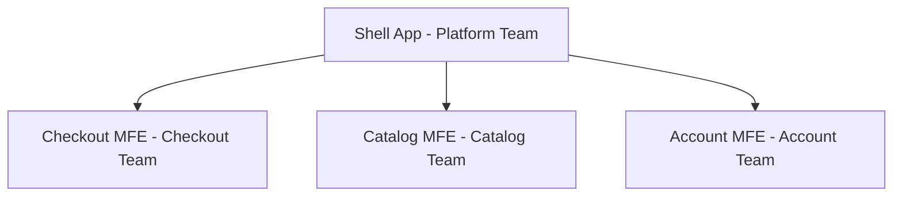

# 🏗️ Low-Level Design (LLD) — Interview Q&A

> **Usage:** Click on any question to reveal the answer. Study the "drill-deeper" follow-ups — they represent where interviewers push Principal candidates.

---

## 📋 Table of Contents

- [🏗️ Low-Level Design (LLD) — Interview Q\&A](#️-low-level-design-lld--interview-qa)
  - [📋 Table of Contents](#-table-of-contents)
  - [🧩 OOP Questions](#-oop-questions)
  - [🔒 SOLID Questions](#-solid-questions)
  - [🎨 Design Patterns Questions](#-design-patterns-questions)
  - [💡 Design Principles Questions](#-design-principles-questions)
  - [⚡ Machine Coding / Concurrency Questions](#-machine-coding--concurrency-questions)
  - [📊 Summary: Difficulty Distribution](#-summary-difficulty-distribution)

---

## 🧩 OOP Questions

---

<details>
<summary>❓ Q1 [Medium] — What is the difference between Composition and Inheritance, and when should you prefer one over the other?</summary>

**Answer:**

**Inheritance** creates an **IS-A** relationship. A `Dog` IS-A `Animal`. The subclass gets parent behavior and can override it. The problem: inheritance is a **compile-time**, static relationship. Changing the parent class breaks all subclasses (the Fragile Base Class problem). It also violates encapsulation because subclasses are exposed to parent internals.

**Composition** creates a **HAS-A** relationship. A `Car` HAS-A `Engine`. The class delegates behavior to composed objects. This is a **runtime**, dynamic relationship — you can swap the composed object.

**Prefer Composition when:**

- The behavior changes at runtime (e.g., a payment processor that switches strategy)
- You need to combine multiple behaviors (mixins via composition)
- The parent class has state that subclasses could corrupt
- You find yourself using inheritance just for code reuse (not for IS-A modeling)

**Prefer Inheritance when:**

- There's a genuine IS-A relationship that won't change
- Polymorphism is required at the type level (instanceof checks, generics)
- You're extending a stable base class (e.g., React.Component, Error subclasses)

```typescript
// ❌ Inheritance — brittle
class Logger {
  log(msg: string) {
    console.log(msg);
  }
}
class TimestampLogger extends Logger {
  log(msg: string) {
    super.log(`[${Date.now()}] ${msg}`);
  }
}

// ✅ Composition — flexible
interface Logger {
  log(msg: string): void;
}
class ConsoleLogger implements Logger {
  log(msg: string) {
    console.log(msg);
  }
}
class TimestampLogger implements Logger {
  constructor(private inner: Logger) {}
  log(msg: string) {
    this.inner.log(`[${Date.now()}] ${msg}`);
  }
}

// Can compose at runtime:
const logger = new TimestampLogger(new ConsoleLogger());
```

> [!IMPORTANT]
> The GoF book says: **"Favor object composition over class inheritance."** This isn't dogma — it's about keeping coupling loose. Inheritance couples the child to the parent's implementation details.

**🔁 Drill Deeper:** _"You have a `Vehicle` hierarchy with `Car`, `Truck`, `Motorcycle`. Now you need `ElectricCar` and `HybridCar`. How does your design handle this without explosion of subclasses?"_

Answer direction: Use composition — inject a `PropulsionSystem` (Electric, Gasoline, Hybrid) into Vehicle rather than creating a subclass for every combination.

</details>

---

<details>
<summary>❓ Q2 [Medium] — Explain polymorphism. What are the different types and what's the real-world impact of runtime polymorphism?</summary>

**Answer:**

Polymorphism ("many forms") means a single interface can refer to objects of different types. It's the mechanism that allows code to be written against abstractions.

**Types:**

| Type                      | When Resolved | Mechanism                              | Example                                    |
| ------------------------- | ------------- | -------------------------------------- | ------------------------------------------ |
| **Compile-time (Static)** | Compile time  | Method overloading, generics           | `add(int, int)` vs `add(float, float)`     |
| **Runtime (Dynamic)**     | Runtime       | Method overriding via virtual dispatch | `shape.draw()` calls Circle or Square impl |
| **Parametric**            | Compile time  | Generics/Templates                     | `Array<T>`, `Promise<T>`                   |
| **Ad-hoc**                | Compile time  | Operator overloading                   | `+` for numbers vs strings                 |

**Runtime polymorphism impact:** It's the foundation of the **Open/Closed Principle**. You write:

```typescript
function renderAll(shapes: Shape[]): void {
  shapes.forEach((s) => s.draw()); // No if/else, no instanceof
}
```

And add new shapes by implementing `Shape` — **without touching `renderAll`**. This is why polymorphism matters: it's how you add features without modifying existing, tested code.

```typescript
interface PaymentProcessor {
  process(amount: number): Promise<Receipt>;
}

class StripeProcessor implements PaymentProcessor {
  async process(amount: number): Promise<Receipt> {
    /* ... */
  }
}

class PayPalProcessor implements PaymentProcessor {
  async process(amount: number): Promise<Receipt> {
    /* ... */
  }
}

// This function is closed for modification, open for extension:
async function checkout(processor: PaymentProcessor, cart: Cart): Promise<Receipt> {
  const total = cart.getTotal();
  return processor.process(total);
}
```

**🔁 Drill Deeper:** _"What's the performance cost of dynamic dispatch vs direct calls, and when does it matter in production systems?"_

Answer direction: Virtual dispatch adds a vtable lookup — negligible for most code. Matters in tight loops (game engines, parsers). In TypeScript/JS, the V8 engine uses **inline caches** to optimize virtual calls when the shape is monomorphic (same type repeatedly). Megamorphic call sites (many different types) hurt performance.

</details>

---

<details>
<summary>❓ Q3 [Hard] — What is the Fragile Base Class problem, and how does it manifest in large TypeScript codebases?</summary>

**Answer:**

The **Fragile Base Class (FBC) problem** occurs when a seemingly safe modification to a base class breaks subclasses, even when the modification doesn't change the base class's public contract.

**Root cause:** Subclasses depend not just on the interface of the base class, but on its **implementation details** — specifically the order of method calls, which internal methods call which, and their side effects.

**Classic example:**

```typescript
class EventEmitter {
  private listeners: Map<string, Function[]> = new Map();

  on(event: string, fn: Function) {
    if (!this.listeners.has(event)) {
      this.listeners.set(event, []); // V1: initializes here
    }
    this.listeners.get(event)!.push(fn);
  }
}

class LoggedEmitter extends EventEmitter {
  on(event: string, fn: Function) {
    console.log(`Registering listener for: ${event}`);
    super.on(event, fn); // Depends on base class internals
  }
}
```

Now the base class author refactors `on()` to call an internal `init()` method. The subclass breaks because it assumed specific sequencing.

**Real manifestation in TS/React:**

```typescript
// Fragile: extending React component
class BaseForm extends React.Component {
  componentDidMount() {
    this.fetchData(); // Base class sets up data
  }

  fetchData() {
    /* ... */
  }
}

class UserForm extends BaseForm {
  componentDidMount() {
    super.componentDidMount(); // Order dependency!
    this.setupValidation(); // Depends on fetchData being done
  }
}
// If base class changes fetchData to be async, UserForm silently breaks.
```

**Mitigations:**

1. **Composition over inheritance** — delegate, don't extend
2. **Template Method pattern** with explicit hooks (the base class calls documented extension points)
3. **Sealed/Final classes** where inheritance is not intended
4. **Interface-based contracts** — depend on interfaces, not base classes
5. Document which methods are **override points** and which are **implementation details**

**🔁 Drill Deeper:** _"How does the Liskov Substitution Principle help you detect Fragile Base Class violations at design time?"_

</details>

---

<details>
<summary>❓ Q4 [Medium] — What is Encapsulation vs Abstraction? Developers often confuse them — give precise definitions with examples.</summary>

**Answer:**

These are related but distinct:

**Encapsulation** — **HOW** you protect implementation. It's the mechanism of bundling data and the methods that operate on it, and restricting direct access to some components. It's about **information hiding** to prevent external code from depending on internals.

**Abstraction** — **WHAT** you expose. It's the process of hiding complexity behind a simpler interface. It's about defining **what operations are possible** without revealing how they work.

Think of it this way:

- Abstraction says: "A `Stack` has `push`, `pop`, `peek`, `isEmpty`" (the interface)
- Encapsulation says: "The internal array of the `Stack` is private — you can't touch it directly"

```typescript
// ABSTRACTION: the interface (what)
interface Stack<T> {
  push(item: T): void;
  pop(): T | undefined;
  peek(): T | undefined;
  isEmpty(): boolean;
}

// ENCAPSULATION: hiding the how
class ArrayStack<T> implements Stack<T> {
  private items: T[] = []; // private = encapsulation

  push(item: T): void {
    this.items.push(item); // internal detail hidden
  }

  pop(): T | undefined {
    return this.items.pop(); // caller doesn't know it's an array
  }

  peek(): T | undefined {
    return this.items[this.items.length - 1];
  }

  isEmpty(): boolean {
    return this.items.length === 0;
  }
}
```

If you later switch to a linked list internally, all callers still work — because encapsulation hid the array (implementation), and abstraction defined the contract.

**In React:** `useState` is an abstraction — it hides whether state is stored in fibers, closures, or some other mechanism. The encapsulation is that React's internals are inaccessible to you.

**🔁 Drill Deeper:** _"You have a `UserService` class with 15 public methods. Is this a violation of encapsulation or abstraction? How do you fix it?"_

Answer direction: Likely a violation of both. Too many public methods mean poor abstraction (no clear concept boundary) and possibly poor encapsulation (internals leaking as methods). Split into multiple focused services/classes with clear interfaces.

</details>

---

<details>
<summary>❓ Q5 [Hard] — Design a plugin system in TypeScript using OOP. How do you handle plugin registration, lifecycle, and dependency injection between plugins?</summary>

**Answer:**

A plugin system needs: registration, lifecycle hooks, inter-plugin communication, and dependency resolution. This is a real-world Principal-level design question.

```typescript
// Plugin contract
interface PluginContext {
  getPlugin<T extends Plugin>(name: string): T | undefined;
  emit(event: string, payload: unknown): void;
  on(event: string, handler: (payload: unknown) => void): void;
}

interface Plugin {
  readonly name: string;
  readonly version: string;
  readonly dependencies?: string[]; // plugin names this depends on

  install(context: PluginContext): void | Promise<void>;
  uninstall?(): void | Promise<void>;
}

// Plugin registry with topological sort for dependency resolution
class PluginSystem implements PluginContext {
  private plugins: Map<string, Plugin> = new Map();
  private installed: Set<string> = new Set();
  private eventBus: Map<string, Array<(payload: unknown) => void>> = new Map();

  register(plugin: Plugin): this {
    if (this.plugins.has(plugin.name)) {
      throw new Error(`Plugin '${plugin.name}' is already registered`);
    }
    this.plugins.set(plugin.name, plugin);
    return this; // fluent API
  }

  async install(): Promise<void> {
    const order = this.topologicalSort();
    for (const name of order) {
      const plugin = this.plugins.get(name)!;
      await plugin.install(this);
      this.installed.add(name);
      console.log(`[PluginSystem] Installed: ${name}@${plugin.version}`);
    }
  }

  getPlugin<T extends Plugin>(name: string): T | undefined {
    return this.installed.has(name) ? (this.plugins.get(name) as T) : undefined;
  }

  emit(event: string, payload: unknown): void {
    this.eventBus.get(event)?.forEach((h) => h(payload));
  }

  on(event: string, handler: (payload: unknown) => void): void {
    if (!this.eventBus.has(event)) this.eventBus.set(event, []);
    this.eventBus.get(event)!.push(handler);
  }

  private topologicalSort(): string[] {
    const visited = new Set<string>();
    const result: string[] = [];

    const visit = (name: string) => {
      if (visited.has(name)) return;
      const plugin = this.plugins.get(name);
      if (!plugin) throw new Error(`Unresolved dependency: ${name}`);
      plugin.dependencies?.forEach((dep) => visit(dep));
      visited.add(name);
      result.push(name);
    };

    this.plugins.forEach((_, name) => visit(name));
    return result;
  }
}

// Usage
const authPlugin: Plugin = {
  name: 'auth',
  version: '1.0.0',
  install(ctx) {
    ctx.on('user:logout', () => console.log('Auth: clearing session'));
  },
};

const analyticsPlugin: Plugin = {
  name: 'analytics',
  version: '1.0.0',
  dependencies: ['auth'],
  install(ctx) {
    const auth = ctx.getPlugin<typeof authPlugin>('auth');
    // analytics can now use auth
    console.log(`Analytics installed, auth available: ${!!auth}`);
  },
};

const system = new PluginSystem();
system.register(authPlugin).register(analyticsPlugin);
await system.install();
```

**Key design decisions:**

1. **Topological sort** ensures dependencies are installed first
2. **Context object** passed to `install()` prevents plugins from accessing the system directly — they can only call what we give them
3. **Event bus** for loose coupling between plugins
4. **Fluent registration** for readable setup code

**🔁 Drill Deeper:** _"How would you add versioning support so that plugin A requires `>=2.0.0` of plugin B? What library patterns exist for this?"_

</details>

---

<details>
<summary>❓ Q6 [Medium] — What is the difference between an Abstract Class and an Interface in TypeScript? When do you use each?</summary>

**Answer:**

| Feature                    | Abstract Class         | Interface                                |
| -------------------------- | ---------------------- | ---------------------------------------- |
| Can have implementation    | ✅ Yes                 | ❌ No (TS interfaces only declare shape) |
| Can have constructor       | ✅ Yes                 | ❌ No                                    |
| Multiple inheritance       | ❌ No (single extends) | ✅ Yes (implements multiple)             |
| Can have private members   | ✅ Yes                 | ❌ No                                    |
| Enforces IS-A relationship | ✅ Yes                 | ❌ No (structural, not nominal)          |
| Compiled to JS             | ✅ Yes (as class)      | ❌ No (erased at compile time)           |
| Can be used as value       | ✅ Yes (instanceof)    | ❌ No (type only)                        |

**Use Abstract Class when:**

- You have shared implementation to provide (Template Method pattern)
- You need constructor logic to run in subclasses
- You want `instanceof` checks to work
- Modeling a true IS-A hierarchy with shared state

**Use Interface when:**

- Defining a behavioral contract (duck typing)
- A type needs to satisfy multiple contracts
- You want zero runtime overhead (erased at compile time)
- Working across class hierarchies that don't share implementation

```typescript
// Abstract class: shared implementation + template method
abstract class DataFetcher {
  private cache = new Map<string, unknown>();

  async fetch<T>(key: string): Promise<T> {
    if (this.cache.has(key)) return this.cache.get(key) as T;
    const result = await this.fetchImpl<T>(key); // template method
    this.cache.set(key, result);
    return result;
  }

  protected abstract fetchImpl<T>(key: string): Promise<T>; // subclass fills in
}

class ApiDataFetcher extends DataFetcher {
  protected async fetchImpl<T>(url: string): Promise<T> {
    const res = await fetch(url);
    return res.json();
  }
}

// Interface: behavioral contract across unrelated classes
interface Serializable {
  serialize(): string;
  deserialize(data: string): this;
}

interface Cacheable {
  getCacheKey(): string;
  getTTL(): number;
}

// A UserProfile can be both without sharing any base class
class UserProfile implements Serializable, Cacheable {
  serialize() {
    return JSON.stringify(this);
  }
  deserialize(data: string) {
    return Object.assign(this, JSON.parse(data));
  }
  getCacheKey() {
    return `user:${this.id}`;
  }
  getTTL() {
    return 300;
  }
  constructor(private id: string) {}
}
```

**🔁 Drill Deeper:** _"TypeScript uses structural typing for interfaces — explain what that means and how it differs from nominal typing. What are the implications when two libraries define `{ id: string }` interfaces?"_

</details>

---

<details>
<summary>❓ Q7 [Hard] — Design a type-safe Event Emitter in TypeScript with full generic support. What are the OOP challenges here?</summary>

**Answer:**

The challenge is making the event map type-safe: `on('userCreated', (user: User) => ...)` should error if you pass the wrong handler type.

```typescript
// Type-safe event map
type EventMap = {
  'user:created': { id: string; email: string };
  'user:deleted': { id: string };
  'order:placed': { orderId: string; amount: number };
  error: Error;
};

type EventKey = keyof EventMap;
type EventHandler<K extends EventKey> = (payload: EventMap[K]) => void;

class TypedEventEmitter {
  // Map from event key to array of handlers
  private handlers = new Map<EventKey, Array<EventHandler<EventKey>>>();

  on<K extends EventKey>(event: K, handler: EventHandler<K>): () => void {
    if (!this.handlers.has(event)) {
      this.handlers.set(event, []);
    }
    this.handlers.get(event)!.push(handler as EventHandler<EventKey>);

    // Return unsubscribe function
    return () => this.off(event, handler);
  }

  once<K extends EventKey>(event: K, handler: EventHandler<K>): void {
    const wrapper: EventHandler<K> = (payload) => {
      handler(payload);
      this.off(event, wrapper);
    };
    this.on(event, wrapper);
  }

  off<K extends EventKey>(event: K, handler: EventHandler<K>): void {
    const list = this.handlers.get(event);
    if (!list) return;
    const idx = list.indexOf(handler as EventHandler<EventKey>);
    if (idx !== -1) list.splice(idx, 1);
  }

  emit<K extends EventKey>(event: K, payload: EventMap[K]): void {
    this.handlers.get(event)?.forEach((h) => h(payload));
  }
}

// Usage — fully type-safe:
const emitter = new TypedEventEmitter();

emitter.on('user:created', (user) => {
  console.log(user.email); // ✅ TypeScript knows this is { id, email }
});

// emitter.on('user:created', (user: number) => {}); // ❌ TypeScript error!
// emitter.emit('user:created', { orderId: '123' }); // ❌ TypeScript error!

emitter.emit('user:created', { id: '1', email: 'test@example.com' }); // ✅
```

**OOP challenges solved:**

1. **Type safety via generics** — `K extends EventKey` constrains the handler type
2. **Memory leak prevention** — returning an unsubscribe function
3. **Once semantics** — wrapping with a self-removing handler
4. **Type erasure in TS** — the internal Map uses `EventHandler<EventKey>` (widened) but the public API is narrowed with generics

**🔁 Drill Deeper:** _"How would you extend this to support wildcard listeners (`on('user:_', ...)`) or event namespacing? What TypeScript limitations would you hit?"\*

</details>

---

<details>
<summary>❓ Q8 [Principal-Level] — Walk me through designing a class hierarchy for a UI component library. How do you balance extensibility, type-safety, and avoiding the pitfalls of deep inheritance?</summary>

**Answer:**

This is a system-design + OOP combined question. The wrong answer is: "I'd create a `BaseComponent`, then `InputComponent extends BaseComponent`, then `TextInput extends InputComponent`..."

The right approach uses **composition over inheritance**, **interface segregation**, and **generics**.

```typescript
// Core contracts (interfaces, not base classes)
interface Component<Props = {}> {
  render(): ReactElement;
}

interface Focusable {
  focus(): void;
  blur(): void;
  onFocus?: (e: FocusEvent) => void;
  onBlur?: (e: FocusEvent) => void;
}

interface Validatable<T> {
  validate(value: T): ValidationResult;
  onValidationChange?: (result: ValidationResult) => void;
}

interface Accessible {
  ariaLabel?: string;
  ariaDescribedBy?: string;
  role?: AriaRole;
}

// Compose via TypeScript intersections + hooks (not class inheritance)
type InputProps<T = string> = {
  value: T;
  onChange: (value: T) => void;
} & Partial<Focusable> & Partial<Accessible>;

// Instead of base class, use composition via hooks
function useValidation<T>(
  value: T,
  validators: Array<(v: T) => ValidationResult>
): ValidationResult {
  return useMemo(() => {
    for (const validator of validators) {
      const result = validator(value);
      if (!result.valid) return result;
    }
    return { valid: true };
  }, [value, validators]);
}

// Component uses composition of behaviors
function TextInput({ value, onChange, ariaLabel, validators = [] }: InputProps & { validators?: Validator[] }) {
  const validation = useValidation(value, validators);
  const { focusRef, isFocused } = useFocusable();

  return (
    <input
      ref={focusRef}
      value={value}
      onChange={e => onChange(e.target.value)}
      aria-label={ariaLabel}
      aria-invalid={!validation.valid}
      className={classNames({ 'focused': isFocused, 'error': !validation.valid })}
    />
  );
}
```

**Architecture decisions:**

1. **Interfaces** define capabilities (Focusable, Validatable, Accessible) — not a base class
2. **Hooks** provide shared implementation — no abstract class inheritance
3. **Generics** for type-safe value types (NumberInput, DateInput, SelectInput all use the same pattern)
4. **Composition** — components opt-in to behaviors via hooks, not via class hierarchy

**What makes this Principal-level:** Recognizing that React's functional component model already pushes you toward composition. Trying to use OOP class hierarchies in React fights the framework.

**🔁 Drill Deeper:** _"How would you handle theme injection across all components? DI container? Context? CSS variables? What are the tradeoffs?"_

</details>

---

## 🔒 SOLID Questions

---

<details>
<summary>❓ Q9 [Medium] — Explain the Single Responsibility Principle. How is it different from "a class should do one thing"? Give an example of a common SRP violation.</summary>

**Answer:**

The common misunderstanding: SRP doesn't mean "only one method" or "only one thing." Uncle Bob's actual definition: **"A class should have only one reason to change."** — meaning it should serve only one stakeholder or one area of the system.

A class can do many related things and still follow SRP, as long as all those things would change for the same reason.

**Common SRP violation — the God Service:**

```typescript
// ❌ Violates SRP — multiple reasons to change
class UserService {
  // Reason 1: Business logic changes
  async createUser(data: CreateUserDto): Promise<User> {
    this.validateEmail(data.email); // validation
    const hashed = await bcrypt.hash(data.password, 10);

    // Reason 2: Database schema changes
    const user = await this.db.query('INSERT INTO users (email, password) VALUES ($1, $2) RETURNING *', [
      data.email,
      hashed,
    ]);

    // Reason 3: Email provider changes
    await this.sendWelcomeEmail(user.email);

    // Reason 4: Analytics tracking changes
    this.analytics.track('user_created', { userId: user.id });

    return user;
  }
}
```

**Fixed:**

```typescript
// ✅ SRP — each class has one reason to change
class UserRepository {
  async create(data: UserData): Promise<User> {
    /* DB logic */
  }
}

class UserValidator {
  validate(data: CreateUserDto): ValidationResult {
    /* validation logic */
  }
}

class WelcomeEmailService {
  async sendWelcome(email: string): Promise<void> {
    /* email logic */
  }
}

class UserCreationService {
  constructor(
    private repo: UserRepository,
    private validator: UserValidator,
    private emailService: WelcomeEmailService,
    private analytics: AnalyticsService,
  ) {}

  async createUser(data: CreateUserDto): Promise<User> {
    this.validator.validate(data); // delegates
    const user = await this.repo.create(data);
    await this.emailService.sendWelcome(user.email);
    this.analytics.track('user_created', { userId: user.id });
    return user;
  }
}
```

Now if the email provider changes, only `WelcomeEmailService` changes. If the DB schema changes, only `UserRepository` changes.

**🔁 Drill Deeper:** _"SRP at the class level is clear. How do you apply SRP at the module level? What's the equivalent principle for TypeScript modules/packages?"_

</details>

---

<details>
<summary>❓ Q10 [Hard] — Explain the Open/Closed Principle and demonstrate how violating it leads to shotgun surgery. Show the refactored solution.</summary>

**Answer:**

**OCP states:** Software entities should be **open for extension** but **closed for modification.**

"Open for extension" = you can add new behavior.
"Closed for modification" = adding new behavior doesn't require changing existing, tested code.

**Violation — shotgun surgery pattern:**

```typescript
// ❌ Every new payment method requires modifying this class AND this function
type PaymentMethod = 'stripe' | 'paypal' | 'applepay'; // add 'googlepay' → modify here
// AND in processPayment
async function processPayment(method: PaymentMethod, amount: number): Promise<Receipt> {
  if (method === 'stripe') {
    return stripe.charges.create({ amount, currency: 'usd' });
  } else if (method === 'paypal') {
    return paypal.payment.create({ amount });
  } else if (method === 'applepay') {
    return applePay.authorize({ amount });
  }
  // Adding Google Pay = modifying this function = violating OCP
  throw new Error(`Unsupported: ${method}`);
}
```

**Fixed using Strategy + Registry:**

```typescript
// ✅ OCP — adding new payment method = adding new class, not modifying existing code
interface PaymentProcessor {
  readonly methodId: string;
  process(amount: number, currency: string): Promise<Receipt>;
}

class StripeProcessor implements PaymentProcessor {
  readonly methodId = 'stripe';
  async process(amount: number, currency: string): Promise<Receipt> {
    return stripe.charges.create({ amount, currency });
  }
}

class PayPalProcessor implements PaymentProcessor {
  readonly methodId = 'paypal';
  async process(amount: number, currency: string): Promise<Receipt> {
    return paypal.payment.create({ amount });
  }
}

// Registry pattern — self-registering
class PaymentRegistry {
  private processors = new Map<string, PaymentProcessor>();

  register(processor: PaymentProcessor): void {
    this.processors.set(processor.methodId, processor);
  }

  async process(methodId: string, amount: number, currency: string): Promise<Receipt> {
    const processor = this.processors.get(methodId);
    if (!processor) throw new Error(`No processor for: ${methodId}`);
    return processor.process(amount, currency);
  }
}

// Adding Google Pay: just create a new file, no modification to existing
class GooglePayProcessor implements PaymentProcessor {
  readonly methodId = 'googlepay';
  async process(amount: number, currency: string): Promise<Receipt> {
    return googlePay.process({ amount });
  }
}

const registry = new PaymentRegistry();
registry.register(new StripeProcessor());
registry.register(new PayPalProcessor());
registry.register(new GooglePayProcessor()); // ← just register, nothing else changes
```

**The shotgun surgery smell:** When you add a feature and have to modify 5 different files (the type union, the switch statement, the tests, the docs, the API handler) — that's OCP violation at scale.

**🔁 Drill Deeper:** _"OCP says 'closed for modification' — but what about bug fixes or refactoring? How do you reconcile OCP with the need to change existing code?"_

</details>

---

<details>
<summary>❓ Q11 [Hard] — Explain the Liskov Substitution Principle. Give a real-world violation that looks valid at first glance, and explain how to fix it.</summary>

**Answer:**

**LSP:** If `S` is a subtype of `T`, then objects of type `T` may be replaced with objects of type `S` without altering any of the correct properties of the program.

Simply: **A subclass must be fully substitutable for its parent class.** Not just syntactically — behaviorally.

**Classic violation — Square extends Rectangle:**

```typescript
class Rectangle {
  constructor(
    protected width: number,
    protected height: number,
  ) {}

  setWidth(w: number) {
    this.width = w;
  }
  setHeight(h: number) {
    this.height = h;
  }
  getArea() {
    return this.width * this.height;
  }
}

class Square extends Rectangle {
  setWidth(w: number) {
    this.width = w;
    this.height = w; // ← maintains square invariant
  }
  setHeight(h: number) {
    this.width = h;
    this.height = h; // ← maintains square invariant
  }
}

// Code written for Rectangle:
function stretchWidth(shape: Rectangle) {
  shape.setWidth((shape.getArea() / shape.height) * 2);
  // Works for Rectangle, breaks for Square:
  // Square silently changes height too → getArea() is now wrong
  assert(shape.getArea() === expected); // FAILS for Square
}
```

A Square **is-a** Rectangle geometrically but **is NOT behaviorally substitutable** because it changes the postconditions: `setWidth` should not change `height`.

**Fix: Don't use inheritance — use a shared interface:**

```typescript
interface Shape {
  getArea(): number;
  getPerimeter(): number;
}

// No inheritance relationship between these
class Rectangle implements Shape {
  constructor(
    private width: number,
    private height: number,
  ) {}
  getArea() {
    return this.width * this.height;
  }
  getPerimeter() {
    return 2 * (this.width + this.height);
  }
  // width and height are independent
}

class Square implements Shape {
  constructor(private side: number) {}
  getArea() {
    return this.side ** 2;
  }
  getPerimeter() {
    return 4 * this.side;
  }
  // side is the only invariant
}
```

**Preconditions/Postconditions rule (Bertrand Meyer's contracts):**

- A subclass can **weaken preconditions** (accept more inputs)
- A subclass can **strengthen postconditions** (guarantee more)
- A subclass can **NOT strengthen preconditions** or **weaken postconditions**

**LSP in frontend:** If `SpecialButton extends Button`, calling `SpecialButton.onClick()` should not throw unexpectedly, not ignore the onClick prop, not change the event object shape — all things the base `Button` contract guarantees.

**🔁 Drill Deeper:** _"How does TypeScript's structural typing affect LSP? If a type structurally matches but violates behavioral contracts, TypeScript won't catch it. How do you handle this in practice?"_

</details>

---

<details>
<summary>❓ Q12 [Medium] — Explain Interface Segregation Principle. Why does a "fat interface" create problems, and how does ISP fix them?</summary>

**Answer:**

**ISP:** Clients should not be forced to depend on interfaces they do not use.

A **fat interface** forces classes to implement methods they don't need, leading to:

- **Dummy/no-op implementations** that lie about the class's capabilities
- **Coupling** — changing one part of the fat interface forces recompilation/updates of all implementors
- **Violated LSP** — a class that throws `NotImplementedError` on some methods isn't substitutable

```typescript
// ❌ Fat interface — not all workers do all things
interface Worker {
  work(): void;
  eat(): void; // Robots don't eat
  sleep(): void; // Robots don't sleep
  payTaxes(): void; // Contractors might handle this differently
}

class Robot implements Worker {
  work() {
    /* works */
  }
  eat() {
    throw new Error("Robots don't eat!");
  } // ← ISP violation
  sleep() {
    throw new Error("Robots don't sleep!");
  }
  payTaxes() {
    throw new Error("Robots don't pay taxes!");
  }
}
```

**Fixed with segregated interfaces:**

```typescript
// ✅ Segregated interfaces — each implementor uses only what it needs
interface Workable {
  work(): void;
}

interface Feedable {
  eat(): void;
}

interface Restable {
  sleep(): void;
}

interface Taxable {
  payTaxes(): void;
}

class HumanWorker implements Workable, Feedable, Restable, Taxable {
  work() {
    /* works */
  }
  eat() {
    /* eats */
  }
  sleep() {
    /* sleeps */
  }
  payTaxes() {
    /* pays taxes */
  }
}

class Robot implements Workable {
  work() {
    /* works */
  }
  // Doesn't implement eat, sleep, payTaxes — doesn't need to
}

// A function only depends on what it uses:
function assignWork(worker: Workable) {
  worker.work(); // Doesn't force robot to eat
}
```

**ISP in TypeScript/frontend:**

```typescript
// ❌ Fat hook interface
interface UseFormOptions {
  validate?: boolean;
  submitToServer?: boolean;
  trackAnalytics?: boolean;
  sendEmail?: boolean;
  handlePersist?: boolean;
}

// ✅ Composable
const form = useForm({ validate: true });
const withSubmit = useFormSubmit(form);
const withAnalytics = useFormAnalytics(form);
// Each hook has one focused interface
```

**🔁 Drill Deeper:** _"ISP and SRP are often confused. A class can violate ISP without violating SRP — give an example."_

</details>

---

<details>
<summary>❓ Q13 [Hard] — Explain Dependency Inversion Principle. What's the difference between DI, DIP, and IoC? How do you implement a DI container in TypeScript?</summary>

**Answer:**

Three related but distinct concepts:

| Concept             | What it is                                                                                    |
| ------------------- | --------------------------------------------------------------------------------------------- |
| **DIP** (Principle) | High-level modules should not depend on low-level modules. Both should depend on abstractions |
| **IoC** (Pattern)   | Inversion of Control — framework calls your code, not the other way around                    |
| **DI** (Technique)  | Dependency Injection — a way to achieve DIP by passing dependencies from outside              |

**DIP violation:**

```typescript
// ❌ High-level UserService depends on low-level MySQLDatabase
class MySQLDatabase {
  query(sql: string) {
    /* MySQL specific */
  }
}

class UserService {
  private db = new MySQLDatabase(); // ← tight coupling to concrete

  getUser(id: string) {
    return this.db.query(`SELECT * FROM users WHERE id = ${id}`);
  }
}
// If you switch to PostgreSQL, you must change UserService
```

**DIP fixed + DI container:**

```typescript
// Abstraction that both sides depend on
interface Database {
  query<T>(sql: string, params: unknown[]): Promise<T[]>;
  execute(sql: string, params: unknown[]): Promise<void>;
}

// Low-level module implements abstraction
class PostgreSQLDatabase implements Database {
  async query<T>(sql: string, params: unknown[]): Promise<T[]> {
    // PostgreSQL specific
    return [];
  }
  async execute(sql: string, params: unknown[]): Promise<void> {}
}

// High-level module depends ONLY on abstraction
class UserService {
  constructor(private db: Database) {} // ← injected, not created

  async getUser(id: string) {
    return this.db.query('SELECT * FROM users WHERE id = $1', [id]);
  }
}

// Simple DI container implementation
type Constructor<T> = new (...args: unknown[]) => T;
type Factory<T> = () => T;

class Container {
  private singletons = new Map<string, unknown>();
  private factories = new Map<string, Factory<unknown>>();

  bind<T>(token: string, factory: Factory<T>): void {
    this.factories.set(token, factory);
  }

  singleton<T>(token: string, factory: Factory<T>): void {
    this.factories.set(token, () => {
      if (!this.singletons.has(token)) {
        this.singletons.set(token, factory());
      }
      return this.singletons.get(token) as T;
    });
  }

  resolve<T>(token: string): T {
    const factory = this.factories.get(token);
    if (!factory) throw new Error(`No binding for token: ${token}`);
    return factory() as T;
  }
}

// Wire everything up at the composition root
const container = new Container();
container.singleton('database', () => new PostgreSQLDatabase());
container.bind('userService', () => new UserService(container.resolve('database')));

const userService = container.resolve<UserService>('userService');
```

**Decorator-based DI (like NestJS/InversifyJS):**

```typescript
import 'reflect-metadata';
import { injectable, inject, Container } from 'inversify';

const TYPES = { Database: Symbol('Database'), UserService: Symbol('UserService') };

@injectable()
class PostgreSQLDatabase implements Database {
  /* ... */
}

@injectable()
class UserService {
  constructor(@inject(TYPES.Database) private db: Database) {}
}
```

**🔁 Drill Deeper:** _"What are the tradeoffs of using a DI container vs manual dependency injection (passing deps through constructors)? When does a DI container become overkill?"_

</details>

---

<details>
<summary>❓ Q14 [Principal-Level] — All 5 SOLID principles together — give me a real scenario where a codebase violates all 5, and walk through refactoring it step by step.</summary>

**Answer:**

**The scenario:** An e-commerce order processing service written as a monolithic class.

```typescript
// ❌ ALL SOLID principles violated
class OrderService {
  async placeOrder(userId: string, items: CartItem[]): Promise<void> {
    // SRP violation: validation, DB, email, payment, logging all in one class

    // ISP violation: depends on a fat UserRepository interface
    const user = await this.userRepo.findUser(userId);
    if (!user) throw new Error('User not found');
    if (!user.email) throw new Error('No email');
    if (!user.address) throw new Error('No address');

    // OCP violation: every new payment method modifies this code
    let paymentResult;
    if (user.paymentMethod === 'stripe') {
      paymentResult = await stripe.charge(items.reduce((s, i) => s + i.price, 0));
    } else if (user.paymentMethod === 'paypal') {
      paymentResult = await paypal.pay(items.reduce((s, i) => s + i.price, 0));
    }

    // LSP violation: OrderRepository subclasses don't fully honor the contract
    await this.orderRepo.save({ userId, items, paymentId: paymentResult.id });

    // DIP violation: depends on concrete SendGrid, not abstraction
    await sendgrid.send({ to: user.email, subject: 'Order Confirmed', body: '...' });

    console.log('Order placed'); // also SRP: logging mixed in
  }
}
```

**Step-by-step refactoring:**

**Step 1 — SRP:** Extract responsibilities into focused classes:

- `OrderValidator` — validates order data
- `OrderRepository` — persists orders
- `OrderEmailService` — sends confirmation
- `PaymentService` — handles payment
- `OrderOrchestrator` — coordinates the flow

**Step 2 — OCP:** Replace payment if/else with Strategy pattern:

```typescript
interface PaymentStrategy {
  charge(amount: number): Promise<PaymentResult>;
}
class StripeStrategy implements PaymentStrategy {
  /* ... */
}
class PayPalStrategy implements PaymentStrategy {
  /* ... */
}
```

**Step 3 — LSP:** Ensure all `OrderRepository` implementations honor the contract:

```typescript
interface OrderRepository {
  save(order: Order): Promise<Order>; // must always return saved Order
  findById(id: string): Promise<Order | null>; // null, not throw
}
```

**Step 4 — ISP:** Split fat `UserRepository`:

```typescript
interface UserFinder {
  findById(id: string): Promise<User | null>;
}
interface UserContactInfo {
  getEmail(userId: string): Promise<string>;
}
// OrderService only injects UserFinder, not the whole fat interface
```

**Step 5 — DIP:** Depend on abstractions:

```typescript
interface EmailService {
  send(options: EmailOptions): Promise<void>;
}
interface Logger {
  info(msg: string): void;
}

class OrderOrchestrator {
  constructor(
    private validator: OrderValidator,
    private payment: PaymentStrategy,
    private repo: OrderRepository,
    private email: EmailService,
    private logger: Logger,
  ) {}
}
```

**Result:** Adding a new payment method = 1 new file. Changing email provider = 1 file. Testing = inject mocks for all dependencies.

**🔁 Drill Deeper:** _"At what scale does applying SOLID principles stop being beneficial and start being over-engineering? How do you know when a 50-line utility function should stay flat rather than being refactored into SOLID classes?"_

</details>

---

<details>
<summary>❓ Q15 [Hard] — Explain how SOLID principles apply to React components and hooks. Are traditional OOP SOLID rules directly translatable to functional React?</summary>

**Answer:**

SOLID wasn't designed for functional programming, but the **underlying concerns** translate:

| SOLID   | OOP                                      | React/Functional Equivalent                                      |
| ------- | ---------------------------------------- | ---------------------------------------------------------------- |
| **SRP** | Class has one reason to change           | Component/hook has one concern                                   |
| **OCP** | Extend via subclass                      | Extend via composition (render props, HOC, hooks)                |
| **LSP** | Subclass substitutable                   | Components accept same props interface (variant pattern)         |
| **ISP** | Don't depend on unused interface methods | Props should be minimal; use prop spreading carefully            |
| **DIP** | Depend on abstractions                   | Depend on hooks/context interfaces, not concrete implementations |

```typescript
// SRP in React — each hook has one reason to change
// ❌ Violates SRP: fetching, transforming, and rendering concerns mixed
function UserProfile({ userId }: { userId: string }) {
  const [user, setUser] = useState<User | null>(null);
  const [loading, setLoading] = useState(true);

  useEffect(() => {
    fetch(`/api/users/${userId}`)
      .then(r => r.json())
      .then(data => {
        // Transform data here (mixing concerns)
        setUser({ ...data, fullName: `${data.first} ${data.last}` });
        setLoading(false);
      });
  }, [userId]);

  // rendering mixed with data fetching
  if (loading) return <Spinner />;
  return <div>{user?.fullName}</div>;
}

// ✅ SRP respected
function useUser(userId: string) { /* data fetching concern */ }
function useUserDisplay(user: User) { /* transform concern */ }
function UserProfile({ userId }: { userId: string }) {
  const { user, loading } = useUser(userId);
  const displayData = useUserDisplay(user!);
  // purely rendering concern
  if (loading) return <Spinner />;
  return <div>{displayData.fullName}</div>;
}

// DIP in React — inject dependencies via hooks/context
// ❌ Tightly coupled to fetch
function useUser(id: string) {
  return useSWR(`/api/users/${id}`, url => fetch(url).then(r => r.json()));
}

// ✅ DIP — depend on abstraction
interface HttpClient {
  get<T>(url: string): Promise<T>;
}
const HttpClientContext = createContext<HttpClient>(fetchClient);

function useUser(id: string) {
  const http = useContext(HttpClientContext); // depends on abstraction
  return useSWR(`/api/users/${id}`, url => http.get<User>(url));
}

// Tests inject a mock HTTP client via context
```

**OCP in React — the Slot/Children pattern:**

```typescript
// ❌ Adding new header content requires modifying Card
function Card({ title, content }: { title: string; content: string }) {
  return <div className="card"><h2>{title}</h2><p>{content}</p></div>;
}

// ✅ OCP — open for extension via children
function Card({ header, children }: { header: ReactNode; children: ReactNode }) {
  return <div className="card">{header}{children}</div>;
}
// Now any header is possible without changing Card
```

**🔁 Drill Deeper:** _"Does the React hook dependency array (`useEffect([dep])`) violate any SOLID principles? What about exhaustive-deps lint rules?"_

</details>

---

## 🎨 Design Patterns Questions

---

<details>
<summary>❓ Q16 [Medium] — Explain the Observer pattern. Implement it in TypeScript and explain how it relates to RxJS and React's useEffect.</summary>

**Answer:**

**Observer pattern:** Defines a one-to-many dependency between objects. When one object (Subject/Observable) changes state, all its dependents (Observers) are notified automatically.

```typescript
// Subject (Observable)
interface Observer<T> {
  update(data: T): void;
}

interface Subject<T> {
  subscribe(observer: Observer<T>): () => void;
  notify(data: T): void;
}

class Store<T> implements Subject<T> {
  private observers: Set<Observer<T>> = new Set();
  private state: T;

  constructor(initialState: T) {
    this.state = initialState;
  }

  subscribe(observer: Observer<T>): () => void {
    this.observers.add(observer);
    return () => this.observers.delete(observer); // unsubscribe
  }

  setState(updater: (prev: T) => T): void {
    this.state = updater(this.state);
    this.notify(this.state);
  }

  getState(): T {
    return this.state;
  }

  notify(data: T): void {
    this.observers.forEach((o) => o.update(data));
  }
}

// Usage
const userStore = new Store({ name: 'Alice', count: 0 });

const logger: Observer<typeof userStore extends Store<infer U> ? U : never> = {
  update(state) {
    console.log('State changed:', state);
  },
};

const unsubscribe = userStore.subscribe(logger);
userStore.setState((s) => ({ ...s, count: s.count + 1 })); // logger notified
unsubscribe(); // clean up
```

**Relationship to RxJS:**
RxJS implements the Observer pattern with operators for transformation. `Observable.subscribe()` is the Observer pattern. The key additions: operators (map, filter, merge), error handling in the observer contract, and completion signals.

```typescript
import { Subject } from 'rxjs';
import { filter, map, debounceTime } from 'rxjs/operators';

const searchInput$ = new Subject<string>();
searchInput$
  .pipe(
    debounceTime(300),
    filter((s) => s.length > 2),
    map((s) => s.toLowerCase()),
  )
  .subscribe((query) => fetchResults(query));
```

**Relationship to React useEffect:**
`useEffect` is React's implementation of subscription to an external subject. The dependency array tells React WHEN to re-subscribe. The cleanup function is the unsubscribe:

```typescript
useEffect(() => {
  const unsubscribe = userStore.subscribe({ update: setUser });
  return unsubscribe; // React calls this when deps change or unmount
}, [userId]); // Re-subscribe when userId changes
```

**🔁 Drill Deeper:** _"What's the difference between `Subject` and `BehaviorSubject` in RxJS? When would the distinction matter in a UI component?"_

</details>

---

<details>
<summary>❓ Q17 [Hard] — Explain the Decorator pattern vs TypeScript decorators. Implement a production-grade method decorator for retry logic with exponential backoff.</summary>

**Answer:**

**Decorator pattern (GoF):** Attaches additional responsibilities to an object dynamically. Decorators provide a flexible alternative to subclassing for extending functionality.

**TypeScript decorators** are a language feature that implements this pattern at the syntax level (method/class decoration at definition time).

```typescript
// GoF Decorator pattern (object-level, runtime)
interface HttpClient {
  get<T>(url: string): Promise<T>;
}

class FetchHttpClient implements HttpClient {
  async get<T>(url: string): Promise<T> {
    const res = await fetch(url);
    if (!res.ok) throw new Error(`HTTP ${res.status}`);
    return res.json();
  }
}

// Decorator adds retry without modifying FetchHttpClient
class RetryHttpClient implements HttpClient {
  constructor(
    private inner: HttpClient,
    private maxRetries = 3,
    private baseDelay = 1000,
  ) {}

  async get<T>(url: string): Promise<T> {
    let lastError: Error;
    for (let attempt = 0; attempt <= this.maxRetries; attempt++) {
      try {
        return await this.inner.get<T>(url);
      } catch (err) {
        lastError = err as Error;
        if (attempt < this.maxRetries) {
          const delay = this.baseDelay * Math.pow(2, attempt) + Math.random() * 100;
          await new Promise((resolve) => setTimeout(resolve, delay));
        }
      }
    }
    throw lastError!;
  }
}

// Compose: RetryHttpClient wraps FetchHttpClient wraps CachingHttpClient
const client = new RetryHttpClient(new CachingHttpClient(new FetchHttpClient()));
```

**TypeScript method decorator for retry:**

```typescript
// TypeScript decorator (syntactic sugar over the same pattern)
function Retry(maxRetries = 3, baseDelayMs = 1000) {
  return function (target: object, propertyKey: string, descriptor: PropertyDescriptor) {
    const originalMethod = descriptor.value;

    descriptor.value = async function (...args: unknown[]) {
      let lastError: Error;

      for (let attempt = 0; attempt <= maxRetries; attempt++) {
        try {
          return await originalMethod.apply(this, args);
        } catch (err) {
          lastError = err as Error;
          if (attempt < maxRetries) {
            const jitter = Math.random() * 100;
            const delay = baseDelayMs * Math.pow(2, attempt) + jitter;
            console.warn(
              `[Retry] ${propertyKey} attempt ${attempt + 1} failed. ` + `Retrying in ${delay.toFixed(0)}ms...`,
              err,
            );
            await new Promise((resolve) => setTimeout(resolve, delay));
          }
        }
      }

      throw new Error(`[Retry] ${propertyKey} failed after ${maxRetries + 1} attempts: ${lastError!.message}`);
    };

    return descriptor;
  };
}

// Usage:
class PaymentService {
  @Retry(3, 500)
  async chargeCard(amount: number): Promise<Receipt> {
    // Will automatically retry up to 3 times with exponential backoff
    return await stripe.charges.create({ amount });
  }
}
```

**Key difference:** GoF Decorator is a runtime wrapper (great for composing at configuration time). TypeScript decorators wrap the method at class definition time (great for cross-cutting concerns like logging, caching, auth).

**🔁 Drill Deeper:** _"TypeScript decorators are experimental. If you couldn't use decorators, how would you implement the same retry/logging cross-cutting concern without decorators and without modifying each method? (Hint: Proxy)"_

</details>

---

<details>
<summary>❓ Q18 [Medium] — Explain the Factory Method vs Abstract Factory pattern. When does one escalate to the other?</summary>

**Answer:**

**Factory Method:** Defines an interface for creating an object, but lets subclasses decide which class to instantiate. Creates **one product**.

**Abstract Factory:** Provides an interface for creating **families of related objects** without specifying their concrete classes.

```typescript
// FACTORY METHOD — creates one type of thing
interface Button {
  render(): string;
  onClick(): void;
}

// Factory method in base class
abstract class UIFactory {
  abstract createButton(): Button; // factory method

  // Template method that uses the factory method
  renderUI() {
    const button = this.createButton(); // subclass decides what button
    return button.render();
  }
}

class WebUIFactory extends UIFactory {
  createButton(): Button {
    return new HTMLButton();
  }
}

class MobileUIFactory extends UIFactory {
  createButton(): Button {
    return new NativeButton();
  }
}
```

**Escalation trigger:** When you need **more than one product**, and those products need to be **consistent with each other**:

```typescript
// ABSTRACT FACTORY — creates a family of related things
interface Button {
  render(): string;
}
interface TextInput {
  render(): string;
}
interface Modal {
  show(): void;
}

// Abstract factory interface
interface UIComponentFactory {
  createButton(): Button;
  createTextInput(): TextInput;
  createModal(): Modal;
}

// Material Design family — all components are consistent
class MaterialUIFactory implements UIComponentFactory {
  createButton(): Button {
    return new MaterialButton();
  }
  createTextInput(): TextInput {
    return new MaterialTextInput();
  }
  createModal(): Modal {
    return new MaterialModal();
  }
}

// Ant Design family — consistent within itself
class AntDesignFactory implements UIComponentFactory {
  createButton(): Button {
    return new AntButton();
  }
  createTextInput(): TextInput {
    return new AntTextInput();
  }
  createModal(): Modal {
    return new AntModal();
  }
}

// Client code uses the factory — never instantiates components directly
class App {
  constructor(private ui: UIComponentFactory) {}

  render() {
    const btn = this.ui.createButton();
    const input = this.ui.createTextInput();
    // Always consistent: Material button + Material input, never mixed
    return `${btn.render()} ${input.render()}`;
  }
}

// Swap entire UI system:
const app = new App(isDarkMode ? new DarkModeFactory() : new LightModeFactory());
```

**The escalation rule:**

- 1 product family member → Factory Method
- 2+ product family members that must be consistent → Abstract Factory

**🔁 Drill Deeper:** _"In React, what's the equivalent of Abstract Factory? Think about how design system providers (MUI ThemeProvider, Ant's ConfigProvider) implement this concept."_

</details>

---

<details>
<summary>❓ Q19 [Hard] — Explain the Command pattern. Implement it with undo/redo support for a collaborative document editor.</summary>

**Answer:**

**Command pattern:** Encapsulates a request as an object, allowing parameterization, queuing, logging, and undo/redo operations. The key insight: **commands are first-class citizens** — they carry their own execution context.

```typescript
// Command interface
interface Command {
  execute(): void;
  undo(): void;
  readonly description: string;
}

// Document state
interface DocumentState {
  content: string;
  cursorPosition: number;
}

// Concrete commands
class InsertTextCommand implements Command {
  readonly description: string;

  constructor(
    private document: { state: DocumentState },
    private text: string,
    private position: number,
  ) {
    this.description = `Insert "${text}" at position ${position}`;
  }

  execute(): void {
    const { content } = this.document.state;
    this.document.state = {
      content: content.slice(0, this.position) + this.text + content.slice(this.position),
      cursorPosition: this.position + this.text.length,
    };
  }

  undo(): void {
    const { content } = this.document.state;
    this.document.state = {
      content: content.slice(0, this.position) + content.slice(this.position + this.text.length),
      cursorPosition: this.position,
    };
  }
}

class DeleteTextCommand implements Command {
  private deletedText: string = '';
  readonly description: string;

  constructor(
    private document: { state: DocumentState },
    private start: number,
    private end: number,
  ) {
    this.description = `Delete text from ${start} to ${end}`;
  }

  execute(): void {
    const { content } = this.document.state;
    this.deletedText = content.slice(this.start, this.end); // save for undo
    this.document.state = {
      content: content.slice(0, this.start) + content.slice(this.end),
      cursorPosition: this.start,
    };
  }

  undo(): void {
    const { content } = this.document.state;
    this.document.state = {
      content: content.slice(0, this.start) + this.deletedText + content.slice(this.start),
      cursorPosition: this.end,
    };
  }
}

// Macro command — composite (composes multiple commands)
class CompositeCommand implements Command {
  readonly description: string;

  constructor(
    private commands: Command[],
    description: string,
  ) {
    this.description = description;
  }

  execute(): void {
    this.commands.forEach((c) => c.execute());
  }
  undo(): void {
    [...this.commands].reverse().forEach((c) => c.undo());
  }
}

// Invoker — manages history
class CommandHistory {
  private undoStack: Command[] = [];
  private redoStack: Command[] = [];
  private maxHistory: number;

  constructor(maxHistory = 100) {
    this.maxHistory = maxHistory;
  }

  execute(command: Command): void {
    command.execute();
    this.undoStack.push(command);
    this.redoStack = []; // clear redo stack on new command

    // Limit history size
    if (this.undoStack.length > this.maxHistory) {
      this.undoStack.shift();
    }
  }

  undo(): string | null {
    const command = this.undoStack.pop();
    if (!command) return null;
    command.undo();
    this.redoStack.push(command);
    return command.description;
  }

  redo(): string | null {
    const command = this.redoStack.pop();
    if (!command) return null;
    command.execute();
    this.undoStack.push(command);
    return command.description;
  }

  getHistory(): string[] {
    return this.undoStack.map((c) => c.description);
  }
}

// Usage
const doc = { state: { content: 'Hello', cursorPosition: 5 } };
const history = new CommandHistory();

history.execute(new InsertTextCommand(doc, ' World', 5));
console.log(doc.state.content); // 'Hello World'

history.execute(new InsertTextCommand(doc, '!', 11));
console.log(doc.state.content); // 'Hello World!'

history.undo();
console.log(doc.state.content); // 'Hello World'

history.undo();
console.log(doc.state.content); // 'Hello'

history.redo();
console.log(doc.state.content); // 'Hello World'
```

**Production additions:**

- **Command serialization** (for network sync in collaborative editing)
- **Operational Transformation** (for concurrent edits)
- **Command batching** (multiple keystrokes → one undo unit)
- **Command expiry** (storage limits)

**🔁 Drill Deeper:** _"In a collaborative editor (like Google Docs), multiple users issue commands concurrently. How does Operational Transformation (OT) or CRDT extend the Command pattern to handle conflicts?"_

</details>

---

<details>
<summary>❓ Q20 [Hard] — Explain the Strategy pattern vs State pattern. They look similar — what's the key conceptual difference?</summary>

**Answer:**

Both patterns encapsulate behavior into interchangeable objects. The critical difference:

|                  | Strategy                               | State                                               |
| ---------------- | -------------------------------------- | --------------------------------------------------- |
| **Who switches** | Client/external code                   | The state object itself (or context)                |
| **Awareness**    | Strategies don't know about each other | States know about transitions to other states       |
| **Intent**       | Vary an algorithm independently        | Model state-dependent behavior + transitions        |
| **Coupling**     | Strategies are independent             | States are coupled to each other (know transitions) |

**Strategy — client controls the algorithm:**

```typescript
// Client switches strategy externally
interface SortStrategy<T> {
  sort(data: T[]): T[];
}

class QuickSort<T> implements SortStrategy<T> {
  sort(data: T[]): T[] {
    /* quicksort */ return data;
  }
}

class MergeSort<T> implements SortStrategy<T> {
  sort(data: T[]): T[] {
    /* mergesort */ return data;
  }
}

class Sorter<T> {
  constructor(private strategy: SortStrategy<T>) {}

  setStrategy(s: SortStrategy<T>) {
    this.strategy = s;
  } // client changes it

  sort(data: T[]): T[] {
    return this.strategy.sort(data);
  }
}
```

**State — transitions driven by the state machine itself:**

```typescript
// States know about other states and trigger their own transitions
interface OrderState {
  confirm(order: Order): void;
  ship(order: Order): void;
  deliver(order: Order): void;
  cancel(order: Order): void;
}

class PendingState implements OrderState {
  confirm(order: Order) {
    console.log('Order confirmed!');
    order.setState(new ConfirmedState()); // ← state transitions itself
  }
  ship(order: Order) {
    throw new Error("Can't ship a pending order");
  }
  deliver(order: Order) {
    throw new Error("Can't deliver a pending order");
  }
  cancel(order: Order) {
    console.log('Order cancelled');
    order.setState(new CancelledState());
  }
}

class ConfirmedState implements OrderState {
  confirm(order: Order) {
    console.log('Already confirmed');
  }
  ship(order: Order) {
    console.log('Order shipped!');
    order.setState(new ShippedState()); // transitions to next
  }
  deliver(order: Order) {
    throw new Error("Can't deliver before shipping");
  }
  cancel(order: Order) {
    console.log('Order cancelled post-confirmation (may incur fee)');
    order.setState(new CancelledState());
  }
}

class Order {
  private state: OrderState = new PendingState();

  setState(state: OrderState) {
    this.state = state;
  }
  confirm() {
    this.state.confirm(this);
  }
  ship() {
    this.state.ship(this);
  }
  deliver() {
    this.state.deliver(this);
  }
}
```

**When to use which:**

- Use **Strategy** when the algorithm/behavior is interchangeable and the client knows which one to use
- Use **State** when behavior depends on internal state, transitions are complex, and you want to eliminate large switch/if-else blocks

**🔁 Drill Deeper:** _"How would you implement this Order state machine in React? Would you use useReducer with an explicit state machine (XState) or a custom state pattern?"_

</details>

---

<details>
<summary>❓ Q21 [Medium] — What is the Proxy pattern? Implement a caching proxy in TypeScript and explain the different types of proxies.</summary>

**Answer:**

**Proxy pattern:** Provides a surrogate or placeholder for another object to control access to it. The proxy has the same interface as the real subject.

**Types of proxies:**

| Type                 | Purpose                                   | Example                                |
| -------------------- | ----------------------------------------- | -------------------------------------- |
| **Virtual Proxy**    | Lazy initialization of expensive object   | Loading heavy image only when needed   |
| **Protection Proxy** | Access control                            | Checking permissions before forwarding |
| **Caching Proxy**    | Cache results of expensive operations     | Memoized API calls                     |
| **Remote Proxy**     | Represent object in another address space | gRPC stubs, network service objects    |
| **Logging Proxy**    | Log method calls                          | Audit logging                          |

```typescript
interface UserRepository {
  findById(id: string): Promise<User>;
  findAll(): Promise<User[]>;
}

class DatabaseUserRepository implements UserRepository {
  async findById(id: string): Promise<User> {
    console.log(`[DB] Fetching user ${id}`);
    // Simulate DB query
    return { id, name: 'Alice', email: 'alice@example.com' };
  }

  async findAll(): Promise<User[]> {
    console.log('[DB] Fetching all users');
    return [{ id: '1', name: 'Alice', email: 'alice@example.com' }];
  }
}

// Caching Proxy
class CachingUserRepository implements UserRepository {
  private cache = new Map<string, { data: User; expiresAt: number }>();
  private allUsersCache: { data: User[]; expiresAt: number } | null = null;
  private ttl: number;

  constructor(
    private inner: UserRepository,
    ttlSeconds = 300,
  ) {
    this.ttl = ttlSeconds * 1000;
  }

  async findById(id: string): Promise<User> {
    const cached = this.cache.get(id);
    if (cached && Date.now() < cached.expiresAt) {
      console.log(`[Cache HIT] user:${id}`);
      return cached.data;
    }

    console.log(`[Cache MISS] user:${id}`);
    const user = await this.inner.findById(id);
    this.cache.set(id, { data: user, expiresAt: Date.now() + this.ttl });
    return user;
  }

  async findAll(): Promise<User[]> {
    if (this.allUsersCache && Date.now() < this.allUsersCache.expiresAt) {
      console.log('[Cache HIT] all users');
      return this.allUsersCache.data;
    }

    const users = await this.inner.findAll();
    this.allUsersCache = { data: users, expiresAt: Date.now() + this.ttl };
    return users;
  }
}

// JavaScript native Proxy for transparent interception
function createLoggingProxy<T extends object>(target: T): T {
  return new Proxy(target, {
    get(obj, prop) {
      const value = obj[prop as keyof T];
      if (typeof value === 'function') {
        return (...args: unknown[]) => {
          console.log(`[Proxy] Calling ${String(prop)} with`, args);
          const result = (value as Function).apply(obj, args);
          console.log(`[Proxy] ${String(prop)} returned`, result);
          return result;
        };
      }
      return value;
    },
  });
}

// Usage
const repo = new CachingUserRepository(new DatabaseUserRepository());
await repo.findById('1'); // Cache MISS → DB query
await repo.findById('1'); // Cache HIT → no DB query
```

**🔁 Drill Deeper:** _"JavaScript's native `Proxy` object is a language-level proxy. What are the security implications of using Proxy in library code? Can malicious code exploit it?"_

</details>

---

<details>
<summary>❓ Q22 [Principal-Level] — You're building a frontend that integrates with 5 different third-party analytics tools (Segment, Amplitude, Mixpanel, GA4, Heap). New tools may be added. Design the pattern for zero-coupling analytics integration.</summary>

**Answer:**

This is a real Principal-level design challenge: avoiding coupling to third-party SDKs throughout your codebase.

**Anti-pattern:** Calling Amplitude directly everywhere:

```typescript
// ❌ Scattered, coupled, untestable
amplitude.getInstance().logEvent('checkout_started', { cartValue: 99 });
```

**Solution: Facade + Plugin/Registry pattern:**

```typescript
// Domain events — your language, not the vendor's
interface AnalyticsEvent {
  name: string;
  properties?: Record<string, unknown>;
  userId?: string;
}

// Plugin interface
interface AnalyticsPlugin {
  readonly name: string;
  initialize(config: Record<string, unknown>): void | Promise<void>;
  track(event: AnalyticsEvent): void | Promise<void>;
  identify?(userId: string, traits: Record<string, unknown>): void;
  page?(pageName: string, properties?: Record<string, unknown>): void;
}

// Segment adapter
class SegmentPlugin implements AnalyticsPlugin {
  readonly name = 'segment';

  initialize({ writeKey }: { writeKey: string }) {
    window.analytics.load(writeKey);
  }

  track({ name, properties, userId }: AnalyticsEvent) {
    window.analytics.track(name, { ...properties, userId });
  }

  identify(userId: string, traits: Record<string, unknown>) {
    window.analytics.identify(userId, traits);
  }
}

// Amplitude adapter
class AmplitudePlugin implements AnalyticsPlugin {
  readonly name = 'amplitude';

  initialize({ apiKey }: { apiKey: string }) {
    amplitude.init(apiKey);
  }

  track({ name, properties }: AnalyticsEvent) {
    amplitude.logEvent(name, properties);
  }
}

// Facade — the only thing your app code imports
class Analytics {
  private static instance: Analytics;
  private plugins: AnalyticsPlugin[] = [];
  private queue: AnalyticsEvent[] = [];
  private initialized = false;

  static getInstance(): Analytics {
    if (!Analytics.instance) Analytics.instance = new Analytics();
    return Analytics.instance;
  }

  use(plugin: AnalyticsPlugin, config: Record<string, unknown> = {}): this {
    plugin.initialize(config);
    this.plugins.push(plugin);
    return this;
  }

  async init(): Promise<void> {
    this.initialized = true;
    // Flush queued events
    while (this.queue.length > 0) {
      await this.track(this.queue.shift()!);
    }
  }

  async track(event: AnalyticsEvent): Promise<void> {
    if (!this.initialized) {
      this.queue.push(event); // Queue events before init
      return;
    }
    await Promise.allSettled(this.plugins.map((p) => p.track(event)));
  }

  identify(userId: string, traits: Record<string, unknown> = {}): void {
    this.plugins.forEach((p) => p.identify?.(userId, traits));
  }
}

// Setup (once, at app entry point)
Analytics.getInstance()
  .use(new SegmentPlugin(), { writeKey: process.env.SEGMENT_KEY })
  .use(new AmplitudePlugin(), { apiKey: process.env.AMPLITUDE_KEY });

// Usage throughout app — zero vendor coupling
Analytics.getInstance().track({
  name: 'checkout_started',
  properties: { cartValue: 99 },
});
```

**What makes this Principal-level:**

1. **Queue before init** — events before consent/init aren't lost
2. **Promise.allSettled** — one plugin failing doesn't block others
3. **Adapter pattern** — each plugin translates to vendor-specific API
4. **Facade** — entire analytics system is one import
5. **Adding new tool** = one new class, zero changes to business code

**🔁 Drill Deeper:** _"How would you add GDPR consent management, where some plugins are only initialized after user consent? How does the plugin lifecycle change?"_

</details>

---

<details>
<summary>❓ Q23 [Hard] — Explain the Builder pattern. When is it better than constructor with optional parameters or Options objects?</summary>

**Answer:**

**Builder** constructs a complex object step by step. It separates the construction of an object from its representation.

**Options object is sufficient when:**

- Parameters are independent of each other
- No validation that spans multiple parameters
- No required ordering of configuration steps

**Builder is better when:**

- Parameters have complex validation or interdependencies
- Object has required state before certain methods can be called
- You want to enforce construction sequences
- Creating different representations of the same object

```typescript
// When an options object breaks down:
interface QueryOptions {
  table: string;
  conditions?: Condition[];
  joins?: Join[];
  orderBy?: string;
  limit?: number;
  offset?: number;
  groupBy?: string;
  having?: Condition[];
  // 20+ more options...
}
// Problem: Easy to create invalid queries (HAVING without GROUP BY, etc.)

// ✅ Builder enforces validity and provides type safety
class QueryBuilder {
  private table: string = '';
  private conditions: string[] = [];
  private joins: string[] = [];
  private orderByClause: string = '';
  private limitClause: number | null = null;
  private groupByClause: string = '';
  private havingConditions: string[] = [];

  from(table: string): this {
    this.table = table;
    return this;
  }

  where(condition: string): this {
    this.conditions.push(condition);
    return this;
  }

  join(table: string, on: string): this {
    this.joins.push(`JOIN ${table} ON ${on}`);
    return this;
  }

  orderBy(column: string, direction: 'ASC' | 'DESC' = 'ASC'): this {
    this.orderByClause = `ORDER BY ${column} ${direction}`;
    return this;
  }

  limit(n: number): this {
    this.limitClause = n;
    return this;
  }

  groupBy(column: string): this {
    this.groupByClause = `GROUP BY ${column}`;
    return this;
  }

  having(condition: string): this {
    if (!this.groupByClause) {
      throw new Error('HAVING requires GROUP BY');
    }
    this.havingConditions.push(condition);
    return this;
  }

  build(): string {
    if (!this.table) throw new Error('Table is required');

    const parts = [`SELECT * FROM ${this.table}`];
    if (this.joins.length) parts.push(this.joins.join(' '));
    if (this.conditions.length) parts.push(`WHERE ${this.conditions.join(' AND ')}`);
    if (this.groupByClause) parts.push(this.groupByClause);
    if (this.havingConditions.length) parts.push(`HAVING ${this.havingConditions.join(' AND ')}`);
    if (this.orderByClause) parts.push(this.orderByClause);
    if (this.limitClause) parts.push(`LIMIT ${this.limitClause}`);

    return parts.join(' ');
  }
}

// Fluent, readable, type-safe:
const query = new QueryBuilder()
  .from('orders')
  .join('users', 'orders.user_id = users.id')
  .where('orders.status = "shipped"')
  .groupBy('orders.user_id')
  .having('COUNT(*) > 5') // ✅ TypeScript/runtime catches: no GROUP BY → error
  .orderBy('orders.created_at', 'DESC')
  .limit(20)
  .build();
```

**Director pattern (optional):** A Director encapsulates common construction sequences:

```typescript
class ReportQueryDirector {
  constructor(private builder: QueryBuilder) {}

  buildMonthlyReport(year: number, month: number): string {
    return this.builder
      .from('transactions')
      .where(`YEAR(created_at) = ${year}`)
      .where(`MONTH(created_at) = ${month}`)
      .groupBy('user_id')
      .having('SUM(amount) > 1000')
      .orderBy('total_amount', 'DESC')
      .build();
  }
}
```

**🔁 Drill Deeper:** _"React's JSX is essentially a declarative builder for UI trees. How does this relate to the Builder pattern? What are the limits of this analogy?"_

</details>

---

## 💡 Design Principles Questions

---

<details>
<summary>❓ Q24 [Medium] — Explain the Law of Demeter (Principle of Least Knowledge). Give a frontend example of a violation and fix.</summary>

**Answer:**

**Law of Demeter:** An object should only talk to its immediate friends. A method `M` of object `O` should only call methods of:

1. `O` itself
2. Objects passed as parameters to `M`
3. Objects `O` creates
4. `O`'s direct component objects

Never call methods on objects returned by another method (the "train wreck" anti-pattern):

```typescript
// ❌ Train wreck — violates Law of Demeter
// Component knows too much about the internal structure of order
function OrderSummary({ order }: { order: Order }) {
  return (
    <div>
      {/* Traversing deep into the object graph */}
      <p>{order.customer.address.city.name}</p>
      <p>{order.payment.method.card.lastFour}</p>
      <p>{order.shipment.carrier.trackingUrl.host}</p>
    </div>
  );
}
// If Address structure changes, OrderSummary breaks even though it's about orders
```

**Fixed:**

```typescript
// ✅ Demeter respected — flatten the required data
// Order provides what's needed at its level
interface OrderDisplayProps {
  orderId: string;
  customerCity: string;        // Order provides this, not order.customer.address.city.name
  paymentLastFour: string;     // Order provides this
  trackingUrl: string;         // Order provides this
}

// Or use a ViewModel/DTO:
interface OrderViewModel {
  id: string;
  customerCity: string;
  paymentSummary: string;
  trackingUrl: string;
}

function toOrderViewModel(order: Order): OrderViewModel {
  return {
    id: order.id,
    customerCity: order.customer.address.city.name, // transformation in one place
    paymentSummary: `****${order.payment.method.card.lastFour}`,
    trackingUrl: order.shipment.carrier.trackingUrl.toString()
  };
}

function OrderSummary({ order }: { order: OrderViewModel }) {
  // Clean, simple, doesn't know internal structure
  return (
    <div>
      <p>{order.customerCity}</p>
      <p>{order.paymentSummary}</p>
      <p>{order.trackingUrl}</p>
    </div>
  );
}
```

**In React, the Law of Demeter maps to:**

- Props should be flat data, not deeply nested objects (unless the component needs the full object)
- ViewModels/DTOs at the component boundary
- Avoid drilling through prop chains: `user.profile.preferences.theme`

**🔁 Drill Deeper:** _"The Law of Demeter seems to conflict with passing rich domain objects as props. Where's the line between a ViewModel and just copying fields needlessly?"_

</details>

---

<details>
<summary>❓ Q25 [Hard] — Explain DRY (Don't Repeat Yourself) and the risks of over-applying it. What is "wrong abstraction" and when is duplication better?</summary>

**Answer:**

**DRY** (Hunt & Thomas, The Pragmatic Programmer): "Every piece of knowledge must have a single, unambiguous, authoritative representation within a system."

The critical nuance: DRY is about **knowledge** not **syntax**. Two pieces of code that look similar but represent different knowledge are NOT a DRY violation.

**Wrong abstraction — the "false DRY" trap:**

```typescript
// Two functions that look the same:
function validateUserEmail(email: string): boolean {
  return /^[^\s@]+@[^\s@]+\.[^\s@]+$/.test(email);
}

function validateOrderContactEmail(email: string): boolean {
  return /^[^\s@]+@[^\s@]+\.[^\s@]+$/.test(email);
}

// Developer DRYs them:
function validateEmail(email: string): boolean {
  return /^[^\s@]+@[^\s@]+\.[^\s@]+$/.test(email);
}
```

Now requirements diverge: User emails must be lowercase only. Order contact emails can be any case. Now you're forced to add a parameter:

```typescript
function validateEmail(email: string, options?: { caseSensitive?: boolean }): boolean {
  // The abstraction starts accepting parameters to handle divergence
  if (!options?.caseSensitive && email !== email.toLowerCase()) return false;
  return /^[^\s@]+@[^\s@]+\.[^\s@]+$/.test(email);
}
```

Eventually the function has 10 boolean flags and is harder to understand than just having two separate functions.

**Sandi Metz's rule:** "Duplication is far cheaper than the wrong abstraction."

**When to allow duplication:**

1. The code is in different domains (user validation ≠ order validation)
2. The "duplication" is incidental similarity, not shared knowledge
3. Premature abstraction — you only see the pattern with 2-3 instances, wait for the third
4. The two "same" pieces will likely diverge (per the rule of three: abstract at 3+ occurrences with clear pattern)

**When DRY is critical:**

- Database schema definitions
- Business rules (the "price is calculated as X" rule — appears in one place)
- API contracts
- Shared constants and magic values

```typescript
// ❌ DRY violation — the KNOWLEDGE that shipping is free over $50 is in two places
function displayCart(cart: Cart) {
  const freeShipping = cart.total > 50; // magic number here
  return `${freeShipping ? 'Free' : '$9.99'} shipping`;
}

function calculateOrderTotal(cart: Cart) {
  const shippingCost = cart.total > 50 ? 0 : 9.99; // same knowledge here
  return cart.total + shippingCost;
}

// ✅ DRY — one authoritative source
const FREE_SHIPPING_THRESHOLD = 50;
const STANDARD_SHIPPING_COST = 9.99;

function isFreeShipping(cartTotal: number): boolean {
  return cartTotal >= FREE_SHIPPING_THRESHOLD;
}
```

**🔁 Drill Deeper:** _"What's the relationship between DRY and the concept of a Single Source of Truth (SSOT) in a Redux store or a database? Are they the same principle?"_

</details>

---

<details>
<summary>❓ Q26 [Medium] — Explain YAGNI (You Aren't Gonna Need It). How do you balance YAGNI with planning for extensibility at a Principal level?</summary>

**Answer:**

**YAGNI:** Don't add functionality until it's actually needed. Implementing "future requirements" today adds complexity, delays delivery, and often produces the wrong abstraction (you're predicting wrong).

**The cost of "just in case" code:**

- Maintenance burden of code that's never used
- Mental overhead for future developers
- Incorrect abstractions that need to be ripped out later
- Bugs in untested code paths

```typescript
// ❌ YAGNI violation — abstracting for imagined future needs
class NotificationService {
  async sendNotification(
    userId: string,
    message: string,
    // "We might need this someday"
    channel: 'email' | 'sms' | 'push' | 'slack' | 'webhook' | 'fax', // FAX?
    retryConfig?: { maxRetries?: number; backoffMs?: number },
    templateEngine?: 'handlebars' | 'mustache' | 'jinja',
    i18nLocale?: string,
    priority?: 'low' | 'medium' | 'high' | 'critical',
  ) {
    // All this complexity for an app that only sends emails right now
  }
}

// ✅ YAGNI — build what you need today
class NotificationService {
  async sendEmail(userId: string, message: string): Promise<void> {
    // Simple, direct, tested
    const user = await this.userRepo.findById(userId);
    await this.emailClient.send({ to: user.email, body: message });
  }
}
// Add SMS when the requirement actually arrives
```

**Principal-level balance — YAGNI ≠ writing unextensible code:**

YAGNI doesn't mean "write a ball of mud." It means:

1. Don't implement **features** ahead of time
2. DO write **clean interfaces** that allow future extension (OCP)
3. Use **dependency injection** so internals can be swapped without a full rewrite
4. Leave **seams** in the code (injection points) without filling them with unnecessary implementations

```typescript
// ✅ Balances YAGNI + extensibility
// Clean interface (seam) — but only ONE implementation today
interface NotificationChannel {
  send(recipient: string, message: string): Promise<void>;
}

class EmailChannel implements NotificationChannel {
  async send(email: string, message: string): Promise<void> {
    // Only email today
  }
}

class NotificationService {
  constructor(private channel: NotificationChannel) {} // seam via DI

  async notify(userId: string, message: string): Promise<void> {
    const user = await this.userRepo.findById(userId);
    await this.channel.send(user.email, message);
  }
}
// When SMS is needed, add SmsChannel. NotificationService unchanged.
```

**The Principal litmus test:** "If we need X in 6 months, how hard is it to add given the current code?" The answer should be "easy to add" without the code already containing X.

**🔁 Drill Deeper:** _"How does YAGNI interact with API design for public libraries? You can't change a public API without breaking consumers — doesn't that require thinking ahead?"_

</details>

---

<details>
<summary>❓ Q27 [Principal-Level] — Explain Conway's Law and how it should influence your system design and team structure decisions. Give a concrete example.</summary>

**Answer:**

**Conway's Law (1967):** "Organizations which design systems are constrained to produce designs which are copies of the communication structures of those organizations."

In plain terms: **Your architecture mirrors your org chart.** If you have 3 teams, you'll likely end up with 3 services/subsystems — regardless of whether that's the right technical architecture.

**The Inverse Conway Maneuver:** Instead of letting org structure dictate architecture, **deliberately design your team structure to produce the architecture you want.**

**Classic violation example:**

```
Team Structure:
- Frontend Team (all UI)
- Backend Team (all services)
- DBA Team (all databases)

Resulting architecture:
- Monolithic frontend
- Monolithic backend
- Shared database

Problems:
- All teams must coordinate for every feature
- Frontend team makes an API request, waits for Backend team
- Backend team can't move schema without DBA approval
- Release coordination is a nightmare
```

**Applying Conway's Law correctly:**

```
Desired Architecture: Microservices with team autonomy

Team Structure → Architecture:
- "Checkout Team" owns: checkout-ui + checkout-service + checkout-db
- "Catalog Team" owns: catalog-ui + catalog-service + catalog-db
- "Identity Team" owns: auth-ui + identity-service + user-db

Result:
- Each team can deploy independently
- API contracts are team boundaries (not internal)
- No cross-team coordination for feature work
- Teams optimize their own stack
```

**Frontend implications of Conway's Law:**

```typescript
// If you have a "Platform Team" and "Product Teams":
// Platform Team builds: Design System, Auth, Analytics, Feature Flags
// Product Teams build: Their features using Platform primitives

// Conway's Law says: Make the boundaries explicit
// Platform Team publishes:
export { Button, Modal, Form } from '@company/design-system';
export { useAuth, withAuth } from '@company/auth';
export { useFeatureFlag } from '@company/flags';

// Product Team consumes via versioned packages
// This is a MODULE BOUNDARY that matches an ORGANIZATIONAL BOUNDARY
```

**Micro-Frontends as Conway's Law applied deliberately:**



Each team owns its MFE end-to-end. The shell app (owned by the platform team) provides navigation and shared infrastructure.

**Principal-level insight:** When a system design isn't working, check if the team structure is fighting the architecture. Refactoring the code without restructuring the team often fails.

**🔁 Drill Deeper:** _"Netflix moved from monolith to microservices. What org changes had to happen in parallel? What would have happened if they changed the architecture without changing the team structure?"_

</details>

---

## ⚡ Machine Coding / Concurrency Questions

---

<details>
<summary>❓ Q28 [Hard] — Implement a rate limiter in TypeScript. Support both fixed-window and sliding-window algorithms. Explain the tradeoffs.</summary>

**Answer:**

```typescript
interface RateLimiter {
  isAllowed(key: string): boolean;
  getRemainingRequests(key: string): number;
}

// ---- Fixed Window Rate Limiter ----
// Simple but has edge case: burst at window boundary
class FixedWindowRateLimiter implements RateLimiter {
  private windows = new Map<string, { count: number; windowStart: number }>();

  constructor(
    private maxRequests: number,
    private windowMs: number,
  ) {}

  isAllowed(key: string): boolean {
    const now = Date.now();
    const windowStart = Math.floor(now / this.windowMs) * this.windowMs;

    const window = this.windows.get(key);

    if (!window || window.windowStart !== windowStart) {
      // New window
      this.windows.set(key, { count: 1, windowStart });
      return true;
    }

    if (window.count >= this.maxRequests) {
      return false; // Rate limited
    }

    window.count++;
    return true;
  }

  getRemainingRequests(key: string): number {
    const now = Date.now();
    const windowStart = Math.floor(now / this.windowMs) * this.windowMs;
    const window = this.windows.get(key);

    if (!window || window.windowStart !== windowStart) return this.maxRequests;
    return Math.max(0, this.maxRequests - window.count);
  }
}

// ---- Sliding Window Rate Limiter ----
// More accurate, no boundary burst, but more memory (stores timestamps)
class SlidingWindowRateLimiter implements RateLimiter {
  private requestLog = new Map<string, number[]>(); // key → array of timestamps

  constructor(
    private maxRequests: number,
    private windowMs: number,
  ) {}

  isAllowed(key: string): boolean {
    const now = Date.now();
    const windowStart = now - this.windowMs;

    // Get or initialize log for this key
    if (!this.requestLog.has(key)) {
      this.requestLog.set(key, []);
    }

    const log = this.requestLog.get(key)!;

    // Remove timestamps outside the window (prune old entries)
    const inWindowStart = log.findIndex((t) => t > windowStart);
    const validLog = inWindowStart === -1 ? [] : log.slice(inWindowStart);

    if (validLog.length >= this.maxRequests) {
      this.requestLog.set(key, validLog); // update pruned log
      return false;
    }

    validLog.push(now);
    this.requestLog.set(key, validLog);
    return true;
  }

  getRemainingRequests(key: string): number {
    const now = Date.now();
    const windowStart = now - this.windowMs;
    const log = this.requestLog.get(key) ?? [];
    const validCount = log.filter((t) => t > windowStart).length;
    return Math.max(0, this.maxRequests - validCount);
  }
}

// ---- Token Bucket (bonus — allows controlled bursting) ----
class TokenBucketRateLimiter implements RateLimiter {
  private buckets = new Map<string, { tokens: number; lastRefill: number }>();

  constructor(
    private capacity: number, // max tokens (burst size)
    private refillRate: number, // tokens per second
    private tokensPerRequest = 1,
  ) {}

  isAllowed(key: string): boolean {
    const now = Date.now();

    if (!this.buckets.has(key)) {
      this.buckets.set(key, { tokens: this.capacity, lastRefill: now });
    }

    const bucket = this.buckets.get(key)!;

    // Refill tokens based on elapsed time
    const elapsed = (now - bucket.lastRefill) / 1000; // seconds
    const newTokens = elapsed * this.refillRate;
    bucket.tokens = Math.min(this.capacity, bucket.tokens + newTokens);
    bucket.lastRefill = now;

    if (bucket.tokens < this.tokensPerRequest) {
      return false; // Not enough tokens
    }

    bucket.tokens -= this.tokensPerRequest;
    return true;
  }

  getRemainingRequests(key: string): number {
    const bucket = this.buckets.get(key);
    return bucket ? Math.floor(bucket.tokens / this.tokensPerRequest) : this.capacity;
  }
}

// Express middleware usage:
function rateLimitMiddleware(limiter: RateLimiter) {
  return (req: Request, res: Response, next: NextFunction) => {
    const key = req.ip; // or req.headers['x-user-id']

    if (!limiter.isAllowed(key)) {
      res.setHeader('X-RateLimit-Remaining', '0');
      return res.status(429).json({ error: 'Too Many Requests' });
    }

    res.setHeader('X-RateLimit-Remaining', limiter.getRemainingRequests(key).toString());
    next();
  };
}
```

**Tradeoffs:**

| Algorithm      | Accuracy               | Memory                       | Complexity | Burst handling              |
| -------------- | ---------------------- | ---------------------------- | ---------- | --------------------------- |
| Fixed Window   | Low (boundary problem) | O(1) per key                 | Simple     | Allows 2x burst at boundary |
| Sliding Window | High                   | O(n) — stores all timestamps | Medium     | Smooth                      |
| Token Bucket   | High                   | O(1) per key                 | Medium     | Controlled burst            |
| Leaky Bucket   | High                   | O(1) + queue                 | Complex    | Smooths out bursts          |

**🔁 Drill Deeper:** _"This in-memory rate limiter doesn't work across multiple server instances. How would you implement distributed rate limiting using Redis? What Redis commands specifically?"_

</details>

---

<details>
<summary>❓ Q29 [Hard] — Implement a Promise pool (concurrent task limiter) in TypeScript. Why is it needed and what problems does it solve?</summary>

**Answer:**

**Problem:** You have 1000 URLs to fetch. Doing them all concurrently overwhelms the server (or your connection pool). Doing them sequentially is too slow. You need concurrency with a cap.

```typescript
// ---- Promise Pool Implementation ----
class PromisePool<T> {
  private queue: Array<() => Promise<T>> = [];
  private active = 0;
  private results: T[] = [];
  private errors: Array<{ index: number; error: unknown }> = [];

  constructor(
    private tasks: Array<() => Promise<T>>,
    private concurrency: number,
  ) {
    this.queue = [...tasks];
  }

  async run(): Promise<{ results: T[]; errors: typeof this.errors }> {
    const total = this.tasks.length;

    await new Promise<void>((resolve, reject) => {
      const runNext = (taskIndex: number) => {
        if (taskIndex >= total) {
          if (this.active === 0) resolve();
          return;
        }

        this.active++;
        const task = this.tasks[taskIndex];

        task()
          .then((result) => {
            this.results[taskIndex] = result;
          })
          .catch((error) => {
            this.errors.push({ index: taskIndex, error });
          })
          .finally(() => {
            this.active--;
            const nextIndex = taskIndex + this.concurrency;
            runNext(nextIndex); // pick up next task in my "slot"

            if (this.active === 0 && nextIndex >= total) {
              resolve();
            }
          });
      };

      // Start up to `concurrency` tasks
      for (let i = 0; i < Math.min(this.concurrency, total); i++) {
        runNext(i);
      }
    });

    return { results: this.results, errors: this.errors };
  }
}

// ---- Simpler functional version ----
async function promisePool<T>(tasks: Array<() => Promise<T>>, concurrency: number): Promise<T[]> {
  const results: T[] = new Array(tasks.length);
  let taskIndex = 0;

  async function worker(): Promise<void> {
    while (taskIndex < tasks.length) {
      const currentIndex = taskIndex++;
      results[currentIndex] = await tasks[currentIndex]();
    }
  }

  // Create exactly `concurrency` workers, each runs until no tasks remain
  const workers = Array.from({ length: Math.min(concurrency, tasks.length) }, worker);
  await Promise.all(workers);
  return results;
}

// ---- Usage ----
const urls = Array.from({ length: 1000 }, (_, i) => `https://api.example.com/items/${i}`);

const tasks = urls.map((url) => () => fetch(url).then((r) => r.json()));

// Fetches 10 at a time, not all 1000 at once
const results = await promisePool(tasks, 10);

// ---- With progress reporting ----
async function promisePoolWithProgress<T>(
  tasks: Array<() => Promise<T>>,
  concurrency: number,
  onProgress?: (completed: number, total: number) => void,
): Promise<T[]> {
  const results: T[] = new Array(tasks.length);
  let taskIndex = 0;
  let completed = 0;

  async function worker(): Promise<void> {
    while (taskIndex < tasks.length) {
      const currentIndex = taskIndex++;
      results[currentIndex] = await tasks[currentIndex]();
      completed++;
      onProgress?.(completed, tasks.length);
    }
  }

  await Promise.all(Array.from({ length: Math.min(concurrency, tasks.length) }, worker));
  return results;
}

// With progress:
await promisePoolWithProgress(tasks, 5, (done, total) => {
  console.log(`Progress: ${done}/${total} (${Math.round((done / total) * 100)}%)`);
});
```

**Real-world applications:**

- Image/file upload with concurrency control
- Database migration scripts (batch processing)
- Web scraping with politeness limits
- API calls with rate limit awareness
- Build system parallelism (webpack, esbuild)

**🔁 Drill Deeper:** _"How would you add cancellation support to the pool? If the user navigates away, you want to cancel all pending tasks. Use AbortController."_

</details>

---

<details>
<summary>❓ Q30 [Principal-Level] — Implement an LRU (Least Recently Used) Cache in TypeScript with O(1) get and put. Explain the data structure choice.</summary>

**Answer:**

**O(1) LRU requires two data structures:**

1. **HashMap** for O(1) key lookup
2. **Doubly Linked List** for O(1) insertion/removal at any position (track order)

The most recently used is at the head, least recently used is at the tail.

```typescript
class ListNode<K, V> {
  prev: ListNode<K, V> | null = null;
  next: ListNode<K, V> | null = null;

  constructor(
    public key: K,
    public value: V,
  ) {}
}

class LRUCache<K, V> {
  private capacity: number;
  private map: Map<K, ListNode<K, V>> = new Map();

  // Sentinel nodes — avoid null checks in linked list operations
  private head: ListNode<K, V>; // most recently used side
  private tail: ListNode<K, V>; // least recently used side

  constructor(capacity: number) {
    if (capacity <= 0) throw new Error('Capacity must be positive');
    this.capacity = capacity;

    // Sentinel nodes — dummies that simplify edge case handling
    this.head = new ListNode<K, V>(null as K, null as V);
    this.tail = new ListNode<K, V>(null as K, null as V);
    this.head.next = this.tail;
    this.tail.prev = this.head;
  }

  get(key: K): V | undefined {
    const node = this.map.get(key);
    if (!node) return undefined;

    // Move to head (most recently used)
    this.moveToHead(node);
    return node.value;
  }

  put(key: K, value: V): void {
    const existingNode = this.map.get(key);

    if (existingNode) {
      // Update value and move to head
      existingNode.value = value;
      this.moveToHead(existingNode);
      return;
    }

    // New node
    const node = new ListNode(key, value);
    this.map.set(key, node);
    this.addToHead(node);

    // Evict if over capacity
    if (this.map.size > this.capacity) {
      const evicted = this.removeTail();
      this.map.delete(evicted.key);
    }
  }

  has(key: K): boolean {
    return this.map.has(key);
  }

  get size(): number {
    return this.map.size;
  }

  // For debugging
  toArray(): Array<[K, V]> {
    const result: Array<[K, V]> = [];
    let current = this.head.next;
    while (current !== this.tail) {
      result.push([current!.key, current!.value]);
      current = current!.next;
    }
    return result;
  }

  private addToHead(node: ListNode<K, V>): void {
    node.prev = this.head;
    node.next = this.head.next;
    this.head.next!.prev = node;
    this.head.next = node;
  }

  private removeNode(node: ListNode<K, V>): void {
    node.prev!.next = node.next;
    node.next!.prev = node.prev;
  }

  private moveToHead(node: ListNode<K, V>): void {
    this.removeNode(node);
    this.addToHead(node);
  }

  private removeTail(): ListNode<K, V> {
    const node = this.tail.prev!;
    this.removeNode(node);
    return node;
  }
}

// ---- Usage ----
const cache = new LRUCache<string, number>(3);
cache.put('a', 1);
cache.put('b', 2);
cache.put('c', 3);

cache.get('a'); // Access 'a' → moves to head [a, c, b]
cache.put('d', 4); // Capacity exceeded → evicts 'b' (LRU)

console.log(cache.get('b')); // undefined (evicted)
console.log(cache.get('a')); // 1 (still there)
console.log(cache.toArray()); // [['d', 4], ['a', 1], ['c', 3]]

// ---- Time Complexities ----
// get: O(1) — HashMap lookup + O(1) linked list reorder
// put: O(1) — HashMap insert + O(1) linked list insert/remove
// Space: O(capacity) — bounded

// ---- Extension: LRU with TTL ----
class LRUCacheWithTTL<K, V> extends LRUCache<K, { value: V; expiresAt: number }> {
  constructor(
    capacity: number,
    private defaultTTLMs: number = 60_000,
  ) {
    super(capacity);
  }

  set(key: K, value: V, ttlMs = this.defaultTTLMs): void {
    this.put(key, { value, expiresAt: Date.now() + ttlMs });
  }

  fetch(key: K): V | undefined {
    const entry = this.get(key);
    if (!entry) return undefined;
    if (Date.now() > entry.expiresAt) {
      // Expired — could also eagerly evict here
      return undefined;
    }
    return entry.value;
  }
}
```

**Why these data structures:**

- `Map` gives O(1) average case get/set/delete with key lookup
- `Doubly linked list` (not array!) gives O(1) node removal and insertion **anywhere** in the list without shifting elements
- Sentinel nodes eliminate null-check edge cases for head/tail operations

**🔁 Drill Deeper:** _"This is a single-threaded LRU. In a multi-threaded environment (Node.js worker threads, or a Rust/Go service), how would you make the LRU cache thread-safe? What synchronization primitives would you use?"_

</details>

---

## 📊 Summary: Difficulty Distribution

| Category          | Medium             | Hard               | Principal |
| ----------------- | ------------------ | ------------------ | --------- |
| OOP               | Q1, Q2, Q4, Q6     | Q3, Q5, Q7         | Q8        |
| SOLID             | Q9, Q12            | Q10, Q11, Q13, Q15 | Q14       |
| Design Patterns   | Q16, Q18, Q21, Q23 | Q17, Q19, Q20      | Q22       |
| Design Principles | Q24, Q26           | Q25                | Q27       |
| Machine Coding    | —                  | Q28, Q29           | Q30       |

---

> **Principal-level signal:** At Staff/Principal level, interviewers aren't just checking if you know the pattern name. They're checking if you understand **when NOT to use it**, what the **tradeoffs** are, and how the pattern **scales** under organizational or technical pressure. Always be ready to say "and here's when I'd choose something different."
