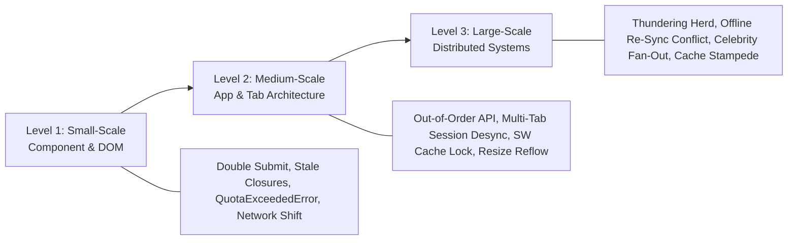

# 🔬 Small-to-Large Scenario Edge Case Master Bank

> **🎯 Target Audience:** Staff & Principal Engineers
> **Purpose:** Master real-world edge cases from micro UI component glitches to large-scale distributed system outages.
> **Existing Repo Tags:** 🔗 [See FE Q&A Bank](file:///Users/atulkumarawasthi/projects/SystemDesign/Prep/06-Interview-QA/FE-SD-QA.md) | 🔗 [See HLD Q&A Bank](file:///Users/atulkumarawasthi/projects/SystemDesign/Prep/06-Interview-QA/HLD-QA.md) | 🔗 [See Principal Q&A](file:///Users/atulkumarawasthi/projects/SystemDesign/Prep/06-Interview-QA/Principal-Level-QA.md)

---

## 🧭 Edge Case Progression Spectrum



---

## 🔍 Level 1: Small-Scale (Component & Browser DOM Edge Cases)

<details>
<summary>❓ 1. [Small-Scale] Double-Submit Payment Edge Case: User rapidly clicks "Pay Now" 5 times. How do you prevent duplicate charges at both Client and API layers?</summary>

### 💡 Solution Blueprint

1. **Client Layer:**
   - Instantly disable the button on first click and show a loading spinner.
   - Generate a client-side **Idempotency Key** (`crypto.randomUUID()`) when the payment form renders.
2. **API & DB Layer:**
   - Client passes `X-Idempotency-Key: uuid` header with the `POST /api/checkout` request.
   - API Gateway / Redis checks if `uuid` exists. If processing, return HTTP 409 / 202. If completed, return cached previous response.

```typescript
// Client-side Double Submit Protection with Idempotency Key
export function useIdempotentSubmit(onSubmit: (idempotencyKey: string) => Promise<void>) {
  const [submitting, setSubmitting] = useState(false);
  const idempotencyKeyRef = useRef(crypto.randomUUID());

  const handleSubmit = async () => {
    if (submitting) return; // Prevent concurrent double invocation
    setSubmitting(true);

    try {
      await onSubmit(idempotencyKeyRef.current);
    } finally {
      setSubmitting(false);
    }
  };

  return { handleSubmit, submitting, idempotencyKey: idempotencyKeyRef.current };
}
```

</details>

<details>
<summary>❓ 2. [Small-Scale] LocalStorage Quota Exceeded Edge Case: Browser throws `QuotaExceededError` when `localStorage.setItem()` hits 5MB limit. How does the app handle it without crashing?</summary>

### 💡 Solution Blueprint

1. **Safeguard with Try-Catch Wrapper:** Never invoke `localStorage.setItem()` raw without a try-catch block.
2. **LRU Fallback Eviction:** If quota is exceeded, purge oldest cached items from storage.
3. **Storage Tier Fallback:** Gracefully transition overflow data to **IndexedDB** or an in-memory `Map`.

```typescript
export function safeSetLocalStorage(key: string, value: string): void {
  try {
    localStorage.setItem(key, value);
  } catch (error) {
    if (
      error instanceof DOMException &&
      (error.code === 22 || error.name === 'QuotaExceededError' || error.name === 'NS_ERROR_DOM_QUOTA_REACHED')
    ) {
      console.warn('[Storage Full] Purging old cache keys to free memory...');
      // Evict oldest telemetry or draft keys
      localStorage.removeItem('telemetry_draft');
      try {
        localStorage.setItem(key, value);
      } catch (retryError) {
        console.error('[Storage Fallback] Storage strictly unavailable.', retryError);
      }
    }
  }
}
```

</details>

<details>
<summary>❓ 3. [Small-Scale] Out-of-Order API Responses & Race Conditions in Search/Filter UI: User quickly types "cat" then "dog". Request "cat" takes 800ms while "dog" takes 200ms. UI ends up displaying "cat" results. How do you guarantee correctness?</summary>

### 💡 Solution Blueprint

1. **AbortController Cancellation:** Before initiating a new search request, abort the preceding pending request via `AbortController.abort()`.
2. **Request Epoch / Timestamp Token:** Maintain a monotonic counter or timestamp ref. When an API response arrives, compare its token against the latest active token; if outdated, silently discard the payload.

```typescript
export function useLiveSearch<T>(fetcher: (query: string, signal: AbortSignal) => Promise<T>) {
  const [data, setData] = useState<T | null>(null);
  const abortControllerRef = useRef<AbortController | null>(null);
  const latestRequestIdRef = useRef(0);

  const search = async (query: string) => {
    // 1. Abort any previous pending request
    if (abortControllerRef.current) {
      abortControllerRef.current.abort();
    }
    const controller = new AbortController();
    abortControllerRef.current = controller;

    // 2. Increment request ID token
    const currentRequestId = ++latestRequestIdRef.current;

    try {
      const result = await fetcher(query, controller.signal);
      // 3. Only update state if this request is still the freshest
      if (currentRequestId === latestRequestIdRef.current) {
        setData(result);
      }
    } catch (err: any) {
      if (err.name !== 'AbortError') {
        console.error('Search failed', err);
      }
    }
  };

  return { data, search };
}
```

</details>

<details>
<summary>❓ 4. [Small-Scale] Main-Thread Freeze on Massive JSON Payloads (10MB+): A data grid API returns a 15MB JSON response. Calling `response.json()` locks the browser main thread for 250ms, triggering INP failure. How do you prevent it?</summary>

### 💡 Solution Blueprint

1. **Web Worker Offloading:** Fetch the raw byte array stream or run the network fetch entirely inside a dedicated **Web Worker**.
2. **Background Deserialization & Transformation:** The Web Worker executes `JSON.parse` and filters/sorts the data off the main thread.
3. **Structured Clone Transfer:** Return only the paginated slice or transfer raw `ArrayBuffer` objects with zero main-thread serialization cost.

```typescript
// worker.ts
self.onmessage = async (event: MessageEvent<{ url: string; pageSize: number }>) => {
  const { url, pageSize } = event.data;
  const res = await fetch(url);
  const fullData = await res.json(); // Parses 15MB JSON on background thread!

  // Transform and slice only what UI immediately needs
  const initialPage = fullData.slice(0, pageSize);
  self.postMessage({ page: initialPage, totalCount: fullData.length });
};
```

</details>

---

## 🏢 Level 2: Medium-Scale (Application & Tab Architecture Edge Cases)

<details>
<summary>❓ 5. [Medium-Scale] Multi-Tab Session Desync Edge Case: User logs out in Tab 1, but Tab 2 is open and tries to submit a private form. How do you sync auth state across tabs instantly?</summary>

### 💡 Solution Blueprint

Use the **`BroadcastChannel` API** or listen to the **`storage` event**.

- When Tab 1 clears authentication tokens, broadcast a `LOGOUT` event message across all open tabs belonging to the same origin.
- All sibling tabs listen for the channel event and automatically redirect to `/login` or clear in-memory state.

```typescript
// Cross-Tab Session Synchronization Engine
export class CrossTabAuthSync {
  private channel = new BroadcastChannel('auth_sync_channel');

  constructor(onLogout: () => void) {
    this.channel.onmessage = (event) => {
      if (event.data.type === 'LOGOUT') {
        console.log('[Auth Sync] Received logout signal from another tab.');
        onLogout();
      }
    };
  }

  notifyLogout() {
    this.channel.postMessage({ type: 'LOGOUT', timestamp: Date.now() });
  }

  close() {
    this.channel.close();
  }
}
```

</details>

<details>
<summary>❓ 6. [Medium-Scale] Service Worker Stale Cache Lock Edge Case: A new app version is deployed on CDN, but users' browsers are stuck loading outdated index.html cached by Service Worker. How do you break the cache lock?</summary>

### 💡 Solution Blueprint

1. **Network-First Strategy for `sw.js`:** Ensure server returns `Cache-Control: no-cache, no-store, must-revalidate` for `sw.js` script so browser checks for updates on every page load.
2. **Immediate Activation:** Inside new Service Worker lifecycle, call `self.skipWaiting()` during `install` phase and `self.clients.claim()` during `activate` phase.
3. **Client Reload Prompt:** Main application listens for `controllerchange` event and shows a toast: _"New version available! Click to reload."_
</details>

<details>
<summary>❓ 7. [Medium-Scale] Token Refresh Thundering Herd Edge Case: Access token expires while 8 parallel API requests are in flight. All 8 return 401 Unauthorized simultaneously. How do you prevent 8 concurrent refresh calls from invalidating the session?</summary>

### 💡 Solution Blueprint

Implement an **In-Flight Refresh Mutex Lock** inside the HTTP client response interceptor.

1. The first 401 initiates a single `refreshAccessToken()` promise.
2. The remaining 7 requests are queued in memory until the refresh promise settles.
3. Once the token resolves, all queued requests replay with the fresh Bearer token; if the refresh fails, all are rejected and user is routed to `/login`.

```typescript
let isRefreshing = false;
let refreshSubscribers: Array<(token: string) => void> = [];

function subscribeTokenRefresh(cb: (token: string) => void) {
  refreshSubscribers.push(cb);
}

function onRefreshed(token: string) {
  refreshSubscribers.forEach((cb) => cb(token));
  refreshSubscribers = [];
}

export async function handle401Interceptor(errorResponse: Response, originalRequest: Request): Promise<Response> {
  if (errorResponse.status === 401) {
    if (!isRefreshing) {
      isRefreshing = true;
      try {
        const { accessToken } = await apiRefreshToken();
        isRefreshing = false;
        onRefreshed(accessToken);
      } catch (err) {
        isRefreshing = false;
        refreshSubscribers = [];
        window.location.href = '/login';
        throw err;
      }
    }

    // Queue subsequent requests until token refresh completes
    return new Promise((resolve) => {
      subscribeTokenRefresh((newToken: string) => {
        const retriedRequest = new Request(originalRequest, {
          headers: { ...originalRequest.headers, Authorization: `Bearer ${newToken}` },
        });
        resolve(fetch(retriedRequest));
      });
    });
  }
  return errorResponse;
}
```

</details>

<details>
<summary>❓ 8. [Medium-Scale] Cascading Context Re-Render Avalanche: A centralized DashboardContext stores user profile, unread notification count, and high-frequency real-time stock quotes. Every quote tick re-renders 200 components across the page. How do you fix it?</summary>

### 💡 Solution Blueprint

1. **Context Slicing by Update Frequency:** Split single monolithic context into `StaticUserContext`, `NotificationContext`, and `HighFrequencyTickerContext`.
2. **Atomic Store with Fine-Grained Selectors:** Migrate high-frequency state to an external store (e.g. Zustand or Jotai) utilizing React 18's `useSyncExternalStore`. Components re-render only when their specific selector output changes:

```typescript
// Components only subscribe to the specific slice they care about:
const applePrice = useStockStore((state) => state.quotes['AAPL']);
```

</details>

<details>
<summary>❓ 9. [Medium-Scale] Detached DOM Tree Memory Leaks in Long-Lived Infinite Feeds: Users scroll an infinite list for 30 minutes; memory consumption balloons to 1.5GB and the browser tab crashes even though offscreen items were removed. What causes this?</summary>

### 💡 Solution Blueprint

1. **Root Cause:** Detached DOM nodes retained by JavaScript closures. Common culprits: global window event listeners (e.g., `window.addEventListener('resize')`), active `setInterval` timers holding component references, or tooltip/chart libraries creating internal DOM element references that are not destroyed on component unmount.
2. **Fix:**
   - Always return explicit cleanup functions in `useEffect` to call `.destroy()` on external charting/tooltip instances.
   - Use `WeakMap` or `WeakRef` when caching DOM node associations so garbage collection can clean them up.
   - Profile via Chrome DevTools **Memory -> Heap Snapshot** filtering by `Detached HTMLElement`.

</details>

---

## 🌐 Level 3: Large-Scale (Distributed System Edge Cases)

<details>
<summary>❓ 10. [Large-Scale] Thundering Herd Reconnect Edge Case: 100,000 WebSocket clients disconnect during a network switch restart. When server recovers, all 100k clients reconnect simultaneously, crushing backend CPU. How do you prevent it?</summary>

### 💡 Solution Blueprint

Implement **Exponential Backoff with Full Jitter** on client reconnect logic. Randomize reconnect attempt intervals across all clients to spread connection load evenly over time.

```typescript
export function calculateReconnectDelay(attempt: number, baseMs = 1000, maxMs = 30000): number {
  // Exponential growth: 1s, 2s, 4s, 8s, 16s, 30s
  const temp = Math.min(maxMs, baseMs * Math.pow(2, attempt));
  // Full jitter randomizes attempt within [0, temp] range
  return Math.floor(Math.random() * temp);
}
```

</details>

<details>
<summary>❓ 11. [Large-Scale] Cache Stampede (Dog-Piling) Edge Case: High-traffic product page cache key expires in Redis while receiving 50,000 QPS. All 50k requests hit PostgreSQL database simultaneously, crashing the DB. How do you prevent it?</summary>

### 💡 Solution Blueprint

1. **Mutex Locking (Distributed Lock):** When cache miss occurs, only the _first_ thread acquires a Redis lock to query DB and update cache; other 49,999 threads wait 50ms and re-read Redis.
2. **Probabilistic Early Expiration (XFetch Algorithm):** As cache TTL nears expiration (e.g. 10% remaining), randomly trigger background cache refresh before the key actually expires.
3. **Stale-While-Revalidate:** Return stale cached data immediately while asynchronously updating cache in background.
</details>

<details>
<summary>❓ 12. [Large-Scale] Celebrity Fan-Out Write Amplification Edge Case: A celebrity with 100 Million followers posts a video. In a naive Push model, attempting 100M Redis timeline writes in 1 second causes Redis queue crash. How do you fix it?</summary>

### 💡 Solution Blueprint

Implement a **Hybrid Push/Pull Model**:

- **Regular Users (< 10k followers):** Use **Push Model (Fan-out on Write)**. When they post, push tweet ID into all followers' Redis timeline caches.
- **Celebrities (> 10k followers):** Use **Pull Model (Fan-out on Read)**. Store tweet in celebrity's own timeline. Do NOT push to 100M followers.
- **Feed Rendering:** When follower opens feed, fetch their pre-computed push cache and dynamically pull/merge recent posts from followed celebrities in memory.
</details>

<details>
<summary>❓ 13. [Large-Scale] Micro-Frontend Shared Dependency Collision & Hydration Mismatch: Three micro-frontends (MFEs) developed independently by separate teams are loaded via Webpack Module Federation onto one page. Users experience broken React context and multi-megabyte bundle bloat. How do you solve it?</summary>

### 💡 Solution Blueprint

1. **Module Federation Singletons:** Configure host and remotes with `singleton: true` and strict `requiredVersion` semver constraints for shared runtimes (`react`, `react-dom`):
   ```javascript
   shared: {
     react: { singleton: true, requiredVersion: '^18.2.0', eager: false },
     'react-dom': { singleton: true, requiredVersion: '^18.2.0', eager: false },
   }
   ```
2. **Strict Fallback Isolation:** If an MFE cannot satisfy the version requirement, it must run inside an isolated iframe or web component shadow DOM boundary rather than polluting global window namespaces.
3. **Federated CI Contract Testing:** Enforce automated CI checks verifying compatible ABI and singleton resolution across MFE repository pipelines before deploying remotes to production CDN.
</details>

---

## 📊 Summary Table: Small vs Medium vs Large Edge Cases

| Scale      | Scenario            | Risk / Impact                      | Solution / Prevention Pattern                             |
| :--------- | :------------------ | :--------------------------------- | :-------------------------------------------------------- |
| **Small**  | Double Submit       | Duplicate billing charges          | Idempotency Key header + Disable button                   |
| **Small**  | QuotaExceededError  | App crashes when storage full      | Try-Catch + LRU purge + IndexedDB fallback                |
| **Small**  | Search Race Cond.   | Out-of-order query responses       | `AbortController` + Monotonic Request Token               |
| **Small**  | 10MB+ JSON Freeze   | Main thread blocked >200ms (INP)   | Dedicated Web Worker offloading & parsing                 |
| **Medium** | Multi-Tab Desync    | Stale auth actions in sibling tab  | `BroadcastChannel` API + `storage` event                  |
| **Medium** | SW Cache Lock       | Users stuck on old app release     | `skipWaiting()`, `clients.claim()`, `no-cache` on `sw.js` |
| **Medium** | 401 Thundering Herd | Expired token floods refresh API   | Centralized in-flight refresh mutex queue                 |
| **Medium** | Context Avalanche   | High-frequency ticks re-render all | Context slicing by frequency or atomic store selectors    |
| **Medium** | Detached DOM Leaks  | Uncleaned memory crashes tab       | Strict unmount cleanup, `WeakRef`, Heap Snapshot audits   |
| **Large**  | Thundering Herd     | Server CPU crash on reconnect      | Exponential Backoff with Full Jitter                      |
| **Large**  | Cache Stampede      | DB crash on cache TTL expiry       | Distributed Mutex / Probabilistic Early Expiry            |
| **Large**  | Celebrity Fan-Out   | Redis queue write explosion        | Hybrid Push/Pull Fan-out Architecture                     |
| **Large**  | MFE Bundle Clash    | Multi-version React & broken ctx   | Module Federation `singleton: true` + semver contract     |
