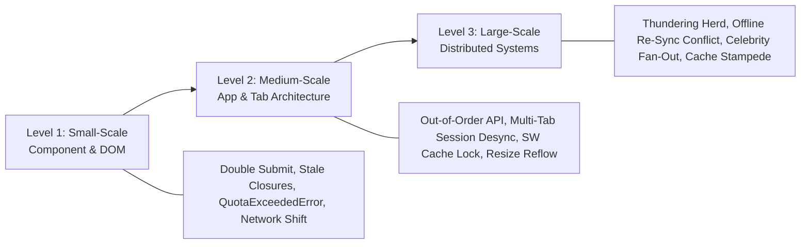

# 🔬 Small-to-Large Scenario Edge Case Master Bank

> **🎯 Target Audience:** Staff & Principal Engineers
> **Purpose:** Master real-world edge cases from micro UI component glitches to large-scale distributed system outages.
> **Existing Repo Tags:** 🔗 [See FE Q&A Bank](file:///Users/atulkumarawasthi/projects/SystemDesign/Prep/06-Interview-QA/FE-SD-QA.md) | 🔗 [See HLD Q&A Bank](file:///Users/atulkumarawasthi/projects/SystemDesign/Prep/06-Interview-QA/HLD-QA.md) | 🔗 [See Principal Q&A](file:///Users/atulkumarawasthi/projects/SystemDesign/Prep/06-Interview-QA/Principal-Level-QA.md)

---

## 🧭 Edge Case Progression Spectrum



---

## 🔍 Level 1: Small-Scale (Component & Browser DOM Edge Cases)

<details>
<summary>❓ 1. [Small-Scale] Double-Submit Payment Edge Case: User rapidly clicks "Pay Now" 5 times. How do you prevent duplicate charges at both Client and API layers?</summary>

### 💡 Solution Blueprint

1. **Client Layer:**
   - Instantly disable the button on first click and show a loading spinner.
   - Generate a client-side **Idempotency Key** (`crypto.randomUUID()`) when the payment form renders.
2. **API & DB Layer:**
   - Client passes `X-Idempotency-Key: uuid` header with the `POST /api/checkout` request.
   - API Gateway / Redis checks if `uuid` exists. If processing, return HTTP 409 / 202. If completed, return cached previous response.

```typescript
// Client-side Double Submit Protection with Idempotency Key
export function useIdempotentSubmit(onSubmit: (idempotencyKey: string) => Promise<void>) {
  const [submitting, setSubmitting] = useState(false);
  const idempotencyKeyRef = useRef(crypto.randomUUID());

  const handleSubmit = async () => {
    if (submitting) return; // Prevent concurrent double invocation
    setSubmitting(true);

    try {
      await onSubmit(idempotencyKeyRef.current);
    } finally {
      setSubmitting(false);
    }
  };

  return { handleSubmit, submitting, idempotencyKey: idempotencyKeyRef.current };
}
```

</details>

<details>
<summary>❓ 2. [Small-Scale] LocalStorage Quota Exceeded Edge Case: Browser throws `QuotaExceededError` when `localStorage.setItem()` hits 5MB limit. How does the app handle it without crashing?</summary>

### 💡 Solution Blueprint

1. **Safeguard with Try-Catch Wrapper:** Never invoke `localStorage.setItem()` raw without a try-catch block.
2. **LRU Fallback Eviction:** If quota is exceeded, purge oldest cached items from storage.
3. **Storage Tier Fallback:** Gracefully transition overflow data to **IndexedDB** or an in-memory `Map`.

```typescript
export function safeSetLocalStorage(key: string, value: string): void {
  try {
    localStorage.setItem(key, value);
  } catch (error) {
    if (
      error instanceof DOMException &&
      (error.code === 22 || error.name === 'QuotaExceededError' || error.name === 'NS_ERROR_DOM_QUOTA_REACHED')
    ) {
      console.warn('[Storage Full] Purging old cache keys to free memory...');
      // Evict oldest telemetry or draft keys
      localStorage.removeItem('telemetry_draft');
      try {
        localStorage.setItem(key, value);
      } catch (retryError) {
        console.error('[Storage Fallback] Storage strictly unavailable.', retryError);
      }
    }
  }
}
```

</details>

---

## 🏢 Level 2: Medium-Scale (Application & Tab Architecture Edge Cases)

<details>
<summary>❓ 3. [Medium-Scale] Multi-Tab Session Desync Edge Case: User logs out in Tab 1, but Tab 2 is open and tries to submit a private form. How do you sync auth state across tabs instantly?</summary>

### 💡 Solution Blueprint

Use the **`BroadcastChannel` API** or listen to the **`storage` event**.

- When Tab 1 clears authentication tokens, broadcast a `LOGOUT` event message across all open tabs belonging to the same origin.
- All sibling tabs listen for the channel event and automatically redirect to `/login` or clear in-memory state.

```typescript
// Cross-Tab Session Synchronization Engine
export class CrossTabAuthSync {
  private channel = new BroadcastChannel('auth_sync_channel');

  constructor(onLogout: () => void) {
    this.channel.onmessage = (event) => {
      if (event.data.type === 'LOGOUT') {
        console.log('[Auth Sync] Received logout signal from another tab.');
        onLogout();
      }
    };
  }

  notifyLogout() {
    this.channel.postMessage({ type: 'LOGOUT', timestamp: Date.now() });
  }

  close() {
    this.channel.close();
  }
}
```

</details>

<details>
<summary>❓ 4. [Medium-Scale] Service Worker Stale Cache Lock Edge Case: A new app version is deployed on CDN, but users' browsers are stuck loading outdated index.html cached by Service Worker. How do you break the cache lock?</summary>

### 💡 Solution Blueprint

1. **Network-First Strategy for `sw.js`:** Ensure server returns `Cache-Control: no-cache, no-store, must-revalidate` for `sw.js` script so browser checks for updates on every page load.
2. **Immediate Activation:** Inside new Service Worker lifecycle, call `self.skipWaiting()` during `install` phase and `self.clients.claim()` during `activate` phase.
3. **Client Reload Prompt:** Main application listens for `controllerchange` event and shows a toast: _"New version available! Click to reload."_
</details>

---

## 🌐 Level 3: Large-Scale (Distributed System Edge Cases)

<details>
<summary>❓ 5. [Large-Scale] Thundering Herd Reconnect Edge Case: 100,000 WebSocket clients disconnect during a network switch restart. When server recovers, all 100k clients reconnect simultaneously, crushing backend CPU. How do you prevent it?</summary>

### 💡 Solution Blueprint

Implement **Exponential Backoff with Full Jitter** on client reconnect logic. Randomize reconnect attempt intervals across all clients to spread connection load evenly over time.

```typescript
export function calculateReconnectDelay(attempt: number, baseMs = 1000, maxMs = 30000): number {
  // Exponential growth: 1s, 2s, 4s, 8s, 16s, 30s
  const temp = Math.min(maxMs, baseMs * Math.pow(2, attempt));
  // Full jitter randomizes attempt within [0, temp] range
  return Math.floor(Math.random() * temp);
}
```

</details>

<details>
<summary>❓ 6. [Large-Scale] Cache Stampede (Dog-Piling) Edge Case: High-traffic product page cache key expires in Redis while receiving 50,000 QPS. All 50k requests hit PostgreSQL database simultaneously, crashing the DB. How do you prevent it?</summary>

### 💡 Solution Blueprint

1. **Mutex Locking (Distributed Lock):** When cache miss occurs, only the _first_ thread acquires a Redis lock to query DB and update cache; other 49,999 threads wait 50ms and re-read Redis.
2. **Probabilistic Early Expiration (XFetch Algorithm):** As cache TTL nears expiration (e.g. 10% remaining), randomly trigger background cache refresh before the key actually expires.
3. **Stale-While-Revalidate:** Return stale cached data immediately while asynchronously updating cache in background.
</details>

<details>
<summary>❓ 7. [Large-Scale] Celebrity Fan-Out Write Amplification Edge Case: A celebrity with 100 Million followers posts a video. In a naive Push model, attempting 100M Redis timeline writes in 1 second causes Redis queue crash. How do you fix it?</summary>

### 💡 Solution Blueprint

Implement a **Hybrid Push/Pull Model**:

- **Regular Users (< 10k followers):** Use **Push Model (Fan-out on Write)**. When they post, push tweet ID into all followers' Redis timeline caches.
- **Celebrities (> 10k followers):** Use **Pull Model (Fan-out on Read)**. Store tweet in celebrity's own timeline. Do NOT push to 100M followers.
- **Feed Rendering:** When follower opens feed, fetch their pre-computed push cache and dynamically pull/merge recent posts from followed celebrities in memory.
</details>

---

## 📊 Summary Table: Small vs Medium vs Large Edge Cases

| Scale      | Scenario           | Risk / Impact                     | Solution / Prevention Pattern                             |
| :--------- | :----------------- | :-------------------------------- | :-------------------------------------------------------- |
| **Small**  | Double Submit      | Duplicate billing charges         | Idempotency Key header + Disable button                   |
| **Small**  | QuotaExceededError | App crashes when storage full     | Try-Catch + LRU purge + IndexedDB fallback                |
| **Medium** | Multi-Tab Desync   | Stale auth actions in sibling tab | `BroadcastChannel` API + `storage` event                  |
| **Medium** | SW Cache Lock      | Users stuck on old app release    | `skipWaiting()`, `clients.claim()`, `no-cache` on `sw.js` |
| **Large**  | Thundering Herd    | Server CPU crash on reconnect     | Exponential Backoff with Full Jitter                      |
| **Large**  | Cache Stampede     | DB crash on cache TTL expiry      | Distributed Mutex / Probabilistic Early Expiry            |
| **Large**  | Celebrity Fan-Out  | Redis queue write explosion       | Hybrid Push/Pull Fan-out Architecture                     |
