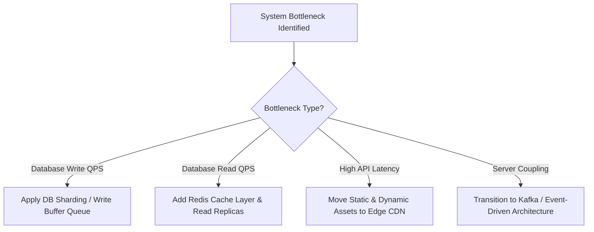

# ⚡ Architectural Tradeoffs Cheatsheet (Quick Reference Matrix)

> **🎯 Target Audience:** Staff & Principal Engineers
> **Focus:** High-speed interview reference card for X vs Y architectural decisions.
> **Existing Repo Tags:** 🔗 [See Communication Q&A](file:///Users/atulkumarawasthi/projects/SystemDesign/Communication/Communication_QA.md) | 🔗 [See Networking Q&A](file:///Users/atulkumarawasthi/projects/SystemDesign/Networking/Networking_QA.md) | 🔗 [See Database & Caching Q&A](file:///Users/atulkumarawasthi/projects/SystemDesign/Database&Caching/Database_Caching_QA.md) | 🔗 [See Security Q&A](file:///Users/atulkumarawasthi/projects/SystemDesign/Security/Security_QA.md)

---

## 🌐 1. Networking & API Protocols Tradeoffs

| Feature                 | REST                       | GraphQL                      | gRPC                           |
| :---------------------- | :------------------------- | :--------------------------- | :----------------------------- |
| **Data Format**         | JSON / Text                | JSON / Text                  | Protocol Buffers (Binary)      |
| **Transport Protocol**  | HTTP/1.1 or HTTP/2         | HTTP/1.1 or HTTP/2           | HTTP/2 (Strict multiplexing)   |
| **Over/Under Fetching** | ❌ Common issue            | 🟢 Zero over-fetching        | 🟢 Client proto specs          |
| **Caching**             | 🟢 Native HTTP & CDN cache | 🔴 Difficult (POST requests) | 🔴 Requires application level  |
| **Best Use Case**       | Public APIs, CRUD web apps | Complex frontend dashboards  | High-performance microservices |

---

## 💾 2. Client & Server Storage Tradeoffs

| Storage Mechanism     | Capacity | Synchronous/Async                | Security / Access                  | Best Use Case                       |
| :-------------------- | :------- | :------------------------------- | :--------------------------------- | :---------------------------------- |
| **`localStorage`**    | ~5MB     | Synchronous (Blocks Main Thread) | Accessible via JS (XSS Vulnerable) | Non-sensitive UI themes, draft text |
| **`sessionStorage`**  | ~5MB     | Synchronous                      | Tab-isolated, XSS Vulnerable       | Single-tab wizard form state        |
| **`httpOnly` Cookie** | ~4KB     | Sent automatically with HTTP     | Inaccessible via JS (XSS Safe)     | Authentication JWTs, Session IDs    |
| **IndexedDB**         | >250MB+  | Asynchronous (Transactional)     | Accessible via JS                  | Large offline PWA datasets, sync    |

---

## ⚡ 3. Real-Time Communication Tradeoffs

| Communication                | Duplex Mode                       | Connection Setup     | Overhead                  | Scalability / Load              | Primary Use Case                 |
| :--------------------------- | :-------------------------------- | :------------------- | :------------------------ | :------------------------------ | :------------------------------- |
| **Short Polling**            | Unidirectional                    | New HTTP per request | 🔴 Massive overhead       | 🔴 Destroys server at scale     | Low-frequency status checks      |
| **Long Polling**             | Unidirectional                    | Hanging HTTP request | 🟡 Moderate overhead      | 🟡 High memory per connection   | Legacy real-time push            |
| **SSE (Server-Sent Events)** | Unidirectional (Server -> Client) | 1 HTTP/2 stream      | 🟢 Sub-1kB frame overhead | 🟢 Extremely light on server    | Live stock tickers, AI streaming |
| **WebSockets**               | Full-Duplex (Bidirectional)       | TCP WS Upgrade       | 🟢 Low frame header       | 🟡 Requires stateful WS cluster | Collaborative whiteboards, Chat  |

---

## ⚛️ 4. State Management Library Tradeoffs

| Library            | Paradigm                    | Bundle Size    | Boilerplate | Best Use Case                                  |
| :----------------- | :-------------------------- | :------------- | :---------- | :--------------------------------------------- |
| **Context API**    | Dependency Injection        | 0kB (Built-in) | Low         | Low-frequency theme / user profile updates     |
| **Zustand**        | Unopinionated Store         | ~1.1kB         | Zero        | Modern React apps, global UI state             |
| **Redux Toolkit**  | Centralized Immutable Store | ~10kB          | Moderate    | Complex enterprise workflows, strict audit log |
| **Jotai / Recoil** | Atomic State                | ~3kB           | Low         | Derived fine-grained dynamic UI nodes          |
| **XState**         | Finite State Machine        | ~15kB          | High        | Mission-critical multi-step form workflows     |

---

## 🏛️ 5. Master Architecture Decision Matrix

