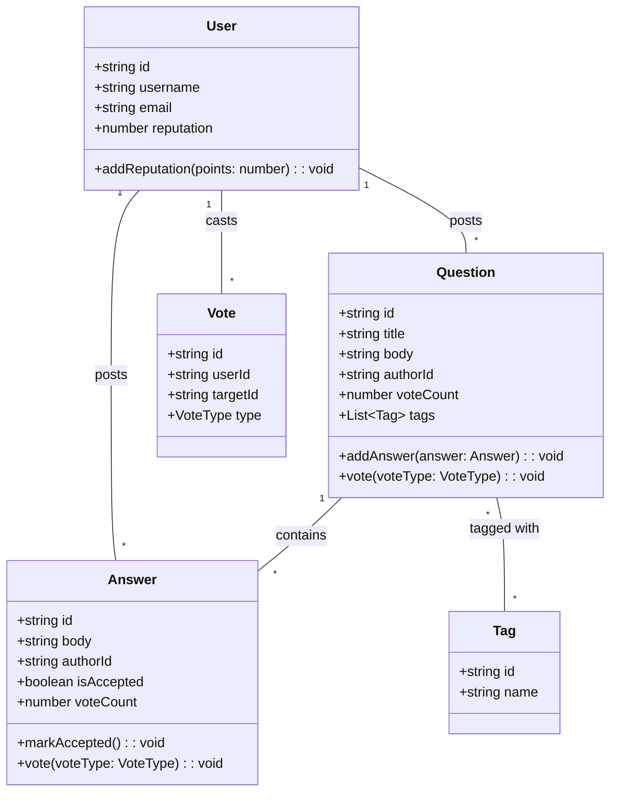
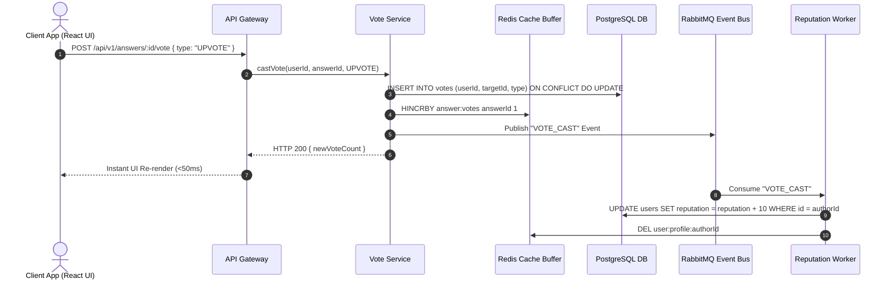
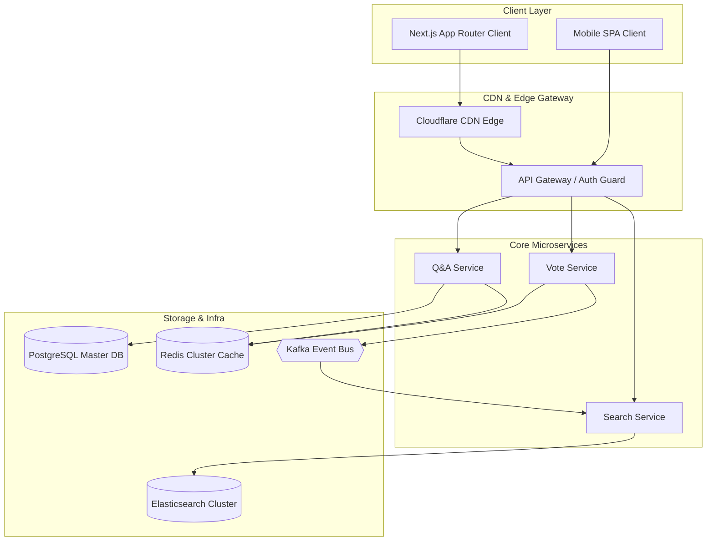
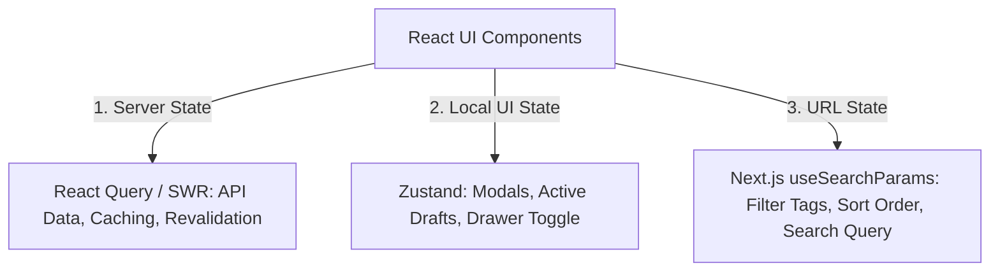
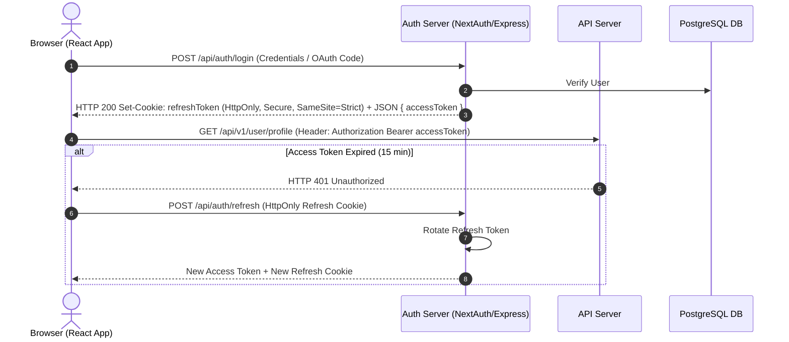

# 🛠️ Enterprise System Design Blueprint: Stack Overflow

> **Target Role:** Principal / Staff Architect / Senior LLD & HLD Engineers
> **Product Perspective:** Building a production-grade, multi-tenant Q&A platform serving 50M DAU with sub-100ms response times.
> **Navigation:** ⬅️ [Back to Problem Bank Index](./README.md) | 📅 [8-Week Roadmap](../ROADMAP.md)

---

## 1. 🎯 Requirements & Product Scope

### 📋 Functional Requirements (FR)

1. **User Profiles & Reputation:** Sign up, login (OAuth2/Email), user profiles, badges, and real-time reputation scoring.
2. **Ask Question:** Post questions with title, formatted markdown body, code blocks, syntax highlighting, and up to 5 tags.
3. **Post Answer:** Post answers to existing questions with live preview.
4. **Upvote / Downvote:** Concurrently vote on questions and answers (+10 for question/answer upvote, -2 for downvote).
5. **Accept Answer:** Question author can mark one answer as accepted (+15 reputation to answer author).
6. **Search & Tagging:** Full-text search by keywords and tag filters (`[react]`, `[typescript]`).

### ⚡ Non-Functional Requirements (NFR)

1. **High Availability:** $99.99\%$ uptime; public question pages served via CDN ISR ($<20\text{ms}$ TTFB).
2. **Low Read Latency:** Question thread pages load in $P_{99} < 100\text{ms}$.
3. **Scale Capacity:** 50 Million DAU, 100 Million daily page views, 10,000 QPS Peak Reads, 500 QPS Peak Writes.
4. **Security & Sanitization:** $100\%$ XSS protection for user-submitted Markdown/HTML, OAuth2 PKCE, CSP headers.

---

## 2. 🧮 Scale & Quantitative Estimates

```
Read/Write Ratio: 20:1 (Read-heavy)
Total Users: 50M DAU
Questions Created / Day: 100,000 questions
Answers Created / Day: 200,000 answers
Votes / Day: 5,000,000 votes

QPS Calculations:
- Peak Read QPS: (100M views / 86400s) * 2 = 2,300 QPS (Normal) -> 10,000 QPS Peak
- Peak Write QPS: (5.3M writes / 86400s) * 2 = ~120 QPS -> 500 QPS Peak

Storage Estimates (5 Years):
- Questions Table: 100k * 365 * 5 = 182.5M rows ~ 182.5 GB (avg 1KB text)
- Answers Table: 200k * 365 * 5 = 365M rows ~ 365 GB (avg 1KB text)
- Votes Table: 5M * 365 * 5 = 9.125 Billion rows ~ 365 GB
Total DB Storage: ~1 TB (Fits in sharded PostgreSQL cluster).
```

---

## 3. 🛠️ Tech Stack & Architectural Justifications

| Component                   | Technology Choice               | Architectural Rationale                                                                                                                         |
| :-------------------------- | :------------------------------ | :---------------------------------------------------------------------------------------------------------------------------------------------- |
| **Frontend Framework**      | Next.js 14 (App Router) + React | ISR (Incremental Static Regeneration) pre-renders public question pages for instant CDN delivery ($<20\text{ms}$ TTFB) and optimal SEO ranking. |
| **API Gateway**             | Express / Kong / Envoy          | JWT validation, rate limiting (Sliding Window), CORS enforcement, and request routing.                                                          |
| **Primary Database**        | PostgreSQL                      | Relational integrity for Users, Questions, Answers, Votes, and Tags. ACID transactions for Accepted Answers.                                    |
| **Cache Layer**             | Redis Cluster                   | Caching hot question threads, user sessions, and buffering vote counters to prevent DB write lock contention.                                   |
| **Search Engine**           | Elasticsearch                   | Inverted index for fast full-text search on titles, body text, and tag filtering (`[react]`).                                                   |
| **Async Queue / Event Bus** | RabbitMQ / Apache Kafka         | Decoupled event-driven reputation updates, notification triggers, and search indexing streams.                                                  |

---

## 4. 📐 Visual UML Diagrams

### 🏗️ Class Diagram (Low-Level Entities & Invariants)



### 🔄 Sequence Diagram: Voting Flow & Async Reputation Scoring



### 🧩 Component & System Architecture Diagram (HLD)



---

## 5. 🧱 OOP & SOLID Principles Mapping

- **Single Responsibility Principle (SRP):** `VoteService` only handles recording votes; `ReputationEngine` handles scoring calculations; `SearchService` handles indexing.
- **Open/Closed Principle (OCP):** Reputation rules implement a `ReputationStrategy` interface. Adding a new badge or bounty rule does not modify existing calculation logic.
- **Liskov Substitution Principle (LSP):** All vote target entities (`Question`, `Answer`) implement a common `Votable` interface and can be passed interchangeably to `VoteService`.
- **Interface Segregation Principle (ISP):** Client components depend on lean, role-specific interfaces (`VotableProps`, `AuthorProps`) rather than full monolithic entity objects.
- **Dependency Inversion Principle (DIP):** `VoteService` depends on a `KVStore` interface abstraction rather than hardcoding `RedisClient`.

---

## 6. 🎨 Design Patterns Applied

1. **Strategy Pattern:** `ReputationStrategy` (Question Upvote = +10, Answer Upvote = +10, Accepted Answer = +15, Downvote = -2).
2. **Observer Pattern:** Event Bus notifies `SearchIndexer` and `ReputationWorker` when a new question or vote occurs.
3. **Repository Pattern:** Isolates database queries from business services (`QuestionRepository`, `UserRepository`).
4. **Facade Pattern:** `QAFacade` provides a unified interface over question retrieval, answer sorting, and author reputation hydration.

---

## 7. 📂 Production Code & Folder Structure (Feature-Based Architecture)

```
apps/web/ (Next.js 14 App Router)
├── app/
│   ├── (auth)/
│   │   ├── login/page.tsx
│   │   └── register/page.tsx
│   ├── (questions)/
│   │   ├── page.tsx                    // Feed (ISR: 60s)
│   │   ├── ask/page.tsx                // Auth Guarded Ask Question Form
│   │   └── questions/[id]/page.tsx     // Question Thread Page (ISR: 10s)
│   ├── api/
│   │   └── auth/[...nextauth]/route.ts // NextAuth / OAuth2 Handler
│   ├── layout.tsx
│   └── middleware.ts                   // Auth Guard & Security Header Middleware
├── src/
│   ├── features/
│   │   ├── questions/
│   │   │   ├── components/
│   │   │   │   ├── QuestionCard.tsx
│   │   │   │   ├── MarkdownEditor.tsx
│   │   │   │   └── VoteButtons.tsx
│   │   │   ├── hooks/
│   │   │   │   ├── useVote.ts          // Optimistic Voting Hook
│   │   │   │   └── useAskQuestion.ts
│   │   │   ├── api/
│   │   │   │   └── questionApi.ts
│   │   │   └── types/
│   │   │       └── index.ts
│   │   └── reputation/
│   │       ├── components/ReputationBadge.tsx
│   │       └── store/useReputationStore.ts
│   ├── lib/
│   │   ├── fetcher.ts                  // Axios / Fetch Wrapper with Auth Interceptor
│   │   ├── sanitizer.ts                // DOMPurify / Trusted Types XSS Sanitizer
│   │   └── store.ts                    // Zustand Global App State
│   └── styles/
```

---

## 8. 🔀 Routing & Page Architecture (Next.js App Router)

```typescript
// app/questions/[id]/page.tsx — Hybrid ISR Page (Static CDN Shell + Dynamic React Query Client)
import { Suspense } from 'react';
import { notFound } from 'next/navigation';
import { QuestionThreadView } from '@/features/questions/components/QuestionThreadView';

export const revalidate = 60; // Incremental Static Regeneration every 60 seconds

export async function generateStaticParams() {
  // Pre-render top 1,000 hot questions at build time
  const hotQuestions = await fetch('https://api.stackoverflow.org/questions/hot?limit=1000').then(res => res.json());
  return hotQuestions.map((q: { id: string }) => ({ id: q.id }));
}

export default async function QuestionPage({ params }: { params: { id: string } }) {
  const initialData = await fetch(`https://api.stackoverflow.org/questions/${params.id}`, {
    next: { revalidate: 60, tags: [`question-${params.id}`] }
  }).then(res => res.ok ? res.json() : null);

  if (!initialData) notFound();

  return (
    <Suspense fallback={<div>Loading Question Thread...</div>}>
      <QuestionThreadView initialData={initialData} questionId={params.id} />
    </Suspense>
  );
}
```

---

## 9. 🧠 State Management Architecture



---

## 10. 🔐 Auth & Security Architecture

### 🛡️ XSS Prevention (Trusted Types + DOMPurify)

```typescript
// src/lib/sanitizer.ts — Trusted Types XSS Sanitizer
import DOMPurify from 'dompurify';

export function sanitizeUserHtml(rawHtml: string): string {
  return DOMPurify.sanitize(rawHtml, {
    ALLOWED_TAGS: ['p', 'b', 'i', 'code', 'pre', 'a', 'h1', 'h2', 'blockquote', 'ul', 'li'],
    ALLOWED_ATTR: ['href', 'class', 'target'],
    ALLOW_DATA_ATTR: false,
  });
}
```

### 🔑 OAuth2 PKCE + Token Rotation



---

## 11. 💻 Production TypeScript Implementations

### Domain Models & Reputation Strategy

```typescript
export enum VoteType {
  UPVOTE = 1,
  DOWNVOTE = -1,
}

export interface ReputationStrategy {
  calculatePoints(voteType: VoteType, isAnswer: boolean): number;
}

export class StandardReputationStrategy implements ReputationStrategy {
  calculatePoints(voteType: VoteType, isAnswer: boolean): number {
    if (voteType === VoteType.UPVOTE) return 10;
    return -2; // Downvote penalty
  }
}

export class VoteService {
  constructor(
    private db: any,
    private cache: any,
    private eventBus: any,
    private repStrategy: ReputationStrategy,
  ) {}

  async vote(userId: string, targetId: string, isAnswer: boolean, voteType: VoteType): Promise<number> {
    const hasVoted = await this.cache.sismember(`voted:${targetId}`, userId);
    if (hasVoted) throw new Error('User has already voted on this item');

    await this.db.query(`INSERT INTO votes (user_id, target_id, vote_type) VALUES ($1, $2, $3)`, [
      userId,
      targetId,
      voteType,
    ]);

    await this.cache.sadd(`voted:${targetId}`, userId);
    const newCount = await this.cache.hincrby(`item:votes`, targetId, voteType);

    const points = this.repStrategy.calculatePoints(voteType, isAnswer);
    await this.eventBus.publish('VOTE_EVENT', { targetId, points });

    return newCount;
  }
}
```

### Optimistic UI Voting Hook (`useVote`)

```typescript
// src/features/questions/hooks/useVote.ts
import { useMutation, useQueryClient } from '@tanstack/react-query';
import { questionApi } from '../api/questionApi';

export function useVote(questionId: string) {
  const queryClient = useQueryClient();

  return useMutation({
    mutationFn: (voteType: 'UPVOTE' | 'DOWNVOTE') => questionApi.castVote(questionId, voteType),

    onMutate: async (voteType) => {
      await queryClient.cancelQueries({ queryKey: ['question', questionId] });
      const previousData = queryClient.getQueryData(['question', questionId]);

      queryClient.setQueryData(['question', questionId], (old: any) => {
        if (!old) return old;
        const delta = voteType === 'UPVOTE' ? 1 : -1;
        return {
          ...old,
          votes: old.votes + delta,
          userVote: voteType,
        };
      });

      return { previousData };
    },

    onError: (err, voteType, context) => {
      if (context?.previousData) {
        queryClient.setQueryData(['question', questionId], context.previousData);
      }
    },

    onSettled: () => {
      queryClient.invalidateQueries({ queryKey: ['question', questionId] });
    },
  });
}
```

---

## 12. 📈 Scale, Edge Cases & Bottlenecks Deep Dive

- **Hot Question Thundering Herd:** Highly active questions receiving 5,000 votes/sec.
  - _Solution:_ Buffer votes in Redis hash maps using `HINCRBY` and flush to PostgreSQL asynchronously every 5 seconds via background worker.
- **Double Voting Prevention:**
  - _Solution:_ Redis `SADD` set tracking `voted:{question_id}` + Unique DB constraint `(user_id, target_id)`.
- **Search Performance:** Full-text `LIKE %query%` SQL queries break at 10M rows.
  - _Solution:_ Sync PostgreSQL changes asynchronously via CDC (Debezium/Kafka) into Elasticsearch inverted index.

---

## ❓ 13. Collapsed Interviewer Grill Q&A

<details>
<summary>❓ How do you prevent a user from upvoting their own question or answer?</summary>

**Answer:**
In `VoteService.vote()`, query the target item's `author_id`. If `target.author_id === userId`, throw a `ForbiddenException("Cannot vote on own post")`. Enforce an immutable DB trigger constraint checking `NEW.user_id <> target.author_id`.

</details>

<details>
<summary>❓ How do you handle Accepted Answer changes when an author un-accepts and accepts a new answer?</summary>

**Answer:**
Wrap the un-accept and new accept operations inside a single PostgreSQL database transaction (`BEGIN TRANSACTION` ... `COMMIT`). Decrement -15 reputation from the old answer author and increment +15 to the new answer author atomically.

</details>
