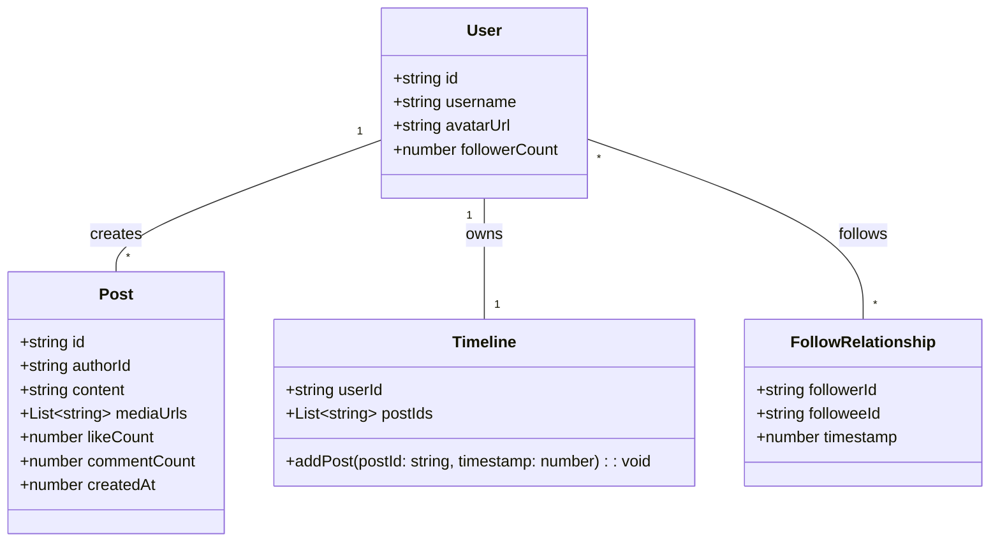
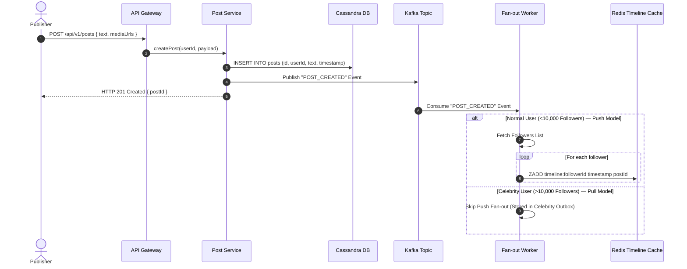
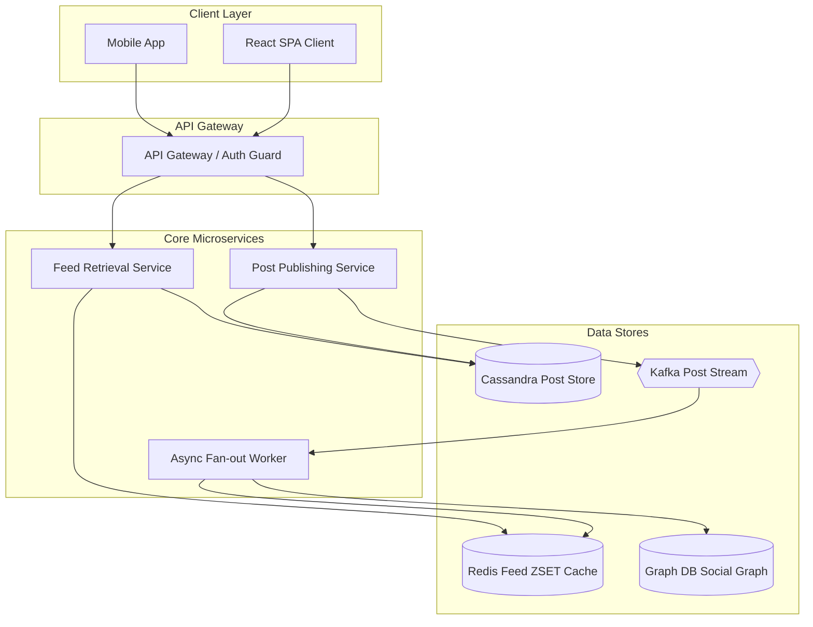
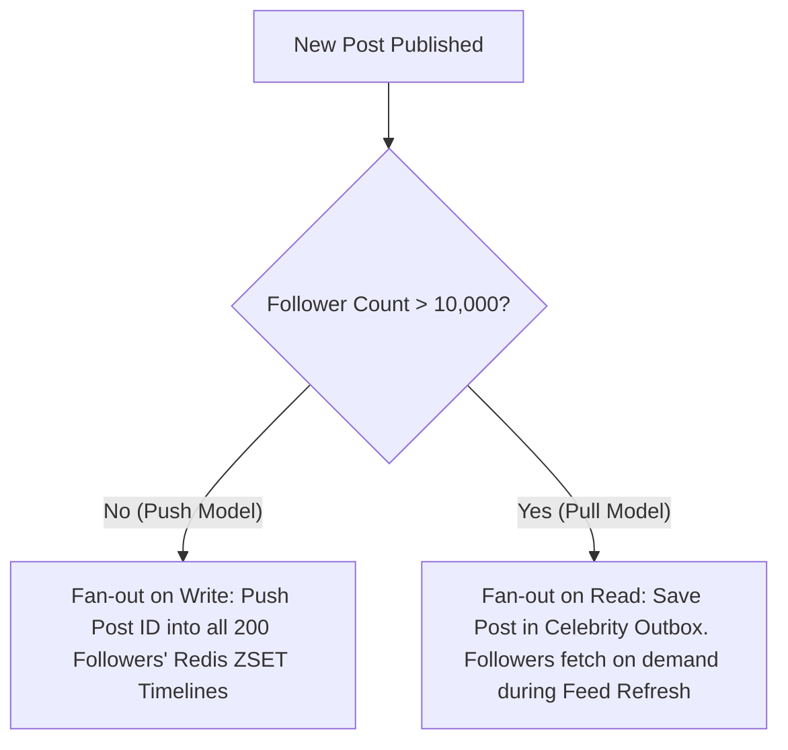
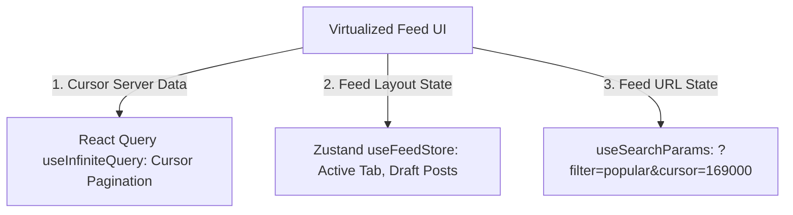

# 🛠️ Enterprise System Design Blueprint: Social Network (News Feed & Social Graph)

> **Target Role:** Principal / Staff Architect / Senior LLD & HLD Engineers  
> **Product Perspective:** Building a scalable social platform serving 100M DAU with real-time news feeds, hybrid push/pull fan-out, and virtualized 60 FPS scrolling.  
> **Navigation:** ⬅️ [Back to Problem Bank Index](./README.md) | 📅 [8-Week Roadmap](../ROADMAP.md)

---

## 1. 🎯 Requirements & Product Scope

### 📋 Functional Requirements (FR)
1. **User Connections:** Follow/unfollow users and establish bidirectional friendship connections.
2. **Post Publishing:** Create posts containing text, images, and embedded video links.
3. **News Feed Generation:** Infinite-scroll personalized timeline feed ordered chronologically or by relevance ranking.
4. **Social Interactions:** Like, comment, and share posts with instant optimistic UI feedback.

### ⚡ Non-Functional Requirements (NFR)
1. **Low Feed Latency:** News feed retrieval $P_{99} < 100\text{ms}$.
2. **Scale Capacity:** 100M DAU, 1B daily feed reads, 100M daily post writes.
3. **Celebrity Fan-out Protection:** Accounts with 100M followers do not crash Redis memory or background queues.

---

## 2. 🧮 Scale & Quantitative Estimates

```
Users: 500 Million Total Users, 100 Million DAU
Average Follows per User: 200 users
Posts per Day: 100M posts/day (Avg 1 post/user/day)
Feed Reads per Day: 1 Billion reads/day (Avg 10 feed refreshes/user/day)

Read to Write Ratio: 10:1

QPS Calculations:
- Peak Writes: 100M / 86400 * 2 = ~2,300 post writes / sec
- Peak Reads: 1B / 86400 * 2 = ~23,000 feed reads / sec

Storage Estimates:
- Post Metadata: 100M posts * 500 bytes = 50 GB / day -> 18.25 TB / year
- Media Storage: 10% posts contain 2MB image = 20M images * 2MB = 40 TB / day
```

---

## 3. 🛠️ Tech Stack & Architectural Justifications

| Component | Technology Choice | Architectural Rationale |
|:---|:---|:---|
| **Frontend UI** | Next.js 14 App Router + React Virtual | Virtualized Feed list rendering (`@tanstack/react-virtual`) for 60 FPS scrolling without DOM bloat. |
| **Edge CDN** | Cloudflare / AWS CloudFront | Caches static assets, images, and videos at geographic edge locations. |
| **Feed Storage Engine** | Redis Cluster | Stores pre-computed user feed timeline post IDs in Redis `ZSET` (sorted by timestamp). |
| **Social Graph DB** | Neo4j / AWS Neptune | Optimized for multi-hop graph traversals and 2nd-degree connection queries. |
| **Primary Data Store** | Cassandra / DynamoDB | Wide-column NoSQL store for high write throughput of post content and user metadata. |
| **Async Message Bus** | Apache Kafka | Handles post fan-out pipeline, notification events, and search indexing streams. |

---

## 4. 📐 Visual UML Diagrams

### 🏗️ Class Diagram (Social Graph & Feed Entities)



### 🔄 Sequence Diagram: Post Publishing & Hybrid Fan-out Flow



### 🧩 Component & System Architecture Diagram (HLD)



---

## 5. 🧱 Hybrid Fan-Out Architecture (Push vs Pull Model)



---

## 6. 🧱 OOP & SOLID Principles Mapping

- **Single Responsibility Principle (SRP):** `PostService` handles creation; `FanoutWorker` handles timeline propagation; `FeedService` handles reading.
- **Open/Closed Principle (OCP):** Feed ranking algorithm uses a `FeedRankingStrategy` interface (`ChronologicalSort`, `EngagementScoreSort`).
- **Dependency Inversion Principle (DIP):** `FeedService` depends on a `SocialGraphRepository` interface rather than hardcoding Neo4j drivers.

---

## 7. 🎨 Design Patterns Applied

1. **Observer Pattern:** Kafka event stream notifies fan-out workers and notification services when a post is created.
2. **Strategy Pattern:** `FeedRankingStrategy` dynamically ranks timeline posts.
3. **Outbox Pattern:** Transactional Outbox pattern guarantees post events are reliably published to Kafka.

---

## 8. 📂 Production Code & Folder Structure (Modular Feature Pattern)

```
apps/social-web/
├── app/
│   ├── (feed)/
│   │   ├── page.tsx                    // Feed Infinite Scroll (CSR + React Query)
│   │   └── posts/[id]/page.tsx         // Single Post View (SSR)
│   ├── (profile)/
│   │   └── [username]/page.tsx         // User Profile & Timeline
│   ├── middleware.ts                   // Auth Guard & CORS Middleware
├── src/
│   ├── features/
│   │   ├── feed/
│   │   │   ├── components/
│   │   │   │   ├── PostFeedList.tsx    // Virtualized Infinite Scroll List
│   │   │   │   ├── PostCard.tsx
│   │   │   │   └── CreatePostBox.tsx
│   │   │   ├── hooks/
│   │   │   │   ├── useInfiniteFeed.ts  // Cursor-Based Infinite Query
│   │   │   │   └── usePostLike.ts      // Optimistic Like Mutation
│   │   │   └── store/
│   │   │       └── useFeedStore.ts     // Draft state & filter controls
│   │   └── graph/
│   │       ├── hooks/useFollow.ts
│   │       └── api/graphApi.ts
│   ├── lib/
│   │   ├── security/
│   │   │   ├── csrf.ts                 // CSRF Token Interceptor
│   │   │   └── sanitize.ts             // DOMPurify XSS Filter
│   │   └── queryClient.ts
```

---

## 9. 🔀 Routing & Virtualized Feed Architecture

```typescript
// src/features/feed/components/PostFeedList.tsx — Virtualized Infinite Feed Renderer
import React from 'react';
import { useWindowVirtualizer } from '@tanstack/react-virtual';
import { PostCard } from './PostCard';
import { Post } from '../types';

interface PostFeedListProps {
  posts: Post[];
  fetchNextPage: () => void;
  hasNextPage: boolean;
}

export const PostFeedList: React.FC<PostFeedListProps> = ({ posts, fetchNextPage, hasNextPage }) => {
  const listRef = React.useRef<HTMLDivElement>(null);

  const rowVirtualizer = useWindowVirtualizer({
    count: posts.length,
    estimateSize: () => 350,
    overscan: 5,
  });

  return (
    <div ref={listRef} className="feed-container">
      <div style={{ height: `${rowVirtualizer.getTotalSize()}px`, position: 'relative' }}>
        {rowVirtualizer.getVirtualItems().map((virtualRow) => {
          const post = posts[virtualRow.index];
          return (
            <div
              key={post.id}
              style={{
                position: 'absolute',
                top: 0,
                left: 0,
                width: '100%',
                transform: `translateY(${virtualRow.start}px)`,
              }}
            >
              <PostCard post={post} />
            </div>
          );
        })}
      </div>
    </div>
  );
};
```

---

## 10. 🧠 State Management Architecture



---

## 11. 🔐 Auth & Security Architecture

* **SameSite Strict Cookies + CSRF Protection:** Refresh tokens stored in `SameSite=Strict, HttpOnly` cookies with custom `X-CSRF-Token` headers.
* **Content Security Policy (CSP):** `script-src 'self'`, `img-src 'self' https://cdn.social.com`.
* **XSS Sanitization:** `DOMPurify.sanitize()` executed on user post content prior to DOM insertion.

---

## 12. 💻 Production TypeScript Implementations

### Hybrid Feed Fetcher Implementation

```typescript
export interface Post {
  id: string;
  authorId: string;
  content: string;
  createdAt: number;
}

export class FeedService {
  constructor(
    private redisCache: any,
    private postRepository: any,
    private socialGraphRepository: any
  ) {}

  async getUserFeed(userId: string, page: number = 1, pageSize: number = 20): Promise<Post[]> {
    const start = (page - 1) * pageSize;
    const stop = start + pageSize - 1;
    const pushedPostIds: string[] = await this.redisCache.zrevrange(`timeline:${userId}`, start, stop);

    const celebrityIds: string[] = await this.socialGraphRepository.getFollowedCelebrities(userId);
    const celebrityPosts: Post[] = await this.postRepository.getLatestPostsFromAuthors(celebrityIds, 10);
    const pushedPosts: Post[] = await this.postRepository.getPostsByIds(pushedPostIds);

    return [...pushedPosts, ...celebrityPosts]
      .sort((a, b) => b.createdAt - a.createdAt)
      .slice(0, pageSize);
  }
}
```

### Cursor-Based Infinite Query Hook

```typescript
// src/features/feed/hooks/useInfiniteFeed.ts
import { useInfiniteQuery } from '@tanstack/react-query';
import { feedApi } from '../api/feedApi';

export function useInfiniteFeed() {
  return useInfiniteQuery({
    queryKey: ['feed'],
    queryFn: ({ pageParam }) => feedApi.fetchFeed({ cursor: pageParam, limit: 20 }),
    initialPageParam: undefined as string | undefined,
    getNextPageParam: (lastPage) => lastPage.nextCursor ?? undefined,
    staleTime: 1000 * 60 * 2,
  });
}
```

---

## 13. 📈 Scale, Edge Cases & Bottlenecks Deep Dive

* **Celebrity Write Amplification:** Pushing 100M Redis updates on every post causes server collapse.
  - *Solution:* Hybrid Fan-out (Push for regular users, Pull for accounts $>10\text{k}$ followers).
* **Redis Memory Footprint:** 100M users $\times$ 800 post IDs $\approx 80\text{ GB}$ RAM.
  - *Solution:* Cap timeline size to last 800 post IDs per active user. Evict inactive user timelines via Redis TTL.
* **Pagination Desync:** New posts inserted while user scrolls cause item shifting.
  - *Solution:* Cursor-based pagination (`created_at < last_seen_timestamp`).

---

## ❓ 14. Collapsed Interviewer Grill Q&A

<details>
<summary>❓ How do you prevent duplicate posts when using cursor-based pagination?</summary>

**Answer:**  
Instead of numeric offsets (`OFFSET 40`), pass the `created_at` timestamp and `id` of the last item in the current batch as a cursor token (`?cursor=1690000000_post_99`). The query uses `WHERE created_at < 1690000000` to fetch the next slice deterministically.
</details>

<details>
<summary>❓ What happens when a user unfollows someone? How is the timeline cleaned up?</summary>

**Answer:**  
An asynchronous `UNFOLLOW_EVENT` is emitted to Kafka. A background worker removes the unfollowed user's post IDs from the follower's Redis timeline using `ZREM`. For celebrities (Pull model), no action is required since the unfollowed celebrity ID is simply removed from the user's followed list.
</details>
