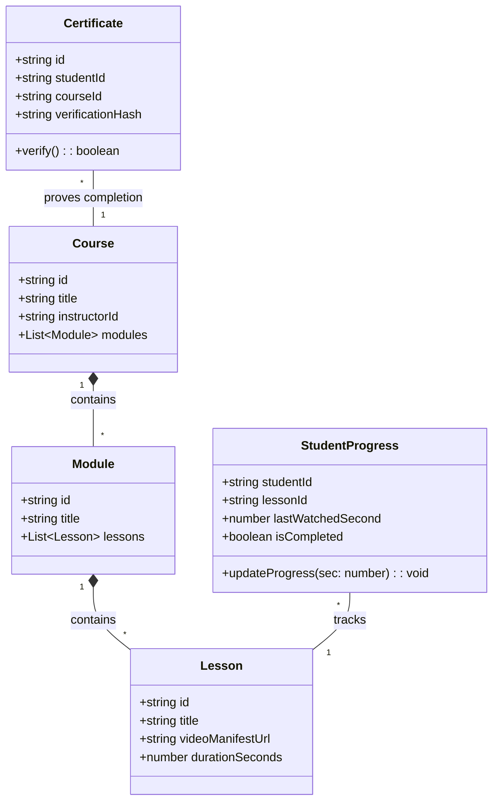
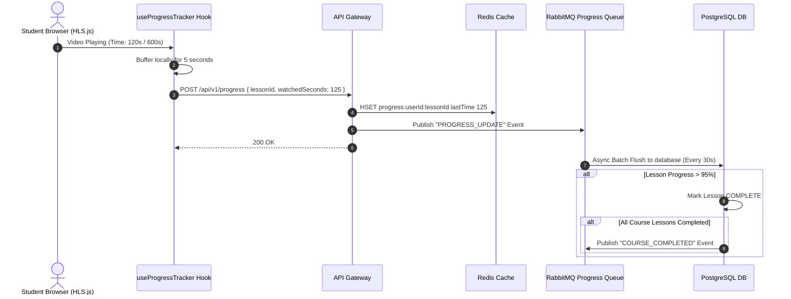
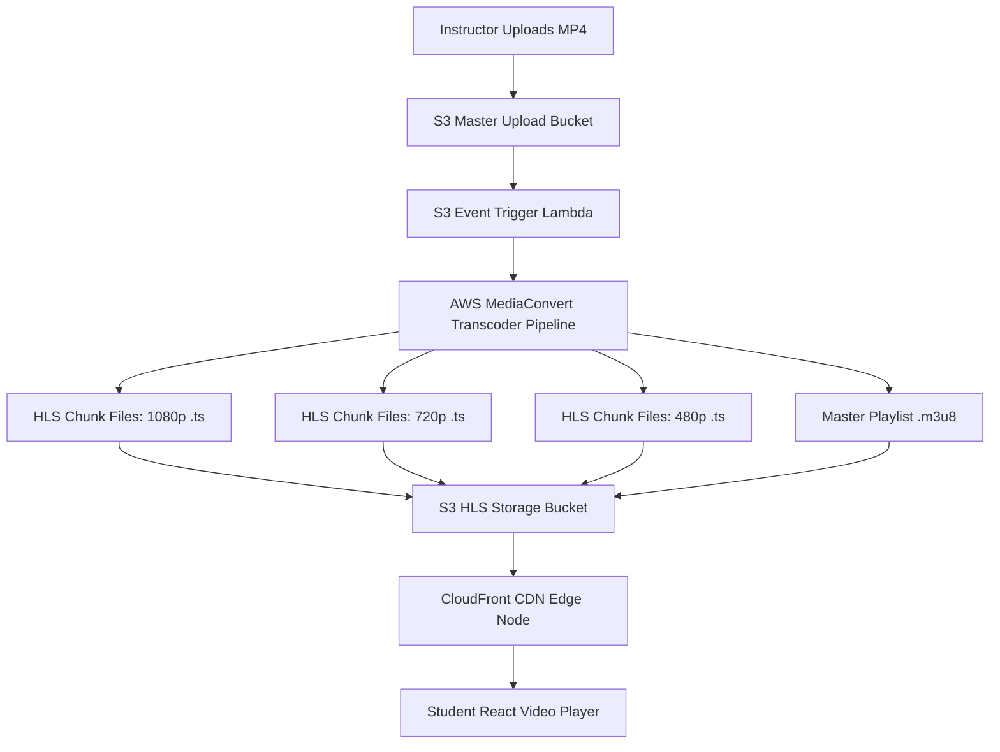
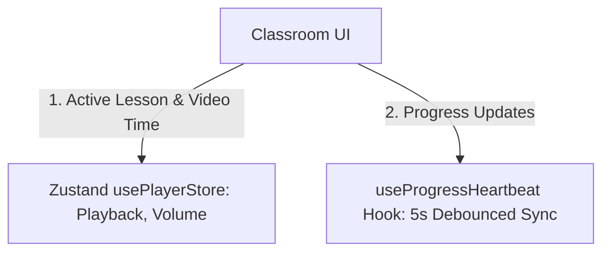

# 🛠️ Enterprise System Design Blueprint: Learning Platform (Udemy / Coursera)

> **Target Role:** Principal / Staff Architect / Senior LLD & HLD Engineers  
> **Product Perspective:** Building a scalable video learning platform with adaptive bitrate HLS streaming, progress heartbeats, quiz evaluation, and verifiable certificate minting.  
> **Navigation:** ⬅️ [Back to Problem Bank Index](./README.md) | 📅 [8-Week Roadmap](../ROADMAP.md)

---

## 1. 🎯 Requirements & Product Scope

### 📋 Functional Requirements (FR)
1. **Course Creation:** Instructors create courses, upload video lectures, and add quizzes.
2. **Adaptive Video Streaming:** Students stream videos with adaptive bitrates (1080p, 720p, 480p) via HLS/DASH based on network conditions.
3. **Progress Tracking:** Automatic tracking of student video playback position and lesson completion.
4. **Quizzes & Evaluation:** Interactive multiple-choice quizzes with instant grading.
5. **Certificate Minting:** Mints verifiable PDF completion certificates when progress hits $100\%$.

### ⚡ Non-Functional Requirements (NFR)
1. **Low Video Startup Time:** Video playback startup latency $P_{99} < 1\text{ second}$.
2. **High Availability:** Video streaming served from CDN edge nodes with $99.99\%$ uptime.
3. **Progress Reliability:** Heartbeat updates survive browser crashes without progress data loss.

---

## 2. 🧮 Scale & Quantitative Estimates

```
Students: 20 Million Registered Users, 2 Million DAU
Videos Watched / Day: 10 Million video views / day
Average Video Length: 10 minutes (Average Bitrate: 2.5 Mbps 720p)

Bandwidth & Storage Calculations:
- Daily Bandwidth: 10M views * 10 mins * 60s * 2.5 Mbps = 150 Terabits / day
- Peak Streaming Output: ~3.5 Gbps streaming output
- HLS Video Storage: 5M videos * 5GB (transcoded formats) = 25 Petabytes S3 Storage
```

---

## 3. 🛠️ Tech Stack & Architectural Justifications

| Component | Technology Choice | Architectural Rationale |
|:---|:---|:---|
| **Video Player UI** | React + HLS.js | Native HLS HTML5 video player with automatic adaptive bitrate switching. |
| **Media CDN** | AWS CloudFront / Fastly | Delivers `.m3u8` playlists and `.ts` video chunks from nearest edge pop. |
| **Transcoding Pipeline** | AWS MediaConvert / FFmpeg | Asynchronously transcodes uploaded MP4 masters into HLS/DASH chunk formats. |
| **Primary Database** | PostgreSQL | Relational integrity for Courses, Enrolments, Payments, and Quizzes. |
| **Progress Cache** | Redis Cluster | High-frequency video playback heartbeat updates (sent every 5 seconds). |
| **Object Storage** | AWS S3 | Stores master videos, HLS chunks, and generated PDF certificates. |

---

## 4. 📐 Visual UML Diagrams

### 🏗️ Class Diagram (Course & Progress Domain Entities)



### 🔄 Sequence Diagram: Video Heartbeat Progress Tracking



### 🧩 Component & System Architecture Diagram (HLD)



---

## 5. 🧱 OOP & SOLID Principles Mapping

- **Single Responsibility Principle (SRP):** `VideoTranscoderService` handles video chunking; `ProgressTrackerService` handles user watch position.
- **Open/Closed Principle (OCP):** Video player supports plugins via `PlayerPluginStrategy` (CaptionsPlugin, QualitySelectorPlugin, SpeedPlugin).
- **Dependency Inversion Principle (DIP):** `CertificateGenerator` depends on a `PDFRenderer` interface rather than hardcoding `PDFKit`.

---

## 6. 🎨 Design Patterns Applied

1. **Adapter Pattern:** `VideoPlayerAdapter` wraps HLS.js and native HTML5 video APIs into a unified interface.
2. **Strategy Pattern:** Adaptive Bitrate Selection Strategy (High-Bandwidth $\to$ 1080p, Low-Bandwidth $\to$ 480p).
3. **Observer Pattern:** Video playback timeupdate events trigger progress heartbeats.

---

## 7. 📂 Production Code & Folder Structure

```
apps/learning-web/
├── app/
│   ├── (courses)/
│   │   ├── page.tsx                    // Course Catalog (ISR: 300s)
│   │   └── courses/[id]/learn/page.tsx // Video Player Dashboard
│   ├── middleware.ts
├── src/
│   ├── features/
│   │   ├── player/
│   │   │   ├── components/
│   │   │   │   ├── HlsVideoPlayer.tsx
│   │   │   │   ├── LessonSidebar.tsx
│   │   │   │   └── QuizOverlay.tsx
│   │   │   ├── hooks/
│   │   │   │   ├── useHlsPlayer.ts
│   │   │   │   └── useProgressHeartbeat.ts
│   │   │   └── store/
│   │   │       └── usePlayerStore.ts
```

---

## 8. 🔀 Routing & Next.js App Router Architecture

```typescript
// app/courses/[id]/learn/page.tsx — Protected Course Classroom
import { notFound, redirect } from 'next/navigation';
import { ClassroomView } from '@/features/player/components/ClassroomView';

export default async function ClassroomPage({ params }: { params: { id: string } }) {
  const courseData = await fetch(`https://api.learning.org/courses/${params.id}/classroom`).then(res => res.ok ? res.json() : null);
  if (!courseData) notFound();

  return <ClassroomView course={courseData} />;
}
```

---

## 9. 🧠 State Management Architecture



---

## 10. 🔐 Auth & Security Architecture

* **Signed CloudFront Cookies:** Students must possess valid signed CDN cookies to fetch `.ts` video chunk files from CloudFront.
* **Certificate SHA-256 Verification:** PDF certificates contain a verification QR code pointing to `/verify/certificate/:id`.

---

## 11. 💻 Production TypeScript Implementations

```typescript
// src/features/player/components/HlsVideoPlayer.tsx — HLS.js Video Component
import React, { useEffect, useRef } from 'react';
import Hls from 'hls.js';

interface VideoPlayerProps {
  manifestUrl: string;
  onHeartbeat: (watchedSec: number) => void;
}

export const HlsVideoPlayer: React.FC<VideoPlayerProps> = ({ manifestUrl, onHeartbeat }) => {
  const videoRef = useRef<HTMLVideoElement>(null);

  useEffect(() => {
    let hls: Hls;
    if (videoRef.current) {
      if (Hls.isSupported()) {
        hls = new Hls({ autoStartLoad: true, capLevelToPlayerSize: true });
        hls.loadSource(manifestUrl);
        hls.attachMedia(videoRef.current);
      } else if (videoRef.current.canPlayType('application/vnd.apple.mpegurl')) {
        videoRef.current.src = manifestUrl;
      }
    }
    return () => { if (hls) hls.destroy(); };
  }, [manifestUrl]);

  useEffect(() => {
    const interval = setInterval(() => {
      if (videoRef.current && !videoRef.current.paused) {
        onHeartbeat(Math.floor(videoRef.current.currentTime));
      }
    }, 5000);
    return () => clearInterval(interval);
  }, [onHeartbeat]);

  return <video ref={videoRef} controls style={{ width: '100%', height: 'auto' }} />;
};
```

---

## 12. 📈 Scale, Edge Cases & Bottlenecks Deep Dive

* **High-Frequency Progress Writes:** 2M active users sending heartbeats every 5 seconds = 400,000 QPS progress writes!
  - *Solution:* Store heartbeats in Redis Hash maps (`HSET progress:user:lesson`) and write-behind flush to PostgreSQL in 30-second batches.
* **Video Piracy & Direct Links:**
  - *Solution:* Use Signed CloudFront Cookies with short TTL (e.g. 2 hours) bound to user IP.

---

## ❓ 13. Collapsed Interviewer Grill Q&A

<details>
<summary>❓ How does HLS adaptive bitrate switching work under the hood?</summary>

**Answer:**  
The server generates a master `.m3u8` playlist containing child playlist links for different bitrates (e.g. `1080p.m3u8`, `720p.m3u8`). The HLS client monitors network download speed of recent `.ts` video chunks. If bandwidth drops below threshold, the client seamlessly requests the next `.ts` chunk from the lower-resolution child playlist without stopping playback.
</details>

<details>
<summary>❓ How do you prevent certificate forgery for completed courses?</summary>

**Answer:**  
Each PDF certificate contains a unique cryptographic verification hash (`SHA-256`) and QR code linking to `/verify/certificate/:id`. The hash is stored in the database alongside the issuance timestamp and student ID. Anyone scanning the QR code validates the hash directly against the platform's public verification API.
</details>
