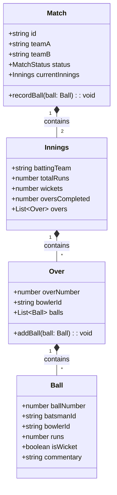
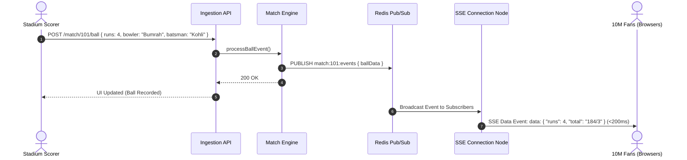
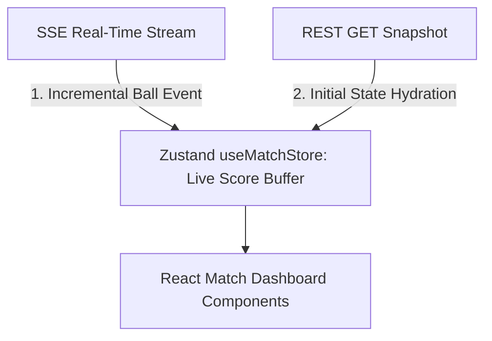

# 🛠️ Enterprise System Design Blueprint: Cricinfo (Live Sports Score Platform)

> **Target Role:** Principal / Staff Architect / Senior LLD & HLD Engineers  
> **Product Perspective:** Building a sub-second real-time sports score broadcast platform serving 10M concurrent fans via Server-Sent Events (SSE) and Redis Pub/Sub.  
> **Navigation:** ⬅️ [Back to Problem Bank Index](./README.md) | 📅 [8-Week Roadmap](../ROADMAP.md)

---

## 1. 🎯 Requirements & Product Scope

### 📋 Functional Requirements (FR)
1. **Live Scorecard:** Real-time ball-by-ball score updates, overs, run rates, wickets, and active batsmen/bowlers.
2. **Text Commentary:** Live text commentary stream for every ball delivered.
3. **Scorer Admin Console:** Stadium scorer inputs ball outcomes (Runs, Wicket, No-Ball, Wide, Boundary).
4. **Match Analytics:** Real-time updating Manhattan charts, Worm graphs, and player statistics.

### ⚡ Non-Functional Requirements (NFR)
1. **Sub-Second Latency:** Broadcast ball updates to 10M concurrent fans worldwide in $P_{99} < 500\text{ms}$.
2. **Thundering Herd Resilience:** Reconnecting 1M clients during server restart must not crash gateways.
3. **High Concurrency:** Handle 10M active SSE connection streams simultaneously.

---

## 2. 🧮 Scale & Quantitative Estimates

```
Users: 10 Million Peak Concurrent Connections (during IPL / World Cup Final)
Update Frequency: ~1 ball update every 30 seconds per match
Peak Concurrent Matches: 50 matches worldwide

Message Fan-Out Volume:
- 1 Ball Update -> Broadcast to 10M connected WebSockets / SSE streams
- 10M messages / update * 1 update/30s = ~333,000 messages / sec fanout throughput!

Bandwidth Estimates:
- Score Payload Size: ~500 bytes JSON payload
- Bandwidth Output: 333,000 msg/sec * 500 bytes = ~166 MB/sec (1.33 Gbps output)
```

---

## 3. 🛠️ Tech Stack & Architectural Justifications

| Component | Technology Choice | Architectural Rationale |
|:---|:---|:---|
| **Client Real-Time Protocol** | Server-Sent Events (SSE) | **SSE** is chosen over WebSockets because score updates are **unidirectional (Server $\to$ Client)**. SSE operates over HTTP/2, supports auto-reconnection out of the box, and uses significantly less memory than WebSockets. |
| **Edge Connection Gateway** | Go / Node.js Gateway Cluster | Highly concurrent stateless gateways maintaining 100k open TCP connections per server node. |
| **Pub/Sub Broker** | Redis Pub/Sub + Apache Kafka | Redis Pub/Sub distributes incoming ball events to gateway nodes in $<5\text{ms}$. Kafka persists immutable match events for analytics. |
| **Primary Data Store** | PostgreSQL | Relational DB storing team rosters, tournament schedules, and historical stats. |
| **Live Match RAM DB** | Redis Hash | Stores current match state (`match:101:state`) in RAM for sub-millisecond read access. |

---

## 4. 📐 Visual UML Diagrams

### 🏗️ Class Diagram (Cricket Match Domain Entities)



### 🔄 Sequence Diagram: Ball Update Ingestion & Sub-Second Broadcast Flow



### 🧩 Component & System Architecture Diagram (HLD)

```mermaid
flowchart TD
    StadiumScorer[Stadium Scorer Admin Console] -->|POST /api/v1/ball| Gateway[Admin Ingestion Gateway]
    Gateway --> MatchService[Match Engine Service]
    
    MatchService -->|1. Write Ball Event| DB[(PostgreSQL Master DB)]
    MatchService -->|2. Update Match State| RedisRAM[(Redis Match State Hash)]
    MatchService -->|3. Publish Event| RedisPubSub{{Redis Pub/Sub Channel: match_101}}

    RedisPubSub --> Node1[SSE Gateway Node 1 (100k Conns)]
    RedisPubSub --> Node2[SSE Gateway Node 2 (100k Conns)]
    RedisPubSub --> NodeN[SSE Gateway Node N (100k Conns)]

    Node1 -->|SSE Stream| Fan1[100,000 User Browsers]
    Node2 -->|SSE Stream| Fan2[100,000 User Browsers]
    NodeN -->|SSE Stream| FanN[100,000 User Browsers]
```

---

## 5. 🧱 OOP & SOLID Principles Mapping

- **Single Responsibility Principle (SRP):** `BallIngestionService` handles scoring; `SSEGatewayManager` handles fan-out connections; `MatchAnalyticsEngine` computes worm graphs.
- **Open/Closed Principle (OCP):** Event broadcasting supports new consumer outputs (`SSEBroadcast`, `WebSocketBroadcast`, `PushNotificationBroadcast`) via an `EventPublisher` interface.
- **Dependency Inversion Principle (DIP):** `SSEGateway` depends on `MessageBroker` interface rather than hardcoding Redis.

---

## 6. 🎨 Design Patterns Applied

1. **Observer Pattern:** Redis Pub/Sub notifies SSE Gateway connection nodes whenever a new ball event occurs.
2. **State Pattern:** `MatchState` manages transitions (`NOT_STARTED` $\to$ `LIVE` $\to$ `INNINGS_BREAK` $\to$ `COMPLETED`).
3. **Command Pattern:** Each ball event is encapsulated as an immutable `BallCommand` object supporting audit logs and rollback.

---

## 7. 📂 Production Code & Folder Structure

```
apps/cricinfo-web/
├── app/
│   ├── matches/
│   │   ├── page.tsx                    // Live Matches List (ISR: 30s)
│   │   └── [id]/page.tsx               // Live Match Dashboard (SSE Client Stream)
│   ├── middleware.ts
├── src/
│   ├── features/
│   │   ├── match-center/
│   │   │   ├── components/
│   │   │   │   ├── ScoreHeader.tsx
│   │   │   │   ├── BallByBallList.tsx
│   │   │   │   └── MatchWormChart.tsx
│   │   │   ├── hooks/
│   │   │   │   ├── useLiveScoreStream.ts // SSE Reconnecting Manager
│   │   │   │   └── useMatchSnapshot.ts
│   │   │   └── store/
│   │   │       └── useMatchStore.ts      // Local Live Score State Buffer
```

---

## 8. 🔀 Routing & Next.js App Router Architecture

```typescript
// app/matches/[id]/page.tsx — Live Match Dashboard Page
import { Suspense } from 'react';
import { MatchDashboardView } from '@/features/match-center/components/MatchDashboardView';

export default function MatchPage({ params }: { params: { id: string } }) {
  return (
    <Suspense fallback={<div>Connecting to Live Match Stream...</div>}>
      <MatchDashboardView matchId={params.id} />
    </Suspense>
  );
}
```

---

## 9. 🧠 State Management Architecture



---

## 10. 🔐 Auth & Security Architecture

* **Admin Scorer Authentication:** OAuth2 PKCE + MFA + IP Whitelisting for stadium score input.
* **Public Stream Rate Limiting:** Gateway rate limiting on SSE connections ($10\text{ conns/IP}$).
* **XSS Sanitization:** Commentary HTML sanitized via `DOMPurify`.

---

## 11. 💻 Production TypeScript Implementations

```typescript
// src/features/match-center/hooks/useLiveScoreStream.ts — Jittered SSE Connection Manager
import { useEffect, useRef } from 'react';
import { useMatchStore } from '../store/useMatchStore';

export function useLiveScoreStream(matchId: string) {
  const applyBallUpdate = useMatchStore((s) => s.applyBallUpdate);
  const retryCount = useRef(0);

  useEffect(() => {
    let eventSource: EventSource | null = null;

    const connect = () => {
      eventSource = new EventSource(`/api/v1/matches/${matchId}/stream`);

      eventSource.onmessage = (event) => {
        retryCount.current = 0; // Reset backoff on success
        const data = JSON.parse(event.data);
        applyBallUpdate(data);
      };

      eventSource.onerror = () => {
        eventSource?.close();
        // Exponential Backoff with Full Random Jitter (Prevents Thundering Herd)
        const baseDelay = Math.min(30000, 1000 * Math.pow(2, retryCount.current));
        const jitteredDelay = Math.floor(Math.random() * baseDelay);
        retryCount.current++;
        setTimeout(connect, jitteredDelay);
      };
    };

    connect();
    return () => { eventSource?.close(); };
  }, [matchId, applyBallUpdate]);
}
```

---

## 12. 📈 Scale, Edge Cases & Bottlenecks Deep Dive

* **Thundering Herd Reconnect Failure:** When an SSE Gateway node handling 100,000 connections crashes, all 100k clients attempt to reconnect simultaneously to remaining nodes.
  - *Solution:* Implement **Exponential Backoff with Full Random Jitter** on the client connection manager + HTTP 429 Retry-After headers on the Load Balancer.
* **Unidirectional vs Bidirectional:** WebSockets vs SSE.
  - *Solution:* Choose **SSE (Server-Sent Events)** for scores. SSE runs over HTTP/2, uses a single TCP connection per domain, handles reconnects automatically, and bypasses corporate firewall WebSocket blocks.

---

## ❓ 13. Collapsed Interviewer Grill Q&A

<details>
<summary>❓ Why choose Server-Sent Events (SSE) over WebSockets for Cricinfo live scores?</summary>

**Answer:**  
WebSockets provide full-duplex (two-way) communication, which is necessary for chat applications. Live sports scores are **unidirectional (server to client only)**. SSE operates over standard HTTP/2, supports automatic reconnection out of the box, is lighter on server memory, and traverses HTTP proxies/firewalls without WebSocket upgrade issues.
</details>

<details>
<summary>❓ What happens if a user opens Cricinfo midway through an over? How do they get initial state?</summary>

**Answer:**  
Upon establishing the SSE connection, the client first executes a fast REST GET request `/api/v1/matches/:id/snapshot` to fetch the full match state snapshot from Redis RAM. Once the snapshot renders on screen, the SSE stream takes over to append incremental ball-by-ball updates.
</details>
