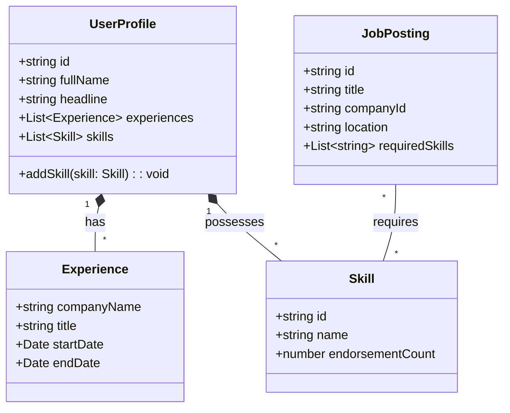
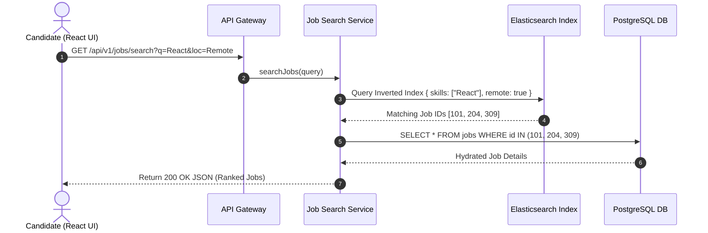
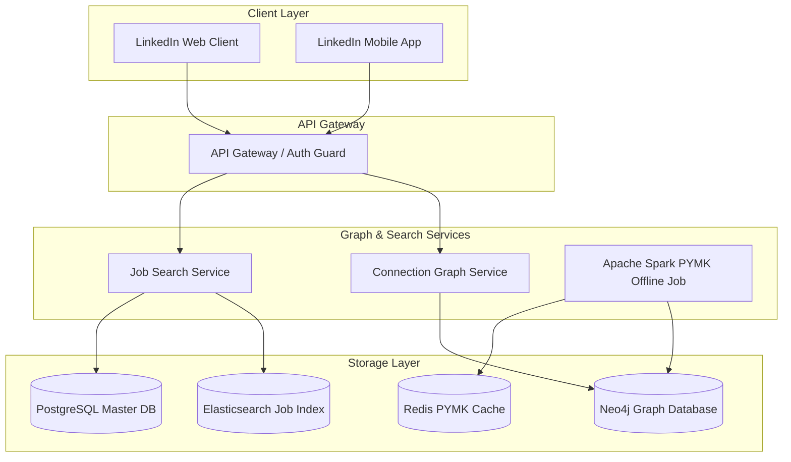
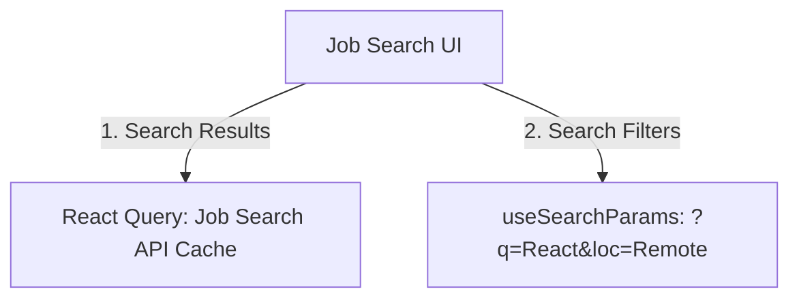

# 🛠️ Enterprise System Design Blueprint: LinkedIn (Professional Network & Job Board)

> **Target Role:** Principal / Staff Architect / Senior LLD & HLD Engineers  
> **Product Perspective:** Building a scalable professional network serving 900M users with multi-hop graph traversals, real-time job inverted index search, and personalized recommendations.  
> **Navigation:** ⬅️ [Back to Problem Bank Index](./README.md) | 📅 [8-Week Roadmap](../ROADMAP.md)

---

## 1. 🎯 Requirements & Product Scope

### 📋 Functional Requirements (FR)
1. **User Profile & Resume:** Users build professional profiles, work history, skills, and education records.
2. **Connections Graph:** Establish 1st-degree connections and view 2nd/3rd-degree connection degree paths.
3. **Professional Feed:** Post industry updates, articles, images; view news feed from network and followed companies.
4. **Job Search & Recommendations:** Recruiters post jobs; candidates search jobs by skills/location and receive AI recommendations.

### ⚡ Non-Functional Requirements (NFR)
1. **Low Graph Traversal Latency:** 2nd-degree connection lookup ("People You May Know") $P_{99} < 150\text{ms}$.
2. **Search Indexing Speed:** Job and member profile updates index into search within $<5$ seconds.
3. **Privacy Integrity:** Connection graph visibility rules strictly enforce member profile privacy settings.

---

## 2. 🧮 Scale & Quantitative Estimates

```
Registered Users: 900 Million Users, 300 Million MAU
Connections per User: Avg 500 connections (Graph Nodes: 900M, Edges: 450 Billion edges!)
Job Postings: 50 Million Active Jobs
Search Queries: 500 Million Search QPS/day

Graph Storage Scale:
- 450 Billion Edges * 16 bytes (srcId, dstId) = ~7.2 TB Graph Database RAM Index.
```

---

## 3. 🛠️ Tech Stack & Architectural Justifications

| Component | Technology Choice | Architectural Rationale |
|:---|:---|:---|
| **Graph Database** | Neo4j / LinkedIn Distributed Sensei Graph | Specialized graph engine optimized for multi-hop BFS traversals (1st, 2nd, 3rd degree connections). |
| **Search Engine** | Elasticsearch / Apache Lucene | Inverted index search engine powering Job Search and Member Directory filters. |
| **Primary Data Store** | PostgreSQL / Espresso DB | Partitioned relational storage for user profiles, employment history, and job listings. |
| **Recommendation Engine** | Apache Spark / Python ML Pipeline | Asynchronous batch job computing "People You May Know" and Job Recommendation scoring. |

---

## 4. 📐 Visual UML Diagrams

### 🏗️ Class Diagram (User Profile & Job Board Domain Entities)



### 🔄 Sequence Diagram: Job Search Inverted Index Query & Hydration Flow



### 🧩 Component & Graph Architecture Diagram (HLD)



---

## 5. 🧱 OOP & SOLID Principles Mapping

- **Single Responsibility Principle (SRP):** `GraphService` manages network connections; `JobPostingService` manages job listings; `SearchService` manages Elasticsearch queries.
- **Open/Closed Principle (OCP):** PYMK recommendation scoring uses a `RecommendationScoringStrategy` interface.
- **Dependency Inversion Principle (DIP):** `JobSearchService` depends on a `SearchEngine` interface abstraction rather than hardcoding Elasticsearch.

---

## 6. 🎨 Design Patterns Applied

1. **Strategy Pattern:** `RecommendationScoringStrategy` dynamically scores mutual connections, shared companies, and common schools.
2. **Decorator Pattern:** `AuthenticatedProfileDecorator` wraps user profile data with privacy visibility filters based on viewer connection degree.
3. **Repository Pattern:** Isolates graph queries and relational job queries from API services.

---

## 7. 📂 Production Code & Folder Structure

```
apps/linkedin-web/
├── app/
│   ├── (feed)/
│   │   └── page.tsx
│   ├── (jobs)/
│   │   ├── page.tsx                    // Job Search & Recommendations
│   │   └── jobs/[id]/page.tsx          // Job Detail & Easy Apply
│   ├── (network)/
│   │   └── mynetwork/page.tsx          // Connection Requests & PYMK
│   ├── middleware.ts
├── src/
│   ├── features/
│   │   ├── jobs/
│   │   │   ├── components/JobSearchCard.tsx
│   │   │   └── hooks/useJobSearch.ts
│   │   └── network/
│   │       ├── components/PymkCard.tsx
│   │       └── hooks/useMutualConnections.ts
```

---

## 8. 🔀 Routing & Next.js App Router Architecture

```typescript
// app/jobs/page.tsx — Dynamic Job Search Page
import { Suspense } from 'react';
import { JobSearchResults } from '@/features/jobs/components/JobSearchResults';

export default function JobsPage({ searchParams }: { searchParams: { q?: string; loc?: string } }) {
  return (
    <Suspense fallback={<div>Searching Jobs...</div>}>
      <JobSearchResults query={searchParams.q || ''} location={searchParams.loc || ''} />
    </Suspense>
  );
}
```

---

## 9. 🧠 State Management Architecture



---

## 10. 🔐 Auth & Security Architecture

* **Profile Visibility Middleware:** Checks viewer relationship degree (1st, 2nd, 3rd) before rendering contact details (Email, Phone).
* **Recruiter Access Control:** Role-Based Access Control (RBAC) enforcing Recruiter Seat permissions.

---

## 11. 💻 Production TypeScript Implementations

```typescript
// Connection Graph Service (Cypher Query Execution)
export class ConnectionGraphService {
  constructor(private graphDb: any) {}

  async getMutualConnections(userAId: string, userBId: string): Promise<string[]> {
    const query = `
      MATCH (a:User {id: $userAId})-[:CONNECTED_TO]-(mutual:User)-[:CONNECTED_TO]-(b:User {id: $userBId})
      RETURN mutual.id AS mutualId, mutual.name AS name
      LIMIT 20
    `;

    const result = await this.graphDb.run(query, { userAId, userBId });
    return result.records.map((record: any) => record.get('mutualId'));
  }
}
```

---

## 12. 📈 Scale, Edge Cases & Bottlenecks Deep Dive

* **Combinatorial Graph Explosion:** Traversing 3rd-degree connections for a user with 5,000 connections requires inspecting $5,000^3 = 125\text{ Billion nodes}$!
  - *Solution:* Limit graph traversal depth to 2 hops max during live web requests. Pre-compute 3rd-degree connections asynchronously via offline Spark jobs.

---

## ❓ 13. Collapsed Interviewer Grill Q&A

<details>
<summary>❓ How do you design "People You May Know" (PYMK) recommendation algorithms at scale?</summary>

**Answer:**  
PYMK uses a **Mutual Connection Triangle Closing algorithm**. If User A is connected to B and C, and B is connected to C, the system calculates a similarity score based on Jaccard Index of mutual friends $\frac{|A \cap B|}{|A \cup B|}$, shared company history, and school background. Heavy scoring is computed offline in nightly Spark jobs and cached in Redis.
</details>
