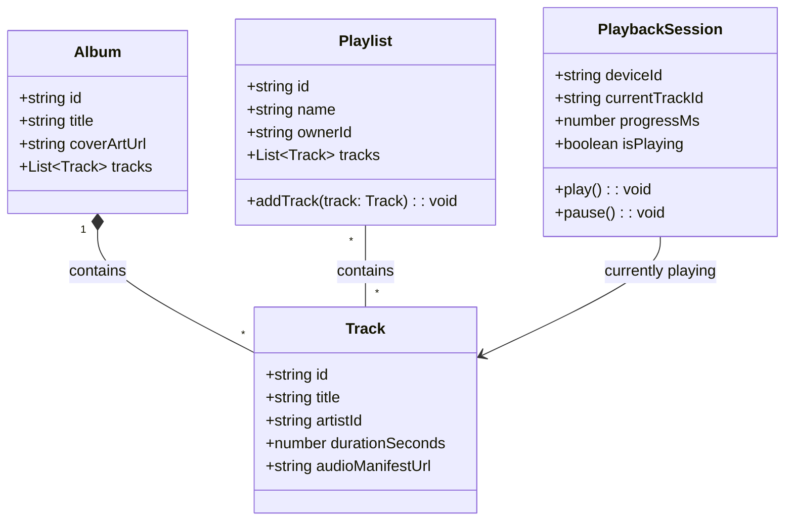
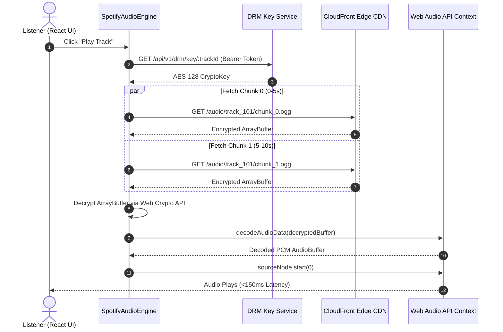
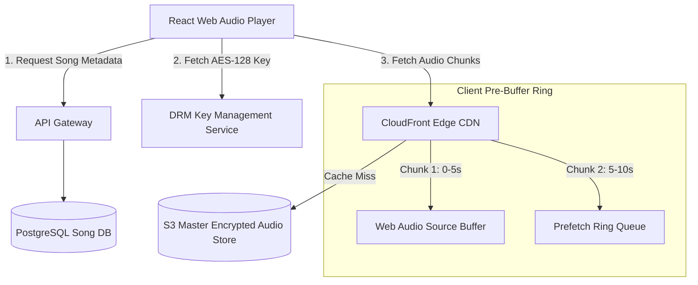
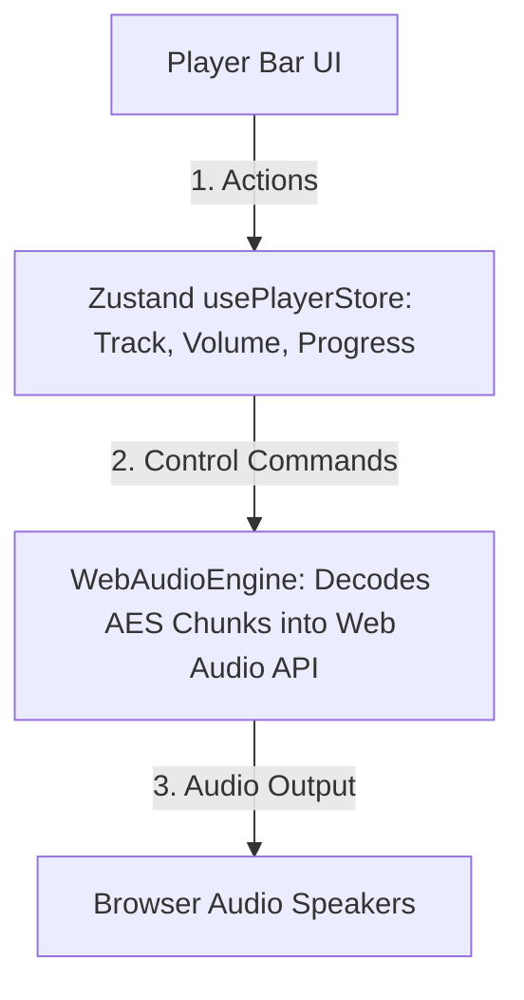

# 🛠️ Enterprise System Design Blueprint: Spotify (Audio Streaming Platform)

> **Target Role:** Principal / Staff Architect / Senior LLD & HLD Engineers  
> **Product Perspective:** Building a high-concurrency audio streaming platform serving 500M users with sub-200ms playback startup, Web Audio API pre-buffering, DRM encryption, and Spotify Connect sync.  
> **Navigation:** ⬅️ [Back to Problem Bank Index](./README.md) | 📅 [8-Week Roadmap](../ROADMAP.md)

---

## 1. 🎯 Requirements & Product Scope

### 📋 Functional Requirements (FR)
1. **Audio Streaming:** Stream high-quality audio tracks without playback stuttering.
2. **Playlist Management:** Create, edit, and collaborate on shared playlists in real-time.
3. **Offline Playback:** Premium users store encrypted audio tracks locally in PWA / Mobile storage.
4. **Spotify Connect Sync:** Synchronize playback controls (Play, Pause, Skip) across devices (Mobile, Desktop, Smart TV).

### ⚡ Non-Functional Requirements (NFR)
1. **Ultra-Low Playback Latency:** Playback starts within $P_{99} < 200\text{ms}$ of hitting play.
2. **Zero Audio Stutter:** Audio chunk pre-buffering prevents buffering stalls even on flaky 3G connections.
3. **DRM Encryption:** Audio chunks are encrypted (AES-128 / Ogg Vorbis) to prevent unauthorized extraction.

---

## 2. 🧮 Scale & Quantitative Estimates

```
Active Users: 500 Million Users, 100 Million Active Streamers / Day
Song Catalog: 100 Million Songs
Average Song Length: 3.5 minutes (Format: Ogg Vorbis 320 kbps High Quality)
File Size per Song: 3.5 mins * 60s * 320 kbps / 8 = ~8.4 MB per song

Storage Estimates:
- 100 Million Songs * 8.4 MB = 840 Terabytes Master Audio Storage

Daily Audio Streaming Bandwidth Output:
- 100M streamers * 20 songs/day = 2 Billion Songs Played / Day
- 2B songs * 8.4 MB = 16.8 Petabytes / day throughput (Peak ~1.5 Tbps via CDN Edge)
```

---

## 3. 🛠️ Tech Stack & Architectural Justifications

| Component | Technology Choice | Architectural Rationale |
|:---|:---|:---|
| **Audio Engine UI** | Web Audio API + React | Native Web Audio API for custom PCM buffer management, cross-fading, and equalizer audio nodes. |
| **Offline Storage** | IndexedDB + Service Worker | Stores encrypted audio chunk blobs locally for offline PWA playback. |
| **Media CDN** | Cloudflare / AWS CloudFront Edge | Caches 5-second encrypted audio chunks (`.ogg` / `.aac`) near users for $<50\text{ms}$ fetch time. |
| **Primary Data Store** | PostgreSQL / Cassandra | Relational DB for user subscriptions and metadata; Cassandra for high-volume user play histories. |
| **Real-time Device Sync** | WebSockets + Redis Pub/Sub | Powers Spotify Connect device state synchronization across phone, desktop, and smart TVs. |

---

## 4. 📐 Visual UML Diagrams

### 🏗️ Class Diagram (Track & Playback Domain Entities)



### 🔄 Sequence Diagram: Web Audio API Chunk Pre-Buffering & Decryption Flow



### 🧩 Component & System Architecture Diagram (HLD)



---

## 5. 🧱 OOP & SOLID Principles Mapping

- **Single Responsibility Principle (SRP):** `WebAudioEngine` handles PCM playback; `OfflineStore` handles IndexedDB caching; `SpotifyConnectService` handles WebSocket device sync.
- **Open/Closed Principle (OCP):** Audio decoders implement an `AudioDecoderStrategy` (OggDecoder, AACDecoder, FLACDecoder).
- **Dependency Inversion Principle (DIP):** `SpotifyAudioEngine` depends on `AudioStorage` interface abstraction rather than hardcoding IndexedDB.

---

## 6. 🎨 Design Patterns Applied

1. **Facade Pattern:** `SpotifyAudioEngine` hides Web Audio API nodes (`AudioContext`, `GainNode`, `BiquadFilterNode`) behind simple `play()`, `pause()`, `seek()` methods.
2. **Strategy Pattern:** Audio Decoders (`OggDecoder`, `AACDecoder`).
3. **Observer Pattern:** Playback position update events notify Player UI and Spotify Connect WebSocket sync.

---

## 7. 📂 Production Code & Folder Structure

```
apps/spotify-web/
├── app/
│   ├── (player)/
│   │   ├── page.tsx                    // Home Dashboard
│   │   └── playlist/[id]/page.tsx      // Playlist View
│   ├── middleware.ts
├── src/
│   ├── features/
│   │   ├── audio-player/
│   │   │   ├── components/
│   │   │   │   ├── PlayerBar.tsx
│   │   │   │   └── EqualizerVisualizer.tsx
│   │   │   ├── engine/
│   │   │   │   ├── WebAudioEngine.ts    // Web Audio API Ring Buffer
│   │   │   │   └── IndexedDbOfflineStore.ts
│   │   │   ├── hooks/
│   │   │   │   ├── useAudioPlayer.ts
│   │   │   │   └── useOfflineTrack.ts
│   │   │   └── store/
│   │   │       └── usePlayerStore.ts    // Playback state (Playing, Paused, Track)
```

---

## 8. 🔀 Routing & Next.js App Router Architecture

```typescript
// app/playlist/[id]/page.tsx — Dynamic Playlist View
import { Suspense } from 'react';
import { PlaylistView } from '@/features/audio-player/components/PlaylistView';

export default function PlaylistPage({ params }: { params: { id: string } }) {
  return (
    <Suspense fallback={<div>Loading Playlist...</div>}>
      <PlaylistView playlistId={params.id} />
    </Suspense>
  );
}
```

---

## 9. 🧠 State Management & Audio Buffer Architecture



---

## 10. 🔐 Auth & Security Architecture

* **AES-128 Audio Encryption:** Audio files stored on CDN in encrypted 5-second chunks. Decryption keys fetched over TLS with expiring bearer tokens.
* **Offline Key Expiration:** Downloaded IndexedDB track blobs require key re-validation every 30 days.

---

## 11. 💻 Production TypeScript Implementations

```typescript
// src/features/audio-player/engine/WebAudioEngine.ts
export class WebAudioEngine {
  private audioCtx: AudioContext;
  private bufferQueue: AudioBuffer[] = [];
  private currentSource: AudioBufferSourceNode | null = null;

  constructor() {
    this.audioCtx = new (window.AudioContext || (window as any).webkitAudioContext)();
  }

  async loadAndPreBufferTrack(chunkUrls: string[], aesKey: CryptoKey) {
    for (const url of chunkUrls) {
      const res = await fetch(url);
      const encryptedBuffer = await res.arrayBuffer();
      const decryptedBuffer = await this.decryptBuffer(encryptedBuffer, aesKey);
      const audioBuffer = await this.audioCtx.decodeAudioData(decryptedBuffer);
      this.bufferQueue.push(audioBuffer);
    }
  }

  private async decryptBuffer(buffer: ArrayBuffer, key: CryptoKey): Promise<ArrayBuffer> {
    return window.crypto.subtle.decrypt({ name: 'AES-GCM', iv: new Uint8Array(12) }, key, buffer);
  }

  play() {
    if (this.bufferQueue.length === 0) return;
    this.currentSource = this.audioCtx.createBufferSource();
    this.currentSource.buffer = this.bufferQueue.shift()!;
    this.currentSource.connect(this.audioCtx.destination);
    this.currentSource.start(0);
  }
}
```

---

## 12. 📈 Scale, Edge Cases & Bottlenecks Deep Dive

* **Playback Stutter on Network Drops:** Switching tracks or losing connection pauses playback.
  - *Solution:* Implement a 30-second **Ring Pre-Buffer Queue** in Web Audio API memory.
* **Offline Asset Piracy:** Premium users downloading songs to local IndexedDB storage.
  - *Solution:* Store audio as AES-128 encrypted blobs. Decryption keys expire after 30 days and require online re-validation.

---

## ❓ 13. Collapsed Interviewer Grill Q&A

<details>
<summary>❓ How does Spotify Connect synchronize playback state between a mobile app and desktop app in real time?</summary>

**Answer:**  
Both devices maintain an active WebSocket connection to a central **Playback Coordinator Gateway**. When the user presses "Pause" on mobile, a message is emitted to the WebSocket gateway, which publishes a `PLAYBACK_STATE_CHANGED` event to Redis Pub/Sub. Redis broadcasts the state update to the desktop device's WebSocket within $<100\text{ms}$.
</details>
