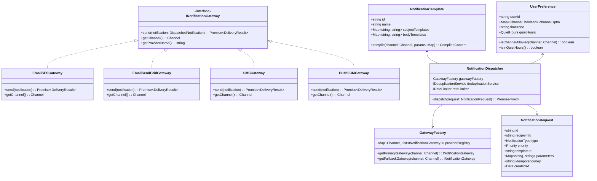
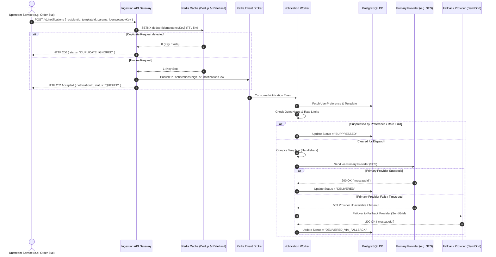
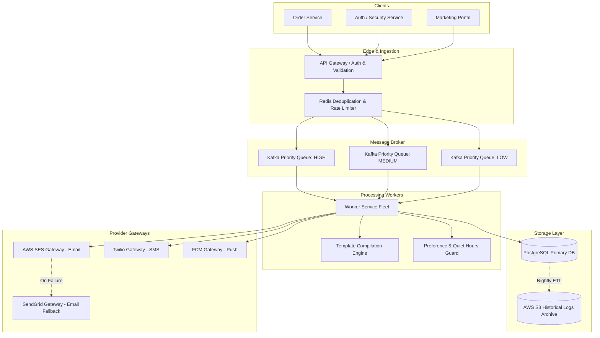

# 🛠️ Enterprise System Design Blueprint: Notification System

> **Target Role:** Principal / Staff Architect / Senior LLD & HLD Engineers  
> **Product Perspective:** Building a multi-channel notification engine serving 100M daily notifications across Email, SMS, Mobile Push, and In-App channels with rate-limiting, deduplication, and high-availability provider fallback.  
> **Navigation:** ⬅️ [Back to Category Index](./README.md) | 📅 [8-Week Roadmap](../../ROADMAP.md)

---

## 1. 🎯 Requirements & Product Scope

### 📋 Functional Requirements (FR)

1. **Multi-Channel Dispatch:** Send notifications through Email (SES/SendGrid), SMS (Twilio/Plivo), Mobile Push (FCM/APNS), and In-App WebSockets.
2. **Template Management:** Support parameterized dynamic templates with variable interpolation (`{{user_name}}`, `{{order_id}}`) and multi-language localization.
3. **User Preferences & Quiet Hours:** Honor user notification preferences per channel and suppress non-critical notifications during local quiet hours (e.g., 10 PM – 7 AM).
4. **Priority Queuing & Rate Limiting:** Categorize notifications into HIGH (OTP/Security), MEDIUM (Transactional/Order), and LOW (Marketing) priorities. Rate-limit marketing pushes per user (e.g., max 3/day).
5. **Deduplication & Retry with Fallback:** Prevent duplicate dispatches within a configurable time window ($5\text{ mins}$) using idempotency keys. Automatically failover to a secondary provider if the primary provider returns errors or times out.
6. **Delivery Status Tracking:** Track notification lifecycle: `PENDING` $\rightarrow$ `QUEUED` $\rightarrow$ `DISPATCHED` $\rightarrow$ `DELIVERED` / `FAILED` / `READ`.

### ⚡ Non-Functional Requirements (NFR)

1. **High Availability & Fault Tolerance:** $99.99\%$ system availability. Single provider outages must not degrade overall delivery.
2. **Latency SLAs:** High-priority (OTP) dispatches must reach the provider within $P_{99} < 500\text{ms}$. Low-priority bulk pushes can be processed within 15 minutes.
3. **Scale Capacity:** Process 100 Million notifications/day ($\sim 1,150\text{ QPS}$ average, $5,000\text{ QPS}$ peak).
4. **At-Least-Once Delivery & Idempotency:** Guaranteed notification delivery with zero unintended duplicate sends to end-users.

---

## 2. 🧮 Scale & Quantitative Estimates

```
Total Daily Notifications: 100 Million / day
Peak Load Multiplier: 4.3x
Channel Split:
  - Mobile Push (FCM/APNS): 60% (60M / day)
  - Email (SES/SendGrid): 25% (25M / day)
  - SMS (Twilio/Plivo): 10% (10M / day)
  - In-App (WebSocket): 5% (5M / day)

Throughput Calculations:
  - Average QPS: 100,000,000 / 86,400s ≈ 1,157 QPS
  - Peak Ingestion QPS: 1,157 * 4.3 ≈ 5,000 QPS

Payload & Storage Sizing:
  - Average Notification Request Size: 1.5 KB (metadata, dynamic variables, recipient IDs)
  - Daily Ingestion Payload: 100M * 1.5 KB = 150 GB / day
  - Log & Delivery Status Record: 500 bytes / row
  - Daily DB Log Storage: 100M * 500 B = 50 GB / day → 18.25 TB / year (retention archived to S3 after 30 days)

Queue Memory & Worker Sizing:
  - Max burst queue retention capacity (1 hour peak backlog): 5,000 QPS * 3,600s = 18,000,000 messages
  - In-flight Queue Memory footprint: 18M * 1.5 KB ≈ 27 GB Redis/Kafka buffer memory
```

---

## 3. 🛠️ Tech Stack & Architectural Justifications

| Component | Technology Choice | Architectural Rationale |
| :--- | :--- | :--- |
| **API Gateway & Ingestion** | Node.js / Express (TypeScript) | Non-blocking I/O ideal for handling high concurrency ingestion API calls ($5,000\text{ QPS}$) with sub-20ms latency. |
| **Rate Limiter & Deduplication** | Redis Cluster | Atomic operations (`EVAL` Lua scripts) for Sliding Window rate limiting and `SETNX` with TTL for idempotency deduplication. |
| **Message Broker & Queues** | Apache Kafka / RabbitMQ | Multi-topic priority queues (`notifications.high`, `notifications.medium`, `notifications.low`) providing decoupled ingestion, backpressure management, and replayability. |
| **Primary Database** | PostgreSQL (Partitioned by Month) | ACID compliance for template management, user notification settings, and delivery status logs. |
| **Template Engine** | Handlebars.js / Liquid | Lightweight string interpolation and layout compilation with caching compiled templates in memory. |
| **3rd-Party Provider Gateways** | Twilio, AWS SES, FCM, APNS | Multi-vendor integration using Strategy Pattern adapters with automated Circuit Breaker failover. |

---

## 4. 📐 Visual UML Diagrams

### 🏗️ Class Diagram (Domain Entities & Strategy Abstractions)



### 🔄 Sequence Diagram: End-to-End Delivery & Fallback Flow



### 🧩 Component & System Architecture Diagram (HLD)



---

## 5. 🧱 OOP & SOLID Principles Mapping

- **Single Responsibility Principle (SRP):**
  - `TemplateCompiler`: Only compiles template syntax and interpolates variables.
  - `UserPreferenceGuard`: Only evaluates opt-in state, rate limits, and quiet hours.
  - `GatewayFactory`: Only instantiates and resolves channel provider strategies.
- **Open/Closed Principle (OCP):**
  - New channels (e.g., WhatsApp, Telegram) are added by creating classes implementing `INotificationGateway` without altering `NotificationDispatcher` core code.
- **Liskov Substitution Principle (LSP):**
  - `EmailSESGateway` and `EmailSendGridGateway` are interchangeable implementations of `INotificationGateway`. High-level dispatchers invoke `gateway.send()` seamlessly.
- **Interface Segregation Principle (ISP):**
  - Client components depend on thin, purposeful interfaces (`ITemplateEngine`, `IRateLimiter`, `IDeduplicator`) rather than monolithic service classes.
- **Dependency Inversion Principle (DIP):**
  - Core processing workflows depend on abstract interfaces (`INotificationGateway`, `ICacheStore`, `IMessagePublisher`) rather than concrete Redis or Twilio SDK dependencies.

---

## 6. 🎨 Design Patterns Selection

1. **Strategy Pattern:** `INotificationGateway` interface with channel-specific strategies (`EmailSESGateway`, `SMSGateway`, `PushFCMGateway`).
2. **Factory Pattern:** `GatewayFactory` encapsulates multi-vendor resolution and primary/fallback provider lookup logic.
3. **Chain of Responsibility Pattern:** Notification pipeline filters executed sequentially: `DeduplicationFilter` $\rightarrow$ `RateLimitFilter` $\rightarrow$ `QuietHoursFilter` $\rightarrow$ `TemplateCompilerFilter` $\rightarrow$ `ProviderDispatcher`.
4. **Circuit Breaker Pattern:** Wraps 3rd-party HTTP API calls to external providers (Twilio/SES) to instantly trip failover if error rates exceed $15\%$ in a 1-minute window.
5. **Template Method Pattern:** `BaseNotificationProcessor` skeleton workflow enforcing validation, status logging, and exception handling while deferring channel execution to subclasses.

---

## 7. 📂 Production Code Blueprint (TypeScript)

```typescript
// ============================================================================
// 1. Interfaces & Types
// ============================================================================

export enum Channel {
  EMAIL = 'EMAIL',
  SMS = 'SMS',
  PUSH = 'PUSH',
  IN_APP = 'IN_APP',
}

export enum Priority {
  HIGH = 'HIGH',       // OTP, Security Alerts
  MEDIUM = 'MEDIUM',   // Order Updates, Invoices
  LOW = 'LOW',         // Promotional / Marketing
}

export enum DeliveryStatus {
  PENDING = 'PENDING',
  QUEUED = 'QUEUED',
  DISPATCHED = 'DISPATCHED',
  DELIVERED = 'DELIVERED',
  FAILED = 'FAILED',
  SUPPRESSED = 'SUPPRESSED',
}

export interface NotificationRequest {
  id: string;
  recipientId: string;
  channel: Channel;
  priority: Priority;
  templateId: string;
  parameters: Record<string, string>;
  idempotencyKey: string;
  createdAt: Date;
}

export interface CompiledContent {
  subject?: string;
  body: string;
}

export interface DeliveryResult {
  success: boolean;
  providerName: string;
  externalMessageId?: string;
  errorMessage?: string;
}

// ============================================================================
// 2. Strategy Pattern: Notification Provider Gateways
// ============================================================================

export interface INotificationGateway {
  getChannel(): Channel;
  getProviderName(): string;
  send(recipientId: string, content: CompiledContent): Promise<DeliveryResult>;
}

export class AWSSESGateway implements INotificationGateway {
  getChannel(): Channel {
    return Channel.EMAIL;
  }

  getProviderName(): string {
    return 'AWS_SES';
  }

  async send(recipientId: string, content: CompiledContent): Promise<DeliveryResult> {
    // Production Simulation: AWS SES SDK Call
    try {
      console.log(`[SES] Sending email to ${recipientId} | Subject: ${content.subject}`);
      return {
        success: true,
        providerName: this.getProviderName(),
        externalMessageId: `ses_msg_${Date.now()}_${Math.random().toString(36).substring(7)}`,
      };
    } catch (err: any) {
      return {
        success: false,
        providerName: this.getProviderName(),
        errorMessage: err.message,
      };
    }
  }
}

export class SendGridGateway implements INotificationGateway {
  getChannel(): Channel {
    return Channel.EMAIL;
  }

  getProviderName(): string {
    return 'SENDGRID';
  }

  async send(recipientId: string, content: CompiledContent): Promise<DeliveryResult> {
    console.log(`[SendGrid Fallback] Sending email to ${recipientId}`);
    return {
      success: true,
      providerName: this.getProviderName(),
      externalMessageId: `sg_msg_${Date.now()}`,
    };
  }
}

export class TwilioSMSGateway implements INotificationGateway {
  getChannel(): Channel {
    return Channel.SMS;
  }

  getProviderName(): string {
    return 'TWILIO';
  }

  async send(recipientId: string, content: CompiledContent): Promise<DeliveryResult> {
    console.log(`[Twilio SMS] Sending SMS to ${recipientId} | Body: ${content.body}`);
    return {
      success: true,
      providerName: this.getProviderName(),
      externalMessageId: `tw_sms_${Date.now()}`,
    };
  }
}

// ============================================================================
// 3. Factory Pattern: Gateway Factory with Provider Fallback Support
// ============================================================================

export class GatewayFactory {
  private registry: Map<Channel, INotificationGateway[]> = new Map();

  registerGateway(gateway: INotificationGateway): void {
    const channel = gateway.getChannel();
    const existing = this.registry.get(channel) || [];
    existing.push(gateway);
    this.registry.set(channel, existing);
  }

  getGateways(channel: Channel): INotificationGateway[] {
    const gateways = this.registry.get(channel);
    if (!gateways || gateways.length === 0) {
      throw new Error(`No provider gateway registered for channel: ${channel}`);
    }
    return gateways;
  }
}

// ============================================================================
// 4. Auxiliary Services: Template Engine & Deduplication Cache
// ============================================================================

export class TemplateEngine {
  private templates: Map<string, { subject: string; body: string }> = new Map([
    [
      'ORDER_CONFIRMATION',
      {
        subject: 'Order #{{orderId}} Confirmed!',
        body: 'Hello {{name}}, your order of ${{amount}} has been placed successfully.',
      },
    ],
    [
      'OTP_VERIFICATION',
      {
        subject: 'Your Login OTP',
        body: 'Your verification code is {{otp}}. Valid for 5 minutes.',
      },
    ],
  ]);

  compile(templateId: string, params: Record<string, string>): CompiledContent {
    const tmpl = this.templates.get(templateId);
    if (!tmpl) throw new Error(`Template not found: ${templateId}`);

    let compiledSubject = tmpl.subject;
    let compiledBody = tmpl.body;

    for (const [key, val] of Object.entries(params)) {
      compiledSubject = compiledSubject.replace(new RegExp(`{{${key}}}`, 'g'), val);
      compiledBody = compiledBody.replace(new RegExp(`{{${key}}}`, 'g'), val);
    }

    return { subject: compiledSubject, body: compiledBody };
  }
}

export class DeduplicationService {
  private redisSet = new Set<string>();

  async isDuplicate(idempotencyKey: string): Promise<boolean> {
    if (this.redisSet.has(idempotencyKey)) return true;
    this.redisSet.add(idempotencyKey);
    return false;
  }
}

// ============================================================================
// 5. Core Processor & Pipeline Engine
// ============================================================================

export class NotificationEngine {
  constructor(
    private gatewayFactory: GatewayFactory,
    private templateEngine: TemplateEngine,
    private dedupService: DeduplicationService,
  ) {}

  async processNotification(request: NotificationRequest): Promise<DeliveryStatus> {
    // Step 1: Idempotency Check
    const isDup = await this.dedupService.isDuplicate(request.idempotencyKey);
    if (isDup) {
      console.warn(`[Engine] Duplicate notification suppressed: ${request.idempotencyKey}`);
      return DeliveryStatus.SUPPRESSED;
    }

    // Step 2: Template Compilation
    const content = this.templateEngine.compile(request.templateId, request.parameters);

    // Step 3: Provider Failover Loop (Primary -> Secondary)
    const gateways = this.gatewayFactory.getGateways(request.channel);
    let lastError = '';

    for (const gateway of gateways) {
      try {
        console.log(`[Engine] Attempting dispatch via ${gateway.getProviderName()}...`);
        const result = await gateway.send(request.recipientId, content);
        if (result.success) {
          console.log(`[Engine] Successfully delivered via ${result.providerName}`);
          return DeliveryStatus.DELIVERED;
        }
        lastError = result.errorMessage || 'Unknown error';
      } catch (err: any) {
        lastError = err.message;
        console.error(`[Engine] ${gateway.getProviderName()} failed: ${lastError}. Falling back...`);
      }
    }

    console.error(`[Engine] All providers failed for request ${request.id}. Last Error: ${lastError}`);
    return DeliveryStatus.FAILED;
  }
}
```

---

## 8. 🔀 High-Level Design (HLD) & Scale Bottlenecks

### 1. Redis Sliding Window Rate Limiting Algorithm

To prevent spamming users with marketing notifications, we implement a Sliding Window Log rate limiter using Redis sorted sets (`ZSET`):

```
Redis Key: user:ratelimit:<userId>:<channel>
Member: <timestamp_uuid>
Score: Epoch milliseconds timestamp
```

- **Algorithm:**
  1. Remove entries older than window boundary: `ZREMRANGEBYSCORE key 0 (now - window_size)`.
  2. Count remaining elements: `ZCARD key`.
  3. If `ZCARD < limit`, append current request `ZADD key now <timestamp_uuid>` and set TTL `EXPIRE key window_size`.
  4. If `ZCARD >= limit`, reject or degrade to low priority.

### 2. High-Availability Provider Circuit Breaker & Failover Strategy

```
Provider State Transition:
[CLOSED] ---> (Error Rate > 15%) ---> [OPEN]
   ^                                    |
   |---- (Success Rate > 95%) <--- [HALF-OPEN] (After 30s Cooldown)
```

- When external providers (e.g., Twilio or SES) experience degradation, continuous synchronous retries lead to queue buildup and worker thread starvation.
- **Solution:** A Circuit Breaker trips to `OPEN` state upon detecting $15\%$ consecutive failures. In `OPEN` state, the dispatcher bypasses the primary provider and immediately routes requests to the secondary fallback provider (`SendGrid` / `Plivo`).

---

## 9. 🧠 Collapsed Senior/Staff Level Grill Q&A

<details>
<summary>❓ 1. How do you guarantee exact-once delivery across distributed workers when third-party provider APIs do not support idempotency keys natively?</summary>

**Answer:**
True end-to-end "exactly-once" delivery over external network boundaries is mathematically impossible due to the Two Generals' Problem (e.g., provider receives packet, sends SMS, but network drops response ACK).

We achieve **At-Least-Once Delivery with Deduplication Guards**:
1. **Upstream Ingestion:** Redis `SETNX` with idempotency keys prevents duplicate API submissions.
2. **Worker Execution:** Database row locks (`SELECT FOR UPDATE` on `notification_id`) or Redis distributed locks ensure only one worker processes a notification item.
3. **Outbound Provider:** We generate deterministic vendor correlation IDs (`client_reference_id = sha256(notification_id + timestamp)`) and supply them to providers supporting reference tracking (e.g., Twilio / AWS SES). If a timeout occurs, workers query provider status using the reference ID before retrying.

</details>

<details>
<summary>❓ 2. How do you prevent a marketing push burst to 10M users from delaying high-priority security OTP dispatches?</summary>

**Answer:**
We enforce strict physical and logical Queue Segregation:
1. **Isolated Broker Topics:** Notifications are routed into separate Kafka topics based on priority (`notifications.otp`, `notifications.transactional`, `notifications.marketing`).
2. **Dedicated Worker Fleets:** Separate worker pools process separate queues. The OTP worker fleet is autoscale-provisioned to guarantee headroom ($P_{99} < 500\text{ms}$). Marketing workers process background queues at a controlled rate without consuming OTP pool compute resources.
3. **Strict Priority Preemption:** In shared queue models, consumer threads fetch items using a weighted priority queue algorithm (e.g., 70% thread pool capacity allocated to OTP, 20% to Transactional, 10% to Marketing).

</details>

<details>
<summary>❓ 3. How do you handle quiet hours for users distributed across multiple time zones?</summary>

**Answer:**
1. **User Timezone Storage:** The `UserPreference` store records the user's explicit timezone (e.g., `America/New_York` or `Asia/Kolkata`).
2. **Dynamic UTC Evaluation:** When a worker pops a low-priority notification, it resolves current local time for the recipient:
   $$\text{LocalTime} = \text{UTC\_Now} + \text{TimezoneOffset}(\text{UserTimezone})$$
3. **Deferred Rescheduling:** If local time falls within quiet hours (e.g., 22:00 to 07:00), the notification status is set to `DEFERRED`, and it is re-enqueued into a delayed queue (Redis Sorted Set `ZSET` scored by the epoch timestamp of 07:01 AM local time).

</details>

<details>
<summary>❓ 4. What happens when the Redis deduplication cluster fails or suffers network partition?</summary>

**Answer:**
We employ a **Fail-Open Strategy with Database Backup Guard**:
1. If Redis calls time out ($>20\text{ms}$ limit), the API Gateway logs a warning metric and allows the request through (failing open to avoid dropping legitimate alerts).
2. The downstream database PostgreSQL table contains a unique constraint on `(recipient_id, template_id, idempotency_key, created_date)`.
3. If duplicate requests slip past the degraded Redis layer, the database unique key collision raises a SQL `23505` constraint violation, causing the secondary worker thread to safely ignore the duplicate write.

</details>
