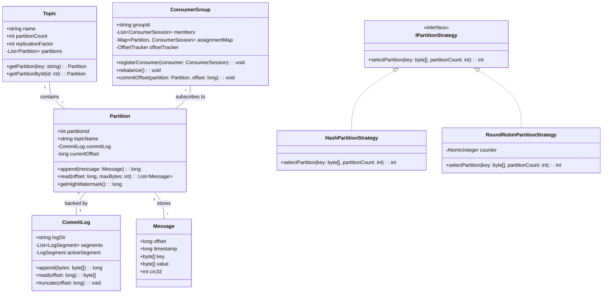
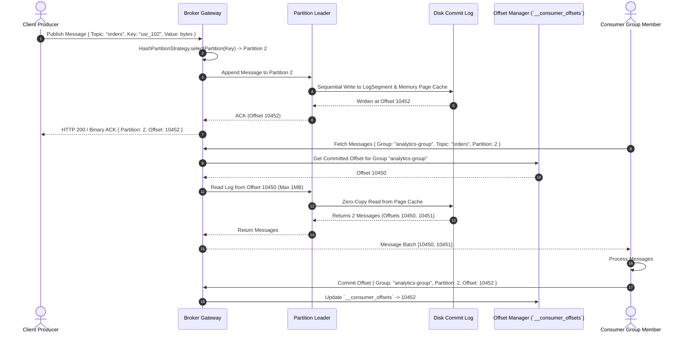

# 🛠️ Enterprise System Design Blueprint: Distributed Pub/Sub Messaging System

> **Target Role:** Principal / Staff Architect / Senior LLD & HLD Engineers  
> **Product Perspective:** Building a high-throughput, low-latency distributed Topic-based Pub/Sub broker engine supporting partition-based message streaming, consumer groups, offset tracking, and guaranteed delivery semantics.  
> **Navigation:** ⬅️ [Back to Category Index](./README.md) | 📅 [8-Week Roadmap](../../ROADMAP.md)

---

## 1. 🎯 Requirements & Product Scope

### 📋 Functional Requirements (FR)

1. **Topic & Partition Management:** Dynamic creation of Topics divided into $N$ ordered, immutable, append-only commit log partitions.
2. **Producer Publishing:** Support key-based partition routing (Hash partitioning) and round-robin publishing with configurable acknowledgment levels (`ACK=0`, `ACK=1`, `ACK=ALL`).
3. **Consumer Groups & Subscription:** Allow multiple consumers to join a Consumer Group. Partitions within a topic are distributed evenly across group members (Point-to-Point load balancing). Multiple distinct groups can independently subscribe to the same topic (Fan-out broadcast).
4. **Offset Management & Replaying:** Track consumer group offsets per partition. Support automatic or manual offset commits, permitting consumers to rewind and replay historical logs.
5. **Message Retention & Garbage Collection:** Retain messages based on configurable TTL (e.g., 7 days) or partition log segment size limits regardless of consumption state.

### ⚡ Non-Functional Requirements (NFR)

1. **Ultra-Low Latency:** In-memory write ingestion to message log $P_{99} < 10\text{ms}$.
2. **High Throughput Scale:** Handle 1 Million published messages/second ($\sim 1\text{ GB/s}$ network throughput).
3. **High Availability & Fault Tolerance:** Topic partitions replicated across $R=3$ broker nodes using leader-follower quorum replication (Raft consensus or ZooKeeper/KRaft cluster metadata).
4. **Ordering Guarantee:** Strict FIFO ordering guaranteed per partition.

---

## 2. 🧮 Scale & Quantitative Estimates

```
Message Metrics:
  - Total Target Throughput: 1,000,000 messages / sec
  - Average Payload Size: 1 KB / message
  - Network Ingress Bandwidth: 1M * 1 KB = 1 GB/sec (8 Gbps)
  - Network Egress Bandwidth (Avg 3 Consumer Groups/Topic): 3 * 1 GB/sec = 3 GB/sec (24 Gbps)

Storage & Retention Sizing (7-Day Log Retention):
  - Daily Ingestion Volume: 1 GB/s * 86,400s = 86.4 TB / day
  - 7-Day Storage Footprint (Uncompressed): 86.4 TB * 7 = 604.8 TB
  - Replicated Storage Footprint (Replication Factor R = 3): 604.8 TB * 3 ≈ 1.81 Petabytes

Broker Memory & I/O Sizing:
  - Operating System Page Cache: 64 GB RAM per Broker node to serve reads directly from OS Page Cache (Zero-Copy sendfile I/O).
  - Cluster Sizing: 30 Broker Nodes (Each handling ~33,000 write QPS & 30 MB/sec disk write stream).
```

---

## 3. 🛠️ Tech Stack & Architectural Justifications

| Component | Technology Choice | Architectural Rationale |
| :--- | :--- | :--- |
| **Broker Kernel / Runtime** | Go / Rust / Java (Netty) | High-performance async I/O engine with direct memory allocation (`ByteBuffer`), avoiding GC pause overhead during heavy packet processing. |
| **Log Storage Engine** | Append-Only Disk Commit Logs | Sequential disk writes achieve $>100\text{ MB/s}$ throughput per spindle; index files map offsets to physical file byte locations for $O(1)$ disk reads. |
| **Cluster Coordination** | KRaft / Raft Consensus | Eliminates external Zookeeper dependencies; manages topic metadata, partition leader elections, and consumer group controller state. |
| **Network Protocol** | Custom Binary Protocol over TCP | Eliminates HTTP/JSON serialization overhead; uses binary frames with length-prefixed headers and CRC32 checksums. |
| **Offset & Metadata Store** | Dedicated Internal Topic (`__consumer_offsets`) | High-speed, log-compacted key-value store maintaining `(GroupId, Topic, Partition) -> Offset` mappings. |

---

## 4. 📐 Visual UML Diagrams

### 🏗️ Class Diagram (Broker Core Engine & Partition Storage)



### 🔄 Sequence Diagram: End-to-End Publish & Consumer Group Pull Flow



### 🧩 Component & System Architecture Diagram (HLD)

```mermaid
graph TB
    subgraph Producers
        P1[Order Producer Service]
        P2[Payment Event Producer]
    end

    subgraph Cluster Coordination
        KRaft[KRaft Controller / Leader Election Node]
    end

    subgraph Broker Cluster Nodes
        subgraph Broker Node 1
            B1_P0[Topic 'orders' - Partition 0 LEADER]
            B1_P1[Topic 'orders' - Partition 1 FOLLOWER]
        end

        subgraph Broker Node 2
            B2_P1[Topic 'orders' - Partition 1 LEADER]
            B2_P0[Topic 'orders' - Partition 0 FOLLOWER]
        end
    end

    subgraph Internal State
        OffsetsTopic[Internal Topic: `__consumer_offsets`]
    end

    subgraph Consumer Group A (Order Processors)
        C_A1[Consumer A1 (Assigned P0)]
        C_A2[Consumer A2 (Assigned P1)]
    end

    subgraph Consumer Group B (Audit Logger)
        C_B1[Consumer B1 (Assigned P0 & P1)]
    end

    P1 --> B1_P0
    P2 --> B2_P1

    B1_P0 -.->|Replication Stream| B2_P0
    B2_P1 -.->|Replication Stream| B1_P1

    B1_P0 --> OffsetsTopic
    B2_P1 --> OffsetsTopic

    C_A1 --> B1_P0
    C_A2 --> B2_P1
    C_B1 --> B1_P0
    C_B1 --> B2_P1
```

---

## 5. 🧱 OOP & SOLID Principles Mapping

- **Single Responsibility Principle (SRP):**
  - `CommitLog`: Manages physical segment file allocation, byte offset indexing, and flush operations.
  - `PartitionAssignor`: Encapsulates logic for rebalancing partitions across consumer group members.
  - `OffsetManager`: Handles loading, updating, and committing consumer group state.
- **Open/Closed Principle (OCP):**
  - Partitioning strategy is decoupled via `IPartitionStrategy`. Custom routing policies (e.g., Priority-based, Custom Hash) are added without modifying the broker core.
- **Liskov Substitution Principle (LSP):**
  - `HashPartitionStrategy` and `RoundRobinPartitionStrategy` conform to `IPartitionStrategy` and can be substituted transparently.
- **Interface Segregation Principle (ISP):**
  - `ISegmentReader` and `ISegmentWriter` interfaces separate reading and writing capabilities for log components.
- **Dependency Inversion Principle (DIP):**
  - High-level consumer group manager depends on the abstract `IOffsetStore` interface, allowing seamless switching from memory to persistent disk/DB backends.

---

## 6. 🎨 Design Patterns Selection

1. **Broker Pattern:** Central coordination broker routing messages decoupled from producers and consumers.
2. **Observer Pattern / Push-Pull:** Consumers register subscriptions; brokers maintain topic listener indices and support pull/push streaming dispatch.
3. **Producer-Consumer Pattern:** In-memory queue buffers (`RingBuffer` / `ConcurrentLinkedQueue`) decouple producer network request threads from background disk log append threads.
4. **Strategy Pattern:** `IPartitionStrategy` encapsulates key routing policies.
5. **Iterator Pattern:** `LogSegmentIterator` allows consumers to sequentially read log records across segment file boundaries transparently.

---

## 7. 📂 Production Code Blueprint (TypeScript)

```typescript
import * as crypto from 'crypto';

// ============================================================================
// 1. Core Domain Models & Interfaces
// ============================================================================

export interface Message {
  offset: number;
  timestamp: number;
  key: string | null;
  value: Buffer;
  crc32: string;
}

export interface PartitionOffset {
  topic: string;
  partitionId: number;
  offset: number;
}

// ============================================================================
// 2. Strategy Pattern: Partitioning Routing Algorithms
// ============================================================================

export interface IPartitionStrategy {
  selectPartition(key: string | null, partitionCount: number): number;
}

export class HashPartitionStrategy implements IPartitionStrategy {
  selectPartition(key: string | null, partitionCount: number): number {
    if (!key) {
      return Math.floor(Math.random() * partitionCount);
    }
    const hash = crypto.createHash('md5').update(key).digest('hex');
    const numericHash = parseInt(hash.substring(0, 8), 16);
    return numericHash % partitionCount;
  }
}

export class RoundRobinPartitionStrategy implements IPartitionStrategy {
  private counter = 0;

  selectPartition(key: string | null, partitionCount: number): number {
    const partition = this.counter % partitionCount;
    this.counter = (this.counter + 1) % Number.MAX_SAFE_INTEGER;
    return partition;
  }
}

// ============================================================================
// 3. Low-Level Commit Log & Partition Implementation
// ============================================================================

export class Partition {
  private log: Message[] = [];
  private currentOffset = 0;

  constructor(
    public readonly topicName: string,
    public readonly partitionId: number,
  ) {}

  append(key: string | null, value: Buffer): Message {
    const offset = this.currentOffset++;
    const timestamp = Date.now();
    const crc32 = crypto.createHash('sha256').update(value).digest('hex').substring(0, 8);

    const message: Message = {
      offset,
      timestamp,
      key,
      value,
      crc32,
    };

    this.log.push(message);
    return message;
  }

  read(startOffset: number, maxCount: number = 100): Message[] {
    if (startOffset < 0 || startOffset >= this.log.length) {
      return [];
    }
    return this.log.slice(startOffset, startOffset + maxCount);
  }

  getHighWatermark(): number {
    return this.currentOffset;
  }
}

// ============================================================================
// 4. Topic & Broker Management Kernel
// ============================================================================

export class Topic {
  private partitions: Partition[] = [];

  constructor(
    public readonly name: string,
    partitionCount: number,
    private partitionStrategy: IPartitionStrategy = new HashPartitionStrategy(),
  ) {
    for (let i = 0; i < partitionCount; i++) {
      this.partitions.push(new Partition(name, i));
    }
  }

  publish(key: string | null, value: Buffer): Message {
    const targetPartitionId = this.partitionStrategy.selectPartition(key, this.partitions.length);
    const partition = this.partitions[targetPartitionId];
    return partition.append(key, value);
  }

  getPartition(partitionId: number): Partition {
    const part = this.partitions[partitionId];
    if (!part) throw new Error(`Partition ${partitionId} does not exist in topic ${this.name}`);
    return part;
  }

  getPartitionCount(): number {
    return this.partitions.length;
  }
}

// ============================================================================
// 5. Consumer Group & Rebalance Manager
// ============================================================================

export class ConsumerGroup {
  private members: Set<string> = new Set();
  private committedOffsets: Map<string, number> = new Map(); // key: "topic:partitionId"
  private assignments: Map<string, number[]> = new Map(); // key: memberId -> partitionIds

  constructor(
    public readonly groupId: string,
    private topic: Topic,
  ) {}

  registerMember(memberId: string): void {
    this.members.add(memberId);
    this.rebalance();
  }

  unregisterMember(memberId: string): void {
    this.members.delete(memberId);
    this.assignments.delete(memberId);
    this.rebalance();
  }

  private rebalance(): void {
    console.log(`[Rebalance] Triggered for group ${this.groupId}. Members: ${this.members.size}`);
    this.assignments.clear();

    const memberList = Array.from(this.members);
    if (memberList.length === 0) return;

    const totalPartitions = this.topic.getPartitionCount();
    for (let p = 0; p < totalPartitions; p++) {
      const assignedMember = memberList[p % memberList.length];
      const existing = this.assignments.get(assignedMember) || [];
      existing.push(p);
      this.assignments.set(assignedMember, existing);
    }
  }

  getAssignedPartitions(memberId: string): number[] {
    return this.assignments.get(memberId) || [];
  }

  commitOffset(partitionId: number, offset: number): void {
    const key = `${this.topic.name}:${partitionId}`;
    this.committedOffsets.set(key, offset);
  }

  getCommittedOffset(partitionId: number): number {
    const key = `${this.topic.name}:${partitionId}`;
    return this.committedOffsets.get(key) || 0;
  }

  poll(memberId: string, maxBatchSize: number = 10): Map<number, Message[]> {
    const result = new Map<number, Message[]>();
    const assignedPartitions = this.getAssignedPartitions(memberId);

    for (const pId of assignedPartitions) {
      const currentOffset = this.getCommittedOffset(pId);
      const partition = this.topic.getPartition(pId);
      const messages = partition.read(currentOffset, maxBatchSize);

      if (messages.length > 0) {
        result.set(pId, messages);
        // Auto-advance offset internal state
        const lastMsg = messages[messages.length - 1];
        this.commitOffset(pId, lastMsg.offset + 1);
      }
    }

    return result;
  }
}
```

---

## 8. 🔀 High-Level Design (HLD) & Scale Bottlenecks

### 1. Zero-Copy Data Transfer Architecture

In traditional socket I/O, reading log files and transmitting over network requires 4 context switches and 3 data copies:

```
[Disk Log] -> (DMA Copy) -> [Kernel OS Page Cache] -> (CPU Copy) -> [User Memory Space]
           -> (CPU Copy)  -> [Socket Buffer]       -> (DMA Copy) -> [Network Card NIC]
```

**Broker Solution (`sendfile` system call):**
We utilize Zero-Copy DMA transfers (`sendfile` in Linux / Java `FileChannel.transferTo`):

```
[Disk Log] -> (DMA Copy) -> [Kernel OS Page Cache] -> (DMA Copy) -> [Network Card NIC]
```

This bypasses User Space memory allocation entirely, reducing CPU utilization by $80\%$ and unlocking maximum line-rate network bandwidth.

### 2. Consumer Group Rebalance Protocol (Cooperative Sticky Rebalancing)

- **Eager Rebalance Problem:** Traditional rebalancing revokes *all* partition assignments from all consumers during a member join/leave, causing global processing pauses ("Stop-the-World").
- **Cooperative Sticky Protocol Solution:**
  1. Members continue consuming from un-impacted partitions during rebalance.
  2. Only partitions requiring migration from an old owner to a new member are reassigned and revoked.
  3. Processing throughput stays smooth with zero global lag spikes.

---

## 9. 🧠 Collapsed Senior/Staff Level Grill Q&A

<details>
<summary>❓ 1. How do you prevent data loss when a partition leader broker node crashes before followers replicate the log?</summary>

**Answer:**
We configure producer durability and broker replication parameters:
1. **Producer Acks = ALL (`acks=-1`):** The broker sends a successful ACK to the producer only after the message is written to the leader log *and* flushed to a minimum quorum of In-Sync Replicas (`min.insync.replicas = 2`).
2. **ISR Pool Management:** If a follower falls behind the leader timestamp by more than `replica.lag.time.max.ms` (e.g., 30s), it is dropped from the ISR pool to prevent slowing down overall ingestion.
3. **Unclean Leader Election Disabled:** `unclean.leader.election.enable = false` ensures out-of-sync followers outside the ISR pool can never be elected as leader, prioritizing consistency over availability.

</details>

<details>
<summary>❓ 2. How do you handle partition key skew when 90% of messages share the same partition key?</summary>

**Answer:**
Key skew causes hot partitions where a single broker's CPU/disk is saturated while others remain idle.
1. **Key Salting:** Append a random bounded integer suffix to the hot key: `key_salted = key + "_" + random(0, 4)`. This spreads messages across 5 distinct partitions.
2. **Consumer Aggregation:** Subscribing consumers strip the salt suffix (`key_salted.split('_')[0]`) to reconstruct original domain identity during processing.
3. **Custom Partitioning Strategy:** Override `IPartitionStrategy` to apply round-robin fallback for high-cardinality hot keys.

</details>

<details>
<summary>❓ 3. How do you implement compaction on historical log segments for state store topics?</summary>

**Answer:**
1. **Log Compaction Engine:** For key-value workload topics (e.g., user profile updates), the broker background thread periodically scans inactive log segments.
2. **Deduplication:** Keeps only the *latest value record* for each distinct message key and discards older offsets with matching keys.
3. **Tombstones:** When a key deletion occurs, a record with a `null` value (Tombstone) is appended. Compaction retains the tombstone for `delete.retention.ms` to ensure consumers observe the delete event before removing it permanently.

</details>

<details>
<summary>❓ 4. What is the difference between Push vs Pull consumer models, and why do enterprise messaging systems choose Pull?</summary>

**Answer:**
- **Push Model:** Broker pushes messages to consumers immediately upon arrival.
  - *Failure Mode:* If production spikes beyond consumer capacity, consumers are overwhelmed, suffering memory exhaustion and crashes.
- **Pull Model (Chosen):** Consumers continuously poll the broker for batches up to their current capacity (`max.poll.records`).
  - *Advantage:* Naturally enforces **Backpressure**. Slow consumers process at their own pace without crashing. Long-polling flags (`long_poll_timeout_ms`) ensure consumers do not waste CPU cycles in tight loops when topics are empty.

</details>
