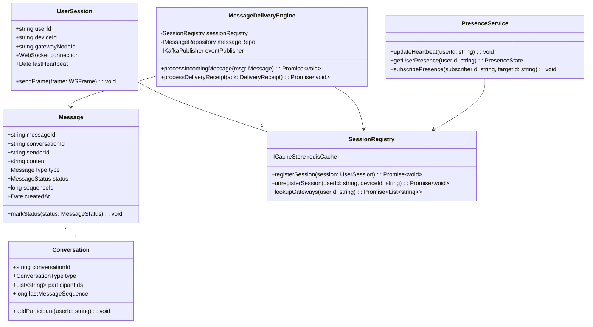
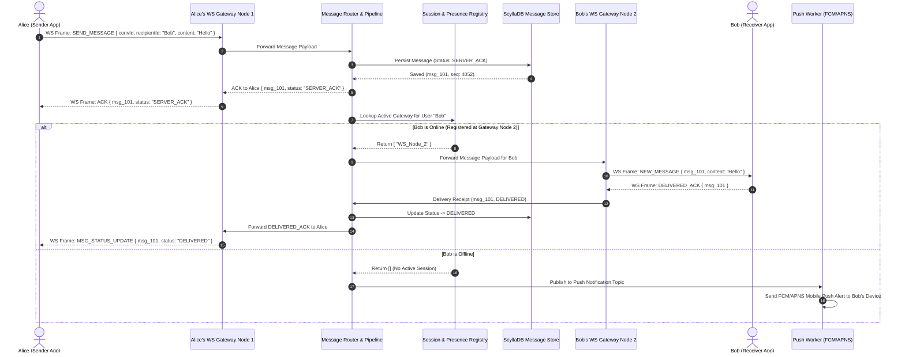
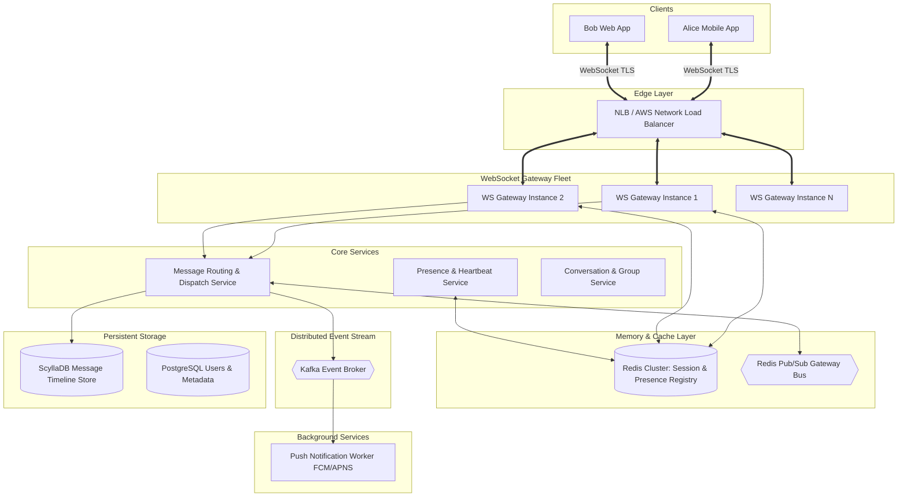

# 🛠️ Enterprise System Design Blueprint: Real-Time Chat Application

> **Target Role:** Principal / Staff Architect / Senior LLD & HLD Engineers  
> **Product Perspective:** Building a production-grade, highly concurrent messaging platform (WhatsApp / Slack / Messenger scale) supporting 1-on-1 and group chats, WebSocket session gateways, presence status, typing indicators, and reliable delivery receipts.  
> **Navigation:** ⬅️ [Back to Category Index](./README.md) | 📅 [8-Week Roadmap](../../ROADMAP.md)

---

## 1. 🎯 Requirements & Product Scope

### 📋 Functional Requirements (FR)

1. **Real-Time 1-on-1 & Group Messaging:** Low-latency text messaging supporting 1-on-1 direct conversations and group channels with up to 2,000 members.
2. **Delivery Receipt State Machine:** Track message delivery states: `SENT` $\rightarrow$ `SERVER_ACK` $\rightarrow$ `DELIVERED` (recipient device received) $\rightarrow$ `READ` (recipient opened chat).
3. **Presence Engine & Typing Indicators:** Live online/offline status, last-seen timestamps, and real-time transient typing indicators (`user X is typing...`).
4. **Offline Queueing & Push Fallback:** Buffer messages for offline users and trigger APNS/FCM mobile push notifications when recipients are disconnected.
5. **Multi-Device Synchronization:** Deliver messages concurrently to all active devices (mobile, web, desktop) logged into a user's account.

### ⚡ Non-Functional Requirements (NFR)

1. **Ultra-Low Latency:** Sub-50ms delivery latency for online recipients ($P_{99} < 50\text{ms}$).
2. **Concurrently Connected Scale:** Support 10 Million concurrent active WebSocket connections.
3. **Daily Volume:** 50 Million DAU producing 5 Billion messages / day ($\sim 58,000\text{ msg/sec}$ average, $150,000\text{ msg/sec}$ peak).
4. **Storage Durability & Search:** Immutable, multi-region message persistence with infinite history scroll.

---

## 2. 🧮 Scale & Quantitative Estimates

```
User & Connection Metrics:
  - Total Daily Active Users (DAU): 50 Million
  - Peak Concurrent WebSocket Connections: 10 Million active sockets

Traffic Calculations:
  - Daily Messages Sent: 5 Billion / day
  - Average Message QPS: 5,000,000,000 / 86,400s ≈ 57,870 msg/sec
  - Peak Message Ingestion QPS: 150,000 msg/sec
  - Read Delivery QPS (Avg 1.5 receivers per msg): 150,000 * 1.5 = 225,000 QPS

Payload & Storage Sizing:
  - Average Message Payload: 500 bytes (text, metadata, sender/receiver IDs, timestamp)
  - Daily Ingestion Storage: 5B * 500 B = 2.5 TB / day
  - 5-Year Message History Storage: 2.5 TB * 365 * 5 ≈ 4.56 Petabytes (ScyllaDB / Cassandra wide-column store)

Gateway Connection Memory Sizing:
  - Per-WebSocket Socket Memory Allocation: ~10 KB
  - Total Gateway Cluster RAM footprint: 10M connections * 10 KB = 100 GB RAM
  - Sockets distributed across 50 Gateway instances (200,000 sockets / instance)
```

---

## 3. 🛠️ Tech Stack & Architectural Justifications

| Component | Technology Choice | Architectural Rationale |
| :--- | :--- | :--- |
| **WebSocket Connection Gateway** | Go / Node.js (ws / Netty) | Epoll-based non-blocking network thread loops supporting 200,000 concurrent open sockets per instance with minimal RAM footprint. |
| **Session & Presence Registry** | Redis Cluster (In-Memory Hash) | Maintains mapping of `UserId -> GatewayInstanceId` and presence heartbeat state with sub-2ms lookup latency. |
| **Message Store (Persistence)** | ScyllaDB / Apache Cassandra | Wide-column NoSQL database optimized for heavy sequential write workloads partitioned by `(conversation_id, bucket_page)`. |
| **Async Bus & Event Stream** | Apache Kafka | Decouples incoming message streams from presence counters, media indexing, push notification workers, and delivery metrics. |
| **Media Attachments Storage** | Cloudflare R2 / AWS S3 + CDN | Presigned upload URL mechanism for image/video attachments with global edge caching. |

---

## 4. 📐 Visual UML Diagrams

### 🏗️ Class Diagram (Message Engine & Session Management)



### 🔄 Sequence Diagram: End-to-End Real-Time Message & Delivery ACK Flow



### 🧩 Component & System Architecture Diagram (HLD)



---

## 5. 🧱 OOP & SOLID Principles Mapping

- **Single Responsibility Principle (SRP):**
  - `ConnectionManager`: Handles low-level WebSocket handshake, heartbeat timeouts, and frame parsing.
  - `MessageStateTracker`: Enforces message status state transitions (`SENT` $\rightarrow$ `DELIVERED` $\rightarrow$ `READ`).
  - `PresenceEngine`: Manages heartbeat timers and presence change notification broadcasts.
- **Open/Closed Principle (OCP):**
  - Message formatting handles text, media, voice notes, and system notifications via `IMessagePayloadHandler` interfaces without altering routing pipeline code.
- **Liskov Substitution Principle (LSP):**
  - `DirectConversation` and `GroupConversation` extend base `Conversation` abstraction and can be processed interchangeably by `MessageDeliveryEngine`.
- **Interface Segregation Principle (ISP):**
  - Interfaces separated into `IClientCommunicator`, `IMessageStorer`, and `IPresenceSubscriber`.
- **Dependency Inversion Principle (DIP):**
  - Core delivery logic references `ISessionRegistry` abstraction rather than hardcoding concrete Redis calls.

---

## 6. 🎨 Design Patterns Selection

1. **State Pattern:** Encapsulates message status updates (`MessageState` pattern for `DraftState`, `SentState`, `DeliveredState`, `ReadState`).
2. **Observer Pattern:** Real-time presence subscribers and group channel broadcasts dynamically notify connected sockets.
3. **Strategy Pattern:** Message dispatch routing strategy (`DirectWSStrategy` vs `OfflinePushStrategy`).
4. **Adapter Pattern:** Translates WebSocket binary protocol frames to internal domain TypeScript objects.
5. **Factory Pattern:** `ConversationFactory` instantiates appropriate 1-on-1 or multi-member group chat context objects.

---

## 7. 📂 Production Code Blueprint (TypeScript)

```typescript
// ============================================================================
// 1. Domain Entities & Status State Machine
// ============================================================================

export enum MessageStatus {
  SENT = 'SENT',
  SERVER_ACK = 'SERVER_ACK',
  DELIVERED = 'DELIVERED',
  READ = 'READ',
  FAILED = 'FAILED',
}

export enum ConversationType {
  DIRECT = 'DIRECT',
  GROUP = 'GROUP',
}

export interface ChatMessage {
  id: string;
  conversationId: string;
  senderId: string;
  recipientId?: string; // Set for DIRECT
  content: string;
  sequenceId: number;
  status: MessageStatus;
  timestamp: number;
}

export interface DeliveryReceipt {
  messageId: string;
  conversationId: string;
  userId: string;
  status: MessageStatus; // DELIVERED or READ
  timestamp: number;
}

export interface UserSession {
  userId: string;
  deviceId: string;
  gatewayNodeId: string;
  wsSocket: any; // Raw socket reference
}

// ============================================================================
// 2. Session Registry Interface & In-Memory Redis Mock
// ============================================================================

export interface ISessionRegistry {
  register(session: UserSession): Promise<void>;
  unregister(userId: string, deviceId: string): Promise<void>;
  getGatewayNodes(userId: string): Promise<string[]>;
}

export class RedisSessionRegistry implements ISessionRegistry {
  private userSockets: Map<string, Map<string, UserSession>> = new Map(); // userId -> Map<deviceId, session>

  async register(session: UserSession): Promise<void> {
    let devices = this.userSockets.get(session.userId);
    if (!devices) {
      devices = new Map();
      this.userSockets.set(session.userId, devices);
    }
    devices.set(session.deviceId, session);
    console.log(`[Registry] Registered session for user ${session.userId} on device ${session.deviceId}`);
  }

  async unregister(userId: string, deviceId: string): Promise<void> {
    const devices = this.userSockets.get(userId);
    if (devices) {
      devices.delete(deviceId);
      if (devices.size === 0) this.userSockets.delete(userId);
    }
  }

  async getGatewayNodes(userId: string): Promise<string[]> {
    const devices = this.userSockets.get(userId);
    if (!devices) return [];
    return Array.from(devices.values()).map(s => s.gatewayNodeId);
  }

  getSession(userId: string, deviceId: string): UserSession | undefined {
    return this.userSockets.get(userId)?.get(deviceId);
  }
}

// ============================================================================
// 3. Message Routing Strategy
// ============================================================================

export interface IMessageRoutingStrategy {
  route(message: ChatMessage): Promise<boolean>;
}

export class WebSocketRoutingStrategy implements IMessageRoutingStrategy {
  constructor(
    private sessionRegistry: RedisSessionRegistry,
    private currentNodeId: string,
  ) {}

  async route(message: ChatMessage): Promise<boolean> {
    if (!message.recipientId) return false;

    const gatewayNodes = await this.sessionRegistry.getGatewayNodes(message.recipientId);
    if (gatewayNodes.length === 0) {
      console.log(`[Router] Recipient ${message.recipientId} is offline. Routing to Push Notification Queue.`);
      return false; // Triggers Push Notification Fallback
    }

    console.log(`[Router] Recipient ${message.recipientId} active on nodes: ${gatewayNodes.join(', ')}`);
    // Deliver to connected WebSocket sockets
    return true;
  }
}

// ============================================================================
// 4. Core Message Delivery Engine
// ============================================================================

export class MessageDeliveryEngine {
  private sequenceCounter = 0;

  constructor(
    private sessionRegistry: RedisSessionRegistry,
    private routerStrategy: IMessageRoutingStrategy,
  ) {}

  async processIncomingMessage(
    senderId: string,
    conversationId: string,
    recipientId: string,
    content: string,
  ): Promise<ChatMessage> {
    // Step 1: Assign monotonic sequence ID and server timestamp
    this.sequenceCounter++;
    const message: ChatMessage = {
      id: `msg_${Date.now()}_${Math.random().toString(36).substring(7)}`,
      conversationId,
      senderId,
      recipientId,
      content,
      sequenceId: this.sequenceCounter,
      status: MessageStatus.SERVER_ACK,
      timestamp: Date.now(),
    };

    // Step 2: Persist to DB (Simulated)
    console.log(`[MessageEngine] Saved message ${message.id} (Seq: ${message.sequenceId}) to ScyllaDB`);

    // Step 3: Route to recipient
    const deliveredRealtime = await this.routerStrategy.route(message);
    if (!deliveredRealtime) {
      this.triggerPushNotification(message);
    }

    return message;
  }

  async processDeliveryReceipt(receipt: DeliveryReceipt): Promise<void> {
    console.log(
      `[ReceiptEngine] Message ${receipt.messageId} marked as ${receipt.status} by user ${receipt.userId}`,
    );
    // Notify sender via WebSocket of status update
  }

  private triggerPushNotification(message: ChatMessage): void {
    console.log(`[PushWorker] Triggered APNS/FCM Push Alert for recipient ${message.recipientId}`);
  }
}
```

---

## 8. 🔀 High-Level Design (HLD) & Scale Bottlenecks

### 1. Scaling 10 Million Concurrent WebSocket Connections

```
              [Edge Network Load Balancer (Layer 4 TCP)]
                                  |
    +-----------------------------+-----------------------------+
    |                             |                             |
[WS Gateway 1]               [WS Gateway 2]               [WS Gateway N]
(200k Sockets)               (200k Sockets)               (200k Sockets)
    |                             |                             |
    +-----------------------------+-----------------------------+
                                  |
                  [Redis Cluster Gateway Registry]
              Key: user:<id>:gateways -> Set(node_ip)
```

- **Linux Kernel OS Tuning:** Increase `file-max` and `nofile` socket limits (`ulimit -n 1048576`). Tune TCP buffer sizes (`net.ipv4.tcp_rmem` and `wmem`) down to 4 KB per connection to reduce RAM consumption.
- **Cross-Gateway Inter-Node Dispatch:** When Alice (on Gateway 1) sends a message to Bob (connected to Gateway 2), Gateway 1 publishes the message payload to a Redis Pub/Sub channel `channel:gateway:node_2`. Gateway 2 consumes the channel event and pushes the message frame over Bob's active socket.

### 2. Large Group Chat Fan-out Thundering Herd

- **Problem:** Sending a message to a group channel with 100,000 members requires 100,000 socket writes. Processing this synchronously blocks the server thread and saturates bandwidth.
- **Solution (Server-Side Batching & Dynamic Fan-Out):**
  1. Group messages are published to a Kafka topic `group.messages` partitioned by `conversation_id`.
  2. A dedicated group worker fleet fetches the message and queries the Redis Session Store to partition recipients by their *current active Gateway Node ID*.
  3. Instead of sending 100,000 individual messages across nodes, workers publish **1 bulk payload per Gateway Node** containing the list of target socket IDs on that node.

---

## 9. 🧠 Collapsed Senior/Staff Level Grill Q&A

<details>
<summary>❓ 1. How do you resolve out-of-order message rendering when mobile clients operate over unreliable cellular connections?</summary>

**Answer:**
1. **Server-Assigned Monotonic Sequence Numbers:** Wall-clock timestamps are inaccurate across distributed client devices. The server assigns an incrementing 64-bit Sequence ID (`sequence_id`) per conversation:
   $$\text{SequenceID}_{\text{new}} = \text{AtomicIncrement}(\text{Conversation}_{\text{id}})$$
2. **Client-Side Re-ordering Window:** Mobile clients maintain a local buffer sorted by `sequence_id`. If a gap is detected (e.g., received seq 104 and 106, missing 105), the client renders seq 104 and issues a sync fetch request: `GET /v1/conversations/:id/messages?after=104&limit=5`.

</details>

<details>
<summary>❓ 2. How do you prevent presence heartbeat updates for 10M users from overwhelming Redis write capacity?</summary>

**Answer:**
1. **Heartbeat Batching & Throttling:** Sockets send heartbeats every 30 seconds rather than constantly.
2. **Local Gateway Aggregation:** Gateway nodes aggregate heartbeats locally in memory and flush updates to Redis using pipeline commands (`MSET` / `PIPELINE`) every 5 seconds.
3. **Lazy Presence Fetching (Pull vs Push):** Rather than broadcasting online/offline state to all contacts of a user, presence status is fetched **on-demand** only when a user opens an active chat thread with a contact.

</details>

<details>
<summary>❓ 3. How do you handle database sharding in ScyllaDB/Cassandra for message history lookup?</summary>

**Answer:**
1. **Composite Primary Key Strategy:**
   - Partition Key: `(conversation_id, bucket_page)`
   - Clustering Key: `sequence_id DESC`
2. **Bucketing Strategy:** To prevent a single long-lived group chat from creating a massive single partition (violating the 100 MB Cassandra partition size rule), messages are bucketed into pages:
   $$\text{bucket\_page} = \lfloor \text{sequence\_id} / 5000 \rfloor$$
3. This guarantees predictable partition sizes while enabling ultra-fast range queries for infinite scrolling pagination.

</details>

<details>
<summary>❓ 4. How is End-to-End Encryption (E2EE) implemented without breaking server-side delivery receipts?</summary>

**Answer:**
1. **Signal Protocol (Double Ratchet Engine):** Encryption keys are negotiated strictly client-to-client using Diffie-Hellman pre-key bundles.
2. **Opaque Server Payload:** The backend server only sees base64-encoded encrypted ciphertexts and metadata (`sender_id`, `recipient_id`, `message_id`, `sequence_id`).
3. **Payload-Agnostic Receipts:** The delivery receipt lifecycle (`SERVER_ACK`, `DELIVERED`, `READ`) operates entirely on plain unencrypted envelope headers (`message_id`). The server routes delivery acknowledgments without needing to decrypt the payload.

</details>
