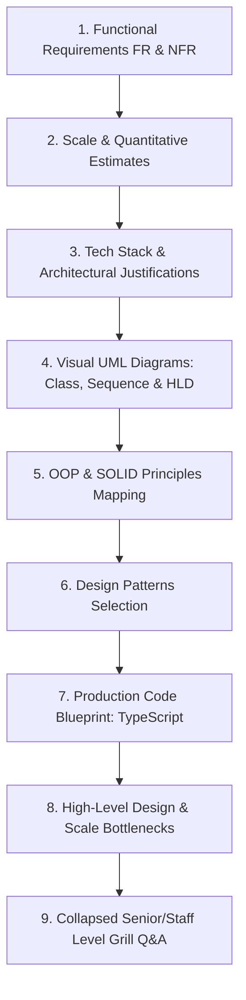

# 💬 Master System Design Problem Bank — Communication & Messaging

> **Target Role:** Principal / Staff Architect / Senior LLD & HLD Engineers  
> **Framework:** Standardized 9-Step Breakdown (Functional Requirements, Scale & Estimates, Tech Stack, Visual UML Diagrams, OOP & SOLID Mapping, Design Patterns, Code Blueprints, Scale Bottlenecks, and Collapsed Grill Q&A).  
> **Navigation:** ⬅️ [Back to Master Problem Bank](../README.md) | 📅 [8-Week Roadmap](../../ROADMAP.md)

---

## 🧭 Category Overview: Communication & Messaging (3 Master Problems)

| # | Problem Blueprint | Level | Key System Challenges & Architecture Focus | Master Guide Link |
| :---: | :--- | :---: | :--- | :---: |
| 1 | 📖 **Design Notification System** | `Easy` | Multi-Channel Gateway (Email/SMS/Push), Dynamic Template Engine, Provider Fallback Strategy, Quiet Hours & Rate Limiting | [01-Design-Notification-System.md](./01-Design-Notification-System.md) |
| 2 | 📖 **Design Pub/Sub System** | `Medium` | Distributed Topic Broker, Partition Commit Logs, Consumer Group Rebalancing, Zero-Copy OS I/O, Offset Management | [02-Design-Pub-Sub-System.md](./02-Design-Pub-Sub-System.md) |
| 3 | 📖 **Design Chat Application** | `Medium` | 10M Concurrent WebSocket Gateways, Delivery Receipt State Machine (Sent/Delivered/Read), Presence Engine, Offline Push Fallback | [03-Design-Chat-Application.md](./03-Design-Chat-Application.md) |

---

## 📐 Standardized 9-Step Problem Breakdown Framework

Every blueprint in this module strictly follows the enterprise 9-step system design workflow:

---

## 🎓 Core System Design Patterns & Key Takeaways

1. **Strategy & Adapter Patterns for External Providers:** Isolating 3rd-party vendor SDKs (Twilio, SES, FCM) behind clear interface boundaries enables automated circuit breaker failover without breaking business logic.
2. **Zero-Copy I/O & Append-Only Log Engines:** Bypassing OS user space during high-throughput message streaming unlocks full network line rate ($\sim 1\text{ GB/sec}$) in distributed Pub/Sub brokers.
3. **Session Registries & Edge WebSocket Fleet:** Separating persistent TCP state management across gateway nodes using Redis session indexing supports 10M concurrent real-time connections gracefully.
