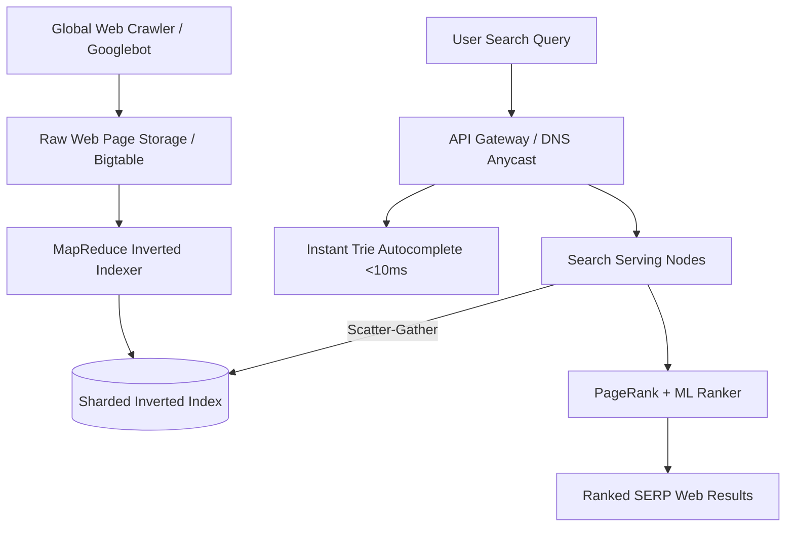
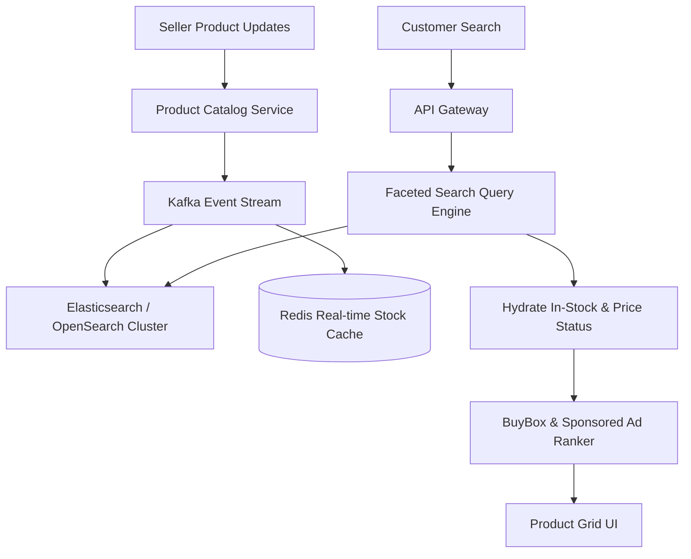
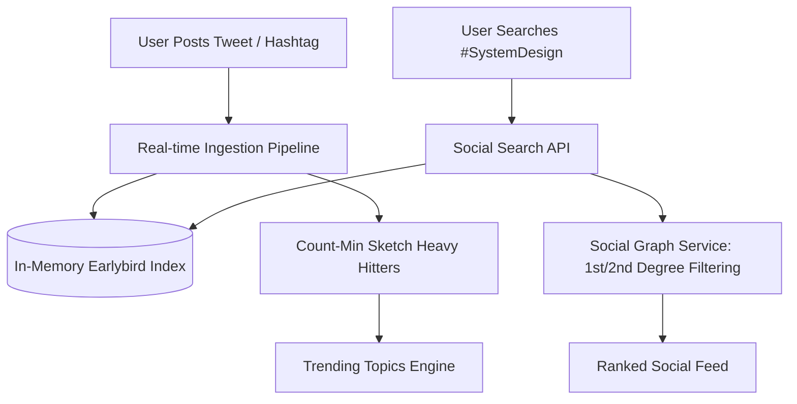

# 🔍 Domain Architecture Comparison: Search Engine Design Across Tech Giants

> **Target Audience:** Principal / Staff Architects & Senior Engineers
> **Topic:** Comparative System Design of Search & Autocomplete Infrastructure across **Google**, **Amazon E-Commerce**, and **Social Media Platforms (X / Instagram)**.

---

## 🏛️ Executive Summary: Why Search Designs Differ

While all search systems share a foundational core (Tokenization, Indexing, and Query Matching), their underlying architectures, storage engines, latency SLAs, and ranking algorithms diverge radically based on product intent:

| Architectural Dimension      | 🌐 Google Web Search                                        | 🛍️ Amazon E-Commerce Search                                      | 📱 Social Search (X / Instagram)                                 |
| :--------------------------- | :---------------------------------------------------------- | :--------------------------------------------------------------- | :--------------------------------------------------------------- |
| **Primary Goal**             | Relevant web documents with high PageRank domain authority. | High conversion likelihood (Purchase intent, in-stock items).    | Recency, social proximity, trending hashtags & viral engagement. |
| **Data Source**              | Unstructured HTML pages fetched by global web crawlers.     | Structured product catalogs (Attributes, Categories, Inventory). | Semi-structured posts, tweets, hashtags, user handles.           |
| **Indexing Pipeline**        | Batch MapReduce / Spark indexing billions of web pages.     | Real-time / Near Real-time (NRT) Lucene / Elasticsearch index.   | Real-time in-memory inverted index + Count-Min Sketch.           |
| **Key Filtering Mechanism**  | PageRank algorithm + Semantic Vector Search (embeddings).   | Faceted Search (Brand, Price, Rating, Category Tree, In-Stock).  | Social Graph 1st/2nd degree affinity + Time decay ranking.       |
| **Data Freshness / Latency** | Minutes to Hours (News: Sub-minute via ISR).                | Instant (Inventory changes must reflect in milliseconds).        | Sub-second (Real-time tweets & trending hashtag counters).       |
| **Read Latency SLA**         | $P_{99} < 100\text{ms}$                                     | $P_{99} < 50\text{ms}$                                           | $P_{99} < 20\text{ms}$                                           |

---

## 1. 🌐 1. Google Web Search Architecture

### Key Architectural Invariants:

1. **Web Crawler & Document Ingestion:** Googlebot continuously crawls $100+$ Billion web pages, storing compressed HTML snapshots in a distributed wide-column store (Bigtable).
2. **Global Inverted Index:** Document-partitioned inverted index mapping `Term -> List<Posting(DocID, TermFrequency, Positions, FontWeight)>`.
3. **PageRank Algorithm:** Graph centrality scoring measuring the quantity and quality of incoming backlinks:
   $$PR(A) = (1 - d) + d \sum_{i=1}^{n} \frac{PR(T_i)}{C(T_i)}$$
4. **Search Autocomplete (Google Instant):** Trie prefix tree pre-computed with Top-K suggestions cached at every node for $O(1)$ lookup per keystroke.

---

## 2. 🛍️ 2. Amazon E-Commerce Search Architecture

### Key Architectural Invariants:

1. **Faceted Search & Multi-Attribute Filtering:** Allows simultaneous filtering by Category Hierarchy (Electronics -> Laptops), Price Range, Customer Review Rating, and Prime Delivery Eligibility using Bitset Bitwise AND operations across posting lists.
2. **Real-Time Stock Hydration:** Search index maintains static product metadata, but queries pass through an in-memory Redis layer to dynamically filter out out-of-stock items or update prices in real time.
3. **Conversion-Based Ranking (A9 Engine):** Items are ranked not just by text match, but by purchase conversion rate, click-through rate (CTR), seller reputation, and margin.
4. **Faceted Autocomplete:** Autocomplete returns both terms and category scopes (e.g., typing `"macbook"` suggests _"macbook in Laptops"_ or _"macbook in Cases"_).

---

## 3. 📱 3. Social Search Architecture (X / Twitter & Instagram)

### Key Architectural Invariants:

1. **In-Memory Real-Time Index (Earlybird):** Tweets are indexed in RAM within milliseconds of posting to make hashtags searchable instantaneously globally.
2. **Trending Topics Engine (Count-Min Sketch):** Probabilistic data structure using sub-linear space ($O(\epsilon^{-1} \log \delta^{-1})$) to calculate top trending hashtags over rolling 5-minute sliding windows without storing full tweet texts:
   $$Count(h) = \min_{1 \le i \le d} \left( \text{table}[i][hash_i(h)] \right)$$
3. **Social Proximity Personalization:** Search results prioritize content posted by accounts the searching user follows or interacts with (1st and 2nd-degree social graph nodes).

---

## สรุป / Architecture Takeaway Summary

- **Use Google-style search** when building unstructured document search, web scraping indices, or deep semantic vector search.
- **Use Amazon-style search** when building e-commerce, real-time inventory filtering, dynamic pricing, and multi-attribute faceted catalog search.
- **Use Social-style search** when building real-time event streams, trending topic counters, and user/hashtag suggestion engines.
