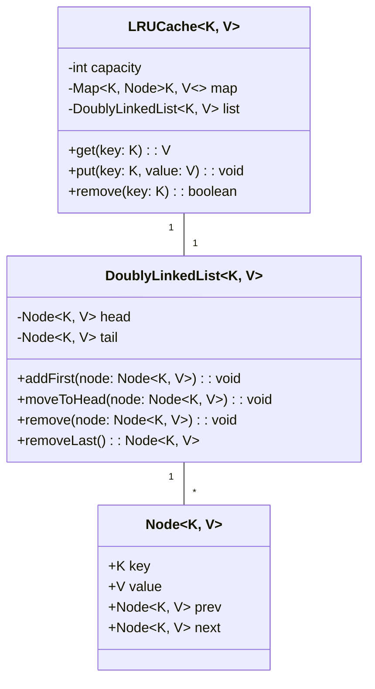
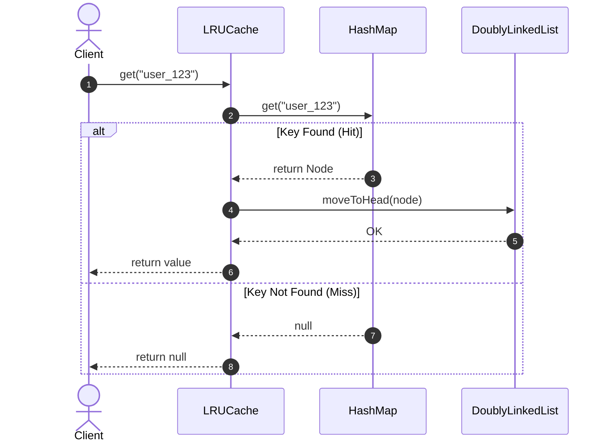

# 🛠️ Enterprise System Design Blueprint: Design LRU Cache

> **Target Role:** Principal / Staff Architect / Senior LLD & HLD Engineers  
> **Product Perspective:** Building a high-throughput, thread-safe in-memory Least Recently Used (LRU) Cache supporting $O(1)$ get/put operations, TTL expiration, and eviction policies.  
> **Navigation:** ⬅️ [Back to Data Structures & Search Index](./README.md) | 📅 [Problem Bank Index](../README.md)

---

## 1. 🎯 Requirements & Product Scope

### 📋 Functional Requirements (FR)
1. **$O(1)$ Operations:** Support $O(1)$ time complexity for `get(key)` and `put(key, value)`.
2. **LRU Eviction Policy:** Automatically evict the Least Recently Used item when cache capacity is exceeded.
3. **Node Promotion:** Accessing (`get`) or updating (`put`) an existing key promotes the entry to the Most Recently Used (MRU) position.
4. **Time To Live (TTL):** Optional key-level expiration (passive + active eviction).

### ⚡ Non-Functional Requirements (NFR)
1. **High Throughput:** Handle $>500,000$ operations per second with sub-millisecond latency ($P_{99} < 1\text{ms}$).
2. **Thread Safety:** Concurrent read/write safety using fine-grained locks or Read-Write Reentrant locks.

---

## 2. 🧮 Scale & Quantitative Estimates

```
Cache Capacity: 1,000,000 keys
Avg Entry Size: Key (32B) + Value (1KB) + Node Pointers (16B) = ~1.05 KB per entry
Total RAM Footprint: 1M * 1.05 KB = ~1.05 GB RAM
Target QPS: 500,000 QPS Peak
```

---

## 3. 🛠️ Tech Stack & Architectural Justifications

| Component | Technology Choice | Architectural Rationale |
|:---|:---|:---|
| **Lookup Store** | HashMap / Map | $O(1)$ direct reference lookup from key to Node. |
| **Recency Queue** | Doubly Linked List | $O(1)$ removal and head insertion without shifting memory. |
| **Concurrency Guard** | ReadWriteLock / ConcurrentHashMap | Prevents race conditions during concurrent node mutations. |

---

## 4. 📐 Visual UML Diagrams

### 🏗️ Class Diagram (LRU Cache Entities)



### 🔄 Sequence Diagram: Cache Get & Hit Promotion



---

## 5. 🧱 OOP & SOLID Principles Mapping

- **Single Responsibility Principle:** `Node` represents data entity; `DoublyLinkedList` manages structural ordering; `LRUCache` coordinates lookup and capacity invariants.
- **Open/Closed Principle:** Eviction policy abstracted via `IEvictionPolicy<K, V>` interface, allowing easy substitution with LFU or ARC policies.

---

## 6. 🎨 Design Patterns Selection

1. **Composite Data Structure Pattern:** HashMap + Doubly LinkedList synergy.
2. **Strategy Pattern:** `IEvictionPolicy` for plugging different cache eviction strategies (LRU, LFU, FIFO).

---

## 7. 💻 Production Code Blueprint (TypeScript)

```typescript
export class CacheNode<K, V> {
  public prev: CacheNode<K, V> | null = null;
  public next: CacheNode<K, V> | null = null;

  constructor(
    public key: K,
    public value: V
  ) {}
}

export class LRUCache<K, V> {
  private map: Map<K, CacheNode<K, V>> = new Map();
  private head: CacheNode<K, V>;
  private tail: CacheNode<K, V>;

  constructor(public readonly capacity: number) {
    if (capacity <= 0) throw new Error('Capacity must be greater than zero');
    
    // Sentinel Dummy Head and Tail nodes
    this.head = new CacheNode<any, any>(null, null);
    this.tail = new CacheNode<any, any>(null, null);
    this.head.next = this.tail;
    this.tail.prev = this.head;
  }

  public get(key: K): V | null {
    const node = this.map.get(key);
    if (!node) return null;

    // Promote to Most Recently Used (Head)
    this.moveToHead(node);
    return node.value;
  }

  public put(key: K, value: V): void {
    const existingNode = this.map.get(key);

    if (existingNode) {
      existingNode.value = value;
      this.moveToHead(existingNode);
      return;
    }

    if (this.map.size >= this.capacity) {
      // Evict Least Recently Used (Tail.prev)
      const lruNode = this.tail.prev!;
      this.removeNode(lruNode);
      this.map.delete(lruNode.key);
    }

    const newNode = new CacheNode(key, value);
    this.map.set(key, newNode);
    this.addNodeToHead(newNode);
  }

  private addNodeToHead(node: CacheNode<K, V>): void {
    node.next = this.head.next;
    node.prev = this.head;
    this.head.next!.prev = node;
    this.head.next = node;
  }

  private removeNode(node: CacheNode<K, V>): void {
    const prevNode = node.prev!;
    const nextNode = node.next!;
    prevNode.next = nextNode;
    nextNode.prev = prevNode;
  }

  private moveToHead(node: CacheNode<K, V>): void {
    this.removeNode(node);
    this.addNodeToHead(node);
  }

  public size(): number {
    return this.map.size;
  }
}
```

---

## 8. 🌐 High-Level Design (HLD) & Scale Bottlenecks

1. **Lock Contention:** Multi-threaded access to a single Doubly LinkedList creates lock bottleneck. Partition cache into $N$ isolated stripes (`ShardedLRUCache`).
2. **Distributed Tier:** Memory LRU acts as L1 local heap cache; Redis acts as L2 distributed shared cache.

---

## 9. 🎙️ Senior/Staff Level Grill Q&A

<details>
<summary><strong>Q1: Why do we use dummy Head and Tail sentinel nodes in the Doubly LinkedList?</strong></summary>

**Answer:** Dummy sentinel nodes eliminate edge-case null checks during insertion and deletion (e.g. inserting into an empty list, or removing the last remaining node). This simplifies pointer operations into clean $O(1)$ assignments without branching logic.
</details>
