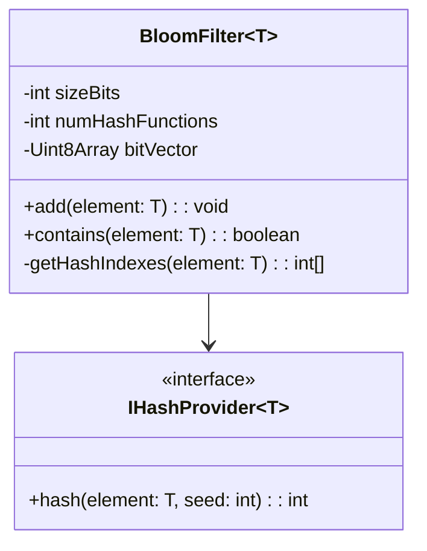

# 🛠️ Enterprise System Design Blueprint: Design Bloom Filter

> **Target Role:** Principal / Staff Architect / Senior LLD & HLD Engineers  
> **Product Perspective:** Building a space-efficient probabilistic data structure for instant set membership queries with 0% false negatives and configurable false positive probability $p$.  
> **Navigation:** ⬅️ [Back to Data Structures & Search Index](./README.md) | 📅 [Problem Bank Index](../README.md)

---

## 1. 🎯 Requirements & Product Scope

### 📋 Functional Requirements (FR)
1. **Add Item:** Insert element key into Bloom Filter bit vector using $k$ independent hash functions.
2. **Might Contain Check:** Query membership. Returns `false` (guaranteed item is **NOT** in set) or `true` (item **MIGHT** be in set with false positive probability $p$).
3. **Zero False Negatives:** If element exists in filter, query must **NEVER** return `false`.
4. **Configurable Error Tolerance:** Configurable target capacity $n$ and acceptable false positive rate $p$ (e.g. $p = 0.01 = 1\%$).

### ⚡ Non-Functional Requirements (NFR)
1. **Space Savings:** Require up to $95\%$ less memory than a HashMap (e.g., 100M items stored in ~120 MB RAM).
2. **Sub-Microsecond Latency:** Query execution in $< 1\mu\text{s}$ using bitwise operations.

---

## 2. 🧮 Scale & Mathematical Formulae

```
Mathematical Equations:
1. Optimal Bit Array Size (m):
   m = - (n * ln(p)) / (ln(2))^2
   For n = 100,000,000 elements, p = 0.01 (1%):
   m ≈ 958,505,837 bits ≈ 114.2 MB

2. Optimal Number of Hash Functions (k):
   k = (m / n) * ln(2) ≈ 0.7 * (m / n)
   For p = 0.01: k ≈ 7 hash functions

Bit Array Footprint: 114.2 MB vs HashMap (~4 GB) -> 35x Memory Compression
```

---

## 3. 🛠️ Tech Stack & Architectural Justifications

| Component | Technology Choice | Architectural Rationale |
|:---|:---|:---|
| **Bit Array** | Uint8Array / BitSet | Dense contiguous binary array allocation. |
| **Hash Functions** | Murmur3 / FNV-1a / CityHash | High-avalanche, non-cryptographic fast hashing. |
| **Double Hashing** | Kirsch-Mitzenmacher Optimization | Simulates $k$ hash functions using only 2 hash functions: $h_i(x) = h_1(x) + i \cdot h_2(x) \pmod m$. |

---

## 4. 📐 Visual UML Diagrams



---

## 5. 🧱 OOP & SOLID Principles Mapping

- **Single Responsibility Principle:** `BitSet` encapsulates bit manipulation; `BloomFilter` manages hash index mapping and membership logic.
- **Open/Closed Principle:** Hash algorithm strategy can be swapped via `IHashProvider` without modifying Bloom Filter logic.

---

## 6. 🎨 Design Patterns Selection

1. **Strategy Pattern:** Hashing strategies (`MurmurHash3`, `FNV1aHash`).
2. **Flyweight / Bitmask Pattern:** Compact bitwise storage (`bitVector[byteIndex] |= (1 << bitOffset)`).

---

## 7. 💻 Production Code Blueprint (TypeScript)

```typescript
export class BloomFilter<T extends string | number> {
  private sizeBits: number;
  private numHashFunctions: number;
  private bitVector: Uint8Array;

  constructor(expectedElements: number, falsePositiveRate: number = 0.01) {
    if (expectedElements <= 0 || falsePositiveRate <= 0 || falsePositiveRate >= 1) {
      throw new Error('Invalid Bloom Filter capacity or false positive rate.');
    }

    // m = - (n * ln(p)) / (ln(2))^2
    this.sizeBits = Math.ceil(
      -(expectedElements * Math.log(falsePositiveRate)) / Math.pow(Math.log(2), 2)
    );

    // k = (m / n) * ln(2)
    this.numHashFunctions = Math.round((this.sizeBits / expectedElements) * Math.log(2));

    const totalBytes = Math.ceil(this.sizeBits / 8);
    this.bitVector = new Uint8Array(totalBytes);
  }

  // Kirsch-Mitzenmacher Double Hashing Optimization: h_i(x) = h1(x) + i * h2(x)
  private getHashIndexes(element: T): number[] {
    const str = String(element);
    const h1 = this.fnv1a(str, 0x811c9dc5);
    const h2 = this.fnv1a(str, 0x01000193);

    const indexes: number[] = [];
    for (let i = 0; i < this.numHashFunctions; i++) {
      const combined = Math.abs((h1 + i * h2) % this.sizeBits);
      indexes.push(combined);
    }
    return indexes;
  }

  private fnv1a(str: string, seed: number): number {
    let hash = seed;
    for (let i = 0; i < str.length; i++) {
      hash ^= str.charCodeAt(i);
      hash = Math.imul(hash, 0x01000193);
    }
    return hash >>> 0;
  }

  public add(element: T): void {
    const indexes = this.getHashIndexes(element);
    for (const idx of indexes) {
      const byteIdx = Math.floor(idx / 8);
      const bitOffset = idx % 8;
      this.bitVector[byteIdx] |= 1 << bitOffset;
    }
  }

  public contains(element: T): boolean {
    const indexes = this.getHashIndexes(element);
    for (const idx of indexes) {
      const byteIdx = Math.floor(idx / 8);
      const bitOffset = idx % 8;
      if ((this.bitVector[byteIdx] & (1 << bitOffset)) === 0) {
        return false; // DEFINITELY NOT IN SET (0% False Negative)
      }
    }
    return true; // MIGHT BE IN SET (p Probability False Positive)
  }
}
```

---

## 8. 🌐 High-Level Design (HLD) & Real-World Use Cases

1. **Database Disk Seek Reduction (RocksDB / Cassandra):** Check Bloom Filter before issuing expensive SSD disk read operations for non-existent row keys.
2. **Malicious URL Filtering (Chrome Safe Browsing):** Fast client-side check to verify if URL is blacklisted before firing network API request.

---

## 9. 🎙️ Senior/Staff Level Grill Q&A

<details>
<summary><strong>Q1: Why does a standard Bloom Filter NOT support element deletion?</strong></summary>

**Answer:** Multiple inserted elements may hash to the same bit position. Setting a bit from `1` to `0` during deletion could clear bits shared by other elements, causing catastrophic false negatives. To support deletion, use a **Counting Bloom Filter** (uses 4-bit integer counters instead of single bits).
</details>
