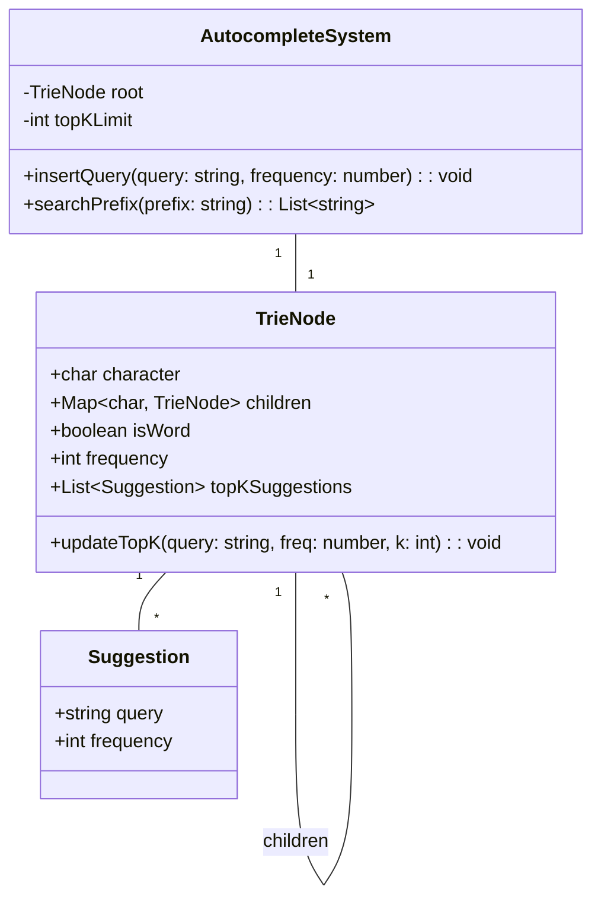
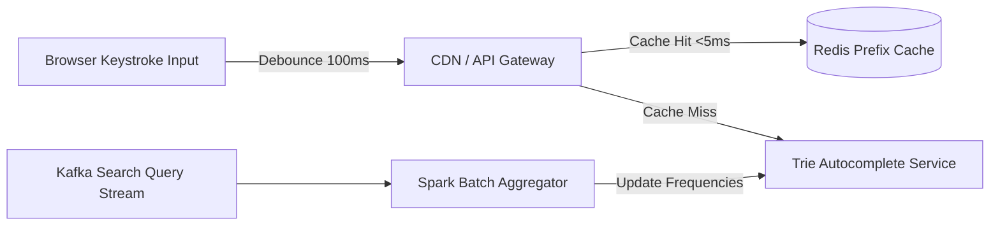

# 🛠️ Enterprise System Design Blueprint: Search Autocomplete System

> **Target Role:** Principal / Staff Architect / Senior LLD & HLD Engineers  
> **Product Perspective:** Building a sub-20ms real-time search query autocomplete suggestion engine serving 50,000 QPS using a Trie (Prefix Tree) and Priority Queue.  
> **Navigation:** ⬅️ [Back to Data Structures & Search Index](./README.md) | 📅 [Problem Bank Index](../README.md)

---

## 1. 🎯 Requirements & Product Scope

### 📋 Functional Requirements (FR)
1. **Real-time Prefix Search:** Return Top 5 most frequent search queries matching user typed prefix (e.g., `"sys"` -> `["system design", "system32", "sysadmin"]`).
2. **Frequency Ranking:** Rank suggestions dynamically by historical search volume frequency.
3. **Query Ingestion:** Background ingestion pipeline to update query frequencies without locking real-time read lookups.
4. **Case & Normalization:** Case-insensitive prefix matching and whitespace trimming.

### ⚡ Non-Functional Requirements (NFR)
1. **Ultra-Low Latency:** Return suggestions in $P_{99} < 20\text{ms}$ per keystroke.
2. **High Availability & Scale:** Handle 50,000 QPS Peak search traffic.

---

## 2. 🧮 Scale & Quantitative Estimates

```
Total Unique Queries: 100 Million
Average Query Length: 20 characters ~ 20 bytes
Trie Memory Footprint: 100M queries * 20B * overhead ~ 3.5 GB RAM (Cached in memory)
Peak Read Traffic: 50,000 QPS
Target Latency: < 20ms TTFB
```

---

## 3. 🛠️ Tech Stack & Architectural Justifications

| Component | Technology Choice | Architectural Rationale |
|:---|:---|:---|
| **Prefix Index** | Trie (Prefix Tree) | $O(L)$ lookup time complexity where $L$ is prefix string length. |
| **Top-K Cache** | MinHeap / Pre-computed List | Pre-calculates Top-K queries directly at each `TrieNode` to avoid $O(N)$ tree traversals. |
| **Async Pipeline** | Kafka + MapReduce / Spark | Aggregates user search logs in batch intervals to recalculate query frequencies. |

---

## 4. 📐 Visual UML Diagrams

### 🏗️ Class Diagram (Trie & Autocomplete Engine)



---

## 5. 🧱 OOP & SOLID Principles Mapping

- **Single Responsibility Principle:** `TrieNode` stores character branches; `AutocompleteSystem` coordinates prefix traversal and query scoring.
- **Open/Closed Principle:** Suggestion ranking algorithm can be customized via `ISuggestionRanker` strategy.

---

## 6. 🎨 Design Patterns Selection

1. **Trie Pattern (Prefix Tree):** Core structural indexing pattern.
2. **Strategy Pattern:** `ISuggestionRanker` (Frequency-based, Recency-based, Personalization-based).
3. **Producer-Consumer Pattern:** Decouples live keystroke reads from async batch frequency updates.

---

## 7. 💻 Production Code Blueprint (TypeScript)

```typescript
export class Suggestion {
  constructor(
    public query: string,
    public frequency: number
  ) {}
}

export class TrieNode {
  public children: Map<string, TrieNode> = new Map();
  public isWord: boolean = false;
  public frequency: number = 0;
  // Pre-computed Top-K suggestions cached at this node for O(1) retrieval
  public topKSuggestions: Suggestion[] = [];

  public updateTopK(query: string, frequency: number, k: number = 5): void {
    // Check if query exists in cache
    const existingIdx = this.topKSuggestions.findIndex(s => s.query === query);
    if (existingIdx !== -1) {
      this.topKSuggestions[existingIdx].frequency = frequency;
    } else {
      this.topKSuggestions.push(new Suggestion(query, frequency));
    }

    // Sort descending by frequency and retain top K
    this.topKSuggestions.sort((a, b) => b.frequency - a.frequency);
    if (this.topKSuggestions.length > k) {
      this.topKSuggestions.pop();
    }
  }
}

export class AutocompleteSystem {
  private root: TrieNode = new TrieNode();

  constructor(private readonly topKLimit: number = 5) {}

  public insertQuery(query: string, frequencyDelta: number = 1): void {
    const normalized = query.trim().toLowerCase();
    if (!normalized) return;

    let curr = this.root;
    const path: TrieNode[] = [curr];

    for (const char of normalized) {
      if (!curr.children.has(char)) {
        curr.children.set(char, new TrieNode());
      }
      curr = curr.children.get(char)!;
      path.push(curr);
    }

    curr.isWord = true;
    curr.frequency += frequencyDelta;
    const updatedFreq = curr.frequency;

    // Propagate updated top K suggestions up the prefix path
    for (const node of path) {
      node.updateTopK(normalized, updatedFreq, this.topKLimit);
    }
  }

  public searchPrefix(prefix: string): string[] {
    const normalized = prefix.trim().toLowerCase();
    if (!normalized) return [];

    let curr = this.root;
    for (const char of normalized) {
      if (!curr.children.has(char)) {
        return []; // Prefix not found
      }
      curr = curr.children.get(char)!;
    }

    // O(1) Instant retrieval of pre-computed Top K suggestions
    return curr.topKSuggestions.map(s => s.query);
  }
}
```

---

## 8. 🌐 High-Level Design (HLD) & Caching Layer



---

## 9. 🎙️ Senior/Staff Level Grill Q&A

<details>
<summary><strong>Q1: How do you achieve O(L) time complexity per autocomplete request instead of O(L + N)?</strong></summary>

**Answer:** Standard Trie prefix search takes $O(L)$ to traverse the prefix of length $L$, but requires $O(N)$ depth-first search to gather all matching child words under that node. By **pre-computing and caching the Top-K suggestions directly at every `TrieNode`**, retrieving Top-K suggestions after reaching the prefix node executes in **$O(1)$ constant time complexity**, yielding overall $O(L)$ latency.
</details>
