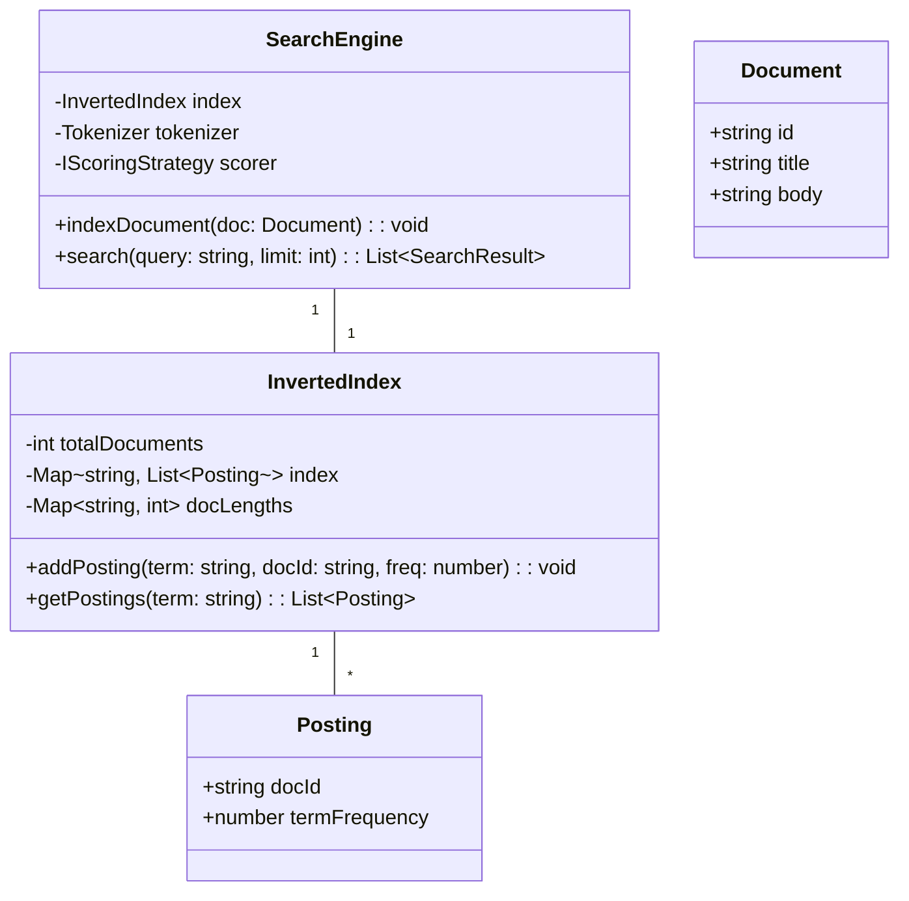

# 🛠️ Enterprise System Design Blueprint: Simple Search Engine

> **Target Role:** Principal / Staff Architect / Senior LLD & HLD Engineers  
> **Product Perspective:** Building a text search indexing engine using Inverted Indexes, Document Tokenization, and TF-IDF (Term Frequency-Inverse Document Frequency) relevance scoring.  
> **Navigation:** ⬅️ [Back to Data Structures & Search Index](./README.md) | 📅 [Problem Bank Index](../README.md)

---

## 1. 🎯 Requirements & Product Scope

### 📋 Functional Requirements (FR)
1. **Document Indexing:** Parse raw text documents into tokens, filter stop-words, apply stemming, and build an Inverted Index.
2. **Full-Text Keyword Search:** Support single-term and multi-term keyword search queries.
3. **TF-IDF Relevance Scoring:** Rank matched documents using Term Frequency-Inverse Document Frequency (TF-IDF) scoring algorithm.
4. **Boolean Queries:** Support boolean search queries (`AND`, `OR`, `NOT`).

### ⚡ Non-Functional Requirements (NFR)
1. **Fast Search Retrieval:** Query response times in $P_{99} < 50\text{ms}$ across millions of indexed documents.
2. **Incremental Indexing:** Support adding new documents to the index concurrently without rebuilding the global index.

---

## 2. 🧮 Scale & Mathematical Formulae

```
Mathematical Equations:
1. Term Frequency (TF):
   TF(t, d) = (Count of term t in doc d) / (Total terms in doc d)

2. Inverse Document Frequency (IDF):
   IDF(t, D) = ln( Total documents |D| / (1 + Documents containing term t) )

3. TF-IDF Score:
   Score(q, d) = ∑ [ TF(t, d) * IDF(t, D) ] for all query terms t in q

Scale Footprint:
- 10 Million Documents
- Avg Terms per Document: 500 words
- Inverted Index Size: ~5 GB RAM
```

---

## 3. 🛠️ Tech Stack & Architectural Justifications

| Component | Technology Choice | Architectural Rationale |
|:---|:---|:---|
| **Inverted Index** | HashMap + Posting List | `Map<Term, List<Posting>>` for instant $O(1)$ term lookup. |
| **Tokenizer & Stemmer** | Porter Stemmer Algorithm | Normalizes words (e.g., "running", "ran" -> "run"). |
| **Scoring Engine** | TF-IDF / BM25 Strategy | Standard mathematical relevance ranking. |

---

## 4. 📐 Visual UML Diagrams



---

## 5. 🧱 OOP & SOLID Principles Mapping

- **Single Responsibility Principle:** `Tokenizer` cleans text; `InvertedIndex` stores posting lists; `SearchEngine` computes TF-IDF scores.
- **Open/Closed Principle:** Ranking algorithm implements `IScoringStrategy` (TF-IDF, BM25, PageRank) without altering `SearchEngine`.

---

## 6. 🎨 Design Patterns Selection

1. **Inverted Index Pattern:** Core document search index representation.
2. **Strategy Pattern:** `IScoringStrategy` for pluggable search rankers.
3. **Pipeline Pattern:** Tokenization -> Stop-word Removal -> Stemming -> Indexing pipeline.

---

## 7. 💻 Production Code Blueprint (TypeScript)

```typescript
export class Posting {
  constructor(
    public readonly docId: string,
    public termFrequency: number
  ) {}
}

export class SearchResult {
  constructor(
    public readonly docId: string,
    public readonly score: number
  ) {}
}

export class InvertedIndex {
  // Term -> List of Postings (docId + frequency)
  private index: Map<string, Posting[]> = new Map();
  private docLengths: Map<string, number> = new Map();
  public totalDocuments: number = 0;

  public addDocument(docId: string, tokens: string[]): void {
    if (this.docLengths.has(docId)) return; // Already indexed

    this.totalDocuments++;
    this.docLengths.set(docId, tokens.length);

    // Compute term frequencies for this document
    const termCounts: Map<string, number> = new Map();
    for (const token of tokens) {
      termCounts.set(token, (termCounts.get(token) || 0) + 1);
    }

    for (const [term, count] of termCounts.entries()) {
      if (!this.index.has(term)) {
        this.index.set(term, []);
      }
      this.index.get(term)!.push(new Posting(docId, count));
    }
  }

  public getPostings(term: string): Posting[] {
    return this.index.get(term) || [];
  }

  public getDocLength(docId: string): number {
    return this.docLengths.get(docId) || 1;
  }
}

export class SimpleSearchEngine {
  private index: InvertedIndex = new InvertedIndex();
  private stopWords: Set<string> = new Set(['the', 'is', 'at', 'which', 'on', 'a', 'an', 'and']);

  public tokenize(text: string): string[] {
    return text
      .toLowerCase()
      .replace(/[^a-z0-9\s]/g, '')
      .split(/\s+/)
      .filter(word => word.length > 0 && !this.stopWords.has(word));
  }

  public indexDocument(docId: string, title: string, body: string): void {
    const tokens = this.tokenize(`${title} ${body}`);
    this.index.addDocument(docId, tokens);
  }

  public search(query: string, topN: number = 10): SearchResult[] {
    const queryTokens = this.tokenize(query);
    if (queryTokens.length === 0) return [];

    const docScores: Map<string, number> = new Map();

    for (const term of queryTokens) {
      const postings = this.index.getPostings(term);
      if (postings.length === 0) continue;

      // IDF = ln( TotalDocs / (1 + DocumentFrequency) )
      const idf = Math.log(this.index.totalDocuments / (1 + postings.length)) + 1;

      for (const posting of postings) {
        const docLength = this.index.getDocLength(posting.docId);
        const tf = posting.termFrequency / docLength;
        const tfIdf = tf * idf;

        docScores.set(posting.docId, (docScores.get(posting.docId) || 0) + tfIdf);
      }
    }

    const results: SearchResult[] = [];
    for (const [docId, score] of docScores.entries()) {
      results.push(new SearchResult(docId, score));
    }

    // Sort descending by TF-IDF relevance score
    return results.sort((a, b) => b.score - a.score).slice(0, topN);
  }
}
```

---

## 8. 🌐 High-Level Design (HLD) & Distributed Indexing

1. **Index Sharding:** Partition Inverted Index across $N$ shards by Document ID (Document-based partitioning) or Term (Term-based partitioning).
2. **Scatter-Gather Search:** Coordinator node queries all shards in parallel and merges top TF-IDF results.

---

## 9. 🎙️ Senior/Staff Level Grill Q&A

<details>
<summary><strong>Q1: What is the difference between Document Partitioning vs Term Partitioning in a distributed Search Engine (e.g. Elasticsearch)?</strong></summary>

**Answer:** 
* **Document Partitioning (Local Index):** Each shard holds an inverted index for a subset of documents. Queries must be broadcasted to **ALL shards** (Scatter-Gather), but document indexing is isolated to a single shard.
* **Term Partitioning (Global Index):** Each shard holds the full posting list for a subset of terms (e.g., terms `A-F` on Shard 1). Queries only hit shards corresponding to terms, but inserting a single document requires contacting multiple shards. Enterprise engines (Lucene/Elasticsearch) default to **Document Partitioning**.
</details>
