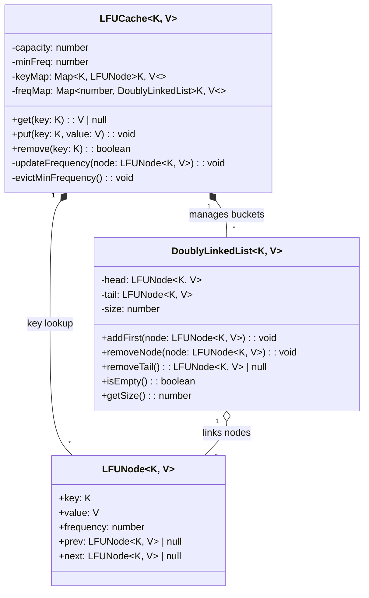
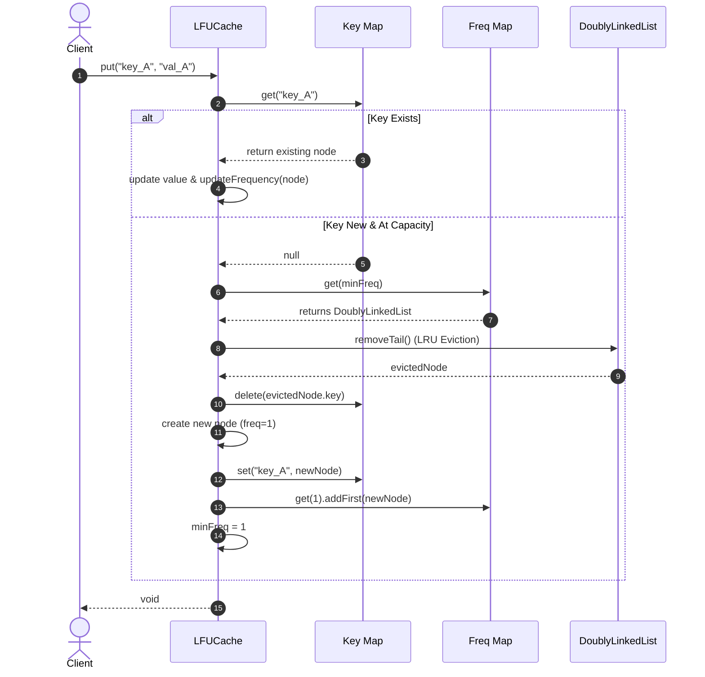

# 🛠️ Enterprise System Design Blueprint: Design LFU Cache

> **Target Role:** Principal / Staff Architect / Senior LLD & HLD Engineers  
> **Product Perspective:** Building an enterprise-grade, high-throughput Least Frequently Used (LFU) Cache in memory supporting $O(1)$ operations for access (`get`) and insertion (`put`), utilizing a frequency-to-DoublyLinkedList map and a dynamic minimum frequency pointer for LRU tie-breaking and sub-millisecond evictions.  
> **Navigation:** ⬅️ [Back to Data Structures & Search Index](./README.md) | 📅 [Problem Bank Index](../README.md)

---

## 1. 🎯 Requirements & Product Scope

### 📋 Functional Requirements (FR)
1. **$O(1)$ Time Complexity:** Both `get(key)` and `put(key, value)` operations MUST execute in strict $O(1)$ average time complexity.
2. **LFU Eviction Policy:** When the cache reaches maximum capacity, the item with the absolute lowest access frequency MUST be evicted.
3. **LRU Tie-Breaking:** If multiple items share the same lowest access frequency, the Least Recently Used (LRU) item among them MUST be evicted.
4. **Dynamic Frequency Increment:** Every `get` hit or `put` update of an existing key increments its access counter by 1 and moves it to the appropriate higher-frequency bucket.
5. **Key Removal & Access:** Support manual `remove(key)` and metadata inspection (`size()`, `getMinFrequency()`).

### ⚡ Non-Functional Requirements (NFR)
1. **Ultra-Low Latency:** $P_{99} < 1\text{ms}$ response latency for all operations at 500,000 QPS.
2. **Memory Efficiency:** Minimal memory footprint per node (no unbounded metadata overhead per node).
3. **Thread Safety & Scalability:** Concurrency-safe design supporting fine-grained locking or read-write locks for striped caching.

---

## 2. 🧮 Scale & Quantitative Estimates

```
Cache Capacity: 1,000,000 keys
Key Size: 32 Bytes (UUID / String)
Value Size: 1 KB (JSON Payload / Serialized Object)
Node Overhead: 64 Bytes (key, value, freq, prev pointer, next pointer)
Frequency Map Bucket Overhead: 32 Bytes per active frequency list

RAM Estimates:
- Raw Data: 1,000,000 * (32B + 1024B) = ~1.056 GB
- Node Metadata: 1,000,000 * 64B = 64 MB
- Hash Maps + Frequency DLL Headers: ~32 MB
Total Memory Footprint: ~1.15 GB RAM

Target Operations: 500,000 QPS Peak (Read 80%, Write 20%)
```

---

## 3. 🛠️ Tech Stack & Architectural Justifications

| Component | Technology Choice | Architectural Rationale |
|:---|:---|:---|
| **Node Lookup Table** | Hash Map (`Map<K, Node<K,V>>`) | Provides $O(1)$ direct key-to-node memory reference lookup. |
| **Frequency Bucket Table** | Frequency Map (`Map<number, DoublyLinkedList>`) | Maps frequency integer $F$ to a dedicated Doubly LinkedList of nodes with frequency $F$. |
| **Tie-Breaking Eviction** | Doubly LinkedList (LRU per bucket) | Tail node of `FrequencyMap[minFreq]` is evicted in $O(1)$ time. |
| **Frequency Tracker** | Primitive Integer (`minFreq`) | Tracks current minimum frequency across the cache in $O(1)$ without scanning. |

---

## 4. 📐 Visual UML Diagrams

### 🏗️ Class Diagram



### 🔄 Sequence Diagram: `put()` with Frequency Increment & LRU Eviction



---

## 5. 🧱 OOP & SOLID Principles Mapping

- **Single Responsibility Principle (SRP):** `LFUNode` stores raw data and frequency state; `DoublyLinkedList` handles ordering and sentinel pointer operations; `LFUCache` manages capacity invariants and bucket maps.
- **Open/Closed Principle (OCP):** Frequency aging/decay strategies can be integrated via an `IFrequencyDecayPolicy` interface without modifying core lookup structures.
- **Liskov Substitution Principle (LSP):** Concrete eviction mechanisms implement `IEvictionStrategy<K, V>`.
- **Interface Segregation Principle (ISP):** Read and write cache capabilities separated via `ICacheReader<K, V>` and `ICacheWriter<K, V>`.

---

## 6. 🎨 Design Patterns Selection

1. **Composite Data Structure Pattern:** HashMap + Frequency Map + Doubly LinkedList working in unison to achieve $O(1)$ access and eviction.
2. **Sentinel Node Pattern:** Dummy `head` and `tail` nodes in each `DoublyLinkedList` eliminate null-pointer checks during node removal/insertion.
3. **Strategy Pattern:** Pluggable eviction policy support (LRU vs LFU vs ARC).

---

## 7. 💻 Production Code Blueprint (TypeScript)

```typescript
/**
 * LFU Cache Node containing key, value, access frequency, and pointer references.
 */
export class LFUNode<K, V> {
  public prev: LFUNode<K, V> | null = null;
  public next: LFUNode<K, V> | null = null;
  public frequency: number = 1;

  constructor(
    public key: K,
    public value: V
  ) {}
}

/**
 * Thread-safe-ready Doubly LinkedList with Sentinel Head and Tail.
 */
export class DoublyLinkedList<K, V> {
  private head: LFUNode<K, V>;
  private tail: LFUNode<K, V>;
  private count: number = 0;

  constructor() {
    this.head = new LFUNode<any, any>(null, null);
    this.tail = new LFUNode<any, any>(null, null);
    this.head.next = this.tail;
    this.tail.prev = this.head;
  }

  public addFirst(node: LFUNode<K, V>): void {
    node.next = this.head.next;
    node.prev = this.head;
    this.head.next!.prev = node;
    this.head.next = node;
    this.count++;
  }

  public removeNode(node: LFUNode<K, V>): void {
    if (!node.prev || !node.next) return;
    const prevNode = node.prev;
    const nextNode = node.next;
    prevNode.next = nextNode;
    nextNode.prev = prevNode;
    node.prev = null;
    node.next = null;
    this.count--;
  }

  public removeTail(): LFUNode<K, V> | null {
    if (this.count === 0) return null;
    const lruNode = this.tail.prev!;
    this.removeNode(lruNode);
    return lruNode;
  }

  public isEmpty(): boolean {
    return this.count === 0;
  }

  public getSize(): number {
    return this.count;
  }
}

/**
 * Production O(1) LFU Cache Implementation.
 */
export class LFUCache<K, V> {
  private keyMap: Map<K, LFUNode<K, V>> = new Map();
  private freqMap: Map<number, DoublyLinkedList<K, V>> = new Map();
  private minFreq: number = 0;

  constructor(public readonly capacity: number) {
    if (capacity <= 0) {
      throw new Error('Cache capacity must be greater than zero.');
    }
  }

  /**
   * Retrieves value for key in O(1) time and updates access frequency.
   */
  public get(key: K): V | null {
    const node = this.keyMap.get(key);
    if (!node) return null;

    this.updateFrequency(node);
    return node.value;
  }

  /**
   * Inserts or updates key-value pair in O(1) time.
   */
  public put(key: K, value: V): void {
    const existingNode = this.keyMap.get(key);

    if (existingNode) {
      existingNode.value = value;
      this.updateFrequency(existingNode);
      return;
    }

    if (this.keyMap.size >= this.capacity) {
      this.evictMinFrequency();
    }

    const newNode = new LFUNode(key, value);
    this.keyMap.set(key, newNode);
    this.getOrCreateFreqList(1).addFirst(newNode);
    this.minFreq = 1;
  }

  /**
   * Removes a specific key from the cache in O(1).
   */
  public remove(key: K): boolean {
    const node = this.keyMap.get(key);
    if (!node) return false;

    const list = this.freqMap.get(node.frequency);
    if (list) {
      list.removeNode(node);
      if (list.isEmpty() && this.minFreq === node.frequency) {
        this.freqMap.delete(node.frequency);
      }
    }
    this.keyMap.delete(key);
    return true;
  }

  private updateFrequency(node: LFUNode<K, V>): void {
    const oldFreq = node.frequency;
    const oldList = this.freqMap.get(oldFreq)!;
    oldList.removeNode(node);

    if (oldList.isEmpty()) {
      this.freqMap.delete(oldFreq);
      if (this.minFreq === oldFreq) {
        this.minFreq++;
      }
    }

    node.frequency++;
    this.getOrCreateFreqList(node.frequency).addFirst(node);
  }

  private evictMinFrequency(): void {
    const minFreqList = this.freqMap.get(this.minFreq);
    if (!minFreqList || minFreqList.isEmpty()) return;

    const evictedNode = minFreqList.removeTail();
    if (evictedNode) {
      this.keyMap.delete(evictedNode.key);
      if (minFreqList.isEmpty()) {
        this.freqMap.delete(this.minFreq);
      }
    }
  }

  private getOrCreateFreqList(freq: number): DoublyLinkedList<K, V> {
    let list = this.freqMap.get(freq);
    if (!list) {
      list = new DoublyLinkedList<K, V>();
      this.freqMap.set(freq, list);
    }
    return list;
  }

  public size(): number {
    return this.keyMap.size;
  }

  public getMinFrequency(): number {
    return this.minFreq;
  }
}
```

---

## 8. 🌐 High-Level Design (HLD) & Scale Bottlenecks

```mermaid
flowchart TD
    Client[Client Requests] --> LoadBalancer[Layer 7 Load Balancer]
    LoadBalancer --> CacheShard1[Cache Shard 0 (Keys A-G)]
    LoadBalancer --> CacheShard2[Cache Shard 1 (Keys H-N)]
    LoadBalancer --> CacheShard3[Cache Shard 2 (Keys O-Z)]

    subgraph Sharded LFUCache [Striped LFU In-Memory Architecture]
        CacheShard1 --> LFU1[LFUCache Instance 0]
        CacheShard2 --> LFU2[LFUCache Instance 1]
        CacheShard3 --> LFU3[LFUCache Instance 2]
    end
```

1. **Lock Contention on `minFreq` & Maps:** Single lock across the entire LFU Cache serializes access. **Solution:** Stripe/Shard the cache into $N$ independent `LFUCache` instances using hash partitioning (`hash(key) % N`).
2. **Frequency Starvation (Stale Frequency Problem):** Items accessed 10,000 times yesterday may clog the cache even if never accessed today. **Solution:** Implement **Frequency Aging / Decay Epochs**,halving frequency counters periodically or subtracting an aging delta ($F_{new} = \max(1, F_{old} >> 1)$).

---

## 9. 🎙️ Senior/Staff Level Grill Q&A

<details>
<summary><strong>Q1: Why does LFU require both a key map AND a frequency map of Doubly LinkedLists to guarantee O(1) performance?</strong></summary>

**Answer:**
A plain Min-Heap for frequencies provides $O(\log N)$ update and eviction. A single LinkedList requires $O(N)$ scanning. By maintaining:
1. `keyMap`: $O(1)$ key to `LFUNode` lookup.
2. `freqMap`: $O(1)$ access to a `DoublyLinkedList` representing all nodes with frequency $F$.
3. `minFreq`: $O(1)$ reference to the lowest non-empty frequency list.

When a key is accessed, we remove its node from `freqMap[F]` in $O(1)$ via prev/next pointers and prepend to `freqMap[F+1]` in $O(1)$. Eviction removes `freqMap[minFreq].tail` in $O(1)$.
</details>

<details>
<summary><strong>Q2: How do you handle the "Frequency Pollution / Stale Key" problem in production LFU caches?</strong></summary>

**Answer:**
Early burst requests can inflate a key's frequency to 10,000. When its popularity drops, it remains immune to eviction over newly inserted keys with frequency 1.
**Mitigations:**
- **Dynamic Aging (Decay Factor):** Periodically (e.g., every $T$ seconds or $M$ operations), iterate active nodes or apply decay upon access ($F = \lfloor F \times e^{-\lambda \Delta t} \rfloor$).
- **Frequency Capping:** Cap max frequency at a bound (e.g., 255) so legacy items easily drop down to eviction threshold.
- **TinyLFU Architecture:** Use a Count-Min Sketch for probabilistic frequency estimation instead of explicit counters per node.
</details>

<details>
<summary><strong>Q3: How do you achieve concurrent multi-threaded safety without bottlenecking throughput?</strong></summary>

**Answer:**
1. **Lock Striping / Sharding:** Partition keys across $N$ cache segments (e.g., 16 or 64 lock segments), reducing lock collision probability to $1/N$.
2. **Read-Write Locking:** Allow concurrent `get` reads provided frequency promotion is deferred to an asynchronous ring-buffer mutation queue.
3. **Lock-Free Buckets:** Use lock-free concurrent hash maps for key lookups and CAS atomic operations on per-frequency atomic pointers.
</details>
