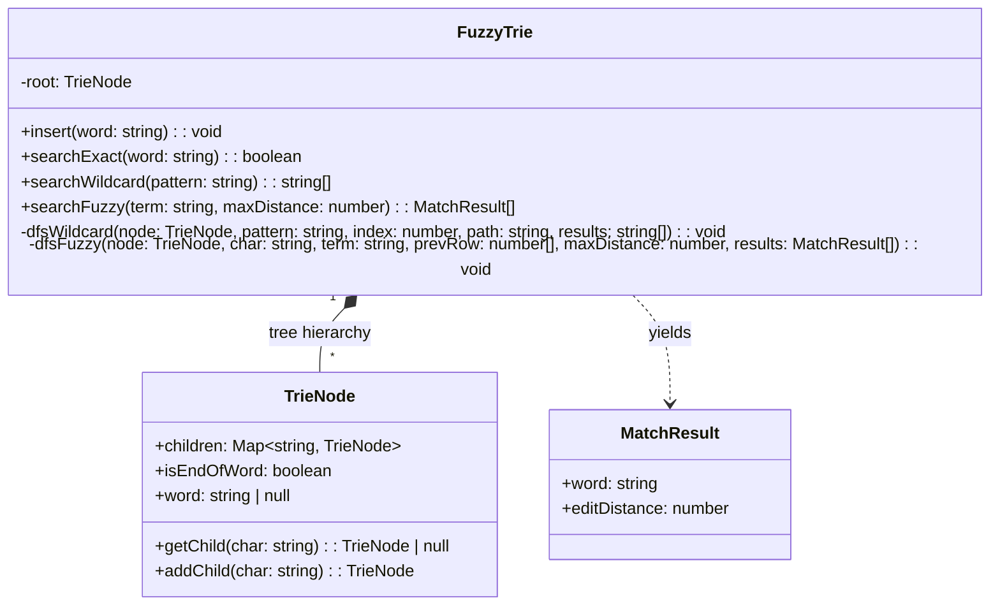
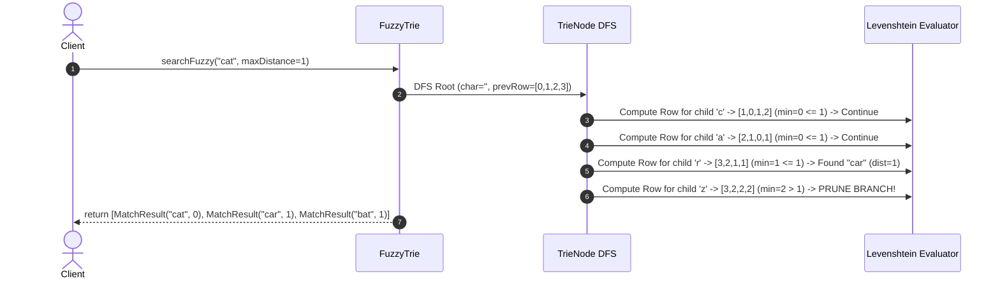
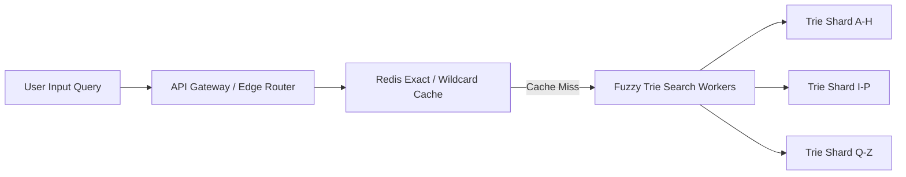

# 🛠️ Enterprise System Design Blueprint: Design Trie with Wildcard & Levenshtein Fuzzy Search

> **Target Role:** Principal / Staff Architect / Senior LLD & HLD Engineers  
> **Product Perspective:** Building an enterprise high-performance prefix search engine supporting exact matches, single-character wildcard matching (`.`), and fuzzy matching within a maximum Levenshtein edit distance using DFS state pruning over a Trie structure.  
> **Navigation:** ⬅️ [Back to Data Structures & Search Index](./README.md) | 📅 [Problem Bank Index](../README.md)

---

## 1. 🎯 Requirements & Product Scope

### 📋 Functional Requirements (FR)
1. **Dictionary Insertion:** `insert(word: string, payload?: T)` adds words into the search structure in $O(L)$ time ($L = \text{word length}$).
2. **Exact Search:** `searchExact(word: string): boolean` returns true if exact word exists.
3. **Prefix Search:** `startsWith(prefix: string): string[]` returns all words beginning with prefix.
4. **Wildcard Search:** `searchWildcard(pattern: string): string[]` supports '.' matching any single character.
5. **Fuzzy Match (Levenshtein Distance):** `searchFuzzy(term: string, maxEditDistance: number): MatchResult[]` returns all words within `maxEditDistance` (supporting insertions, deletions, substitutions).

### ⚡ Non-Functional Requirements (NFR)
1. **Ultra-Low Latency:** Exact match $<1\text{ms}$, Fuzzy match $<15\text{ms}$ over 500,000 dictionary words.
2. **Branch Pruning Efficiency:** Fuzzy search must prune Trie traversal branches as soon as the calculated minimum edit distance row exceeds `maxEditDistance`.
3. **Memory Footprint:** Optimize pointer overhead per node using dynamically allocated child maps.

---

## 2. 🧮 Scale & Quantitative Estimates

```
Dictionary Size: 500,000 words
Avg Word Length: 8-10 characters
Alphabet Size: 26 (a-z) + extended ASCII

Memory Allocation:
- Standard Trie Nodes: ~3,000,000 nodes due to shared prefixes
- Node Overhead: Map/Array pointers (~48B) + isEndOfWord boolean (1B) + word string reference (8B)
- Node Memory: 3M * 64B = ~192 MB RAM

Query Throughput:
- Exact Queries: 100,000 QPS Peak
- Fuzzy Search Queries: 5,000 QPS Peak
```

---

## 3. 🛠️ Tech Stack & Architectural Justifications

| Component | Technology Choice | Architectural Rationale |
|:---|:---|:---|
| **Prefix Tree Storage** | Dynamic Trie (`TrieNode`) | $O(L)$ time complexity for insertions and prefix lookups. |
| **Child Node Indexing** | `Map<char, TrieNode>` / Array | Fast key lookup; handles variable character sets efficiently without static 26-element array bloat. |
| **Fuzzy Matching Algo** | Recursive Trie DFS + DP Row Vector | Computes Levenshtein matrix on the fly line-by-line during DFS, pruning subtrees immediately when `min(row) > maxEditDistance`. |

---

## 4. 📐 Visual UML Diagrams

### 🏗️ Class Diagram



### 🔄 Sequence Diagram: Fuzzy Search Branch Pruning



---

## 5. 🧱 OOP & SOLID Principles Mapping

- **Single Responsibility Principle (SRP):** `TrieNode` manages structural tree links; `FuzzyTrie` coordinates search algorithms; `MatchResult` encapsulates query output data.
- **Open/Closed Principle (OCP):** Algorithm strategies (Exact vs Wildcard vs Levenshtein vs Damerau-Levenshtein) are decoupled and extensible.
- **Interface Segregation Principle (ISP):** Read-only prefix queries (`IPrefixSearchEngine`) separated from mutation interfaces (`IDictionaryBuilder`).

---

## 6. 🎨 Design Patterns Selection

1. **Composite Pattern:** Trie tree structure where nodes contain children of identical node types.
2. **Strategy / Visitor Pattern:** Search algorithms (Wildcard DFS vs Dynamic Programming Levenshtein row evaluation) act as strategy traversals over the Trie graph.
3. **Flyweight Pattern:** Common prefix strings share parent node paths, drastically minimizing redundant character storage.

---

## 7. 💻 Production Code Blueprint (TypeScript)

```typescript
export interface MatchResult {
  word: string;
  editDistance: number;
}

export class TrieNode {
  public children: Map<string, TrieNode> = new Map();
  public isEndOfWord: boolean = false;
  public word: string | null = null;

  public getChild(char: string): TrieNode | undefined {
    return this.children.get(char);
  }

  public addChild(char: string): TrieNode {
    let child = this.children.get(char);
    if (!child) {
      child = new TrieNode();
      this.children.set(char, child);
    }
    return child;
  }
}

export class FuzzyTrie {
  private root: TrieNode = new TrieNode();

  /**
   * Inserts a word into the Trie. Time Complexity: O(L)
   */
  public insert(word: string): void {
    if (!word) return;
    let current = this.root;
    for (const char of word.toLowerCase()) {
      current = current.addChild(char);
    }
    current.isEndOfWord = true;
    current.word = word.toLowerCase();
  }

  /**
   * Exact word lookup. Time Complexity: O(L)
   */
  public searchExact(word: string): boolean {
    if (!word) return false;
    let current = this.root;
    for (const char of word.toLowerCase()) {
      const child = current.getChild(char);
      if (!child) return false;
      current = child;
    }
    return current.isEndOfWord;
  }

  /**
   * Wildcard search supporting '.' for any single character.
   */
  public searchWildcard(pattern: string): string[] {
    const results: string[] = [];
    this.dfsWildcard(this.root, pattern.toLowerCase(), 0, results);
    return results;
  }

  private dfsWildcard(
    node: TrieNode,
    pattern: string,
    index: number,
    results: string[]
  ): void {
    if (index === pattern.length) {
      if (node.isEndOfWord && node.word) {
        results.push(node.word);
      }
      return;
    }

    const char = pattern[index];
    if (char === '.') {
      for (const child of node.children.values()) {
        this.dfsWildcard(child, pattern, index + 1, results);
      }
    } else {
      const child = node.getChild(char);
      if (child) {
        this.dfsWildcard(child, pattern, index + 1, results);
      }
    }
  }

  /**
   * Fuzzy Search using Levenshtein Edit Distance with Trie DFS Pruning.
   * Time Complexity: O(N_pruned) << O(Alphabet^L)
   */
  public searchFuzzy(term: string, maxEditDistance: number): MatchResult[] {
    const target = term.toLowerCase();
    const results: MatchResult[] = [];

    // Initial DP row: [0, 1, 2, ..., target.length]
    const initialRow: number[] = Array.from({ length: target.length + 1 }, (_, i) => i);

    for (const [char, childNode] of this.root.children.entries()) {
      this.dfsFuzzy(childNode, char, target, initialRow, maxEditDistance, results);
    }

    return results.sort((a, b) => a.editDistance - b.editDistance);
  }

  private dfsFuzzy(
    node: TrieNode,
    char: string,
    target: string,
    prevRow: number[],
    maxDistance: number,
    results: MatchResult[]
  ): void {
    const currentRow: number[] = [prevRow[0] + 1];

    // Compute Levenshtein distance for current character against target string
    for (let j = 1; j <= target.length; j++) {
      const insertCost = currentRow[j - 1] + 1;
      const deleteCost = prevRow[j] + 1;
      const replaceCost = prevRow[j - 1] + (char === target[j - 1] ? 0 : 1);

      currentRow[j] = Math.min(insertCost, deleteCost, replaceCost);
    }

    const currentDistance = currentRow[target.length];

    // If node completes a word and distance is within threshold, record match
    if (node.isEndOfWord && node.word && currentDistance <= maxDistance) {
      results.push({ word: node.word, editDistance: currentDistance });
    }

    // PRUNING CRITERIA: Check if minimum element in currentRow exceeds maxDistance
    const minRowValue = Math.min(...currentRow);
    if (minRowValue <= maxDistance) {
      for (const [nextChar, childNode] of node.children.entries()) {
        this.dfsFuzzy(childNode, nextChar, target, currentRow, maxDistance, results);
      }
    }
    // Else: Subtree pruned! Branch cannot yield any string with distance <= maxDistance.
  }
}
```

---

## 8. 🌐 High-Level Design (HLD) & Scale Bottlenecks



1. **Pointer Overhead Memory Bloat:** Standard Trie nodes consume heavy pointer memory. **Solution:** Compress long non-branching node paths into **Radix Tree / Patricia Trie** nodes.
2. **Fuzzy Search Scalability on High Distance ($k \ge 3$):** Pruning efficiency degrades as max edit distance increases. **Solution:** Use **SymSpell (Symmetric Delete Algorithm)** or **Automata (Levenshtein Automaton with BK-Tree)** for queries requiring edit distance $>2$.

---

## 9. 🎙️ Senior/Staff Level Grill Q&A

<details>
<summary><strong>Q1: How does line-by-line Levenshtein DP calculation over a Trie achieve massive speedups over checking dictionary words individually?</strong></summary>

**Answer:**
Checking $N$ dictionary words individually against a target requires computing $N$ full Levenshtein tables ($O(N \times L^2)$).
With Trie-based DFS:
1. **Shared Computation:** Words with common prefixes (e.g. `cat`, `cater`, `cats`, `category`) evaluate prefix `cat` DP values **once**.
2. **Early Branch Pruning:** If at depth 3 the minimum element of `currentRow` exceeds `maxEditDistance`, the entire subtree containing millions of descendant words is skipped immediately in $O(1)$.
</details>

<details>
<summary><strong>Q2: Why is Map used for `children` instead of a fixed 26-element array?</strong></summary>

**Answer:**
A fixed 26-element array (`TrieNode[26]`) consumes 26 pointers (208 bytes) per node regardless of how many children exist. For sparse nodes averaging 2-3 children, 90% of memory is wasted. A dynamic `Map<string, TrieNode>` allocates pointers only for existing characters, cutting memory footprint by up to 75% for enterprise scale dictionaries.
</details>

<details>
<summary><strong>Q3: How do you handle multi-word phrase matching and unicode tokenization?</strong></summary>

**Answer:**
1. **Normalization:** Convert input strings via Unicode Normalization Form C (NFC) and lowercasing.
2. **Word Boundary Tokenization:** Split phrases into distinct tokens and query the Trie per token, combining results via inverted index posting lists.
</details>
