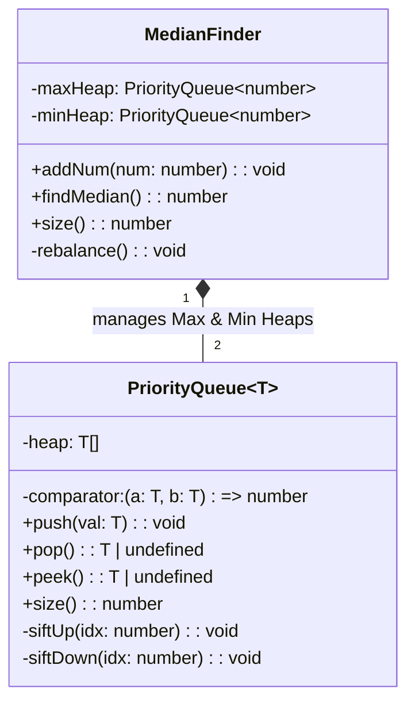
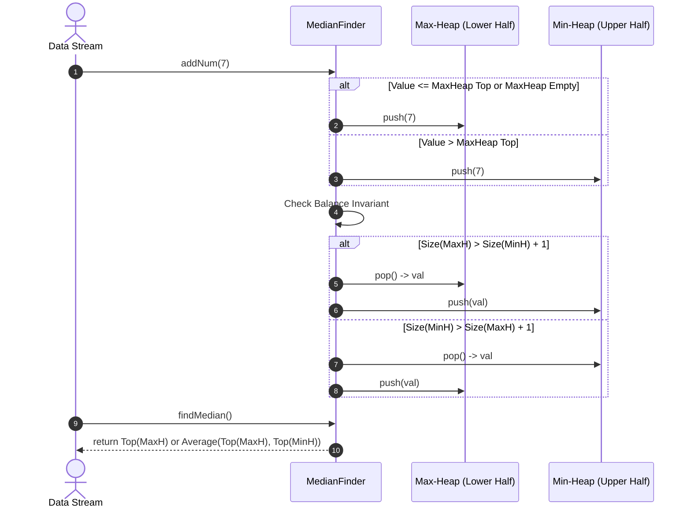
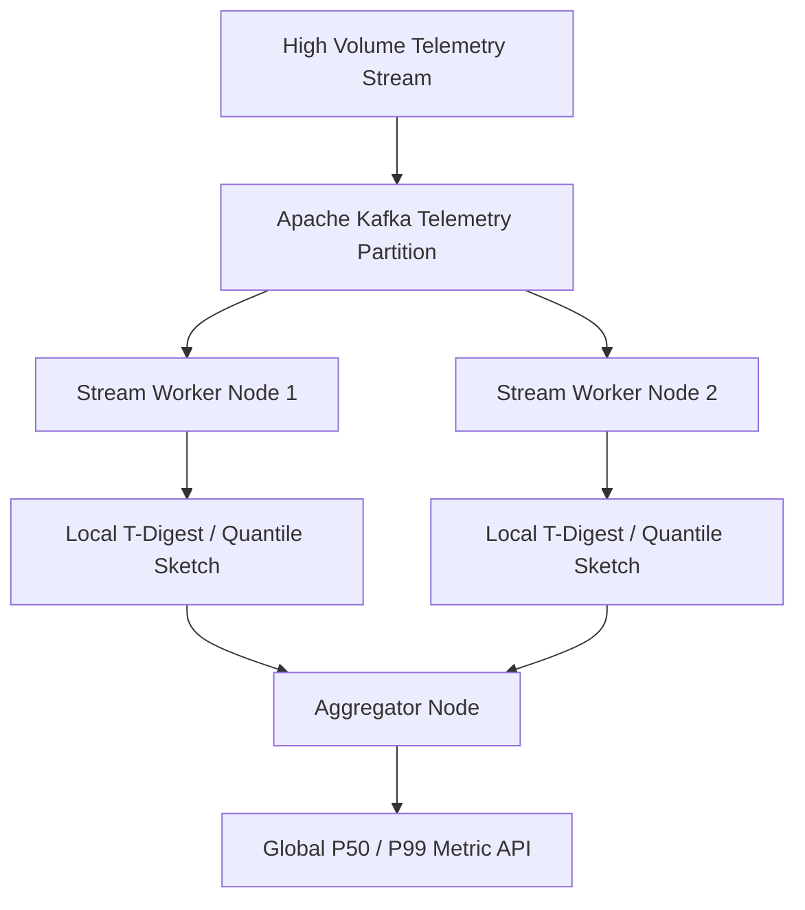

# 🛠️ Enterprise System Design Blueprint: Design Streaming Median Finder

> **Target Role:** Principal / Staff Architect / Senior LLD & HLD Engineers  
> **Product Perspective:** Building an enterprise-grade real-time streaming numeric accumulator capable of dynamically calculating the exact median of continuous data streams in $O(1)$ time complexity while inserting incoming elements in $O(\log N)$ time using a dual balanced heap architecture (Max-Heap + Min-Heap).  
> **Navigation:** ⬅️ [Back to Data Structures & Search Index](./README.md) | 📅 [Problem Bank Index](../README.md)

---

## 1. 🎯 Requirements & Product Scope

### 📋 Functional Requirements (FR)
1. **Dynamic Number Stream Processing:** `addNum(num: number): void` accepts continuous incoming integer/float values in $O(\log N)$ time.
2. **$O(1)$ Median Retrieval:** `findMedian(): number` calculates and returns the current exact median in $O(1)$ time.
3. **Odd/Even Stream Balancing:**
   - For odd total elements $N$, return top of the larger heap.
   - For even total elements $N$, return the arithmetic average of the tops of both heaps.
4. **Heap Size Invariant:** Maintain $| \text{Size}(\text{MaxHeap}) - \text{Size}(\text{MinHeap}) | \le 1$ at all times.

### ⚡ Non-Functional Requirements (NFR)
1. **Throughput & Latency:** Support $>1,000,000$ numerical events per second with sub-microsecond insertion latency ($P_{99} < 50\mu\text{s}$).
2. **Zero Allocation Steady State:** Minimize memory thrashing during continuous binary heap rebalancing.
3. **Precision:** High-precision double floating point arithmetic for median calculation.

---

## 2. 🧮 Scale & Quantitative Estimates

```
Stream Rate: 1,000,000 events/second
Window Buffer Capacity: 100,000,000 numeric events (Active Memory Buffer)

Memory Estimation:
- 64-bit Float numbers: 8 Bytes per element
- Binary Heap Array representation: 2 arrays of size 50M each
- Heap Array Storage: 100,000,000 * 8B = ~800 MB RAM
- Auxiliary Overhead: ~20 MB RAM
Total System RAM: ~820 MB

Time Complexity Guarantees:
- addNum(): O(log N) heap bubble-up / sift-down operations
- findMedian(): O(1) direct array root read
```

---

## 3. 🛠️ Tech Stack & Architectural Justifications

| Component | Technology Choice | Architectural Rationale |
|:---|:---|:---|
| **Lower Half Storage** | Max-Heap (`PriorityQueue<T>`) | Stores the lower $\lfloor N/2 \rfloor$ elements. Top element is the largest value of the lower half. |
| **Upper Half Storage** | Min-Heap (`PriorityQueue<T>`) | Stores the upper $\lceil N/2 \rceil$ elements. Top element is the smallest value of the upper half. |
| **Heap Storage Structure** | Continuous Dynamic Array (`number[]`) | Flat memory layout offers maximum CPU L1/L2 cache locality compared to tree-pointer nodes. |

---

## 4. 📐 Visual UML Diagrams

### 🏗️ Class Diagram



### 🔄 Sequence Diagram: `addNum()` and Dual-Heap Rebalancing



---

## 5. 🧱 OOP & SOLID Principles Mapping

- **Single Responsibility Principle (SRP):** `PriorityQueue` encapsulates binary heap mechanics; `MedianFinder` enforces balance invariants and median computation logic.
- **Open/Closed Principle (OCP):** Dynamic streaming behavior can be swapped with sliding window medians via pluggable decay window policies.
- **Dependency Inversion Principle (DIP):** `PriorityQueue` depends on generic comparator functions `(a, b) => number`.

---

## 6. 🎨 Design Patterns Selection

1. **Dual Heap Pattern:** Standard design pattern for finding exact median/quantiles in streaming data without sorting.
2. **Strategy Pattern:** Injecting custom comparison predicates to configure Max-Heap vs Min-Heap behavior.
3. **Adapter Pattern:** Wrapping dynamic array primitives into high-level priority queue abstractions.

---

## 7. 💻 Production Code Blueprint (TypeScript)

```typescript
/**
 * Generic Binary Heap Priority Queue implementation.
 */
export class PriorityQueue<T> {
  private heap: T[] = [];

  constructor(private comparator: (a: T, b: T) => number) {}

  public push(val: T): void {
    this.heap.push(val);
    this.siftUp(this.heap.length - 1);
  }

  public pop(): T | undefined {
    if (this.size() === 0) return undefined;
    const top = this.heap[0];
    const bottom = this.heap.pop()!;
    if (this.size() > 0) {
      this.heap[0] = bottom;
      this.siftDown(0);
    }
    return top;
  }

  public peek(): T | undefined {
    return this.heap[0];
  }

  public size(): number {
    return this.heap.length;
  }

  private siftUp(index: number): void {
    let current = index;
    while (current > 0) {
      const parent = Math.floor((current - 1) / 2);
      if (this.comparator(this.heap[current], this.heap[parent]) < 0) {
        this.swap(current, parent);
        current = parent;
      } else {
        break;
      }
    }
  }

  private siftDown(index: number): void {
    let current = index;
    const length = this.heap.length;

    while (true) {
      let candidate = current;
      const left = 2 * current + 1;
      const right = 2 * current + 2;

      if (
        left < length &&
        this.comparator(this.heap[left], this.heap[candidate]) < 0
      ) {
        candidate = left;
      }
      if (
        right < length &&
        this.comparator(this.heap[right], this.heap[candidate]) < 0
      ) {
        candidate = right;
      }

      if (candidate !== current) {
        this.swap(current, candidate);
        current = candidate;
      } else {
        break;
      }
    }
  }

  private swap(i: number, j: number): void {
    const temp = this.heap[i];
    this.heap[i] = this.heap[j];
    this.heap[j] = temp;
  }
}

/**
 * Production Streaming Median Finder using Dual Balanced Heaps.
 */
export class MedianFinder {
  // Max-Heap stores lower half (largest value at root)
  private maxHeap: PriorityQueue<number> = new PriorityQueue((a, b) => b - a);
  // Min-Heap stores upper half (smallest value at root)
  private minHeap: PriorityQueue<number> = new PriorityQueue((a, b) => a - b);

  /**
   * Adds a number from stream. Time Complexity: O(log N)
   */
  public addNum(num: number): void {
    const maxTop = this.maxHeap.peek();

    if (maxTop === undefined || num <= maxTop) {
      this.maxHeap.push(num);
    } else {
      this.minHeap.push(num);
    }

    this.rebalance();
  }

  /**
   * Calculates median of stream. Time Complexity: O(1)
   */
  public findMedian(): number {
    const totalSize = this.size();
    if (totalSize === 0) {
      throw new Error('Cannot compute median on an empty data stream.');
    }

    if (this.maxHeap.size() > this.minHeap.size()) {
      return this.maxHeap.peek()!;
    } else if (this.minHeap.size() > this.maxHeap.size()) {
      return this.minHeap.peek()!;
    } else {
      return (this.maxHeap.peek()! + this.minHeap.peek()!) / 2.0;
    }
  }

  private rebalance(): void {
    if (this.maxHeap.size() > this.minHeap.size() + 1) {
      const val = this.maxHeap.pop()!;
      this.minHeap.push(val);
    } else if (this.minHeap.size() > this.maxHeap.size() + 1) {
      const val = this.minHeap.pop()!;
      this.maxHeap.push(val);
    }
  }

  public size(): number {
    return this.maxHeap.size() + this.minHeap.size();
  }
}
```

---

## 8. 🌐 High-Level Design (HLD) & Scale Bottlenecks



1. **Unbounded Stream Memory Growth:** Infinite numerical streams eventually exceed single-machine RAM. **Solution:** Implement **Sliding Window Median** using a dual heap with delayed soft-deletion hash map, or order-statistic tree (Treap/AVL).
2. **Distributed Quantiles across 100 Cluster Worker Nodes:** Computing absolute exact median across distributed workers requires full shuffle. **Solution:** Use **T-Digest** or **Q-Digest** streaming data structures to aggregate mergeable sketches with proven sub-1% percentile error bounds.

---

## 9. 🎙️ Senior/Staff Level Grill Q&A

<details>
<summary><strong>Q1: Why is a dual heap preferred over a single self-balancing Binary Search Tree (AVL / Red-Black Tree)?</strong></summary>

**Answer:**
1. **Cache Locality:** Dual heaps are backed by contiguous dynamic flat arrays, eliminating pointer chasing and maximizing CPU L1/L2 cache prefetching.
2. **O(1) Access:** `findMedian()` reads array index 0 directly in $O(1)$ cycles, while order-statistic tree node lookup requires traversing tree pointers.
3. **Implementation Simplicity:** BST rebalancing requires complex tree rotations (RR, LL, RL, LR), whereas heap sift operations are linear array swaps.
</details>

<details>
<summary><strong>Q2: How do you modify this architecture to support a Sliding Window Median of size K (e.g. median of last 10,000 metrics)?</strong></summary>

**Answer:**
When elements expire outside window $K$, they must be removed from the heaps:
- **Lazy Eviction with Hash Map:** Maintain a `Map<number, number>` tracking expired counts. When popping from heap top, check if element is expired; if so, pop and discard.
- **Order-Statistic Tree (Treap / Segment Tree):** Supports $O(\log K)$ index insertion, deletion, and $K/2$-th rank lookup directly.
</details>

<details>
<summary><strong>Q3: How do you compute global streaming median across 1,000 worker servers handling 10 million events/sec?</strong></summary>

**Answer:**
Exact distributed median requires gathering all 10M records into a centralized node ($O(N)$ data movement). In enterprise systems, approximate quantiles are computed using **T-Digest** sketches:
1. Each worker node maintains a compact local `T-Digest` sketch (~10 KB footprint).
2. Sketches are periodically sent to an aggregator node.
3. Sketches are mergeable ($T_{global} = \text{Merge}(T_1, T_2, \dots, T_k)$), allowing computation of $P_{50}$ (Median), $P_{95}$, and $P_{99}$ with $<0.5\%$ error bounds.
</details>
